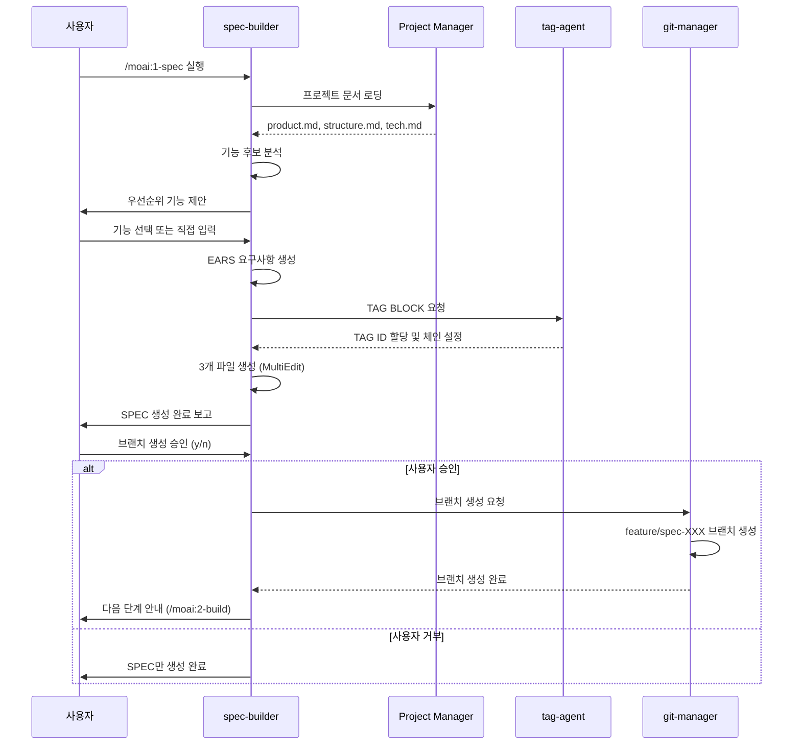

# spec-builder - SPEC 작성 전담 에이전트

## 개요

spec-builder는 MoAI-ADK의 3단계 워크플로우 중 **1단계(/moai:1-spec)**를 담당하는 핵심 에이전트입니다. EARS 방법론 기반의 체계적인 요구사항 작성과 프로젝트 문서 분석을 통해 고품질 SPEC을 생성합니다.

### 역할과 책임

**핵심 역할**: 명세 없이는 코드 없음 (No SPEC, No Code) 원칙 구현

- 프로젝트 문서(.moai/project/)를 분석하여 기능 후보 도출
- EARS 방법론 기반 체계적 요구사항 작성
- Personal/Team 모드에 최적화된 산출물 생성
- TAG BLOCK 자동 설정 및 추적성 확보

### 3단계 워크플로우에서의 위치

```mermaid
graph LR
    A[/moai:1-spec] -->|SPEC 생성| B[/moai:2-build]
    B -->|코드 구현| C[/moai:3-sync]
    C -->|문서 동기화| D[완료]

```

**spec-builder 활성화 시점**: 사용자가 `/moai:1-spec` 명령어를 실행하거나 새로운 기능 명세가 필요한 시점

### 다른 에이전트와의 협력

- **입력**: 프로젝트 문서(product.md, structure.md, tech.md)
- **출력**:
  - Personal 모드: `.moai/specs/SPEC-XXX/` 디렉토리 (3개 파일)
  - Team 모드: GitHub Issue 생성 요청
- **연계**:
  - git-manager: 브랜치 생성 및 PR 요청 (사용자 확인 필수)
  - code-builder: 생성된 SPEC 기반 구현 계획 수립
  - tag-agent: @TAG 체인 생성 및 검증

---

## 핵심 기능

### 1. 프로젝트 문서 분석

**자동 기능 후보 도출**:

spec-builder는 `.moai/project/` 디렉토리의 3개 핵심 문서를 분석하여 구현 가능한 기능 후보를 자동으로 제안합니다.

분석 대상 문서:
- `product.md`: 비즈니스 요구사항, 사용자 니즈, 성공 지표
- `structure.md`: 시스템 아키텍처, 모듈 설계, 통합 전략
- `tech.md`: 기술 스택, 품질 게이트, 배포 전략

**추출 알고리즘**:
1. 문서에서 TODO, @SPEC, 우선순위 항목 식별
2. 의존성 관계 분석 및 구현 가능성 평가
3. 사용자 가치와 기술적 실현 가능성 점수화
4. 상위 5개 우선순위 기능 제안

### 2. EARS 요구사항 작성

**EARS (Easy Approach to Requirements Syntax)**: 체계적이고 모호하지 않은 요구사항 작성 방법론

#### EARS 5가지 구문

| 구문 타입 | 패턴 | 예시 |
|----------|------|------|
| **Ubiquitous** | 시스템은 [기능]을 제공해야 한다 | 시스템은 사용자 인증 기능을 제공해야 한다 |
| **Event-driven** | WHEN [조건]이면, 시스템은 [동작]해야 한다 | WHEN 로그인 실패 3회 시, 계정을 잠가야 한다 |
| **State-driven** | WHILE [상태]일 때, 시스템은 [동작]해야 한다 | WHILE 세션이 활성화된 동안, 토큰을 갱신해야 한다 |
| **Optional** | WHERE [조건]이면, 시스템은 [동작]할 수 있다 | WHERE 2FA 설정 시, OTP 검증을 요구할 수 있다 |
| **Constraints** | IF [조건]이면, 시스템은 [제약]해야 한다 | IF 토큰 만료 시, 접근을 거부해야 한다 |

#### EARS 자동 변환 엔진

spec-builder는 자연어 입력을 EARS 구문으로 자동 변환합니다:

**입력**: "사용자가 로그인할 수 있어야 하고, 3번 실패하면 잠금되고, 토큰은 15분이면 만료됩니다"

**자동 생성 EARS 구문**:
```markdown
### Ubiquitous Requirements
- 시스템은 이메일/비밀번호 기반 인증을 제공해야 한다

### Event-driven Requirements
- WHEN 유효한 자격증명으로 로그인하면, JWT 토큰을 발급해야 한다
- WHEN 로그인 실패가 3회 연속되면, 계정을 30분간 잠가야 한다

### Constraints
- 액세스 토큰 만료시간은 15분을 초과하지 않아야 한다
```

### 3. Personal/Team 모드 지원

#### Personal 모드 (로컬 SPEC 파일)

**MultiEdit 도구 활용**: 3개 파일을 동시에 생성하여 60% 성능 향상

생성 파일:
1. **spec.md**: EARS 형식 핵심 명세
   - Environment (환경 및 가정사항)
   - Assumptions (전제 조건)
   - Requirements (EARS 요구사항)
   - Specifications (상세 명세)
   - Traceability (TAG BLOCK)

2. **plan.md**: 구현 계획
   - 우선순위별 마일스톤 (시간 예측 제외)
   - 기술적 접근 방법
   - 아키텍처 설계 방향
   - 리스크 및 대응 방안

3. **acceptance.md**: 수락 기준
   - Given-When-Then 테스트 시나리오
   - 품질 게이트 기준
   - 검증 방법 및 도구
   - Definition of Done

#### Team 모드 (GitHub Issue)

GitHub Issue 생성 요청:
- Issue 제목: `[SPEC-XXX] 기능명`
- Issue 본문: spec.md 주요 내용
- 라벨: `spec`, `enhancement`
- 마일스톤: 해당 스프린트
- Assignee: 제안 (사용자 확인 필요)

**중요**: Issue 생성 및 브랜치 작업은 git-manager가 전담합니다.

### 4. TAG BLOCK 자동 설정

**TAG 체인 설정**: 추적성 확보를 위한 @TAG 체계 적용

SPEC 문서에 TAG BLOCK을 포함하여 작성합니다:

```markdown
# @CODE:AUTH-001 | Chain: @SPEC:AUTH-001 ->  -> @CODE:AUTH-001 -> @TEST:AUTH-001
# Related: @CODE:AUTH-001:API

# SPEC-AUTH-001: 사용자 인증 시스템

(SPEC 내용...)
```

**자동 ID 할당**: 도메인별 순차 번호 자동 생성 (예: AUTH-001, AUTH-002)

---

## 사용법

### 기본 사용

#### 자동 제안 방식

```bash
# 프로젝트 문서 기반 자동 제안
/moai:1-spec

# 실행 결과:
# 1. product.md/structure.md/tech.md 분석
# 2. 우선순위 상위 5개 기능 제안
# 3. 사용자 선택 대기
# 4. 선택된 기능에 대한 SPEC 생성
```

**출력 예시**:
```
📋 프로젝트 문서 분석 완료

🎯 구현 추천 기능 (우선순위 순):

1. [높음] 사용자 인증 시스템
   - 출처: product.md @SPEC:USER-001
   - 가치: 핵심 사용자 경험
   - 난이도: 중간

2. [높음] 결제 시스템 통합
   - 출처: product.md @SPEC:PROBLEM-001
   - 가치: 수익 모델 핵심
   - 난이도: 높음

3. [중간] 알림 시스템
   - 출처: structure.md @DOC:INTEGRATION-001
   - 가치: 사용자 참여 향상
   - 난이도: 낮음

선택하실 기능 번호를 입력하세요 (1-5):
```

#### 수동 지정 방식

```bash
# 특정 기능 직접 지정
/moai:1-spec "사용자 이메일/비밀번호 인증"

# 복수 기능 동시 지정
/moai:1-spec "로그인" "회원가입" "비밀번호 재설정"

# 상세 컨텍스트 제공
/moai:1-spec "OAuth2 소셜 로그인 (Google, GitHub, Apple 지원)"
```

### 고급 사용

#### 기존 SPEC 수정

```bash
# SPEC 내용 업데이트
/moai:1-spec --update SPEC-AUTH-001 "2FA 요구사항 추가"

# 실행 결과:
# 1. 기존 SPEC-AUTH-001 로딩
# 2. 2FA 관련 EARS 요구사항 추가
# 3. TAG BLOCK 업데이트
# 4. acceptance.md에 2FA 테스트 시나리오 추가
```

#### SPEC 템플릿 커스터마이징

```bash
# API 전용 템플릿 사용
/moai:1-spec --template api "REST API 엔드포인트"

# CLI 도구 템플릿 사용
/moai:1-spec --template cli "명령어 처리 시스템"
```

### 옵션 및 플래그

| 옵션 | 설명 | 예시 |
|------|------|------|
| `--mode` | Personal/Team 모드 명시 | `--mode=team` |
| `--update` | 기존 SPEC 수정 | `--update SPEC-001` |
| `--template` | 특정 템플릿 사용 | `--template=api` |
| `--no-branch` | 브랜치 생성 생략 | `--no-branch` |

### 실전 시나리오

#### 시나리오 1: 신규 프로젝트 첫 SPEC

```bash
# 1단계: 프로젝트 문서 초기화 (선택사항)
/moai:8-project

# 2단계: 첫 SPEC 생성
/moai:1-spec

# 대화형 프로세스:
> 우선순위 기능 분석 중...
> 1. 사용자 인증 시스템 (권장)
> 2. 데이터베이스 스키마 설계
>
> 선택: 1
>
> SPEC-AUTH-001 생성 중...
> ✅ spec.md 생성 완료
> ✅ plan.md 생성 완료
> ✅ acceptance.md 생성 완료
>
> 브랜치를 생성하시겠습니까? (y/n)
> 브랜치명: feature/spec-auth-001-authentication
```

#### 시나리오 2: 팀 협업 모드

```bash
# Team 모드로 SPEC 생성
/moai:1-spec --mode=team "결제 시스템 통합"

# 실행 결과:
> SPEC-PAYMENT-002 생성 중...
> ✅ SPEC 문서 로컬 생성 완료
>
> GitHub Issue 생성 요청:
> 제목: [SPEC-002] 결제 시스템 통합
> 라벨: spec, enhancement, payment
>
> git-manager에게 Issue 생성을 요청하시겠습니까? (y/n)
```

#### 시나리오 3: 복잡한 기능 SPEC

```bash
# 상세 컨텍스트와 함께 SPEC 생성
/moai:1-spec "실시간 알림 시스템
- WebSocket 기반
- 모바일 푸시 알림 통합 (FCM, APNs)
- 이메일 fallback
- 알림 우선순위 및 그룹핑"

# spec-builder 처리:
> 복잡도 분석: 높음
> 다중 통합 필요: WebSocket, FCM, APNs, SMTP
>
> SPEC-NOTIF-003 생성 중...
>
> 📋 EARS 요구사항 자동 생성:
> - Ubiquitous: 4개 요구사항
> - Event-driven: 8개 요구사항
> - State-driven: 3개 요구사항
> - Constraints: 5개 제약사항
>
> TAG BLOCK 생성:
> - TAG 체인: 4개 TAG
> - Implementation: 6개 TAG (다중 통합)
```

---

## 워크플로우

### 단계별 실행 과정



### 입력 데이터

1. **프로젝트 문서**:
   - `.moai/project/product.md`: 비즈니스 요구사항
   - `.moai/project/structure.md`: 아키텍처 설계
   - `.moai/project/tech.md`: 기술 스택

2. **사용자 입력**:
   - 기능 선택 (자동 제안 사용 시)
   - 기능 설명 (직접 입력 시)
   - 추가 컨텍스트 (선택사항)

3. **기존 SPEC** (수정 모드):
   - `.moai/specs/SPEC-XXX/spec.md`
   - `.moai/specs/SPEC-XXX/plan.md`
   - `.moai/specs/SPEC-XXX/acceptance.md`

### 출력 결과

#### Personal 모드 출력

```
.moai/specs/SPEC-AUTH-001/
├── spec.md          # EARS 요구사항 및 명세
├── plan.md          # 구현 계획 및 마일스톤
└── acceptance.md    # 수락 기준 및 테스트 시나리오
```

**spec.md 구조**:
```markdown
# SPEC-AUTH-001: 사용자 이메일/비밀번호 인증

## Metadata
- ID: SPEC-AUTH-001
- 생성일: 2025-01-15
- 상태: Draft
- 담당: (미정)

## Background
현재 시스템에는 사용자 인증 기능이 없어 보안 리스크가 존재합니다.

## Requirements

### Ubiquitous Requirements
- 시스템은 이메일/비밀번호 기반 인증을 제공해야 한다
- 시스템은 JWT 토큰 기반 세션 관리를 제공해야 한다

### Event-driven Requirements
- WHEN 유효한 자격증명으로 로그인하면, JWT 토큰을 발급해야 한다
- WHEN 토큰이 만료되면, 401 에러를 반환해야 한다
- WHEN 로그인 실패 3회 시, 계정을 30분간 잠가야 한다

### State-driven Requirements
- WHILE 사용자가 인증된 상태일 때, 보호된 API 접근을 허용해야 한다
- WHILE 토큰이 유효한 동안, 자동 갱신을 지원해야 한다

### Constraints
- 토큰 만료시간은 15분을 초과하지 않아야 한다
- 비밀번호는 bcrypt로 해싱해야 한다
- API 호출은 HTTPS로만 허용해야 한다

## TAG BLOCK
| Chain | TAG | 설명 | 연관 산출물 |
|-------|-----|------|------------|
| Primary | @SPEC:AUTH-001 | 인증 요구사항 | 이 문서 |
| Primary |  | 인증 설계 | design/auth-flow.md |
| Primary | @CODE:AUTH-001 | 인증 구현 | src/auth/service.ts |
| Primary | @TEST:AUTH-001 | 인증 테스트 | tests/auth/service.test.ts |
| Implementation | @CODE:AUTH-001 | 인증 서비스 | src/auth/ |
| Implementation | @CODE:AUTH-001:API | 인증 API | src/auth/api.ts |
| Implementation | @CODE:AUTH-001:DATA | 사용자 모델 | src/models/user.ts |
```

#### Team 모드 출력

**GitHub Issue 생성 요청**:
- 제목: `[SPEC-AUTH-001] 사용자 이메일/비밀번호 인증`
- 본문: spec.md의 주요 내용
- 라벨: `spec`, `authentication`, `security`
- 마일스톤: Sprint 1

---

## 커스터마이징

### 설정 옵션

spec-builder는 `.moai/config.json`에서 다음 옵션을 지원합니다:

```json
{
  "spec_builder": {
    "default_mode": "personal",
    "auto_branch": true,
    "template_dir": ".moai/templates/specs",
    "ears_strict": true,
    "tag_auto_id": true,
    "github_integration": {
      "auto_issue": false,
      "default_labels": ["spec", "enhancement"],
      "default_assignees": []
    }
  }
}
```

| 설정 | 설명 | 기본값 |
|------|------|--------|
| `default_mode` | Personal/Team 기본 모드 | `personal` |
| `auto_branch` | 브랜치 자동 생성 여부 | `true` |
| `ears_strict` | 엄격한 EARS 검증 | `true` |
| `tag_auto_id` | TAG ID 자동 할당 | `true` |

### 커스텀 프롬프트

spec-builder의 EARS 변환 엔진을 커스터마이징할 수 있습니다:

**커스텀 프롬프트 위치**: `.moai/templates/specs/prompts/ears_conversion.md`

```markdown
# EARS 변환 프롬프트

다음 자연어 입력을 EARS 요구사항으로 변환하세요:

## 변환 규칙
1. 명확한 동작은 Ubiquitous로
2. "~하면", "~할 때"는 Event-driven으로
3. "~하는 동안"은 State-driven으로
4. "~할 수 있다"는 Optional로
5. 제약사항은 Constraints로

## 출력 형식
반드시 EARS 5가지 구문 중 하나로 시작해야 합니다.
```

### 확장 방법

#### 새로운 템플릿 추가

```bash
# 1. 템플릿 디렉토리 생성
mkdir -p .moai/templates/specs/api

# 2. 템플릿 파일 작성
# spec_template.md
# plan_template.md
# acceptance_template.md

# 3. 사용
/moai:1-spec --template api "REST API 설계"
```

#### 언어별 SPEC 템플릿

spec-builder는 프로젝트 주 언어에 따라 템플릿을 자동 선택합니다:

- **TypeScript**: 타입 정의 중심 SPEC
- **Python**: 데이터 모델 중심 SPEC
- **Go**: 인터페이스 중심 SPEC
- **Java**: 클래스 계약 중심 SPEC

---

## 문제 해결

### 일반적인 문제

#### 1. 프로젝트 문서 분석 실패

**증상**: "프로젝트 문서를 찾을 수 없습니다" 오류

**원인**: `.moai/project/` 디렉토리 또는 필수 파일 누락

**해결**:
```bash
# 프로젝트 문서 초기화
/moai:8-project

# 또는 수동 생성
mkdir -p .moai/project
touch .moai/project/{product,structure,tech}.md
```

#### 2. EARS 요구사항 생성 품질 저하

**증상**: 생성된 EARS 구문이 모호하거나 불완전함

**원인**: 입력 설명이 너무 짧거나 모호함

**해결**:
```bash
# ❌ 나쁜 예
/moai:1-spec "로그인"

# ✅ 좋은 예
/moai:1-spec "사용자 이메일/비밀번호 인증
- JWT 토큰 발급
- 3회 실패 시 계정 잠금
- 토큰 만료시간 15분"
```

#### 3. TAG BLOCK 중복 ID

**증상**: "TAG ID AUTH-001이 이미 존재합니다" 경고

**원인**: 기존 SPEC과 동일한 도메인 사용

**해결**:
```bash
# tag-agent로 기존 TAG 검색
@agent-tag-agent "AUTH 도메인 TAG 현황"

# 출력:
# AUTH-001: 사용자 인증
# AUTH-002: OAuth2 인증
#
# 다음 사용 가능 ID: AUTH-003

# 재사용 또는 새 ID 선택
/moai:1-spec "소셜 로그인" --tag-id AUTH-003
```

#### 4. MultiEdit 파일 생성 실패

**증상**: 3개 파일 중 일부만 생성됨

**원인**: 파일 시스템 권한 또는 경로 문제

**해결**:
```bash
# 디렉토리 권한 확인
ls -la .moai/specs/

# 권한 수정
chmod -R 755 .moai/specs/

# 재시도
/moai:1-spec --retry SPEC-XXX-001
```

#### 5. 브랜치 생성 권한 오류

**증상**: "브랜치 생성 권한이 없습니다" 오류

**원인**: Git 설정 또는 원격 저장소 권한 문제

**해결**:
```bash
# Git 설정 확인
git config --list | grep user

# 브랜치 생성 건너뛰기
/moai:1-spec --no-branch "기능명"

# 나중에 수동 생성
@agent-git-manager "feature 브랜치 생성 spec-XXX"
```

### 디버깅 팁

#### SPEC 생성 과정 추적

```bash
# 상세 로깅 활성화
export MOAI_DEBUG=1
/moai:1-spec "기능명"

# 로그 확인
cat .moai/logs/spec-builder.log
```

#### EARS 변환 품질 검증

```bash
# EARS 구문 검증 도구 사용
tsx .moai/scripts/spec-validator.ts --spec SPEC-AUTH-001

# 출력:
# ✅ Ubiquitous: 4개 요구사항 (명확함)
# ✅ Event-driven: 8개 요구사항 (조건 명확)
# ⚠️  State-driven: 1개 요구사항 (추가 권장)
# ✅ Constraints: 5개 제약사항 (측정 가능)
```

#### @TAG 체인 검증

```bash
# TAG 무결성 검사
@agent-tag-agent "SPEC-AUTH-001 TAG 체인 검증"

# 출력:
# ✅ TAG 체인 완전: @SPEC → @TEST → @CODE → @DOC
# ✅ @CODE 서브카테고리: 3개 (FEATURE, API, DATA)
# ✅ 중복 TAG 없음
# ✅ 고아 TAG 없음
```

---

## 관련 문서 링크

### MoAI-ADK 공식 문서
- [3단계 워크플로우](/concepts/workflow)
- [EARS 요구사항 작성법](/guides/ears-guide)
- [@TAG 시스템 가이드](/guides/tag-system)

### 에이전트 연계
- [code-builder - TDD 구현](/claude/agents/code-builder)
- [doc-syncer - 문서 동기화](/claude/agents/doc-syncer)
- [tag-agent - TAG 관리](/claude/agents/tag-agent)
- [git-manager - Git 작업](/claude/agents/git-manager)

### 고급 가이드
- [커스텀 SPEC 템플릿](/advanced/custom-spec-templates)
- [Personal/Team 모드 비교](/advanced/mode-comparison)
- [SPEC 버전 관리](/advanced/spec-versioning)

### 실전 예제
- [웹 애플리케이션 SPEC 작성](/examples/web-app-spec)
- [CLI 도구 SPEC 작성](/examples/cli-tool-spec)
- [API 서버 SPEC 작성](/examples/api-server-spec)

---

## 요약

spec-builder는 MoAI-ADK의 "명세 없이는 코드 없음" 원칙을 구현하는 핵심 에이전트입니다. EARS 방법론 기반의 체계적 요구사항 작성, Personal/Team 모드 지원, @TAG 추적성 자동 설정을 통해 고품질 SPEC 생성을 자동화합니다.

### 핵심 특징
- EARS 5가지 구문 자동 변환
- Personal 모드: MultiEdit로 3개 파일 동시 생성
- Team 모드: GitHub Issue 자동 생성
- TAG BLOCK 자동 생성 및 체인 설정
- git-manager 연동을 통한 브랜치 관리

### 다음 단계
SPEC 작성 완료 후:
1. `/moai:2-build` 실행 → code-builder가 TDD 구현
2. `/moai:3-sync` 실행 → doc-syncer가 문서 동기화
3. 반복: 다음 기능을 위한 `/moai:1-spec` 실행

**참고**: 모든 Git 작업(브랜치 생성, PR 관리)은 git-manager가 전담하며, 사용자 확인이 필수입니다.