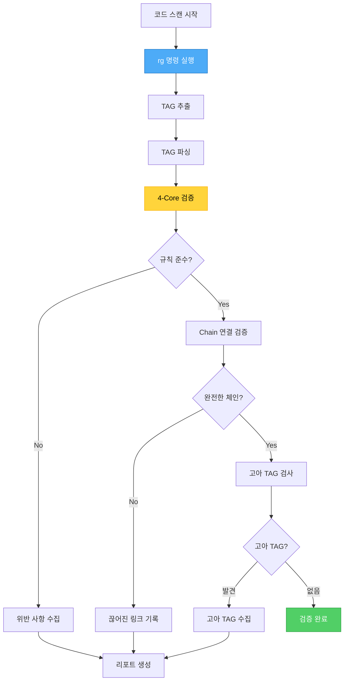
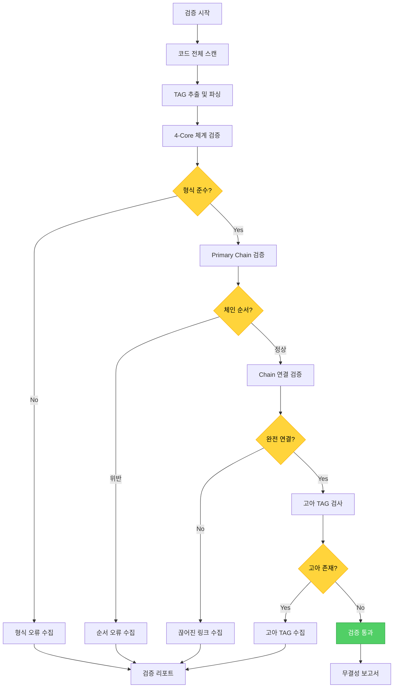

# tag-agent - TAG 시스템 독점 관리 에이전트

## 개요

tag-agent는 MoAI-ADK의 **TAG 시스템 독점 관리자**로서 4-Core TAG 체계의 생성, 검증, 무결성 유지를 전담하는 에이전트입니다. CODE-FIRST 철학에 따라 코드에서 직접 TAG를 스캔하고 검증하며, 중간 캐시 없이 실시간 추적성을 보장합니다.

### 역할과 책임

**핵심 역할**: TAG Lifecycle 완전 관리 (The ONLY Agent for TAG)

- **4-Core TAG 체계** 생성 및 관리
- **Primary Chain** (4 Core): @REQ → @DESIGN → @TASK → @TEST
- **Implementation** (4 Core): @FEATURE, @API, @UI, @DATA
- **코드 스캔** 기반 실시간 검증 (`rg '@TAG' -n`)
- **TAG 체인** 무결성 검증 및 복구
- **고아 TAG** 감지 및 정리
- **끊어진 링크** 탐지 및 수정
- **다중 언어** 지원 (Python, TypeScript, Java, Go, Rust 등)

### 3단계 워크플로우에서의 위치

```mermaid
graph TB
    subgraph "1. SPEC 작성"
        A[/moai:1-spec] --> A1[TAG BLOCK 생성]
        A1 --> A2[Primary Chain 정의]
    end

    subgraph "2. TDD 구현"
        B[/moai:2-build] --> B1[Implementation TAG 추가]
        B1 --> B2[코드에 TAG BLOCK 삽입]
    end

    subgraph "3. 문서 동기화"
        C[/moai:3-sync] --> C1[코드 스캔]
        C1 --> C2[TAG 검증]
        C2 --> C3[무결성 확인]
    end

    subgraph "TAG Agent 관리"
        D[@agent-tag-agent] -.->|TAG 생성| A1
        D -.->|TAG 검증| C1
        D -.->|체인 복구| C3
    end

    A2 --> B
    B2 --> C

    style D fill:#a9e34b,stroke:#5c940d,color:#000
    style A1 fill:#ffd43b,stroke:#fab005,color:#000
    style C1 fill:#4dabf7,stroke:#1971c2,color:#fff
    style C3 fill:#51cf66,stroke:#2f9e44,color:#fff
```

**tag-agent 활성화 시점**:
- `/moai:1-spec` 실행 시: TAG BLOCK 자동 생성
- `/moai:3-sync` 실행 시: TAG 검증 자동 실행
- 온디맨드: TAG 체인 검증, 고아 TAG 정리 필요 시

### 다른 에이전트와의 협력

- **spec-builder**: SPEC 작성 시 TAG BLOCK 생성
- **code-builder**: 코드 구현 시 TAG BLOCK 삽입
- **doc-syncer**: 문서 동기화 시 TAG 검증 실행
- **trust-checker**: Trackable 원칙 검증 시 협력
- **독점 권한**: TAG 생성/수정/삭제는 tag-agent만 수행

---

## 4-Core TAG 체계

### TAG 체계 개요

MoAI-ADK는 **4-Core TAG 체계**를 사용하여 완전한 추적성을 보장합니다.

```mermaid
graph TB
    subgraph "Primary Chain (4 Core)"
        A[@REQ] -->|설계| B[@DESIGN]
        B -->|구현| C[@TASK]
        C -->|검증| D[@TEST]
    end

    subgraph "Implementation (4 Core)"
        E[@FEATURE]
        F[@API]
        G[@UI]
        H[@DATA]
    end

    A -.->|참조| E
    B -.->|참조| E
    C -.->|참조| E
    D -.->|참조| E

    E -.->|구현| F
    E -.->|구현| G
    E -.->|구현| H

    style A fill:#ff6b6b,stroke:#c92a2a,color:#fff
    style B fill:#ffd43b,stroke:#fab005,color:#000
    style C fill:#4dabf7,stroke:#1971c2,color:#fff
    style D fill:#51cf66,stroke:#2f9e44,color:#fff
    style E fill:#a9e34b,stroke:#5c940d,color:#000
    style F fill:#ffa94d,stroke:#d9480f,color:#fff
    style G fill:#74c0fc,stroke:#1c7ed6,color:#fff
    style H fill:#da77f2,stroke:#9c36b5,color:#fff
```

### Primary Chain (4 Core)

**1. @REQ (Requirements) - 요구사항**
- **역할**: 사용자 요구사항 또는 비즈니스 요구 정의
- **위치**: SPEC 문서, 요구사항 문서
- **예시**: `@SPEC:AUTH-001` (사용자 인증 요구사항)

**2. @DESIGN (Design) - 설계**
- **역할**: 요구사항을 해결하기 위한 설계 결정
- **위치**: 설계 문서, 아키텍처 다이어그램
- **예시**: `` (JWT 기반 인증 설계)

**3. @TASK (Task) - 작업**
- **역할**: 설계를 구현하기 위한 구체적 작업
- **위치**: 구현 코드, 함수, 클래스
- **예시**: `@CODE:AUTH-001` (로그인 함수 구현)

**4. @TEST (Test) - 테스트**
- **역할**: 구현을 검증하는 테스트
- **위치**: 테스트 파일, 테스트 케이스
- **예시**: `@TEST:AUTH-001` (로그인 테스트)

### Implementation (4 Core)

**5. @FEATURE (Feature) - 기능**
- **역할**: 사용자 관점의 완전한 기능 구현
- **위치**: 서비스, 컴포넌트, 모듈
- **예시**: `@CODE:AUTH-001` (인증 서비스)

**6. @API (API) - API 엔드포인트**
- **역할**: 외부 인터페이스 또는 API 엔드포인트
- **위치**: API 라우터, 컨트롤러, 엔드포인트
- **예시**: `@CODE:AUTH-001:API` (POST /api/login)

**7. @UI (User Interface) - 사용자 인터페이스**
- **역할**: 사용자 인터페이스 컴포넌트
- **위치**: UI 컴포넌트, 뷰, 템플릿
- **예시**: `@CODE:AUTH-001:UI` (로그인 폼 컴포넌트)

**8. @DATA (Data) - 데이터 모델**
- **역할**: 데이터 구조, 스키마, 엔티티
- **위치**: 모델, 스키마, 데이터베이스
- **예시**: `@CODE:AUTH-001:DATA` (사용자 인증 정보 모델)

### TAG ID 형식

**규칙**: `<DOMAIN>-<3자리 숫자>`

**예시**:
- `AUTH-001`: 인증 도메인, 첫 번째 항목
- `USER-007`: 사용자 도메인, 일곱 번째 항목
- `LOGIN-003`: 로그인 도메인, 세 번째 항목

**도메인 선택 가이드**:
- **기능 중심**: AUTH, USER, PAYMENT, ORDER
- **모듈 중심**: CORE, UTILS, CONFIG, API
- **레이어 중심**: BACKEND, FRONTEND, DATABASE

**번호 부여**:
- 001부터 순차적으로 증가
- 도메인별 독립적 번호 체계
- 삭제된 번호 재사용 금지

---

## TAG BLOCK 템플릿

### 표준 템플릿

```text
# @FEATURE:<DOMAIN-ID> | Chain: @REQ:<ID> -> @DESIGN:<ID> -> @TASK:<ID> -> @TEST:<ID>
# Related: @API:<ID>, @UI:<ID>, @DATA:<ID>
```

**구성 요소**:
1. **Primary TAG**: @FEATURE (주요 구현 TAG)
2. **Chain**: Primary Chain 4개 TAG 연결
3. **Related**: 관련 Implementation TAG

### 언어별 TAG BLOCK 예시

#### TypeScript

```typescript
// @CODE:LOGIN-001 | Chain: @SPEC:AUTH-001 ->  -> @CODE:AUTH-001 -> @TEST:AUTH-001
// Related: @CODE:LOGIN-001:API, @CODE:LOGIN-001:UI, @CODE:LOGIN-001:DATA

/**
 * @CODE:LOGIN-001: 사용자 로그인 서비스
 *
 * JWT 기반 인증을 제공하는 로그인 서비스 구현
 */
export class LoginService {
  /**
   * @CODE:LOGIN-001:API: 로그인 API 엔드포인트
   */
  async login(username: string, password: string): Promise<AuthToken> {
    // @CODE:LOGIN-001: 로그인 로직 구현
    const user = await this.validateCredentials(username, password);

    if (!user) {
      throw new UnauthorizedError('Invalid credentials');
    }

    // @CODE:LOGIN-001:DATA: 인증 토큰 생성
    return this.generateToken(user);
  }
}

// @TEST:LOGIN-001: 로그인 테스트
describe('LoginService', () => {
  it('@TEST:LOGIN-001: should authenticate valid user', async () => {
    const service = new LoginService();
    const token = await service.login('user', 'password');
    expect(token).toBeDefined();
  });
});
```

#### Python

```python
# @CODE:LOGIN-001 | Chain: @SPEC:AUTH-001 ->  -> @CODE:AUTH-001 -> @TEST:AUTH-001
# Related: @CODE:LOGIN-001:API, @CODE:LOGIN-001:UI, @CODE:LOGIN-001:DATA

class LoginService:
    """
    @CODE:LOGIN-001: 사용자 로그인 서비스

    JWT 기반 인증을 제공하는 로그인 서비스 구현
    """

    def login(self, username: str, password: str) -> AuthToken:
        """
        @CODE:LOGIN-001:API: 로그인 API 엔드포인트

        Args:
            username: 사용자 이름
            password: 비밀번호

        Returns:
            AuthToken: 인증 토큰
        """
        # @CODE:LOGIN-001: 로그인 로직 구현
        user = self._validate_credentials(username, password)

        if not user:
            raise UnauthorizedError('Invalid credentials')

        # @CODE:LOGIN-001:DATA: 인증 토큰 생성
        return self._generate_token(user)

# @TEST:LOGIN-001: 로그인 테스트
def test_should_authenticate_valid_user():
    """@TEST:LOGIN-001: 유효한 사용자 인증 테스트"""
    service = LoginService()
    token = service.login('user', 'password')
    assert token is not None
```

#### Java

```java
// @CODE:LOGIN-001 | Chain: @SPEC:AUTH-001 ->  -> @CODE:AUTH-001 -> @TEST:AUTH-001
// Related: @CODE:LOGIN-001:API, @CODE:LOGIN-001:UI, @CODE:LOGIN-001:DATA

/**
 * @CODE:LOGIN-001: 사용자 로그인 서비스
 *
 * JWT 기반 인증을 제공하는 로그인 서비스 구현
 */
public class LoginService {
    /**
     * @CODE:LOGIN-001:API: 로그인 API 엔드포인트
     */
    public AuthToken login(String username, String password) {
        // @CODE:LOGIN-001: 로그인 로직 구현
        User user = validateCredentials(username, password);

        if (user == null) {
            throw new UnauthorizedException("Invalid credentials");
        }

        // @CODE:LOGIN-001:DATA: 인증 토큰 생성
        return generateToken(user);
    }
}

// @TEST:LOGIN-001: 로그인 테스트
public class LoginServiceTest {
    @Test
    public void testShouldAuthenticateValidUser() {
        // @TEST:LOGIN-001: 유효한 사용자 인증 테스트
        LoginService service = new LoginService();
        AuthToken token = service.login("user", "password");
        assertNotNull(token);
    }
}
```

#### Go

```go
// @CODE:LOGIN-001 | Chain: @SPEC:AUTH-001 ->  -> @CODE:AUTH-001 -> @TEST:AUTH-001
// Related: @CODE:LOGIN-001:API, @CODE:LOGIN-001:UI, @CODE:LOGIN-001:DATA

// @CODE:LOGIN-001: 사용자 로그인 서비스
//
// JWT 기반 인증을 제공하는 로그인 서비스 구현
type LoginService struct {
    // ...
}

// @CODE:LOGIN-001:API: 로그인 API 엔드포인트
func (s *LoginService) Login(username, password string) (*AuthToken, error) {
    // @CODE:LOGIN-001: 로그인 로직 구현
    user, err := s.validateCredentials(username, password)

    if err != nil {
        return nil, ErrUnauthorized
    }

    // @CODE:LOGIN-001:DATA: 인증 토큰 생성
    return s.generateToken(user)
}

// @TEST:LOGIN-001: 로그인 테스트
func TestLogin(t *testing.T) {
    // @TEST:LOGIN-001: 유효한 사용자 인증 테스트
    service := NewLoginService()
    token, err := service.Login("user", "password")

    if err != nil {
        t.Fatal(err)
    }

    if token == nil {
        t.Error("expected token, got nil")
    }
}
```

#### Rust

```rust
// @CODE:LOGIN-001 | Chain: @SPEC:AUTH-001 ->  -> @CODE:AUTH-001 -> @TEST:AUTH-001
// Related: @CODE:LOGIN-001:API, @CODE:LOGIN-001:UI, @CODE:LOGIN-001:DATA

/// @CODE:LOGIN-001: 사용자 로그인 서비스
///
/// JWT 기반 인증을 제공하는 로그인 서비스 구현
pub struct LoginService {
    // ...
}

impl LoginService {
    /// @CODE:LOGIN-001:API: 로그인 API 엔드포인트
    pub async fn login(&self, username: &str, password: &str) -> Result<AuthToken, AuthError> {
        // @CODE:LOGIN-001: 로그인 로직 구현
        let user = self.validate_credentials(username, password).await?;

        // @CODE:LOGIN-001:DATA: 인증 토큰 생성
        self.generate_token(&user).await
    }
}

// @TEST:LOGIN-001: 로그인 테스트
#[cfg(test)]
mod tests {
    use super::*;

    #[tokio::test]
    async fn test_should_authenticate_valid_user() {
        // @TEST:LOGIN-001: 유효한 사용자 인증 테스트
        let service = LoginService::new();
        let token = service.login("user", "password").await;
        assert!(token.is_ok());
    }
}
```

---

## CODE-FIRST 철학

### 핵심 원칙

**"TAG의 진실은 코드 자체에만 존재"**

1. **중간 캐시 없음**: TAG INDEX 파일 미사용
2. **코드 직접 스캔**: `rg '@TAG' -n` 명령으로 실시간 스캔
3. **실시간 검증**: 코드 변경 시점마다 즉시 검증
4. **단일 진실의 원천**: 코드가 유일한 TAG 정보 저장소

### 코드 스캔 방법

#### 기본 스캔 명령

```bash
# 전체 TAG 스캔
rg '@(REQ|DESIGN|TASK|TEST|FEATURE|API|UI|DATA):[\w-]+' -n

# Primary Chain 스캔
rg '@REQ:[\w-]+.*@DESIGN:[\w-]+.*@TASK:[\w-]+.*@TEST:[\w-]+' -n

# Implementation TAG 스캔
rg '@(FEATURE|API|UI|DATA):[\w-]+' -n

# 특정 도메인 스캔
rg '@\w+:AUTH-\d+' -n

# 특정 TAG ID 스캔
rg '@\w+:LOGIN-001' -n
```

#### 고급 스캔 패턴

```bash
# TAG BLOCK 전체 스캔
rg '^# @FEATURE:\w+-\d+ \| Chain: @REQ:\w+-\d+ -> @DESIGN:\w+-\d+ -> @TASK:\w+-\d+ -> @TEST:\w+-\d+' -n

# 끊어진 체인 감지 (간접적 방법)
rg '@SPEC:AUTH-001' -n && rg '' -n && rg '@CODE:AUTH-001' -n && rg '@TEST:AUTH-001' -n

# 고아 TAG 검사 (단일 참조)
rg '@\w+:[\w-]+' -n --no-heading | awk '{print $NF}' | sort | uniq -c | awk '$1 == 1'

# 중복 TAG ID 검사
rg '@\w+:([\w-]+)' -o --no-filename | sort | uniq -d
```

### 스캔 워크플로우



---

## TAG 생성 및 관리

### 코드 스캔 기반 TAG 관리

**핵심 원칙**: TAG의 진실은 코드 자체에만 존재

TAG는 별도의 카탈로그나 인덱스 파일 없이 코드에 직접 작성되며, `rg` 명령어로 스캔하여 검증합니다.

**TAG BLOCK 템플릿**:
```markdown
# @CODE:AUTH-003 | Chain: @SPEC:AUTH-003 ->  -> @CODE:AUTH-003 -> @TEST:AUTH-003
# Related: @CODE:AUTH-003:API, @CODE:AUTH-003:UI, @CODE:AUTH-003:DATA
```

### TAG 생성 프로세스


### TAG 중복 방지

**생성 전 확인 절차**:

```bash
# 1. 도메인 TAG 검색
rg '@\w+:AUTH-' -n

# 2. 유사 기능 검색
rg '@\w+:.*login' -i -n

# 3. 최신 번호 확인
rg '@\w+:AUTH-(\d+)' -o | sort -t'-' -k2 -n | tail -1

# 4. 새 TAG ID 결정
# AUTH-008 (마지막이 AUTH-007이라면)
```

**중복 발견 시 대응**:
```bash
# 기존 TAG 재사용 또는 새 TAG 생성
@agent-tag-agent "AUTH-003 TAG 재사용 가능 여부 확인"
```

---

## TAG 검증

### 4-Core 체계 검증

#### 검증 항목

1. **TAG 형식**: `@TAG:<DOMAIN>-<3자리>`
2. **Primary Chain**: @REQ → @DESIGN → @TASK → @TEST 순서
3. **Implementation TAG**: @FEATURE, @API, @UI, @DATA 존재
4. **Chain 연결**: 동일 TAG ID로 체인 형성
5. **고아 TAG**: 단일 참조 TAG 없음
6. **끊어진 링크**: 체인 중 누락 TAG 없음

#### 검증 워크플로우



### 끊어진 링크 탐지

**탐지 알고리즘**:

```bash
# 1. 모든 TAG ID 수집
TAG_IDS=$(rg '@\w+:([\w-]+)' -o --no-filename | sed 's/@[A-Z]*://' | sort -u)

# 2. 각 TAG ID에 대해 Primary Chain 검증
for ID in $TAG_IDS; do
    REQ=$(rg "@REQ:$ID" -c)
    DESIGN=$(rg "@DESIGN:$ID" -c)
    TASK=$(rg "@TASK:$ID" -c)
    TEST=$(rg "@TEST:$ID" -c)

    # 체인 중 하나라도 0이면 끊어진 링크
    if [ $REQ -eq 0 ] || [ $DESIGN -eq 0 ] || [ $TASK -eq 0 ] || [ $TEST -eq 0 ]; then
        echo "Broken chain: $ID (REQ:$REQ, DESIGN:$DESIGN, TASK:$TASK, TEST:$TEST)"
    fi
done
```

**리포트 예시**:
```markdown
### 끊어진 링크 발견

1. **AUTH-003**
   - @SPEC:AUTH-003: ✅ 존재 (spec/auth.md)
   - : ✅ 존재 (design/auth-flow.md)
   - @CODE:AUTH-003: ❌ 누락
   - @TEST:AUTH-003: ✅ 존재 (tests/auth.test.ts)
   - **조치**: @CODE:AUTH-003을 src/auth/oauth.ts에 추가 필요

2. **USER-007**
   - @SPEC:USER-007: ✅ 존재
   - : ❌ 누락
   - @CODE:USER-007: ✅ 존재
   - @TEST:USER-007: ✅ 존재
   - **조치**:  설계 문서 작성 필요
```

### 고아 TAG 감지

**탐지 알고리즘**:

```bash
# 단일 참조 TAG 찾기
rg '@\w+:[\w-]+' -o --no-filename | sort | uniq -c | awk '$1 == 1'

# 출력 예시:
# 1 @CODE:LEGACY-001
# 1 @CODE:TEMP-999:API
```

**고아 TAG 분류**:
1. **실험적 코드**: 임시 테스트 코드
2. **레거시 코드**: 오래된 미사용 코드
3. **작성 중**: 아직 연결 전 코드
4. **실제 고아**: SPEC 없이 생성된 코드

**처리 방법**:
```bash
# 고아 TAG 검토
@agent-tag-agent "고아 TAG 검토 및 처리 방안 제시"

# 결과:
# - LEGACY-001: 삭제 권장
# - TEMP-999: SPEC 연결 또는 삭제
```

---

## TAG 체인 복구

### 자동 복구 프로세스

```mermaid
graph LR
    A[끊어진 링크 발견] --> B{누락 TAG 유형?}
    B -->|@REQ| C[SPEC 검토]
    B -->|@DESIGN| D[설계 문서 확인]
    B -->|@TASK| E[코드 검토]
    B -->|@TEST| F[테스트 검토]

    C --> G[요구사항 재작성]
    D --> H[설계 보완]
    E --> I[코드에 TAG 추가]
    F --> J[테스트에 TAG 추가]

    G --> K[TAG 삽입]
    H --> K
    I --> K
    J --> K

    K --> L[체인 재검증]
    L --> M{복구 완료?}
    M -->|Yes| N[복구 성공]
    M -->|No| O[수동 복구 필요]

    style B fill:#ffd43b,stroke:#fab005,color:#000
    style M fill:#ffd43b,stroke:#fab005,color:#000
    style N fill:#51cf66,stroke:#2f9e44,color:#fff
    style O fill:#ff6b6b,stroke:#c92a2a,color:#fff
```

### 수동 복구 가이드

#### 시나리오 1: @TASK 누락

**문제**:
```
AUTH-003 체인에서 @CODE:AUTH-003 누락
```

**해결 방법**:
```typescript
// src/auth/oauth.ts

// Before (TAG 없음)
export class OAuthService {
  async authenticate(code: string) {
    // 구현...
  }
}

// After (TAG 추가)
// @CODE:AUTH-003 | Chain: @SPEC:AUTH-003 ->  -> @CODE:AUTH-003 -> @TEST:AUTH-003
export class OAuthService {
  /**
   * @CODE:AUTH-003: OAuth 인증 구현
   */
  async authenticate(code: string) {
    // 구현...
  }
}
```

#### 시나리오 2: @DESIGN 누락

**문제**:
```
USER-007 체인에서  누락
```

**해결 방법**:
```markdown
<!-- design/user-profile.md -->

# User Profile Design

##  | Chain: @SPEC:USER-007 ->  -> @CODE:USER-007 -> @TEST:USER-007

### 설계 개요
사용자 프로필 관리 기능 설계

### 아키텍처
- 컴포넌트 구조
- 데이터 흐름
- API 인터페이스

### 구현 방안
- React 컴포넌트 기반
- Context API로 상태 관리
- REST API 연동
```

#### 시나리오 3: 전체 체인 누락

**문제**:
```
PAYMENT-005 TAG가 코드에만 존재하고 SPEC 없음
```

**해결 방법**:
1. SPEC 문서 작성
2. TAG BLOCK 추가
3. Primary Chain 완성
4. 코드에 체인 연결

---

## 다중 언어 지원

### 언어별 TAG 주석 스타일

| 언어 | TAG 주석 형식 | 예시 |
|------|--------------|------|
| **TypeScript** | `// @TAG:ID` | `// @CODE:AUTH-001` |
| **Python** | `# @TAG:ID` | `# @CODE:AUTH-001` |
| **Java** | `// @TAG:ID` | `// @CODE:AUTH-001` |
| **Go** | `// @TAG:ID` | `// @CODE:AUTH-001` |
| **Rust** | `// @TAG:ID` | `// @CODE:AUTH-001` |
| **C++** | `// @TAG:ID` | `// @CODE:AUTH-001` |
| **C#** | `// @TAG:ID` | `// @CODE:AUTH-001` |
| **Ruby** | `# @TAG:ID` | `# @CODE:AUTH-001` |
| **PHP** | `// @TAG:ID` | `// @CODE:AUTH-001` |
| **Swift** | `// @TAG:ID` | `// @CODE:AUTH-001` |

### 다중 언어 스캔

```bash
# 모든 언어 통합 스캔
rg '@(REQ|DESIGN|TASK|TEST|FEATURE|API|UI|DATA):[\w-]+' \
  -g '*.ts' -g '*.tsx' -g '*.js' -g '*.jsx' \
  -g '*.py' -g '*.java' -g '*.go' -g '*.rs' \
  -g '*.cpp' -g '*.c' -g '*.cs' -g '*.rb' \
  -g '*.php' -g '*.swift' -n

# 언어별 TAG 통계
rg '@\w+:[\w-]+' -g '*.ts' -c | awk '{sum+=$1} END {print "TypeScript:", sum}'
rg '@\w+:[\w-]+' -g '*.py' -c | awk '{sum+=$1} END {print "Python:", sum}'
rg '@\w+:[\w-]+' -g '*.java' -c | awk '{sum+=$1} END {print "Java:", sum}'
```

---

## 사용 패턴

### 기본 사용법

```bash
# 코드 전체 TAG 스캔
@agent-tag-agent "코드 전체를 스캔하여 TAG 검증"

# TAG 체인 무결성 검증
@agent-tag-agent "TAG 체인 무결성 확인"

# 고아 TAG 검사
@agent-tag-agent "고아 TAG 및 끊어진 링크 감지"

# TAG 통계
@agent-tag-agent "TAG 통계 및 현황 보고"
```

### SPEC 작성 시 TAG 생성

```bash
# 1. SPEC 작성 시작
/moai:1-spec

# 2. TAG BLOCK 자동 생성
# (spec-builder가 tag-agent 호출)

# 3. TAG 중복 확인
@agent-tag-agent "AUTH 도메인 기존 TAG 확인"

# 4. 새 TAG ID 생성
# AUTH-008 (다음 번호)
```

### 코드 구현 시 TAG 삽입

```bash
# 1. 구현 시작
/moai:2-build

# 2. TAG BLOCK 삽입
# (code-builder가 자동 삽입)

# 3. TAG 검증
@agent-tag-agent "새로 추가된 TAG 검증"
```

### 문서 동기화 시 TAG 검증

```bash
# 1. 문서 동기화 시작
/moai:3-sync

# 2. TAG 전체 검증
# (doc-syncer가 tag-agent 호출)

# 3. 문제 발견 시 복구
@agent-tag-agent "끊어진 TAG 체인 복구"
```

---

## TAG 리포트

### 기본 리포트 형식

```markdown
# TAG 검증 리포트

**검증 일시**: 2025-10-01 14:30:00
**스캔 범위**: 전체 프로젝트

---

## TAG 통계

| 항목 | 개수 |
|------|------|
| **총 TAG 수** | 149 |
| **Primary Chain** | 37개 체인 |
| **Implementation TAG** | 112개 |
| **고아 TAG** | 3개 |
| **끊어진 링크** | 2개 |

---

## Primary Chain 현황

### 완전한 체인 (35개)

| TAG ID | REQ | DESIGN | TASK | TEST | 상태 |
|--------|-----|--------|------|------|------|
| AUTH-001 | ✅ | ✅ | ✅ | ✅ | 완료 |
| AUTH-002 | ✅ | ✅ | ✅ | ✅ | 완료 |
| USER-001 | ✅ | ✅ | ✅ | ✅ | 완료 |
| ... | ... | ... | ... | ... | ... |

### 끊어진 체인 (2개)

1. **AUTH-003**
   - @SPEC:AUTH-003: ✅ spec/auth.md:45
   - : ✅ design/oauth.md:12
   - @CODE:AUTH-003: ❌ 누락
   - @TEST:AUTH-003: ✅ tests/auth.test.ts:67
   - **조치**: src/auth/oauth.ts에 @CODE:AUTH-003 추가

2. **USER-007**
   - @SPEC:USER-007: ✅ spec/user.md:89
   - : ❌ 누락
   - @CODE:USER-007: ✅ src/user/profile.ts:23
   - @TEST:USER-007: ✅ tests/user.test.ts:101
   - **조치**: design/ 디렉토리에 user-profile.md 작성

---

## Implementation TAG 현황

| 도메인 | FEATURE | API | UI | DATA | 합계 |
|--------|---------|-----|----|----- |------|
| AUTH | 5 | 3 | 2 | 4 | 14 |
| USER | 8 | 5 | 7 | 6 | 26 |
| PAYMENT | 4 | 3 | 3 | 2 | 12 |
| ORDER | 6 | 4 | 5 | 4 | 19 |
| ... | ... | ... | ... | ... | ... |
| **합계** | 35 | 28 | 27 | 22 | **112** |

---

## 고아 TAG (3개)

1. **@CODE:LEGACY-001**
   - 위치: src/legacy/old-auth.ts:12
   - 참조: 1회 (고아)
   - 상태: 레거시 코드
   - 조치: 삭제 권장

2. **@CODE:TEMP-999:API**
   - 위치: src/temp/experiment.ts:5
   - 참조: 1회 (고아)
   - 상태: 실험 코드
   - 조치: SPEC 연결 또는 삭제

3. **@CODE:UNUSED-005:DATA**
   - 위치: src/models/deprecated.ts:34
   - 참조: 1회 (고아)
   - 상태: 사용하지 않음
   - 조치: deprecated 처리 또는 삭제

---

## 도메인별 TAG 분포

```
AUTH    ████████████████ 24개
USER    ████████████████████████ 32개
PAYMENT ████████ 12개
ORDER   ██████████████ 19개
CONFIG  ████ 6개
UTILS   ██ 3개
```

---

## 권장 조치

### 긴급 (즉시 처리)
1. AUTH-003: @TASK 추가
2. USER-007: @DESIGN 작성

### 중요 (1주일 내)
1. 고아 TAG 3개 정리
2. 레거시 코드 리팩토링 또는 삭제

### 일반 (점진적)
1. TAG 문서 업데이트
2. TAG 명명 규칙 재검토

---

## 다음 검증 예정
**예정일**: 2025-10-08 14:30:00
**주기**: 주간
```

---

## 관련 문서

- [trust-checker 가이드](./trust-checker.md) - Trackable 원칙 검증
- [doc-syncer 가이드](./doc-syncer.md) - 문서 동기화와 TAG 연동
- [개발 가이드](@.moai/memory/development-guide.md) - TAG 시스템 상세

---

## 요약

tag-agent는 TAG 시스템의 독점 관리자로서:

- **4-Core TAG 체계**: Primary (4) + Implementation (4)
- **CODE-FIRST**: 코드 직접 스캔, 중간 캐시 없음
- **실시간 검증**: `rg '@TAG' -n` 기반 검증
- **체인 관리**: 끊어진 링크, 고아 TAG 탐지 및 복구
- **다중 언어 지원**: 모든 주요 프로그래밍 언어

TAG 시스템을 통해 SPEC부터 코드, 테스트까지 완전한 추적성을 보장합니다.

```bash
# 시작하기
@agent-tag-agent "코드 전체를 스캔하여 TAG 검증"
```