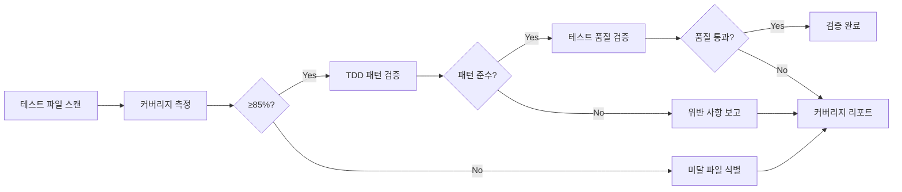
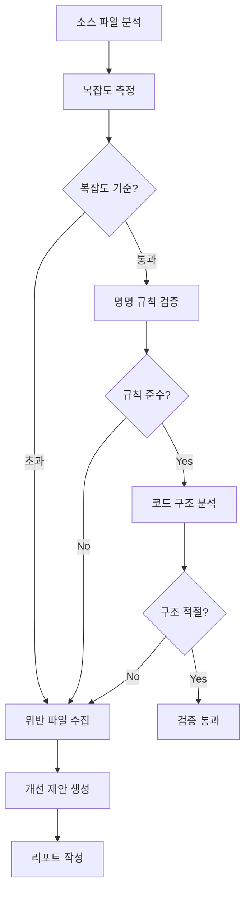
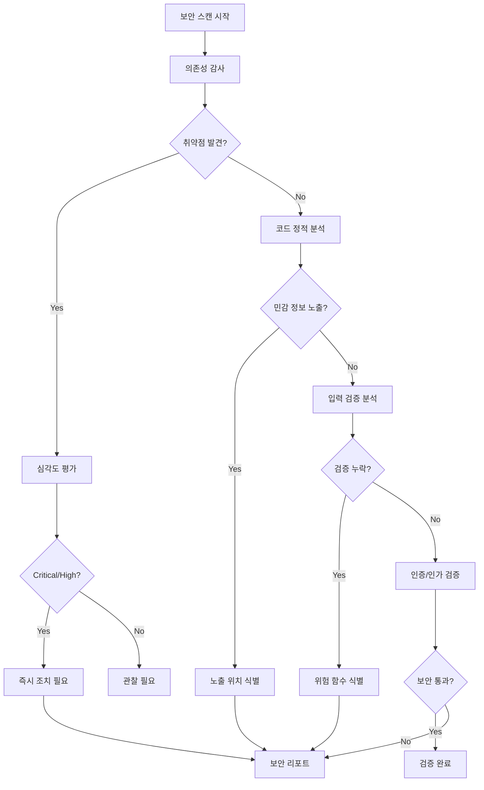
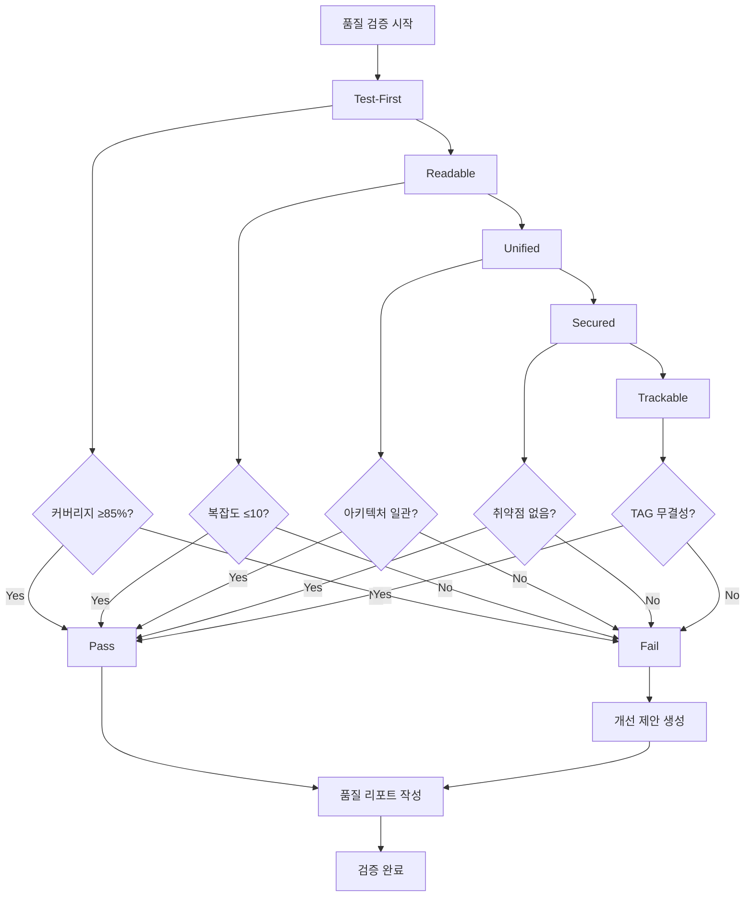
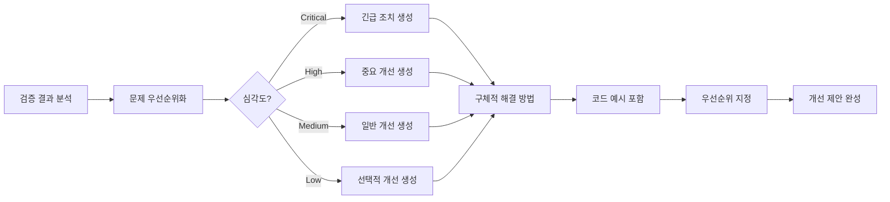
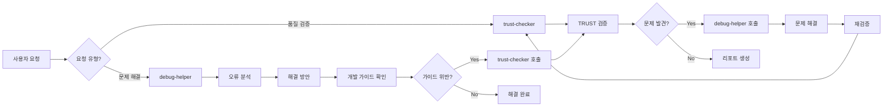

# trust-checker - TRUST 품질 검증 에이전트

## 개요

trust-checker는 MoAI-ADK의 **온디맨드 품질 보증 전문가**로서 TRUST 5원칙을 기반으로 코드 품질, 보안, 성능, 추적성을 종합적으로 검증하는 에이전트입니다. 필요시에만 호출하여 프로젝트 전반의 품질 상태를 점검하고 개선 방안을 제시합니다.

### 역할과 책임

**핵심 역할**: TRUST 5원칙 기반 품질 보증 (Quality Assurance)

- **T**est-First: 테스트 커버리지 ≥85%, TDD 준수 검증
- **R**eadable: 가독성, 복잡도 ≤10, 명명 규칙 검증
- **U**nified: 아키텍처 일관성, 모듈화 검증
- **S**ecured: 보안 취약점, 민감 정보 노출 검증
- **T**rackable: @TAG 시스템 무결성, 추적성 검증

### 3단계 워크플로우에서의 위치

```mermaid
graph TB
    subgraph "개발 워크플로우"
        A[/moai:1-spec] --> B[/moai:2-build]
        B --> C[/moai:3-sync]
    end

    subgraph "온디맨드 품질 검증"
        D["@agent-trust-checker"] -.->|품질 검증| A
        D -.->|품질 검증| B
        D -.->|품질 검증| C
    end

    subgraph "연계 에이전트"
        E["@agent-debug-helper"] <-->|협력| D
        F["@agent-tag-agent"] <-->|TAG 검증| D
    end

```

**trust-checker 활성화 시점** (온디맨드):
- 개발 완료 후 전체 품질 점검 필요 시
- PR 생성 전 품질 게이트 검증 시
- 리팩토링 후 품질 회귀 검증 시
- 주기적 품질 모니터링 필요 시

### 다른 에이전트와의 협력

- **debug-helper**: 오류 분석 및 개발 가이드 준수 확인
- **tag-agent**: @TAG 시스템 무결성 검증
- **doc-syncer**: 문서-코드 일치성 검증
- **독립 실행**: 온디맨드 방식으로 필요시에만 호출

---

## TRUST 5원칙 상세

### T - Test-First (테스트 주도)

#### 검증 항목

**1. 테스트 커버리지**
- **목표**: ≥85%
- **측정 범위**: 라인, 브랜치, 함수, 구문
- **도구**: 언어별 커버리지 도구 자동 선택

**언어별 도구 매핑**:
```yaml
TypeScript: c8, nyc, vitest coverage
Python: pytest-cov, coverage.py
Java: JaCoCo, Cobertura
Go: go test -cover
Rust: cargo-tarpaulin, llvm-cov
```

**2. TDD 준수**
- RED-GREEN-REFACTOR 사이클 검증
- 테스트 먼저, 구현 나중 순서 확인
- 테스트 독립성 검증 (테스트 간 의존성 금지)

**3. 테스트 품질**
- 테스트 명명 규칙: `should_[행동]_when_[조건]`
- 단언문(assertion) 명확성
- 테스트 가독성 및 유지보수성

#### 검증 워크플로우



#### 실행 예시

```bash
# 전체 테스트 검증
@agent-trust-checker "테스트 커버리지 검증"

# 특정 모듈 검증
@agent-trust-checker "src/auth 모듈 테스트 검증"

# TDD 준수 확인
@agent-trust-checker "TDD 패턴 준수 검증"
```

**결과 리포트**:
```markdown
## Test-First 검증 결과

### 커버리지 현황
- **전체**: 87.3% ✅ (목표: ≥85%)
- **라인**: 88.1%
- **브랜치**: 84.2%
- **함수**: 91.5%

### TDD 준수
- RED-GREEN-REFACTOR: ✅ 준수
- 테스트 독립성: ✅ 통과
- 테스트 먼저 작성: ⚠️ 3개 파일 미준수

### 개선 필요 항목
1. `src/utils/helper.ts`: 테스트 없음
2. `src/services/api.ts`: 커버리지 78% (목표 미달)
3. `tests/auth.test.ts`: TDD 순서 위반
```

### R - Readable (가독성)

#### 검증 항목

**1. 복잡도 검증**
- **파일**: ≤300 LOC
- **함수**: ≤50 LOC
- **매개변수**: ≤5개
- **순환 복잡도**: ≤10

**2. 명명 규칙**
- 변수: camelCase, 의미 명확
- 함수: 동사로 시작, 의도 드러내기
- 클래스: PascalCase, 명사
- 상수: UPPER_SNAKE_CASE

**3. 코드 구조**
- 가드절 우선 사용
- 중첩 최소화 (≤3 depth)
- 조기 반환(early return) 활용
- 긴 함수 분해

#### 검증 워크플로우



#### 복잡도 측정 도구

**언어별 도구**:
```yaml
TypeScript: eslint (complexity), sonarqube
Python: radon, mccabe, pylint
Java: checkstyle, PMD, SonarQube
Go: gocyclo, golint
Rust: cargo-geiger, clippy
```

#### 실행 예시

```bash
# 복잡도 검증
@agent-trust-checker "코드 복잡도 검증"

# 명명 규칙 검증
@agent-trust-checker "변수 및 함수 명명 규칙 검증"

# 전체 가독성 검증
@agent-trust-checker "가독성 종합 검증"
```

**결과 리포트**:
```markdown
## Readable 검증 결과

### 복잡도 현황
- **파일당 LOC**: 평균 187 LOC ✅ (최대: 278 LOC)
- **함수당 LOC**: 평균 23 LOC ✅ (최대: 48 LOC)
- **순환 복잡도**: 평균 6.2 ✅ (최대: 9)

### 복잡도 초과 항목
- `src/core/parser.ts`: 312 LOC ⚠️ (목표: ≤300)
- `src/utils/validator.ts::validateInput()`: 67 LOC ⚠️ (목표: ≤50)
- `src/services/processor.ts::process()`: 복잡도 12 ⚠️ (목표: ≤10)

### 명명 규칙 위반
- `src/config.ts::temp_data`: snake_case 사용 (camelCase 권장)
- `src/utils.ts::do_it()`: 의미 불명확 (구체적 동사 권장)

### 개선 제안
1. `parser.ts`: 3개 함수로 분해 권장
2. `validateInput()`: 검증 로직 별도 함수로 추출
3. `process()`: 조건문 가드절로 리팩토링
```

### U - Unified (통합 아키텍처)

#### 검증 항목

**1. 아키텍처 일관성**
- 모듈 간 의존성 방향 검증
- 계층 분리 준수 확인
- 도메인 경계 명확성

**2. 모듈화**
- 단일 책임 원칙 (SRP) 준수
- 높은 응집도, 낮은 결합도
- 인터페이스 명확성

**3. SPEC 정렬**
- 코드가 SPEC 설계 반영
- @TAG로 SPEC-코드 추적성 유지
- 아키텍처 결정 기록 (ADR) 존재

#### 검증 워크플로우

```mermaid
graph LR
    A[프로젝트 구조 분석] --> B[의존성 그래프 생성]
    B --> C{순환 의존성?}
    C -->|발견| D[순환 참조 식별]
    C -->|없음| E[계층 분리 검증]

    E --> F{계층 위반?}
    F -->|발견| G[위반 사항 수집]
    F -->|없음| H[모듈 응집도 분석]

    H --> I{응집도 적절?}
    I -->|No| G
    I -->|Yes| J[SPEC 정렬 확인]

    J --> K{@TAG 연결?}
    K -->|No| G
    K -->|Yes| L[검증 완료]

    D --> M[리포트 생성]
    G --> M

```

#### 아키텍처 검증 도구

**언어별 도구**:
```yaml
TypeScript: dependency-cruiser, madge, ts-morph
Python: pydeps, import-linter
Java: JDepend, ArchUnit
Go: go mod graph, goviz
Rust: cargo-modules, cargo-deps
```

#### 실행 예시

```bash
# 아키텍처 일관성 검증
@agent-trust-checker "아키텍처 일관성 검증"

# 순환 의존성 검사
@agent-trust-checker "순환 의존성 검사"

# 모듈 응집도 분석
@agent-trust-checker "모듈 응집도 분석"
```

**결과 리포트**:
```markdown
## Unified 검증 결과

### 아키텍처 일관성
- **계층 구조**: ✅ 명확한 3-tier 아키텍처
- **의존성 방향**: ✅ 단방향 흐름 유지
- **도메인 경계**: ✅ 명확히 정의됨

### 의존성 분석
- **순환 참조**: 1건 발견 ⚠️
  - `src/auth/service.ts` ↔ `src/user/service.ts`
- **계층 위반**: 없음 ✅

### 모듈화 품질
- **평균 응집도**: 0.82 ✅ (목표: ≥0.7)
- **평균 결합도**: 0.23 ✅ (목표: ≤0.3)
- **SRP 준수**: 94% ✅

### SPEC 정렬
- **@TAG 추적성**: 97% ✅
- **SPEC 미참조**: 2개 파일
  - `src/utils/legacy.ts`: @TAG 없음
  - `src/temp/experiment.ts`: @TAG 없음

### 개선 제안
1. auth/service ↔ user/service 순환 참조 해결
2. legacy.ts와 experiment.ts에 @TAG 추가
3. temp/ 디렉토리 정리 또는 정식 모듈로 승격
```

### S - Secured (보안)

#### 검증 항목

**1. 보안 취약점**
- 알려진 취약점 스캔 (CVE 데이터베이스)
- 의존성 보안 검사
- 코드 정적 분석 (SAST)

**2. 민감 정보 노출**
- 하드코딩된 비밀번호, API 키
- .env 파일 Git 추적 여부
- 로그에 민감 정보 출력 여부

**3. 입력 검증**
- 사용자 입력 검증 누락
- SQL 인젝션, XSS 취약점
- 파일 업로드 검증

**4. 인증/인가**
- 인증 로직 누락
- 권한 검증 부재
- 토큰 관리 취약점

#### 검증 워크플로우



#### 보안 검증 도구

**언어별 도구**:
```yaml
TypeScript: npm audit, snyk, eslint-plugin-security
Python: bandit, safety, pip-audit
Java: OWASP Dependency Check, SpotBugs, FindSecBugs
Go: gosec, nancy
Rust: cargo-audit, cargo-deny
```

#### 실행 예시

```bash
# 전체 보안 검증
@agent-trust-checker "보안 취약점 전체 스캔"

# 의존성 보안 검사
@agent-trust-checker "의존성 보안 감사"

# 민감 정보 노출 검사
@agent-trust-checker "하드코딩된 비밀 검사"

# 입력 검증 분석
@agent-trust-checker "입력 검증 누락 검사"
```

**결과 리포트**:
```markdown
## Secured 검증 결과

### 의존성 보안
- **총 의존성**: 47개
- **취약점**: 3건 발견 ⚠️
  - **Critical**: 0건
  - **High**: 1건 (lodash@4.17.19)
  - **Medium**: 2건

### 취약점 상세
1. **lodash@4.17.19** (High)
   - CVE-2020-8203: Prototype Pollution
   - 해결: lodash@4.17.21로 업그레이드

2. **axios@0.21.0** (Medium)
   - CVE-2021-3749: SSRF
   - 해결: axios@0.21.2로 업그레이드

### 민감 정보 노출
- **하드코딩된 비밀**: 2건 발견 🚨
  - `src/config/database.ts:12`: DB 패스워드 하드코딩
  - `src/services/api.ts:8`: API 키 하드코딩

### 입력 검증
- **검증 누락**: 5개 함수 ⚠️
  - `src/auth/login.ts::login()`: 사용자 입력 미검증
  - `src/user/create.ts::createUser()`: 이메일 형식 미검증
  - `src/file/upload.ts::uploadFile()`: 파일 타입 미검증

### 인증/인가
- **인증 로직**: ✅ JWT 기반 인증 구현
- **권한 검증**: ⚠️ 3개 엔드포인트 권한 검증 누락
  - `/api/admin/users`: 관리자 권한 미검증
  - `/api/settings`: 인증 미검증

### 긴급 조치 필요
1. 🚨 하드코딩된 비밀 즉시 제거 (.env 이동)
2. ⚠️ lodash 업그레이드 (High 취약점)
3. ⚠️ 권한 검증 누락 엔드포인트 수정
```

### T - Trackable (추적성)

#### 검증 항목

**1. @TAG 시스템 무결성**
- @TAG 체계 준수
- TAG 체인 연결: @SPEC → @TEST → @CODE → @DOC
- @CODE 서브카테고리 존재: @CODE 서브카테고리 (API, UI, DATA 등)

**2. TAG 체인 검증**
- 끊어진 링크 감지
- 고아 TAG 식별 (참조 없는 TAG)
- 중복 TAG ID 검사

**3. SPEC-코드 추적성**
- 모든 코드가 SPEC 참조
- TAG BLOCK와 코드 일치
- SPEC 변경 이력 추적

**4. 코드 스캔 기반 검증**
- `rg '@TAG' -n` 직접 스캔
- 중간 캐시 없음 (코드가 유일한 진실)
- 실시간 검증

#### 검증 워크플로우

```mermaid
graph TB
    A[코드 전체 스캔] --> B[TAG 추출]
    B --> C[@TAG 체계 검증]
    C --> D{체계 준수?}
    D -->|No| E[위반 TAG 수집]
    D -->|Yes| F[Chain 연결 검증]

    F --> G{끊어진 링크?}
    G -->|발견| H[링크 오류 기록]
    G -->|없음| I[고아 TAG 검사]

    I --> J{고아 TAG?}
    J -->|발견| K[고아 TAG 수집]
    J -->|없음| L[SPEC 정렬 확인]

    L --> M{SPEC 일치?}
    M -->|No| N[불일치 항목]
    M -->|Yes| O[검증 완료]

    E --> P[추적성 리포트]
    H --> P
    K --> P
    N --> P

```

#### TAG 검증 도구

**코드 스캔 명령**:
```bash
# 전체 TAG 스캔
rg '@(REQ|DESIGN|TASK|TEST|FEATURE|API|UI|DATA):[\w-]+' -n

# TAG 체인 검증
rg '@SPEC:[\w-]+.*@SPEC:[\w-]+.*@CODE:[\w-]+.*@TEST:[\w-]+' -n

# 고아 TAG 검사
rg '@\w+:[\w-]+' -n --no-heading | awk '{print $NF}' | sort | uniq -c | awk '$1 == 1'
```

#### 실행 예시

```bash
# 전체 TAG 검증
@agent-trust-checker "TAG 시스템 무결성 검증"

# TAG 체인 검증
@agent-trust-checker "TAG 체인 연결 검증"

# 고아 TAG 검사
@agent-trust-checker "고아 TAG 및 끊어진 링크 검사"

# SPEC 정렬 확인
@agent-trust-checker "SPEC-코드 추적성 검증"
```

**결과 리포트**:
```markdown
## Trackable 검증 결과

### TAG 시스템 현황
- **총 TAG 수**: 149개
- **TAG 체인**: 37개 체인 ✅
- **@CODE 서브카테고리**: 112개 ✅
- **@TAG 준수**: 98.7% ✅

### TAG 체인 검증
- **완전한 체인**: 35개 ✅
- **끊어진 링크**: 2개 ⚠️
  - `@SPEC:AUTH-003` → `` (존재) → `@CODE:AUTH-003` (누락) → `@TEST:AUTH-003` (존재)
  - `@SPEC:USER-007` → `` (누락)

### 고아 TAG
- **발견**: 3개 ⚠️
  - `@CODE:LEGACY-001`: 참조 없음 (src/legacy/old.ts)
  - `@CODE:TEMP-999:API`: 실험 코드 (src/temp/test.ts)
  - `@CODE:UNUSED-005:DATA`: 미사용 (src/models/deprecated.ts)

### SPEC 정렬
- **SPEC 참조율**: 96.4% ✅
- **TAG BLOCK 일치**: 94.1% ✅
- **SPEC 미참조 파일**: 5개
  - `src/utils/helper.ts`: TAG 없음
  - `src/config/constants.ts`: TAG 없음
  - `src/temp/*.ts`: 3개 파일

### 개선 제안
1. AUTH-003 체인: @CODE:AUTH-003 추가 필요
2. USER-007 체인:  작성 필요
3. 고아 TAG 정리:
   - LEGACY-001: 삭제 또는 SPEC 연결
   - TEMP-999: 실험 종료 후 제거
   - UNUSED-005: deprecated 처리
4. 미참조 파일에 TAG 추가
```

---

## 품질 게이트 검증

### 전체 품질 검증 프로세스



### 종합 품질 점수 산출

**점수 가중치**:
```yaml
Test-First: 30%
Readable: 20%
Unified: 20%
Secured: 20%
Trackable: 10%
```

**점수 계산**:
```
Quality Score = (T * 0.3) + (R * 0.2) + (U * 0.2) + (S * 0.2) + (T * 0.1)

T: Test-First 점수 (0-100)
R: Readable 점수 (0-100)
U: Unified 점수 (0-100)
S: Secured 점수 (0-100)
T: Trackable 점수 (0-100)
```

**품질 등급**:
```
A: 90-100 (Excellent)
B: 80-89 (Good)
C: 70-79 (Acceptable)
D: 60-69 (Needs Improvement)
F: 0-59 (Fail)
```

### 실행 예시

```bash
# 전체 TRUST 검증
@agent-trust-checker "TRUST 5원칙 전체 검증"

# 품질 게이트 검증 (PR 전)
@agent-trust-checker "품질 게이트 검증"

# 종합 품질 점수
@agent-trust-checker "종합 품질 점수 산출"
```

**종합 리포트**:
```markdown
# TRUST 종합 품질 리포트

## 프로젝트: my-awesome-project
**검증 일시**: 2025-10-01 14:30:00
**검증 범위**: 전체 프로젝트

---

## 종합 점수

**Overall Quality Score: 84.2 (B - Good)**

| 원칙 | 점수 | 가중치 | 기여도 | 등급 |
|------|------|--------|--------|------|
| Test-First | 87.3 | 30% | 26.2 | B+ |
| Readable | 91.5 | 20% | 18.3 | A |
| Unified | 82.1 | 20% | 16.4 | B |
| Secured | 76.8 | 20% | 15.4 | C+ |
| Trackable | 94.0 | 10% | 9.4 | A |

---

## Test-First (87.3 / 100)

### ✅ 통과
- 테스트 커버리지: 87.3% (목표: ≥85%)
- TDD 패턴 준수: 94%
- 테스트 독립성: 100%

### ⚠️ 개선 필요
- `src/utils/helper.ts`: 테스트 없음
- `src/services/api.ts`: 커버리지 78%

---

## Readable (91.5 / 100)

### ✅ 통과
- 평균 복잡도: 6.2 (목표: ≤10)
- 명명 규칙 준수: 96%
- 함수 크기: 평균 23 LOC

### ⚠️ 개선 필요
- `src/core/parser.ts`: 312 LOC (목표: ≤300)
- `src/services/processor.ts::process()`: 복잡도 12

---

## Unified (82.1 / 100)

### ✅ 통과
- 계층 구조: 명확
- 모듈 응집도: 0.82
- SPEC 정렬: 97%

### ⚠️ 개선 필요
- 순환 의존성: 1건 (auth ↔ user)
- 계층 위반: 없음

---

## Secured (76.8 / 100)

### ⚠️ 주의 필요
- 의존성 취약점: 3건 (1 High, 2 Medium)
- 하드코딩된 비밀: 2건 🚨
- 입력 검증 누락: 5개 함수

### 🚨 긴급 조치
1. DB 패스워드 하드코딩 제거
2. API 키 .env로 이동
3. lodash 업그레이드 (High 취약점)

---

## Trackable (94.0 / 100)

### ✅ 통과
- TAG 시스템 준수: 98.7%
- TAG 체인 완전성: 94.6%
- SPEC 추적성: 96.4%

### ⚠️ 개선 필요
- 끊어진 링크: 2개
- 고아 TAG: 3개

---

## 종합 평가

**강점**:
1. 높은 테스트 커버리지와 TDD 준수
2. 우수한 코드 가독성과 낮은 복잡도
3. 완전한 TAG 추적성 체계

**개선 필요**:
1. **긴급**: 하드코딩된 비밀 제거
2. **중요**: 의존성 보안 취약점 해결
3. **일반**: 순환 의존성 리팩토링

**권장 사항**:
- Secured 점수를 85 이상으로 개선 후 배포
- 보안 취약점 해결 후 재검증 권장

---

## 다음 단계

1. 🚨 긴급 보안 이슈 해결 (하드코딩된 비밀)
2. ⚠️ 의존성 업그레이드 (lodash, axios)
3. ⚠️ 입력 검증 로직 추가
4. 품질 게이트 재검증

**예상 개선 후 점수**: 91.3 (A - Excellent)
```

---

## 개선 제안 엔진

### 자동 개선 제안

trust-checker는 검증 결과를 바탕으로 구체적이고 실행 가능한 개선 제안을 생성합니다.

#### 제안 생성 프로세스



#### 제안 템플릿

**1. 긴급 조치 (Critical)**:
```markdown
## 🚨 긴급 조치 필요

### 문제: 하드코딩된 데이터베이스 비밀번호
**파일**: `src/config/database.ts:12`
**심각도**: Critical
**위험**: 소스 코드 노출 시 데이터베이스 침해 가능

### 해결 방법
1. .env 파일 생성 및 .gitignore 추가
2. 환경 변수로 전환
3. 기존 비밀번호 변경

### 수정 예시
**Before**:
```typescript
const config = {
  password: 'mySecretPassword123'
};
```

**After**:
```typescript
const config = {
  password: process.env.DB_PASSWORD
};
```

**.env**:
```
DB_PASSWORD=mySecretPassword123
```

**.gitignore**:
```
.env
.env.*
```

### 예상 소요 시간: 10분
### 영향 범위: 보안 Critical 이슈 해결
```

**2. 중요 개선 (High)**:
```markdown
## ⚠️ 중요 개선 사항

### 문제: 테스트 커버리지 부족
**파일**: `src/services/api.ts`
**현재**: 78% (목표: ≥85%)
**심각도**: High

### 해결 방법
1. 미커버 함수 식별
2. 단위 테스트 추가
3. 엣지 케이스 테스트

### 테스트 예시
```typescript
// api.test.ts
describe('API Service', () => {
  describe('fetchData', () => {
    it('should handle network errors', async () => {
      // 네트워크 오류 케이스 테스트
    });

    it('should retry on timeout', async () => {
      // 타임아웃 재시도 테스트
    });
  });
});
```

### 예상 소요 시간: 2시간
### 영향 범위: 테스트 신뢰성 향상
```

**3. 일반 개선 (Medium)**:
```markdown
## 📝 일반 개선 사항

### 문제: 순환 의존성
**위치**: `src/auth/service.ts` ↔ `src/user/service.ts`
**심각도**: Medium

### 해결 방법
공통 인터페이스 추출 또는 의존성 역전 원칙(DIP) 적용

### 리팩토링 예시
**Before**:
```typescript
// auth/service.ts
import { UserService } from '../user/service';

// user/service.ts
import { AuthService } from '../auth/service';
```

**After**:
```typescript
// interfaces/auth.interface.ts
export interface IAuthService { ... }

// interfaces/user.interface.ts
export interface IUserService { ... }

// auth/service.ts
import { IUserService } from '../interfaces/user.interface';

// user/service.ts
import { IAuthService } from '../interfaces/auth.interface';
```

### 예상 소요 시간: 1시간
### 영향 범위: 아키텍처 개선
```

---

## debug-helper와의 통합

### 역할 분담

**trust-checker (품질 검증 전문)**:
- TRUST 5원칙 종합 검증
- 품질 게이트 평가
- 개선 제안 생성

**debug-helper (문제 해결 전문)**:
- 오류 분석 및 해결
- 개발 가이드 준수 확인
- TAG 체인 검증 지원

### 협력 워크플로우



### 통합 사용 예시

```bash
# 1단계: 품질 검증
@agent-trust-checker "TRUST 전체 검증"

# 2단계: 문제 해결 (문제 발견 시)
@agent-debug-helper "보안 취약점 해결 방법"

# 3단계: 재검증
@agent-trust-checker "Secured 원칙 재검증"
```

---

## 사용 패턴

### 기본 사용법

```bash
# 전체 TRUST 검증
@agent-trust-checker "TRUST 5원칙 전체 검증"

# 개별 원칙 검증
@agent-trust-checker "Test-First 검증"
@agent-trust-checker "Readable 검증"
@agent-trust-checker "Unified 검증"
@agent-trust-checker "Secured 검증"
@agent-trust-checker "Trackable 검증"

# 품질 게이트
@agent-trust-checker "품질 게이트 검증"

# 종합 점수
@agent-trust-checker "종합 품질 점수"
```

### PR 전 검증

```bash
# 1. 전체 TRUST 검증
@agent-trust-checker "PR 전 품질 검증"

# 2. 결과 확인 및 개선
# (개선 제안에 따라 수정)

# 3. 재검증
@agent-trust-checker "품질 재검증"

# 4. 통과 확인 후 PR 생성
@agent-git-manager "PR 생성"
```

### 주기적 품질 모니터링

```bash
# 주간 품질 점검
@agent-trust-checker "주간 품질 리포트"

# 월간 품질 추세
@agent-trust-checker "품질 추세 분석"

# 기술 부채 식별
@agent-trust-checker "기술 부채 식별"
```

---

## 관련 문서

- [debug-helper 가이드](./debug-helper.md) - 문제 해결 및 오류 분석
- [tag-agent 가이드](./tag-agent.md) - TAG 시스템 관리
- [개발 가이드](@.moai/memory/development-guide.md) - TRUST 5원칙 상세

---

## 요약

trust-checker는 TRUST 5원칙 기반 품질 보증 전문가로서:

- **Test-First**: 테스트 커버리지 ≥85%, TDD 준수
- **Readable**: 복잡도 ≤10, 명명 규칙, 가독성
- **Unified**: 아키텍처 일관성, 모듈화
- **Secured**: 보안 취약점, 민감 정보, 입력 검증
- **Trackable**: @TAG 시스템, SPEC 추적성

온디맨드 방식으로 필요시에만 호출하여 프로젝트 품질을 종합 검증하고 구체적인 개선 제안을 제공합니다.

```bash
# 시작하기
@agent-trust-checker "TRUST 5원칙 전체 검증"
```