# moai restore

`moai restore` 명령어는 이전에 생성된 백업에서 MoAI-ADK 설정 파일과 디렉토리를 복원하는 안전장치입니다. `moai update`가 자동으로 생성한 백업이나 `moai init --backup`으로 만든 백업에서 `.moai`, `.claude` 디렉토리, `CLAUDE.md` 파일을 원래 상태로 되돌릴 수 있습니다. 업데이트 후 문제가 발생했거나, 실수로 설정을 잘못 변경했거나, 깨끗한 템플릿 상태로 돌아가고 싶을 때 사용합니다.

이 명령어는 **검증 기반 복원 프로세스**를 따릅니다. 복원을 실행하기 전에 백업 디렉토리의 유효성을 철저히 검사하여, 손상된 백업이나 불완전한 백업으로 인한 문제를 방지합니다. RestoreCommand 클래스는 백업 경로 존재 여부, 디렉토리 타입 확인, 필수 항목(`.moai`, `.claude`, `CLAUDE.md`) 존재 여부를 순차적으로 검증합니다. 검증 실패 시 명확한 오류 메시지를 표시하여 사용자가 올바른 백업을 선택할 수 있도록 돕습니다.

복원 작업은 두 가지 모드를 지원합니다: **실제 복원 모드** (기본)와 **드라이런 모드** (`--dry-run`). 드라이런 모드는 실제로 파일을 변경하지 않고 복원될 항목만 미리 보여주어, 올바른 백업을 선택했는지 확인할 수 있습니다. 실제 복원 모드는 백업의 파일을 현재 디렉토리로 복사하되, 기존 파일과 충돌하는 경우 `--force` 플래그 없이는 건너뜁니다. 이를 통해 의도하지 않은 데이터 손실을 방지합니다.

복원 프로세스는 다음 단계로 진행됩니다: 1) 백업 경로 검증 (존재, 디렉토리 타입, 필수 항목), 2) 경고 표시 (불완전한 백업인 경우), 3) 드라이런 시뮬레이션 (선택 사항), 4) 파일 복사 (충돌 처리), 5) 결과 요약. 각 단계는 사용자에게 투명하게 표시되어, 복원 과정을 완전히 이해하고 제어할 수 있습니다.

RestoreCommand는 안전성을 최우선으로 설계되었습니다. 기본적으로 기존 파일을 덮어쓰지 않으며, `--force` 플래그를 명시적으로 지정해야만 덮어쓰기가 허용됩니다. 또한 복원 전 드라이런 모드로 미리 확인할 것을 강력히 권장합니다. 복원은 되돌릴 수 없는 작업이므로, 현재 상태를 Git에 커밋하거나 별도로 백업한 후 진행하는 것이 안전합니다.

## 동작 방식

`moai restore` 명령어의 복원 프로세스를 시각화한 다이어그램입니다.


### 백업 디렉토리 구조

복원 가능한 백업의 표준 구조입니다.

```mermaid
graph TB
    ROOT["백업 디렉토리 - .moai_backup_timestamp"]

    ROOT --> MOAI[".moai/ - 필수"]
    ROOT --> CLAUDE[".claude/ - 필수"]
    ROOT --> CLAUDEMD["CLAUDE.md - 선택"]
    ROOT --> PKG["package.json - 선택"]

    MOAI --> MEM["memory/ - 개발 가이드"]
    MOAI --> PROJ["project/ - 프로젝트 정의"]
    MOAI --> SCR["scripts/ - 자동화 스크립트"]
    MOAI --> VER["version.json - 버전 정보"]

    CLAUDE --> AGT["agents/alfred/ - 8개 에이전트"]
    CLAUDE --> CMD["commands/alfred/ - 워크플로우 명령"]
    CLAUDE --> HK["hooks/alfred/ - 이벤트 훅"]
    CLAUDE --> STY["output-styles/ - 출력 스타일"]

```



### 복원 프로세스 시퀀스

```mermaid
sequenceDiagram
    participant U as 사용자
    participant RC as RestoreCommand
    participant VAL as BackupValidator
    participant FS as "파일 시스템"
    participant RPT as Reporter

    U->>RC: "moai restore &lt;backup-path&gt;"
    RC->>VAL: 백업 검증 요청
    VAL->>FS: 경로 존재 확인
    FS-->>VAL: 존재 여부
    VAL->>FS: ".moai 확인"
    FS-->>VAL: 존재 여부
    VAL->>FS: ".claude 확인"
    FS-->>VAL: 존재 여부
    VAL-->>RC: 검증 결과

    alt "불완전한 백업 & --force 없음"
        RC-->>U: "❌ 복원 중단 - 불완전한 백업"
    else "--dry-run 모드"
        RC->>FS: 복원 항목 나열
        RC->>RPT: 미리보기 생성
        RPT-->>U: "📋 복원될 항목 목록"
    else 실제 복원
        loop 각 항목
            RC->>FS: 파일 복사
            alt "충돌 & --force 없음"
                RC->>RPT: 건너뛴 항목 기록
            else "충돌 & --force 있음"
                FS->>FS: 덮어쓰기
                RC->>RPT: 덮어쓴 항목 기록
            else 충돌 없음
                FS->>FS: 복사
                RC->>RPT: 복원한 항목 기록
            end
        end
        RC->>RPT: 결과 요약 생성
        RPT-->>U: "✅ 복원 완료 - 통계 표시"
    end
```

## 개요

`moai restore`는 다음 기능을 제공합니다:

1. **백업 검증**
   - 백업 경로 존재 여부 확인
   - 디렉토리 타입 검증
   - 필수 항목 (`.moai`, `.claude`, `CLAUDE.md`) 확인
   - 불완전한 백업 경고

2. **드라이런 모드** (`--dry-run`)
   - 실제 변경 없이 복원 시뮬레이션
   - 복원될 항목 미리 보기
   - 안전한 백업 선택 확인

3. **실제 복원 모드**
   - 백업에서 파일 복사
   - 충돌 파일 건너뛰기 (기본)
   - 강제 덮어쓰기 (`--force`)
   - 복원 항목 및 건너뛴 항목 보고

4. **안전 장치**
   - 기본적으로 기존 파일 보존
   - 명시적 `--force` 플래그 요구
   - 상세한 결과 보고
   - 복원 불가능한 작업 방지

복원은 현재 작업 디렉토리에 백업 내용을 복사합니다. 백업 디렉토리 자체는 변경되지 않으며, 복원 후에도 보존되어 필요 시 다시 사용할 수 있습니다. 여러 백업이 있는 경우 `moai doctor --list-backups` 명령으로 사용 가능한 백업 목록을 확인한 후, 적절한 백업을 선택하여 복원할 수 있습니다.

## 기본 사용법

```bash
moai restore `&lt;backup-path&gt;` [options]
```

### 인수

| 인수 | 설명 |
|------|------|
| ``&lt;backup-path&gt;`` | 복원할 백업 디렉토리 경로 (필수) |

### 옵션

| 옵션 | 설명 |
|------|------|
| `--dry-run` | 실제 변경 없이 복원 시뮬레이션 (권장) |
| `--force` | 기존 파일을 강제로 덮어쓰기 (주의) |
| `-h, --help` | 도움말 메시지 표시 |

### 주요 기능

- **백업 유효성 검증**: 손상되거나 불완전한 백업 감지
- **드라이런 미리보기**: 안전한 복원 전 확인
- **충돌 회피**: 기본적으로 기존 파일 보존
- **선택적 덮어쓰기**: `--force`로 명시적 제어
- **상세한 보고**: 복원/건너뛴 항목 명확히 표시
- **Git 친화적**: Git으로 변경 사항 추적 가능
- **백업 보존**: 복원 후에도 백업 디렉토리 유지

## 사용 예시

### 1. 백업 목록 확인

복원할 백업을 선택하기 전에 사용 가능한 백업을 확인합니다.

```bash
moai doctor --list-backups
```

**출력 예시**:

```
📦 MoAI-ADK Backup Directory Listing
Searching for available backups...

📁 Found 3 backup directories:

  📦 .moai_backup_2025-03-15T14-30-00
     📍 Path: /Users/user/projects/.moai_backup_2025-03-15T14-30-00
     📅 Created: 2025. 3. 15. 오후 2:30:00
     📄 Contains: MoAI config, Claude Code config, 70 files

  📦 backup-2025-03-14-091205
     📍 Path: /Users/user/projects/.moai-backup/backup-2025-03-14-091205
     📅 Created: 2025. 3. 14. 오전 9:12:05
     📄 Contains: MoAI config, Claude Code config, Package config, 68 files

  📦 backup-2025-03-10-153045
     📍 Path: /Users/user/.moai/backups/backup-2025-03-10-153045
     📅 Created: 2025. 3. 10. 오후 3:30:45
     📄 Contains: MoAI config, 45 files

💡 To restore from a backup, use: "moai restore `&lt;backup-path&gt;`"
```

이 목록에서 복원하고 싶은 백업을 선택합니다. 일반적으로 가장 최근 백업을 선택하지만, 특정 시점으로 돌아가고 싶다면 해당 날짜의 백업을 선택할 수 있습니다.

백업 디렉토리는 세 가지 위치에서 검색됩니다:
- **프로젝트 상위 디렉토리**: `.moai_backup_`&lt;timestamp&gt;`` (moai update가 생성)
- **프로젝트 내부**: `.moai-backup/backup-`&lt;timestamp&gt;`` (moai init --backup이 생성)
- **글로벌 백업**: `~/.moai/backups/backup-`&lt;timestamp&gt;`` (글로벌 백업)

### 2. 드라이런 모드로 미리 확인 (권장)

실제로 파일을 변경하기 전에 복원될 내용을 미리 확인합니다.

```bash
cd my-project
moai restore ../.moai_backup_2025-03-15T14-30-00 --dry-run
```

**출력 예시**:

```
🔍 Dry run - would restore to: /Users/user/projects/my-project

  Would restore: /Users/user/projects/.moai_backup_2025-03-15T14-30-00/.moai → /Users/user/projects/my-project/.moai
  Would restore: /Users/user/projects/.moai_backup_2025-03-15T14-30-00/.claude → /Users/user/projects/my-project/.claude
  Would restore: /Users/user/projects/.moai_backup_2025-03-15T14-30-00/CLAUDE.md → /Users/user/projects/my-project/CLAUDE.md

✅ Dry run completed successfully
  Would restore 3 items
```

드라이런 모드는 파일 시스템을 전혀 변경하지 않으므로 안전하게 여러 번 실행할 수 있습니다. 복원될 항목을 확인하고, 올바른 백업을 선택했는지 검증한 후, 실제 복원을 진행하는 것이 권장됩니다.

드라이런 출력은 각 복원 작업을 "Would restore: `&lt;source&gt;` → `&lt;destination&gt;`" 형식으로 표시합니다. 화살표 왼쪽은 백업 디렉토리의 파일 경로이고, 오른쪽은 복원될 위치입니다. 이를 통해 복원 작업의 정확한 동작을 미리 이해할 수 있습니다.

### 3. 기본 복원 (기존 파일 보존)

드라이런으로 확인한 후 실제 복원을 실행합니다. 기본 모드는 기존 파일을 덮어쓰지 않습니다.

```bash
moai restore ../.moai_backup_2025-03-15T14-30-00
```

**출력 예시 (기존 파일이 있는 경우)**:

```
🔄 Restoring backup to: /Users/user/projects/my-project

✅ Backup restored successfully
  Restored: CLAUDE.md

  Skipped 2 existing items (use --force to overwrite)
```

이 출력은 `CLAUDE.md`만 복원되고 `.moai`와 `.claude` 디렉토리는 건너뛰었음을 나타냅니다. 기존 파일이 있으면 보존하여 의도하지 않은 데이터 손실을 방지합니다.

**출력 예시 (기존 파일이 없는 경우)**:

```
🔄 Restoring backup to: /Users/user/projects/my-project

✅ Backup restored successfully
  Restored: .moai
  Restored: .claude
  Restored: CLAUDE.md
```

현재 디렉토리에 `.moai`, `.claude`, `CLAUDE.md`가 없다면 모두 복원됩니다. 이는 프로젝트를 완전히 재설정하거나, MoAI-ADK를 제거한 후 다시 설정하는 경우에 유용합니다.

복원 작업은 `fs.copy()`를 사용하여 백업 디렉토리에서 현재 디렉토리로 파일을 재귀적으로 복사합니다. 파일 권한, 타임스탬프, 심볼릭 링크 등 모든 파일 속성이 보존됩니다.

### 4. 강제 덮어쓰기 (--force)

기존 파일을 백업으로 완전히 교체하고 싶을 때 `--force` 플래그를 사용합니다. **주의**: 현재 변경 사항이 모두 손실됩니다.

```bash
# 1. 현재 상태를 Git에 커밋 (안전을 위해)
git add .
git commit -m "Before force restore"

# 2. 강제 복원
moai restore ../.moai_backup_2025-03-15T14-30-00 --force
```

**출력 예시**:

```
🔄 Restoring backup to: /Users/user/projects/my-project

⚠️  Force mode enabled - existing files will be overwritten

✅ Backup restored successfully
  Restored: .moai
  Restored: .claude
  Restored: CLAUDE.md
```

`--force` 플래그는 복원 전에 기존 파일을 삭제한 후 백업에서 복사합니다. 이는 되돌릴 수 없는 작업이므로 반드시 Git 커밋이나 별도 백업을 만든 후 사용해야 합니다.

**권장 사용 시나리오**:
- 업데이트 후 심각한 문제가 발생하여 이전 상태로 완전히 되돌려야 할 때
- 실험적 변경을 하다가 깨끗한 템플릿 상태로 재설정하고 싶을 때
- 설정 파일이 손상되어 복구가 불가능할 때

**비권장 시나리오**:
- Git에 커밋되지 않은 중요한 변경 사항이 있을 때
- 단순히 일부 파일만 복원하고 싶을 때 (수동으로 복사하는 것이 더 안전)

### 5. 불완전한 백업 복원 시도

백업이 일부 항목을 누락한 경우 경고가 표시됩니다.

```bash
moai restore ../incomplete-backup
```

**출력 예시**:

```
⚠️  Warning: Backup may be incomplete. Missing: .claude, CLAUDE.md

🔄 Restoring backup to: /Users/user/projects/my-project

✅ Backup restored successfully
  Restored: .moai

  Note: Some items were missing in the backup
```

이 경우 `.moai`만 복원되고 `.claude`와 `CLAUDE.md`는 백업에 없어서 복원되지 않았습니다. 불완전한 백업은 여전히 사용할 수 있지만, 복원 후 `moai status`로 프로젝트 상태를 확인하여 누락된 컴포넌트를 수동으로 추가해야 할 수 있습니다.

불완전한 백업이 발생하는 이유:
- 백업 생성 중 오류 발생
- 사용자가 백업 디렉토리의 일부 파일을 삭제
- 백업이 생성된 시점에 일부 컴포넌트가 없었음

`validateBackupPath()` 메서드는 `.moai`, `.claude`, `CLAUDE.md`를 필수 항목으로 간주하고, 하나라도 누락되면 경고를 표시합니다. 그러나 복원은 계속 진행되어 사용 가능한 항목만 복원합니다.

### 6. 잘못된 백업 경로 처리

백업 경로가 존재하지 않거나 유효하지 않은 경우 명확한 오류 메시지가 표시됩니다.

```bash
moai restore /non/existent/backup
```

**출력 예시**:

```
❌ Backup path does not exist
```

```bash
moai restore README.md
```

**출력 예시**:

```
❌ Backup path must be a directory
```

이러한 검증은 복원 작업을 시작하기 전에 수행되므로, 잘못된 경로로 인한 문제가 발생하기 전에 차단됩니다. 사용자는 `moai doctor --list-backups`를 실행하여 유효한 백업 목록을 확인한 후, 올바른 경로를 지정해야 합니다.

`validateBackupPath()` 메서드는 세 가지 검증을 수행합니다:
1. **경로 존재**: `fs.pathExists()`로 백업 경로가 파일 시스템에 존재하는지 확인
2. **디렉토리 타입**: `fs.stat()`으로 경로가 파일이 아닌 디렉토리인지 확인
3. **필수 항목**: 백업 디렉토리 내에 `.moai`, `.claude`, `CLAUDE.md`가 있는지 확인

### 7. Git과 함께 사용

복원 후 Git으로 변경 사항을 추적하고 검토합니다.

```bash
# 1. 복원 실행
moai restore ../.moai_backup_2025-03-15T14-30-00 --force

# 2. Git 상태 확인
git status

# 3. 변경 사항 검토
git diff

# 4. 만족스러우면 커밋
git add .
git commit -m "Restore MoAI-ADK from backup 2025-03-15"

# 5. 문제가 있으면 취소
git reset --hard HEAD
```

Git을 사용하면 복원 작업도 버전 관리되어 언제든지 되돌릴 수 있습니다. 복원 후 `git diff`로 정확히 어떤 파일이 어떻게 변경되었는지 확인하고, 문제가 있으면 `git reset --hard`로 복원 이전 상태로 돌아갈 수 있습니다.

**권장 워크플로우**:
```bash
# 안전한 복원 워크플로우
git status                    # 현재 상태 확인
git stash                     # 커밋되지 않은 변경 사항 임시 저장
moai restore `&lt;backup&gt;` --force # 복원
git diff                      # 변경 사항 검토
git add .                     # 만족스러우면 커밋
git commit -m "Restore from backup"
# 또는
git reset --hard HEAD         # 문제가 있으면 취소
git stash pop                 # 저장한 변경 사항 복원
```

## 복원 프로세스 상세 설명

`moai restore`의 내부 작동 방식을 이해하면 복원 작업을 더 효과적으로 사용할 수 있습니다.

### 1. 백업 검증 단계

복원을 시작하기 전에 백업의 유효성을 철저히 검증합니다.

**검증 과정**:

```typescript
// validateBackupPath() 메서드
public async validateBackupPath(backupPath: string): Promise<BackupValidationResult> {
  // 1. 경로 존재 확인
  const exists = await fs.pathExists(backupPath);
  if (!exists) {
    return { isValid: false, error: 'Backup path does not exist', missingItems: [] };
  }

  // 2. 디렉토리 타입 확인
  const stats = await fs.stat(backupPath);
  if (!stats.isDirectory()) {
    return { isValid: false, error: 'Backup path must be a directory', missingItems: [] };
  }

  // 3. 필수 항목 확인
  const missingItems: string[] = [];
  for (const item of ['.moai', '.claude', 'CLAUDE.md']) {
    const itemPath = path.join(backupPath, item);
    const itemExists = await fs.pathExists(itemPath);
    if (!itemExists) {
      missingItems.push(item);
    }
  }

  // 4. 결과 반환
  if (missingItems.length > 0) {
    return {
      isValid: true,
      warning: `Backup may be incomplete. Missing: ${missingItems.join(', ')}`,
      missingItems,
    };
  }

  return { isValid: true, missingItems: [] };
}
```

검증 결과는 다음 세 가지 중 하나입니다:
- **유효**: 모든 필수 항목이 존재
- **경고**: 일부 항목 누락, 그러나 복원 가능
- **오류**: 경로가 존재하지 않거나 디렉토리가 아님

### 2. 드라이런 시뮬레이션 단계

`--dry-run` 플래그가 지정되면 파일을 실제로 복사하지 않고 복원될 항목만 나열합니다.

```typescript
// performRestore() 메서드 - 드라이런 부분
if (options.dryRun) {
  for (const item of this.requiredItems) {
    const sourcePath = path.join(backupPath, item);
    const exists = await fs.pathExists(sourcePath);
    if (exists) {
      restoredItems.push(item);
    }
  }

  return {
    success: true,
    isDryRun: true,
    restoredItems,
    skippedItems: [],
  };
}
```

드라이런 모드는 빠르게 실행되며 (일반적으로 < 100ms), 파일 시스템을 전혀 변경하지 않으므로 안전합니다. 여러 백업을 드라이런으로 확인한 후 가장 적절한 것을 선택할 수 있습니다.

### 3. 파일 복사 단계

실제 복원 모드에서는 백업의 파일을 현재 디렉토리로 복사합니다.

**복사 로직**:

```typescript
// performRestore() 메서드 - 실제 복원 부분
for (const item of this.requiredItems) {
  const sourcePath = path.join(backupPath, item);
  const targetPath = path.join(currentDir, item);

  // 소스 존재 확인
  const sourceExists = await fs.pathExists(sourcePath);
  if (!sourceExists) {
    continue; // 백업에 없는 항목은 건너뛰기
  }

  // 타겟 존재 확인
  const targetExists = await fs.pathExists(targetPath);

  // 기존 파일 보존 (force 플래그 없으면)
  if (targetExists && !options.force) {
    skippedItems.push(item);
    continue;
  }

  // 기존 파일 삭제 (force 플래그 있으면)
  if (targetExists) {
    await fs.remove(targetPath);
  }

  // 백업에서 복사
  await fs.copy(sourcePath, targetPath);
  restoredItems.push(item);
}
```

복사 작업은 `fs.copy()`를 사용하여 재귀적으로 수행되며, 다음 속성을 보존합니다:
- 파일 권한 (chmod)
- 타임스탬프 (mtime, atime)
- 심볼릭 링크
- 디렉토리 구조

### 4. 충돌 처리 전략

기존 파일과 백업 파일이 충돌하는 경우 두 가지 전략을 사용합니다.

**기본 전략** (충돌 회피):
```
.moai 존재: 건너뛰기 → skippedItems
.claude 존재: 건너뛰기 → skippedItems
CLAUDE.md 없음: 복원 → restoredItems
```

**강제 전략** (`--force`):
```
.moai 존재: 삭제 후 복원 → restoredItems
.claude 존재: 삭제 후 복원 → restoredItems
CLAUDE.md 존재: 삭제 후 복원 → restoredItems
```

기본 전략은 안전하지만 불완전한 복원을 초래할 수 있습니다. 강제 전략은 완전한 복원을 보장하지만 현재 변경 사항을 모두 잃습니다. 사용자는 상황에 맞는 전략을 선택해야 합니다.

### 5. 결과 보고 단계

복원 완료 후 상세한 결과를 사용자에게 보고합니다.

```typescript
// run() 메서드 - 결과 표시 부분
if (result.success) {
  if (options.dryRun) {
    logger.info(chalk.green(`✅ Dry run completed successfully`));
    logger.info(`  Would restore ${result.restoredItems.length} items`);
  } else {
    logger.info(chalk.green(`✅ Backup restored successfully`));

    // 복원된 항목 표시
    for (const item of result.restoredItems) {
      logger.info(`  Restored: ${item}`);
    }

    // 건너뛴 항목 표시
    if (result.skippedItems && result.skippedItems.length > 0) {
      logger.info(
        chalk.yellow(
          `  Skipped ${result.skippedItems.length} existing items (use --force to overwrite)`
        )
      );
    }
  }
}
```

결과 보고는 다음 정보를 포함합니다:
- **성공/실패**: 전체 작업 결과
- **복원된 항목**: 실제로 복사된 파일/디렉토리
- **건너뛴 항목**: 충돌로 인해 건너뛴 파일/디렉토리
- **권장 사항**: `--force` 플래그 사용 제안 (건너뛴 항목이 있는 경우)

## 백업 디렉토리 구조 이해

복원할 백업을 선택하려면 백업 디렉토리의 구조를 이해해야 합니다.

### 표준 백업 구조

```
.moai_backup_2025-03-15T14-30-00/
├── .moai/
│   ├── memory/
│   │   └── development-guide.md
│   ├── project/
│   │   ├── product.md
│   │   ├── structure.md
│   │   └── tech.md
│   ├── scripts/
│   │   ├── check_constitution.sh
│   │   └── (기타 스크립트들)
│   └── version.json
├── .claude/
│   ├── agents/
│   │   └── moai/
│   │       ├── spec-builder.md
│   │       ├── code-builder.md
│   │       └── (기타 에이전트들)
│   ├── commands/
│   │   └── moai/
│   │       ├── 1-spec.md
│   │       ├── 2-build.md
│   │       └── (기타 명령어들)
│   └── hooks/
│       └── moai/
│           └── (훅 파일들)
└── CLAUDE.md
```

이 구조는 `moai update` 또는 `moai init --backup`이 생성한 표준 백업입니다. 모든 필수 항목이 포함되어 있어 완전한 복원이 가능합니다.

### 부분 백업 구조

```
partial-backup/
├── .moai/
│   └── (일부 파일만)
└── CLAUDE.md
```

이 경우 `.claude` 디렉토리가 누락되어 불완전한 백업입니다. 복원 시 경고가 표시되며, `.claude`는 복원되지 않습니다.

### 손상된 백업 구조

```
corrupted-backup/
├── .moai/
└── random-file.txt
```

`.claude`와 `CLAUDE.md`가 모두 누락되어 거의 사용할 수 없는 백업입니다. 이러한 백업은 복원하지 않는 것이 좋습니다.

## 문제 해결

`moai restore` 실행 중 발생할 수 있는 문제와 해결 방법을 안내합니다.

### 1. "Backup path does not exist" 오류

**증상**: 백업 경로가 유효하지 않다는 오류

**원인**: 잘못된 경로 지정 또는 백업 디렉토리 삭제

**해결책**:

```bash
# 1. 사용 가능한 백업 목록 확인
moai doctor --list-backups

# 2. 절대 경로 사용
moai restore /Users/user/projects/.moai_backup_2025-03-15T14-30-00

# 3. 상대 경로 확인
pwd  # 현재 디렉토리 확인
ls ..  # 상위 디렉토리 확인
moai restore ../.moai_backup_`&lt;timestamp&gt;`

# 4. 탭 자동완성 활용
moai restore ../.moai_TAB
```

경로 오류는 가장 흔한 문제입니다. `moai doctor --list-backups`로 정확한 경로를 확인한 후 복사하여 사용하는 것이 확실합니다.

### 2. "Backup path must be a directory" 오류

**증상**: 백업 경로가 디렉토리가 아닌 파일을 가리킴

**원인**: 잘못된 경로 지정

**해결책**:

```bash
# 1. 경로 타입 확인
ls -ld /path/to/backup

# 2. 올바른 백업 디렉토리 경로 사용
# 잘못된 예: moai restore CLAUDE.md
# 올바른 예: moai restore ../.moai_backup_2025-03-15T14-30-00
```

백업은 항상 디렉토리여야 합니다. 개별 파일을 복원하려면 수동으로 복사해야 합니다.

### 3. 불완전한 백업 경고

**증상**: "Backup may be incomplete" 경고

**원인**: 백업에 일부 필수 항목 누락

**해결책**:

```bash
# 1. 경고 무시하고 사용 가능한 항목만 복원
moai restore `&lt;incomplete-backup&gt;`

# 2. 복원 후 누락된 컴포넌트 추가
moai status  # 누락된 항목 확인
moai init  # 누락된 컴포넌트 재생성

# 3. 또는 완전한 다른 백업 사용
moai doctor --list-backups
moai restore `&lt;complete-backup&gt;`
```

불완전한 백업도 사용할 수 있지만, 복원 후 추가 작업이 필요할 수 있습니다.

### 4. 기존 파일 충돌

**증상**: 일부 항목이 건너뛰어짐

**원인**: 현재 디렉토리에 이미 파일이 존재

**해결책**:

```bash
# 1. 현재 파일을 Git에 커밋 (보존하고 싶은 경우)
git add .
git commit -m "Current state before restore"

# 2. 강제 덮어쓰기
moai restore `&lt;backup&gt;` --force

# 3. 또는 기존 파일을 수동으로 삭제 후 복원
rm -rf .moai .claude CLAUDE.md
moai restore `&lt;backup&gt;`

# 4. 또는 특정 파일만 수동 복원
cp -r `&lt;backup&gt;`/.moai/memory/development-guide.md .moai/memory/
```

충돌은 의도된 동작입니다. `--force`를 사용하거나 수동으로 파일을 관리할 수 있습니다.

### 5. 복원 후 빌드 실패

**증상**: 복원 후 `npm run build` 실패

**원인**: 백업 시점의 의존성과 현재 의존성 불일치

**해결책**:

```bash
# 1. 의존성 재설치
rm -rf node_modules/ package-lock.json
npm install

# 2. TypeScript 타입 확인
npm run type-check

# 3. 빌드 재시도
npm run build

# 4. 문제 지속 시
# 백업 시점의 package.json으로도 복원해야 할 수 있음
```

백업은 MoAI-ADK 설정만 복원하고 `node_modules`는 포함하지 않으므로, 의존성 재설치가 필요합니다.

### 6. Git 충돌

**증상**: 복원 후 Git에서 충돌 발생

**원인**: 복원된 파일과 커밋되지 않은 변경 사항 충돌

**해결책**:

```bash
# 1. 복원 전 변경 사항 저장 (이미 늦었다면 건너뛰기)
git stash

# 2. 복원 실행
moai restore `&lt;backup&gt;` --force

# 3. 충돌 수동 해결
git add .
git commit -m "Restore from backup"

# 4. 저장한 변경 사항 복원
git stash pop

# 5. Git 충돌 해결
git mergetool
```

복원 전 Git 상태를 정리하는 것이 충돌을 방지하는 가장 좋은 방법입니다.

### 7. 권한 오류

**증상**: "EACCES: permission denied" 오류

**원인**: 파일 쓰기 권한 부족

**해결책**:

```bash
# 1. 현재 디렉토리 권한 확인
ls -la .moai/ .claude/

# 2. 권한 부여
chmod -R u+w .moai/ .claude/

# 3. 소유자 변경 (필요시)
sudo chown -R $USER:$USER .moai/ .claude/

# 4. 다시 복원 시도
moai restore `&lt;backup&gt;` --force
```

권한 문제는 주로 다른 사용자가 생성한 파일을 복원하려 할 때 발생합니다.

## 고급 사용법

### 선택적 복원

특정 파일만 수동으로 복원하고 싶을 때:

```bash
# 1. 백업 구조 확인
ls -R ../.moai_backup_2025-03-15T14-30-00

# 2. 특정 디렉토리만 복원
cp -r ../.moai_backup_2025-03-15T14-30-00/.moai/memory/ .moai/

# 3. 특정 파일만 복원
cp ../.moai_backup_2025-03-15T14-30-00/CLAUDE.md .

# 4. 복원 확인
moai status
```

### 백업 비교

두 백업의 차이를 비교하여 어느 것을 복원할지 결정:

```bash
# 백업 간 차이 비교
diff -r \
  ../.moai_backup_2025-03-15T14-30-00/.moai \
  ../.moai_backup_2025-03-14T09-12-05/.moai

# 또는 파일 목록 비교
find ../.moai_backup_2025-03-15T14-30-00 -type f | sort > backup1.txt
find ../.moai_backup_2025-03-14T09-12-05 -type f | sort > backup2.txt
diff backup1.txt backup2.txt
```

### 자동화된 복원 스크립트

긴급 상황에서 빠른 복원을 위한 스크립트:

```bash
#!/bin/bash
# emergency-restore.sh

set -e

BACKUP_DIR="${1:?Usage: $0 &lt;backup-dir&gt;}"

echo "🚨 Emergency Restore"
echo "Backup: $BACKUP_DIR"
echo ""

# 1. 현재 상태 백업 (이중 안전장치)
EMERGENCY_BACKUP=".moai-emergency-$(date +%s)"
echo "Creating emergency backup: $EMERGENCY_BACKUP"
mkdir -p "$EMERGENCY_BACKUP"
[ -d ".moai" ] && cp -r .moai "$EMERGENCY_BACKUP/"
[ -d ".claude" ] && cp -r .claude "$EMERGENCY_BACKUP/"
[ -f "CLAUDE.md" ] && cp CLAUDE.md "$EMERGENCY_BACKUP/"

# 2. 강제 복원
echo "Restoring from: $BACKUP_DIR"
moai restore "$BACKUP_DIR" --force

# 3. 검증
echo "Verifying restoration..."
moai status

echo "✅ Emergency restore completed"
echo "Emergency backup saved to: $EMERGENCY_BACKUP"
```

### 복원 후 자동 검증

복원 후 프로젝트 무결성을 자동으로 검증:

```bash
#!/bin/bash
# restore-and-verify.sh

BACKUP_DIR="${1:?Usage: $0 &lt;backup-dir&gt;}"

echo "Restoring from: $BACKUP_DIR"
moai restore "$BACKUP_DIR" --force

echo "Running verification checks..."

# 1. MoAI-ADK 상태 확인
if ! moai status; then
  echo "❌ MoAI-ADK status check failed"
  exit 1
fi

# 2. 시스템 진단
if ! moai doctor; then
  echo "⚠️  System requirements not satisfied"
fi

# 3. TypeScript 타입 체크
if [ -f "package.json" ] && [ -f "tsconfig.json" ]; then
  npm run type-check || echo "⚠️  Type check failed"
fi

# 4. 빌드 테스트
if [ -f "package.json" ]; then
  npm run build || echo "⚠️  Build failed"
fi

echo "✅ Verification completed"
```

## 베스트 프랙티스

### 1. 복원 전 드라이런

항상 `--dry-run`으로 먼저 확인:

```bash
moai restore `&lt;backup&gt;` --dry-run  # 미리보기
moai restore `&lt;backup&gt;`             # 실제 실행
```

### 2. Git 워크플로우 통합

복원을 Git 워크플로우에 통합:

```bash
git status                        # 현재 상태 확인
git stash                         # 변경 사항 저장
moai restore `&lt;backup&gt;` --force     # 복원
git diff                          # 변경 확인
git add . && git commit           # 커밋
```

### 3. 정기적 백업 확인

백업이 유효한지 정기적으로 확인:

```bash
# 매주 실행
moai doctor --list-backups        # 백업 목록
for backup in ../.moai_backup_*; do
  moai restore "$backup" --dry-run  # 유효성 검증
done
```

### 4. 백업 보관 정책

오래된 백업 정리:

```bash
# 30일 이상 된 백업 삭제
find .. -name ".moai_backup_*" -type d -mtime +30 -exec rm -rf {} +
```

### 5. 문서화

복원 이유와 결과를 기록:

```bash
# 복원 로그 작성
echo "$(date): Restored from $BACKUP_DIR" >> .moai/restore-log.txt
echo "Reason: Update failed, rolling back" >> .moai/restore-log.txt
```

## 관련 명령어

- [`moai init`](./init.md) - 프로젝트 초기화 (백업 옵션 포함)
- [`moai update`](./update.md) - 템플릿 업데이트 (자동 백업 생성)
- [`moai doctor`](./doctor.md) - 백업 목록 조회 (`--list-backups`)
- [`moai status`](./status.md) - 복원 후 상태 확인

## 참고 자료

- [MoAI-ADK 공식 문서](https://adk.mo.ai.kr)
- [커뮤니티 포럼](https://mo.ai.kr) (오픈 예정)
- [백업 및 복원 가이드](/guide/backup-restore.md)
- [재해 복구 계획](/guide/disaster-recovery.md)

---

`moai restore`는 문제 발생 시 프로젝트를 안전한 상태로 되돌리는 필수 안전장치입니다. 항상 드라이런으로 먼저 확인하고, `--force` 플래그는 신중하게 사용하세요. 문제가 발생하면 [GitHub Issues](https://github.com/your-org/moai-adk/issues)에 보고해 주시기 바랍니다.