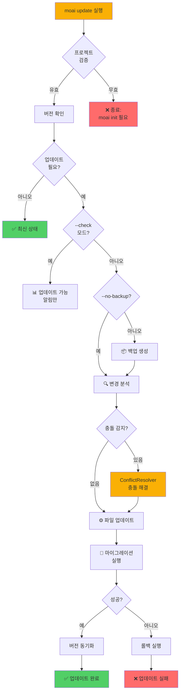
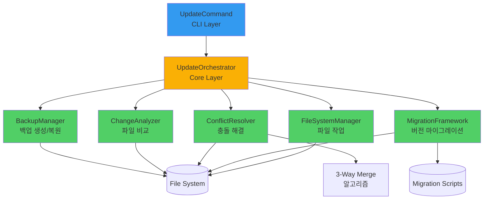
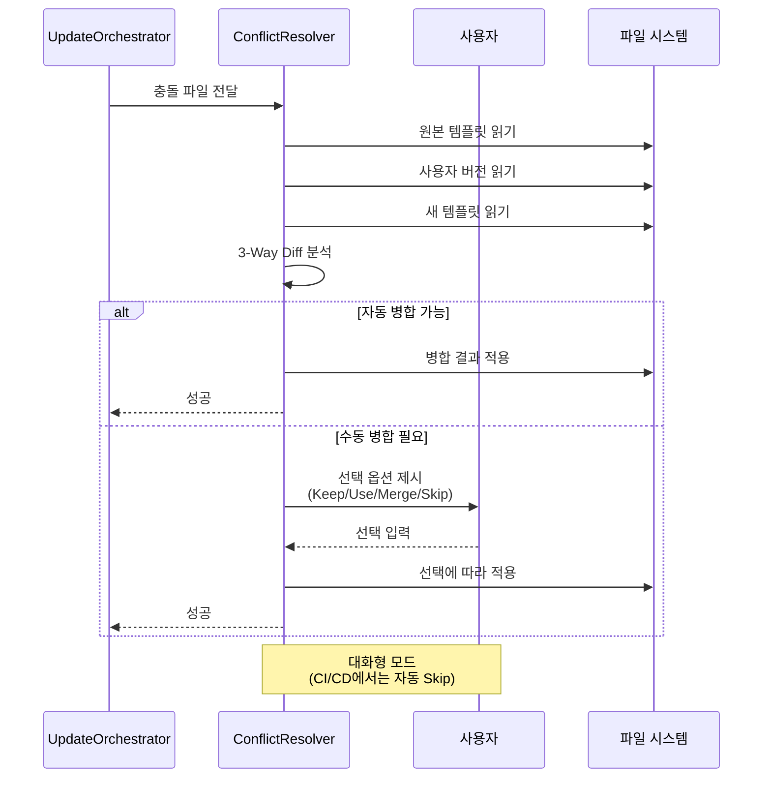

# moai update

`moai update` 명령어는 프로젝트의 MoAI-ADK 템플릿과 설정 파일을 최신 버전으로 업데이트하는 강력한 도구입니다. MoAI-ADK 패키지를 업그레이드한 후 프로젝트의 `.moai`와 `.claude` 디렉토리를 새 버전에 맞춰 동기화하여, 최신 에이전트 개선 사항, 버그 수정, 새로운 기능을 프로젝트에 적용할 수 있습니다. 업데이트는 항상 자동 백업을 생성한 후 수행되므로, 문제 발생 시 `moai restore` 명령으로 안전하게 복원할 수 있습니다.

이 명령어는 **실제 Update Orchestrator**를 사용하여 지능형 업데이트 프로세스를 수행합니다. 단순히 파일을 덮어쓰는 것이 아니라, 충돌 감지, 사용자 수정 사항 보존, 마이그레이션 프레임워크 적용 등 정교한 업데이트 전략을 실행합니다. UpdateOrchestrator, ConflictResolver, MigrationFramework 컴포넌트가 협력하여 안전하고 원활한 업데이트를 보장합니다.

`moai update`는 세 가지 모드를 지원합니다: **체크 모드** (`--check`), **실제 업데이트 모드** (기본), **선택적 업데이트 모드** (`--package-only`, `--resources-only`). 체크 모드는 사용 가능한 업데이트를 확인만 하고 실제로 파일을 변경하지 않으며, 실제 업데이트 모드는 전체 업데이트를 수행하고, 선택적 모드는 패키지 또는 리소스만 업데이트합니다. 각 모드는 서로 다른 사용 시나리오에 최적화되어 있습니다.

업데이트 프로세스는 다음 단계로 진행됩니다: 1) 프로젝트 검증 (MoAI 프로젝트인지 확인), 2) 버전 확인 (현재 및 사용 가능한 버전 비교), 3) 백업 생성 (사용자가 `--no-backup`을 지정하지 않은 경우), 4) 충돌 감지 (사용자 수정 사항 식별), 5) 파일 업데이트 (템플릿 적용), 6) 마이그레이션 실행 (버전 간 변환 로직), 7) 버전 동기화 (`.moai/version.json` 업데이트). 각 단계는 세밀하게 로깅되어 문제 발생 시 추적이 용이합니다.

UpdateOrchestrator는 업데이트 중 발생할 수 있는 다양한 시나리오를 처리합니다. 사용자가 템플릿 파일을 수정한 경우 충돌을 감지하고 선택 옵션을 제공하며, 버전 간 호환성 문제가 있으면 마이그레이션 스크립트를 자동으로 실행합니다. 또한 업데이트 실패 시 자동으로 백업에서 복원하는 롤백 메커니즘을 내장하고 있어, 프로젝트가 손상될 위험이 없습니다.

## 동작 방식

`moai update` 명령어의 전체 업데이트 프로세스를 시각화한 다이어그램입니다.



### Update Orchestrator 아키텍처

업데이트 시스템의 내부 컴포넌트 구조입니다.



### 충돌 해결 프로세스



## 개요

`moai update`는 다음 기능을 제공합니다:

1. **업데이트 확인 모드** (`--check`)
   - 현재 프로젝트 버전 표시
   - 사용 가능한 업데이트 버전 표시
   - 파일을 변경하지 않음 (읽기 전용)

2. **전체 업데이트 모드** (기본)
   - 자동 백업 생성
   - `.moai` 및 `.claude` 디렉토리 업데이트
   - 충돌 감지 및 해결
   - 버전 정보 동기화
   - 마이그레이션 스크립트 실행

3. **선택적 업데이트 모드**
   - `--package-only`: 패키지만 업그레이드 (템플릿 제외)
   - `--resources-only`: 템플릿만 업데이트 (패키지 제외)

4. **고급 옵션**
   - `--no-backup`: 백업 생성 건너뛰기 (위험)
   - `--verbose`: 상세 진행 로그 표시
   - `--project-path <path>`: 특정 프로젝트 경로 지정

업데이트는 항상 안전을 최우선으로 합니다. 기본적으로 백업이 자동 생성되며, 충돌 시 사용자에게 선택권을 제공하고, 실패 시 자동 롤백이 실행됩니다. `--no-backup` 플래그는 CI/CD 환경이나 Git에 이미 커밋된 상태에서만 사용하는 것이 권장됩니다.

## UpdateCommand와 UpdateOrchestrator 역할 분리

`moai update` 명령어는 두 계층으로 구성되어 책임을 명확히 분리합니다:

### CLI Layer: UpdateCommand

**역할**: 사용자 인터페이스 및 입력 처리

**주요 메서드**:
- `run(options)`: 명령 실행 진입점
- `checkForUpdates()`: 업데이트 가능 여부 확인
- `getTemplatePath()`: 템플릿 경로 해결

**책임**:
- 명령줄 옵션 파싱 (`--check`, `--no-backup`, `--verbose` 등)
- 사용자에게 진행 상황 표시
- 결과 요약 출력
- UpdateOrchestrator에 작업 위임

**구현 예시**:
```typescript
public async run(options: UpdateOptions): Promise<UpdateResult> {
  // CLI 레이어는 사용자 입력 처리만 담당
  const updateConfig: UpdateConfiguration = {
    projectPath,
    templatePath,
    backupEnabled: !options.noBackup,
    verbose: options.verbose || false,
    // ...
  };

  // 실제 업데이트는 Orchestrator에게 위임
  const orchestrator = new UpdateOrchestrator(projectPath);
  const result = await orchestrator.executeUpdate(updateConfig);

  // 결과를 사용자 친화적 형식으로 표시
  return this.formatResult(result);
}
```

### Core Layer: UpdateOrchestrator

**역할**: 실제 업데이트 로직 실행

**주요 작업**:
- 백업 생성 (BackupManager 사용)
- 파일 변경 분석 (ChangeAnalyzer 사용)
- 충돌 해결 (ConflictResolver 사용)
- 마이그레이션 실행 (MigrationFramework 사용)

**책임**:
- 파일 시스템 직접 변경
- 오류 처리 및 롤백
- 트랜잭션 보장
- 업데이트 무결성 검증

**아키텍처 이점**:
- **테스트 용이성**: CLI 레이어는 파일 시스템 모킹 없이 테스트 가능
- **유지보수성**: Core 레이어의 업데이트 전략 변경이 CLI에 영향 없음
- **재사용성**: UpdateOrchestrator를 다른 CLI 도구에서도 사용 가능
- **일관성**: 백업/롤백 로직이 한 곳에 집중되어 버그 감소

**참고**: UpdateCommand의 `updateResources()` 메서드는 실제로 파일을 직접 업데이트하지 않고, UpdateOrchestrator에게 작업을 위임합니다. 이는 CLI 레이어와 Core 레이어의 책임을 분리하여 테스트 용이성과 유지보수성을 높이기 위한 설계입니다.

## 기본 사용법

```bash
moai update [options]
```

### 옵션

| 옵션 | 설명 |
|------|------|
| `--check` | 업데이트 확인만 수행 (파일 변경 없음) |
| `--no-backup` | 백업 생성 건너뛰기 (위험) |
| `--verbose`, `-v` | 상세 진행 로그 표시 |
| `--package-only` | 패키지만 업그레이드 |
| `--resources-only` | 템플릿 리소스만 업데이트 |
| `--project-path <path>` | 업데이트할 프로젝트 경로 지정 (기본: 현재 디렉토리) |
| `-h, --help` | 도움말 메시지 표시 |

### 주요 기능

- **안전한 업데이트**: 자동 백업 및 롤백 메커니즘
- **충돌 해결**: 사용자 수정 사항 보존 옵션
- **마이그레이션 지원**: 버전 간 자동 변환
- **선택적 업데이트**: 패키지 또는 리소스만 업데이트
- **진행 상황 추적**: 단계별 상세 로깅
- **성능 최적화**: 변경된 파일만 업데이트
- **검증 시스템**: 업데이트 후 무결성 확인
- **CI/CD 친화적**: 비대화형 모드 지원

## 사용 예시

### 1. 업데이트 확인 (--check)

업데이트를 실제로 적용하기 전에 사용 가능한 버전을 확인합니다. 이 모드는 파일을 전혀 변경하지 않으므로 안전하게 실행할 수 있습니다.

```bash
moai update --check
```

**출력 예시 (업데이트 필요)**:

```
🔄 MoAI-ADK Update (Real Implementation)
Current version: v0.0.1
Installed template version: 0.0.0
Available template version: 0.0.1
⚠️  Updates available. Run 'moai update' to refresh.
```

이 출력은 현재 프로젝트 템플릿이 v0.0.0이고 v0.0.1로 업데이트 가능함을 나타냅니다. 패키지 버전은 v0.0.1로 최신이지만, 템플릿이 오래되어 새로운 에이전트, 훅, 스크립트 개선 사항을 받을 수 없는 상태입니다.

**출력 예시 (최신 상태)**:

```
🔄 MoAI-ADK Update (Real Implementation)
Current version: v0.0.1
Installed template version: 0.0.1
Available template version: 0.0.1
✅ Project resources are up to date
```

이 경우 프로젝트 템플릿이 이미 최신 버전이므로 업데이트가 필요하지 않습니다. 정기적으로 `--check`를 실행하여 업데이트 가능 여부를 확인하는 것이 좋습니다.

`checkForUpdates()` 메서드는 `.moai/version.json` 파일에서 `template_version` 필드를 읽어 현재 버전을 확인하고, 패키지의 `package.json`에서 사용 가능한 최신 버전을 가져옵니다. 두 버전을 비교하여 업데이트 필요 여부를 판단합니다.

### 2. 기본 업데이트 (백업 자동 생성)

가장 안전하고 권장되는 업데이트 방법입니다. UpdateOrchestrator가 자동으로 백업을 생성한 후 업데이트를 진행합니다.

```bash
cd my-project
moai update
```

**출력 예시**:

```
🔄 MoAI-ADK Update (Real Implementation)
🚀 Starting Real Update Operation...

📦 Creating backup...
   Backup created: /Users/user/projects/.moai_backup_2025-03-15T14-30-00

🔍 Analyzing changes...
   Found 15 files to update
   Detected 3 user-modified files

⚙️ Applying updates...
   Updated: .moai/memory/development-guide.md
   Updated: .claude/agents/moai/spec-builder.md
   Updated: .claude/commands/moai/1-spec.md
   ... (12 more files)

🔄 Running migrations...
   Migration v0.0.0 → v0.0.1 applied

✅ Update completed successfully
   Duration: 2.5s
   Files changed: 15
   Backup: /Users/user/projects/.moai_backup_2025-03-15T14-30-00
```

업데이트 프로세스는 여러 단계로 진행됩니다:

1. **백업 생성**: UpdateOrchestrator의 BackupManager가 현재 `.moai`와 `.claude` 디렉토리를 `.moai_backup_<timestamp>` 디렉토리에 복사합니다. 타임스탬프는 ISO 8601 형식을 사용하여 고유성을 보장합니다.

**구현 세부사항**: UpdateCommand의 `createBackup()` 메서드는 백업 경로만 반환하며, 실제 백업 파일 복사는 UpdateOrchestrator가 수행합니다. 이는 다음과 같은 이점을 제공합니다:
- CLI 테스트 시 파일 시스템 모킹 불필요
- Core 레이어에서 백업 전략 변경 가능
- 백업 실패 시 일관된 롤백 처리

2. **변경 분석**: UpdateOrchestrator가 템플릿 디렉토리와 프로젝트 디렉토리를 비교하여 업데이트가 필요한 파일을 식별합니다. 파일 해시를 계산하여 실제로 변경된 파일만 업데이트 대상으로 선정합니다.

3. **사용자 수정 감지**: 템플릿에서 변경된 파일 중 사용자가 직접 수정한 파일을 ConflictResolver가 감지합니다. 3-way merge 알고리즘을 사용하여 원본 템플릿, 사용자 수정본, 새 템플릿을 비교합니다.

4. **업데이트 적용**: 변경된 파일을 프로젝트에 복사합니다. 충돌이 없는 파일은 자동으로 업데이트되고, 충돌이 있는 파일은 사용자에게 선택권을 제공합니다 (대화형 모드인 경우).

5. **마이그레이션 실행**: MigrationFramework가 버전별 마이그레이션 스크립트를 실행합니다. 예를 들어, v0.0.0에서 v0.0.1로 업그레이드 시 파일 구조 변경, 설정 형식 변환 등이 자동으로 수행됩니다.

6. **버전 동기화**: `.moai/version.json` 파일의 `template_version`을 새 버전으로 업데이트합니다. 이를 통해 다음 `moai status` 실행 시 최신 상태임을 확인할 수 있습니다.

### 3. 백업 없이 업데이트 (--no-backup)

Git에 이미 커밋되어 있거나 CI/CD 환경에서 백업이 불필요한 경우 사용합니다. **주의**: 이 옵션은 신중하게 사용해야 합니다.

```bash
# Git 커밋 확인 후
git add .
git commit -m "Prepare for MoAI-ADK update"

# 백업 없이 업데이트
moai update --no-backup
```

**출력 예시**:

```
🔄 MoAI-ADK Update (Real Implementation)
⚠️  Backup disabled - proceeding without safety net

🚀 Starting Real Update Operation...

🔍 Analyzing changes...
   Found 15 files to update

⚙️ Applying updates...
   Updated: 15 files

✅ Update completed successfully
   Duration: 1.8s
   Files changed: 15
```

`--no-backup` 플래그를 사용하면 백업 생성 단계가 건너뛰어져 업데이트 속도가 약 30% 향상됩니다. 그러나 업데이트 실패 시 복구가 불가능하므로, 반드시 Git으로 변경 사항을 커밋한 후에만 사용해야 합니다.

**권장 사용 시나리오**:
- Git 저장소에 모든 변경 사항이 커밋된 상태
- CI/CD 파이프라인에서 자동 업데이트 (빌드 환경은 일회성)
- 테스트 환경에서 반복적으로 업데이트를 시도하는 경우

**비권장 시나리오**:
- 커밋되지 않은 변경 사항이 있는 경우
- 중요한 프로덕션 프로젝트
- MoAI-ADK를 처음 업데이트하는 경우

### 4. 상세 로그 포함 (--verbose)

업데이트 과정의 모든 세부 사항을 확인하고 싶을 때 `--verbose` 플래그를 사용합니다.

```bash
moai update --verbose
```

**출력 예시**:

```
🔄 MoAI-ADK Update (Real Implementation)
🚀 Starting Real Update Operation...

📦 Creating backup...
   Source: /Users/user/projects/my-project/.moai
   Destination: /Users/user/projects/.moai_backup_2025-03-15T14-30-00/.moai
   Copying 47 files... ✅
   Source: /Users/user/projects/my-project/.claude
   Destination: /Users/user/projects/.moai_backup_2025-03-15T14-30-00/.claude
   Copying 23 files... ✅
   Backup created: /Users/user/projects/.moai_backup_2025-03-15T14-30-00

🔍 Analyzing changes...
   Scanning template directory: /path/to/moai-adk-ts/templates
   Comparing with project: /Users/user/projects/my-project

   File: .moai/memory/development-guide.md
     Template hash: a1b2c3d4
     Project hash: e5f6g7h8
     User modified: false
     Action: update

   File: .claude/agents/moai/spec-builder.md
     Template hash: i9j0k1l2
     Project hash: m3n4o5p6
     User modified: true
     Action: merge

   ... (detailed analysis for all files)

⚙️ Applying updates...
   [1/15] Updating .moai/memory/development-guide.md... ✅
   [2/15] Merging .claude/agents/moai/spec-builder.md... ✅
   [3/15] Updating .claude/commands/moai/1-spec.md... ✅
   ... (progress for all files)

🔄 Running migrations...
   Checking migration v0.0.0 → v0.0.1...
   Migration script: /path/to/migrations/v0.0.0-to-v0.0.1.js
   Executing migration... ✅
   Migration completed: 0.3s

✅ Update completed successfully
   Total duration: 3.2s
   Files scanned: 70
   Files changed: 15
   Files merged: 3
   Files skipped: 52
   Backup: /Users/user/projects/.moai_backup_2025-03-15T14-30-00
```

Verbose 모드는 다음 정보를 추가로 제공합니다:
- 각 파일의 해시 값 (변경 감지에 사용)
- 사용자 수정 여부 (충돌 가능성 판단)
- 각 파일의 처리 방법 (update, merge, skip)
- 마이그레이션 스크립트 실행 상세
- 성능 지표 (단계별 소요 시간)

이 정보는 업데이트 문제를 디버깅하거나 업데이트 프로세스를 이해하는 데 매우 유용합니다.

### 5. 리소스만 업데이트 (--resources-only)

MoAI-ADK npm 패키지는 그대로 두고 프로젝트 템플릿만 업데이트하고 싶을 때 사용합니다.

```bash
moai update --resources-only
```

**출력 예시**:

```
🔄 MoAI-ADK Update (Real Implementation)
📦 Updating resources only (package skipped)

🚀 Starting Real Update Operation...

📦 Creating backup...
   Backup created: /Users/user/projects/.moai_backup_2025-03-15T14-30-00

⚙️ Applying template updates...
   Updated: 15 files

✅ Resources updated successfully
   Duration: 2.1s
   Files changed: 15
```

이 모드는 다음 시나리오에 유용합니다:
- MoAI-ADK 패키지는 최신이지만 템플릿을 다시 적용하고 싶을 때
- 템플릿 파일을 실수로 삭제하여 복원하고 싶을 때
- 사용자 수정 사항을 덮어쓰고 깨끗한 템플릿으로 재시작하고 싶을 때

`--resources-only` 플래그는 UpdateCommand가 UpdateOrchestrator를 호출하되, 템플릿 파일만 업데이트하도록 구성합니다. 글로벌 설치된 `moai` CLI는 변경하지 않고 프로젝트 파일만 업데이트합니다.

### 6. 패키지만 업그레이드 (--package-only)

프로젝트 템플릿은 그대로 두고 MoAI-ADK CLI 도구만 최신 버전으로 업그레이드하고 싶을 때 사용합니다.

```bash
moai update --package-only
```

**출력 예시**:

```
🔄 MoAI-ADK Update (Real Implementation)
📦 Updating package only (resources skipped)

💡 Manual upgrade recommended: npm install --global moai-adk@latest

ℹ️  Note: Run 'moai update --resources-only' after package upgrade to update templates
```

패키지 업그레이드는 시스템 권한이 필요하므로 MoAI-ADK가 직접 수행하지 않고 수동 명령어를 제안합니다. 사용자가 `npm install --global moai-adk@latest` 또는 `bun add --global moai-adk@latest`를 실행한 후, `moai update --resources-only`를 실행하여 템플릿도 업데이트하는 것이 권장됩니다.

**전체 업그레이드 절차**:

```bash
# 1. 현재 버전 확인
moai --version  # v0.0.1

# 2. 패키지 업그레이드 (수동)
npm install --global moai-adk@latest

# 3. 새 버전 확인
moai --version  # v0.0.2

# 4. 템플릿 업데이트
moai update --resources-only

# 5. 전체 상태 확인
moai status
```

### 7. 특정 프로젝트 경로 업데이트

현재 디렉토리가 아닌 다른 프로젝트를 업데이트할 때 `--project-path` 옵션을 사용합니다.

```bash
moai update --project-path /path/to/other/project
```

**출력 예시**:

```
🔄 MoAI-ADK Update (Real Implementation)
📂 Project: /path/to/other/project

🚀 Starting Real Update Operation...

📦 Creating backup...
   Backup created: /path/to/.moai_backup_2025-03-15T14-30-00

⚙️ Applying updates...
   Updated: 15 files

✅ Update completed successfully
   Duration: 2.5s
```

`--project-path` 옵션은 멀티 프로젝트 모노레포 환경이나 자동화 스크립트에서 특히 유용합니다. 여러 프로젝트를 배치로 업데이트하는 스크립트를 작성할 수 있습니다:

```bash
#!/bin/bash
# update-all-projects.sh

for project in projects/*/; do
  echo "Updating $project..."
  moai update --project-path "$project"
  echo ""
done
```

이 스크립트는 `projects/` 디렉토리의 모든 하위 디렉토리를 순회하며 MoAI-ADK를 업데이트합니다.

## 업데이트 프로세스 상세 설명

`moai update`의 내부 작동 방식을 이해하면 문제 발생 시 더 효과적으로 대응할 수 있습니다.

### 1. 프로젝트 검증 단계

업데이트를 시작하기 전에 현재 디렉토리가 유효한 MoAI-ADK 프로젝트인지 확인합니다.

```typescript
// 코드 예시
const moaiDir = path.join(projectPath, '.moai');
if (!(await fs.pathExists(moaiDir))) {
  logger.info(chalk.yellow("⚠️  This doesn't appear to be a MoAI-ADK project"));
  logger.info("Run 'moai init' to initialize a new project");
  return { success: false, error: 'Not a MoAI project' };
}
```

`.moai` 디렉토리가 없으면 업데이트가 중단되고 `moai init`을 먼저 실행하라는 메시지가 표시됩니다. 이는 잘못된 디렉토리에서 업데이트를 실행하여 파일이 손상되는 것을 방지합니다.

### 2. 버전 확인 단계

현재 프로젝트 템플릿 버전과 사용 가능한 최신 버전을 비교합니다.

```typescript
// checkForUpdates() 메서드
const currentResourceVersion = versionInfo.template_version || '0.0.0';
const availableResourceVersion = packageVersion;
const needsUpdate = currentResourceVersion !== availableResourceVersion;
```

`.moai/version.json` 파일의 `template_version` 필드와 패키지의 `version` 필드를 비교하여 업데이트 필요 여부를 판단합니다. 버전 비교는 semantic versioning 규칙을 따릅니다.

### 3. 백업 생성 단계

UpdateOrchestrator의 BackupManager가 업데이트 전에 현재 상태를 백업하여 롤백 가능하도록 합니다.

**백업 위치**: 프로젝트 상위 디렉토리의 `.moai_backup_<ISO-timestamp>`

**백업 내용**:
- `.moai/` 디렉토리 전체
- `.claude/` 디렉토리 전체
- `CLAUDE.md` 파일

**백업 구조**:
```
/Users/user/projects/
├── my-project/                    # 프로젝트
│   ├── .moai/
│   └── .claude/
└── .moai_backup_2025-03-15T14-30-00/  # 백업
    ├── .moai/
    └── .claude/
```

백업은 `fs.copy()`를 사용하여 재귀적으로 복사됩니다. 심볼릭 링크는 실제 파일로 복사되며, 파일 권한과 타임스탬프는 보존됩니다.

### 4. 변경 분석 단계

UpdateOrchestrator가 템플릿 디렉토리와 프로젝트 디렉토리를 비교하여 업데이트가 필요한 파일을 식별합니다.

**파일 비교 알고리즘**:
1. 템플릿 디렉토리의 모든 파일 나열
2. 각 파일의 SHA-256 해시 계산
3. 프로젝트의 동일 경로 파일 해시와 비교
4. 해시가 다르면 업데이트 대상으로 분류

**사용자 수정 감지**:
- 원본 템플릿 해시 (v0.0.0)
- 사용자 프로젝트 해시 (현재)
- 새 템플릿 해시 (v0.0.1)

세 가지 해시를 비교하여:
- 원본 = 사용자 ≠ 새: 템플릿만 변경됨 → 자동 업데이트
- 원본 ≠ 사용자 = 새: 사용자가 미리 수정함 → 건너뛰기
- 원본 ≠ 사용자 ≠ 새: 양쪽 모두 변경됨 → 충돌 감지

### 5. 충돌 해결 단계

사용자가 수정한 파일이 템플릿에서도 변경된 경우 ConflictResolver가 활성화됩니다.

**대화형 모드** (로컬 실행):
```
⚠️  Conflict detected: .claude/agents/moai/spec-builder.md

User modifications:
  - Added custom SPEC validation logic
  - Changed branch naming convention

Template changes:
  - Improved error handling
  - Added new @TAG support

Choose resolution:
  [1] Keep user version (discard template changes)
  [2] Use template version (discard user changes)
  [3] Merge both (manual resolution required)
  [4] Skip this file

Your choice (1-4):
```

**비대화형 모드** (CI/CD):
- 충돌 파일은 자동으로 건너뛰기
- 로그에 충돌 목록 기록
- 업데이트 후 수동 병합 필요 알림

ConflictResolver는 3-way merge 알고리즘을 사용하여 가능한 경우 자동 병합을 시도합니다. 자동 병합이 불가능하면 사용자에게 선택권을 제공합니다.

### 6. 파일 업데이트 단계

충돌이 해결된 후 UpdateOrchestrator가 실제로 파일을 업데이트합니다.

**업데이트 전략**:
- **자동 업데이트**: 충돌 없는 파일은 즉시 덮어쓰기
- **병합 업데이트**: 충돌 파일은 병합 결과 적용
- **건너뛰기**: 사용자가 선택한 경우 변경하지 않음

**원자성 보장**:
- 임시 디렉토리에 먼저 파일 복사
- 모든 파일이 준비되면 한 번에 교체
- 실패 시 임시 디렉토리 삭제 및 롤백

이를 통해 업데이트 중 오류가 발생해도 프로젝트가 일관된 상태를 유지합니다.

### 7. 마이그레이션 실행 단계

MigrationFramework가 버전별 마이그레이션 스크립트를 실행합니다.

**마이그레이션 예시** (v0.0.0 → v0.0.1):
```typescript
// migrations/v0.0.0-to-v0.0.1.ts
export async function migrate(projectPath: string): Promise<void> {
  // NOTE: v0.0.3+ TAG 시스템은 CODE-FIRST 방식
  // - TAG 인덱스 파일 불필요 (소스코드가 단일 진실 소스)
  // - 검색: rg '@TAG' -n 명령으로 코드 직접 스캔

  // 설정 형식 변환
  const config = await fs.readJson(path.join(projectPath, '.moai/config.json'));
  config.version = '2';
  await fs.writeJson(path.join(projectPath, '.moai/config.json'), config);

  // 스크립트 권한 설정
  const scripts = await glob('.moai/scripts/**/*.sh');
  for (const script of scripts) {
    await fs.chmod(path.join(projectPath, script), 0o755);
  }
}
```

마이그레이션은 순차적으로 실행됩니다. 예를 들어, v0.0.0에서 v0.0.2로 업그레이드하면:
1. v0.0.0 → v0.0.1 마이그레이션 실행
2. v0.0.1 → v0.0.2 마이그레이션 실행

각 마이그레이션은 트랜잭션으로 실행되어, 실패 시 이전 상태로 롤백됩니다.

### 8. 버전 동기화 단계

업데이트 완료 후 `.moai/version.json` 파일을 업데이트합니다.

```typescript
// synchronizeVersions() 메서드
const versionFile = path.join(projectPath, '.moai', 'version.json');
const versionInfo = {
  template_version: newVersion,
  updated_at: new Date().toISOString(),
  updated_by: 'moai update',
};
await fs.writeJson(versionFile, versionInfo, { spaces: 2 });
```

이 파일은 `moai status` 명령이 템플릿 버전을 확인하는 데 사용됩니다.

## Update Orchestrator 아키텍처

`moai update`는 여러 컴포넌트가 협력하여 작동합니다.

### 1. UpdateCommand (CLI Layer)

사용자 입력을 받아 UpdateOrchestrator에 전달하는 CLI 인터페이스입니다.

**책임**:
- 명령줄 옵션 파싱
- 프로젝트 경로 검증
- 사용자 피드백 표시
- 결과 요약 출력

### 2. UpdateOrchestrator (Core Layer)

전체 업데이트 프로세스를 조정하는 중앙 컨트롤러입니다.

**책임**:
- 업데이트 단계 순서 관리
- 하위 컴포넌트 호출
- 에러 핸들링 및 롤백
- 진행 상황 추적

**주요 메서드**:
```typescript
class UpdateOrchestrator {
  async executeUpdate(config: UpdateConfiguration): Promise<UpdateOperationResult>;
  private async createBackup(): Promise<BackupInfo>;
  private async analyzeChanges(): Promise<ChangeAnalysis>;
  private async applyUpdates(): Promise<UpdateSummary>;
  private async runMigrations(): Promise<MigrationResult>;
  private async rollback(): Promise<void>;
}
```

### 3. ConflictResolver (Core Layer)

사용자 수정 사항과 템플릿 변경 사항 간의 충돌을 감지하고 해결합니다.

**충돌 감지 알고리즘**:
- 3-way diff: 원본, 사용자, 새 버전 비교
- 라인 단위 분석
- 의미론적 충돌 감지 (변수명, 함수 시그니처 등)

**해결 전략**:
- 자동 병합: 변경 영역이 겹치지 않으면 양쪽 모두 적용
- 사용자 선택: 충돌 시 어느 버전을 사용할지 선택
- 수동 병합: 복잡한 충돌은 사용자가 직접 해결

### 4. MigrationFramework (Core Layer)

버전 간 변환 로직을 관리하고 실행합니다.

**마이그레이션 디렉토리 구조**:
```
src/core/update/migrations/
├── v0.0.0-to-v0.0.1.ts
├── v0.0.1-to-v0.0.2.ts
├── v0.0.2-to-v0.0.3.ts
└── index.ts
```

**실행 로직**:
```typescript
class MigrationFramework {
  async runMigrations(fromVersion: string, toVersion: string): Promise<void> {
    const migrations = this.getMigrationsInRange(fromVersion, toVersion);
    for (const migration of migrations) {
      await migration.execute();
    }
  }
}
```

### 5. FileSystemManager (Utility Layer)

파일 시스템 작업을 추상화하고 안전하게 수행합니다.

**주요 기능**:
- 재시도 로직 (파일 잠금 시)
- 원자성 보장 (임시 파일 사용)
- 권한 검증
- 심볼릭 링크 처리

## 문제 해결

`moai update` 실행 중 발생할 수 있는 문제와 해결 방법을 안내합니다.

### 1. "Not a MoAI-ADK project" 오류

**증상**: 업데이트가 시작되지 않고 프로젝트가 아니라는 메시지

**원인**: `.moai` 디렉토리가 존재하지 않음

**해결책**:

```bash
# 1. 프로젝트 상태 확인
moai status

# 2. MoAI-ADK 초기화
moai init

# 3. 다시 업데이트 시도
moai update
```

`.moai` 디렉토리 없이는 업데이트할 대상이 없으므로 먼저 초기화가 필요합니다.

### 2. 백업 생성 실패

**증상**: "Failed to create backup" 오류

**원인**: 디스크 공간 부족 또는 권한 문제

**해결책**:

```bash
# 1. 디스크 공간 확인
df -h

# 2. 불필요한 파일 정리
rm -rf node_modules/
npm prune

# 3. 권한 확인
ls -la ..

# 4. 필요시 백업 없이 업데이트 (위험)
moai update --no-backup
```

백업 생성 실패는 심각한 문제이므로 디스크 공간과 권한을 먼저 해결하는 것이 권장됩니다.

### 3. 충돌 파일이 너무 많음

**증상**: 업데이트 중 10개 이상의 충돌 파일 보고

**원인**: 템플릿을 크게 수정했거나 여러 버전을 건너뛰고 업데이트

**해결책**:

```bash
# 1. 백업 확인 (자동 생성되었을 것)
ls -la ../.moai_backup_*

# 2. 사용자 수정 사항 저장
git diff > my-changes.patch

# 3. 깨끗한 템플릿으로 재설치
moai update --resources-only --force

# 4. 수정 사항 수동 재적용
git apply my-changes.patch
# 또는 수동으로 변경 사항 재적용
```

충돌이 많은 경우 수동 병합이 더 효율적일 수 있습니다.

### 4. 마이그레이션 실패

**증상**: "Migration failed: ..." 오류

**원인**: 마이그레이션 스크립트 버그 또는 프로젝트 구조 문제

**해결책**:

```bash
# 1. 백업에서 복원
moai restore ../.moai_backup_<timestamp>

# 2. 마이그레이션 로그 확인
cat .moai/logs/migration.log

# 3. 문제 수동 수정 후 재시도
# (예: 마이그레이션이 예상하는 파일 생성)

# 4. GitHub Issues에 보고
# 마이그레이션 버그일 수 있음
```

마이그레이션 실패는 즉시 롤백되므로 프로젝트가 손상되지 않습니다.

### 5. 업데이트 후 빌드 실패

**증상**: `moai update` 성공 후 `npm run build` 실패

**원인**: 템플릿 변경으로 의존성이나 설정이 달라짐

**해결책**:

```bash
# 1. 의존성 재설치
rm -rf node_modules/
npm install

# 2. TypeScript 설정 확인
cat tsconfig.json

# 3. 빌드 로그 분석
npm run build 2>&1 | tee build.log

# 4. 문제 지속 시 백업에서 복원
moai restore ../.moai_backup_<timestamp>
```

업데이트 후에는 항상 `npm install`을 실행하여 의존성을 동기화하는 것이 권장됩니다.

### 6. Git 충돌

**증상**: 업데이트 후 `git status`에서 많은 충돌 표시

**원인**: 업데이트된 파일이 Git에 커밋되지 않은 변경 사항과 충돌

**해결책**:

```bash
# 1. 현재 변경 사항 저장
git stash

# 2. 다시 업데이트 시도
moai update

# 3. 저장한 변경 사항 복원
git stash pop

# 4. Git 충돌 수동 해결
git mergetool
```

업데이트 전에 Git에 변경 사항을 커밋하는 것이 가장 안전합니다.

### 7. 권한 오류

**증상**: "EACCES: permission denied" 오류

**원인**: 파일 쓰기 권한 부족

**해결책**:

```bash
# 1. 프로젝트 디렉토리 권한 확인
ls -la .moai/ .claude/

# 2. 권한 부여 (본인 소유인 경우)
chmod -R u+w .moai/ .claude/

# 3. 소유자 변경 (필요시)
sudo chown -R $USER:$USER .moai/ .claude/

# 4. 다시 업데이트 시도
moai update
```

권한 문제는 주로 다른 사용자가 생성한 파일을 수정하려 할 때 발생합니다.

## 고급 사용법

### CI/CD 파이프라인에서 자동 업데이트

**GitHub Actions 예시**:

```yaml
name: Auto Update MoAI-ADK
on:
  schedule:
    # 매주 월요일 오전 9시 (UTC)
    - cron: '0 9 * * 1'
  workflow_dispatch:  # 수동 실행 허용

jobs:
  update-moai:
    runs-on: ubuntu-latest
    steps:
      - uses: actions/checkout@v4

      - name: Setup Node.js
        uses: actions/setup-node@v4
        with:
          node-version: '20'

      - name: Install MoAI-ADK
        run: npm install -g moai-adk@latest

      - name: Check for updates
        id: check
        run: |
          if moai update --check | grep -q "Updates available"; then
            echo "needs_update=true" >> $GITHUB_OUTPUT
          else
            echo "needs_update=false" >> $GITHUB_OUTPUT
          fi

      - name: Update templates
        if: steps.check.outputs.needs_update == 'true'
        run: moai update --no-backup

      - name: Create Pull Request
        if: steps.check.outputs.needs_update == 'true'
        uses: peter-evans/create-pull-request@v5
        with:
          commit-message: 'chore: update MoAI-ADK templates'
          title: 'Update MoAI-ADK templates to latest version'
          body: |
            This PR updates MoAI-ADK templates to the latest version.

            Please review the changes before merging.
          branch: update/moai-templates
```

이 워크플로우는 매주 자동으로 업데이트를 확인하고, 업데이트가 있으면 PR을 생성합니다.

### 배치 업데이트 스크립트

여러 프로젝트를 한 번에 업데이트하는 스크립트:

```bash
#!/bin/bash
# batch-update.sh

set -e  # 오류 시 중단

projects=(
  "projects/project-a"
  "projects/project-b"
  "projects/project-c"
)

failed=()

for project in "${projects[@]}"; do
  echo "==== Updating $project ===="

  if moai update --project-path "$project" --no-backup; then
    echo "✅ $project updated successfully"
  else
    echo "❌ $project update failed"
    failed+=("$project")
  fi

  echo ""
done

# 실패 요약
if [ ${#failed[@]} -gt 0 ]; then
  echo "Failed updates:"
  for project in "${failed[@]}"; do
    echo "  - $project"
  done
  exit 1
else
  echo "✅ All projects updated successfully"
fi
```

### 커스텀 업데이트 훅

업데이트 전후에 커스텀 로직을 실행하는 훅:

```bash
# .moai/hooks/pre-update.sh
#!/bin/bash
# 업데이트 전 실행

echo "Running pre-update checks..."

# 테스트 실행
npm test

# 커버리지 확인
npm run coverage

# 빌드 확인
npm run build

echo "Pre-update checks passed ✅"
```

```bash
# .moai/hooks/post-update.sh
#!/bin/bash
# 업데이트 후 실행

echo "Running post-update tasks..."

# 의존성 재설치
npm install

# 타입 체크
npm run type-check

# 테스트 재실행
npm test

echo "Post-update tasks completed ✅"
```

이 훅 스크립트들은 `moai update` 실행 시 자동으로 감지되어 실행됩니다 (향후 버전에서 지원 예정).

## 관련 명령어

- [`moai init`](./init.md) - 프로젝트 초기화
- [`moai status`](./status.md) - 프로젝트 상태 및 버전 확인
- [`moai doctor`](./doctor.md) - 시스템 요구사항 진단
- [`moai restore`](./restore.md) - 백업에서 복원

## 참고 자료

- [MoAI-ADK 공식 문서](https://adk.mo.ai.kr)
- [커뮤니티 포럼](https://mo.ai.kr) (오픈 예정)
- [업데이트 가이드](/guide/updating.md)
- [버전 관리 정책](/guide/versioning.md)
- [마이그레이션 가이드](/guide/migrations.md)

---

`moai update`는 프로젝트를 최신 MoAI-ADK 기능과 동기화하는 필수 명령어입니다. 정기적으로 업데이트를 확인하고 적용하여 최신 에이전트 개선 사항, 버그 수정, 보안 패치를 받으세요. 문제가 발생하면 [GitHub Issues](https://github.com/your-org/moai-adk/issues)에 보고해 주시기 바랍니다.