# MoAI-ADK 워크플로우 개념

> **@VISION:WORKFLOW-PHILOSOPHY-001** "No spec, no code. No tests, no implementation."

MoAI-ADK는 **Spec-First TDD** 개발 방법론을 Claude Code 환경에서 체계적으로 실행할 수 있도록 하는 완전한 Agentic Development Kit입니다. 4단계 워크플로우와 16-Core TAG 시스템을 통해 요구사항부터 구현까지의 완전한 추적성을 보장합니다.

---

## 🚫 바이브 코딩의 구조적 한계

### @PROBLEM:VIBE-CODING-LIMITS-001 전통적 개발 방식의 문제점

**"바이브 코딩"**은 직관과 감에 의존하는 전통적인 개발 방식으로, 다음과 같은 구조적 한계를 갖습니다:


### 바이브 코딩의 주요 문제점

#### 1. **📝 명세 부재로 인한 혼란**

- 요구사항이 구두로만 전달되어 오해와 착각 발생
- 구현 중간에 요구사항 변경으로 인한 전면 재작업
- 완성 기준이 모호하여 무한 수정 반복

#### 2. **🧪 테스트 후순위로 인한 품질 저하**

- "일단 돌아가게 만들고 나중에 테스트" 접근법
- 버그 발견이 늦어져 수정 비용 기하급수적 증가
- 회귀 테스트 부족으로 새로운 기능 추가 시마다 기존 기능 손상

#### 3. **🔗 추적성 부족으로 인한 관리 불가**

- 왜 이 코드가 작성되었는지 알 수 없음
- 요구사항과 구현 사이의 연결 관계 소실
- 변경 영향 범위 예측 불가

#### 4. **📚 문서화 지연으로 인한 지식 손실**

- "나중에 문서 작성하자" → 영원히 미뤄짐
- 개발자 이직 시 프로젝트 지식 완전 소실
- 신규 개발자 온보딩 시간 과도하게 소요

### 바이브 코딩 vs 체계적 개발 비교


---

## 🤖 에이전틱 코딩 (Agentic Coding)

### @VISION:AGENTIC-PARADIGM-001 새로운 개발 패러다임

**에이전틱 코딩**은 AI 에이전트가 개발 워크플로우를 자동화하고 가이드하는 혁신적인 개발 방법론입니다. 체계적인 프로세스와 지능형 자동화를 통해 바이브 코딩의 한계를 근본적으로 해결합니다.


### 에이전틱 코딩의 핵심 원칙

#### 1. **🤝 Human-AI 협업 (Collaborative Intelligence)**

- AI가 반복적 작업 자동화, 인간이 창의적 판단과 검증 담당
- 실시간 피드백 루프를 통한 지속적 품질 개선
- AI 추천과 인간 결정의 균형잡힌 조합

#### 2. **📋 프로세스 강제 (Process Enforcement)**

- 명세 없이는 코드 작성 불가하도록 시스템적 제약
- TDD 사이클을 자동화하여 테스트 우선 원칙 보장
- Git 워크플로우 자동화로 일관된 히스토리 관리

#### 3. **🔍 지능형 품질 보증 (Intelligent QA)**

- TRUST 5원칙 자동 검증 및 위반 사항 즉시 알림
- 코드 복잡도, 보안 취약점, 성능 이슈 실시간 감지
- 개발 가이드 위반 시 자동 차단 및 수정 가이드 제공

#### 4. **📈 지속적 학습 (Continuous Learning)**

- 프로젝트 패턴 학습을 통한 맞춤형 자동화 개선
- 팀별 코딩 스타일과 비즈니스 도메인 지식 축적
- 과거 실수 학습을 통한 예방적 품질 관리

### MoAI-ADK 에이전트 생태계


### 에이전틱 vs 전통적 개발 비교표

| 구분 | 바이브 코딩 | 에이전틱 코딩 (MoAI-ADK) |
|------|-------------|---------------------------|
| **진입점** | 💡 아이디어 → 바로 코딩 | 📋 명세 작성 → 체계적 구현 |
| **품질 관리** | 🔥 사후 급한 불 끄기 | 🛡️ 사전 예방적 품질 보증 |
| **테스트** | 🚫 나중에 추가 (거의 안 함) | ✅ 테스트 우선 (자동 강제) |
| **문서화** | 📝 개발 후 별도 작업 | 🔄 코드와 실시간 동기화 |
| **협업** | 💬 구두 전달 + 추측 | 🤖 AI 매개 체계적 소통 |
| **디버깅** | 🔍 개인 경험과 감에 의존 | 🧠 AI 진단 + 패턴 학습 |
| **지식 관리** | 🧠 개인 기억에 의존 | 📚 시스템적 지식 축적 |
| **확장성** | 📉 팀 규모에 반비례 감소 | 📈 AI 지원으로 선형 확장 |

### 에이전틱 코딩의 실제 동작 시나리오


---

## 🎯 핵심 개념 개요

### MoAI-ADK의 4단계 파이프라인


### TRUST 5원칙 기반 품질 보장

| 원칙 | 의미 | MoAI-ADK 적용 |
|------|------|---------------|
| **T**est First | 테스트 우선 | Red-Green-Refactor 자동 커밋 |
| **R**eadable | 읽기 쉽게 | 명확한 명세와 코드 주석 |
| **U**nified | 통합 설계 | 16-Core TAG 시스템 |
| **S**ecured | 안전하게 | 구조화된 로깅과 검증 |
| **T**rackable | 추적 가능 | 완전한 Git 히스토리 관리 |

---

## 📋 1️⃣ SDD: Specification-Driven Development

### @REQ:SDD-PHILOSOPHY-001 Spec-First 철학

**"명세 없이는 코드 없음"** - 모든 구현은 반드시 명확한 명세부터 시작합니다.

#### EARS 형식 명세 작성

```markdown
# SPEC-XXX: 기능 제목

## Environment (환경 및 전제 조건)
- 실행 환경, 기술 종속성, 현재 시스템 상태

## Assumptions (가정 사항)
- 성능 목표, 호환성 가정, 비즈니스 가정

## Requirements (기능 요구사항)
- R1. 성능 요구사항
- R2. 기능 요구사항
- R3. 품질 요구사항

## Specifications (상세 명세)
- 구체적인 구현 방법, API 설계, 데이터 구조
```

#### `/moai:1-spec` 명령어 실행

```bash
# 자동 SPEC 생성 (프로젝트 문서 기반)
/moai:1-spec 사용자 인증 시스템

# 기존 SPEC 수정
/moai:1-spec SPEC-001 OAuth2 통합 추가
```

**자동 처리 과정**:
1. `product.md`, `structure.md`, `tech.md` 분석
2. EARS 형식으로 명세 초안 생성
3. Git 브랜치 생성 (팀 모드) 또는 체크포인트 생성 (개인 모드)
4. GitHub Issue 연동 (팀 모드)

---

## 🧪 2️⃣ TDD: Test-Driven Development

### @DESIGN:TDD-CYCLE-001 Red-Green-Refactor 사이클

TDD의 핵심인 **Red → Green → Refactor** 패턴을 자동화된 Git 커밋으로 지원합니다.


#### `/moai:2-build` 명령어 실행

```bash
# 특정 SPEC 구현
/moai:2-build SPEC-001

# 모든 SPEC 구현
/moai:2-build all
```

### 개인/팀 모드별 TDD 프로세스

#### 개인 모드 (Personal Mode)


#### 팀 모드 (Team Mode)


### TRUST 원칙 검증 @TEST:TRUST-VALIDATION-001

각 TDD 사이클에서 TRUST 5원칙 자동 검증:

```python
# 자동 품질 검증 예시
@validate_trust_principles
def tdd_cycle_validation():
    # T - Test First: 테스트가 구현보다 먼저 작성되었는가?
    assert test_written_before_implementation()

    # R - Readable: 코드가 읽기 쉬운가?
    assert code_complexity() <= SIMPLICITY_THRESHOLD

    # U - Unified: 아키텍처가 일관성 있는가?
    assert architecture_consistency_check()

    # S - Secured: 보안 규칙을 준수하는가?
    assert no_hardcoded_secrets()

    # T - Trackable: TAG가 올바르게 설정되었는가?
    assert tag_traceability_complete()
```

---

## 🏷️ 3️⃣ @TAG 시스템: 완전한 추적성

### @STRUCT:TAG-ARCHITECTURE-001 16-Core TAG 체계

요구사항부터 구현까지의 완전한 추적성을 보장하는 16개 핵심 TAG 카테고리:


### TAG 추적성 체인 예시

```markdown
# 실제 TAG 체인 예시: 사용자 인증 기능

@REQ:USER-AUTH-001 "사용자는 이메일과 비밀번호로 로그인할 수 있어야 한다"
├── @DESIGN:JWT-TOKEN-001 "JWT 토큰 기반 인증 설계"
│   ├── @TASK:LOGIN-API-001 "로그인 API 구현"
│   │   └── @TEST:LOGIN-SUCCESS-001 "로그인 성공 테스트"
│   └── @TASK:TOKEN-VALIDATION-001 "토큰 검증 로직 구현"
│       └── @TEST:TOKEN-INVALID-001 "잘못된 토큰 테스트"
└── @PERF:LOGIN-RESPONSE-001 "로그인 응답 시간 < 200ms"
    └── @SEC:PASSWORD-HASH-001 "비밀번호 해싱 보안"
```

### 자동 TAG 인덱싱 @DATA:TAG-INDEX-001

```json
{
  "tags": {
    "@REQ:USER-AUTH-001": {
      "type": "REQ",
      "id": "USER-AUTH-001",
      "description": "사용자 로그인 요구사항",
      "references": [
        {
          "file": "specs/SPEC-001/spec.md",
          "line": 25,
          "context": "사용자는 이메일과 비밀번호로..."
        }
      ],
      "children": ["@DESIGN:JWT-TOKEN-001"],
      "parents": [],
      "created": "2024-01-15T10:30:00Z"
    }
  },
  "chains": {
    "primary": [
      "@REQ:USER-AUTH-001",
      "@DESIGN:JWT-TOKEN-001",
      "@TASK:LOGIN-API-001",
      "@TEST:LOGIN-SUCCESS-001"
    ]
  },
  "metrics": {
    "total_tags": 441,
    "total_references": 770,
    "coverage_score": 0.92
  }
}
```

---

## 📄 4️⃣ SYNC: Living Document Pattern

### @DESIGN:LIVING-DOCUMENT-001 코드-문서 동기화

**Living Document**는 코드 변경과 함께 자동으로 업데이트되는 살아있는 문서 시스템입니다.


#### `/moai:3-sync` 명령어 실행

```bash
# 전체 동기화
/moai:3-sync

# 특정 모드로 동기화
/moai:3-sync auto    # 자동 동기화 (기본값)
/moai:3-sync force   # 강제 동기화
/moai:3-sync status  # 동기화 상태 확인
```

### 동기화 프로세스 상세 @TASK:SYNC-PROCESS-001


### Living Document 출력 예시

#### 📊 추적성 매트릭스
```markdown
# Traceability Matrix Report

## @STATS:COVERAGE-001 전체 통계
- **총 TAG 개수**: 441개
- **총 참조**: 770개
- **추적성 커버리지**: 92%
- **Primary Chain 완성도**: 87%

## @CHAIN:COMPLETE-001 완전한 추적성 체인
✅ @REQ:USER-AUTH-001 → @DESIGN:JWT-TOKEN-001 → @TASK:LOGIN-API-001 → @TEST:LOGIN-SUCCESS-001
✅ @REQ:DATA-SYNC-001 → @DESIGN:SQLITE-MIGRATION-001 → @TASK:DATABASE-SCHEMA-001 → @TEST:PERFORMANCE-BENCHMARK-001

## ⚠️ @CHAIN:BROKEN-001 불완전한 체인
🔴 @REQ:FILE-UPLOAD-001 → @DESIGN:MULTIPART-001 → [❌ TASK 누락] → @TEST:UPLOAD-001
🔴 @REQ:NOTIFICATION-001 → [❌ DESIGN 누락]
```

---

## 🔄 통합 워크플로우 시나리오

### 완전한 개발 사이클 예시 @SCENARIO:FULL-CYCLE-001

```mermaid
gantt
    title MoAI-ADK 완전한 개발 사이클
    dateFormat  HH:mm
    axisFormat %H:%M

    section 📋 Spec-First
    요구사항 분석        :active, req, 09:00, 30m
    SPEC 작성           :spec, after req, 45m
    Git 브랜치 생성      :branch, after spec, 15m

    section 🧪 TDD Build
    RED: 실패 테스트     :red, 10:30, 20m
    GREEN: 최소 구현     :green, after red, 40m
    REFACTOR: 품질 개선  :refactor, after green, 30m

    section 📄 Doc Sync
    TAG 인덱스 갱신      :tag, 12:00, 15m
    문서 동기화         :doc, after tag, 20m
    PR 상태 전환        :pr, after doc, 10m

    section ✅ 완료
    코드 리뷰 준비       :review, 12:45, 15m
```



### 실제 명령어 시퀀스

```bash
# 1️⃣ 프로젝트 초기화 (최초 1회)
/moai:0-project "Todo 애플리케이션"

# 2️⃣ 새 기능 명세 작성
/moai:1-spec "사용자 인증 시스템" "OAuth2 소셜 로그인"

# 3️⃣ TDD 구현 (Red-Green-Refactor)
/moai:2-build SPEC-001

# 4️⃣ 문서 동기화 및 PR 준비
/moai:3-sync

# 🔄 다음 사이클
/moai:1-spec SPEC-002 "할 일 목록 CRUD API"
```

---

## 🎛️ 개인/팀 모드별 차이점

### @CONFIG:MODE-COMPARISON-001 모드별 기능 비교

| 기능 | 개인 모드 (Personal) | 팀 모드 (Team) |
|------|---------------------|----------------|
| **Git 관리** | 로컬 체크포인트 | GitHub 브랜치/PR |
| **명세 저장** | `.moai/specs/` | GitHub Issues |
| **커밋 패턴** | 3단계 (RED-GREEN-REFACTOR) | 7단계 구조화 커밋 |
| **코드 리뷰** | 개인 검증 | PR 기반 팀 리뷰 |
| **문서화** | 로컬 문서 | GitHub Wiki/Pages |
| **알림** | 로컬 로그 | GitHub 알림/Slack |

### 모드 전환

```bash
# 개인 모드로 전환
moai-adk config --mode personal

# 팀 모드로 전환 (GitHub 설정 필요)
moai-adk config --mode team --github-token $GITHUB_TOKEN
```

---

## 📈 품질 메트릭스 & 성과 측정

### @METRICS:QUALITY-DASHBOARD-001 실시간 품질 대시보드

```text
┌─────────────────────────────────────────────────────────────┐
│ 🔍 MoAI-ADK QUALITY DASHBOARD                              │
├─────────────────────────────────────────────────────────────┤
│ 📊 SPEC 품질:      ████████░░ 82% (8개 완성/10개 총)      │
│ 🧪 테스트 커버리지: ██████████ 95% (목표: 85%)             │
│ 🏷️ TAG 추적성:     ████████░░ 87% (Primary Chain)         │
│ 📚 문서 동기화:     ████████░░ 92% (자동 갱신)             │
│ ⚡ TDD 사이클:     ███████░░░ 76% (Red-Green-Refactor)     │
├─────────────────────────────────────────────────────────────┤
│ 🎯 이번 주 목표: SPEC-009 SQLite 마이그레이션 완료          │
│ 📈 주간 트렌드: +5.2% 품질 향상                           │
└─────────────────────────────────────────────────────────────┘
```

### TRUST 원칙 준수 현황

```markdown
## @AUDIT:TRUST-COMPLIANCE-001 TRUST 5원칙 준수 현황

### ✅ T - Test First (95% 준수)
- TDD 사이클 완료율: 76%
- 테스트 커버리지: 95%
- 회귀 테스트: 100%

### ✅ R - Readable (88% 준수)
- 함수 길이 < 50 LOC: 92%
- 매개변수 < 5개: 89%
- 명확한 변수명: 95%

### ⚠️ U - Unified (73% 준수)
- 복잡도 < 5: 73% (개선 필요)
- 아키텍처 일관성: 85%
- 코드 중복: 8% (목표 < 5%)

### ✅ S - Secured (91% 준수)
- 비밀정보 노출: 0건
- 구조화 로깅: 95%
- 입력 검증: 88%

### ✅ T - Trackable (87% 준수)
- Primary Chain 완성도: 87%
- Git 히스토리 품질: 92%
- 의미있는 커밋 메시지: 89%
```

---

## 🔧 고급 활용 및 확장

### @FEATURE:ADVANCED-USAGE-001 고급 활용 시나리오

#### 다중 프로젝트 관리

```bash
# 프로젝트별 워크스페이스 관리
moai-adk workspace create "mobile-app"
moai-adk workspace switch "web-backend"
moai-adk workspace list
```

#### 사용자 정의 에이전트 생성

```markdown
# .claude/agents/myteam/custom-reviewer.md
## Custom Code Reviewer Agent

당신은 우리 팀의 코드 리뷰 가이드라인을 따르는 전문 리뷰어입니다.

### 리뷰 기준
1. TRUST 5원칙 준수 여부
2. 팀 코딩 컨벤션 확인
3. 성능 최적화 기회 식별
4. 보안 취약점 점검
```

#### 프로젝트별 훅 설정

```python
# .claude/hooks/myproject/pre_commit_quality.py
def quality_gate_check(files):
    """커밋 전 품질 게이트 검사"""
    if not run_tests():
        return False, "테스트 실패"

    if not check_coverage_threshold(85):
        return False, "커버리지 부족"

    if not validate_trust_principles():
        return False, "TRUST 원칙 위반"

    return True, "품질 검사 통과"
```

---

## 🎓 학습 리소스 및 모범 사례

### @DOCS:LEARNING-PATH-001 단계별 학습 경로

1. **입문 (1-2주)**
   - MoAI-ADK 설치 및 설정
   - 4단계 파이프라인 체험
   - TRUST 5원칙 이해

2. **활용 (2-4주)**
   - 실제 프로젝트에 적용
   - TAG 시스템 숙달
   - 개인/팀 모드 선택

3. **고급 (1-2개월)**
   - 사용자 정의 에이전트 개발
   - 복합 프로젝트 관리
   - 품질 메트릭스 최적화

### 모범 사례 체크리스트

```markdown
## ✅ MoAI-ADK 모범 사례 체크리스트

### 📋 Spec-First
- [ ] 구현 전 반드시 SPEC 작성
- [ ] EARS 형식 준수 (Environment, Assumptions, Requirements, Specifications)
- [ ] 명확한 수락 기준 정의
- [ ] 이해관계자 리뷰 완료

### 🧪 TDD
- [ ] RED → GREEN → REFACTOR 순서 준수
- [ ] 각 단계마다 커밋 생성
- [ ] 테스트 커버리지 85% 이상 유지
- [ ] 실패/성공 경로 모두 테스트

### 🏷️ TAG System
- [ ] Primary Chain 완성 (@REQ → @DESIGN → @TASK → @TEST)
- [ ] 의미있는 TAG 이름 사용
- [ ] TAG 설명 작성
- [ ] 정기적 인덱스 갱신

### 📄 Living Document
- [ ] 코드 변경 후 즉시 동기화
- [ ] 문서와 코드 일치성 검증
- [ ] 추적성 매트릭스 확인
- [ ] PR 라벨링 자동화

### 🔧 품질 관리
- [ ] TRUST 5원칙 준수
- [ ] 정적 분석 도구 활용
- [ ] 구조화된 로깅 적용
- [ ] 정기적 리팩토링 실시
```

---

## 🎉 결론

MoAI-ADK의 워크플로우는 단순한 개발 도구를 넘어서 **체계적이고 추적 가능한 소프트웨어 개발 문화**를 만드는 것을 목표로 합니다.

**핵심 가치**:

- 📋 **명세 우선**: 모든 코드는 명확한 요구사항에서 출발
- 🧪 **테스트 주도**: 품질을 보장하는 TDD 사이클
- 🏷️ **완전한 추적성**: 16-Core TAG로 요구사항부터 구현까지 연결
- 📄 **살아있는 문서**: 코드와 함께 진화하는 문서화
- 🤖 **자동화**: Claude Code 에이전트를 통한 워크플로우 자동화

MoAI-ADK와 함께 더 나은 소프트웨어를 만들어 나가시기 바랍니다! 🚀

---

**@TAG:CONCEPT-DOC-001** - 이 문서는 MoAI-ADK의 핵심 워크플로우를 설명하는 개념 문서입니다.
**@DOCS:WORKFLOW-GUIDE-001** - 실제 사용법은 각 명령어별 상세 가이드를 참조하세요.
