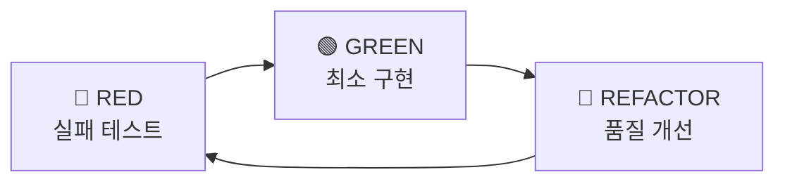

# @CODE:DOCS-001:UI | SPEC: .moai/specs/SPEC-DOCS-001/spec.md

# SPEC 우선 TDD

MoAI-ADK의 핵심 철학인 **SPEC-First TDD** 방법론을 이해하고 실천하는 가이드입니다.

## 🎯 핵심 개발 루프 (3단계)

MoAI-ADK는 모든 개발 작업을 3단계로 표준화합니다:

1. **SPEC 작성** (`/alfred:1-spec`) → 명세 없이는 코드 없음
2. **TDD 구현** (`/alfred:2-build`) → 테스트 없이는 구현 없음
3. **문서 동기화** (`/alfred:3-sync`) → 추적성 없이는 완성 없음

> "명세 없으면 코드 없다. 테스트 없으면 구현 없다."

## 📝 SPEC 작성 - 명세 우선

### EARS 요구사항 작성법

**EARS (Easy Approach to Requirements Syntax)**는 체계적인 요구사항 작성 방법론입니다.

#### EARS 5가지 구문

1. **기본 요구사항 (Ubiquitous)**: 시스템은 [기능]을 제공해야 한다
2. **이벤트 기반 (Event-driven)**: WHEN [조건]이면, 시스템은 [동작]해야 한다
3. **상태 기반 (State-driven)**: WHILE [상태]일 때, 시스템은 [동작]해야 한다
4. **선택적 기능 (Optional)**: WHERE [조건]이면, 시스템은 [동작]할 수 있다
5. **제약사항 (Constraints)**: IF [조건]이면, 시스템은 [제약]해야 한다

#### 실제 작성 예시

```markdown
### Ubiquitous Requirements (기본 요구사항)
- 시스템은 사용자 인증 기능을 제공해야 한다

### Event-driven Requirements (이벤트 기반)
- WHEN 사용자가 유효한 자격증명으로 로그인하면, 시스템은 JWT 토큰을 발급해야 한다
- WHEN 토큰이 만료되면, 시스템은 401 에러를 반환해야 한다

### State-driven Requirements (상태 기반)
- WHILE 사용자가 인증된 상태일 때, 시스템은 보호된 리소스 접근을 허용해야 한다

### Optional Features (선택적 기능)
- WHERE 리프레시 토큰이 제공되면, 시스템은 새로운 액세스 토큰을 발급할 수 있다

### Constraints (제약사항)
- IF 비밀번호 길이가 8자 미만이면, 시스템은 등록을 거부해야 한다
```

### SPEC 파일 구조

```markdown
---
# 필수 필드
id: AUTH-001
version: 0.1.0
status: draft
created: 2025-09-15
updated: 2025-10-01
author: @Goos
priority: high

# 선택 필드
category: security
labels:
  - authentication
  - jwt
---

# @SPEC:AUTH-001: JWT 인증 시스템

## HISTORY

### v0.1.0 (2025-09-15)
- **INITIAL**: JWT 기반 인증 시스템 명세 작성
- **AUTHOR**: @Goos
- **SCOPE**: 토큰 발급, 검증, 갱신 로직

## EARS 요구사항
...
```

## 🧪 TDD 구현 - Red-Green-Refactor

### TDD 3단계 사이클



### 🔴 RED - 실패하는 테스트 작성

**목적**: 요구사항을 테스트 코드로 명시

```typescript
// @TEST:AUTH-001 | SPEC: .moai/specs/SPEC-AUTH-001/spec.md

describe('JWT 인증', () => {
  test('유효한 자격증명으로 로그인하면 JWT 토큰을 발급해야 한다', async () => {
    const result = await authService.login('user@example.com', 'password123');

    expect(result.token).toBeDefined();
    expect(result.token).toMatch(/^[A-Za-z0-9-_]+\.[A-Za-z0-9-_]+\.[A-Za-z0-9-_]+$/);
  });
});
```

**실행 결과**: ❌ 테스트 실패 (authService 미구현)

### 🟢 GREEN - 최소 구현

**목적**: 테스트를 통과하는 최소한의 코드만 작성

```typescript
// @CODE:AUTH-001 | SPEC: .moai/specs/SPEC-AUTH-001/spec.md

class AuthService {
  async login(email: string, password: string) {
    // 최소 구현: 테스트만 통과
    const token = jwt.sign({ email }, 'secret', { expiresIn: '1h' });
    return { token };
  }
}
```

**실행 결과**: ✅ 테스트 통과

### 🔵 REFACTOR - 품질 개선

**목적**: 동작은 유지하면서 코드 품질 향상

```typescript
// @CODE:AUTH-001 | SPEC: .moai/specs/SPEC-AUTH-001/spec.md

class AuthService {
  private readonly jwtSecret = process.env.JWT_SECRET!;
  private readonly tokenExpiry = '1h';

  async login(email: string, password: string) {
    // 1. 입력 검증 (보안 강화)
    this.validateEmail(email);
    this.validatePassword(password);

    // 2. 사용자 인증
    const user = await this.authenticateUser(email, password);

    // 3. 토큰 발급
    return this.generateToken(user);
  }

  private validateEmail(email: string): void {
    if (!email.includes('@')) {
      throw new Error('Invalid email format');
    }
  }

  private async authenticateUser(email: string, password: string) {
    // 실제 DB 조회 로직
    const user = await db.users.findByEmail(email);
    if (!user || !(await bcrypt.compare(password, user.passwordHash))) {
      throw new Error('Invalid credentials');
    }
    return user;
  }

  private generateToken(user: User) {
    const token = jwt.sign(
      { userId: user.id, email: user.email },
      this.jwtSecret,
      { expiresIn: this.tokenExpiry }
    );
    return { token, expiresIn: this.tokenExpiry };
  }
}
```

**실행 결과**: ✅ 테스트 여전히 통과 + 코드 품질 향상

## 🏷️ @TAG 시스템 - 완벽한 추적성

### TAG 체인 구조

```
@SPEC:ID → @TEST:ID → @CODE:ID → @DOC:ID
```

| TAG | 역할 | TDD 단계 | 위치 | 필수 |
|-----|------|----------|------|------|
| `@SPEC:ID` | 요구사항 명세 | 사전 준비 | `.moai/specs/` | ✅ |
| `@TEST:ID` | 테스트 케이스 | RED | `tests/` | ✅ |
| `@CODE:ID` | 구현 코드 | GREEN + REFACTOR | `src/` | ✅ |
| `@DOC:ID` | 문서화 | REFACTOR | `docs/` | ⚠️ |

### CODE-FIRST 원칙

**TAG의 진실은 코드 자체에만 존재**

- ❌ 별도 데이터베이스/YAML/JSON 캐시 없음
- ✅ 코드를 직접 스캔하여 TAG 추출 (`rg '@TAG' -n`)
- ✅ 코드 변경 시 TAG도 함께 변경
- ✅ 코드와 문서가 따로 놀 수 없음

### TAG 검증 예시

```bash
# TAG 체인 검증
rg '@SPEC:AUTH-001' -n .moai/specs/
rg '@TEST:AUTH-001' -n tests/
rg '@CODE:AUTH-001' -n src/

# 고아 TAG 감지
rg '@CODE:AUTH-001' -n src/          # CODE는 있는데
rg '@SPEC:AUTH-001' -n .moai/specs/  # SPEC이 없으면 고아
```

## ✅ TRUST 5원칙

Alfred가 모든 코드에 자동으로 적용하는 품질 기준:

- **T**est First: 테스트 우선 (커버리지 ≥85%)
- **R**eadable: 가독성 (함수 ≤50줄, 복잡도 ≤10)
- **U**nified: 타입 안전성 (TypeScript, Go, Rust 등)
- **S**ecured: 보안 검증 (SQL Injection, XSS 체크)
- **T**rackable: 추적성 (CODE-FIRST @TAG 시스템)

## 🔄 워크플로우 체크리스트

### 1단계: SPEC 작성
- [ ] `.moai/specs/SPEC-<ID>/spec.md` 생성
- [ ] YAML Front Matter 추가
- [ ] `@SPEC:ID` TAG 포함
- [ ] HISTORY 섹션 작성 (v0.1.0 INITIAL)
- [ ] EARS 구문으로 요구사항 작성

### 2단계: TDD 구현
- [ ] **RED**: `tests/`에 `@TEST:ID` 작성 및 실패 확인
- [ ] **GREEN**: `src/`에 `@CODE:ID` 작성 및 테스트 통과
- [ ] **REFACTOR**: 코드 품질 개선

### 3단계: 문서 동기화
- [ ] TAG 체인 검증: `rg '@(SPEC|TEST|CODE):' -n`
- [ ] 고아 TAG 없음 확인
- [ ] Living Document 자동 생성

## 🎯 다음 단계

- [Quick Start](/guide/getting-started) - 바로 시작하기
- [FAQ](/guide/faq) - 자주 묻는 질문
- [MoAI-ADK란?](/guide/what-is-moai-adk) - 문제와 해결책 이해하기
