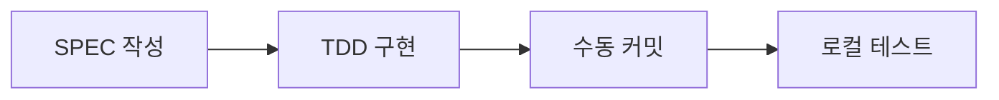
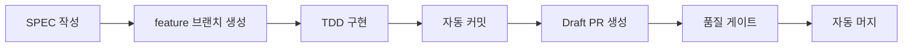

# @DOC:CONFIG-MODE-001 | Chain: @SPEC:DOCS-003 -> @DOC:CONFIG-001

# Personal vs Team 모드

MoAI-ADK는 두 가지 개발 모드를 지원합니다.

## Personal 모드

**개인 개발자용** - 로컬 환경에서 독립적으로 작업:

```json
{
  "mode": "personal"
}
```

### 특징

- ✅ **수동 커밋**: 개발자가 직접 Git 커밋 제어
- ✅ **로컬 브랜치**: 로컬 브랜치에서만 작업
- ✅ **PR 없음**: Pull Request 생성하지 않음
- ✅ **빠른 반복**: 최소한의 자동화로 빠른 개발

### 워크플로우



---

## Team 모드

**팀 협업용** - GitFlow 자동화 및 협업 기능:

```json
{
  "mode": "team"
}
```

### 특징

- ✅ **자동 커밋**: TDD 단계별 자동 커밋
- ✅ **Draft PR**: 자동으로 Draft Pull Request 생성
- ✅ **브랜치 자동 생성**: feature/SPEC-ID 브랜치 자동 생성
- ✅ **자동 머지**: 품질 게이트 통과 시 자동 머지

### 워크플로우



---

## 모드 비교

| 기능 | Personal | Team |
|------|----------|------|
| Git 커밋 | 수동 | 자동 (단계별) |
| 브랜치 전략 | 로컬 브랜치 | feature/SPEC-ID |
| Pull Request | 없음 | Draft PR 자동 생성 |
| 머지 전략 | 수동 | 품질 게이트 통과 시 자동 |
| 코드 리뷰 | 선택 | 필수 (PR 기반) |
| 적합한 규모 | 1인 개발 | 2명 이상 팀 |

---

## 모드 전환

언제든지 모드를 전환할 수 있습니다:

```json
// Personal → Team 전환
{
  "mode": "team",
  "git_strategy": "gitflow"
}
```

---

**다음**: [Advanced Settings →](advanced-settings.md)
