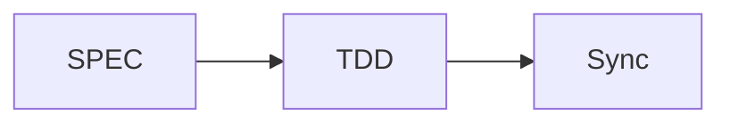

# MoAI-ADK 文档

此目录包含使用 MkDocs 构建的 MoAI-ADK 官方文档。

**Version**: v0.9.0 **Last Updated**: 2025-11-05 **Language**: 中文

# @CODE:DOC-ONLINE-001:ZH

## 🚀 快速开始

### 1. UV 安装（推荐）

```bash
# macOS/Linux
curl -LsSf https://astral.sh/uv/install.sh | sh

# Windows
powershell -c "irm https://astral.sh/uv/install.ps1 | iex"

# 或使用 pip 安装
pip install uv
```

### 2. 安装依赖

```bash
uv sync
```

### 3. 启动开发服务器

```bash
uv run dev
```

### 4. 在浏览器中查看

[http://127.0.0.1:8080](http://127.0.0.1:8080)

## <span class="material-icons">menu_book</span> 可用命令

| 命令                | 描述                   |
| ------------------- | ---------------------- |
| `uv run dev`        | 启动开发服务器         |
| `uv run build`      | 构建静态站点           |
| `uv run deploy`     | 部署到 GitHub Pages    |
| `uv run clean`      | 清理构建文件           |
| `uv run validate`   | 严格模式下构建和验证   |
| `uv run preview`    | 快速重载启动开发服务器 |
| `uv sync`           | 同步依赖               |
| `uv lock`           | 生成锁文件             |
| `uv lock --upgrade` | 升级依赖               |

## 📁 目录结构

```
docs/
├── mkdocs.yml              # MkDocs 配置文件
├── requirements.txt        # Python 依赖
├── package.json           # 构建脚本
├── index.md               # 主页面
├── getting-started/       # 快速开始指南
├── alfred/                # Alfred SuperAgent 文档
├── commands/              # 命令参考
├── development/           # 开发指南
├── advanced/              # 高级功能
├── api/                   # API 参考
├── contributing/          # 贡献指南
├── stylesheets/           # 自定义 CSS
├── javascripts/           # 自定义 JavaScript
├── assets/               # 静态资源
└── overrides/             # 主题覆盖
```

## 🎨 定制

### 主题设置

- **Material Design**: 基于 Google Material Design
- **深色模式**: 自动/手动主题切换
- **多语言支持**: 韩语、英语、日语等

### 扩展功能

- **Mermaid 图表**: 工作流可视化
- **代码高亮**: 50+ 编程语言
- **搜索**: 专业搜索和自动完成
- **Git 集成**: 提交信息和版本管理

## 📄 文档编写指南

### Markdown 扩展

```markdown
!!! note "注意"
    重要信息

!!! warning "警告"
    需要注意的事项

!!! tip "提示"
    有用提示
```

### 代码块

```python
def hello_world():
    print("Hello, MoAI-ADK!")
```

### Mermaid 图表



## 🚀 部署

### Vercel 部署（推荐）

```bash
# 1. 安装 Vercel CLI
npm i -g vercel

# 2. 登录 Vercel
vercel login

# 3. 部署
vercel --prod
```

### 自动部署设置

- 在 Vercel 仪表板中连接 GitHub 仓库
- 推送到 `main` 分支时自动部署
- 域名: `https://adk.mo.ai.kr`

### GitHub Pages

```bash
uv run deploy
```

### 其他托管

```bash
uv run build
# 将 site/ 目录上传到您选择的托管服务
```

## ⚙️ 开发

### 本地开发环境

```bash
# UV 安装（如果已安装则跳过）
curl -LsSf https://astral.sh/uv/install.sh | sh

# 创建虚拟环境并安装依赖
uv venv
source .venv/bin/activate  # Linux/macOS
# .venv\Scripts\activate   # Windows

# 同步依赖
uv sync

# 启动开发服务器
uv run dev
```

### 基于 UV 的工作流

```bash
# 添加依赖
uv add mkdocs-material

# 更新依赖
uv lock --upgrade

# 运行脚本
uv run mkdocs --help

# 开发服务器（热重载）
uv run dev

# 构建
uv run build

# 清理
uv run clean
```

### 文档验证

```bash
mkdocs build --strict
```

## 📊 监控

### 构建统计

```bash
find site/ -name "*.html" | wc -l
```

### 大小检查

```bash
du -sh site/
```

## 🐛 故障排除

### 常见问题

#### 构建错误

```bash
# 清理缓存
rm -rf site/ .doit_db/

# 重新构建
mkdocs build
```

#### 插件错误

```bash
# 重新安装插件
pip install --upgrade mkdocs-material
```

#### 样式加载问题

```bash
# 清理浏览器缓存
# 在开发者工具中强制刷新
```

## 📞 支持

- **文档**: [MoAI-ADK 官方文档](https://moai-adk.gooslab.ai)
- **问题**: [GitHub Issues](https://github.com/moai-adk/MoAI-ADK/issues)
- **社区**: [GitHub Discussions](https://github.com/moai-adk/MoAI-ADK/discussions)

## 📄 许可证

本文档采用 MIT 许可证发布。
