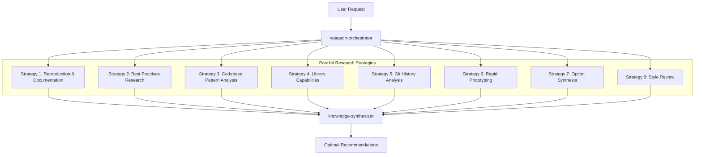

# Senior Engineer Thinking Patterns

MoAI-ADK integrates **8 research strategies** from "Teach Your AI to Think Like a Senior Engineer" to transform Alfred from a coding assistant into a true engineering partner that researches, analyzes, and learns like a senior engineer.

## Overview

Traditional AI coding assistants often jump straight to implementation, leading to:
- Incomplete understanding of requirements
- Missing edge cases and constraints
- Reinventing existing solutions
- Poor architectural decisions

**Senior Engineer Alfred** follows a systematic research approach before any implementation, ensuring comprehensive understanding and optimal solutions.

## The 8 Research Strategies

### 1. Reproduce and Document
**Purpose**: Systematic issue reproduction and documentation

**What it does**:
- Creates step-by-step reproduction guides
- Captures logs, error messages, and environmental context
- Documents the exact conditions needed to reproduce issues

**Alfred Implementation**:
- `research-reproducer` agent specializes in systematic reproduction
- Captures comprehensive context for bug analysis
- Creates reusable reproduction procedures

**Example**: When users report "login doesn't work," Alfred reproduces the exact sequence, browser conditions, network state, and error patterns before suggesting fixes.

### 2. Ground in Best Practices
**Purpose**: Research industry standards and proven solutions

**What it does**:
- Searches for how others have solved similar problems
- Analyzes industry standards, documentation, and patterns
- Identifies proven approaches and common pitfalls

**Alfred Implementation**:
- `best-practices-researcher` agent researches industry patterns
- Validates approaches against established standards
- Maintains knowledge base of proven solutions

**Example**: Before implementing authentication, researches OAuth 2.0 standards, JWT best practices, session management patterns, and security guidelines.

### 3. Ground in Your Codebase
**Purpose**: Discover existing implementation patterns

**What it does**:
- Searches your existing code for similar functionality
- Identifies established patterns and conventions
- Finds reusable components and approaches

**Alfred Implementation**:
- Enhanced `codebase-analyst` agent discovers implementation patterns
- Recognizes established coding conventions
- Prevents duplicate functionality

**Example**: Before adding new analytics tracking, discovers existing event tracking system and integrates with established patterns.

### 4. Ground in Your Libraries
**Purpose**: Deep understanding of tool capabilities

**What it does**:
- Analyzes source code of installed libraries
- Identifies undocumented features and capabilities
- Understands library evolution and compatibility

**Alfred Implementation**:
- `library-researcher` agent analyzes library capabilities
- Reads source code and test cases
- Discovers hidden features and optimal usage patterns

**Example**: Researches React Hook Form source code to discover undocumented validation patterns and performance optimizations.

### 5. Study Git History
**Purpose**: Learn from past decisions and evolution

**What it does**:
- Analyzes commit history to understand decision context
- Identifies why certain approaches were chosen
- Learns from past successes and failures

**Alfred Implementation**:
- Enhanced `git-historian` agent analyzes historical patterns
- Understands evolution of design decisions
- Prevents repeating past mistakes

**Example**: Before upgrading a library, analyzes past upgrade attempts, why certain versions were chosen, and what issues were encountered.

### 6. Vibe Prototype for Clarity
**Purpose**: Rapid prototyping to explore requirements

**What it does**:
- Creates quick, throwaway versions to explore options
- Helps clarify ambiguous requirements through interaction
- Enables rapid iteration on design concepts

**Alfred Implementation**:
- `prototype-creator` agent builds rapid prototypes
- Facilitates requirement clarification through examples
- Enables quick design exploration

**Example**: Creates 3 different UI layouts for a new feature to help stakeholders visualize and clarify requirements.

### 7. Synthesize with Options
**Purpose**: Generate and compare multiple approaches

**What it does**:
- Combines research from all strategies into coherent options
- Evaluates trade-offs between different approaches
- Presents clear choices with pros and cons

**Alfred Implementation**:
- `synthesis-agent` agent integrates research findings
- Generates multiple solution approaches
- Provides decision frameworks with clear trade-offs

**Example**: Presents 3 approaches for data synchronization (real-time, batch, hybrid) with detailed analysis of complexity, performance, and maintenance implications.

### 8. Review with Style Agents
**Purpose**: Multi-perspective quality validation

**What it does**:
- Applies specialized expertise from multiple perspectives
- Validates decisions against different quality criteria
- Ensures comprehensive review coverage

**Alfred Implementation**:
- Multiple `style-reviewer` agents provide specialized review
- Security, performance, maintainability perspectives
- Comprehensive quality validation

**Example**: Reviews proposed authentication system from security expert, performance expert, and maintainability expert perspectives.

## Parallel Research Operations

The key innovation is executing all 8 strategies **in parallel**, rather than sequentially:



## Learning & Compounding System

### Knowledge Accumulation
- Every research session contributes to project knowledge base
- Patterns discovered are automatically captured and reused
- Decision quality improves over time through accumulated experience

### Adaptive Intelligence
- Alfred learns your project's unique patterns and preferences
- Research becomes faster and more accurate with each session
- Custom best practices emerge from your specific codebase history

### Memory & Context
- Long-term memory of successful patterns and approaches
- Context-aware recommendations based on project history
- Automatic knowledge transfer between similar problems

## Real-World Impact

### Case Study 1: Email Bulk Archive (53,000 emails)

**Traditional AI Approach**:
- User: "Archive all these emails"
- AI: "Simple bulk delete operation"
- Result: Gmail rate limits, timeouts, frustrated users

**Senior Engineer Alfred Approach**:
1. **Research**: Gmail API limits, batch processing patterns, user experience
2. **Analyze**: Existing bulk operations in codebase
3. **Prototype**: Three different processing approaches
4. **Synthesize**: Batch processing with progress tracking + retry logic
5. **Review**: Performance, UX, security perspectives
6. **Result**: Robust solution with progress tracking, error recovery, happy users

### Case Study 2: Authentication System Design

**Traditional AI Approach**:
- User: "Add authentication to our app"
- AI: Basic JWT implementation
- Result: Security vulnerabilities, scalability issues

**Senior Engineer Alfred Approach**:
1. **Research**: OAuth 2.0 standards, JWT best practices, session management
2. **Analyze**: Existing authentication patterns in codebase
3. **Ground**: Library capabilities (Auth0, Firebase Auth, custom)
4. **History**: Previous authentication attempts and their evolution
5. **Prototype**: Multiple authentication flows
6. **Synthesize**: Comprehensive solution with multiple provider support
7. **Review**: Security, performance, maintainability validation
8. **Result**: Enterprise-ready authentication system

## Implementation Integration

### Planning Phase (`/alfred:1-plan`)
- Parallel research across all 8 strategies
- Comprehensive requirements analysis
- Risk identification and mitigation planning
- Multiple solution approaches with trade-offs

### Implementation Phase (`/alfred:2-run`)
- Continuous research during development
- Best practice validation at each step
- Multi-perspective code review
- Pattern recognition and reuse

### Sync Phase (`/alfred:3-sync`)
- Pattern extraction and knowledge capture
- Documentation of learned insights
- Team knowledge sharing
- Continuous improvement of recommendations

## Benefits

### For Individual Developers
- **Reduced Context Switching**: Alfred remembers your entire project context
- **Better Decisions**: Research-based decisions rather than guessing
- **Faster Development**: Reuse of learned patterns and approaches
- **Continuous Learning**: Alfred gets smarter with each session

### For Teams
- **Consistent Quality**: Research-backed decisions across team members
- **Knowledge Sharing**: Collective learning and pattern recognition
- **Risk Mitigation**: Comprehensive analysis before implementation
- **Faster Onboarding**: New members benefit from accumulated knowledge

### For Organizations
- **Reduced Technical Debt**: Well-researched architectural decisions
- **Improved Security**: Security-expert review on all decisions
- **Better ROI**: Optimized solutions based on comprehensive analysis
- **Innovation Culture**: Research-first approach to problem-solving

## Getting Started

The Senior Engineer Thinking Patterns are automatically integrated into MoAI-ADK v0.22.0+. No additional configuration is required.

### Basic Usage
Simply use Alfred commands as usual - the research strategies are automatically applied:

```bash
# Planning with research
/alfred:1-plan "Add user authentication system"

# Implementation with continuous research
/alfred:2-run AUTH-001

# Documentation and learning
/alfred:3-sync
```

### Advanced Usage
For more control over research strategies:

```bash
# Deep research on specific topic
/alfred:research "authentication best practices"

# Learn from project patterns
/alfred:learn

# Review current implementation
/alfred:review-security
/alfred:review-performance
```

## Learn More

- [Research Strategies Deep Dive](./research-strategies)
- [Case Studies](./case-studies)
- [Implementation Guide](./implementation-guide)
- [Best Practices](./best-practices)