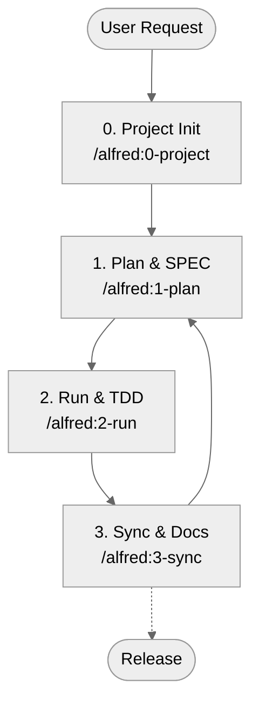

# Alfred Workflow Guide

<div align="center" class="image-container">

{ class="alfred-logo" }

<div class="image-caption">Alfred - Your AI Development Partner</div>

</div>

Alfred is the SuperAgent that orchestrates the entire MoAI-ADK development workflow. This guide
explains how to use Alfred's four core commands to create a seamless development experience.

## Overview

Alfred follows a simple but powerful 4-phase workflow:



Each phase builds upon the previous one, creating a complete development lifecycle:

1. **Project** - Setup and configuration
2. **Plan** - Requirements and specifications
3. **Run** - Implementation and testing
4. **Sync** - Documentation and quality checks

## Alfred's Architecture

### SuperAgent System

Alfred coordinates multiple specialized agents and skills:

```
Alfred SuperAgent (Orchestration Layer)
    ├── Core Sub-agents (Workflow Execution)
    │   ├── project-manager 📋 - Project initialization and setup
    │   ├── spec-builder 🏗️ - SPEC creation with EARS syntax
    │   ├── implementation-planner 📊 - Architecture and planning
    │   ├── tdd-implementer 💎 - TDD cycle execution
    │   ├── doc-syncer <span class="material-icons">library_books</span> - Documentation synchronization
    │   ├── tag-agent 🏷️ - TAG system management
    │   ├── git-manager 🚀 - Git workflow automation
    │   ├── trust-checker ✅ - Quality validation
    │   └── quality-gate 🛡️ - Release readiness checks
    ├── Expert Agents (Domain Knowledge)
    │   ├── backend-expert ⚙️ - Backend architecture and APIs
    │   ├── frontend-expert 💻 - Frontend development and UX
    │   ├── devops-expert 🚀 - Deployment and infrastructure
    │   ├── ui-ux-expert 🎨 - Design systems and accessibility
    │   ├── security-expert 🔒 - Security analysis and best practices
    │   └── database-expert 💾 - Database design and optimization
    └── Skills Library (93 Production Guides)
        ├── Foundation Skills (Core principles)
        ├── Essential Skills (Daily tools)
        ├── Alfred Skills (Workflow automation)
        ├── Domain Skills (Specialized knowledge)
        └── Language Skills (Best practices)
```

### Progressive Disclosure

Alfred uses a just-in-time loading system to provide relevant skills when needed:

- **Foundation**: Always loaded - TRUST, TAG, SPEC, Git, EARS principles
- **Essentials**: On-demand - Debugging, performance, refactoring tools
- **Domain**: Context-triggered - Activated by SPEC keywords
- **Language**: Project-detected - Python, TypeScript, Go, etc.

## The Four Core Commands

### 0. `/alfred:0-project` - Project Management

**Purpose**: Initialize projects, manage settings, and optimize templates.

**Usage Scenarios**:

- New project setup
- Configuration changes
- Template updates after package upgrades

**Three Execution Modes**:

1. **Basic Mode** (Smart Auto-Detection)

   ```bash
   /alfred:0-project
   ```

   - First run: Project initialization
   - Subsequent runs: "Already Initialized" menu

2. **Setting Mode** (Modify Existing Configuration)

   ```bash
   /alfred:0-project setting
   ```

   - Change language, nickname, GitHub settings
   - Batch questions for efficiency
   - Preserves other settings

3. **Update Mode** (Template Optimization)

   ```bash
   /alfred:0-project update
   ```

   - Merge new templates after `moai-adk update`
   - Preserve user customizations
   - Resolve conflicts intelligently

**Key Activities**:

- Collect project metadata (name, goals, language, mode)
- Generate `.moai/config.json` and `.moai/project/*` documents
- Recommend and configure skill packs
- Set up Git workflow and initial commits
- Optimize project templates

### 1. `/alfred:1-plan` - Specification Creation

**Purpose**: Transform ideas into clear, executable specifications.

**Usage Scenarios**:

- New feature requirements
- API endpoint definitions
- User story elaboration
- Architecture planning

**Command Format**:

```bash
/alfred:1-plan "Brief description of what you want to build"
```

**Alfred's Process**:

1. **Requirement Analysis**

   - Parse user input for key requirements
   - Identify domain keywords for expert activation
   - Determine scope and complexity

2. **SPEC Creation**

   - Generate unique SPEC ID (DOMAIN-001 format)
   - Write EARS-format requirements
   - Define acceptance criteria
   - Create implementation plan

3. **Expert Consultation**

   - Activate relevant domain experts
   - Gather architectural recommendations
   - Identify risks and dependencies
   - Document expert opinions with `@EXPERT:` tags

4. **Deliverables Generation**

   - `.moai/specs/SPEC-*/spec.md` - Main specification
   - `.moai/specs/SPEC-*/plan.md` - Implementation plan
   - Feature branch (team mode)
   - Initial project structure

**SPEC Components**:

- **YAML Frontmatter**: ID, version, status, priority
- **EARS Requirements**: Clear, testable requirements
- **Acceptance Criteria**: Success conditions
- **Dependencies**: Related SPECs and external factors
- **Risk Assessment**: Potential challenges

### 2. `/alfred:2-run` - Implementation & Testing

**Purpose**: Execute TDD cycles to implement specifications.

**Usage Scenarios**:

- Feature implementation
- Bug fixes
- Refactoring tasks
- Performance improvements

**Command Format**:

```bash
/alfred:2-run SPEC-ID
```

**Alfred's Process**:

1. **Phase 1: Implementation Planning**

   - **implementation-planner** analyzes SPEC
   - Determines architecture and libraries
   - Designs folder structure
   - Plans TAG assignments
   - Activates domain experts

2. **Phase 2: TDD Execution**

   - **tdd-implementer** executes RED→GREEN→REFACTOR
   - Creates failing tests (RED)
   - Implements minimal solution (GREEN)
   - Refactors for quality (REFACTOR)
   - Validates against TRUST 5 principles

3. **Phase 3: Quality Assurance**

   - **trust-checker** validates code quality
   - **quality-gate** ensures release readiness
   - Automated testing and coverage checks
   - Security and performance validation

**TDD Cycle Details**:

**🔴 RED Phase**:

- Write comprehensive tests first
- Tests MUST fail initially
- Cover all acceptance criteria
- Include edge cases and error conditions

**🟢 GREEN Phase**:

- Implement minimal code to pass tests
- Focus on functionality over perfection
- Ensure all tests pass
- Commit with `feat()` message

**♻️ REFACTOR Phase**:

- Improve code quality and structure
- Apply TRUST 5 principles
- Maintain test coverage
- Optimize performance and readability
- Commit with `refactor()` message

### 3. `/alfred:3-sync` - Documentation & Quality

**Purpose**: Synchronize documentation and validate system integrity.

**Usage Scenarios**:

- After feature completion
- Before releases
- Documentation updates
- Quality audits

**Command Format**:

```bash
/alfred:3-sync
# or with options
/alfred:3-sync --auto-merge
/alfred:3-sync --target=docs
```

**Alfred's Process**:

1. **TAG Chain Validation**

   - **tag-agent** scans all @TAG markers
   - Verifies complete SPEC→TEST→CODE→DOC chains
   - Detects orphaned TAGs
   - Reports chain integrity metrics

2. **Documentation Synchronization**

   - **doc-syncer** generates/updates documentation
   - Creates API docs from code annotations
   - Updates README and CHANGELOG
   - Generates living documents

3. **Quality Gate Validation**

   - **trust-checker** validates TRUST 5 compliance
   - **quality-gate** checks release readiness
   - Test coverage analysis
   - Security vulnerability scans

4. **Git Workflow Management**

   - **git-manager** handles branch operations
   - Creates draft PRs (team mode)
   - Manages auto-merge settings
   - Generates sync reports

**Synchronization Results**:

- **Documentation**: Always up-to-date with code
- **TAG Integrity**: Complete traceability maintained
- **Quality**: TRUST 5 compliance verified
- **Release**: Ready for deployment

### 4. `/alfred:9-feedback` - Issue Management

**Purpose**: Create GitHub issues for bugs, features, and improvements.

**Usage Scenarios**:

- Bug reports during development
- Feature ideas and suggestions
- Process improvements
- Team discussions

**Command Format**:

```bash
/alfred:9-feedback
```

**Interactive Process**:

1. Select issue type (Bug/Feature/Improvement/Question)
2. Enter descriptive title
3. Add detailed description (optional)
4. Choose priority level
5. Automatic GitHub issue creation

**Benefits**:

- Immediate issue creation without context switching
- Standardized issue format with labels
- Team visibility and tracking
- Integration with development workflow

## Workflow States and Transitions

### SPEC Status Lifecycle

```mermaid
%%{init: {'theme':'neutral'}}%%
stateDiagram-v2
    [*] --> planning: /alfred:1-plan
    planning --> draft: SPEC written
    draft --> in_progress: /alfred:2-run
    in_progress --> testing: Implementation complete
    testing --> completed: /alfred:3-sync
    completed --> deprecated: Feature retired

    note right of planning
        📋 Planning Phase
        - Requirements analysis
        - Architecture design
        - Technology decisions
    end note

    note right of draft
        📝 Draft Phase
        - EARS requirements
        - Acceptance criteria
        - Risk assessment
    end note

    note right of in_progress
        🚀 Development Phase
        - TDD execution
        - Code implementation
        - Quality validation
    end note

    note right of testing
        🧪 Testing Phase
        - Unit tests
        - Integration tests
        - QA validation
    end note

    note right of completed
        ✅ Completed Phase
        - Documentation sync
        - Release ready
        - Production deployment
    end note
```



### State Transitions

| Current State | Next State  | Trigger          | Conditions                 |
| ------------- | ----------- | ---------------- | -------------------------- |
| planning      | draft       | SPEC completion  | EARS requirements defined  |
| draft         | in_progress | `/alfred:2-run`  | Implementation approved    |
| in_progress   | testing     | TDD complete     | All tests passing          |
| testing       | completed   | `/alfred:3-sync` | Documentation synchronized |
| completed     | planning    | New feature      | Next development cycle     |

## Best Practices

### Command Usage Patterns

**New Feature Development**:

```bash
/alfred:1-plan "Feature description"
/alfred:2-run FEATURE-ID
/alfred:3-sync
```

**Bug Fix Process**:

```bash
/alfred:9-feedback  # Create bug issue
/alfred:1-plan "Bug fix for ISSUE-XXX"
/alfred:2-run BUG-ID
/alfred:3-sync
```

**Project Maintenance**:

```bash
moai-adk update
/alfred:0-project update
/alfred:3-sync
```

### Quality Gates

Always ensure these checks pass before considering work complete:

1. **Test Coverage**: 85%+ minimum
2. **TAG Integrity**: 100% chain completeness
3. **TRUST 5**: All principles validated
4. **Documentation**: Synchronized with code
5. **Security**: No critical vulnerabilities

### Team Collaboration

**Individual Mode**:

- Direct commits to develop branch
- Personal project settings
- Local documentation

**Team Mode**:

- Feature branches with PRs
- Shared project configuration
- Collaborative reviews
- Auto-merge capabilities

## Common Workflows

### 1. Feature Development

```bash
# Start new feature
/alfred:1-plan "User authentication with JWT"

# Alfred creates SPEC-AUTH-001
# Status: planning → draft

# Implement feature
/alfred:2-run AUTH-001

# Alfred executes TDD cycle
# Status: draft → in_progress → testing

# Complete and document
/alfred:3-sync

# Alfred syncs everything
# Status: testing → completed

# Start next feature
/alfred:1-plan "User profile management"
```

### 2. Bug Fix

```bash
# Report bug
/alfred:9-feedback
# → Creates GitHub issue #123

# Plan fix
/alfred:1-plan "Fix login validation issue #123"

# Implement fix
/alfred:2-run BUG-123

# Validate and sync
/alfred:3-sync

# Link to original issue in commit messages
```

### 3. Project Maintenance

```bash
# Update MoAI-ADK
moai-adk update

# Optimize templates
/alfred:0-project update

# Sync all documentation
/alfred:3-sync

# Validate everything
moai-adk doctor
```

## Troubleshooting

### Common Issues

**Command not recognized**:

- Verify Claude Code version (v1.5.0+)
- Check `.claude/commands/` directory exists
- Restart Claude Code

**SPEC creation fails**:

- Check network connection
- Verify `.moai/` directory permissions
- Run `moai-adk doctor`

**TDD cycle issues**:

- Check dependencies installed: `uv sync`
- Verify test framework: `pytest --version`
- Check Python path: `which python`

**Sync problems**:

- Verify TAG format: `@TYPE:DOMAIN-001`
- Check file permissions
- Run `/alfred:3-sync --force`

### Getting Help

```bash
# System diagnostics
moai-adk doctor

# Verbose output
moai-adk doctor --verbose

# Create issue
/alfred:9-feedback
```

## Performance Tips

### Optimizing Workflow Speed

1. **Use UV**: Faster dependency management
2. **SSD Storage**: Faster file operations
3. **Sufficient RAM**: 8GB+ recommended
4. **Local LLM**: Reduce API latency (when available)

### Reducing Context Usage

1. **Minimal SPECs**: Focus on essential requirements
2. **Targeted Skills**: Let Alfred load skills on-demand
3. **Regular Sync**: Prevent large documentation backlogs
4. **Clean History**: Regular git maintenance

## Next Steps

Now that you understand Alfred's workflow, explore these guides:

- **[SPEC Writing](specs/basics.md)** - Master EARS syntax
- **[TDD Implementation](tdd/red.md)** - Learn test-driven development
- **[TAG System](reference/tags/index.md)** - Understand traceability
- **[Project Configuration](project/config.md)** - Customize your setup

Alfred is your partner in creating reliable, maintainable software. Trust the process, follow the
workflow, and enjoy the confidence that comes with systematic development! 🚀
