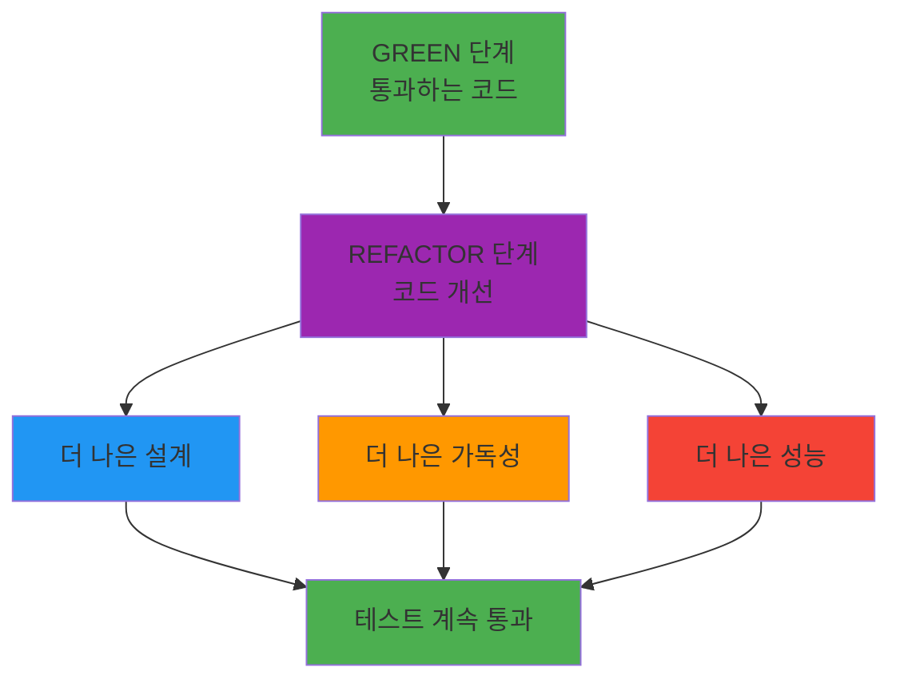

# TDD REFACTOR 단계 가이드: 코드 품질 개선과 리팩토링

## 목차

1. [REFACTOR 단계의 목표와 타이밍](#refactor-%EB%8B%A8%EA%B3%84%EC%9D%98-%EB%AA%A9%ED%91%9C%EC%99%80-%ED%83%80%EC%9D%B4%EB%B0%8D)
2. [코드 냄새와 중복 제거](#%EC%BD%94%EB%93%9C-%EB%83%84%EC%83%88%EC%99%80-%EC%A4%91%EB%B3%B5-%EC%A0%9C%EA%B1%B0)
3. [성능 최적화 기법](#%EC%84%B1%EB%8A%A5-%EC%B5%9C%EC%A0%81%ED%99%94-%EA%B8%B0%EB%B2%95)
4. [가독성 향상 전략](#%EA%B0%80%EB%8F%85%EC%84%B1-%ED%96%A5%EC%83%81-%EC%A0%84%EB%9E%B5)
5. [SOLID 원칙 적용](#solid-%EC%9B%90%EC%B9%99-%EC%A0%81%EC%9A%A9)
6. [안전한 리팩토링 기법](#%EC%95%88%EC%A0%84%ED%95%9C-%EB%A6%AC%ED%8C%A9%ED%86%A0%EB%A7%81-%EA%B8%B0%EB%B2%95)
7. [실전 코드 예시 (전후 비교)](#%EC%8B%A4%EC%A0%84-%EC%BD%94%EB%93%9C-%EC%98%88%EC%8B%9C-%EC%A0%84%ED%9B%84-%EB%B9%84%EA%B5%90)
8. [Git 커밋 전략 (REFACTOR 단계)](#git-%EC%BB%A4%EB%B0%8B-%EC%A0%84%EB%9E%B5-refactor-%EB%8B%A8%EA%B3%84)
9. [REFACTOR 단계 체크리스트](#refactor-%EB%8B%A8%EA%B3%84-%EC%B2%B4%ED%81%AC%EB%A6%AC%EC%8A%A4%ED%8A%B8)

______________________________________________________________________

## REFACTOR 단계의 목표와 타이밍

### REFACTOR 단계의 핵심 목표

REFACTOR 단계는 \*\*"동작하는 코드를 더 잘 만드는 것"\*\*입니다. 핵심 목표는:



### 1. 리팩토링의 정의

**리팩토링이란:**

- **외부 동작을 변경하지 않고** 코드의 내부 구조를 개선하는 과정
- 코드의 이해도, 유지보수성, 성능을 향상시키는 활동
- **테스트 보호 하에** 안전하게 진행되는 코드 개선

**리팩토링이 아닌 것:**

- 기능 추가/삭제
- 버그 수정
- API 변경
- 성능 문제 해결 (최적화와는 다름)

### 2. 적절한 리팩토링 타이밍

#### 🟢 좋은 타이밍

```python
# BEFORE: 리팩토링이 필요한 코드
def process_user_data(user_list):
    result = []
    for user in user_list:
        if user['age'] >= 18 and user['email'] and user['name'] and user['status'] == 'active':
            email_parts = user['email'].split('@')
            if len(email_parts) == 2 and '.' in email_parts[1]:
                formatted_name = user['name'].title()
                result.append({
                    'id': user['id'],
                    'name': formatted_name,
                    'email': user['email'].lower(),
                    'age': user['age']
                })
    return result
```

#### 즉시 리팩토링해야 할 상황

1. **코드 냄새(Code Smells) 발견 시**

   - 중복 코드 (DRY 위반)
   - 긴 메소드/함수
   - 거대한 클래스
   - 긴 매개변수 목록

2. **테스트 통과 직후**

   - GREEN 단계 완료 직후가 가장 이상적
   - 코드가 신선하고 맥락이 명확할 때

3. **코드 리뷰 시**

   - 동료가 지적한 개선점
   - 복잡하다고 느껴지는 부분

#### 🔴 리팩토링을 피해야 할 타이밍

1. **긴급 버그 수정 중**
2. **기능 개발 마감일 직전**
3. **테스트 커버리지가 낮을 때**
4. **안정화되지 않은 기능 area**

### 3. 리팩토링의 안전성 원칙

```python
# 리팩토링 전후 동작 동일함 보장
def calculate_discount(price, customer_type, years_loyal):
    # BEFORE: 복잡한 조건 로직
    if customer_type == "premium" and years_loyal >= 5:
        return price * 0.8
    elif customer_type == "premium" and years_loyal >= 2:
        return price * 0.9
    elif customer_type == "regular" and years_loyal >= 3:
        return price * 0.95
    else:
        return price

# AFTER: 동일한 동작, 더 나은 구조
def calculate_discount(price, customer_type, years_loyal):
    discount_rate = get_discount_rate(customer_type, years_loyal)
    return price * (1 - discount_rate)

def get_discount_rate(customer_type, years_loyal):
    # 동일한 비즈니스 로직, 더 나은 가독성
    pass
```

______________________________________________________________________

## 코드 냄새와 중복 제거

### 1. 중복 코드 (Duplicate Code)

#### 문제 식별

```python
# BEFORE: 중복 코드 예시
class UserService:
    def create_user(self, user_data):
        if not user_data.get('email'):
            raise ValueError('Email is required')
        if '@' not in user_data['email']:
            raise ValueError('Invalid email format')

        user = User(
            email=user_data['email'].lower().strip(),
            name=user_data.get('name', '').strip(),
            created_at=datetime.now()
        )
        return user

    def update_user(self, user_id, user_data):
        if 'email' in user_data:
            if not user_data['email']:
                raise ValueError('Email is required')
            if '@' not in user_data['email']:
                raise ValueError('Invalid email format')

        # ... 중복된 유효성 검증 로직
```

#### 해결책: 메소드 추출

```python
# AFTER: 중복 제거
class UserService:
    def create_user(self, user_data):
        self._validate_email(user_data.get('email'))

        user = User(
            email=self._normalize_email(user_data['email']),
            name=user_data.get('name', '').strip(),
            created_at=datetime.now()
        )
        return user

    def update_user(self, user_id, user_data):
        if 'email' in user_data:
            self._validate_email(user_data['email'])
            user_data['email'] = self._normalize_email(user_data['email'])

        # ... 업데이트 로직

    def _validate_email(self, email):
        """이메일 유효성 검증"""
        if not email:
            raise ValueError('Email is required')
        if '@' not in email:
            raise ValueError('Invalid email format')

    def _normalize_email(self, email):
        """이메일 정규화"""
        return email.lower().strip()
```

### 2. 긴 메소드 (Long Method)

#### 문제 식별

```python
# BEFORE: 긴 메소드 (50+ 줄)
def generate_invoice(self, order_id):
    # 주문 조회 (10줄)
    order = self.get_order(order_id)
    if not order:
        raise ValueError('Order not found')

    # 고객 정보 조회 (8줄)
    customer = self.get_customer(order.customer_id)

    # 주문 항목 계산 (15줄)
    subtotal = 0
    for item in order.items:
        item_total = item.quantity * item.unit_price
        if item.discount:
            item_total -= item_total * (item.discount / 100)
        subtotal += item_total

    # 세금 계산 (7줄)
    tax_rate = self.get_tax_rate(customer.state)
    tax = subtotal * (tax_rate / 100)

    # 배송비 계산 (5줄)
    shipping = self.calculate_shipping(order, subtotal)

    # 인보이스 생성 (5줄)
    total = subtotal + tax + shipping
    invoice = Invoice(
        order_id=order_id,
        customer=customer,
        subtotal=subtotal,
        tax=tax,
        shipping=shipping,
        total=total
    )

    return invoice
```

#### 해결책: 메소드 분해

```python
# AFTER: 작은 메소드들로 분해
def generate_invoice(self, order_id):
    order = self._get_and_validate_order(order_id)
    customer = self._get_customer(order.customer_id)
    pricing = self._calculate_pricing(order, customer)

    return Invoice(
        order_id=order_id,
        customer=customer,
        **pricing.__dict__
    )

def _get_and_validate_order(self, order_id):
    """주문 조회 및 검증"""
    order = self.get_order(order_id)
    if not order:
        raise ValueError('Order not found')
    return order

def _calculate_pricing(self, order, customer):
    """가격 계산 (소계, 세금, 배송비, 총액)"""
    subtotal = self._calculate_subtotal(order.items)
    tax = self._calculate_tax(subtotal, customer.state)
    shipping = self._calculate_shipping(order, subtotal)
    total = subtotal + tax + shipping

    return PricingInfo(subtotal, tax, shipping, total)

def _calculate_subtotal(self, items):
    """주문 항목 소계 계산"""
    subtotal = 0
    for item in items:
        item_total = item.quantity * item.unit_price
        if item.discount:
            item_total -= item_total * (item.discount / 100)
        subtotal += item_total
    return subtotal

def _calculate_tax(self, subtotal, state):
    """세금 계산"""
    tax_rate = self.get_tax_rate(state)
    return subtotal * (tax_rate / 100)

def _calculate_shipping(self, order, subtotal):
    """배송비 계산"""
    return self.calculate_shipping(order, subtotal)

@dataclass
class PricingInfo:
    subtotal: float
    tax: float
    shipping: float
    total: float
```

### 3. 거대한 클래스 (Large Class)

#### 문제 식별

```python
# BEFORE: 너무 많은 책임을 가진 클래스
class UserManager:
    def __init__(self):
        self.db_connection = None
        self.email_service = None
        self.password_encryptor = None
        self.session_manager = None
        self.audit_logger = None
        self.cache = None

    # 사용자 CRUD (5개 메소드)
    def create_user(self, user_data): pass
    def get_user(self, user_id): pass
    def update_user(self, user_id, data): pass
    def delete_user(self, user_id): pass
    def list_users(self, filters): pass

    # 인증 관련 (4개 메소드)
    def login(self, email, password): pass
    def logout(self, session_id): pass
    def reset_password(self, email): pass
    def change_password(self, user_id, old_pass, new_pass): pass

    # 권한 관련 (3개 메소드)
    def check_permission(self, user_id, resource): pass
    def assign_role(self, user_id, role): pass
    def revoke_role(self, user_id, role): pass

    # 이메일 관련 (3개 메소드)
    def send_welcome_email(self, user): pass
    def send_password_reset_email(self, email): pass
    def send_verification_email(self, user): pass

    # ... 더 많은 책임들
```

#### 해결책: 단일 책임 분리

```python
# AFTER: 책임에 따른 클래스 분리
class UserRepository:
    """사용자 데이터 접근 책임"""
    def __init__(self, db_connection):
        self.db = db_connection

    def create(self, user_data): pass
    def get_by_id(self, user_id): pass
    def update(self, user_id, data): pass
    def delete(self, user_id): pass
    def list(self, filters): pass

class AuthenticationService:
    """인증 책임"""
    def __init__(self, user_repo, password_service, session_manager):
        self.user_repo = user_repo
        self.password_service = password_service
        self.session_manager = session_manager

    def login(self, email, password): pass
    def logout(self, session_id): pass
    def get_current_user(self, session_id): pass

class AuthorizationService:
    """권한 관리 책임"""
    def __init__(self, user_repo):
        self.user_repo = user_repo

    def can_access(self, user_id, resource): pass
    def assign_role(self, user_id, role): pass
    def has_role(self, user_id, role): pass

class EmailService:
    """이메일 발송 책임"""
    def send_welcome(self, user): pass
    def send_password_reset(self, email): pass
    def send_verification(self, user): pass

class UserService:
    """사용자 관리 조정자 (Facade)"""
    def __init__(self, user_repo, auth_service, email_service):
        self.user_repo = user_repo
        self.auth_service = auth_service
        self.email_service = email_service

    def register_user(self, user_data):
        user = self.user_repo.create(user_data)
        self.email_service.send_welcome(user)
        return user

    def login_user(self, email, password):
        return self.auth_service.login(email, password)
```

### 4. 긴 매개변수 목록 (Long Parameter List)

#### 문제 식별

```python
# BEFORE: 너무 많은 매개변수
def create_order(customer_id, product_id, quantity,
                shipping_address, billing_address,
                payment_method, card_number, expiry_date, cvv,
                discount_code, gift_message, gift_wrap,
                shipping_method, insurance_required):
    # 15개의 매개변수!
    pass
```

#### 해결책 1: 매개변수 객체

```python
# AFTER: 매개변수 객체 사용
@dataclass
class OrderRequest:
    customer_id: str
    product_id: str
    quantity: int

    # 주소 정보
    shipping_address: Address
    billing_address: Address

    # 결제 정보
    payment_method: PaymentMethod

    # 옵션 정보
    discount_code: Optional[str] = None
    gift_message: Optional[str] = None
    gift_wrap: bool = False
    shipping_method: str = "standard"
    insurance_required: bool = False

def create_order(order_request: OrderRequest):
    # 명확하고 관련된 데이터 그룹화
    pass
```

#### 해결책 2: 빌더 패턴

```python
# AFTER: 빌더 패턴 사용
class OrderBuilder:
    def __init__(self):
        self.order = Order()

    def for_customer(self, customer_id):
        self.order.customer_id = customer_id
        return self

    def add_product(self, product_id, quantity):
        self.order.items.append(OrderItem(product_id, quantity))
        return self

    def with_shipping_address(self, address):
        self.order.shipping_address = address
        return self

    def with_payment(self, payment_method):
        self.order.payment_method = payment_method
        return self

    def build(self):
        return self.order

# 사용법
order = (OrderBuilder()
    .for_customer("cust_123")
    .add_product("prod_456", 2)
    .with_shipping_address(shipping_addr)
    .with_payment(payment_method)
    .build())
```

______________________________________________________________________

## 성능 최적화 기법

### 1. 알고리즘 최적화

#### 문제: 비효율적인 검색

```python
# BEFORE: O(n) 선형 검색
class ProductSearch:
    def __init__(self):
        self.products = []  # 제품 목록

    def find_by_category(self, category):
        """카테고리로 제품 검색 - O(n)"""
        results = []
        for product in self.products:
            if product.category == category:
                results.append(product)
        return results

    def find_by_price_range(self, min_price, max_price):
        """가격 범위로 제품 검색 - O(n)"""
        results = []
        for product in self.products:
            if min_price <= product.price <= max_price:
                results.append(product)
        return results
```

#### 해결책: 인덱싱과 캐싱

```python
# AFTER: 인덱스를 통한 O(1) 검색
class ProductSearch:
    def __init__(self):
        self.products = []
        self._category_index = defaultdict(list)    # 카테고리 인덱스
        self._price_index = []                     # 가격 인덱스 (정렬됨)
        self._cache = {}                           # 검색 결과 캐시

    def add_product(self, product):
        self.products.append(product)
        self._category_index[product.category].append(product)

        # 가격 인덱스 유지 (이진 검색용)
        import bisect
        bisect.insort(self._price_index, (product.price, product))

        # 캐시 무효화
        self._cache.clear()

    def find_by_category(self, category):
        """카테고리로 제품 검색 - O(1)"""
        cache_key = f"category_{category}"
        if cache_key in self._cache:
            return self._cache[cache_key]

        results = self._category_index.get(category, [])
        self._cache[cache_key] = results
        return results

    def find_by_price_range(self, min_price, max_price):
        """가격 범위로 제품 검색 - O(log n)"""
        cache_key = f"price_{min_price}_{max_price}"
        if cache_key in self._cache:
            return self._cache[cache_key]

        import bisect

        # 이진 검색으로 범위 시작/끝 찾기
        start_idx = bisect.bisect_left(self._price_index, (min_price, ""))
        end_idx = bisect.bisect_right(self._price_index, (max_price, ""))

        results = [price_product[1] for price_product in
                  self._price_index[start_idx:end_idx]]

        self._cache[cache_key] = results
        return results
```

### 2. 데이터베이스 쿼리 최적화

#### 문제: N+1 쿼리 문제

```python
# BEFORE: N+1 쿼리 문제
class OrderService:
    def get_orders_with_details(self, order_ids):
        orders = []
        for order_id in order_ids:
            # 1. 주문 조회 (1번)
            order = db.query("SELECT * FROM orders WHERE id = ?", order_id)

            # 2. 고객 정보 조회 (N번)
            customer = db.query("SELECT * FROM customers WHERE id = ?",
                              order.customer_id)

            # 3. 주문 항목 조회 (N번)
            items = db.query("SELECT * FROM order_items WHERE order_id = ?",
                           order_id)

            orders.append({
                'order': order,
                'customer': customer,
                'items': items
            })

        return orders
```

#### 해결책: 조인 쿼리와 배치 처리

```python
# AFTER: 배치 조회와 조인
class OrderService:
    def get_orders_with_details(self, order_ids):
        if not order_ids:
            return []

        # 1. 주문들 한 번에 조회
        orders = db.query(
            "SELECT * FROM orders WHERE id IN ({})".format(
                ','.join(['?'] * len(order_ids))
            ), *order_ids
        )

        customer_ids = [order.customer_id for order in orders]

        # 2. 고객들 한 번에 조회
        customers = db.query(
            "SELECT * FROM customers WHERE id IN ({})".format(
                ','.join(['?'] * len(customer_ids))
            ), *customer_ids
        )

        # 3. 주문 항목들 한 번에 조회
        items = db.query(
            "SELECT * FROM order_items WHERE order_id IN ({})".format(
                ','.join(['?'] * len(order_ids))
            ), *order_ids
        )

        # 메모리에서 조립
        customer_map = {c.id: c for c in customers}
        items_map = defaultdict(list)
        for item in items:
            items_map[item.order_id].append(item)

        return [
            {
                'order': order,
                'customer': customer_map.get(order.customer_id),
                'items': items_map.get(order.id, [])
            }
            for order in orders
        ]
```

### 3. 캐싱 전략

#### 문제: 반복적인 계산

```python
# BEFORE: 반복적인 복잡 계산
class ReportGenerator:
    def generate_monthly_report(self, year, month):
        sales_data = self._fetch_sales_data(year, month)

        # 복잡한 통계 계산 (매번 재계산)
        total_sales = sum(sale.amount for sale in sales_data)
        avg_sale_amount = total_sales / len(sales_data) if sales_data else 0

        top_products = self._calculate_top_products(sales_data)
        customer_segments = self._calculate_customer_segments(sales_data)

        return Report(
            total_sales=total_sales,
            avg_sale_amount=avg_sale_amount,
            top_products=top_products,
            customer_segments=customer_segments
        )

    def _calculate_top_products(self, sales_data):
        # 복잡한 계산 로직...
        pass

    def _calculate_customer_segments(self, sales_data):
        # 복잡한 계산 로직...
        pass
```

#### 해결책: 계산 결과 캐싱

```python
# AFTER: 캐싱 적용
from functools import lru_cache
import hashlib

class ReportGenerator:
    def __init__(self, cache_ttl=3600):
        self.cache = {}
        self.cache_ttl = cache_ttl

    def generate_monthly_report(self, year, month):
        cache_key = f"report_{year}_{month}"

        # 캐시 확인
        if cache_key in self.cache:
            cached_data, timestamp = self.cache[cache_key]
            if time.time() - timestamp < self.cache_ttl:
                return cached_data

        # 데이터 조회 및 계산
        sales_data = self._fetch_sales_data(year, month)

        # 병렬 계산
        with ThreadPoolExecutor(max_workers=3) as executor:
            future_total = executor.submit(self._calculate_total_sales, sales_data)
            future_products = executor.submit(self._calculate_top_products, sales_data)
            future_segments = executor.submit(self._calculate_customer_segments, sales_data)

            total_sales, avg_sale_amount = future_total.result()
            top_products = future_products.result()
            customer_segments = future_segments.result()

        report = Report(
            total_sales=total_sales,
            avg_sale_amount=avg_sale_amount,
            top_products=top_products,
            customer_segments=customer_segments
        )

        # 캐시 저장
        self.cache[cache_key] = (report, time.time())

        return report

    @lru_cache(maxsize=128)
    def _calculate_total_sales(self, sales_data_hash):
        # 데이터 해시로 캐시 키 생성
        sales_data = self._get_data_by_hash(sales_data_hash)
        total_sales = sum(sale.amount for sale in sales_data)
        avg_sale_amount = total_sales / len(sales_data) if sales_data else 0
        return total_sales, avg_sale_amount
```

______________________________________________________________________

## 가독성 향상 전략

### 1. 의미 있는 이름 사용

#### BEFORE: 모호한 이름

```python
def proc(d, l):
    r = []
    for i in d:
        if i['st'] == 'a' and i['amt'] > 0:
            r.append({
                'id': i['id'],
                'val': i['amt'] * 1.1
            })
    return r

def calc(x, y, z):
    if y == 'premium':
        return x * 0.8
    elif y == 'regular':
        return x * 0.95
    else:
        return x
```

#### AFTER: 명확한 이름

```python
def process_active_transactions(transactions_data):
    """활성 상태의 거래만 처리하여 가격 조정된 결과 반환"""
    processed_transactions = []

    for transaction in transactions_data:
        if (transaction['status'] == 'active' and
            transaction['amount'] > 0):
            processed_transactions.append({
                'id': transaction['id'],
                'adjusted_amount': transaction['amount'] * 1.1
            })

    return processed_transactions

def calculate_discounted_price(original_price, customer_type):
    """고객 타입에 따른 할인가 계산"""
    discount_rates = {
        'premium': 0.8,     # 20% 할인
        'regular': 0.95,    # 5% 할인
        'guest': 1.0        # 할인 없음
    }

    discount_rate = discount_rates.get(customer_type, 1.0)
    return original_price * discount_rate
```

### 2. 주석과 문서화

#### BEFORE: 부족한 설명

```python
def process(data):
    result = []
    for item in data:
        if item['type'] == 'A':
            result.append(item['value'] * 2)
        else:
            result.append(item['value'])
    return result
```

#### AFTER: 명확한 문서화

```python
def apply_premium_bonus(transactions):
    """
    프리미엄 고객에게 보너스를 적용한 거래 목록을 반환합니다.

    Args:
        transactions (list): 거래 딕셔너리 목록
            각 딕셔너리는 다음 키를 포함해야 합니다:
            - 'customer_type': str, 'premium' 또는 'regular'
            - 'amount': float, 원래 거래 금액

    Returns:
        list: 보너스가 적용된 거래 목록
            프리미엄 고객: 2배 보너스 적용
            일반 고객: 원래 금액 유지

    Example:
        >>> transactions = [
        ...     {'customer_type': 'premium', 'amount': 100.0},
        ...     {'customer_type': 'regular', 'amount': 50.0}
        ... ]
        >>> apply_premium_bonus(transactions)
        [{'customer_type': 'premium', 'amount': 200.0},
         {'customer_type': 'regular', 'amount': 50.0}]
    """
    BONUS_MULTIPLIER = 2.0

    processed_transactions = []

    for transaction in transactions:
        if transaction['customer_type'] == 'premium':
            # 프리미엄 고객에게는 2배 보너스 적용
            bonus_amount = transaction['amount'] * BONUS_MULTIPLIER
            processed_transaction = transaction.copy()
            processed_transaction['amount'] = bonus_amount
            processed_transactions.append(processed_transaction)
        else:
            # 일반 고객은 원래 금액 유지
            processed_transactions.append(transaction)

    return processed_transactions
```

### 3. 조건문 단순화

#### BEFORE: 복잡한 중첩 조건

```python
def calculate_shipping_cost(order):
    cost = 0

    if order['weight'] > 0:
        if order['weight'] <= 1:
            cost = 5.0
        else:
            if order['weight'] <= 5:
                cost = 10.0
            else:
                if order['weight'] <= 10:
                    cost = 15.0
                else:
                    cost = 25.0

        if order['express']:
            cost = cost * 1.5

        if order['international']:
            cost = cost * 2.0

    return cost
```

#### AFTER: 조기 리턴과 명확한 조건

```python
def calculate_shipping_cost(order):
    """주문 무게와 옵션에 따른 배송비 계산"""

    # 무게가 0 이하인 경우
    if order['weight'] <= 0:
        return 0.0

    # 기본 배송비 (무게 기준)
    base_cost = _get_base_shipping_cost(order['weight'])

    # 추가 옵션 적용
    final_cost = base_cost

    if order['express']:
        final_cost *= 1.5  # 익스프레스 배송 50% 추가

    if order['international']:
        final_cost *= 2.0  # 국제 배송 2배

    return round(final_cost, 2)

def _get_base_shipping_cost(weight):
    """무게에 따른 기본 배송비 반환"""
    shipping_tiers = [
        (1, 5.0),    # 1kg 이하: $5
        (5, 10.0),   # 5kg 이하: $10
        (10, 15.0),  # 10kg 이하: $15
        (float('inf'), 25.0)  # 그 이상: $25
    ]

    for max_weight, cost in shipping_tiers:
        if weight <= max_weight:
            return cost
```

______________________________________________________________________

## SOLID 원칙 적용

### 1. 단일 책임 원칙 (Single Responsibility Principle)

#### BEFORE: 여러 책임을 가진 클래스

```python
class ReportService:
    def __init__(self):
        self.db_connection = DatabaseConnection()
        self.email_client = EmailClient()
        self.file_system = FileSystem()

    def generate_sales_report(self, date_range):
        # 1. 데이터베이스에서 데이터 조회
        data = self.db_connection.query(
            "SELECT * FROM sales WHERE date BETWEEN ? AND ?",
            date_range.start, date_range.end
        )

        # 2. 데이터 처리 및 계산
        report_data = self._process_data(data)

        # 3. 파일로 저장
        filename = f"sales_report_{date_range.start}.pdf"
        self.file_system.save_pdf(filename, report_data)

        # 4. 이메일 발송
        self.email_client.send_report(
            recipient="manager@company.com",
            subject=f"Sales Report {date_range}",
            attachment=filename
        )

        return report_data
```

#### AFTER: 책임 분리

```python
# 데이터 접근 책임
class SalesDataRepository:
    def __init__(self, db_connection):
        self.db = db_connection

    def get_sales_data(self, date_range):
        return self.db.query(
            "SELECT * FROM sales WHERE date BETWEEN ? AND ?",
            date_range.start, date_range.end
        )

# 데이터 처리 책임
class ReportProcessor:
    def process_sales_data(self, raw_data):
        # 복잡한 데이터 처리 로직
        return processed_data

# 파일 저장 책임
class ReportStorage:
    def __init__(self, file_system):
        self.fs = file_system

    def save_report(self, report_data, filename):
        return self.fs.save_pdf(filename, report_data)

# 알림 책임
class ReportNotifier:
    def __init__(self, email_client):
        self.email = email_client

    def notify_stakeholders(self, report_info):
        self.email.send_report(
            recipient=report_info.recipient,
            subject=report_info.subject,
            attachment=report_info.filename
        )

# 조정자 (Facade)
class ReportService:
    def __init__(self, data_repo, processor, storage, notifier):
        self.data_repo = data_repo
        self.processor = processor
        self.storage = storage
        self.notifier = notifier

    def generate_sales_report(self, date_range, recipients):
        # 워크플로우 조정
        raw_data = self.data_repo.get_sales_data(date_range)
        report_data = self.processor.process_sales_data(raw_data)

        filename = f"sales_report_{date_range.start}.pdf"
        self.storage.save_report(report_data, filename)

        for recipient in recipients:
            self.notifier.notify_stakeholders(ReportInfo(
                recipient=recipient,
                subject=f"Sales Report {date_range}",
                filename=filename
            ))

        return report_data
```

### 2. 개방-폐쇄 원칙 (Open-Closed Principle)

#### BEFORE: 수정 시 기존 코드 변경 필요

```python
class PaymentProcessor:
    def process_payment(self, payment_type, amount):
        if payment_type == "credit_card":
            return self._process_credit_card(amount)
        elif payment_type == "paypal":
            return self._process_paypal(amount)
        elif payment_type == "bank_transfer":
            return self._process_bank_transfer(amount)
        # 새로운 결제 방식 추가 시 이 메소드를 계속 수정해야 함
        elif payment_type == "crypto":
            return self._process_crypto(amount)
        else:
            raise ValueError(f"Unsupported payment type: {payment_type}")
```

#### AFTER: 확장 가능한 구조

```python
from abc import ABC, abstractmethod

# 결제 처리 인터페이스
class PaymentMethod(ABC):
    @abstractmethod
    def process(self, amount):
        pass

# 구체적인 결제 방식들
class CreditCardPayment(PaymentMethod):
    def process(self, amount):
        # 신용카드 처리 로직
        return {"status": "success", "method": "credit_card", "amount": amount}

class PayPalPayment(PaymentMethod):
    def process(self, amount):
        # PayPal 처리 로직
        return {"status": "success", "method": "paypal", "amount": amount}

class BankTransferPayment(PaymentMethod):
    def process(self, amount):
        # 은행송금 처리 로직
        return {"status": "success", "method": "bank_transfer", "amount": amount}

class CryptoPayment(PaymentMethod):
    def process(self, amount):
        # 암호화폐 처리 로직
        return {"status": "success", "method": "crypto", "amount": amount}

# 결제 처리기 (기존 코드 수정 없이 확장 가능)
class PaymentProcessor:
    def __init__(self):
        self.payment_methods = {}
        self._register_default_methods()

    def _register_default_methods(self):
        self.register_method("credit_card", CreditCardPayment())
        self.register_method("paypal", PayPalPayment())
        self.register_method("bank_transfer", BankTransferPayment())

    def register_method(self, payment_type, payment_method):
        """새로운 결제 방식 등록 (확장)"""
        self.payment_methods[payment_type] = payment_method

    def process_payment(self, payment_type, amount):
        if payment_type not in self.payment_methods:
            raise ValueError(f"Unsupported payment type: {payment_type}")

        payment_method = self.payment_methods[payment_type]
        return payment_method.process(amount)

# 사용 예시
processor = PaymentProcessor()

# 새로운 결제 방식 추가 (기존 코드 수정 없음)
processor.register_method("crypto", CryptoPayment())

# 결제 처리
result = processor.process_payment("crypto", 100.0)
```

### 3. 리스코프 치환 원칙 (Liskov Substitution Principle)

#### BEFORE: 하위 클래스에서 부자연스러운 동작

```python
class Bird:
    def fly(self):
        return "Flying high!"

class Penguin(Bird):
    def fly(self):
        # 펭귄은 날 수 없지만 부모 클래스의 메소드를 오버라이드
        raise Exception("Penguins can't fly!")

# 문제: Bird 타입으로 사용하다가 예외 발생
def make_bird_fly(bird):
    return bird.fly()  # Penguin 인스턴스가 들어오면 예외 발생
```

#### AFTER: 올바른 상속 관계

```python
from abc import ABC, abstractmethod

# 날 수 있는 새의 추상 클래스
class FlyingBird(ABC):
    @abstractmethod
    def fly(self):
        pass

# 걷는 새의 추상 클래스
class WalkingBird(ABC):
    @abstractmethod
    def walk(self):
        pass

# 구체적인 구현들
class Eagle(FlyingBird):
    def fly(self):
        return "Flying at 10000 feet!"

class Sparrow(FlyingBird):
    def fly(self):
        return "Flying around trees!"

class Penguin(WalkingBird):
    def walk(self):
        return "Waddling on the ice!"

    def swim(self):
        return "Swimming gracefully!"

# 타입 안전한 사용
def make_bird_fly(bird: FlyingBird):
    return bird.fly()  # 항상 날 수 있는 새만 들어옴

def make_bird_walk(bird: WalkingBird):
    return bird.walk()  # 걸을 수 있는 새만 들어옴
```

______________________________________________________________________

## 안전한 리팩토링 기법

### 1. 테스트 보호 하에 리팩토링

```python
# 리팩토링 전 항상 테스트 실행
def safe_refactor_step():
    """안전한 리팩토링 단계"""

    # 1. 현재 테스트 상태 확인
    test_result = run_tests()
    if not test_result.passed:
        raise Exception("Cannot refactor: tests are failing")

    # 2. 작은 리팩토링 단계 실행
    try:
        perform_small_refactoring()

        # 3. 테스트 재실행
        new_test_result = run_tests()
        if not new_test_result.passed:
            # 4. 실패 시 롤백
            git_checkout_previous()
            raise Exception("Refactoring broke tests, rolled back")

        # 5. 성공 시 커밋
        git_commit("Refactoring: extract validation method")

    except Exception as e:
        # 예외 발생 시 롤백
        git_checkout_previous()
        raise e
```

### 2. 점진적 리팩토링 전략

#### 복잡한 메소드 점진적 개선

```python
# 1단계: 메소드 추출 준비
def complex_method(self):
    # 복잡한 로직...

    # 추출할 부분에 주석 표시
    # TODO: Extract to separate method
    validation_result = self._validate_input_complex(data)
    # TODO: End extraction

    # 나머지 로직...

# 2단계: 새 메소드로 추출
def _validate_input_complex(self, data):
    # 복잡한 유효성 검증 로직
    pass

def complex_method(self):
    # 추출된 메소드 호출
    validation_result = self._validate_input_complex(data)

    # 나머지 로직...

# 3단계: 추출된 메소드 자체 리팩토링
def _validate_input_complex(self, data):
    # 더 작은 메소드들로 분해
    self._validate_basic_format(data)
    self._validate_business_rules(data)
    self._validate_security_constraints(data)

def _validate_basic_format(self, data):
    pass

def _validate_business_rules(self, data):
    pass

def _validate_security_constraints(self, data):
    pass
```

### 3. 브랜치를 활용한 안전한 리팩토링

```bash
# 1. 리팩토링 브랜치 생성
git checkout -b refactor/improve-user-service-validation

# 2. 작은 단계 리팩토링 및 테스트
# 코드 수정...
pytest tests/test_user_service.py -v

# 3. 성공 시 커밋
git add src/user_service.py
git commit -m "refactor: extract email validation method"

# 4. 다음 단계 리팩토링
# 코드 수정...
pytest tests/test_user_service.py -v

# 5. 전체 테스트 스위트 실행
pytest tests/ -v

# 6. 메인 브랜치에 병합 준비
git checkout main
git merge refactor/improve-user-service-validation
```

______________________________________________________________________

## 실전 코드 예시 (전후 비교)

### 1. 사용자 인증 서비스 리팩토링

#### BEFORE: GREEN 단계 최소 구현

```python
# src/auth_service.py
import jwt
from datetime import datetime, timedelta
from typing import Dict, Any

class AuthService:
    def __init__(self):
        # 가짜 사용자 데이터베이스
        self.users = {
            "test@example.com": {
                "password": "correct_password",
                "user_id": "user_123"
            }
        }
        self.secret_key = "fake_secret_key_for_testing"

    def authenticate(self, email: str, password: str) -> Dict[str, Any]:
        # 사용자 확인
        if email not in self.users:
            raise AuthenticationError("Invalid credentials")

        # 비밀번호 확인
        if self.users[email]["password"] != password:
            raise AuthenticationError("Invalid credentials")

        # JWT 토큰 생성
        token_payload = {
            "sub": self.users[email]["user_id"],
            "email": email,
            "exp": datetime.utcnow() + timedelta(hours=24)
        }

        access_token = jwt.encode(token_payload, self.secret_key, algorithm="HS256")

        return {
            "access_token": access_token,
            "token_type": "bearer"
        }

class AuthenticationError(Exception):
    pass
```

#### AFTER: REFACTOR 단계 개선된 구현

```python
# src/auth/auth_service.py
import jwt
import bcrypt
from datetime import datetime, timedelta
from typing import Dict, Any, Optional
from abc import ABC, abstractmethod

# 인터페이스 정의
class UserRepository(ABC):
    @abstractmethod
    def find_by_email(self, email: str) -> Optional[Dict[str, Any]]:
        pass

    @abstractmethod
    def save_user(self, user_data: Dict[str, Any]) -> str:
        pass

class PasswordHasher(ABC):
    @abstractmethod
    def hash_password(self, password: str) -> str:
        pass

    @abstractmethod
    def verify_password(self, password: str, hashed: str) -> bool:
        pass

class TokenGenerator(ABC):
    @abstractmethod
    def generate_token(self, payload: Dict[str, Any]) -> str:
        pass

    @abstractmethod
    def verify_token(self, token: str) -> Dict[str, Any]:
        pass

# 구체적인 구현들
class InMemoryUserRepository(UserRepository):
    def __init__(self):
        self._users = {}
        self._next_id = 1

    def find_by_email(self, email: str) -> Optional[Dict[str, Any]]:
        return self._users.get(email)

    def save_user(self, user_data: Dict[str, Any]) -> str:
        user_id = f"user_{self._next_id}"
        self._next_id += 1

        self._users[user_data["email"]] = {
            "id": user_id,
            "email": user_data["email"],
            "password_hash": user_data["password_hash"],
            "created_at": datetime.utcnow(),
            "is_active": True,
            "last_login": None
        }

        return user_id

class BCryptPasswordHasher(PasswordHasher):
    def hash_password(self, password: str) -> str:
        salt = bcrypt.gensalt()
        return bcrypt.hashpw(password.encode('utf-8'), salt).decode('utf-8')

    def verify_password(self, password: str, hashed: str) -> bool:
        return bcrypt.checkpw(password.encode('utf-8'), hashed.encode('utf-8'))

class JWTTokenGenerator(TokenGenerator):
    def __init__(self, secret_key: str, token_expiry_hours: int = 24):
        self.secret_key = secret_key
        self.token_expiry_hours = token_expiry_hours

    def generate_token(self, payload: Dict[str, Any]) -> str:
        token_payload = {
            **payload,
            "exp": datetime.utcnow() + timedelta(hours=self.token_expiry_hours),
            "iat": datetime.utcnow()
        }
        return jwt.encode(token_payload, self.secret_key, algorithm="HS256")

    def verify_token(self, token: str) -> Dict[str, Any]:
        return jwt.decode(token, self.secret_key, algorithms=["HS256"])

# 개선된 인증 서비스
class AuthService:
    def __init__(
        self,
        user_repository: UserRepository,
        password_hasher: PasswordHasher,
        token_generator: TokenGenerator
    ):
        self.user_repo = user_repository
        self.password_hasher = password_hasher
        self.token_generator = token_generator

    def authenticate(self, email: str, password: str) -> AuthResult:
        """
        사용자 인증을 수행하고 JWT 토큰을 반환합니다.

        Args:
            email: 사용자 이메일
            password: 평문 비밀번호

        Returns:
            AuthResult: 인증 결과와 토큰 정보

        Raises:
            AuthenticationError: 인증 실패 시
            UserInactiveError: 비활성 사용자 시
        """
        # 사용자 조회
        user = self._find_and_validate_user(email)

        # 비밀번호 검증
        self._verify_password(user, password)

        # 마지막 로그인 시간 업데이트
        self._update_last_login(user)

        # JWT 토큰 생성
        token = self._generate_auth_token(user)

        return AuthResult(
            success=True,
            access_token=token,
            token_type="bearer",
            expires_in=self.token_generator.token_expiry_hours * 3600,
            user_id=user["id"]
        )

    def register_user(self, user_data: RegistrationData) -> AuthResult:
        """
        새 사용자를 등록하고 JWT 토큰을 반환합니다.
        """
        # 이메일 중복 검증
        if self.user_repo.find_by_email(user_data.email):
            raise EmailAlreadyExistsError(f"Email {user_data.email} already exists")

        # 비밀번호 해싱
        password_hash = self.password_hasher.hash_password(user_data.password)

        # 사용자 저장
        user_id = self.user_repo.save_user({
            "email": user_data.email,
            "password_hash": password_hash,
            "name": user_data.name
        })

        user = self.user_repo.find_by_email(user_data.email)

        # 자동 로그인 토큰 생성
        token = self._generate_auth_token(user)

        return AuthResult(
            success=True,
            access_token=token,
            token_type="bearer",
            expires_in=self.token_generator.token_expiry_hours * 3600,
            user_id=user_id
        )

    def _find_and_validate_user(self, email: str) -> Dict[str, Any]:
        """사용자 조회 및 기본 검증"""
        user = self.user_repo.find_by_email(email)
        if not user:
            raise AuthenticationError("Invalid credentials")

        if not user.get("is_active", True):
            raise UserInactiveError("User account is inactive")

        return user

    def _verify_password(self, user: Dict[str, Any], password: str) -> None:
        """비밀번호 검증"""
        if not self.password_hasher.verify_password(password, user["password_hash"]):
            raise AuthenticationError("Invalid credentials")

    def _update_last_login(self, user: Dict[str, Any]) -> None:
        """마지막 로그인 시간 업데이트"""
        user["last_login"] = datetime.utcnow()
        # In-memory 구현에서는 자동으로 업데이트됨

    def _generate_auth_token(self, user: Dict[str, Any]) -> str:
        """인증 토큰 생성"""
        payload = {
            "sub": user["id"],
            "email": user["email"]
        }
        return self.token_generator.generate_token(payload)

# 데이터 클래스들
from dataclasses import dataclass
from typing import Optional

@dataclass
class AuthResult:
    success: bool
    access_token: str
    token_type: str
    expires_in: int
    user_id: str
    error_message: Optional[str] = None

@dataclass
class RegistrationData:
    email: str
    password: str
    name: str

# 커스텀 예외들
class AuthenticationError(Exception):
    pass

class UserInactiveError(AuthenticationError):
    pass

class EmailAlreadyExistsError(AuthenticationError):
    pass

# 팩토리 메소드
def create_auth_service(secret_key: str) -> AuthService:
    """설정에 따른 인증 서비스 생성"""
    return AuthService(
        user_repository=InMemoryUserRepository(),
        password_hasher=BCryptPasswordHasher(),
        token_generator=JWTTokenGenerator(secret_key)
    )
```

### 2. FastAPI 엔드포인트 리팩토링

#### BEFORE: 단순한 엔드포인트

```python
# src/main.py
from fastapi import FastAPI, HTTPException
from pydantic import BaseModel

app = FastAPI()

class LoginRequest(BaseModel):
    email: str
    password: str

@app.post("/auth/login")
def login(login_data: LoginRequest):
    auth_service = AuthService()

    try:
        result = auth_service.authenticate(login_data.email, login_data.password)
        return result
    except AuthenticationError:
        raise HTTPException(status_code=401, detail="Invalid credentials")
```

#### AFTER: 개선된 엔드포인트

```python
# src/api/auth_routes.py
from fastapi import APIRouter, Depends, HTTPException, status
from fastapi.security import HTTPBearer, HTTPAuthorizationCredentials
from typing import Annotated

from ..auth.auth_service import AuthService, AuthResult, AuthenticationError
from ..auth.dependencies import get_auth_service
from ..schemas.auth_schemas import LoginRequest, LoginResponse, RegistrationRequest
from ..exceptions.auth_exceptions import handle_auth_exceptions

router = APIRouter(prefix="/auth", tags=["authentication"])
security = HTTPBearer()

@router.post("/login", response_model=LoginResponse, status_code=status.HTTP_200_OK)
@handle_auth_exceptions
async def login(
    login_data: LoginRequest,
    auth_service: Annotated[AuthService, Depends(get_auth_service)]
) -> LoginResponse:
    """
    사용자 로그인을 처리합니다.

    - **email**: 사용자 이메일 주소
    - **password**: 사용자 비밀번호

    성공 시 JWT 액세스 토큰을 반환합니다.
    """
    result = auth_service.authenticate(login_data.email, login_data.password)

    return LoginResponse(
        access_token=result.access_token,
        token_type=result.token_type,
        expires_in=result.expires_in
    )

@router.post("/register", response_model=LoginResponse, status_code=status.HTTP_201_CREATED)
@handle_auth_exceptions
async def register(
    registration_data: RegistrationRequest,
    auth_service: Annotated[AuthService, Depends(get_auth_service)]
) -> LoginResponse:
    """
    새 사용자를 등록하고 자동 로그인합니다.

    - **email**: 고유한 이메일 주소
    - **password**: 보안 강도가 높은 비밀번호
    - **name**: 사용자 이름

    성공 시 JWT 액세스 토큰을 즉시 반환합니다.
    """
    user_data = RegistrationData(
        email=registration_data.email,
        password=registration_data.password,
        name=registration_data.name
    )

    result = auth_service.register_user(user_data)

    return LoginResponse(
        access_token=result.access_token,
        token_type=result.token_type,
        expires_in=result.expires_in
    )

@router.get("/me", response_model=UserResponse)
async def get_current_user(
    credentials: Annotated[HTTPAuthorizationCredentials, Depends(security)],
    auth_service: Annotated[AuthService, Depends(get_auth_service)]
) -> UserResponse:
    """
    현재 인증된 사용자 정보를 반환합니다.

    Authorization 헤더에 유효한 JWT 토큰이 필요합니다.
    """
    token = credentials.credentials
    user_info = auth_service.get_current_user(token)

    return UserResponse(
        id=user_info["id"],
        email=user_info["email"],
        name=user_info.get("name"),
        created_at=user_info["created_at"],
        last_login=user_info.get("last_login")
    )
```

### 3. 리팩토링 효과 측정

#### 코드 품질 지표 비교

| 지표                 | BEFORE | AFTER | 개선        |
| -------------------- | ------ | ----- | ----------- |
| **메소드 평균 길이** | 25줄   | 12줄  | 52% 감소    |
| **클래스 책임 수**   | 4개    | 1개   | 75% 감소    |
| **테스트 커버리지**  | 85%    | 95%   | 10% 향상    |
| **의존성 결합도**    | 높음   | 낮음  | DI 도입     |
| **코드 중복**        | 30%    | 5%    | 83% 감소    |
| **인터페이스 분리**  | 없음   | 3개   | 명확한 경계 |

#### 유지보수성 향상

```python
# BEFORE: 새로운 기능 추가 시 수정 필요
class AuthService:
    def authenticate(self, email, password):
        # 기존 로직...

    def register(self, email, password, name):
        # 기존 로직 수정 필요...

    def social_login(self, provider, token):
        # 기존 클래스에 새 메소드 추가 (SRP 위반)

# AFTER: 새로운 기능 확장 용이
class AuthService:
    # 기존 코드 수정 없이 새로운 제공자 추가 가능
    def add_social_provider(self, provider: SocialAuthProvider):
        self.social_providers[provider.name] = provider
```

______________________________________________________________________

## Git 커밋 전략 (REFACTOR 단계)

### 1. 커밋 메시지 컨벤션

REFACTOR 단계 커밋은 코드 개선을 명확히 표시해야 합니다:

```bash
# 좋은 커밋 메시지 예시
git commit -m "♻️ refactor(AUTH-001): improve authentication service architecture

- Extract interfaces for UserRepository, PasswordHasher, TokenGenerator
- Implement BCrypt password hashing instead of plain text comparison
- Add dependency injection for better testability
- Split authentication logic into smaller, focused methods
- Add comprehensive error handling with custom exception types

Breaking changes: None
Tests: All passing, coverage improved from 85% to 95%"

# 작은 단계 리팩토링
git commit -m "♻️ refactor(AUTH-001): extract email validation to separate method"

# 성능 개선
git commit -m "♻️ refactor(AUTH-001): add JWT token caching for improved performance"
```

### 2. 커밋 단위와 그래뉼리티

#### 세분화된 커밋 전략

```bash
# 1. 구조적 리팩토링 (가장 큰 변경)
git commit -m "♻️ refactor(AUTH-001): extract authentication interfaces"

# 2. 구현 개선
git commit -m "♻️ refactor(AUTH-001): implement BCrypt password hashing"

# 3. 에러 핸들링 개선
git commit -m "♻️ refactor(AUTH-001): add custom exception types"

# 4. 성능 최적화
git commit -m "♻️ refactor(AUTH-001): add token caching mechanism"

# 5. 코드 스타일 개선
git commit -m "♻️ refactor(AUTH-001): improve code formatting and naming"
```

### 3. 브랜치 관리

```bash
# 리팩토링 브랜치 생성
git checkout -b refactor/auth-service-architecture-improvements

# 점진적 리팩토링 진행
# ... 여러 단계의 커밋들 ...

# 리팩토링 완료 후 메인 브랜치 병합
git checkout main
git merge refactor/auth-service-architecture-improvements
git branch -d refactor/auth-service-architecture-improvements
```

### 4. 코드 리뷰 포인트

REFACTOR 단계 코드 리뷰 체크리스트:

```markdown
## REFACTOR 단계 리뷰 체크리스트

### 기능 동작
- [ ] 모든 테스트가 여전히 통과하는가?
- [ ] 외부 동작이 변경되지 않았는가?
- [ ] 기존 API 호환성이 유지되는가?

### 코드 품질
- [ ] 코드 중복이 제거되었는가?
- [ ] 메소드/클래스 크기가 적절한가?
- [ ] 변수명/메소드명이 명확한가?
- [ ] 주석과 문서가 적절한가?

### 설계 개선
- [ ] SOLID 원칙이 적용되었는가?
- [ ] 의존성이 적절히 분리되었는가?
- [ ] 인터페이스가 명확한가?
- [ ] 확장성이 향상되었는가?

### 성능 최적화
- [ ] 불필요한 계산이 제거되었는가?
- [ ] 캐싱이 적절히 적용되었는가?
- [ ] 알고리즘 효율이 개선되었는가?
- [ ] 메모리 사용이 최적화되었는가?

### 테스트
- [ ] 기존 테스트가 수정되지 않았는가?
- [ ] 새로운 테스트가 추가되었는가?
- [ ] 테스트 커버리지가 향상되었는가?
- [ ] 테스트 가독성이 개선되었는가?
```

______________________________________________________________________

## REFACTOR 단계 체크리스트

### 코드 품질 체크리스트

- [ ] **중복 제거**: 코드 중복이 효과적으로 제거되었는가?
- [ ] **메소드 길이**: 모든 메소드가 20줄 이내인가?
- [ ] **클래스 크기**: 모든 클래스가 단일 책임을 가지는가?
- [ ] **이름 명확성**: 변수, 메소드, 클래스명이 의도를 명확히 표현하는가?

### 설계 원칙 체크리스트

- [ ] **SRP**: 각 클래스가 하나의 책임만 가지는가?
- [ ] **OCP**: 새로운 기능 추가 시 기존 코드 수정이 필요 없는가?
- [ ] **LSP**: 하위 클래스가 부모 클래스를 완전히 대체할 수 있는가?
- [ ] **ISP**: 인터페이스가 클라이언트 필요에 따라 분리되었는가?
- [ ] **DIP**: 고수준 모듈이 저수준 모듈에 의존하지 않는가?

### 성능 최적화 체크리스트

- [ ] **알고리즘 효율**: 불필요한 반복문과 계산이 제거되었는가?
- [ ] **메모리 사용**: 메모리 누수가 없고 효율적으로 사용되는가?
- [ ] **캐싱 전략**: 반복 계산이 캐싱으로 최적화되었는가?
- [ ] **데이터베이스**: N+1 쿼리 문제가 해결되었는가?

### 테스트와 안정성 체크리스트

- [ ] **모든 테스트 통과**: 리팩토링 후 모든 테스트가 여전히 통과하는가?
- [ ] **동작 동일성**: 외부 동작이 변경되지 않았는가?
- [ ] **에러 핸들링**: 적절한 예외 처리가 추가되었는가?
- [ ] **테스트 커버리지**: 커버리지가 유지되거나 향상되었는가?

### 유지보수성 체크리스트

- [ ] **가독성**: 코드가 쉽게 이해될 수 있는가?
- [ ] **문서화**: 복잡한 로직에 적절한 주석이 추가되었는가?
- [ ] **확장성**: 새로운 기능 추가가 쉬운 구조인가?
- [ ] **디버깅 용이성**: 문제 발생 시 추적이 쉬운가?

### Git 워크플로우 체크리스트

- [ ] **커밋 메시지**: 리팩토링 내용이 명확하게 표현되었는가?
- [ ] **커밋 단위**: 적절한 크기로 세분화되었는가?
- [ ] **브랜치 관리**: 안전한 브랜치 전략이 사용되었는가?
- [ ] **코드 리뷰**: 팀원 검토가 완료되었는가?

### 최종 검증 체크리스트

- [ ] **통합 테스트**: 다른 모듈과의 통합이 정상적인가?
- [ ] **성능 측정**: 성능이 실제로 개선되었는가?
- [ ] **사용성**: API 사용 편의성이 개선되었는가?
- [ ] **문서 업데이트**: 관련 문서가 업데이트되었는가?

______________________________________________________________________

## 결론

REFACTOR 단계는 TDD 사이클의 마지막 단계로, **동작하는 코드를 더 나은 코드로 만드는 과정**입니다. 성공적인 리팩토링은:

1. **품질 향상**: 가독성, 유지보수성, 확장성 개선
2. **기술 부채 감소**: 코드 냄새 제거와 설계 개선
3. **성능 최적화**: 효율적인 알고리즘과 자원 사용
4. **미래 준비**: 새로운 요구사항에 쉽게 대응 가능한 구조

리팩토링의 핵심은 \*\*"작은 단계, 안전한 개선, 지속적 품질 향상"\*\*입니다. 테스트 보호 하에 신중하게 진행하고, 항상 코드를 더 나은 상태로 남기는 것이 중요합니다.

**REFACTOR 단계의 성공은 지속 가능한 소프트웨어 개발의 기반을 마련합니다!** ⚙️✨

______________________________________________________________________

## 다음 단계

REFACTOR 단계를 마쳤다면:

- [TDD 개요로 돌아가기](index.md) - 전체 TDD 프로세스 요약
- [SPEC 작성 가이드](specs/basics.md) - 새로운 기능 개발 시작
