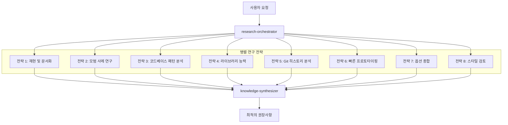

# 시니어 엔지니어 사고 패턴

MoAI-ADK는 "AI를 시니어 엔지니어처럼 생각하게 가르치는 8가지 연구 전략"을 통합하여 Alfred를 단순한 코딩 도우미가 아닌, 시니어 엔지니어처럼 연구하고 분석하며 학습하는 진정한 엔지니어링 파트너로 발전시킵니다.

## 개요

전통적인 AI 코딩 도우미는 종종 바로 구현으로 뛰어들어 다음과 같은 문제를 일으킵니다:
- 불완전한 요구사항 이해
- 엣지 케이스와 제약조건 누락
- 기존 솔루션 재발명
- 잘못된 아키텍처 결정

**시니어 엔지니어 Alfred**는 구현 전에 체계적인 연구 접근 방식을 따라 포괄적인 이해와 최적의 솔루션을 보장합니다.

## 8가지 연구 전략

### 1. 재현 및 문서화
**목적**: 체계적인 이슈 재현 및 문서화

**수행 내용**:
- 단계별 재현 가이드 생성
- 로그, 오류 메시지, 환경 컨텍스트 캡처
- 이슈 재현에 필요한 정확한 조건 문서화

**Alfred 구현**:
- `research-reproducer` 에이전트가 체계적 재현 전문
- 버그 분석을 위한 포괄적인 컨텍스트 캡처
- 재사용 가능한 재현 절차 생성

**예시**: 사용자가 "로그인이 안돼요"라고 보고할 때, Alfred가 수정안을 제안하기 전에 정확한 순서, 브라우저 조건, 네트워크 상태, 오류 패턴을 재현합니다.

### 2. 모범 사례 기반 연구
**목적**: 업계 표준 및 검증된 솔루션 연구

**수행 내용**:
- 다른 사람들이 비슷한 문제를 해결한 방법 검색
- 업계 표준, 문서, 패턴 분석
- 검증된 접근 방식과 일반적인 함정 식별

**Alfred 구현**:
- `best-practices-researcher` 에이전트가 업계 패턴 연구
- 확립된 표준에 대한 접근 방식 검증
- 검증된 솔루션 지식 베이스 유지

**예시**: 인증을 구현하기 전에 OAuth 2.0 표준, JWT 모범 사례, 세션 관리 패턴, 보안 가이드라인을 연구합니다.

### 3. 코드베이스 기반 연구
**목적**: 기존 구현 패턴 발견

**수행 내용**:
- 유사한 기능을 위해 기존 코드 검색
- 확립된 패턴과 관례 식별
- 재사용 가능한 컴포넌트와 접근 방식 찾기

**Alfred 구현**:
- 향상된 `codebase-analyst` 에이전트가 구현 패턴 발견
- 확립된 코딩 관례 인식
- 중복 기능 방지

**예시**: 새로운 분석 추적을 추가하기 전에 기존 이벤트 추적 시스템을 발견하고 확립된 패턴과 통합합니다.

### 4. 라이브러리 기반 연구
**목적**: 도구 능력에 대한 깊은 이해

**수행 내용**:
- 설치된 라이브러리의 소스코드 분석
- 문서화되지 않은 기능과 능력 식별
- 라이브러리 진화와 호환성 이해

**Alfred 구현**:
- `library-researcher` 에이전트가 라이브러리 능력 분석
- 소스코드와 테스트 케이스 읽기
- 숨겨진 기능과 최적의 사용 패턴 발견

**예시**: React Hook Form 소스코드를 연구하여 문서화되지 않은 검증 패턴과 성능 최적화를 발견합니다.

### 5. Git 히스토리 연구
**목적**: 과거 결정과 진화로부터 학습

**수행 내용**:
- 결정 컨텍스트를 이해하기 위해 커밋 히스토리 분석
- 특정 접근 방식이 선택된 이유 식별
- 과거의 성공과 실패로부터 학습

**Alfred 구현**:
- 향상된 `git-historian` 에이전트가 과거 패턴 분석
- 설계 결정의 진화 이해
- 과거 실수 반복 방지

**예시**: 라이브러리를 업그레이드하기 전에 과거 업그레이드 시도, 특정 버전이 선택된 이유, 발견된 이슈를 분석합니다.

### 6. 명확성을 위한 프로토타이핑
**목적**: 요구사항 탐색을 위한 빠른 프로토타이핑

**수행 내용**:
- 옵션 탐색을 위한 빠른, 일회용 버전 생성
- 상호작용을 통해 모호한 요구사항 명확화
- 설계 컨셉에 대한 빠른 반복 가능

**Alfred 구현**:
- `prototype-creator` 에이전트가 빠른 프로토타입 생성
- 예시를 통한 요구사항 명확화 촉진
- 빠른 설계 탐색 가능

**예시**: 이해관계자가 요구사항을 시각화하고 명확화할 수 있도록 새로운 기능에 대한 3가지 다른 UI 레이아웃을 생성합니다.

### 7. 옵션별 종합
**목적**: 여러 접근 방식 생성 및 비교

**수행 내용**:
- 모든 전략의 연구를 일관된 옵션으로 결합
- 다른 접근 방식 간의 트레이드오프 평가
- 장단점이 명확한 선택지 제시

**Alfred 구현**:
- `synthesis-agent` 에이전트가 연구 결과 통합
- 다중 솔루션 접근 방식 생성
- 명확한 트레이드오프와 의사결정 프레임워크 제공

**예시**: 데이터 동기화를 위한 3가지 접근 방식(실시간, 배치, 하이브리드)을 복잡성, 성능, 유지보수 영향에 대한 상세 분석과 함께 제시합니다.

### 8. 스타일 에이전트를 통한 검토
**목적**: 다각적 품질 검증

**수행 내용**:
- 여러 관점에서 전문 지식 적용
- 다른 품질 기준에 대한 결정 검증
- 포괄적인 검토 커버리지 보장

**Alfred 구현**:
- 다중 `style-reviewer` 에이전트가 전문 검토 제공
- 보안, 성능, 유지보수 관점
- 포괄적인 품질 검증

**예시**: 제안된 인증 시스템을 보안 전문가, 성능 전문가, 유지보수 전문가 관점에서 검토합니다.

## 병렬 연구 운영

핵심 혁신은 8가지 전략을 순차가 아닌 **병렬로** 실행하는 것입니다:



## 학습 및 축적 시스템

### 지식 축적
- 모든 연구 세션이 프로젝트 지식 베이스에 기여
- 발견된 패턴이 자동으로 캡처되고 재사용됨
- 축적된 경험을 통해 시간이 지날수록 결정 품질 향상

### 적응형 지능
- Alfred가 프로젝트의 고유한 패턴과 선호도를 학습
- 각 세션마다 연구가 더 빠르고 정확해짐
- 특정 코드베이스 역사로부터 맞춤형 모범 사례 등장

### 기억 및 컨텍스트
- 성공적인 패턴과 접근 방식의 장기 기억
- 프로젝트 역사에 기반한 컨텍스트 인식 권장사항
- 유사한 문제 간의 자동 지식 전이

## 실제 영향력

### 사례 연구 1: 대량 이메일 아카이빙 (53,000통)

**전통적 AI 접근**:
- 사용자: "이 이메일들을 모두 아카이빙해줘"
- AI: "간단한 대량 삭제 작업"
- 결과: Gmail rate limits, 타임아웃, 불만족한 사용자

**시니어 엔지니어 Alfred 접근**:
1. **연구**: Gmail API 한계, 배치 처리 패턴, 사용자 경험
2. **분석**: 코드베이스의 기존 대량 작업
3. **프로토타이핑**: 3가지 다른 처리 접근 방식
4. **종합**: 진행 상황 추적 + 재시도 로직이 있는 배치 처리
5. **검토**: 성능, UX, 보안 관점
6. **결과**: 진행 상황 추적, 오류 복구가 있는 견고한 솔루션, 만족한 사용자

### 사례 연구 2: 인증 시스템 설계

**전통적 AI 접근**:
- 사용자: "앱에 인증을 추가해줘"
- AI: 기본 JWT 구현
- 결과: 보안 취약점, 확장성 이슈

**시니어 엔지니어 Alfred 접근**:
1. **연구**: OAuth 2.0 표준, JWT 모범 사례, 세션 관리
2. **분석**: 코드베이스의 기존 인증 패턴
3. **기반**: 라이브러리 능력 (Auth0, Firebase Auth, 커스텀)
4. **역사**: 이전 인증 시도와 그들의 진화
5. **프로토타이핑**: 여러 인증 플로우
6. **종합**: 다중 제공자 지원이 있는 포괄적 솔루션
7. **검토**: 보안, 성능, 유지보수 검증
8. **결과**: 엔터프라이즈급 인증 시스템

## 구현 통합

### 계획 단계 (`/alfred:1-plan`)
- 8가지 전략을 통한 병렬 연구
- 포괄적인 요구사항 분석
- 위험 식별 및 완화 계획
- 트레이드오프가 있는 다중 솔루션 접근

### 구현 단계 (`/alfred:2-run`)
- 개발 중 지속적인 연구
- 각 단계에서 모범 사례 검증
- 다각적 코드 리뷰
- 패턴 인식 및 재사용

### 동기화 단계 (`/alfred:3-sync`)
- 패턴 추출 및 지식 캡처
- 학습된 인사이트 문서화
- 팀 지식 공유
- 권장사항의 지속적 개선

## 혜택

### 개인 개발자를 위해
- **컨텍스트 전환 감소**: Alfred가 전체 프로젝트 컨텍스트를 기억
- **더 나은 결정**: 추측이 아닌 연구 기반 결정
- **더 빠른 개발**: 학습된 패턴과 접근 방식 재사용
- **지속적 학습**: 각 세션마다 Alfred가 더 똑똑해짐

### 팀을 위해
- **일관된 품질**: 팀원 전체에 걸친 연구 기반 결정
- **지식 공유**: 집단적 학습과 패턴 인식
- **위험 완화**: 구현 전 포괄적 분석
- **더 빠른 온보딩**: 새로운 멤버가 축적된 지식으로 혜택

### 조직을 위해
- **기술 부채 감소**: 잘 연구된 아키텍처 결정
- **향상된 보안**: 모든 결정에 대한 보안 전문가 검토
- **더 나은 ROI**: 포괄적 분석에 기반한 최적화된 솔루션
- **혁신 문화**: 문제 해결에 대한 연구 우선 접근

## 시작하기

시니어 엔지니어 사고 패턴은 MoAI-ADK v0.22.0+에 자동 통합되었습니다. 추가 설정이 필요하지 않습니다.

### 기본 사용법
Alfred 명령어를 평소처럼 사용하면 됩니다 - 연구 전략이 자동으로 적용됩니다:

```bash
# 연구와 함께 계획
/alfred:1-plan "사용자 인증 시스템 추가"

# 지속적 연구와 함께 구현
/alfred:2-run AUTH-001

# 문서화 및 학습
/alfred:3-sync
```

### 고급 사용법
연구 전략에 대한 더 많은 제어:

```bash
# 특정 주제에 대한 심층 연구
/alfred:research "인증 모범 사례"

# 프로젝트 패턴으로부터 학습
/alfred:learn

# 현재 구현 검토
/alfred:review-security
/alfred:review-performance
```

## 더 알아보기

- [연구 전략 심층 분석](./research-strategies)
- [사례 연구](./case-studies)
- [구현 가이드](./implementation-guide)
- [모범 사례](./best-practices)