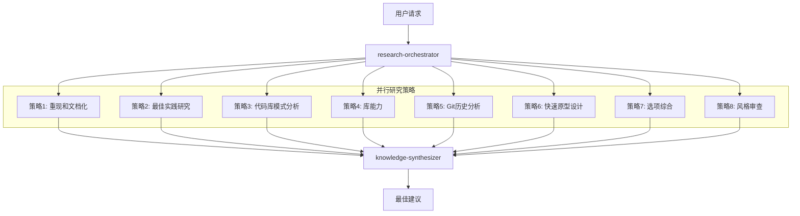

# 高级工程师思维模式

MoAI-ADK集成了"教会AI像高级工程师一样思考的8种研究策略"，将Alfred从简单的编码助手转变为像高级工程师一样研究、分析和学习的真正工程合作伙伴。

## 概述

传统的AI编码助手经常直接跳到实现，导致：
- 需求理解不完整
- 遗漏边界情况和约束条件
- 重新发明现有解决方案
- 架构决策不当

**高级工程师Alfred**遵循系统的研究方法，确保全面理解和最佳解决方案，然后再进行实现。

## 8种研究策略

### 1. 重现和文档化
**目的**: 系统性问题重现和文档化

**执行内容**:
- 创建逐步重现指南
- 捕获日志、错误消息和环境上下文
- 记录重现问题所需的确切条件

**Alfred实现**:
- `research-reproducer`代理专门从事系统性重现
- 为错误分析捕获全面上下文
- 创建可重用的重现程序

**示例**: 当用户报告"登录不工作"时，Alfred在建议修复之前重现确切的序列、浏览器条件、网络状态和错误模式。

### 2. 基于最佳实践的研究
**目的**: 研究行业标准经过验证的解决方案

**执行内容**:
- 搜索其他人如何解决类似问题
- 分析行业标准、文档和模式
- 识别经过验证的方法和常见陷阱

**Alfred实现**:
- `best-practices-researcher`代理研究行业模式
- 针对既定标准验证方法
- 维护经过验证的解决方案知识库

**示例**: 在实现认证之前，研究OAuth 2.0标准、JWT最佳实践、会话管理模式和安全指南。

### 3. 基于代码库的研究
**目的**: 发现现有实现模式

**执行内容**:
- 搜索现有代码中的类似功能
- 识别既定模式和约定
- 查找可重用组件和方法

**Alfred实现**:
- 增强的`codebase-analyst`代理发现实现模式
- 识别既定的编码约定
- 防止重复功能

**示例**: 在添加新的分析跟踪之前，发现现有的事件跟踪系统并与既定模式集成。

### 4. 基于库的研究
**目的**: 深入理解工具能力

**执行内容**:
- 分析已安装库的源代码
- 识别未记录的功能和能力
- 理解库的演进和兼容性

**Alfred实现**:
- `library-researcher`代理分析库能力
- 读取源代码和测试用例
- 发现隐藏功能和最佳使用模式

**示例**: 研究React Hook Form源代码以发现未记录的验证模式和性能优化。

### 5. 研究Git历史
**目的**: 从过去的决策和演进中学习

**执行内容**:
- 分析提交历史以理解决策上下文
- 识别选择某些方法的原因
- 从过去的成功和失败中学习

**Alfred实现**:
- 增强的`git-historian`代理分析历史模式
- 理解设计决策的演进
- 防止重复过去的错误

**示例**: 在升级库之前，分析过去的升级尝试、选择某些版本的原因以及遇到的问题。

### 6. 为清晰性进行原型设计
**目的**: 快速原型设计以探索需求

**执行内容**:
- 创建快速、一次性的版本来探索选项
- 通过交互澄清模糊需求
- 实现设计概念的快速迭代

**Alfred实现**:
- `prototype-creator`代理构建快速原型
- 通过示例促进需求澄清
- 启用快速设计探索

**示例**: 为新功能创建3种不同的UI布局，帮助利益相关者可视化和澄清需求。

### 7. 按选项综合
**目的**: 生成和比较多种方法

**执行内容**:
- 将所有策略的研究结果整合为连贯的选项
- 评估不同方法之间的权衡
- 提供具有优缺点的明确选择

**Alfred实现**:
- `synthesis-agent`代理整合研究发现
- 生成多种解决方案方法
- 提供具有明确权衡的决策框架

**示例**: 提出3种数据同步方法（实时、批处理、混合），并详细分析复杂性、性能和维护影响。

### 8. 通过风格代理进行审查
**目的**: 多视角质量验证

**执行内容**:
- 从多个视角应用专业知识
- 针对不同质量标准验证决策
- 确保全面的审查覆盖

**Alfred实现**:
- 多个`style-reviewer`代理提供专业审查
- 安全、性能、可维护性视角
- 全面质量验证

**示例**: 从安全专家、性能专家和可维护性专家的视角审查提议的认证系统。

## 并行研究操作

关键创新是**并行**执行所有8种策略，而不是顺序执行：



## 学习和累积系统

### 知识累积
- 每个研究阶段都为项目知识库做出贡献
- 发现的模式被自动捕获和重用
- 决策质量通过累积经验随时间提高

### 适应性智能
- Alfred学习项目的独特模式和偏好
- 每个阶段的研究变得更快更准确
- 特定代码库历史中出现定制最佳实践

### 记忆和上下文
- 成功模式和方法的长期记忆
- 基于项目历史的上下文感知建议
- 相似问题之间的自动知识转移

## 实际影响

### 案例研究1: 批量邮件归档（53,000封邮件）

**传统AI方法**:
- 用户: "归档所有这些邮件"
- AI: "简单的批量删除操作"
- 结果: Gmail速率限制、超时、用户沮丧

**高级工程师Alfred方法**:
1. **研究**: Gmail API限制、批处理模式、用户体验
2. **分析**: 代码库中现有的批量操作
3. **原型设计**: 三种不同的处理方法
4. **综合**: 带进度跟踪+重试逻辑的批处理
5. **审查**: 性能、用户体验、安全视角
6. **结果**: 具有进度跟踪、错误恢复的稳健解决方案，满意用户

### 案例研究2: 认证系统设计

**传统AI方法**:
- 用户: "为我们的应用添加认证"
- AI: 基本JWT实现
- 结果: 安全漏洞、可扩展性问题

**高级工程师Alfred方法**:
1. **研究**: OAuth 2.0标准、JWT最佳实践、会话管理
2. **分析**: 代码库中现有认证模式
3. **基础**: 库能力（Auth0、Firebase Auth、自定义）
4. **历史**: 之前的认证尝试及其演进
5. **原型设计**: 多种认证流程
6. **综合**: 支持多个提供商的综合解决方案
7. **审查**: 安全、性能、可维护性验证
8. **结果**: 企业级认证系统

## 实现集成

### 计划阶段（`/alfred:1-plan`）
- 通过所有8种策略进行并行研究
- 全面需求分析
- 风险识别和缓解计划
- 具有权衡的多种解决方案方法

### 实现阶段（`/alfred:2-run`）
- 开发过程中的持续研究
- 每个步骤的最佳实践验证
- 多视角代码审查
- 模式识别和重用

### 同步阶段（`/alfred:3-sync`）
- 模式提取和知识捕获
- 学习见解的文档化
- 团队知识共享
- 建议的持续改进

## 好处

### 对个人开发者
- **减少上下文切换**: Alfred记住整个项目上下文
- **更好的决策**: 基于研究的决策而不是猜测
- **更快的开发**: 重用学习的模式和方法
- **持续学习**: 每个阶段Alfred变得更聪明

### 对团队
- **一致的质量**: 团队成员之间的基于研究的决策
- **知识共享**: 集体学习和模式识别
- **风险缓解**: 实现前的全面分析
- **更快的入职**: 新成员从累积知识中受益

### 对组织
- **减少技术债务**: 研究充分的架构决策
- **提高安全性**: 所有决策的安全专家审查
- **更好的投资回报率**: 基于全面分析的优化解决方案
- **创新文化**: 问题解决的研究优先方法

## 开始使用

高级工程师思维模式在MoAI-ADK v0.22.0+中自动集成。不需要额外配置。

### 基本用法
像往常一样使用Alfred命令 - 研究策略自动应用：

```bash
# 带研究的计划
/alfred:1-plan "添加用户认证系统"

# 带持续研究的实现
/alfred:2-run AUTH-001

# 文档化和学习
/alfred:3-sync
```

### 高级用法
对研究策略的更多控制：

```bash
# 特定主题的深入研究
/alfred:research "认证最佳实践"

# 从项目模式中学习
/alfred:learn

# 审查当前实现
/alfred:review-security
/alfred:review-performance
```

## 进一步学习

- [研究策略深入探讨](./research-strategies)
- [案例研究](./case-studies)
- [实现指南](./implementation-guide)
- [最佳实践](./best-practices)