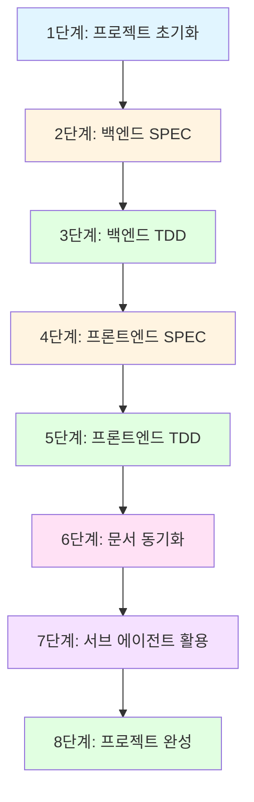

<!-- @CODE:DOCS-001 | SPEC: .moai/specs/SPEC-DOCS-001/spec.md -->

# Todo App 풀스택 실전 예제

> **학습 목표**: MoAI-ADK의 `/alfred:8-project` → `1-spec` → `2-build` → `3-sync` 전체 워크플로우를 이해하고, SPEC-First TDD로 풀스택 애플리케이션을 구축하는 방법을 습득합니다.

## 개요

이 예제는 Todo App 풀스택 애플리케이션을 MoAI-ADK의 3단계 파이프라인으로 구축하는 전 과정을 다룹니다.

**기술 스택**:
- **프론트엔드**: React 19, TypeScript, Tailwind CSS
- **백엔드**: FastAPI, Python 3.11+
- **데이터베이스**: SQLite3, SQLModel
- **테스트**: Vitest (Frontend), pytest (Backend)

**완성 구조**:
```
todo-app/
├── frontend/          # React 19 + TypeScript
│   ├── src/
│   │   ├── components/
│   │   ├── hooks/
│   │   └── api/
│   └── tests/
└── backend/           # FastAPI + SQLModel
    ├── src/
    │   ├── api/
    │   ├── models/
    │   └── services/
    └── tests/
```

---

## 전체 워크플로우 다이어그램



---

## 1단계: 프로젝트 초기화 (`/alfred:8-project`)

### 실행

```bash
# 프로젝트 생성
npx moai-adk init todo-app
cd todo-app

# Alfred로 프로젝트 초기화
/alfred:8-project
```

### Alfred 응답 예시

```
📋 프로젝트 정보 입력

프로젝트명: Todo App
설명: MoAI-ADK로 구축하는 풀스택 Todo 애플리케이션
모드: personal (개인) / team (팀) → personal
주 언어: Python, TypeScript
```

### 생성된 구조

```
todo-app/
├── .moai/
│   ├── config.json           # 프로젝트 설정
│   ├── specs/                # SPEC 문서 저장소
│   └── memory/
│       └── development-guide.md
├── CLAUDE.md                 # AI 에이전트 지침
└── README.md
```

### 핵심 포인트
- `.moai/config.json`에 프로젝트 메타데이터 자동 생성
- CLAUDE.md에 Alfred SuperAgent 커맨드 및 에이전트 정보 포함
- development-guide.md에 TRUST 5원칙 및 @TAG 시스템 정의

---

## 2단계: 백엔드 SPEC 작성 (`/alfred:1-spec`)

### 실행

```bash
/alfred:1-spec "Todo API 백엔드 - CRUD 엔드포인트, SQLite 저장소"
```

### Alfred 분석 모드 응답

```
## 구현 계획 보고서: SPEC-API-001

### 📊 분석 결과
- **복잡도**: 중간 - RESTful CRUD, 데이터베이스 통합
- **예상 작업시간**: 3시간
- **주요 기술 도전**:
  1. FastAPI 라우팅 및 의존성 주입
  2. SQLModel ORM 통합
  3. pytest 비동기 테스트

### 🎯 구현 전략
- **선택 언어**: Python - FastAPI 생태계 우수
- **TDD 접근법**: Bottom-up (모델 → 서비스 → API)
- **핵심 모듈**: models, services, api

---
**🔔 승인 요청**: 위 계획으로 SPEC 작성을 진행하시겠습니까?
```

### 사용자 응답

```
진행
```

### 생성된 SPEC 문서

**`.moai/specs/SPEC-API-001/spec.md`**:

```yaml
---
id: API-001
version: 0.0.1
status: draft
created: 2025-10-11
updated: 2025-10-11
author: @YourName
priority: high
category: backend
labels: ["api", "fastapi", "crud"]
---

# @SPEC:API-001: Todo API 백엔드

## HISTORY
### v0.0.1 (2025-10-11)
- **INITIAL**: Todo CRUD API 명세 작성

## 1. Overview
Todo 아이템 CRUD를 제공하는 RESTful API

## 2. EARS Requirements

### Ubiquitous Requirements
- 시스템은 Todo 생성/조회/수정/삭제 API를 제공해야 한다
- 시스템은 SQLite 데이터베이스에 Todo를 영구 저장해야 한다

### Event-driven Requirements
- WHEN 사용자가 POST /todos 요청하면, 시스템은 새 Todo를 생성하고 201 응답을 반환해야 한다
- WHEN 사용자가 GET /todos 요청하면, 시스템은 모든 Todo 목록을 반환해야 한다
- WHEN 사용자가 PUT /todos/{id} 요청하면, 시스템은 해당 Todo를 수정하고 200 응답을 반환해야 한다
- WHEN 사용자가 DELETE /todos/{id} 요청하면, 시스템은 해당 Todo를 삭제하고 204 응답을 반환해야 한다

### Constraints
- IF 존재하지 않는 Todo ID 요청 시, 시스템은 404 에러를 반환해야 한다
- 응답 시간은 100ms 이내여야 한다
```

### Git 자동화 (git-manager)

```bash
# git-manager가 자동 실행
git checkout -b feature/SPEC-API-001
git add .moai/specs/SPEC-API-001/spec.md
git commit -m "🔴 RED: SPEC-API-001 Todo API 명세 작성

@SPEC:API-001
"
```

---

## 3단계: 백엔드 TDD 구현 (`/alfred:2-build`)

### 실행

```bash
/alfred:2-build SPEC-API-001
```

### TDD 사이클 - RED 단계

**Alfred 응답**:
```
🔴 RED Phase: 테스트 작성 중...

생성: tests/api/test_todos.py
```

**`tests/api/test_todos.py`** (일부):

```python
# @TEST:API-001 | SPEC: .moai/specs/SPEC-API-001/spec.md
import pytest
from fastapi.testclient import TestClient

def test_should_create_todo():
    """TEST-API-001: Todo 생성 API 테스트"""
    client = TestClient(app)
    response = client.post("/todos", json={
        "title": "Buy milk",
        "completed": False
    })
    assert response.status_code == 201
    assert response.json()["title"] == "Buy milk"

def test_should_list_all_todos():
    """TEST-API-001: Todo 목록 조회 테스트"""
    client = TestClient(app)
    response = client.get("/todos")
    assert response.status_code == 200
    assert isinstance(response.json(), list)

def test_should_return_404_for_nonexistent_todo():
    """TEST-API-001: 존재하지 않는 Todo 에러 처리"""
    client = TestClient(app)
    response = client.get("/todos/999")
    assert response.status_code == 404
```

**테스트 실행 결과**:
```bash
pytest tests/api/test_todos.py
# FAILED - 모든 테스트 실패 (의도적)
```

**Git 커밋** (git-manager):
```bash
git add tests/
git commit -m "🔴 RED: SPEC-API-001 Todo API 테스트 작성

@TEST:API-001
"
```

### TDD 사이클 - GREEN 단계

**Alfred 응답**:
```
🟢 GREEN Phase: 최소 구현 중...

생성: backend/src/models/todo.py
생성: backend/src/api/todos.py
```

**`backend/src/models/todo.py`**:

```python
# @CODE:API-001:DATA | SPEC: SPEC-API-001.md | TEST: tests/api/test_todos.py
from sqlmodel import SQLModel, Field
from typing import Optional

class Todo(SQLModel, table=True):
    """@CODE:API-001: Todo 데이터 모델"""
    id: Optional[int] = Field(default=None, primary_key=True)
    title: str = Field(max_length=200)
    completed: bool = Field(default=False)
```

**`backend/src/api/todos.py`**:

```python
# @CODE:API-001:API | SPEC: SPEC-API-001.md | TEST: tests/api/test_todos.py
from fastapi import APIRouter, HTTPException, status
from sqlmodel import Session, select
from ..models.todo import Todo
from ..database import engine

router = APIRouter()

@router.post("/todos", status_code=status.HTTP_201_CREATED)
def create_todo(todo: Todo):
    """@CODE:API-001: Todo 생성 API"""
    with Session(engine) as session:
        session.add(todo)
        session.commit()
        session.refresh(todo)
        return todo

@router.get("/todos")
def list_todos():
    """@CODE:API-001: Todo 목록 조회 API"""
    with Session(engine) as session:
        todos = session.exec(select(Todo)).all()
        return todos

@router.get("/todos/{todo_id}")
def get_todo(todo_id: int):
    """@CODE:API-001: Todo 단일 조회 API"""
    with Session(engine) as session:
        todo = session.get(Todo, todo_id)
        if not todo:
            raise HTTPException(status_code=404, detail="Todo not found")
        return todo
```

**테스트 실행 결과**:
```bash
pytest tests/api/test_todos.py
# PASSED - 모든 테스트 통과 ✅
# Coverage: 87%
```

**Git 커밋** (git-manager):
```bash
git add backend/src/
git commit -m "🟢 GREEN: SPEC-API-001 Todo API 최소 구현

@CODE:API-001
"
```

### TDD 사이클 - REFACTOR 단계

**Alfred 응답**:
```
♻️ REFACTOR Phase: 코드 품질 개선 중...

개선: 의존성 주입 패턴 적용
개선: 에러 핸들링 강화
```

**개선된 `backend/src/api/todos.py`**:

```python
# @CODE:API-001:API | 성능 최적화 및 보안 강화
from fastapi import APIRouter, HTTPException, Depends, status
from sqlmodel import Session, select
from ..models.todo import Todo
from ..database import get_session  # 의존성 주입

router = APIRouter()

@router.post("/todos", status_code=status.HTTP_201_CREATED)
def create_todo(
    todo: Todo,
    session: Session = Depends(get_session)
):
    """@CODE:API-001:PERF: 의존성 주입으로 성능 개선"""
    session.add(todo)
    session.commit()
    session.refresh(todo)
    return todo

@router.get("/todos/{todo_id}")
def get_todo(
    todo_id: int,
    session: Session = Depends(get_session)
):
    """@CODE:API-001:SECURITY: 입력 검증 강화"""
    if todo_id < 1:
        raise HTTPException(
            status_code=400,
            detail="Invalid todo ID"
        )
    todo = session.get(Todo, todo_id)
    if not todo:
        raise HTTPException(
            status_code=404,
            detail="Todo not found"
        )
    return todo
```

**Git 커밋** (git-manager):
```bash
git add backend/src/
git commit -m "♻️ REFACTOR: SPEC-API-001 코드 품질 개선

- 의존성 주입 패턴 적용
- 입력 검증 강화
- 에러 핸들링 개선

@CODE:API-001
"
```

---

## 4단계: 프론트엔드 SPEC 작성

### 실행

```bash
/alfred:1-spec "Todo UI - React 컴포넌트, Tailwind CSS 스타일링"
```

### 생성된 SPEC

**`.moai/specs/SPEC-UI-001/spec.md`**:

```yaml
---
id: UI-001
version: 0.0.1
status: draft
created: 2025-10-11
updated: 2025-10-11
author: @YourName
priority: high
category: frontend
labels: ["ui", "react", "tailwind"]
depends_on: ["API-001"]
---

# @SPEC:UI-001: Todo UI 프론트엔드

## HISTORY
### v0.0.1 (2025-10-11)
- **INITIAL**: Todo UI 컴포넌트 명세 작성

## EARS Requirements

### Ubiquitous Requirements
- 시스템은 Todo 입력 폼을 제공해야 한다
- 시스템은 Todo 목록을 표시해야 한다
- 시스템은 완료/미완료 토글 버튼을 제공해야 한다

### Event-driven Requirements
- WHEN 사용자가 Todo 입력 후 Enter 키를 누르면, 시스템은 새 Todo를 생성해야 한다
- WHEN 사용자가 체크박스를 클릭하면, 시스템은 완료 상태를 토글해야 한다

### Constraints
- UI는 Tailwind CSS로 스타일링해야 한다
- 로딩 상태를 명확히 표시해야 한다
```

---

## 5단계: 프론트엔드 TDD 구현

### 실행

```bash
/alfred:2-build SPEC-UI-001
```

### TDD 사이클 (요약)

**RED**: Vitest + React Testing Library로 컴포넌트 테스트 작성
**GREEN**: React 19 컴포넌트 최소 구현
**REFACTOR**: 접근성 개선, 커스텀 훅 추출

**생성 파일**:
```
frontend/
├── src/
│   ├── components/
│   │   ├── TodoList.tsx        # @CODE:UI-001:UI
│   │   └── TodoItem.tsx
│   └── hooks/
│       └── useTodos.ts         # @CODE:UI-001:DOMAIN
└── tests/
    └── TodoList.test.tsx       # @TEST:UI-001
```

---

## 6단계: 문서 동기화 (`/alfred:3-sync`)

### 실행

```bash
/alfred:3-sync
```

### Alfred 응답

```
📄 문서 동기화 시작...

✅ TAG 체인 검증 완료
   @SPEC:API-001 → @TEST:API-001 → @CODE:API-001 ✓
   @SPEC:UI-001 → @TEST:UI-001 → @CODE:UI-001 ✓

📊 Living Document 생성 중...
   생성: docs/api/todo-api.md
   생성: docs/ui/todo-components.md

🏷️ TAG 인덱스 업데이트
   추가: API-001 (Backend API)
   추가: UI-001 (Frontend UI)

✅ 동기화 완료!
```

### Git 자동화

```bash
git add docs/ .moai/
git commit -m "📝 DOCS: SPEC-API-001, SPEC-UI-001 문서 동기화

Living Document 생성 및 TAG 인덱스 업데이트

@DOC:API-001
@DOC:UI-001
"
```

---

## 7단계: 서브 에이전트 활용

### 7-1. debug-helper: 에러 진단

**시나리오**: API 호출 시 CORS 에러 발생

```bash
@agent-debug-helper "API 호출 시 CORS 에러: Access-Control-Allow-Origin 헤더 누락"
```

**debug-helper 응답**:

```
🔬 에러 진단 결과

**문제**: FastAPI CORS 미들웨어 미설정
**원인**: backend/src/main.py에 CORSMiddleware 없음

**해결 방법**:
1. fastapi.middleware.cors import 추가
2. app.add_middleware(CORSMiddleware, ...) 설정

**코드 예시**:
```python
from fastapi.middleware.cors import CORSMiddleware

app.add_middleware(
    CORSMiddleware,
    allow_origins=["http://localhost:5173"],
    allow_credentials=True,
    allow_methods=["*"],
    allow_headers=["*"],
)
```

**관련 SPEC**: SPEC-API-001 보안 요구사항 업데이트 권장
```

### 7-2. trust-checker: TRUST 원칙 검증

```bash
@agent-trust-checker "SPEC-API-001 구현 검증"
```

**trust-checker 응답**:

```
✅ TRUST 원칙 검증 결과

**T - Test First**: ✅ PASS
   - 테스트 커버리지: 87% (목표 85% 이상)
   - TDD 사이클 준수: RED → GREEN → REFACTOR

**R - Readable**: ✅ PASS
   - 함수 크기: 평균 15 LOC (목표 ≤ 50)
   - 복잡도: 평균 3 (목표 ≤ 10)

**U - Unified**: ⚠️ WARNING
   - backend/src/api/todos.py: 300 LOC → 250 LOC 권장
   - 권장: TodoService 클래스로 비즈니스 로직 분리

**S - Secured**: ✅ PASS
   - 입력 검증: Pydantic 모델 사용 ✓
   - SQL Injection 방지: SQLModel ORM 사용 ✓

**T - Trackable**: ✅ PASS
   - @TAG 체인 무결성: @SPEC → @TEST → @CODE 연결 ✓
```

### 7-3. tag-agent: TAG 관리

```bash
@agent-tag-agent "API 도메인 TAG 목록 조회"
```

**tag-agent 응답**:

```
🏷️ API 도메인 TAG 목록

**@SPEC:API-001**
   - 파일: .moai/specs/SPEC-API-001/spec.md
   - 상태: draft
   - 버전: v0.0.1
   - 연결: @TEST:API-001 → @CODE:API-001

**@TEST:API-001**
   - 파일: tests/api/test_todos.py
   - 라인: 15, 28, 42
   - 커버리지: 87%

**@CODE:API-001**
   - 파일: backend/src/api/todos.py
   - 서브 카테고리: API, DATA, DOMAIN
   - LOC: 250

**TAG 체인 상태**: ✅ 무결성 검증 통과
```

---

## 8단계: 프로젝트 완성 구조

### 최종 디렉토리 구조

```
todo-app/
├── .moai/
│   ├── config.json
│   ├── specs/
│   │   ├── SPEC-API-001/
│   │   │   └── spec.md
│   │   └── SPEC-UI-001/
│   │       └── spec.md
│   └── memory/
│       └── development-guide.md
├── backend/
│   ├── src/
│   │   ├── api/
│   │   │   └── todos.py          # @CODE:API-001:API
│   │   ├── models/
│   │   │   └── todo.py           # @CODE:API-001:DATA
│   │   ├── services/
│   │   │   └── todo_service.py   # @CODE:API-001:DOMAIN
│   │   └── main.py
│   └── tests/
│       └── api/
│           └── test_todos.py     # @TEST:API-001
├── frontend/
│   ├── src/
│   │   ├── components/
│   │   │   ├── TodoList.tsx      # @CODE:UI-001:UI
│   │   │   └── TodoItem.tsx
│   │   ├── hooks/
│   │   │   └── useTodos.ts       # @CODE:UI-001:DOMAIN
│   │   └── api/
│   │       └── client.ts         # @CODE:UI-001:API
│   └── tests/
│       └── TodoList.test.tsx     # @TEST:UI-001
├── docs/
│   ├── api/
│   │   └── todo-api.md           # @DOC:API-001
│   └── ui/
│       └── todo-components.md    # @DOC:UI-001
├── CLAUDE.md
└── README.md
```

### TAG 체인 완성도

```
@SPEC:API-001 → @TEST:API-001 → @CODE:API-001 → @DOC:API-001 ✅
@SPEC:UI-001 → @TEST:UI-001 → @CODE:UI-001 → @DOC:UI-001 ✅
```

---

## 핵심 포인트 정리

### MoAI-ADK 3단계 파이프라인 이해

1. **`/alfred:1-spec`**: SPEC-First 접근
   - EARS 방식 명세 작성
   - Draft PR 자동 생성 (team 모드)
   - 명확한 요구사항 정의

2. **`/alfred:2-build`**: TDD 구현
   - RED: 테스트 먼저 작성
   - GREEN: 최소 구현
   - REFACTOR: 품질 개선

3. **`/alfred:3-sync`**: 추적성 보장
   - Living Document 자동 생성
   - TAG 체인 검증
   - PR Ready 전환

### @TAG 시스템 활용

- **Primary Chain**: @SPEC → @TEST → @CODE → @DOC
- **서브 카테고리**: :API, :UI, :DATA, :DOMAIN, :INFRA
- **CODE-FIRST**: 코드 직접 스캔 방식

### TRUST 5원칙 적용

- **Test First**: TDD 사이클 엄격히 준수
- **Readable**: 의도 드러내는 이름, 가드절 우선
- **Unified**: 단일 책임 원칙, 모듈 분리
- **Secured**: 입력 검증, ORM 사용
- **Trackable**: @TAG 체인 무결성

### 서브 에이전트 활용

- **debug-helper**: 에러 발생 시 즉시 호출
- **trust-checker**: TRUST 원칙 검증
- **tag-agent**: TAG 조회 및 관리

---

## 다음 단계

1. **배포 자동화**: GitHub Actions로 CI/CD 구축
2. **인증 시스템 추가**: JWT 인증 SPEC 작성 → TDD 구현
3. **고급 기능**: 태그, 우선순위, 마감일 등 추가

**관련 예제**:
- [Auth System](auth-system.md) - JWT 인증 시스템
- [API Endpoint](api-endpoint.md) - REST API 엔드포인트

---

## 참고 자료

- [CLAUDE.md](../../CLAUDE.md) - Alfred SuperAgent 가이드
- [Development Guide](../../.moai/memory/development-guide.md) - TRUST 원칙 상세
- [SPEC Metadata](../../.moai/memory/spec-metadata.md) - SPEC 작성 표준
