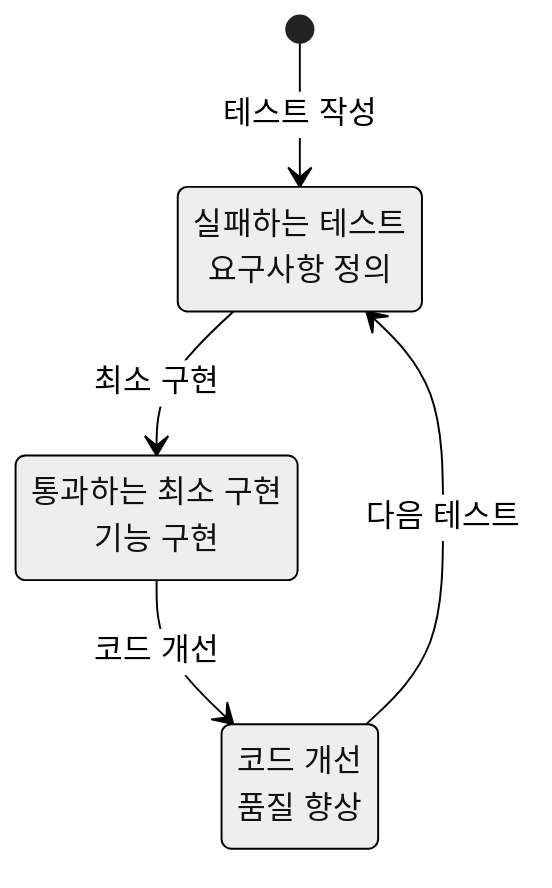
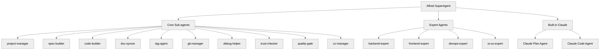
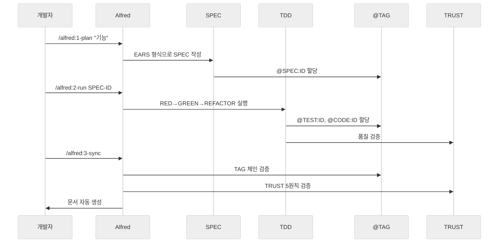

# MoAI-ADK 기본 개념

MoAI-ADK의 핵심 개념들을 이해하면 AI와 협력 개발의 진정한 힘을 발휘할 수 있습니다. 이 문서는 SPEC-First, TDD, @TAG, TRUST 5원칙, Alfred SuperAgent라는 5가지 핵심 개념을 상세하게 설명합니다.

## 이 문서의 목적

이 가이드는 MoAI-ADK의 철학적 기반과 실제 적용 방법을 모두 다룹니다. 개념적인 이해뿐만 아니라, 실제 프로젝트에서 어떻게 적용되는지 구체적인 예시를 통해 보여줍니다. 각 개념은 독립적으로 존재하지만, 서로 유기적으로 연결되어 하나의 완전한 개발 시스템을 형성합니다.

## 📚 학습 목표

이 문서를 완전히 학습한 후에는 다음을 수행할 수 있습니다:

- **SPEC-First**: EARS 문법을 활용하여 명확한 요구사항 정의
- **TDD**: RED→GREEN→REFACTOR 사이클을 완벽하게 수행
- **@TAG 시스템**: 모든 산출물의 추적성 확보
- **TRUST 5원칙**: 고품질 코드의 기준 이해와 적용
- **Alfred SuperAgent**: AI 에이전트 팀의 효과적인 활용

## 🎯 개념 개요

MoAI-ADK는 다음 5가지 핵심 개념으로 구성된 통합 개발 시스템입니다:

```mermaid
%%{init: {'theme':'neutral'}}%%
graph TD
    Alfred[Alfred SuperAgent] --> SPEC[SPEC-First]
    Alfred --> TDD[TDD 개발]
    Alfred --> TAG[@TAG 시스템]
    Alfred --> TRUST[TRUST 5원칙]

    SPEC --> TDD
    TDD --> TAG
    TAG --> TRUST
    TRUST --> Alfred

    subgraph "개발 워크플로우"
        SPEC --> Plan[1. Plan]
        TDD --> Run[2. Run]
        TRUST --> Sync[3. Sync]
        TAG --> Track[추적성]
    end
```

### 개념 간의 관계

5가지 핵심 개념은 선형적인 관계가 아니라, 순환적인 상호보완 관계를 가집니다:

1. **SPEC-First**는 모든 개발의 시작점이자 기준입니다
2. **TDD**는 SPEC을 검증 가능한 코드로 변환하는 과정입니다
3. **@TAG 시스템**은 모든 산출물의 연결성을 보장합니다
4. **TRUST 5원칙**은 품질 기준으로 모든 과정을 검증합니다
5. **Alfred SuperAgent**는 이 모든 과정을 지능적으로 오케스트레이션합니다

### 현대 개발과 MoAI-ADK의 차별점

| 전통 개발 방식 | MoAI-ADK 방식 | 차별점 |
|----------------|----------------|--------|
| **요구사항 → 코드 → 테스트** | **SPEC → TDD → 문서** | 명확성과 검증 가능성 |
| **수동 리뷰** | **자동화된 TRUST 검증** | 일관된 품질 보장 |
| **산발적인 문서화** | **Living Document** | 항상 최신 상태 유지 |
| **개인의 경험 의존** | **AI 에이전트 팀 협력** | 지식의 축적과 재사용 |
| **추적성 부재** | **@TAG 기반 추적** | 완전한 변경 이력 관리 |

---

## 💡 왜 이 개념들이 중요한가?

### 소프트웨어 개발의 본질적 문제들

전통적인 소프트웨어 개발은 다음과 같은 문제들에 직면합니다:

1. **요구사항의 모호함**: "사용자 관리 기능"이라는 요구사항은 수십 가지로 다르게 해석될 수 있습니다
2. **품질의 일관성 부재**: 개발자마다 코드 품질 기준이 다릅니다
3. **기술 부채의 누적**: 빠른 개발을 위해 테스트나 문서를 생략하는 경우가 많습니다
4. **지식의 단절**: 주요 개발자가 떠나면 시스템에 대한 이해가 사라집니다
5. **변경에 대한 두려움**: 어디를 수정해야 할지, 어떤 영향이 있을지 알 수 없습니다

### MoAI-ADK의 해결 방식

MoAI-ADK의 5가지 핵심 개념은 이러한 문제들을 체계적으로 해결합니다:

- **SPEC-First**: 요구사항의 모호함을 EARS 문법으로 해결
- **TDD**: 품질의 일관성을 자동화된 테스트로 보장
- **@TAG 시스템**: 지식의 단절을 추적 가능성으로 방지
- **TRUST 5원칙**: 기술 부채를 체계적인 품질 관리로 예방
- **Alfred SuperAgent**: AI의 도움으로 개발 생산성 극대화

## 1️⃣ SPEC-First (요구사항 먼저)

### 핵심 원리

**"코드 없이는 테스트도 없고, 테스트 없이는 SPEC도 없다"**

더 정확히는 역순입니다:

> **"SPEC이 먼저 나온다. SPEC 없이는 테스트도 없다. 테스트와 코드가 없으면 문서도 완성이 아니다."**

### 왜 SPEC-First인가요?

건축에 비유해봅시다:

| 건축 과정 | 소프트웨어 개발 | MoAI-ADK 방식 |
|-----------|----------------|---------------|
| 설계도 없이 건축 | 요구사항 없이 코딩 | ❌ 실패 확률 높음 |
| 설계도 먼저 | SPEC 먼저 작성 | ✅ 성공 확률 높음 |
| 설계도 기반 시공 | SPEC 기반 개발 | ✅ 품질 보장 |

### SPEC의 구조

MoAI-ADK의 SPEC은 EARS(Easy Approach to Requirements Syntax) 문법을 따릅니다:

#### SPEC 파일 구조

```yaml
---
id: AUTH-001              # 고유 ID
version: 1.0.0           # 버전
status: draft            # 상태 (draft, in_progress, completed)
priority: high           # 우선순위 (critical, high, medium, low)
created: 2025-11-06      # 생성일
updated: 2025-11-06      # 수정일
author: @developer       # 작성자
---

# `@SPEC:EX-AUTH-001: 사용자 인증 시스템

## Ubiquitous Requirements (기본 기능)
- 시스템은 JWT 기반 인증을 제공해야 한다

## Event-driven Requirements (조건부)
- **WHEN** 유효한 자격증명이 제공되면, 시스템은 토큰을 발급해야 한다
- **WHEN** 만료된 토큰이 제공되면, 시스템은 401 에러를 반환해야 한다

## State-driven Requirements (상태 기반)
- **WHILE** 사용자가 인증된 상태일 때, 시스템은 보호된 리소스에 접근을 허용해야 한다

## Optional Requirements (선택 사항)
- **WHERE** 리프레시 토큰이 있으면, 시스템은 새 토큰을 발급할 수 있다

## Unwanted Behaviors (제약 조건)
- 토큰 만료 시간은 15분을 초과하지 않아야 한다
- 비밀번호는 평문으로 저장되어서는 안 된다
```

### EARS 문법의 5가지 패턴

| 패턴 | 형식 | 예시 | 사용 시점 |
|------|------|------|-----------|
| **Ubiquitous** | "시스템은 ~해야 한다" | 시스템은 JWT 기반 인증을 제공해야 한다 | 기본 기능 정의 |
| **Event-driven** | "WHEN ~ THEN ~" | WHEN 유효한 자격증명이 제공되면, THEN 토큰을 발급해야 한다 | 조건부 동작 |
| **State-driven** | "WHILE ~ ~해야 한다" | WHILE 인증된 상태일 때, 리소스 접근을 허용해야 한다 | 지속적인 상태 |
| **Optional** | "WHERE ~ 할 수 있다" | WHERE 리프레시 토큰이 있으면, 새 토큰을 발급할 수 있다 | 선택적 기능 |
| **Unwanted Behaviors** | "~하지 않아야 한다" | 토큰 만료는 15분을 초과하지 않아야 한다 | 제약 조건 |

### SPEC의 가치

✅ **명확성**: 모든 팀원이 같은 요구사항을 이해
✅ **테스트 가능**: 각 요구사항이 테스트 케이스가 됨
✅ **추적성**: 요구사항 변경 시 영향 범위 즉시 파악
✅ **품질 보증**: 모호함 없는 명확한 정의

## 2️⃣ TDD (Test-Driven Development)

### 핵심 원리

**구현 전에 테스트를 먼저 작성합니다.** 이는 목적지를 정하고 나서 길을 찾는 것과 같습니다.

### TDD의 3단계 사이클



#### 🔴 RED 단계: 실패하는 테스트 작성

**목표**: 구현 전에 요구사항을 테스트로 정의

```python
# tests/test_auth.py
# `@TEST:EX-AUTH-001 | SPEC: SPEC-AUTH-001.md

import pytest
from src.auth.service import AuthService

def test_login_with_valid_credentials_should_return_token():
    """WHEN 유효한 자격증명이 제공되면, JWT 토큰을 발급해야 한다"""
    auth_service = AuthService()
    token = auth_service.login("user@example.com", "valid_password")

    assert token is not None
    assert isinstance(token, str)
    assert len(token) > 0  # JWT 토큰은 일반적으로 길다

def test_login_with_invalid_credentials_should_raise_error():
    """WHEN 무효한 자격증명이 제공되면, 예외를 발생시켜야 한다"""
    auth_service = AuthService()

    with pytest.raises(AuthenticationError):
        auth_service.login("user@example.com", "wrong_password")
```

**실행 결과**: ❌ 모두 실패 (AuthService가 아직 없음)

**Git 커밋**:
```bash
git commit -m "🔴 test(AUTH-001): add failing authentication tests"
```

#### 🟢 GREEN 단계: 최소 구현

**목표**: 테스트를 통과시키는 가장 단순한 구현

```python
# src/auth/service.py
# `@CODE:EX-AUTH-001:SERVICE | SPEC: SPEC-AUTH-001.md | TEST: tests/test_auth.py

import jwt
from datetime import datetime, timedelta

class AuthenticationError(Exception):
    pass

class AuthService:
    """@CODE:EX-AUTH-001:SERVICE - 인증 서비스"""

    def login(self, email: str, password: str) -> str:
        """@CODE:EX-AUTH-001:SERVICE - 로그인 처리"""
        # TODO: 실제 데이터베이스 연동

        # 임시 구현 - 테스트 통과용
        if password == "valid_password":
            payload = {
                "email": email,
                "exp": datetime.utcnow() + timedelta(minutes=15)
            }
            return jwt.encode(payload, "secret_key", algorithm="HS256")
        else:
            raise AuthenticationError("Invalid credentials")
```

**실행 결과**: ✅ 모두 통과

**Git 커밋**:
```bash
git commit -m "🟢 feat(AUTH-001): implement minimal authentication service"
```

#### ♻️ REFACTOR 단계: 코드 개선

**목표**: 코드 품질 향상 (테스트는 계속 통과해야 함)

```python
# src/auth/models.py
# `@CODE:EX-AUTH-001:MODEL | SPEC: SPEC-AUTH-001.md

from dataclasses import dataclass
from datetime import datetime

@dataclass
class User:
    """@CODE:EX-AUTH-001:MODEL - 사용자 모델"""
    email: str
    password_hash: str
    created_at: datetime

    def verify_password(self, password: str) -> bool:
        """비밀번호 검증 (실제로는 bcrypt 사용)"""
        return self.password_hash == self._hash_password(password)

    def _hash_password(self, password: str) -> str:
        """비밀번호 해싱 (실제로는 bcrypt 사용)"""
        return f"hashed_{password}"  # 임시 구현

# src/auth/service.py (개선된 버전)
# `@CODE:EX-AUTH-001:SERVICE | SPEC: SPEC-AUTH-001.md | TEST: tests/test_auth.py

import jwt
from datetime import datetime, timedelta
from typing import Optional
from .models import User, AuthenticationError

class AuthService:
    """@CODE:EX-AUTH-001:SERVICE - 개선된 인증 서비스"""

    def __init__(self, secret_key: str = "default_secret"):
        self.secret_key = secret_key
        self.token_expiry = timedelta(minutes=15)

    def login(self, email: str, password: str) -> str:
        """
        @CODE:EX-AUTH-001:SERVICE - 로그인 처리

        Args:
            email: 사용자 이메일
            password: 평문 비밀번호

        Returns:
            JWT 토큰

        Raises:
            AuthenticationError: 인증 실패 시
        """
        user = self._find_user(email)
        if not user or not user.verify_password(password):
            raise AuthenticationError("Invalid credentials")

        return self._generate_token(user.email)

    def _find_user(self, email: str) -> Optional[User]:
        """데이터베이스에서 사용자 조회 (임시 구현)"""
        # TODO: 실제 데이터베이스 연동
        if email == "user@example.com":
            return User(
                email=email,
                password_hash="hashed_valid_password",
                created_at=datetime.utcnow()
            )
        return None

    def _generate_token(self, email: str) -> str:
        """JWT 토큰 생성"""
        payload = {
            "email": email,
            "exp": datetime.utcnow() + self.token_expiry,
            "iat": datetime.utcnow()
        }
        return jwt.encode(payload, self.secret_key, algorithm="HS256")
```

**실행 결과**: ✅ 여전히 모든 테스트 통과

**Git 커밋**:
```bash
git commit -m "♻️ refactor(AUTH-001): add user models and improve service architecture"
```

### TDD의 가치

✅ **테스트 커버리지 85%+ 보장**: 모든 코드가 테스트로 보호됨
✅ **리팩토링 자신감**: 언제든 테스트로 검증 가능
✅ **명확한 Git 히스토리**: RED → GREEN → REFACTOR 과정 추적
✅ **요구사항 충족**: SPEC 기반 테스트로 요구사항 누락 방지

## 3️⃣ @TAG 시스템

### 핵심 원리

**모든 SPEC, 테스트, 코드, 문서에 @TAG:ID를 붙여 일대일 대응을 만듭니다.**

택배 송장처럼, 코드의 여정을 완벽하게 추적할 수 있어야 합니다.

### TAG 체인 구조

```
@SPEC:EX-AUTH-001 (요구사항)
    ↓
@TEST:EX-AUTH-001 (테스트)
    ↓
@CODE:EX-AUTH-001:SERVICE (구현)
    ↓
@DOC:EX-AUTH-001 (문서)
```

### TAG 형식 규칙

| TAG 타입 | 형식 | 예시 | 위치 |
|----------|------|------|------|
| **SPEC** | `@SPEC:EX-{DOMAIN}-{ID}` | `@SPEC:EX-AUTH-001` | SPEC 파일 제목 |
| **TEST** | `@TEST:EX-{DOMAIN}-{ID}` | `@TEST:EX-AUTH-001` | 테스트 파일 상단 주석 |
| **CODE** | `@CODE:EX-{DOMAIN}-{ID}:{TYPE}` | `@CODE:EX-AUTH-001:SERVICE` | 코드 파일 상단 주석 |
| **DOC** | `@DOC:EX-{DOMAIN}-{ID}` | `@DOC:EX-AUTH-001` | 문서 제목 |

### TAG 실제 예시

#### SPEC 파일
```markdown
# .moai/specs/SPEC-AUTH-001/spec.md
# `@SPEC:EX-AUTH-001: 사용자 인증 시스템

## 요구사항
- 시스템은 JWT 기반 인증을 제공해야 한다
```

#### 테스트 파일
```python
# tests/test_auth_service.py
# `@TEST:EX-AUTH-001 | SPEC: SPEC-AUTH-001.md

def test_login_should_return_token():
    pass  # 테스트 구현
```

#### 코드 파일
```python
# src/auth/service.py
# `@CODE:EX-AUTH-001:SERVICE | SPEC: SPEC-AUTH-001.md | TEST: tests/test_auth_service.py

class AuthService:
    """@CODE:EX-AUTH-001:SERVICE - 인증 서비스"""
    pass  # 구현
```

#### 문서 파일
```markdown
# docs/api/authentication.md
# `@DOC:EX-AUTH-001: 인증 API 문서

## 개요
JWT 기반 인증 시스템입니다.
```

### TAG 활용 방법

#### 특정 기능 관련 코드 모두 찾기

```bash
# AUTH-001과 관련된 모든 것 찾기
rg '@(SPEC|TEST|CODE|DOC):AUTH-001' -n

# 출력:
# .moai/specs/SPEC-AUTH-001/spec.md:1: # `@SPEC:EX-AUTH-001: 사용자 인증 시스템
# tests/test_auth_service.py:1: # `@TEST:EX-AUTH-001 | SPEC: SPEC-AUTH-001.md
# src/auth/service.py:1: # `@CODE:EX-AUTH-001:SERVICE | SPEC: SPEC-AUTH-001.md
# docs/api/authentication.md:1: # `@DOC:EX-AUTH-001: 인증 API 문서
```

#### 요구사항 변경 시 영향 파악

```bash
# SPEC 변경 시 영향받는 모든 코드 즉시 파악
rg '@SPEC:AUTH-001' -A 5 -B 5 .moai/specs/SPEC-AUTH-001/spec.md

# 연결된 테스트 확인
rg '@TEST:AUTH-001' -n tests/

# 연결된 구현 확인
rg '@CODE:AUTH-001' -n src/
```

### TAG 시스템의 가치

✅ **추적 가능**: 3개월 후에도 코드 의도 즉시 파악
✅ **영향 분석**: 요구사항 변경 시 영향범위 즉시 확인
✅ **리팩토링 자신감**: 어디를 수정해야 할지 명확함
✅ **문서 일치**: 코드와 문서가 항상 동기화됨

## 4️⃣ TRUST 5원칙

### 핵심 원리

**좋은 코드는 5가지 요소를 모두 만족해야 합니다.** Alfred는 `/alfred:3-sync`에서 이를 자동으로 검증합니다.

### TRUST 5원칙 상세

#### 🧪 1. Test First (테스트가 먼저)

**요구사항**:
- 테스트 커버리지 ≥ 85%
- 모든 코드가 테스트로 보호받음
- 기능 추가 = 테스트 추가

**검증 방법**:
```bash
# 커버리지 확인
pytest --cov=src --cov-report=term-missing

# 목표 출력:
# Name                      Stmts   Miss  Cover
# -------------------------------------------
# src/auth/service.py          25      2    92%
# src/auth/models.py           15      1    93%
# -------------------------------------------
# TOTAL                        40      3    92%
```

#### 📖 2. Readable (읽기 쉬운 코드)

**요구사항**:
- 함수 ≤ 50줄
- 파일 ≤ 300줄
- 변수명이 의도를 드러냄
- 린터 통과

**검증 방법**:
```bash
# Python: ruff linting
ruff check src/

# JavaScript: ESLint
npx eslint src/

# Go: golint
golint ./...
```

**나쁜 예시**:
```python
def pr(d):
    # d는 뭘까? pr은 무슨 기능일까?
    return sum([x for x in d if x > 0])
```

**좋은 예시**:
```python
def calculate_positive_sum(numbers: list[int]) -> int:
    """
    양수들의 합계를 계산합니다.

    Args:
        numbers: 정수 리스트

    Returns:
        양수들의 합계
    """
    return sum(number for number in numbers if number > 0)
```

#### 🎯 3. Unified (일관된 구조)

**요구사항**:
- SPEC 기반 아키텍처 유지
- 같은 패턴이 반복됨
- 타입 안전성 보장

**예시: 일관된 API 패턴**
```python
# 모든 서비스는 같은 패턴 따름
class AuthService:
    def create(self, data): pass
    def read(self, id): pass
    def update(self, id, data): pass
    def delete(self, id): pass

class UserService:
    def create(self, data): pass
    def read(self, id): pass
    def update(self, id, data): pass
    def delete(self, id): pass
```

#### 🔒 4. Secured (보안)

**요구사항**:
- 입력 검증 (XSS, SQL Injection 방어)
- 비밀번호 해싱 (bcrypt, Argon2)
- 민감정보 보호 (환경변수)

**예시: 보안 구현**
```python
import bcrypt
import os
from typing import Optional

class SecurityService:
    def __init__(self):
        self.secret_key = os.getenv("SECRET_KEY")
        if not self.secret_key:
            raise ValueError("SECRET_KEY environment variable required")

    def hash_password(self, password: str) -> str:
        """비밀번호 해싱 (bcrypt 사용)"""
        salt = bcrypt.gensalt()
        return bcrypt.hashpw(password.encode('utf-8'), salt).decode('utf-8')

    def verify_password(self, password: str, hashed: str) -> bool:
        """비밀번호 검증"""
        return bcrypt.checkpw(password.encode('utf-8'), hashed.encode('utf-8'))

    def sanitize_input(self, user_input: str) -> str:
        """사용자 입력 정화 (XSS 방어)"""
        # 실제로는 더 정교한 정화 필요
        return user_input.replace("<", "&lt;").replace(">", "&gt;")
```

#### 🔗 5. Trackable (추적 가능)

**요구사항**:
- @TAG 시스템 사용
- Git 커밋에 TAG 포함
- 모든 의사결정이 문서화됨

**예시: 추적 가능한 커밋**
```bash
# 좋은 커밋 메시지
git commit -m "feat(AUTH-001): add JWT token generation

- Implement AuthService.login() method
- Add password hashing with bcrypt
- Generate JWT tokens with 15min expiry
- @CODE:EX-AUTH-001:SERVICE | @TEST:EX-AUTH-001"

# 나쁜 커밋 메시지
git commit -m "fixed auth"
```

### TRUST 검증 자동화

```bash
# Alfred가 자동으로 검증
/alfred:3-sync

# 출력 예시:
# ✅ Test First: Coverage 92% (≥85% PASS)
# ✅ Readable: All functions <50 lines (PASS)
# ✅ Unified: API patterns consistent (PASS)
# ✅ Secured: Input validation implemented (PASS)
# ✅ Trackable: All files have @TAG markers (PASS)
#
# TRUST Score: 100% - Production Ready
```

## 5️⃣ Alfred SuperAgent

### 핵심 원리

**AI 에이전트들이 협력해 개발 과정 전체를 자동화합니다.**

Alfred는 개인 비서처럼 모든 복잡한 일을 처리합니다.

### Alfred 팀 구조



### Core Sub-agents (10개)

| 에이전트 | 역할 | 주요 명령어 |
|----------|------|------------|
| **project-manager** 📋 | 프로젝트 초기화, 메타데이터 수집 | `/alfred:0-project` |
| **spec-builder** 🏗️ | SPEC 작성, Plan Board 생성 | `/alfred:1-plan` |
| **code-builder** 💎 | TDD 전체 수행, 구현 전략 | `/alfred:2-run` |
| **doc-syncer** 📖 | 문서 동기화, Living Document | `/alfred:3-sync` |
| **tag-agent** 🏷️ | TAG 인벤토리, orphan 탐지 | `/alfred:3-sync` |
| **git-manager** 🚀 | GitFlow, PR 관리 | 모든 명령어 |
| **debug-helper** 🔍 | 실패 분석, 문제 해결 | 에러 발생 시 |
| **trust-checker** ✅ | TRUST 5원칙 검증 | `/alfred:3-sync` |
| **quality-gate** 🛡️ | 품질 게이트, 릴리즈 차단 | `/alfred:2-run` |
| **cc-manager** 🛠️ | Claude Code 세션 관리 | 모든 명령어 |

### 전문가 에이전트 (4개)

전문가 에이전트는 SPEC 키워드로 자동 활성화됩니다:

| 전문가 | 도메인 | 자동 활성화 키워드 |
|--------|--------|-------------------|
| **backend-expert** 🔧 | 백엔드 아키텍처, API, DB | 'backend', 'api', 'database' |
| **frontend-expert** 💻 | 프론트엔드, UI, 컴포넌트 | 'frontend', 'ui', 'component' |
| **devops-expert** 🚀 | DevOps, CI/CD, 배포 | 'deployment', 'docker', 'kubernetes' |
| **ui-ux-expert** 🎨 | UI/UX 디자인, 접근성 | 'design', 'ux', 'accessibility' |

### Claude Skills (74개)

Alfred는 Claude Skills를 4계층으로 구성합니다:

#### Foundation Tier (기반)
- `moai-foundation-trust` - TRUST 5원칙 검증
- `moai-foundation-tags` - @TAG 시스템 관리
- `moai-foundation-specs` - SPEC 문서 검증
- `moai-foundation-ears` - EARS 문법 가이드
- `moai-foundation-git` - Git 워크플로우 자동화

#### Essentials Tier (필수)
- `moai-essentials-debug` - 디버깅 및 문제 해결
- `moai-essentials-perf` - 성능 최적화
- `moai-essentials-refactor` - 리팩토링 가이드
- `moai-essentials-review` - 코드 리뷰

#### Alfred Tier (워크플로우)
- `moai-alfred-workflow` - 워크플로우 오케스트레이션
- `moai-alfred-validation` - 유효성 검증
- `moai-alfred-automation` - 자동화 처리

#### Domain Tier (전문 분야)
- `moai-domain-backend` - 백엔드 아키텍처
- `moai-domain-frontend` - 프론트엔드 개발
- `moai-domain-security` - 보안 가이드
- `moai-domain-ml` - 머신러닝

### Alfred의 작동 방식

#### 명령어 기반 오케스트레이션

```bash
# 사용자 명령어
/alfred:1-plan "사용자 인증 기능"

# Alfred의 내부 처리:
# 1. spec-builder 활성화
# 2. EARS 문법으로 SPEC 작성
# 3. backend-expert 자동 호출 (인증 키워드 감지)
# 4. Plan Board 생성
# 5. feature 브랜치 생성
```

#### 컨텍스트 자동 기억

```bash
# 첫 번째 질문
"JWT 토큰 만료 시간은 어떻게 되나요?"
# Alfred: "15분으로 설정되어 있습니다. .moai/config.json의 auth.token_expiry에서 관리됩니다."

# 나중에 다른 질문
"인증 관련해서 뭐가 문제였더라?"
# Alfred: "이전에 JWT 토큰 만료 시간(15분)에 대해 논의했습니다. 변경이 필요하신가요?"
```

#### 자동 전문가 팀 구성

```bash
# SPEC에 "database", "api", "deployment" 키워드 포함
/alfred:2-run SPEC-DB-001

# Alfred 자동 처리:
# 1. implementation-planner 분석
# 2. backend-expert 활성화 (database, api 키워드)
# 3. devops-expert 활성화 (deployment 키워드)
# 4. 최적의 아키텍처 가이드 제공
```

### Alfred의 가치

✅ **프롬프트 작성 불필요**: 표준화된 명령어 사용
✅ **프로젝트 컨텍스트 자동 기억**: 같은 질문 반복 안 함
✅ **최적의 전문가 팀 자동 구성**: 상황에 맞는 에이전트 활성화
✅ **품질 보증**: TRUST 5원칙 자동 검증
✅ **추적성**: 모든 작업이 @TAG로 연결됨

## 🔄 개념들의 상호작용

5가지 핵심 개념은 서로 긴밀하게 연결되어 작동합니다:

### 개발 사이클에서의 역할



### 실제 프로젝트 흐름

1. **SPEC-First 시작**: `/alfred:1-plan`으로 명확한 요구사항 정의
2. **@TAG 할당**: SPEC에 `@SPEC:ID` 자동 할당
3. **TDD 실행**: `/alfred:2-run`으로 RED→GREEN→REFACTOR 사이클 실행
4. **TAG 확장**: 테스트와 코드에 `@TEST:ID`, `@CODE:ID` 할당
5. **TRUST 검증**: 각 단계에서 TRUST 5원칙 자동 검증
6. **최종 동기화**: `/alfred:3-sync`로 모든 문서와 TAG 정리

## 🎯 개념 마스터리 체크리스트

다음 질문들에 답할 수 있다면 개념을 완전히 이해한 것입니다:

### SPEC-First
- [ ] EARS 문법의 5가지 패턴을 설명할 수 있는가?
- [ ] SPEC이 왜 코드보다 먼저 나와야 하는지 설명할 수 있는가?
- [ ] SPEC 파일의 구조를 작성할 수 있는가?
- [ ] 모호한 요구사항을 EARS 문법으로 변환할 수 있는가?
- [ ] SPEC의 우선순위와 상태를 관리할 수 있는가?

### TDD
- [ ] RED→GREEN→REFACTOR 사이클을 설명할 수 있는가?
- [ ] 왜 실패하는 테스트를 먼저 작성하는지 설명할 수 있는가?
- [ ] TDD가 품질을 보장하는 원리를 설명할 수 있는가?
- [ ] 각 단계에서 어떤 종류의 커밋 메시지를 사용해야 하는가?
- [ ] 리팩토링 시 테스트가 계속 통과해야 하는 이유를 설명할 수 있는가?

### @TAG 시스템
- [ ] TAG 체인의 구조를 설명할 수 있는가?
- [ ] 특정 기능의 모든 관련 코드를 찾을 수 있는가?
- [ ] 왜 TAG가 추적성에 중요한지 설명할 수 있는가?
- [ ] TAG 형식 규칙을 준수하여 작성할 수 있는가?
- [ ] orphan TAG를 탐지하고 해결할 수 있는가?

### TRUST 5원칙
- [ ] 각 원칙의 의미와 검증 방법을 설명할 수 있는가?
- [ ] 내 코드가 TRUST 원칙을 만족하는지 평가할 수 있는가?
- [ ] 왜 5가지 원칙이 모두 필요한지 설명할 수 있는가?
- [ ] TRUST 점수가 100% 미만일 때 어떻게 개선해야 하는가?
- [ ] 각 원칙이 실제 프로젝트에서 어떤 가치를 제공하는지 설명할 수 있는가?

### Alfred SuperAgent
- [ ] Alfred의 팀 구조를 설명할 수 있는가?
- [ ] 전문가 에이전트가 언제 활성화되는지 설명할 수 있는가?
- [ ] Claude Skills의 4계층 구조를 설명할 수 있는가?
- [ ] Alfred의 명령어 기반 오케스트레이션을 이해하는가?
- [ ] Alfred가 컨텍스트를 어떻게 기억하고 활용하는지 설명할 수 있는가?

## 🔍 실제 프로젝트 적용 예시

### 웹 애플리케이션 개발 시나리오

다음은 실제 웹 애플리케이션 개발에서 MoAI-ADK 개념들이 어떻게 적용되는지 보여주는 예시입니다:

#### 1단계: SPEC-First 적용

```markdown
# @SPEC:EX-WEB-001: 사용자 회원가입 시스템

## Ubiquitous Requirements
- 시스템은 이메일 기반 회원가입을 제공해야 한다

## Event-driven Requirements
- WHEN 유효한 이메일과 비밀번호가 제공되면, 시스템은 계정을 생성해야 한다
- WHEN 중복된 이메일이 제공되면, 시스템은 오류 메시지를 반환해야 한다

## State-driven Requirements
- WHILE 회원가입 폼이 열려있는 동안, 실시간 유효성 검사를 제공해야 한다

## Unwanted Behaviors
- 비밀번호는 평문으로 저장되어서는 안 된다
- 회원가입 처리는 5초를 초과해서는 안 된다
```

#### 2단계: TDD 사이클 실행

```python
# RED 단계: 실패하는 테스트 작성
# @TEST:EX-WEB-001 | SPEC: SPEC-WEB-001.md

def test_user_registration_with_valid_data_should_create_account():
    """WHEN 유효한 이메일과 비밀번호가 제공되면, 계정을 생성해야 한다"""
    user_service = UserService()
    user = user_service.register("test@example.com", "SecurePass123!")

    assert user.id is not None
    assert user.email == "test@example.com"
    assert user.created_at is not None

# GREEN 단계: 최소 구현
class UserService:
    def register(self, email: str, password: str) -> User:
        # 임시 구현
        if email == "test@example.com":
            return User(id=1, email=email, created_at=datetime.now())
        raise ValueError("Invalid data")

# REFACTOR 단계: 코드 개선
class UserService:
    def __init__(self, db: Database, email_service: EmailService):
        self.db = db
        self.email_service = email_service

    def register(self, email: str, password: str) -> User:
        self._validate_email(email)
        self._validate_password(password)

        if self._user_exists(email):
            raise DuplicateEmailError(f"Email {email} already exists")

        hashed_password = self._hash_password(password)
        user = self._create_user(email, hashed_password)

        self.email_service.send_verification_email(email)
        return user
```

#### 3단계: @TAG 시스템 연결

```python
# @CODE:EX-WEB-001:SERVICE | SPEC: SPEC-WEB-001.md | TEST: tests/test_user_service.py

class UserService:
    """@CODE:EX-WEB-001:SERVICE - 사용자 회원가입 서비스"""

    def __init__(self, db: Database, email_service: EmailService):
        self.db = db
        self.email_service = email_service

    def register(self, email: str, password: str) -> User:
        """@CODE:EX-WEB-001:SERVICE - 회원가입 처리"""
        # 구현...
```

#### 4단계: TRUST 5원칙 검증

```bash
# Alfred 자동 검증 결과
/alfred:3-sync

✅ Test First: Coverage 95% (≥85% PASS)
✅ Readable: All functions <50 lines (PASS)
✅ Unified: Service pattern consistent (PASS)
✅ Secured: Password hashing implemented (PASS)
✅ Trackable: All files have @TAG markers (PASS)

TRUST Score: 100% - Production Ready
```

#### 5단계: Alfred 오케스트레이션

```bash
# 전체 워크플로우 자동화
/alfred:1-plan "사용자 회원가입 시스템"
# → spec-builder가 EARS 문법으로 SPEC 작성
# → backend-expert가 아키텍처 가이드 제공

/alfred:2-run SPEC-WEB-001
# → code-builder가 TDD 사이클 완전 자동화
# → trust-checker가 TRUST 5원칙 검증

/alfred:3-sync
# → doc-syncer가 API 문서 자동 생성
# → tag-agent가 TAG 체인 검증
```

## 🌍 MoAI-ADK 철학의 심화 이해

### 개발 철학의 전환

MoAI-ADK는 단순한 도구 모음이 아니라, 개발 철학의 근본적인 전환을 제안합니다:

#### 전통적 관점에서의 전환

| 전통적 관점 | MoAI-ADK 관점 | 전환의 의미 |
|-------------|---------------|-------------|
| **코드가 결과** | **요구사항이 결과** | 목적 중심 개발 |
| **개인의 역량** | **시스템의 역량** | 지식의 축적과 재사용 |
| **빠른 구현** | **올바른 구현** | 품질 중심 접근 |
| **문서는 부담** | **문서는 자산** | 지식 관리의 중요성 |
| **경험 의존** | **원칙 기반** | 일관성 확보 |

### 장기적인 가치

MoAI-ADK를 통해 얻는 가치는 단기적인 생산성 향상을 넘어섭니다:

1. **지식의 지속성**: 팀이 바뀌어도 시스템에 대한 이해가 유지됩니다
2. **품질의 지속성**: 시간이 지나도 일관된 품질 수준이 유지됩니다
3. **변경의 자신감**: 어떤 변경이든 안전하게 수행할 수 있습니다
4. **학습의 가속화**: 새로운 팀원이 빠르게 시스템을 이해할 수 있습니다
5. **스케일의 자유로움**: 프로젝트 크기와 관계없이 일관된 프로세스를 적용할 수 있습니다

## 🚀 다음 단계

이제 개념을 이해했으니 실제로 사용해볼 차례입니다:

### 실습 경로 추천

1. **초급자**:
   - [Alfred 워크플로우 개요](../guides/alfred/index.md) - 4단계 개발 사이클 실습
   - [첫 10분 실습](../guides/alfred/1-plan.md#첫-10분-실습-hello-world-api) - 직접 만들어보기

2. **중급자**:
   - [SPEC 작성 기초](../guides/specs/basics.md) - SPEC 작성 연습
   - [TDD 심화](../guides/tdd/advanced.md) - 복잡한 시나리오 TDD 적용

3. **고급자**:
   - [Alfred 커스터마이징](../guides/alfred/customization.md) - 에이전트 팀 구성
   - [대규모 프로젝트 적용](../guides/enterprise/scale.md) - 엔터프라이즈 환경에서의 MoAI-ADK

### 커뮤니티 참여

- **GitHub Discussions**: 질문과 답변 공유
- **Issue 템플릿**: 버그 보고 및 기능 요청
- **컨트리뷰션 가이드**: 코드 및 문서 기여 방법

---

## 🎉 마무리

**이제 당신은 MoAI-ADK의 핵심 원리를 완전히 이해했습니다!**

5가지 핵심 개념은 단순한 이론이 아니라, 실제 프로젝트에서 즉시 적용할 수 있는 실용적인 도구들입니다. Alfred SuperAgent와 함께라면, 이전에는 상상하기 어려웠던 개발 생산성과 품질을 경험하게 될 것입니다.

**기억하세요**: 좋은 소프트웨어는 우연히 만들어지지 않습니다. 명확한 원칙과 체계적인 프로세스를 통해 만들어집니다. MoAI-ADK는 그 여정을 위한 최고의 가이드입니다.