# 설치

MoAI-ADK를 시작하는 첫 번째 단계는 개발 환경에 필요한 도구들을 설치하는 것입니다. 이 가이드는 사전 요구사항 확인부터 설치 완료까지 전체 과정을 단계별로 안내합니다.

## 설치 과정 개요

```mermaid
graph TD
    A[1. 사전 요구사항 확인] --> B{필요한 도구<br/>설치되어 있나?}
    B -->|아니오| C[2. 런타임 설치<br/>Node.js/Bun]
    B -->|예| D[3. MoAI-ADK 설치]
    C --> D
    D --> E[4. 설치 확인<br/>moai --version]
    E --> F[5. 시스템 진단<br/>moai doctor]
    F --> G{모든 검사<br/>통과?}
    G -->|예| H[✅ 설치 완료<br/>프로젝트 초기화 준비]
    G -->|아니오| I[❌ 문제 해결<br/>가이드 참조]
    I --> F

    style A fill:#fab005
    style D fill:#339af0
    style H fill:#51cf66
    style I fill:#ff6b6b
```



## 사전 요구사항

MoAI-ADK는 다양한 런타임 환경을 지원하며, 아래 도구들이 필요합니다. 각 도구의 버전은 최소 요구사항이며, 최신 버전 사용을 권장합니다.

### 필수 도구

- **Node.js 18.0.0 이상**: JavaScript/TypeScript 런타임
- **Bun 1.2.19 이상** (권장): 고성능 JavaScript 런타임 및 패키지 매니저
- **Git 2.28.0 이상**: 버전 관리 시스템

### 선택적 도구

- **TypeScript 5.0.0 이상**: TypeScript 프로젝트의 경우
- **Python 3.9 이상**: Python 프로젝트의 경우
- **Java 17 이상**: Java 프로젝트의 경우
- **Go 1.21 이상**: Go 프로젝트의 경우

### 왜 Bun을 권장하나요?

Bun은 Node.js에 비해 다음과 같은 장점을 제공합니다:

1. **빠른 설치 속도**: npm보다 최대 20배 빠른 패키지 설치
2. **내장 도구**: TypeScript, 번들러, 테스트 러너가 기본 제공
3. **Node.js 호환성**: 기존 Node.js 프로젝트와 완벽 호환
4. **메모리 효율성**: 낮은 메모리 사용량으로 대규모 프로젝트에 적합

npm도 완전히 지원되므로, 기존 npm 워크플로우를 선호하는 경우 npm으로 설치할 수 있습니다.

## Bun으로 설치 (권장)

```bash
bun install -g moai-adk
```

## npm으로 설치

```bash
npm install -g moai-adk
```

## 설치 확인

```bash
moai --version
# 출력: 0.0.1

moai doctor
```

`moai doctor` 명령어는 시스템 요구사항을 확인하고 모든 것이 올바르게 설정되었는지 검증합니다.

## 시스템 진단

설치 후 `moai doctor` 명령어를 실행하여 시스템 환경을 검증합니다. 이 명령어는 프로젝트 디렉토리의 파일을 분석하여 사용 중인 프로그래밍 언어를 자동으로 감지하고, 해당 언어에 필요한 개발 도구가 설치되어 있는지 확인합니다.

### doctor 명령어 동작 방식

```mermaid
sequenceDiagram
    participant U as 사용자
    participant D as moai doctor
    participant F as 파일 시스템
    participant L as 언어 감지기
    participant C as 도구 체커

    U->>D: moai doctor 실행
    D->>F: 프로젝트 파일 스캔
    F->>L: package.json, *.ts, *.py 등 분석
    L->>L: 사용 언어 판정<br/>(TypeScript, Python 등)
    L->>C: 언어별 필수 도구 목록 전달
    C->>C: 각 도구 설치 여부 확인<br/>(bun, npm, pytest 등)
    C->>D: 검사 결과 집계
    D->>U: 📊 진단 리포트 출력

    Note over D,C: 5-Category 진단:<br/>1. Runtime<br/>2. Development<br/>3. Test<br/>4. Lint<br/>5. Format
```



### 실행 명령어

```bash
moai doctor
```

### 진단 출력 예시

```
🔍 Checking system requirements...

  Languages: TypeScript, JavaScript

  ⚙️  Runtime:
    ✅ Node.js (18.19.0)
    ✅ Git (2.42.0)

  🛠️  Development:
    ✅ bun (1.2.19)
    ✅ npm (10.2.5)
    ✅ TypeScript (5.9.2)

  📦 Optional:
    ✅ Vitest (3.2.4)
    ✅ Biome (2.2.4)

─────────────────────────────────────────────────────
  📊 Summary:
     Checks: 7 total
     Status: 7 passed
─────────────────────────────────────────────────────

✅ All requirements satisfied!
```

**지능형 언어 감지:**
- JavaScript/TypeScript: npm, TypeScript, Vitest, Biome 추천
- Python: pytest, mypy, ruff 추천
- Java: Maven/Gradle, JUnit 추천
- Go: go test, golint 추천
- Rust: cargo test, rustfmt 추천

## 문제 해결

설치 중 문제가 발생하면:

1. Node.js/Bun 버전 확인
2. 전역 설치 권한 확인
3. `moai doctor --verbose`로 상세 로그 확인
4. GitHub Issues에 문제 보고

### 권한 오류 (macOS/Linux)

```bash
# npm 전역 경로 변경 (권장)
npm config set prefix ~/.npm-global
export PATH=~/.npm-global/bin:$PATH

# 또는 sudo 사용
sudo npm install -g moai-adk
```

### Bun 설치

```bash
# macOS/Linux
curl -fsSL https://bun.sh/install | bash

# Windows (PowerShell)
powershell -c "irm bun.sh/install.ps1 | iex"
```

## 다음 단계

- [빠른 시작](/getting-started/quick-start) 가이드 확인
- [프로젝트 초기화](/getting-started/project-setup) 학습
- [3단계 워크플로우](/guide/workflow) 이해