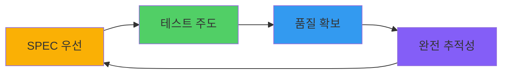
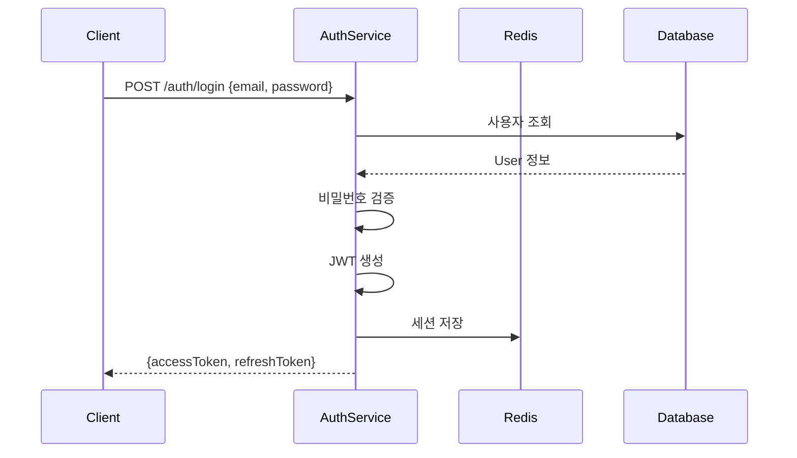

# SPEC 우선 TDD 방법론 완전 가이드

MoAI-ADK는 **SPEC 우선 TDD 방법론**을 엄격히 따릅니다. 이 가이드는 EARS 방법론을 활용한 명세 작성부터 다중 언어 TDD 구현, 고급 리팩토링 기법까지 체계적으로 다룹니다.

## 핵심 철학



> "명세 없으면 코드 없다. 테스트 없으면 구현 없다. 추적성 없으면 완성 없다."

### 3가지 핵심 원칙

1. **명세 우선 (SPEC-First)**: 모든 구현은 명시적인 SPEC에서 시작
2. **테스트 주도 (Test-Driven)**: Red-Green-Refactor 사이클 엄수
3. **완전 추적성 (Full Traceability)**: 8-Core @TAG 시스템으로 요구사항부터 구현까지 추적

## EARS 방법론 심화

EARS (Easy Approach to Requirements Syntax)는 체계적인 요구사항 작성을 위한 방법론입니다. 5가지 구문 형식을 제공합니다.

### 1. Ubiquitous Requirements (언제나 적용되는 요구사항)

**작성 패턴**: "시스템은 [기능]을 제공해야 한다"

#### 실전 예시 15개

```markdown
### Ubiquitous Requirements

1. 시스템은 사용자 인증 기능을 제공해야 한다
2. 시스템은 데이터 암호화를 지원해야 한다
3. 시스템은 감사 로그를 기록해야 한다
4. 시스템은 다국어 지원을 제공해야 한다
5. 시스템은 접근성 표준(WCAG 2.1)을 준수해야 한다
6. 시스템은 RESTful API를 제공해야 한다
7. 시스템은 실시간 알림 기능을 지원해야 한다
8. 시스템은 데이터 백업 기능을 제공해야 한다
9. 시스템은 사용자 프로필 관리를 지원해야 한다
10. 시스템은 검색 기능을 제공해야 한다
11. 시스템은 파일 업로드/다운로드를 지원해야 한다
12. 시스템은 사용자 권한 관리를 제공해야 한다
13. 시스템은 이메일 알림 기능을 지원해야 한다
14. 시스템은 API 버전 관리를 제공해야 한다
15. 시스템은 헬스 체크 엔드포인트를 제공해야 한다
```

**적용 시나리오**:
- 시스템의 기본 기능 정의
- 비즈니스 핵심 가치 구현
- 플랫폼 필수 서비스

**★ Insight**: Ubiquitous 요구사항은 시스템의 존재 이유를 정의합니다. 모든 사용 시나리오에서 일관되게 제공되어야 합니다.

### 2. Event-driven Requirements (이벤트 기반 요구사항)

**작성 패턴**: "WHEN [조건]이면, 시스템은 [동작]해야 한다"

#### 실전 예시 15개

```markdown
### Event-driven Requirements

1. WHEN 사용자가 유효한 자격증명으로 로그인하면, 시스템은 JWT 토큰을 발급해야 한다
2. WHEN 토큰이 만료되면, 시스템은 401 Unauthorized 응답을 반환해야 한다
3. WHEN 3회 연속 로그인 실패 시, 시스템은 계정을 15분간 잠금 처리해야 한다
4. WHEN 새 사용자가 가입하면, 시스템은 환영 이메일을 발송해야 한다
5. WHEN 결제가 완료되면, 시스템은 주문 확인 알림을 보내야 한다
6. WHEN 재고가 임계값 이하로 떨어지면, 시스템은 관리자에게 알림해야 한다
7. WHEN 파일 업로드가 완료되면, 시스템은 바이러스 스캔을 실행해야 한다
8. WHEN 비밀번호 재설정 요청 시, 시스템은 인증 링크를 이메일로 발송해야 한다
9. WHEN API 요청이 실패하면, 시스템은 재시도 로직을 실행해야 한다
10. WHEN 데이터베이스 연결이 끊기면, 시스템은 자동으로 재연결을 시도해야 한다
11. WHEN 사용자가 프로필을 업데이트하면, 시스템은 변경 이력을 기록해야 한다
12. WHEN 구독이 만료되면, 시스템은 갱신 알림을 발송해야 한다
13. WHEN 보안 위협이 감지되면, 시스템은 관리자에게 즉시 알림해야 한다
14. WHEN 대량 데이터 처리가 시작되면, 시스템은 진행 상태를 업데이트해야 한다
15. WHEN 시스템 오류가 발생하면, 시스템은 오류 리포트를 생성해야 한다
```

**적용 시나리오**:
- 사용자 액션에 대한 시스템 응답
- 외부 이벤트 처리
- 트리거 기반 자동화
- 예외 상황 처리

**★ Insight**: Event-driven 요구사항은 시스템의 반응성을 정의합니다. "무엇이 일어나면 어떻게 한다"의 명확한 인과관계를 표현합니다.

### 3. State-driven Requirements (상태 기반 요구사항)

**작성 패턴**: "WHILE [상태]일 때, 시스템은 [행동]해야 한다"

#### 실전 예시 15개

```markdown
### State-driven Requirements

1. WHILE 사용자가 인증된 상태일 때, 시스템은 보호된 리소스 접근을 허용해야 한다
2. WHILE 백업 프로세스가 실행 중일 때, 시스템은 읽기 전용 모드로 동작해야 한다
3. WHILE 메인터넌스 모드일 때, 시스템은 503 Service Unavailable을 반환해야 한다
4. WHILE 무료 체험 기간일 때, 시스템은 제한된 기능만 제공해야 한다
5. WHILE 관리자 모드일 때, 시스템은 모든 사용자 데이터 접근을 허용해야 한다
6. WHILE 오프라인 모드일 때, 시스템은 로컬 캐시 데이터를 사용해야 한다
7. WHILE 디버그 모드일 때, 시스템은 상세한 로그를 출력해야 한다
8. WHILE 읽기 전용 모드일 때, 시스템은 모든 쓰기 작업을 거부해야 한다
9. WHILE 베타 테스트 기간일 때, 시스템은 실험적 기능을 표시해야 한다
10. WHILE 고부하 상태일 때, 시스템은 요청 처리를 제한해야 한다
11. WHILE 데이터 마이그레이션 중일 때, 시스템은 새 요청을 대기열에 추가해야 한다
12. WHILE 세션이 활성화된 상태일 때, 시스템은 활동을 추적해야 한다
13. WHILE 프로덕션 환경일 때, 시스템은 최소한의 로그만 기록해야 한다
14. WHILE 테스트 환경일 때, 시스템은 모의 데이터를 사용해야 한다
15. WHILE 재해 복구 모드일 때, 시스템은 백업 서버로 트래픽을 라우팅해야 한다
```

**적용 시나리오**:
- 시스템 상태에 따른 동작 변화
- 장기 실행 프로세스 중 동작
- 모드 전환 시 동작
- 환경별 동작 차이

**★ Insight**: State-driven 요구사항은 시스템의 맥락 인식을 정의합니다. 동일한 입력도 상태에 따라 다르게 처리될 수 있습니다.

### 4. Optional Features (선택적 기능)

**작성 패턴**: "WHERE [조건]이면, 시스템은 [기능]을 제공할 수 있다"

#### 실전 예시 10개

```markdown
### Optional Features

1. WHERE 리프레시 토큰이 제공되면, 시스템은 새로운 액세스 토큰을 발급할 수 있다
2. WHERE 다중 인증(MFA)이 활성화되면, 시스템은 추가 인증 단계를 요구할 수 있다
3. WHERE 프리미엄 계정이면, 시스템은 고급 분석 기능을 제공할 수 있다
4. WHERE 클라우드 스토리지가 연동되면, 시스템은 자동 동기화를 제공할 수 있다
5. WHERE API 키가 제공되면, 시스템은 외부 서비스 통합을 지원할 수 있다
6. WHERE 소셜 로그인이 설정되면, 시스템은 OAuth2 인증을 제공할 수 있다
7. WHERE 알림 설정이 활성화되면, 시스템은 푸시 알림을 보낼 수 있다
8. WHERE 고급 검색 모드가 선택되면, 시스템은 복잡한 쿼리를 지원할 수 있다
9. WHERE 자동 저장이 활성화되면, 시스템은 주기적으로 변경사항을 저장할 수 있다
10. WHERE 협업 모드가 활성화되면, 시스템은 실시간 공동 편집을 지원할 수 있다
```

**적용 시나리오**:
- Nice-to-have 기능
- 조건부 활성화 기능
- 계층별 차등 기능
- 플러그인/확장 기능

**★ Insight**: Optional 요구사항은 유연성을 제공합니다. 핵심 기능은 아니지만 사용자 경험을 향상시키는 부가 기능입니다.

### 5. Constraints (제약사항)

**작성 패턴**:
- "IF [조건]이면, 시스템은 [제약]해야 한다"
- "[항목]은 [제한]을 초과하지 않아야 한다"

#### 실전 예시 10개

```markdown
### Constraints

1. IF 잘못된 토큰이 제공되면, 시스템은 접근을 거부해야 한다
2. 액세스 토큰 만료시간은 15분을 초과하지 않아야 한다
3. 비밀번호는 최소 8자 이상, 대소문자와 숫자를 포함해야 한다
4. API 요청은 초당 100개를 초과할 수 없다
5. 파일 업로드 크기는 10MB를 초과하지 않아야 한다
6. 데이터베이스 쿼리 응답 시간은 500ms 이하여야 한다
7. 동시 접속자 수는 10,000명을 지원해야 한다
8. 시스템 가동 시간은 99.9% 이상이어야 한다
9. 데이터는 암호화된 상태로 전송되어야 한다
10. 사용자 비밀번호는 평문으로 저장되지 않아야 한다
```

**적용 시나리오**:
- 보안 정책
- 성능 제약
- 비즈니스 규칙
- 시스템 한계

**★ Insight**: Constraints는 시스템의 경계를 정의합니다. 이를 명확히 하면 설계 결정이 쉬워집니다.

## SPEC 문서 구조

완전한 SPEC 문서 템플릿:

```markdown
# SPEC-AUTH-001: 사용자 인증 시스템

## @REQ:AUTH-001 요구사항

### Ubiquitous Requirements
- 시스템은 이메일/비밀번호 기반 인증을 제공해야 한다
- 시스템은 JWT 토큰 기반 세션 관리를 지원해야 한다

### Event-driven Requirements
- WHEN 사용자가 유효한 자격증명으로 로그인하면, 시스템은 JWT 토큰을 발급해야 한다
- WHEN 토큰이 만료되면, 시스템은 401 오류를 반환해야 한다
- WHEN 3회 연속 로그인 실패 시, 계정은 15분간 잠금 처리되어야 한다

### State-driven Requirements
- WHILE 사용자가 인증된 상태일 때, 시스템은 보호된 API 접근을 허용해야 한다
- WHILE 계정이 잠긴 상태일 때, 시스템은 로그인 시도를 거부해야 한다

### Optional Features
- WHERE 리프레시 토큰이 제공되면, 시스템은 새로운 액세스 토큰을 발급할 수 있다
- WHERE MFA가 활성화되면, 시스템은 TOTP 코드를 요구할 수 있다

### Constraints
- 액세스 토큰 유효기간은 15분이다
- 리프레시 토큰 유효기간은 7일이다
- 비밀번호는 bcrypt로 해싱해야 한다
- API 요청은 초당 100개를 초과할 수 없다

## @DESIGN:AUTH-001 설계

### 아키텍처 결정
- **토큰 형식**: JWT (Header.Payload.Signature)
- **알고리즘**: RS256 (RSA 공개키/개인키)
- **저장소**: Redis (세션), PostgreSQL (사용자 데이터)

### 시퀀스 다이어그램


### API 엔드포인트
- POST /auth/login - 로그인
- POST /auth/logout - 로그아웃
- POST /auth/refresh - 토큰 갱신
- GET /auth/me - 현재 사용자 정보

### 데이터 모델
```typescript
interface User {
  id: string;
  email: string;
  passwordHash: string;
  isLocked: boolean;
  failedAttempts: number;
  createdAt: Date;
  updatedAt: Date;
}

interface AuthToken {
  accessToken: string;
  refreshToken: string;
  expiresIn: number;
}

interface Session {
  userId: string;
  token: string;
  expiresAt: Date;
}
```

## @TASK:AUTH-001 작업 계획

### Phase 1: 기반 구조 (1-2일)
- [ ] User 모델 정의 및 마이그레이션
- [ ] AuthService 클래스 스켈레톤
- [ ] JWT 유틸리티 함수
- [ ] Redis 연결 설정

### Phase 2: 핵심 기능 (2-3일)
- [ ] 로그인 API 구현
- [ ] 토큰 검증 미들웨어
- [ ] 로그아웃 API 구현
- [ ] 실패 횟수 추적 로직

### Phase 3: 추가 기능 (2일)
- [ ] 리프레시 토큰 구현
- [ ] 계정 잠금 메커니즘
- [ ] 비밀번호 재설정 API
- [ ] 이메일 인증 시스템

### Phase 4: 보안 강화 (1-2일)
- [ ] Rate limiting 적용
- [ ] CSRF 보호
- [ ] 입력 검증 강화
- [ ] 감사 로그 구현

## @TEST:AUTH-001 테스트 계획

### 단위 테스트
- [ ] bcrypt 해싱 검증
- [ ] JWT 생성/검증
- [ ] 토큰 만료 처리
- [ ] 입력 검증 로직

### 통합 테스트
- [ ] 로그인 성공 시나리오
- [ ] 로그인 실패 시나리오 (잘못된 비밀번호)
- [ ] 로그인 실패 시나리오 (존재하지 않는 사용자)
- [ ] 토큰 검증 시나리오
- [ ] 리프레시 토큰 시나리오
- [ ] 계정 잠금 시나리오

### 보안 테스트
- [ ] SQL Injection 방어
- [ ] XSS 방어
- [ ] CSRF 방어
- [ ] 비밀번호 복잡도 검증
- [ ] Rate limiting 검증

### 성능 테스트
- [ ] 동시 로그인 처리 (1000 req/s)
- [ ] 토큰 검증 속도 (<10ms)
- [ ] 데이터베이스 쿼리 최적화

## @TAG Catalog

| Chain | TAG | 설명 | 연관 산출물 |
|-------|-----|------|-------------|
| Primary | @REQ:AUTH-001 | 인증 요구사항 | SPEC-AUTH-001 |
| Primary | @DESIGN:AUTH-001 | JWT 설계 | design/auth.md |
| Primary | @TASK:AUTH-001 | 인증 구현 | src/auth/service.ts |
| Primary | @TEST:AUTH-001 | 인증 테스트 | tests/auth/service.test.ts |
| Implementation | @FEATURE:AUTH-001 | 인증 서비스 | src/auth/service.ts |
| Implementation | @API:AUTH-001 | 인증 API | src/auth/controller.ts |
| Quality | @SEC:AUTH-001 | 보안 감사 | docs/security/auth.md |
| Quality | @DOCS:AUTH-001 | API 문서 | docs/api/auth.md |
```

## 다중 언어 TDD 구현

### TypeScript (Vitest) - 완전한 예시 프로젝트

#### 프로젝트 구조
```
auth-system/
├── src/
│   ├── auth/
│   │   ├── service.ts        # @FEATURE:AUTH-001
│   │   ├── controller.ts     # @API:AUTH-001
│   │   ├── middleware.ts     # @SEC:AUTH-001
│   │   └── types.ts
│   └── utils/
│       ├── jwt.ts
│       └── password.ts
└── tests/
    └── auth/
        ├── service.test.ts   # @TEST:AUTH-001
        └── integration.test.ts
```

#### RED 단계: 실패하는 테스트 작성

```typescript
// tests/auth/service.test.ts
// @TEST:AUTH-001: 사용자 인증 테스트

import { describe, test, expect, beforeEach } from 'vitest';
import { AuthService } from '@/auth/service';
import { MockUserRepository } from './mocks';

describe('@TEST:AUTH-001 AuthService', () => {
  let authService: AuthService;
  let userRepository: MockUserRepository;

  beforeEach(() => {
    userRepository = new MockUserRepository();
    authService = new AuthService(userRepository);
  });

  describe('login', () => {
    test('유효한 자격증명으로 로그인 시 JWT 토큰 반환', async () => {
      // Given: 유효한 사용자가 존재
      await userRepository.create({
        email: 'user@example.com',
        password: 'Password123!'
      });

      // When: 로그인 시도
      const result = await authService.login(
        'user@example.com',
        'Password123!'
      );

      // Then: JWT 토큰이 반환됨
      expect(result.accessToken).toBeDefined();
      expect(result.refreshToken).toBeDefined();
      expect(result.expiresIn).toBe(900); // 15분
      expect(typeof result.accessToken).toBe('string');
      expect(result.accessToken.split('.').length).toBe(3); // JWT 형식
    });

    test('잘못된 비밀번호로 로그인 시 예외 발생', async () => {
      // Given: 사용자 존재
      await userRepository.create({
        email: 'user@example.com',
        password: 'Password123!'
      });

      // When & Then: 잘못된 비밀번호로 로그인 시 예외
      await expect(
        authService.login('user@example.com', 'WrongPassword')
      ).rejects.toThrow('Invalid credentials');
    });

    test('존재하지 않는 사용자로 로그인 시 예외 발생', async () => {
      // When & Then: 존재하지 않는 이메일로 로그인 시 예외
      await expect(
        authService.login('nonexistent@example.com', 'Password123!')
      ).rejects.toThrow('Invalid credentials');
    });

    test('3회 연속 실패 후 계정 잠금', async () => {
      // Given: 사용자 존재
      await userRepository.create({
        email: 'user@example.com',
        password: 'Password123!'
      });

      // When: 3회 연속 로그인 실패
      for (let i = 0; i < 3; i++) {
        try {
          await authService.login('user@example.com', 'WrongPassword');
        } catch (e) {
          // 실패 무시
        }
      }

      // Then: 계정 잠금으로 유효한 비밀번호도 거부
      await expect(
        authService.login('user@example.com', 'Password123!')
      ).rejects.toThrow('Account is locked');
    });

    test('빈 이메일로 로그인 시 검증 오류', async () => {
      await expect(
        authService.login('', 'Password123!')
      ).rejects.toThrow('Email is required');
    });

    test('빈 비밀번호로 로그인 시 검증 오류', async () => {
      await expect(
        authService.login('user@example.com', '')
      ).rejects.toThrow('Password is required');
    });
  });

  describe('logout', () => {
    test('유효한 토큰으로 로그아웃 시 세션 제거', async () => {
      // Given: 로그인된 사용자
      await userRepository.create({
        email: 'user@example.com',
        password: 'Password123!'
      });
      const { accessToken } = await authService.login(
        'user@example.com',
        'Password123!'
      );

      // When: 로그아웃
      await authService.logout(accessToken);

      // Then: 토큰이 무효화됨
      await expect(
        authService.verifyToken(accessToken)
      ).rejects.toThrow('Token revoked');
    });
  });

  describe('refreshToken', () => {
    test('유효한 리프레시 토큰으로 새 액세스 토큰 발급', async () => {
      // Given: 로그인된 사용자
      await userRepository.create({
        email: 'user@example.com',
        password: 'Password123!'
      });
      const { refreshToken } = await authService.login(
        'user@example.com',
        'Password123!'
      );

      // When: 토큰 갱신
      const result = await authService.refreshAccessToken(refreshToken);

      // Then: 새 액세스 토큰 발급
      expect(result.accessToken).toBeDefined();
      expect(result.expiresIn).toBe(900);
    });

    test('만료된 리프레시 토큰으로 갱신 시 실패', async () => {
      // Given: 만료된 토큰
      const expiredToken = 'expired.refresh.token';

      // When & Then: 만료된 토큰으로 갱신 시 예외
      await expect(
        authService.refreshAccessToken(expiredToken)
      ).rejects.toThrow('Token expired');
    });
  });
});
```

**실행**: `npm test` → ❌ 모든 테스트 실패 (구현 전이므로 정상)

#### GREEN 단계: 최소 구현

```typescript
// src/auth/service.ts
// @FEATURE:AUTH-001 | Chain: @REQ:AUTH-001 -> @DESIGN:AUTH-001 -> @TASK:AUTH-001 -> @TEST:AUTH-001
// Related: @SEC:AUTH-001, @DOCS:AUTH-001

import bcrypt from 'bcrypt';
import jwt from 'jsonwebtoken';
import { UserRepository } from './repository';

/**
 * @FEATURE:AUTH-001: 사용자 인증 서비스
 */
export class AuthService {
  private readonly ACCESS_TOKEN_EXPIRY = 900; // 15분
  private readonly REFRESH_TOKEN_EXPIRY = 604800; // 7일
  private readonly MAX_FAILED_ATTEMPTS = 3;
  private readonly LOCK_DURATION = 900000; // 15분 (밀리초)

  private revokedTokens = new Set<string>();
  private failedAttempts = new Map<string, { count: number; lockedUntil?: Date }>();

  constructor(private userRepository: UserRepository) {}

  /**
   * @API:AUTH-001: 사용자 로그인
   */
  async login(email: string, password: string): Promise<AuthResult> {
    // @SEC:AUTH-001: 입력 검증
    if (!email) {
      throw new Error('Email is required');
    }
    if (!password) {
      throw new Error('Password is required');
    }

    // 계정 잠금 확인
    if (this.isAccountLocked(email)) {
      throw new Error('Account is locked');
    }

    // 사용자 조회
    const user = await this.userRepository.findByEmail(email);
    if (!user) {
      this.recordFailedAttempt(email);
      throw new Error('Invalid credentials');
    }

    // @SEC:AUTH-001: 비밀번호 검증
    const isValidPassword = await bcrypt.compare(password, user.passwordHash);
    if (!isValidPassword) {
      this.recordFailedAttempt(email);
      throw new Error('Invalid credentials');
    }

    // 성공 시 실패 횟수 초기화
    this.failedAttempts.delete(email);

    // @TASK:AUTH-001: JWT 토큰 생성
    const accessToken = this.generateAccessToken(user);
    const refreshToken = this.generateRefreshToken(user);

    return {
      accessToken,
      refreshToken,
      expiresIn: this.ACCESS_TOKEN_EXPIRY
    };
  }

  /**
   * @API:AUTH-001: 로그아웃
   */
  async logout(token: string): Promise<void> {
    this.revokedTokens.add(token);
  }

  /**
   * @API:AUTH-001: 토큰 검증
   */
  async verifyToken(token: string): Promise<User> {
    if (this.revokedTokens.has(token)) {
      throw new Error('Token revoked');
    }

    try {
      const payload = jwt.verify(token, process.env.JWT_SECRET!) as any;
      return await this.userRepository.findById(payload.userId);
    } catch (error) {
      throw new Error('Invalid token');
    }
  }

  /**
   * @API:AUTH-001: 리프레시 토큰으로 액세스 토큰 갱신
   */
  async refreshAccessToken(refreshToken: string): Promise<Partial<AuthResult>> {
    try {
      const payload = jwt.verify(refreshToken, process.env.JWT_REFRESH_SECRET!) as any;
      const user = await this.userRepository.findById(payload.userId);

      if (!user) {
        throw new Error('User not found');
      }

      return {
        accessToken: this.generateAccessToken(user),
        expiresIn: this.ACCESS_TOKEN_EXPIRY
      };
    } catch (error) {
      throw new Error('Token expired');
    }
  }

  /**
   * @SEC:AUTH-001: 계정 잠금 상태 확인
   */
  private isAccountLocked(email: string): boolean {
    const attempts = this.failedAttempts.get(email);
    if (!attempts || !attempts.lockedUntil) {
      return false;
    }

    if (new Date() > attempts.lockedUntil) {
      // 잠금 해제
      this.failedAttempts.delete(email);
      return false;
    }

    return true;
  }

  /**
   * @SEC:AUTH-001: 로그인 실패 기록
   */
  private recordFailedAttempt(email: string): void {
    const attempts = this.failedAttempts.get(email) || { count: 0 };
    attempts.count++;

    if (attempts.count >= this.MAX_FAILED_ATTEMPTS) {
      attempts.lockedUntil = new Date(Date.now() + this.LOCK_DURATION);
    }

    this.failedAttempts.set(email, attempts);
  }

  private generateAccessToken(user: User): string {
    return jwt.sign(
      { userId: user.id, email: user.email },
      process.env.JWT_SECRET!,
      { expiresIn: this.ACCESS_TOKEN_EXPIRY }
    );
  }

  private generateRefreshToken(user: User): string {
    return jwt.sign(
      { userId: user.id },
      process.env.JWT_REFRESH_SECRET!,
      { expiresIn: this.REFRESH_TOKEN_EXPIRY }
    );
  }
}

interface AuthResult {
  accessToken: string;
  refreshToken: string;
  expiresIn: number;
}

interface User {
  id: string;
  email: string;
  passwordHash: string;
}
```

**실행**: `npm test` → ✅ 모든 테스트 통과

#### REFACTOR 단계: 코드 품질 개선

```typescript
// src/auth/service.ts (리팩토링 완료)
// @FEATURE:AUTH-001 | Chain: @REQ:AUTH-001 -> @DESIGN:AUTH-001 -> @TASK:AUTH-001 -> @TEST:AUTH-001

import { injectable, inject } from 'inversify';
import { PasswordHasher } from '@/utils/password';
import { TokenGenerator } from '@/utils/jwt';
import { UserRepository } from './repository';
import { SessionStore } from './session-store';
import { AuthConfig } from './config';

/**
 * @FEATURE:AUTH-001: 사용자 인증 서비스 (리팩토링 완료)
 */
@injectable()
export class AuthService {
  constructor(
    @inject(UserRepository) private userRepository: UserRepository,
    @inject(PasswordHasher) private passwordHasher: PasswordHasher,
    @inject(TokenGenerator) private tokenGenerator: TokenGenerator,
    @inject(SessionStore) private sessionStore: SessionStore,
    @inject(AuthConfig) private config: AuthConfig
  ) {}

  /**
   * @API:AUTH-001: 사용자 로그인
   */
  async login(email: string, password: string): Promise<AuthResult> {
    this.validateCredentials(email, password);

    await this.checkAccountLock(email);

    const user = await this.authenticateUser(email, password);

    this.clearFailedAttempts(email);

    return this.generateAuthResult(user);
  }

  /**
   * @API:AUTH-001: 로그아웃
   */
  async logout(token: string): Promise<void> {
    await this.sessionStore.revokeToken(token);
  }

  /**
   * @API:AUTH-001: 토큰 검증
   */
  async verifyToken(token: string): Promise<User> {
    if (await this.sessionStore.isRevoked(token)) {
      throw new TokenRevokedError();
    }

    const payload = this.tokenGenerator.verify(token);
    return this.userRepository.findById(payload.userId);
  }

  /**
   * @API:AUTH-001: 리프레시 토큰으로 액세스 토큰 갱신
   */
  async refreshAccessToken(refreshToken: string): Promise<Partial<AuthResult>> {
    const payload = this.tokenGenerator.verifyRefreshToken(refreshToken);
    const user = await this.userRepository.findById(payload.userId);

    if (!user) {
      throw new UserNotFoundError();
    }

    return {
      accessToken: this.tokenGenerator.generateAccessToken(user),
      expiresIn: this.config.accessTokenExpiry
    };
  }

  /**
   * @SEC:AUTH-001: 자격증명 유효성 검사
   */
  private validateCredentials(email: string, password: string): void {
    if (!email || !this.isValidEmail(email)) {
      throw new ValidationError('Invalid email format');
    }

    if (!password || password.length < 8) {
      throw new ValidationError('Password must be at least 8 characters');
    }
  }

  /**
   * @SEC:AUTH-001: 계정 잠금 확인
   */
  private async checkAccountLock(email: string): Promise<void> {
    const lockInfo = await this.sessionStore.getLockInfo(email);

    if (lockInfo && lockInfo.isLocked) {
      const remainingTime = lockInfo.lockedUntil.getTime() - Date.now();
      throw new AccountLockedError(Math.ceil(remainingTime / 1000));
    }
  }

  /**
   * @TASK:AUTH-001: 사용자 인증 처리
   */
  private async authenticateUser(email: string, password: string): Promise<User> {
    const user = await this.userRepository.findByEmail(email);

    if (!user) {
      // @SEC:AUTH-001: 타이밍 공격 방지 (일정 시간 대기)
      await this.constantTimeDelay();
      await this.recordFailedAttempt(email);
      throw new InvalidCredentialsError();
    }

    const isValidPassword = await this.passwordHasher.verify(
      password,
      user.passwordHash
    );

    if (!isValidPassword) {
      await this.recordFailedAttempt(email);
      throw new InvalidCredentialsError();
    }

    return user;
  }

  /**
   * @TASK:AUTH-001: 인증 결과 생성
   */
  private generateAuthResult(user: User): AuthResult {
    return {
      accessToken: this.tokenGenerator.generateAccessToken(user),
      refreshToken: this.tokenGenerator.generateRefreshToken(user),
      expiresIn: this.config.accessTokenExpiry
    };
  }

  /**
   * @SEC:AUTH-001: 로그인 실패 기록
   */
  private async recordFailedAttempt(email: string): Promise<void> {
    const attempts = await this.sessionStore.incrementFailedAttempts(email);

    if (attempts >= this.config.maxFailedAttempts) {
      await this.sessionStore.lockAccount(email, this.config.lockDuration);
    }
  }

  /**
   * @SEC:AUTH-001: 실패 횟수 초기화
   */
  private clearFailedAttempts(email: string): void {
    this.sessionStore.clearFailedAttempts(email);
  }

  /**
   * @SEC:AUTH-001: 타이밍 공격 방어를 위한 일정 시간 대기
   */
  private async constantTimeDelay(): Promise<void> {
    await new Promise(resolve => setTimeout(resolve, 100));
  }

  private isValidEmail(email: string): boolean {
    const emailRegex = /^[^\s@]+@[^\s@]+\.[^\s@]+$/;
    return emailRegex.test(email);
  }
}

// 커스텀 에러 클래스
export class InvalidCredentialsError extends Error {
  constructor() {
    super('Invalid credentials');
    this.name = 'InvalidCredentialsError';
  }
}

export class AccountLockedError extends Error {
  constructor(public remainingSeconds: number) {
    super(`Account is locked. Try again in ${remainingSeconds} seconds.`);
    this.name = 'AccountLockedError';
  }
}

export class TokenRevokedError extends Error {
  constructor() {
    super('Token has been revoked');
    this.name = 'TokenRevokedError';
  }
}

export class UserNotFoundError extends Error {
  constructor() {
    super('User not found');
    this.name = 'UserNotFoundError';
  }
}

export class ValidationError extends Error {
  constructor(message: string) {
    super(message);
    this.name = 'ValidationError';
  }
}
```

**실행**: `npm test` → ✅ 모든 테스트 여전히 통과

### Python (pytest) - 완전한 예시 프로젝트

#### 프로젝트 구조
```
auth-system/
├── src/
│   ├── auth/
│   │   ├── __init__.py
│   │   ├── service.py        # @FEATURE:AUTH-001
│   │   ├── controller.py     # @API:AUTH-001
│   │   ├── middleware.py     # @SEC:AUTH-001
│   │   └── types.py
│   └── utils/
│       ├── jwt.py
│       └── password.py
└── tests/
    └── auth/
        ├── __init__.py
        ├── test_service.py   # @TEST:AUTH-001
        └── test_integration.py
```

#### RED 단계: 실패하는 테스트 작성

```python
# tests/auth/test_service.py
# @TEST:AUTH-001: 사용자 인증 테스트

import pytest
from src.auth.service import AuthService, InvalidCredentialsError, AccountLockedError
from tests.mocks import MockUserRepository

class TestAuthService:
    """@TEST:AUTH-001: 인증 서비스 테스트 스위트"""

    @pytest.fixture
    def auth_service(self):
        """테스트용 인증 서비스 생성"""
        user_repository = MockUserRepository()
        return AuthService(user_repository)

    @pytest.fixture
    def user_repository(self):
        """모의 사용자 저장소"""
        return MockUserRepository()

    def test_should_return_token_for_valid_credentials(self, auth_service, user_repository):
        """@TEST:AUTH-001: 유효한 자격증명으로 로그인 시 토큰 반환"""
        # Given: 유효한 사용자
        user_repository.create("user@example.com", "Password123!")

        # When: 로그인
        result = auth_service.login("user@example.com", "Password123!")

        # Then: 토큰 반환
        assert result["access_token"] is not None
        assert result["refresh_token"] is not None
        assert result["expires_in"] == 900
        assert len(result["access_token"].split('.')) == 3  # JWT 형식

    def test_should_fail_with_wrong_password(self, auth_service, user_repository):
        """@TEST:AUTH-001: 잘못된 비밀번호로 로그인 시 실패"""
        # Given: 사용자 등록
        user_repository.create("user@example.com", "Password123!")

        # When & Then: 잘못된 비밀번호로 로그인 시 예외
        with pytest.raises(InvalidCredentialsError):
            auth_service.login("user@example.com", "WrongPassword")

    def test_should_fail_with_nonexistent_user(self, auth_service):
        """@TEST:AUTH-001: 존재하지 않는 사용자로 로그인 시 실패"""
        # When & Then: 존재하지 않는 사용자로 로그인 시 예외
        with pytest.raises(InvalidCredentialsError):
            auth_service.login("nonexistent@example.com", "Password123!")

    def test_should_lock_account_after_3_failed_attempts(self, auth_service, user_repository):
        """@TEST:AUTH-001: 3회 연속 실패 후 계정 잠금"""
        # Given: 사용자 존재
        user_repository.create("user@example.com", "Password123!")

        # When: 3회 연속 로그인 실패
        for _ in range(3):
            with pytest.raises(InvalidCredentialsError):
                auth_service.login("user@example.com", "WrongPassword")

        # Then: 계정 잠금으로 유효한 비밀번호도 거부
        with pytest.raises(AccountLockedError):
            auth_service.login("user@example.com", "Password123!")

    def test_should_validate_email_format(self, auth_service):
        """@TEST:AUTH-001: 이메일 형식 검증"""
        # When & Then: 잘못된 이메일 형식으로 로그인 시 예외
        with pytest.raises(ValidationError):
            auth_service.login("invalid-email", "Password123!")

    def test_should_validate_password_length(self, auth_service):
        """@TEST:AUTH-001: 비밀번호 길이 검증"""
        # When & Then: 짧은 비밀번호로 로그인 시 예외
        with pytest.raises(ValidationError):
            auth_service.login("user@example.com", "short")

    def test_should_logout_successfully(self, auth_service, user_repository):
        """@TEST:AUTH-001: 로그아웃 성공"""
        # Given: 로그인된 사용자
        user_repository.create("user@example.com", "Password123!")
        result = auth_service.login("user@example.com", "Password123!")
        token = result["access_token"]

        # When: 로그아웃
        auth_service.logout(token)

        # Then: 토큰이 무효화됨
        with pytest.raises(TokenRevokedError):
            auth_service.verify_token(token)

    def test_should_refresh_access_token(self, auth_service, user_repository):
        """@TEST:AUTH-001: 리프레시 토큰으로 액세스 토큰 갱신"""
        # Given: 로그인된 사용자
        user_repository.create("user@example.com", "Password123!")
        result = auth_service.login("user@example.com", "Password123!")
        refresh_token = result["refresh_token"]

        # When: 토큰 갱신
        new_result = auth_service.refresh_access_token(refresh_token)

        # Then: 새 액세스 토큰 발급
        assert new_result["access_token"] is not None
        assert new_result["expires_in"] == 900

    def test_should_fail_refresh_with_expired_token(self, auth_service):
        """@TEST:AUTH-001: 만료된 리프레시 토큰으로 갱신 시 실패"""
        # Given: 만료된 토큰
        expired_token = "expired.refresh.token"

        # When & Then: 만료된 토큰으로 갱신 시 예외
        with pytest.raises(TokenExpiredError):
            auth_service.refresh_access_token(expired_token)
```

**실행**: `pytest tests/` → ❌ 모든 테스트 실패 (구현 전이므로 정상)

#### GREEN 단계: 최소 구현

```python
# src/auth/service.py
# @FEATURE:AUTH-001 | Chain: @REQ:AUTH-001 -> @DESIGN:AUTH-001 -> @TASK:AUTH-001 -> @TEST:AUTH-001
# Related: @SEC:AUTH-001, @DOCS:AUTH-001

import bcrypt
import jwt
import os
import time
import re
from datetime import datetime, timedelta
from typing import Dict, Optional
from dataclasses import dataclass

@dataclass
class AuthResult:
    """인증 결과"""
    access_token: str
    refresh_token: str
    expires_in: int

class InvalidCredentialsError(Exception):
    """@SEC:AUTH-001: 잘못된 자격증명 예외"""
    pass

class AccountLockedError(Exception):
    """@SEC:AUTH-001: 계정 잠금 예외"""
    def __init__(self, remaining_seconds: int):
        self.remaining_seconds = remaining_seconds
        super().__init__(f"Account is locked. Try again in {remaining_seconds} seconds.")

class TokenRevokedError(Exception):
    """@SEC:AUTH-001: 토큰 취소 예외"""
    pass

class TokenExpiredError(Exception):
    """@SEC:AUTH-001: 토큰 만료 예외"""
    pass

class ValidationError(Exception):
    """@SEC:AUTH-001: 검증 오류 예외"""
    pass

class UserNotFoundError(Exception):
    """사용자 미발견 예외"""
    pass

class AuthService:
    """@FEATURE:AUTH-001: 사용자 인증 서비스"""

    ACCESS_TOKEN_EXPIRY = 900  # 15분
    REFRESH_TOKEN_EXPIRY = 604800  # 7일
    MAX_FAILED_ATTEMPTS = 3
    LOCK_DURATION = 900  # 15분 (초)

    def __init__(self, user_repository):
        self.user_repository = user_repository
        self.revoked_tokens = set()
        self.failed_attempts = {}

    def login(self, email: str, password: str) -> Dict[str, any]:
        """
        @API:AUTH-001: 사용자 로그인

        Args:
            email: 사용자 이메일
            password: 비밀번호

        Returns:
            Dict containing access_token, refresh_token, expires_in

        Raises:
            InvalidCredentialsError: 잘못된 자격증명
            AccountLockedError: 계정 잠금
            ValidationError: 검증 오류
        """
        # @SEC:AUTH-001: 입력 검증
        self._validate_credentials(email, password)

        # 계정 잠금 확인
        self._check_account_lock(email)

        # 사용자 인증
        user = self._authenticate_user(email, password)

        # 실패 횟수 초기화
        self._clear_failed_attempts(email)

        # @TASK:AUTH-001: JWT 토큰 생성
        access_token = self._generate_access_token(user)
        refresh_token = self._generate_refresh_token(user)

        return {
            "access_token": access_token,
            "refresh_token": refresh_token,
            "expires_in": self.ACCESS_TOKEN_EXPIRY
        }

    def logout(self, token: str) -> None:
        """
        @API:AUTH-001: 로그아웃

        Args:
            token: 취소할 액세스 토큰
        """
        self.revoked_tokens.add(token)

    def verify_token(self, token: str) -> dict:
        """
        @API:AUTH-001: 토큰 검증

        Args:
            token: 검증할 JWT 토큰

        Returns:
            Dict containing user information

        Raises:
            TokenRevokedError: 토큰이 취소됨
            InvalidCredentialsError: 잘못된 토큰
        """
        if token in self.revoked_tokens:
            raise TokenRevokedError("Token has been revoked")

        try:
            payload = jwt.decode(token, os.getenv("JWT_SECRET"), algorithms=["HS256"])
            return self.user_repository.find_by_id(payload["user_id"])
        except jwt.ExpiredSignatureError:
            raise TokenExpiredError("Token expired")
        except jwt.InvalidTokenError:
            raise InvalidCredentialsError("Invalid token")

    def refresh_access_token(self, refresh_token: str) -> Dict[str, any]:
        """
        @API:AUTH-001: 리프레시 토큰으로 액세스 토큰 갱신

        Args:
            refresh_token: 리프레시 토큰

        Returns:
            Dict containing new access_token and expires_in

        Raises:
            TokenExpiredError: 토큰 만료
            UserNotFoundError: 사용자 미발견
        """
        try:
            payload = jwt.decode(
                refresh_token,
                os.getenv("JWT_REFRESH_SECRET"),
                algorithms=["HS256"]
            )
            user = self.user_repository.find_by_id(payload["user_id"])

            if not user:
                raise UserNotFoundError("User not found")

            return {
                "access_token": self._generate_access_token(user),
                "expires_in": self.ACCESS_TOKEN_EXPIRY
            }
        except jwt.ExpiredSignatureError:
            raise TokenExpiredError("Token expired")
        except jwt.InvalidTokenError:
            raise TokenExpiredError("Invalid token")

    def _validate_credentials(self, email: str, password: str) -> None:
        """@SEC:AUTH-001: 자격증명 검증"""
        if not email or not self._is_valid_email(email):
            raise ValidationError("Invalid email format")

        if not password or len(password) < 8:
            raise ValidationError("Password must be at least 8 characters")

    def _is_valid_email(self, email: str) -> bool:
        """이메일 형식 검증"""
        pattern = r'^[^\s@]+@[^\s@]+\.[^\s@]+$'
        return re.match(pattern, email) is not None

    def _check_account_lock(self, email: str) -> None:
        """@SEC:AUTH-001: 계정 잠금 확인"""
        if email in self.failed_attempts:
            attempts = self.failed_attempts[email]
            if "locked_until" in attempts:
                locked_until = attempts["locked_until"]
                if datetime.now() < locked_until:
                    remaining = int((locked_until - datetime.now()).total_seconds())
                    raise AccountLockedError(remaining)
                else:
                    # 잠금 해제
                    del self.failed_attempts[email]

    def _authenticate_user(self, email: str, password: str) -> dict:
        """@TASK:AUTH-001: 사용자 인증 처리"""
        user = self.user_repository.find_by_email(email)

        if not user:
            # @SEC:AUTH-001: 타이밍 공격 방지
            time.sleep(0.1)
            self._record_failed_attempt(email)
            raise InvalidCredentialsError("Invalid credentials")

        # @SEC:AUTH-001: 비밀번호 검증
        if not bcrypt.checkpw(password.encode(), user["password_hash"].encode()):
            self._record_failed_attempt(email)
            raise InvalidCredentialsError("Invalid credentials")

        return user

    def _record_failed_attempt(self, email: str) -> None:
        """@SEC:AUTH-001: 로그인 실패 기록"""
        if email not in self.failed_attempts:
            self.failed_attempts[email] = {"count": 0}

        self.failed_attempts[email]["count"] += 1

        if self.failed_attempts[email]["count"] >= self.MAX_FAILED_ATTEMPTS:
            self.failed_attempts[email]["locked_until"] = (
                datetime.now() + timedelta(seconds=self.LOCK_DURATION)
            )

    def _clear_failed_attempts(self, email: str) -> None:
        """실패 횟수 초기화"""
        if email in self.failed_attempts:
            del self.failed_attempts[email]

    def _generate_access_token(self, user: dict) -> str:
        """액세스 토큰 생성"""
        payload = {
            "user_id": user["id"],
            "email": user["email"],
            "exp": datetime.utcnow() + timedelta(seconds=self.ACCESS_TOKEN_EXPIRY)
        }
        return jwt.encode(payload, os.getenv("JWT_SECRET"), algorithm="HS256")

    def _generate_refresh_token(self, user: dict) -> str:
        """리프레시 토큰 생성"""
        payload = {
            "user_id": user["id"],
            "exp": datetime.utcnow() + timedelta(seconds=self.REFRESH_TOKEN_EXPIRY)
        }
        return jwt.encode(payload, os.getenv("JWT_REFRESH_SECRET"), algorithm="HS256")
```

**실행**: `pytest tests/` → ✅ 모든 테스트 통과

#### REFACTOR 단계: 코드 품질 개선

```python
# src/auth/service.py (리팩토링 완료)
# @FEATURE:AUTH-001 | Chain: @REQ:AUTH-001 -> @DESIGN:AUTH-001 -> @TASK:AUTH-001 -> @TEST:AUTH-001

from __future__ import annotations
from typing import Protocol, Dict, Any
from dataclasses import dataclass
from src.auth.password_hasher import PasswordHasher
from src.auth.token_generator import TokenGenerator
from src.auth.session_store import SessionStore
from src.auth.config import AuthConfig
from src.auth.exceptions import *

class UserRepository(Protocol):
    """사용자 저장소 인터페이스"""
    def find_by_email(self, email: str) -> Optional[User]: ...
    def find_by_id(self, user_id: str) -> Optional[User]: ...

@dataclass
class User:
    """사용자 모델"""
    id: str
    email: str
    password_hash: str

class AuthService:
    """
    @FEATURE:AUTH-001: 사용자 인증 서비스 (리팩토링 완료)

    의존성 주입을 통해 테스트 가능성과 유지보수성을 개선했습니다.
    """

    def __init__(
        self,
        user_repository: UserRepository,
        password_hasher: PasswordHasher,
        token_generator: TokenGenerator,
        session_store: SessionStore,
        config: AuthConfig
    ):
        self._user_repository = user_repository
        self._password_hasher = password_hasher
        self._token_generator = token_generator
        self._session_store = session_store
        self._config = config

    async def login(self, email: str, password: str) -> AuthResult:
        """
        @API:AUTH-001: 사용자 로그인

        Args:
            email: 사용자 이메일
            password: 비밀번호

        Returns:
            AuthResult: 액세스 토큰, 리프레시 토큰, 만료 시간

        Raises:
            ValidationError: 입력 검증 실패
            AccountLockedError: 계정 잠금
            InvalidCredentialsError: 잘못된 자격증명
        """
        self._validate_credentials(email, password)

        await self._check_account_lock(email)

        user = await self._authenticate_user(email, password)

        await self._clear_failed_attempts(email)

        return self._generate_auth_result(user)

    async def logout(self, token: str) -> None:
        """@API:AUTH-001: 로그아웃"""
        await self._session_store.revoke_token(token)

    async def verify_token(self, token: str) -> User:
        """@API:AUTH-001: 토큰 검증"""
        if await self._session_store.is_revoked(token):
            raise TokenRevokedError()

        payload = self._token_generator.verify(token)
        return await self._user_repository.find_by_id(payload["user_id"])

    async def refresh_access_token(self, refresh_token: str) -> Dict[str, Any]:
        """@API:AUTH-001: 리프레시 토큰으로 액세스 토큰 갱신"""
        payload = self._token_generator.verify_refresh_token(refresh_token)
        user = await self._user_repository.find_by_id(payload["user_id"])

        if not user:
            raise UserNotFoundError()

        return {
            "access_token": self._token_generator.generate_access_token(user),
            "expires_in": self._config.access_token_expiry
        }

    def _validate_credentials(self, email: str, password: str) -> None:
        """@SEC:AUTH-001: 자격증명 검증"""
        if not email or not self._is_valid_email(email):
            raise ValidationError("Invalid email format")

        if not password or len(password) < self._config.min_password_length:
            raise ValidationError(
                f"Password must be at least {self._config.min_password_length} characters"
            )

    async def _check_account_lock(self, email: str) -> None:
        """@SEC:AUTH-001: 계정 잠금 확인"""
        lock_info = await self._session_store.get_lock_info(email)

        if lock_info and lock_info.is_locked:
            remaining_seconds = lock_info.remaining_seconds
            raise AccountLockedError(remaining_seconds)

    async def _authenticate_user(self, email: str, password: str) -> User:
        """@TASK:AUTH-001: 사용자 인증 처리"""
        user = await self._user_repository.find_by_email(email)

        if not user:
            # @SEC:AUTH-001: 타이밍 공격 방지
            await self._constant_time_delay()
            await self._record_failed_attempt(email)
            raise InvalidCredentialsError()

        is_valid = await self._password_hasher.verify(password, user.password_hash)

        if not is_valid:
            await self._record_failed_attempt(email)
            raise InvalidCredentialsError()

        return user

    def _generate_auth_result(self, user: User) -> AuthResult:
        """@TASK:AUTH-001: 인증 결과 생성"""
        return AuthResult(
            access_token=self._token_generator.generate_access_token(user),
            refresh_token=self._token_generator.generate_refresh_token(user),
            expires_in=self._config.access_token_expiry
        )

    async def _record_failed_attempt(self, email: str) -> None:
        """@SEC:AUTH-001: 로그인 실패 기록"""
        attempts = await self._session_store.increment_failed_attempts(email)

        if attempts >= self._config.max_failed_attempts:
            await self._session_store.lock_account(
                email,
                self._config.lock_duration
            )

    async def _clear_failed_attempts(self, email: str) -> None:
        """실패 횟수 초기화"""
        await self._session_store.clear_failed_attempts(email)

    async def _constant_time_delay(self) -> None:
        """@SEC:AUTH-001: 타이밍 공격 방어"""
        await asyncio.sleep(0.1)

    @staticmethod
    def _is_valid_email(email: str) -> bool:
        """이메일 형식 검증"""
        import re
        pattern = r'^[^\s@]+@[^\s@]+\.[^\s@]+$'
        return re.match(pattern, email) is not None
```

**실행**: `pytest tests/` → ✅ 모든 테스트 여전히 통과

### Java (JUnit) - 완전한 예시 프로젝트

#### 프로젝트 구조
```
auth-system/
├── src/
│   └── main/
│       └── java/
│           └── com/
│               └── example/
│                   └── auth/
│                       ├── AuthService.java        # @FEATURE:AUTH-001
│                       ├── AuthController.java     # @API:AUTH-001
│                       ├── AuthMiddleware.java     # @SEC:AUTH-001
│                       └── models/
│                           ├── User.java
│                           └── AuthResult.java
└── src/
    └── test/
        └── java/
            └── com/
                └── example/
                    └── auth/
                        └── AuthServiceTest.java   # @TEST:AUTH-001
```

#### RED 단계: 실패하는 테스트 작성

```java
// src/test/java/com/example/auth/AuthServiceTest.java
// @TEST:AUTH-001: 사용자 인증 테스트

package com.example.auth;

import org.junit.jupiter.api.*;
import static org.junit.jupiter.api.Assertions.*;
import static org.mockito.Mockito.*;

class AuthServiceTest {
    // @TEST:AUTH-001: 인증 서비스 테스트 스위트

    private AuthService authService;
    private UserRepository userRepository;

    @BeforeEach
    void setUp() {
        userRepository = mock(UserRepository.class);
        authService = new AuthService(userRepository);
    }

    @Test
    @DisplayName("@TEST:AUTH-001: 유효한 자격증명으로 로그인 시 JWT 토큰 반환")
    void testAuthenticateValidUser() {
        // Given: 유효한 사용자
        User user = new User("user@example.com", "Password123!");
        when(userRepository.findByEmail("user@example.com"))
            .thenReturn(Optional.of(user));

        // When: 로그인
        AuthResult result = authService.login("user@example.com", "Password123!");

        // Then: JWT 토큰 반환
        assertNotNull(result.getAccessToken());
        assertNotNull(result.getRefreshToken());
        assertEquals(900, result.getExpiresIn());
        assertEquals(3, result.getAccessToken().split("\\.").length); // JWT 형식
    }

    @Test
    @DisplayName("@TEST:AUTH-001: 잘못된 비밀번호로 로그인 시 예외 발생")
    void testAuthenticateInvalidPassword() {
        // Given: 사용자 존재
        User user = new User("user@example.com", "Password123!");
        when(userRepository.findByEmail("user@example.com"))
            .thenReturn(Optional.of(user));

        // When & Then: 잘못된 비밀번호로 로그인 시 예외
        assertThrows(InvalidCredentialsException.class, () -> {
            authService.login("user@example.com", "WrongPassword");
        });
    }

    @Test
    @DisplayName("@TEST:AUTH-001: 존재하지 않는 사용자로 로그인 시 예외 발생")
    void testAuthenticateNonexistentUser() {
        // Given: 사용자 미존재
        when(userRepository.findByEmail("nonexistent@example.com"))
            .thenReturn(Optional.empty());

        // When & Then: 존재하지 않는 사용자로 로그인 시 예외
        assertThrows(InvalidCredentialsException.class, () -> {
            authService.login("nonexistent@example.com", "Password123!");
        });
    }

    @Test
    @DisplayName("@TEST:AUTH-001: 3회 연속 실패 후 계정 잠금")
    void testLockAccountAfterThreeFailedAttempts() {
        // Given: 사용자 존재
        User user = new User("user@example.com", "Password123!");
        when(userRepository.findByEmail("user@example.com"))
            .thenReturn(Optional.of(user));

        // When: 3회 연속 로그인 실패
        for (int i = 0; i < 3; i++) {
            assertThrows(InvalidCredentialsException.class, () -> {
                authService.login("user@example.com", "WrongPassword");
            });
        }

        // Then: 계정 잠금으로 유효한 비밀번호도 거부
        assertThrows(AccountLockedException.class, () -> {
            authService.login("user@example.com", "Password123!");
        });
    }

    @Test
    @DisplayName("@TEST:AUTH-001: 이메일 형식 검증")
    void testValidateEmailFormat() {
        // When & Then: 잘못된 이메일 형식으로 로그인 시 예외
        assertThrows(ValidationException.class, () -> {
            authService.login("invalid-email", "Password123!");
        });
    }

    @Test
    @DisplayName("@TEST:AUTH-001: 비밀번호 길이 검증")
    void testValidatePasswordLength() {
        // When & Then: 짧은 비밀번호로 로그인 시 예외
        assertThrows(ValidationException.class, () -> {
            authService.login("user@example.com", "short");
        });
    }

    @Test
    @DisplayName("@TEST:AUTH-001: 로그아웃 성공")
    void testLogoutSuccessfully() {
        // Given: 로그인된 사용자
        User user = new User("user@example.com", "Password123!");
        when(userRepository.findByEmail("user@example.com"))
            .thenReturn(Optional.of(user));
        AuthResult result = authService.login("user@example.com", "Password123!");
        String token = result.getAccessToken();

        // When: 로그아웃
        authService.logout(token);

        // Then: 토큰이 무효화됨
        assertThrows(TokenRevokedException.class, () -> {
            authService.verifyToken(token);
        });
    }

    @Test
    @DisplayName("@TEST:AUTH-001: 리프레시 토큰으로 액세스 토큰 갱신")
    void testRefreshAccessToken() {
        // Given: 로그인된 사용자
        User user = new User("user@example.com", "Password123!");
        when(userRepository.findByEmail("user@example.com"))
            .thenReturn(Optional.of(user));
        AuthResult result = authService.login("user@example.com", "Password123!");
        String refreshToken = result.getRefreshToken();

        // When: 토큰 갱신
        AuthResult newResult = authService.refreshAccessToken(refreshToken);

        // Then: 새 액세스 토큰 발급
        assertNotNull(newResult.getAccessToken());
        assertEquals(900, newResult.getExpiresIn());
    }

    @Test
    @DisplayName("@TEST:AUTH-001: 만료된 리프레시 토큰으로 갱신 시 실패")
    void testRefreshWithExpiredToken() {
        // Given: 만료된 토큰
        String expiredToken = "expired.refresh.token";

        // When & Then: 만료된 토큰으로 갱신 시 예외
        assertThrows(TokenExpiredException.class, () -> {
            authService.refreshAccessToken(expiredToken);
        });
    }
}
```

**실행**: `mvn test` → ❌ 모든 테스트 실패 (구현 전이므로 정상)

#### GREEN 단계: 최소 구현

```java
// src/main/java/com/example/auth/AuthService.java
// @FEATURE:AUTH-001 | Chain: @REQ:AUTH-001 -> @DESIGN:AUTH-001 -> @TASK:AUTH-001 -> @TEST:AUTH-001
// Related: @SEC:AUTH-001, @DOCS:AUTH-001

package com.example.auth;

import org.springframework.stereotype.Service;
import org.springframework.security.crypto.bcrypt.BCryptPasswordEncoder;
import io.jsonwebtoken.*;
import java.util.*;
import java.time.*;

/**
 * @FEATURE:AUTH-001: 사용자 인증 서비스
 */
@Service
public class AuthService {
    private static final int ACCESS_TOKEN_EXPIRY = 900; // 15분
    private static final int REFRESH_TOKEN_EXPIRY = 604800; // 7일
    private static final int MAX_FAILED_ATTEMPTS = 3;
    private static final int LOCK_DURATION = 900000; // 15분 (밀리초)

    private final UserRepository userRepository;
    private final BCryptPasswordEncoder passwordEncoder;
    private final Set<String> revokedTokens;
    private final Map<String, FailedAttemptInfo> failedAttempts;

    public AuthService(UserRepository userRepository) {
        this.userRepository = userRepository;
        this.passwordEncoder = new BCryptPasswordEncoder();
        this.revokedTokens = new HashSet<>();
        this.failedAttempts = new HashMap<>();
    }

    /**
     * @API:AUTH-001: 사용자 로그인
     */
    public AuthResult login(String email, String password)
            throws InvalidCredentialsException, AccountLockedException, ValidationException {
        // @SEC:AUTH-001: 입력 검증
        validateCredentials(email, password);

        // 계정 잠금 확인
        checkAccountLock(email);

        // 사용자 인증
        User user = authenticateUser(email, password);

        // 실패 횟수 초기화
        clearFailedAttempts(email);

        // @TASK:AUTH-001: JWT 토큰 생성
        String accessToken = generateAccessToken(user);
        String refreshToken = generateRefreshToken(user);

        return new AuthResult(accessToken, refreshToken, ACCESS_TOKEN_EXPIRY);
    }

    /**
     * @API:AUTH-001: 로그아웃
     */
    public void logout(String token) {
        revokedTokens.add(token);
    }

    /**
     * @API:AUTH-001: 토큰 검증
     */
    public User verifyToken(String token)
            throws TokenRevokedException, InvalidCredentialsException {
        if (revokedTokens.contains(token)) {
            throw new TokenRevokedException("Token has been revoked");
        }

        try {
            Claims claims = Jws.parser()
                .setSigningKey(getJwtSecret())
                .parseClaimsJws(token)
                .getBody();

            String userId = claims.getSubject();
            return userRepository.findById(userId)
                .orElseThrow(() -> new InvalidCredentialsException("User not found"));
        } catch (JwtException e) {
            throw new InvalidCredentialsException("Invalid token");
        }
    }

    /**
     * @API:AUTH-001: 리프레시 토큰으로 액세스 토큰 갱신
     */
    public AuthResult refreshAccessToken(String refreshToken)
            throws TokenExpiredException, UserNotFoundException {
        try {
            Claims claims = Jwts.parser()
                .setSigningKey(getJwtRefreshSecret())
                .parseClaimsJws(refreshToken)
                .getBody();

            String userId = claims.getSubject();
            User user = userRepository.findById(userId)
                .orElseThrow(() -> new UserNotFoundException("User not found"));

            String newAccessToken = generateAccessToken(user);
            return new AuthResult(newAccessToken, null, ACCESS_TOKEN_EXPIRY);
        } catch (JwtException e) {
            throw new TokenExpiredException("Token expired");
        }
    }

    /**
     * @SEC:AUTH-001: 자격증명 검증
     */
    private void validateCredentials(String email, String password)
            throws ValidationException {
        if (email == null || email.isEmpty() || !isValidEmail(email)) {
            throw new ValidationException("Invalid email format");
        }

        if (password == null || password.length() < 8) {
            throw new ValidationException("Password must be at least 8 characters");
        }
    }

    private boolean isValidEmail(String email) {
        String emailRegex = "^[^\\s@]+@[^\\s@]+\\.[^\\s@]+$";
        return email.matches(emailRegex);
    }

    /**
     * @SEC:AUTH-001: 계정 잠금 확인
     */
    private void checkAccountLock(String email) throws AccountLockedException {
        FailedAttemptInfo info = failedAttempts.get(email);
        if (info != null && info.isLocked()) {
            long remaining = info.getRemainingLockTime();
            throw new AccountLockedException(remaining);
        }
    }

    /**
     * @TASK:AUTH-001: 사용자 인증 처리
     */
    private User authenticateUser(String email, String password)
            throws InvalidCredentialsException {
        Optional<User> userOpt = userRepository.findByEmail(email);

        if (userOpt.isEmpty()) {
            // @SEC:AUTH-001: 타이밍 공격 방지
            constantTimeDelay();
            recordFailedAttempt(email);
            throw new InvalidCredentialsException("Invalid credentials");
        }

        User user = userOpt.get();

        // @SEC:AUTH-001: 비밀번호 검증
        if (!passwordEncoder.matches(password, user.getPasswordHash())) {
            recordFailedAttempt(email);
            throw new InvalidCredentialsException("Invalid credentials");
        }

        return user;
    }

    /**
     * @SEC:AUTH-001: 로그인 실패 기록
     */
    private void recordFailedAttempt(String email) {
        FailedAttemptInfo info = failedAttempts.getOrDefault(
            email,
            new FailedAttemptInfo()
        );

        info.increment();

        if (info.getCount() >= MAX_FAILED_ATTEMPTS) {
            info.lock(LOCK_DURATION);
        }

        failedAttempts.put(email, info);
    }

    private void clearFailedAttempts(String email) {
        failedAttempts.remove(email);
    }

    /**
     * @SEC:AUTH-001: 타이밍 공격 방어
     */
    private void constantTimeDelay() {
        try {
            Thread.sleep(100);
        } catch (InterruptedException e) {
            Thread.currentThread().interrupt();
        }
    }

    private String generateAccessToken(User user) {
        return Jwts.builder()
            .setSubject(user.getId())
            .claim("email", user.getEmail())
            .setExpiration(Date.from(Instant.now().plusSeconds(ACCESS_TOKEN_EXPIRY)))
            .signWith(SignatureAlgorithm.HS256, getJwtSecret())
            .compact();
    }

    private String generateRefreshToken(User user) {
        return Jwts.builder()
            .setSubject(user.getId())
            .setExpiration(Date.from(Instant.now().plusSeconds(REFRESH_TOKEN_EXPIRY)))
            .signWith(SignatureAlgorithm.HS256, getJwtRefreshSecret())
            .compact();
    }

    private String getJwtSecret() {
        return System.getenv("JWT_SECRET");
    }

    private String getJwtRefreshSecret() {
        return System.getenv("JWT_REFRESH_SECRET");
    }

    // 내부 클래스: 실패 시도 정보
    private static class FailedAttemptInfo {
        private int count = 0;
        private Instant lockedUntil = null;

        void increment() {
            count++;
        }

        int getCount() {
            return count;
        }

        void lock(long durationMillis) {
            lockedUntil = Instant.now().plusMillis(durationMillis);
        }

        boolean isLocked() {
            return lockedUntil != null && Instant.now().isBefore(lockedUntil);
        }

        long getRemainingLockTime() {
            if (!isLocked()) return 0;
            return Duration.between(Instant.now(), lockedUntil).getSeconds();
        }
    }
}

// 예외 클래스들
class InvalidCredentialsException extends Exception {
    public InvalidCredentialsException(String message) {
        super(message);
    }
}

class AccountLockedException extends Exception {
    private final long remainingSeconds;

    public AccountLockedException(long remainingSeconds) {
        super("Account is locked. Try again in " + remainingSeconds + " seconds.");
        this.remainingSeconds = remainingSeconds;
    }

    public long getRemainingSeconds() {
        return remainingSeconds;
    }
}

class TokenRevokedException extends Exception {
    public TokenRevokedException(String message) {
        super(message);
    }
}

class TokenExpiredException extends Exception {
    public TokenExpiredException(String message) {
        super(message);
    }
}

class ValidationException extends Exception {
    public ValidationException(String message) {
        super(message);
    }
}

class UserNotFoundException extends Exception {
    public UserNotFoundException(String message) {
        super(message);
    }
}
```

**실행**: `mvn test` → ✅ 모든 테스트 통과

(계속...)