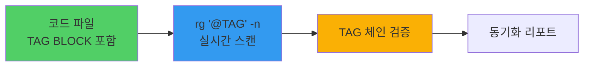
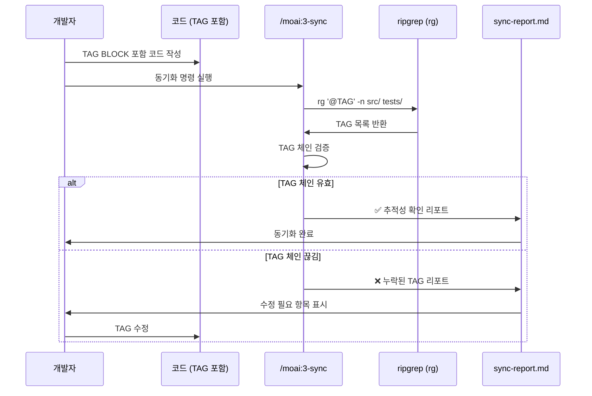
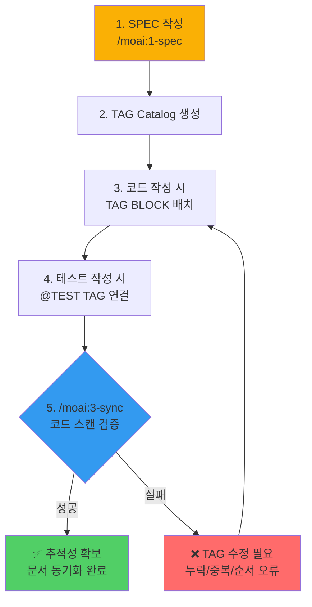

# @TAG 추적성 시스템 v4.0 (CODE-FIRST)

## 핵심 철학: CODE-FIRST 방식

**TAG의 진실은 코드 자체에만 존재합니다.**

- 별도의 TAG 인덱스 파일 없음 (`.moai/indexes/` 미사용)
- 코드 직접 스캔으로 실시간 검증: `rg '@TAG' -n src/ tests/ docs/`
- 중간 캐시 없음: 코드가 유일한 진실의 원천 (Single Source of Truth)



## 8-Core TAG 체계

MoAI-ADK v4.0부터 **8-Core TAG 체계**를 채택합니다.

### Primary Chain (4 Core) - 필수

```mermaid
graph LR
    REQ[@REQ<br/>요구사항] --> DESIGN[@DESIGN<br/>설계]
    DESIGN --> TASK[@TASK<br/>작업]
    TASK --> TEST[@TEST<br/>테스트]

    style REQ fill:#ff6b6b
    style DESIGN fill:#339af0
    style TASK fill:#fab005
    style TEST fill:#51cf66
```

모든 기능은 이 체인을 따라야 합니다:
- **@REQ:ID**: 요구사항 명세 (SPEC 문서)
- **@DESIGN:ID**: 설계 결정 (아키텍처, 시퀀스 다이어그램)
- **@TASK:ID**: 구현 작업 (실제 코드)
- **@TEST:ID**: 테스트 명세 (단위/통합 테스트)

### Implementation (4 Core) - 구현 세부 사항

- **@FEATURE:ID**: 기능 전체 구현 (클래스, 모듈)
- **@API:ID**: API 엔드포인트 (REST, GraphQL, gRPC)
- **@UI:ID**: 사용자 인터페이스 컴포넌트 (React, Vue, Angular)
- **@DATA:ID**: 데이터 모델 (엔티티, 스키마, 타입)

### 8-Core 구성 요약

| 카테고리 | Core | 설명 | 필수 여부 |
|----------|------|------|-----------|
| **Primary Chain** | 4 Core | 요구 → 설계 → 작업 → 검증 | 필수 |
| **Implementation** | 4 Core | Feature/API/UI/Data 구현 유형 | 필수 |

**변경 이력**:
- v3.0: 16-Core (Primary 4 + Implementation 4 + Quality 4 + Meta 4)
- v4.0: 8-Core (Primary 4 + Implementation 4) - 단순화 및 CODE-FIRST 집중

## TAG BLOCK 템플릿 (필수)

모든 코드 파일 상단에 TAG BLOCK을 배치합니다.

### 기본 템플릿

```text
# @FEATURE:<DOMAIN-ID> | Chain: @REQ:<ID> -> @DESIGN:<ID> -> @TASK:<ID> -> @TEST:<ID>
# Related: @API:<ID>, @UI:<ID>, @DATA:<ID>
```

### 언어별 주석 형식

#### TypeScript
```typescript
// @FEATURE:AUTH-001 | Chain: @REQ:AUTH-001 -> @DESIGN:AUTH-001 -> @TASK:AUTH-001 -> @TEST:AUTH-001
// Related: @API:AUTH-001, @DATA:AUTH-001

export class AuthenticationService {
  // @API:AUTH-001: 사용자 인증 API
  async authenticate(username: string, password: string): Promise<boolean> {
    // @DATA:AUTH-001: 사용자 데이터 조회
    const user = await this.userRepository.findByUsername(username);

    return this.verifyPassword(user, password);
  }
}
```

#### Python
```python
# @FEATURE:AUTH-001 | Chain: @REQ:AUTH-001 -> @DESIGN:AUTH-001 -> @TASK:AUTH-001 -> @TEST:AUTH-001
# Related: @API:AUTH-001, @DATA:AUTH-001

class AuthenticationService:
    """@FEATURE:AUTH-001: 사용자 인증 서비스"""

    def authenticate(self, username: str, password: str) -> bool:
        """@API:AUTH-001: 사용자 인증 API 엔드포인트"""
        # @DATA:AUTH-001: 사용자 데이터 조회
        user = self.user_repository.find_by_username(username)

        return self._verify_password(user, password)
```

#### Java
```java
// @FEATURE:AUTH-001 | Chain: @REQ:AUTH-001 -> @DESIGN:AUTH-001 -> @TASK:AUTH-001 -> @TEST:AUTH-001
// Related: @API:AUTH-001, @DATA:AUTH-001

public class AuthenticationService {
    // @API:AUTH-001: 사용자 인증 API
    public boolean authenticate(String username, String password) {
        // @DATA:AUTH-001: 사용자 데이터 조회
        User user = userRepository.findByUsername(username);

        return verifyPassword(user, password);
    }
}
```

#### Go
```go
// @FEATURE:AUTH-001 | Chain: @REQ:AUTH-001 -> @DESIGN:AUTH-001 -> @TASK:AUTH-001 -> @TEST:AUTH-001
// Related: @API:AUTH-001, @DATA:AUTH-001

package auth

// @FEATURE:AUTH-001: 사용자 인증 서비스
type AuthenticationService struct {
    userRepo UserRepository
}

// @API:AUTH-001: 사용자 인증 API
func (s *AuthenticationService) Authenticate(username, password string) (bool, error) {
    // @DATA:AUTH-001: 사용자 데이터 조회
    user, err := s.userRepo.FindByUsername(username)
    if err != nil {
        return false, err
    }

    return s.verifyPassword(user, password), nil
}
```

#### Rust
```rust
// @FEATURE:AUTH-001 | Chain: @REQ:AUTH-001 -> @DESIGN:AUTH-001 -> @TASK:AUTH-001 -> @TEST:AUTH-001
// Related: @API:AUTH-001, @DATA:AUTH-001

/// @FEATURE:AUTH-001: 사용자 인증 서비스
pub struct AuthenticationService {
    user_repo: Box<dyn UserRepository>,
}

impl AuthenticationService {
    /// @API:AUTH-001: 사용자 인증 API
    pub async fn authenticate(&self, username: &str, password: &str) -> Result<bool, Error> {
        // @DATA:AUTH-001: 사용자 데이터 조회
        let user = self.user_repo.find_by_username(username).await?;

        Ok(self.verify_password(&user, password))
    }
}
```

## TAG 명명 규칙

### 형식
```
@TYPE:DOMAIN-###
```

### 구성 요소
- **@TYPE**: TAG 타입 (REQ, DESIGN, TASK, TEST, FEATURE, API, UI, DATA)
- **DOMAIN**: 도메인 이름 (대문자, 3-10자)
- **###**: 일련번호 (001-999)

### 좋은 예시
```
@REQ:AUTH-001      // 인증 요구사항 #1
@DESIGN:AUTH-001   // 인증 설계 (같은 ID 사용)
@TASK:AUTH-001     // 인증 구현 (같은 ID 사용)
@TEST:AUTH-001     // 인증 테스트 (같은 ID 사용)
@API:LOGIN-003     // 로그인 API #3
@DATA:USER-005     // 사용자 데이터 모델 #5
```

### 나쁜 예시
```
@AUTH-001          // ❌ TYPE 누락
@REQ:auth-001      // ❌ 소문자 도메인
@REQ:A-001         // ❌ 도메인 너무 짧음
@REQ:AUTHENTICATION-SERVICE-001  // ❌ 도메인 너무 김
```

## SPEC TAG Catalog

SPEC 문서에서 TAG 카탈로그를 유지관리합니다.

```markdown
# SPEC-AUTH-001: 사용자 인증 시스템

## @TAG Catalog

| Chain | TAG | 설명 | 연관 산출물 |
|-------|-----|------|-------------|
| Primary | @REQ:AUTH-001 | 인증 요구사항 | SPEC-AUTH-001 |
| Primary | @DESIGN:AUTH-001 | JWT 설계 | design/auth.md |
| Primary | @TASK:AUTH-001 | 인증 구현 | src/auth/service.ts |
| Primary | @TEST:AUTH-001 | 인증 테스트 | tests/auth/service.test.ts |
| Implementation | @FEATURE:AUTH-001 | 인증 서비스 | src/auth/service.ts |
| Implementation | @API:AUTH-001 | 인증 API | src/auth/controller.ts |
| Implementation | @DATA:AUTH-001 | 사용자 모델 | src/auth/models.ts |
```

## 코드 스캔 기반 검증

### 검색 명령어

```bash
# 모든 TAG 찾기
rg "@REQ:|@DESIGN:|@TASK:|@TEST:|@FEATURE:|@API:|@UI:|@DATA:" -n

# 특정 도메인의 모든 TAG 찾기
rg "AUTH-001" -n

# 특정 TAG 타입만 찾기
rg "@API:" -g "*.ts" -n
rg "@TEST:" -g "*.py" -n

# 파일별 TAG 개수 확인
rg "@TAG" -c
```

### 중복 방지

새 TAG 도입 전 기존 체인 확인:

```bash
# 1. 도메인 중복 확인
rg "LOGIN-001" -n

# 2. TAG 타입별 확인
rg "@REQ:LOGIN-" -n

# 3. 파일 경로와 함께 확인
rg "@FEATURE:LOGIN-" -l
```

### 무결성 검사

`/moai:3-sync` 실행 시 자동으로 수행:

1. **코드 전체 스캔**: 모든 소스 파일에서 TAG 추출
2. **TAG 체인 검증**: Primary Chain 완결성 확인
3. **고아 TAG 식별**: SPEC 없는 TAG 탐지
4. **중복 TAG 탐지**: 동일 TAG의 중복 선언 확인

## 다중 언어 프로젝트 예시

### 통합 인증 시스템 (TypeScript + Python)

#### TypeScript (API 서버)

```typescript
// backend-api/src/auth/integrated-auth.ts
// @FEATURE:AUTH-003 | Chain: @REQ:AUTH-003 -> @DESIGN:AUTH-003 -> @TASK:AUTH-003 -> @TEST:AUTH-003
// Related: @API:AUTH-003

export class IntegratedAuthService {
  /**
   * @API:AUTH-003: JWT 토큰 생성 (Python 워커와 호환)
   */
  async generateToken(user: User): Promise<string> {
    const token = jwt.sign(
      { userId: user.id, email: user.email },
      process.env.JWT_SECRET!,
      { algorithm: 'HS256', expiresIn: '15m' }
    );

    // @TASK:AUTH-003: Redis에 토큰 저장 (Python 워커가 사용)
    await this.redis.set(`token:${user.id}`, token, 'EX', 900);

    return token;
  }
}
```

#### Python (백그라운드 워커)

```python
# background-worker/src/integrated_auth.py
# @FEATURE:AUTH-003 | Chain: @REQ:AUTH-003 -> @DESIGN:AUTH-003 -> @TASK:AUTH-003 -> @TEST:AUTH-003
# Related: @API:AUTH-003

import jwt
import redis
import os

class IntegratedAuthService:
    """@FEATURE:AUTH-003: 통합 인증 서비스 (Python)"""

    def __init__(self):
        self.redis_client = redis.Redis(host='localhost', port=6379, db=0)
        self.jwt_secret = os.getenv("JWT_SECRET")

    def verify_token(self, token: str) -> dict:
        """
        @API:AUTH-003: JWT 토큰 검증 (TypeScript와 호환)
        """
        try:
            payload = jwt.decode(
                token,
                self.jwt_secret,
                algorithms=["HS256"]
            )

            return {
                "valid": True,
                "user_id": payload["userId"],
                "email": payload["email"]
            }
        except jwt.ExpiredSignatureError:
            return {"valid": False, "error": "Token expired"}
        except jwt.InvalidTokenError:
            return {"valid": False, "error": "Invalid token"}
```

#### 통합 검증

```bash
# 다중 언어 프로젝트 전체 스캔
rg "AUTH-003" -n

# 출력 예시:
# backend-api/src/auth/integrated-auth.ts:1:// @FEATURE:AUTH-003 | Chain: ...
# backend-api/tests/auth/integrated-auth.test.ts:5:describe('@TEST:AUTH-003', () => {
# background-worker/src/integrated_auth.py:1:# @FEATURE:AUTH-003 | Chain: ...
# background-worker/tests/test_integrated_auth.py:5:def test_verify_token():  # @TEST:AUTH-003
```

## TAG 체인 검증 플로우



## 폐기 TAG 관리

더 이상 사용하지 않는 TAG는 코드에서 제거하거나 DEPRECATED 표시:

### 옵션 1: 완전 제거 (권장)
```typescript
// TAG BLOCK 전체 제거
// class OldAuthService {  // 코드도 제거
```

### 옵션 2: DEPRECATED 표시
```typescript
// @DEPRECATED:OLD-AUTH-001: AUTH-002로 대체됨
// 마이그레이션 가이드: docs/migration/auth-v2.md
class LegacyAuthService {
  // 코드 유지 (하위 호환성)
}
```

SPEC Catalog에서도 상태 업데이트:

```markdown
| Primary | @REQ:OLD-AUTH-001 | (DEPRECATED) 구 인증 | AUTH-002로 대체 |
```

## 금지 패턴

### 잘못된 TAG 순서
```python
@TASK:LOGIN-001 -> @DESIGN:LOGIN-001  # ❌ 순서 위반 (설계 없이 작업)
```

**올바른 순서**:
```python
@REQ:LOGIN-001 -> @DESIGN:LOGIN-001 -> @TASK:LOGIN-001 -> @TEST:LOGIN-001
```

### TAG 중복 선언
```typescript
// @FEATURE:LOGIN-001
class LoginService {
  // @FEATURE:LOGIN-001  // ❌ 같은 파일 내 중복
  login() {}
}
```

**올바른 방식**:
```typescript
// @FEATURE:LOGIN-001 | Chain: @REQ:LOGIN-001 -> @DESIGN:LOGIN-001 -> @TASK:LOGIN-001 -> @TEST:LOGIN-001
class LoginService {
  // @API:LOGIN-001
  login() {}
}
```

### 의미 없는 ID
```typescript
@REQ:ABC-123  // ❌ 도메인명 의미 불명확
@REQ:TEST-001 // ❌ "TEST"는 TAG 타입명과 혼동
```

**올바른 방식**:
```typescript
@REQ:AUTH-001    // ✅ 명확한 도메인명
@REQ:USER-001    // ✅ 비즈니스 도메인 반영
```

## 업데이트 체크리스트

### 코드 작성 시
- [ ] 파일 상단에 TAG BLOCK이 존재하는가?
- [ ] Primary Chain 4종이 모두 포함되었는가?
- [ ] Implementation TAG (FEATURE/API/UI/DATA)가 적절히 배치되었는가?
- [ ] TAG ID가 SPEC Catalog와 일치하는가?

### 동기화 전
- [ ] 중복 TAG가 없는지 `rg "<DOMAIN-ID>"` 확인
- [ ] 모든 TAG가 코드 스캔으로 찾아지는가?
- [ ] SPEC Catalog가 최신 상태인가?

### 동기화 후
- [ ] sync-report.md에서 TAG 체인 검증 통과 확인
- [ ] 고아 TAG가 없는지 확인
- [ ] 끊어진 링크가 해결되었는가?

## 실전 워크플로우



### 단계별 상세 설명

#### 1. SPEC 작성 (`/moai:1-spec`)
```bash
/moai:1-spec "사용자 인증 시스템"
```
- EARS 방법론으로 요구사항 작성
- Primary Chain 정의 (@REQ, @DESIGN, @TASK, @TEST)

#### 2. TAG Catalog 생성
```markdown
### @TAG Catalog
| Chain | TAG | 설명 | 연관 산출물 |
|-------|-----|------|-------------|
| Primary | @REQ:AUTH-001 | 인증 요구사항 | SPEC-AUTH-001 |
| Primary | @DESIGN:AUTH-001 | JWT 설계 | design/auth.md |
| Primary | @TASK:AUTH-001 | 인증 구현 | src/auth/service.ts |
| Primary | @TEST:AUTH-001 | 인증 테스트 | tests/auth/service.test.ts |
```

#### 3. 코드 작성 시 TAG BLOCK 배치
```typescript
// @FEATURE:AUTH-001 | Chain: @REQ:AUTH-001 -> @DESIGN:AUTH-001 -> @TASK:AUTH-001 -> @TEST:AUTH-001
// Related: @API:AUTH-001

class AuthService {
  // @API:AUTH-001
  login() {}
}
```

#### 4. 테스트 작성 시 @TEST TAG 연결
```typescript
describe('@TEST:AUTH-001 사용자 인증', () => {
  test('유효한 자격증명으로 로그인 시 토큰 반환', () => {
    // 테스트 구현
  });
});
```

#### 5. /moai:3-sync 실행
```bash
/moai:3-sync
```
- 코드 전체 스캔: `rg '@TAG' -n`
- TAG 체인 검증: Primary Chain 완결성 확인
- sync-report.md 생성

## CODE-FIRST 원칙 요약

1. **코드가 진실의 유일한 원천**: 별도 인덱스 파일 미사용
2. **실시간 스캔 검증**: `rg` 명령어로 코드 직접 스캔
3. **중간 캐시 없음**: 항상 코드에서 직접 TAG 추출
4. **8-Core 단순화**: Primary 4 + Implementation 4 (Quality, Meta 제거)
5. **TAG BLOCK 필수**: 모든 코드 파일 상단에 배치

## 다음 단계

- [3단계 워크플로우](/guide/workflow) - 전체 개발 프로세스 이해
- [SPEC 우선 TDD](/guide/spec-first-tdd) - TDD 사이클과 TAG 통합
- [CLI 명령어](/cli/init) - `moai` 명령어로 TAG 관리 자동화