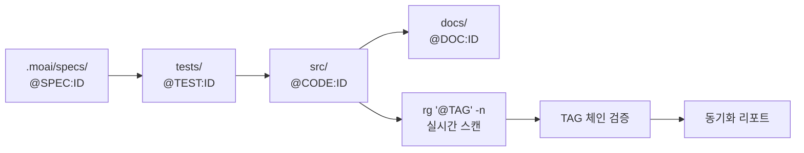
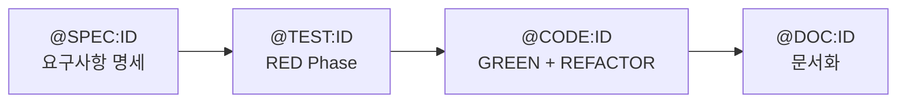
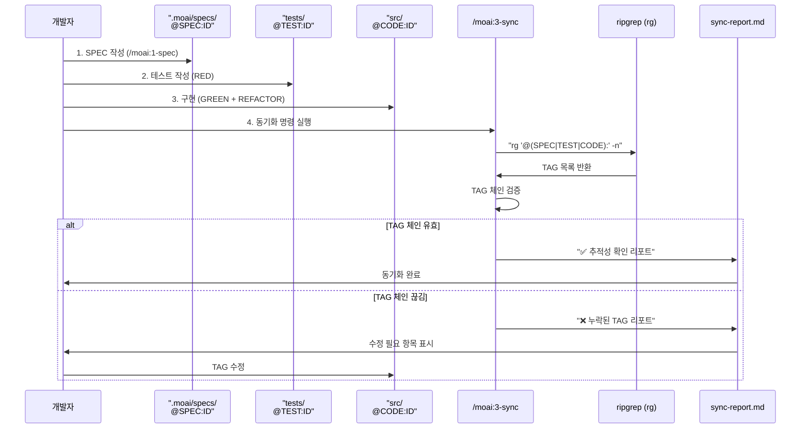
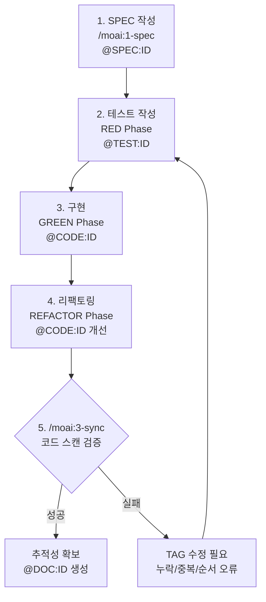

# @TAG 추적성 시스템 (필수 TAG)

## 핵심 철학: CODE-FIRST 방식

**TAG의 진실은 코드 자체에만 존재합니다.**

- 별도의 TAG 인덱스 파일 없음 (`.moai/indexes/` 미사용)
- 코드 직접 스캔으로 실시간 검증: `rg '@(SPEC|TEST|CODE|DOC):' -n`
- 중간 캐시 없음: 코드가 유일한 진실의 원천 (Single Source of Truth)



## @TAG 체계

MoAI-ADK는 단일 TAG 체계를 사용합니다.

### TDD 사이클 완벽 정렬



### 필수 TAG

| TAG | 역할 | TDD 단계 | 위치 | 필수 |
|-----|------|----------|------|------|
| `@SPEC:ID` | 요구사항 명세 (EARS) | 사전 준비 | .moai/specs/ | 필수 |
| `@TEST:ID` | 테스트 케이스 | RED | tests/ | 필수 |
| `@CODE:ID` | 구현 코드 | GREEN + REFACTOR | src/ | 필수 |
| `@DOC:ID` | 문서화 | REFACTOR | docs/ | 선택 |

> 모든 신규 기능은 위 4개 TAG를 기준으로 작성합니다. 체인 검증(`rg '@(SPEC|TEST|CODE|DOC):' -n`, `/moai:3-sync`)도 이 체계를 기반으로 동작합니다.

## TAG BLOCK 템플릿

### SPEC 문서 HISTORY 섹션 (필수)

**모든 SPEC 문서는 HISTORY 섹션을 포함해야 합니다.** TAG의 진화 과정을 추적하여 요구사항 변경 이력을 명확히 기록합니다.

**HISTORY 섹션 역할**:
- SPEC 버전 관리: YAML front matter의 version과 동기화
- 변경 이력 추적: 요구사항 수정, 추가, 삭제 기록
- 작성자/리뷰어 명시: 책임 소재 명확화
- 변경 이유 문서화: 컨텍스트 보존

**HISTORY 태그**:
- `INITIAL`: 최초 작성 (v1.0.0)
- `ADDED`: 새 기능/요구사항 추가 → Minor 버전 증가
- `CHANGED`: 기존 내용 수정 → Patch 버전 증가
- `FIXED`: 버그/오류 수정 → Patch 버전 증가
- `REMOVED`: 기능/요구사항 제거 → Major 버전 증가
- `BREAKING`: 하위 호환성 깨지는 변경 → Major 버전 증가
- `DEPRECATED`: 향후 제거 예정 표시

**버전 관리 원칙**:
- **TAG ID는 영구 불변**: AUTH-001은 절대 변경되지 않음
- **TAG 내용은 자유롭게 수정**: HISTORY에 기록 필수
- **Semantic Versioning**: Major.Minor.Patch
- **코드/테스트에서는 버전 미포함**: `SPEC: SPEC-AUTH-001.md` (버전 없음)

### 기본 템플릿

**소스 코드 (src/)**:
```typescript
// @CODE:AUTH-001 | SPEC: SPEC-AUTH-001.md | TEST: tests/auth/service.test.ts
```

**테스트 코드 (tests/)**:
```typescript
// @TEST:AUTH-001 | SPEC: SPEC-AUTH-001.md
```

**SPEC 문서 (.moai/specs/)**:
```markdown
---
id: AUTH-001
version: 1.0.0
status: active
created: 2025-10-01
updated: 2025-10-01
---

# @SPEC:AUTH-001: JWT 인증 시스템

## HISTORY

### v1.0.0 (2025-10-01)
- **INITIAL**: JWT 인증 시스템 명세 작성
- **AUTHOR**: @dev-team
```

**문서 (docs/)**:
```markdown
# @DOC:AUTH-001: JWT 인증 시스템 가이드
```

### @CODE 서브 카테고리 (주석 레벨)

구현 세부사항은 `@CODE:ID` 내부에 주석으로 표기:

```typescript
// @CODE:AUTH-001 | SPEC: SPEC-AUTH-001.md | TEST: tests/auth/service.test.ts

export class AuthService {
  // @CODE:AUTH-001:API: 인증 API 엔드포인트
  async authenticate(username: string, password: string): Promise<AuthResult> {
    // @CODE:AUTH-001:DOMAIN: 입력 검증
    this.validateInput(username, password);

    // @CODE:AUTH-001:DATA: 사용자 조회
    const user = await this.userRepository.findByUsername(username);

    // @CODE:AUTH-001:INFRA: JWT 토큰 생성
    return this.generateToken(user);
  }
}
```

**서브 카테고리 목록**:
- `@CODE:ID:API` - REST API, GraphQL 엔드포인트
- `@CODE:ID:UI` - 컴포넌트, 뷰, 화면
- `@CODE:ID:DATA` - 데이터 모델, 스키마, 타입
- `@CODE:ID:DOMAIN` - 비즈니스 로직, 도메인 규칙
- `@CODE:ID:INFRA` - 인프라, 데이터베이스, 외부 연동

## 언어별 적용 예시

### TypeScript

```typescript
// @CODE:AUTH-001 | SPEC: SPEC-AUTH-001.md | TEST: tests/auth/service.test.ts

/**
 * @CODE:AUTH-001: JWT 인증 서비스
 *
 * TDD 이력:
 * - RED: tests/auth/service.test.ts 작성
 * - GREEN: 최소 구현 (bcrypt, JWT)
 * - REFACTOR: 타입 안전성 추가, 에러 처리 개선
 */
export class AuthService {
  // @CODE:AUTH-001:API: 사용자 인증 API
  async authenticate(username: string, password: string): Promise<AuthResult> {
    // @CODE:AUTH-001:DOMAIN: 입력 검증
    this.validateInput(username, password);

    // @CODE:AUTH-001:DATA: 사용자 조회
    const user = await this.userRepository.findByUsername(username);

    return this.verifyCredentials(user, password);
  }
}
```

**테스트 코드**:
```typescript
// @TEST:AUTH-001 | SPEC: SPEC-AUTH-001.md

describe('AuthService', () => {
  test('@TEST:AUTH-001: should authenticate valid user', async () => {
    const service = new AuthService();
    const result = await service.authenticate('user', 'password');
    expect(result.success).toBe(true);
  });
});
```

### Python

```python
# @CODE:AUTH-001 | SPEC: SPEC-AUTH-001.md | TEST: tests/auth/test_service.py

class AuthenticationService:
    """
    @CODE:AUTH-001: JWT 인증 서비스

    TDD 이력:
    - RED: tests/auth/test_service.py 작성
    - GREEN: 최소 구현 (hashlib, JWT)
    - REFACTOR: 타입 힌트 추가, 예외 처리 개선
    """

    def authenticate(self, username: str, password: str) -> bool:
        """@CODE:AUTH-001:API: 사용자 인증 API"""
        # @CODE:AUTH-001:DOMAIN: 입력 검증
        if not self._validate_input(username, password):
            return False

        # @CODE:AUTH-001:DATA: 사용자 조회
        user_data = self._get_user_data(username)

        return self._verify_credentials(user_data, password)
```

**테스트 코드**:
```python
# @TEST:AUTH-001 | SPEC: SPEC-AUTH-001.md

def test_should_authenticate_valid_user():
    """@TEST:AUTH-001: 유효한 사용자 인증 검증"""
    service = AuthenticationService()
    result = service.authenticate("user", "password")
    assert result is True
```

### Java

```java
// @CODE:AUTH-001 | SPEC: SPEC-AUTH-001.md | TEST: tests/auth/AuthServiceTest.java

/**
 * @CODE:AUTH-001: JWT 인증 서비스
 *
 * TDD 이력:
 * - RED: AuthServiceTest.java 작성
 * - GREEN: 최소 구현 (Spring Security, JWT)
 * - REFACTOR: 의존성 주입, 예외 처리 개선
 */
public class AuthenticationService {
    // @CODE:AUTH-001:API: 사용자 인증 API
    public boolean authenticate(String username, String password) {
        // @CODE:AUTH-001:DOMAIN: 입력 검증
        validateInput(username, password);

        // @CODE:AUTH-001:DATA: 사용자 조회
        User user = userRepository.findByUsername(username);

        return verifyPassword(user, password);
    }
}
```

### Go

```go
// @CODE:AUTH-001 | SPEC: SPEC-AUTH-001.md | TEST: tests/auth/service_test.go

package auth

// @CODE:AUTH-001: JWT 인증 서비스
//
// TDD 이력:
// - RED: service_test.go 작성
// - GREEN: 최소 구현 (golang.org/x/crypto, JWT)
// - REFACTOR: 인터페이스 추가, 에러 처리 개선
type AuthenticationService struct {
    userRepo UserRepository
}

// @CODE:AUTH-001:API: 사용자 인증 API
func (s *AuthenticationService) Authenticate(username, password string) (bool, error) {
    // @CODE:AUTH-001:DOMAIN: 입력 검증
    if err := s.validateInput(username, password); err != nil {
        return false, err
    }

    // @CODE:AUTH-001:DATA: 사용자 조회
    user, err := s.userRepo.FindByUsername(username)
    if err != nil {
        return false, err
    }

    return s.verifyPassword(user, password), nil
}
```

### Rust

```rust
// @CODE:AUTH-001 | SPEC: SPEC-AUTH-001.md | TEST: tests/auth/service_test.rs

/// @CODE:AUTH-001: JWT 인증 서비스
///
/// TDD 이력:
/// - RED: service_test.rs 작성
/// - GREEN: 최소 구현 (bcrypt, jsonwebtoken)
/// - REFACTOR: Result 타입 추가, 에러 처리 개선
pub struct AuthenticationService {
    user_repo: Box<dyn UserRepository>,
}

impl AuthenticationService {
    /// @CODE:AUTH-001:API: 사용자 인증 API
    pub async fn authenticate(&self, username: &str, password: &str) -> Result<bool, Error> {
        // @CODE:AUTH-001:DOMAIN: 입력 검증
        self.validate_input(username, password)?;

        // @CODE:AUTH-001:DATA: 사용자 조회
        let user = self.user_repo.find_by_username(username).await?;

        Ok(self.verify_password(&user, password))
    }
}
```

## TAG 명명 규칙

### 형식
```
TYPE:DOMAIN-###
```

### 구성 요소
- **TYPE**: TAG 타입 (SPEC, TEST, CODE, DOC)
- **DOMAIN**: 도메인 이름 (대문자, 3-10자)
- **###**: 일련번호 (001-999)

### 좋은 예시
```
@SPEC:AUTH-001     // 인증 요구사항 명세
@TEST:AUTH-001     // 인증 테스트 (같은 ID 사용)
@CODE:AUTH-001     // 인증 구현 (같은 ID 사용)
@DOC:AUTH-001      // 인증 문서 (같은 ID 사용)

@CODE:LOGIN-003    // 로그인 기능 #3
@CODE:USER-005     // 사용자 관리 #5
```

### 나쁜 예시
```
AUTH-001          // ❌ @ 타입 누락
@CODE:auth-001     // ❌ 소문자 도메인
@CODE:A-001        // ❌ 도메인 너무 짧음
@CODE:AUTHENTICATION-SERVICE-001  // ❌ 도메인 너무 김
@REQ:AUTH-001      // ❌ 구버전 TAG 사용 (현재는 @SPEC)
```

## 코드 스캔 기반 검증

TAG의 진실은 코드 자체에만 존재합니다. `rg` 명령어로 코드를 직접 스캔하여 TAG를 검증합니다.

### 검색 명령어

```bash
# 모든 TAG 찾기
rg '@(SPEC|TEST|CODE|DOC):' -n

# 특정 도메인의 모든 TAG 찾기
rg 'AUTH-001' -n

# 특정 TAG 타입만 찾기
rg '@CODE:' -g "*.ts" -n
rg '@TEST:' -g "*.py" -n

# TAG 체인 검증
rg '@SPEC:AUTH-001' .moai/specs/
rg '@TEST:AUTH-001' tests/
rg '@CODE:AUTH-001' src/
rg '@DOC:AUTH-001' docs/
```

### 중복 방지

새 TAG 도입 전 기존 체인 확인:

```bash
# 1. 도메인 중복 확인
rg "LOGIN-001" -n

# 2. TAG 타입별 확인
rg "@SPEC:LOGIN-" -n .moai/specs/
rg "@CODE:LOGIN-" -n src/

# 3. 파일 경로와 함께 확인
rg "@CODE:LOGIN-" -l
```

### 무결성 검사

`/moai:3-sync` 실행 시 자동으로 수행:

1. **코드 전체 스캔**: 모든 소스 파일에서 TAG 추출
2. **TAG 체인 검증**: @SPEC → @TEST → @CODE 완결성 확인
3. **고아 TAG 식별**: SPEC 없는 CODE 탐지
4. **중복 TAG 탐지**: 동일 TAG의 중복 선언 확인

## 다중 언어 프로젝트 예시

### 통합 인증 시스템 (TypeScript + Python)

#### TypeScript (API 서버)

```typescript
// backend-api/src/auth/integrated-auth.ts
// @CODE:AUTH-003 | SPEC: SPEC-AUTH-003.md | TEST: tests/auth/integrated-auth.test.ts

export class IntegratedAuthService {
  /**
   * @CODE:AUTH-003: 통합 인증 서비스
   * @CODE:AUTH-003:API: JWT 토큰 생성 (Python 워커와 호환)
   */
  async generateToken(user: User): Promise<string> {
    const token = jwt.sign(
      { userId: user.id, email: user.email },
      process.env.JWT_SECRET!,
      { algorithm: 'HS256', expiresIn: '15m' }
    );

    // @CODE:AUTH-003:INFRA: Redis에 토큰 저장 (Python 워커가 사용)
    await this.redis.set(`token:${user.id}`, token, 'EX', 900);

    return token;
  }
}
```

#### Python (백그라운드 워커)

```python
# background-worker/src/integrated_auth.py
# @CODE:AUTH-003 | SPEC: SPEC-AUTH-003.md | TEST: tests/test_integrated_auth.py

import jwt
import redis
import os

class IntegratedAuthService:
    """@CODE:AUTH-003: 통합 인증 서비스 (Python)"""

    def __init__(self):
        self.redis_client = redis.Redis(host='localhost', port=6379, db=0)
        self.jwt_secret = os.getenv("JWT_SECRET")

    def verify_token(self, token: str) -> dict:
        """
        @CODE:AUTH-003:API: JWT 토큰 검증 (TypeScript와 호환)
        """
        try:
            payload = jwt.decode(
                token,
                self.jwt_secret,
                algorithms=["HS256"]
            )

            return {
                "valid": True,
                "user_id": payload["userId"],
                "email": payload["email"]
            }
        except jwt.ExpiredSignatureError:
            return {"valid": False, "error": "Token expired"}
        except jwt.InvalidTokenError:
            return {"valid": False, "error": "Invalid token"}
```

#### 통합 검증

```bash
# 다중 언어 프로젝트 전체 스캔
rg "AUTH-003" -n

# 출력 예시:
# .moai/specs/SPEC-AUTH-003.md:1:# @SPEC:AUTH-003: 통합 인증 시스템
# backend-api/src/auth/integrated-auth.ts:1:// @CODE:AUTH-003 | SPEC: ...
# backend-api/tests/auth/integrated-auth.test.ts:1:// @TEST:AUTH-003 | SPEC: ...
# background-worker/src/integrated_auth.py:1:# @CODE:AUTH-003 | SPEC: ...
# background-worker/tests/test_integrated_auth.py:1:# @TEST:AUTH-003 | SPEC: ...
```

## TAG 체인 검증 플로우



## 폐기 TAG 관리

더 이상 사용하지 않는 TAG는 코드에서 제거하거나 DEPRECATED 표시:

### 옵션 1: 완전 제거 (권장)
```typescript
// TAG BLOCK 전체 제거
// class OldAuthService {  // 코드도 제거
```

### 옵션 2: DEPRECATED 표시
```typescript
// @CODE:OLD-AUTH-001:DEPRECATED (2025-01-15: AUTH-002로 대체됨)
// 마이그레이션 가이드: docs/migration/auth-v2.md
class LegacyAuthService {
  // 코드 유지 (하위 호환성)
}
```

## 올바른 TAG 사용 패턴

### ✅ 권장 패턴

```typescript
// @CODE:AUTH-001 | SPEC: SPEC-AUTH-001.md | TEST: tests/auth/service.test.ts

/**
 * @CODE:AUTH-001: JWT 인증 서비스
 *
 * TDD 이력:
 * - RED: tests/auth/service.test.ts 작성
 * - GREEN: 최소 구현
 * - REFACTOR: 타입 안전성 추가
 */
export class AuthService {
  // @CODE:AUTH-001:API: 인증 엔드포인트
  async authenticate(username: string, password: string) {
    // Implementation...
  }
}
```

### ❌ 금지 패턴

```typescript
// @TEST:AUTH-001 -> @CODE:AUTH-001    ❌ 순서 표기 불필요 (파일 위치로 구분)
// @CODE:AUTH-001, @CODE:AUTH-002      ❌ 하나의 파일에 여러 ID (분리 필요)
// @SPEC:AUTH-001                         ❌ 레거시 TAG (사용 금지)
// @CODE:AUTH-001                     ❌ 레거시 TAG (사용 금지)
// @CODE:ABC-123                        ❌ 의미 없는 도메인명
```

## TDD 워크플로우 체크리스트

### 1단계: SPEC 작성 (`/moai:1-spec`)
- [ ] `.moai/specs/SPEC-<ID>.md` 생성
- [ ] `@SPEC:ID` TAG 포함
- [ ] EARS 구문으로 요구사항 작성
- [ ] 중복 ID 확인: `rg "@SPEC:<ID>" -n`

### 2단계: TDD 구현 (`/moai:2-build`)
- [ ] **RED**: `tests/` 디렉토리에 `@TEST:ID` 작성 및 실패 확인
- [ ] **GREEN**: `src/` 디렉토리에 `@CODE:ID` 작성 및 테스트 통과
- [ ] **REFACTOR**: 코드 품질 개선, TDD 이력 주석 추가
- [ ] TAG BLOCK에 SPEC/TEST 파일 경로 명시

### 3단계: 문서 동기화 (`/moai:3-sync`)
- [ ] 전체 TAG 스캔: `rg '@(SPEC|TEST|CODE):' -n`
- [ ] 고아 TAG 없음 확인
- [ ] Living Document 자동 생성 확인
- [ ] PR 상태 Draft → Ready 전환

## 실전 워크플로우



## CODE-FIRST 원칙 요약

1. **코드가 진실의 유일한 원천**: 별도 인덱스 파일 미사용
2. **실시간 스캔 검증**: `rg` 명령어로 코드 직접 스캔
3. **중간 캐시 없음**: 항상 코드에서 직접 TAG 추출
4. **@TAG 단순화**: @SPEC → @TEST → @CODE → @DOC (50% 감소)
5. **TDD 완벽 정렬**: RED (TEST) → GREEN (CODE) → REFACTOR (CODE + DOC)
6. **TAG BLOCK 필수**: 모든 코드 파일 상단에 배치

## 주요 개선 사항

### 단순성 (+50%)
- 8개 TAG → 4개 TAG (50% 감소)
- TAG BLOCK 길이: 156자 → 78자 (50% 감소)
- 학습 곡선: 급격 → 완만

### TDD 정렬 (+100%)
- 이전: @REQ → @DESIGN → @TASK → @TEST (TDD와 불일치)
- 현재: @SPEC → @TEST → @CODE → @DOC (TDD와 완벽 일치)

### 실무 사용성 (+40%)
- 모든 구현은 `@CODE:ID` 하나로 통합
- 서브 카테고리는 주석 레벨로 단순화
- 불필요한 TAG 선택 고민 제거

### EARS 매핑 (+45%)
- SPEC 문서에서 EARS 구문과 직접 연결
- 요구사항 → 테스트 → 코드 추적 간소화

## 다음 단계

- [3단계 워크플로우](/guide/workflow) - 전체 개발 프로세스 이해
- [SPEC 우선 TDD](/guide/spec-first-tdd) - TDD 사이클과 TAG 통합
- [CLI 명령어](/cli/init) - `moai` 명령어로 TAG 관리 자동화
- [개발 가이드](/.moai/memory/development-guide.md) - TRUST 원칙과 TAG 시스템
