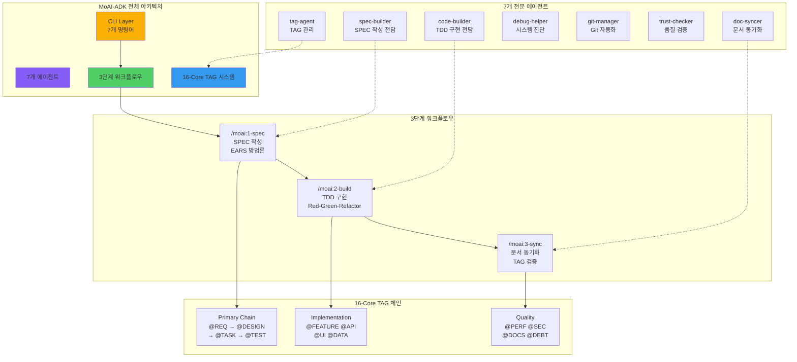
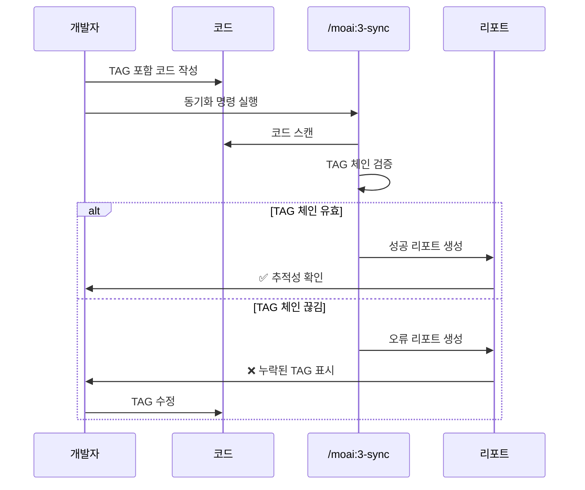
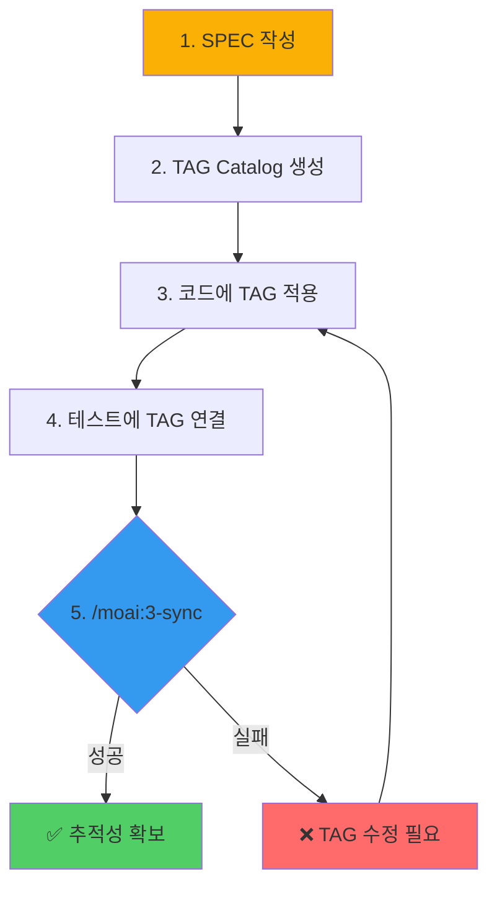

# @TAG 추적성 시스템

## 개요

@TAG 시스템은 요구사항부터 구현까지 완전한 추적성을 제공합니다.

## 시스템 아키텍처



## TAG 카테고리

### Primary Chain (필수)

```mermaid
graph LR
    REQ[@REQ<br/>요구사항] --> DESIGN[@DESIGN<br/>설계]
    DESIGN --> TASK[@TASK<br/>작업]
    TASK --> TEST[@TEST<br/>테스트]

    style REQ fill:#ff6b6b
    style DESIGN fill:#339af0
    style TASK fill:#fab005
    style TEST fill:#51cf66
```

모든 기능은 이 체인을 따라야 합니다:
- **@REQ:ID**: 요구사항 명세
- **@DESIGN:ID**: 설계 결정
- **@TASK:ID**: 구현 작업
- **@TEST:ID**: 테스트 명세

### Implementation Tags (구현)

- **@FEATURE:ID**: 기능 구현
- **@API:ID**: API 엔드포인트
- **@UI:ID**: 사용자 인터페이스 컴포넌트
- **@DATA:ID**: 데이터 모델

### Quality Tags (품질)

- **@PERF:ID**: 성능 최적화
- **@SEC:ID**: 보안 조치
- **@DOCS:ID**: 문서화
- **@DEBT:ID**: 기술 부채

### Meta Tags (메타)

- **@OPS:ID**: 운영
- **@RELEASE:ID**: 릴리스
- **@DEPRECATED:ID**: 폐기됨

## TAG Block 템플릿

```typescript
// @FEATURE:AUTH-001 | Chain: @REQ:AUTH-001 -> @DESIGN:AUTH-001 -> @TASK:AUTH-001 -> @TEST:AUTH-001
// Related: @SEC:AUTH-001, @DOCS:AUTH-001
class AuthenticationService {
  // 구현...
}
```

## TAG 명명 규칙

형식: `@TYPE:DOMAIN-###`

예시:
- `@REQ:AUTH-001`: 인증 요구사항 #1
- `@TEST:LOGIN-003`: 로그인 테스트 #3
- `@SEC:API-005`: API 보안 조치 #5

## SPEC Catalog

SPEC 문서에서 TAG 카탈로그를 유지관리합니다:

```markdown
### @TAG Catalog
| Chain | TAG | 설명 | 연관 산출물 |
|-------|-----|------|-------------|
| Primary | @REQ:AUTH-001 | 사용자 인증 | SPEC-AUTH-001 |
| Primary | @DESIGN:AUTH-001 | OAuth2 설계 | design/oauth.md |
| Primary | @TASK:AUTH-001 | OAuth2 구현 | src/auth/oauth2.ts |
| Primary | @TEST:AUTH-001 | 통합 테스트 | tests/auth/oauth2.test.ts |
| Implementation | @FEATURE:AUTH-001 | 인증 서비스 | src/auth/service.ts |
| Quality | @SEC:AUTH-001 | 보안 감사 | docs/security/oauth2.md |
```

## 언어별 TAG 적용

### TypeScript

```typescript
// @FEATURE:LOGIN-001 | Chain: @REQ:AUTH-001 -> @DESIGN:AUTH-001 -> @TASK:AUTH-001 -> @TEST:AUTH-001
// Related: @SEC:LOGIN-001, @DOCS:LOGIN-001
interface AuthService {
  // @API:LOGIN-001: 인증 API 인터페이스 정의
  authenticate(username: string, password: string): Promise<boolean>;
}

// @UI:LOGIN-001: 로그인 컴포넌트
const LoginForm: React.FC = () => {
  // @SEC:LOGIN-001: 클라이언트 입력 검증
  const handleSubmit = (username: string, password: string) => {
    // 구현...
  };

  return <form>...</form>;
};

// @TEST:LOGIN-001: Vitest/Jest 테스트
describe('AuthService', () => {
  test('@TEST:LOGIN-001: 유효한 사용자 인증', () => {
    // 테스트 구현...
  });
});
```

### Python

```python
# @FEATURE:LOGIN-001 | Chain: @REQ:AUTH-001 -> @DESIGN:AUTH-001 -> @TASK:AUTH-001 -> @TEST:AUTH-001
# Related: @SEC:LOGIN-001, @DOCS:LOGIN-001
class AuthenticationService:
    """@FEATURE:LOGIN-001: 사용자 인증 서비스 구현"""

    def authenticate(self, username: str, password: str) -> bool:
        """@API:LOGIN-001: 사용자 인증 API 엔드포인트"""
        # @SEC:LOGIN-001: 입력값 보안 검증
        if not self._validate_input(username, password):
            return False

        # @PERF:LOGIN-001: 캐시된 인증 결과 확인
        if cached_result := self._get_cached_auth(username):
            return cached_result

        return self._verify_credentials(username, password)

# @TEST:LOGIN-001 연결: @TASK:LOGIN-001 -> @TEST:LOGIN-001
def test_should_authenticate_valid_user():
    """@TEST:LOGIN-001: 유효한 사용자 인증 테스트"""
    service = AuthenticationService()
    result = service.authenticate("user", "password")
    assert result is True
```

### Java

```java
// @FEATURE:LOGIN-001 | Chain: @REQ:AUTH-001 -> @DESIGN:AUTH-001 -> @TASK:AUTH-001 -> @TEST:AUTH-001
// Related: @SEC:LOGIN-001, @DOCS:LOGIN-001
public class AuthenticationService {
    // @API:LOGIN-001: 사용자 인증 API
    public boolean authenticate(String username, String password) {
        // @SEC:LOGIN-001: 입력 검증
        if (!validateInput(username, password)) {
            return false;
        }

        // 구현...
    }
}

// @TEST:LOGIN-001: JUnit 테스트
public class AuthenticationServiceTest {
    @Test
    public void testAuthenticateValidUser() {
        // @TEST:LOGIN-001: 유효한 사용자 인증 테스트
        boolean result = service.authenticate("user", "password");
        assertTrue(result);
    }
}
```

## TAG 검색 및 유지관리

### 중복 방지

새 TAG 도입 전 기존 체인 확인:

```bash
# 특정 TAG 타입 찾기
rg "@REQ:" -n

# 특정 TAG 체인 찾기
rg "AUTH-001" -n

# 모든 보안 TAG 나열
rg "@SEC:" -g "*.ts" -n
```

### 무결성 검사

`/moai:3-sync`로 검증:
- 코드 전체 스캔
- TAG 체인 검증
- 고아 TAG 식별
- 추적성 리포트 생성

### 폐기 절차

더 이상 사용하지 않는 TAG:

```typescript
// @TAG:DEPRECATED-AUTH-001: AUTH-002로 대체됨
```

Catalog에서 상태를 `Deprecated`로 업데이트합니다.

## TAG 체인 검증 플로우



## 금지 패턴

잘못된 예시:

```python
@TASK:LOGIN-001 -> @DESIGN:LOGIN-001      # ❌ 순서 위반
@FEATURE:LOGIN-001 (중복 선언)          # ❌ 고유성 위반
@REQ:ABC-123                             # ❌ 의미 없는 ID
```

## 업데이트 체크리스트

- [ ] TAG BLOCK이 모든 신규/수정 파일에 존재하는가?
- [ ] Primary Chain 4종이 끊김 없이 연결되는가?
- [ ] SPEC `@TAG Catalog`와 코드/테스트가 동일한 ID를 공유하는가?
- [ ] TAG 체인이 코드 스캔을 통해 검증되었는가?

## 실전 워크플로우



## 다음 단계

- [3단계 워크플로우](/guide/workflow) 실습
- [SPEC 우선 TDD](/guide/spec-first-tdd) 적용
- CLI 명령어로 TAG 관리 자동화