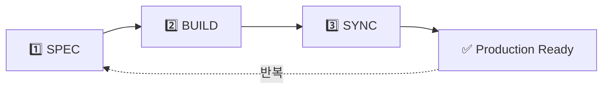

# @CODE:DOCS-001:UI | SPEC: .moai/specs/SPEC-DOCS-001/spec.md

# MoAI-ADK란?

MoAI-ADK는 **AI 시대의 코드 품질 문제를 해결하는 SPEC-First TDD 개발 프레임워크**입니다.

## 🚨 바이브 코딩의 한계

AI 도구(Codex, Claude, Gemini)로 빠르게 코딩하는 시대가 열렸습니다. 개발 속도는 확실히 빨라졌지만, **새로운 종류의 문제**들이 생겨났습니다.

### 1. 아름답지만 작동하지 않는 코드

**문제 상황**: AI가 생성한 코드는 문법적으로 완벽하고 구조도 우아합니다. 하지만 실제로 실행해보면...

- **컴파일은 되지만 실행은 안 됨**: TypeScript 타입은 완벽한데 런타임에 `undefined` 에러 발생
- **엣지 케이스 처리 부족**: 정상 시나리오만 고려, 빈 배열/null/타임아웃 같은 예외 상황 무시
- **성능 문제**: `O(n³)` 복잡도로 구현되어 데이터 10,000개에서 서버 멈춤
- **의존성 지옥**: 단순 기능에 불필요한 라이브러리 추가, 보안 취약점 경고 쏟아짐

:::danger 실제 사례
한 개발자가 ChatGPT로 사용자 인증 코드를 생성했습니다. 코드는 아름다웠고 컴파일도 완벽했습니다. 하지만 실제 배포 후, **비밀번호가 평문으로 데이터베이스에 저장**되고 있었습니다. AI는 "사용자 인증"만 받았지, "보안 요구사항"을 듣지 못했기 때문입니다.
:::

### 2. 플랑켄슈타인 코드의 탄생

**문제 상황**: 여러 AI 도구를 번갈아 사용하다 보면 일관성 없는 코드베이스가 만들어집니다.

- **일관성 없는 스타일**: 월요일 ChatGPT(함수형) → 수요일 Claude(OOP) → 금요일 Gemini(절차형)
- **중복 로직 난무**: `validateEmail()`, `checkEmailFormat()`, `isEmailValid()` - 같은 기능을 3번 구현
- **아키텍처 붕괴**: MVC로 시작했는데 Hexagonal, Clean, CQRS 혼재
- **네이밍 혼란**: `getUserData()`, `fetchUser()`, `retrieveUserInfo()` - 모두 같은 기능

:::warning 실제 사례
스타트업 팀이 1개월간 AI로 빠르게 프로토타입을 만들었습니다. 기능은 모두 작동했지만, 코드베이스는 각 개발자가 다른 AI로 만든 코드들이 뒤섞인 "플랑켄슈타인"이 되었습니다. 결국 기술 부채를 갚기 위해 3개월을 투자했고, 그 사이 경쟁사에 시장을 빼앗겼습니다.
:::

### 3. 디버깅 지옥

**문제 상황**: 프로덕션에서 버그 발생 시 원인을 찾는 것이 거의 불가능합니다.

- **원인 추적 불가**: "왜 이렇게 구현했지?" → AI 채팅 히스토리 삭제됨, 개발자도 기억 안 남
- **사이드 이펙트 파악 불가**: "이 코드 수정하면 다른 곳 깨질까?" → 테스트 없어서 확인 불가
- **테스트 부재**: AI가 만든 테스트조차 제대로 작동하는지 미확인
- **문서 없음**: 코드는 있는데 README/API 문서 없음, 코드 변경 시 문서 outdated

:::danger 실제 사례
금요일 저녁 6시, 프로덕션에서 결제 실패 버그 발생. 개발자는 3개월 전 AI로 생성한 결제 로직을 열어봤지만 왜 이렇게 구현했는지 전혀 기억 안 남. AI 채팅 삭제됨, 주석 없음. 결국 `console.log()` 수십 개 찍어가며 주말 이틀 소비. 문제는 단순한 타임존 버그였지만 추적성 부재로 찾기 너무 어려웠음.
:::

### 4. 요구사항 추적성 상실

**문제 상황**: 시간이 지날수록 "왜 이 코드를 이렇게 만들었는지" 맥락을 잃어버립니다.

- **"왜"를 잃어버림**: "왜 결제 10만원 초과 시 추가 인증?" → "글쎄요, AI가 그렇게..."
- **변경 이력 부재**: 누가/언제/왜 바꿨는지 기록 없음. Git 메시지도 "fix bug" 수준
- **의사결정 근거 사라짐**: "왜 JWT 선택?" → "기억 안 나요. AI 추천이요."

:::danger 실제 사례
핀테크 스타트업이 감사를 받았습니다. 감사관이 "고객 신용 평가 로직의 근거를 설명해주세요"라고 요청했지만 코드만 있고 SPEC 문서 없음. 누가 왜 이 알고리즘을 선택했는지 아무도 몰랐음. 결과: 금융 라이선스 승인 6개월 지연.
:::

### 5. 팀 협업 붕괴

**문제 상황**: 여러 개발자가 각자 AI를 사용하면서 협업이 무너집니다.

- **스파게티 코드 양산**: A(ChatGPT) + B(Claude) + C(Gemini) → 코드 리뷰 없이 머지 → 3개월 후 스파게티
- **코드 리뷰 불가**: "이게 뭐 하는 코드인지 모르겠어요" → "저도 AI가 만든 건데..."
- **온보딩 악몽**: 신입이 코드 이해하는 데 1개월+. 멘토도 "솔직히 저도 잘 모르겠네요"
- **기술 부채 폭발**: "이 코드 건드리면 뭔가 깨질 것 같아서..." → 금기 영역 확대

### 💔 바이브 코딩의 역설

**속도와 품질의 트레이드오프**: AI가 코드를 빠르게 생성해주지만, 그 코드는 **유지보수할 수 없는 블랙박스**가 됩니다. 1주일 만에 만든 프로토타입이 3개월 동안 기술 부채를 만들어냅니다.

**단기 이익, 장기 손해**: 처음엔 "AI 덕분에 개발 빨라졌어!"라고 기뻐하지만, 3개월 후엔 "이 코드 어떻게 유지보수하지?"라고 고민하고, 6개월 후엔 "차라리 처음부터 다시 만들까?"라고 좌절합니다.

---

## ✨ MoAI-ADK의 해결책

Alfred는 Agentic AI 시대의 코드 품질 문제를 **체계적인 3단계 워크플로우**로 해결합니다.

### 3단계 워크플로우

### 1️⃣ SPEC - 명세 작성

**명령어**: `/alfred:1-spec "JWT 기반 사용자 로그인 API"`

**핵심 철학**: "코드를 쓰기 전에 무엇을 만들지 먼저 정의하라."

Alfred가 자동으로 수행:
- EARS 형식 명세 자동 생성
- `@SPEC:ID` TAG 부여 (예: `@SPEC:AUTH-001`)
- Git 브랜치 자동 생성 (`feature/SPEC-AUTH-001`)
- Draft PR 생성 (Team 모드)

### 2️⃣ BUILD - TDD 구현

**명령어**: `/alfred:2-build AUTH-001`

**핵심 철학**: "테스트 없이는 구현 없음."

Alfred가 Red-Green-Refactor 사이클 수행:
- 🔴 **RED**: 실패하는 테스트 작성
- 🟢 **GREEN**: 최소 구현으로 테스트 통과
- 🔵 **REFACTOR**: 코드 품질 개선

### 3️⃣ SYNC - 문서 동기화

**명령어**: `/alfred:3-sync`

**핵심 철학**: "추적성 없이는 완성 없음."

Alfred가 자동으로 수행:
- TAG 체인 검증 (`@SPEC → @TEST → @CODE → @DOC`)
- Living Document 자동 생성
- PR Ready 전환 및 자동 머지 (Team 모드)

---

## 🎯 다음 단계

- [SPEC 우선 TDD](/concepts/spec-first-tdd) - TDD 철학 깊이 이해하기
- [Quick Start](/guide/getting-started) - 바로 시작하기
- [FAQ](/guide/faq) - 자주 묻는 질문
