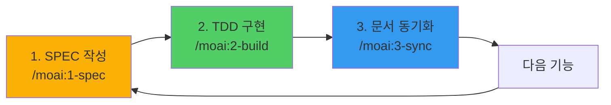
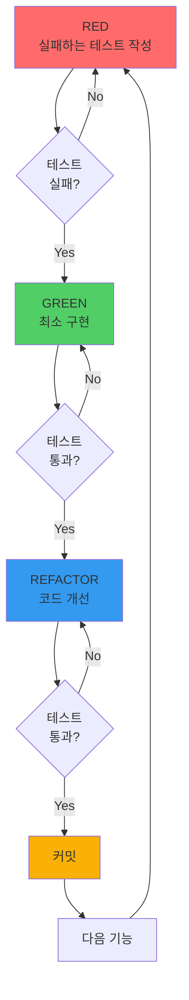
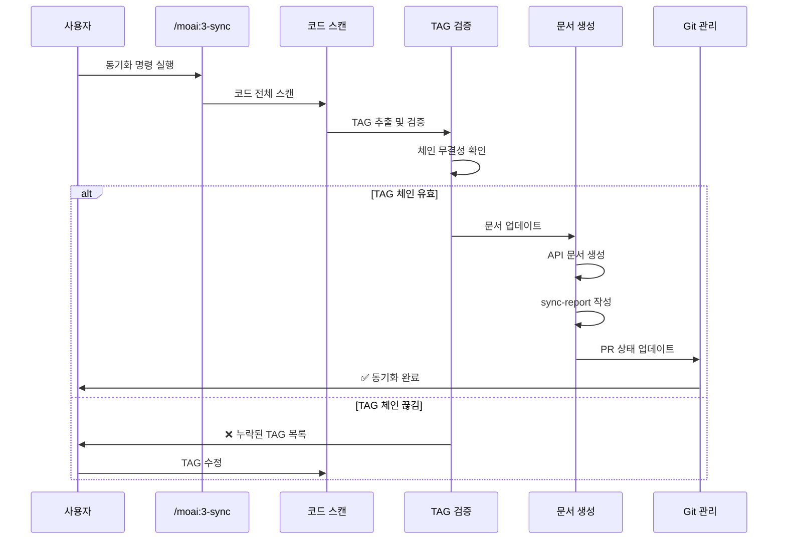

# 3단계 개발 워크플로우 완전 가이드

MoAI-ADK는 엄격한 3단계 SPEC 우선 TDD 워크플로우를 따릅니다. 이 가이드는 각 단계의 상세한 실행 방법, 실전 시나리오, 문제 해결 전략을 제공합니다.

## 워크플로우 개요



### 핵심 원칙

1. **명세 없이는 코드 없음**: 모든 구현은 SPEC에서 시작
2. **테스트 없이는 구현 없음**: Red-Green-Refactor 사이클 엄수
3. **추적성 없이는 완성 없음**: @TAG 체인으로 완전한 추적성 확보

## 1단계: SPEC 작성 (`/moai:1-spec`)

### 개요

SPEC 작성은 모든 개발의 시작점입니다. 코드를 작성하기 전에 명확한 요구사항, 설계 결정, 작업 계획을 문서화합니다.

### 실행 방법

```bash
# 기본 사용법
/moai:1-spec "기능명"

# 복수 기능
/moai:1-spec "인증" "권한 관리" "세션 관리"

# 특정 SPEC ID로 수정
/moai:1-spec SPEC-001 "기존 SPEC 수정 내용"
```

### EARS 요구사항 형식

EARS (Easy Approach to Requirements Syntax)는 체계적인 요구사항 작성을 위한 방법론입니다.

#### 1. Ubiquitous Requirements (언제나 적용)

```markdown
### Ubiquitous Requirements
- 시스템은 사용자 인증 기능을 제공해야 한다
- 시스템은 데이터 암호화를 지원해야 한다
- 시스템은 감사 로그를 기록해야 한다
```

**작성 패턴**: "시스템은 [기능]을 제공해야 한다"

**적용 시나리오**:
- 시스템의 기본 기능 정의
- 항상 사용 가능해야 하는 기능
- 시스템의 핵심 가치 제안

#### 2. Event-driven Requirements (이벤트 기반)

```markdown
### Event-driven Requirements
- WHEN 사용자가 유효한 자격증명으로 로그인하면, 시스템은 JWT 토큰을 발급해야 한다
- WHEN 토큰이 만료되면, 시스템은 401 Unauthorized 응답을 반환해야 한다
- WHEN 3회 연속 로그인 실패 시, 시스템은 계정을 일시적으로 잠금 처리해야 한다
```

**작성 패턴**: "WHEN [조건]이면, 시스템은 [동작]해야 한다"

**적용 시나리오**:
- 사용자 액션에 대한 시스템 응답
- 외부 이벤트 처리
- 트리거 기반 자동화

#### 3. State-driven Requirements (상태 기반)

```markdown
### State-driven Requirements
- WHILE 사용자가 인증된 상태일 때, 시스템은 보호된 리소스 접근을 허용해야 한다
- WHILE 백업 프로세스가 실행 중일 때, 시스템은 읽기 전용 모드로 동작해야 한다
- WHILE 메인터넌스 모드일 때, 시스템은 503 Service Unavailable을 반환해야 한다
```

**작성 패턴**: "WHILE [상태]일 때, 시스템은 [행동]해야 한다"

**적용 시나리오**:
- 시스템 상태에 따른 동작 변화
- 장기 실행 프로세스 중 동작
- 모드 전환 시 동작

#### 4. Optional Features (선택적 기능)

```markdown
### Optional Features
- WHERE 리프레시 토큰이 제공되면, 시스템은 새로운 액세스 토큰을 발급할 수 있다
- WHERE 다중 인증(MFA)이 활성화되면, 시스템은 추가 인증 단계를 요구할 수 있다
- WHERE 프리미엄 계정이면, 시스템은 고급 분석 기능을 제공할 수 있다
```

**작성 패턴**: "WHERE [조건]이면, 시스템은 [기능]을 제공할 수 있다"

**적용 시나리오**:
- 선택적 기능 (Nice-to-have)
- 조건부 활성화 기능
- 계층별 차등 기능

#### 5. Constraints (제약사항)

```markdown
### Constraints
- IF 잘못된 토큰이 제공되면, 시스템은 접근을 거부해야 한다
- 액세스 토큰 만료시간은 15분을 초과하지 않아야 한다
- 비밀번호는 최소 8자 이상, 대소문자와 숫자를 포함해야 한다
- API 요청은 초당 100개를 초과할 수 없다
```

**작성 패턴**:
- "IF [조건]이면, 시스템은 [제약]해야 한다"
- "[항목]은 [제한]을 초과하지 않아야 한다"

**적용 시나리오**:
- 보안 정책
- 성능 제약
- 비즈니스 규칙

### SPEC 문서 구조

```markdown
# SPEC-AUTH-001: 사용자 인증 시스템

## @REQ:AUTH-001 요구사항

### Ubiquitous Requirements
- 시스템은 이메일/비밀번호 기반 인증을 제공해야 한다
- 시스템은 JWT 토큰 기반 세션 관리를 지원해야 한다

### Event-driven Requirements
- WHEN 사용자가 유효한 자격증명으로 로그인하면, 시스템은 JWT 토큰을 발급해야 한다
- WHEN 토큰이 만료되면, 시스템은 401 오류를 반환해야 한다

### State-driven Requirements
- WHILE 사용자가 인증된 상태일 때, 시스템은 보호된 API 접근을 허용해야 한다

### Optional Features
- WHERE 리프레시 토큰이 제공되면, 시스템은 새로운 액세스 토큰을 발급할 수 있다

### Constraints
- 액세스 토큰 유효기간은 15분이다
- 리프레시 토큰 유효기간은 7일이다
- 비밀번호는 bcrypt로 해싱해야 한다

## @DESIGN:AUTH-001 설계

### 아키텍처 결정
- JWT 토큰 형식: Header.Payload.Signature
- 알고리즘: RS256 (RSA 공개키/개인키)
- 저장소: Redis (세션 관리), PostgreSQL (사용자 데이터)

### API 엔드포인트
- POST /auth/login - 로그인
- POST /auth/logout - 로그아웃
- POST /auth/refresh - 토큰 갱신
- GET /auth/me - 현재 사용자 정보

### 데이터 모델
```typescript
interface User {
  id: string;
  email: string;
  passwordHash: string;
  createdAt: Date;
  updatedAt: Date;
}

interface AuthToken {
  accessToken: string;
  refreshToken: string;
  expiresIn: number;
}
```

## @TASK:AUTH-001 작업 계획

### Phase 1: 기반 구조
- [ ] User 모델 정의
- [ ] AuthService 클래스 구현
- [ ] JWT 유틸리티 함수

### Phase 2: 핵심 기능
- [ ] 로그인 API
- [ ] 토큰 검증 미들웨어
- [ ] 로그아웃 API

### Phase 3: 추가 기능
- [ ] 리프레시 토큰
- [ ] 비밀번호 재설정
- [ ] 이메일 인증

## @TEST:AUTH-001 테스트 계획

### 단위 테스트
- [ ] bcrypt 해싱 검증
- [ ] JWT 생성/검증
- [ ] 토큰 만료 처리

### 통합 테스트
- [ ] 로그인 성공 시나리오
- [ ] 로그인 실패 시나리오
- [ ] 토큰 검증 시나리오
- [ ] 리프레시 토큰 시나리오

### 보안 테스트
- [ ] SQL Injection 방어
- [ ] XSS 방어
- [ ] CSRF 방어
- [ ] 비밀번호 복잡도 검증

## Traceability

TAG BLOCK을 통한 추적성 확보:

```markdown
# @SPEC:AUTH-001 | SPEC: SPEC-AUTH-001.md | TEST: tests/auth/service.test.ts | CODE: src/auth/service.ts

# SPEC-AUTH-001: 사용자 인증 시스템
```

### 브랜치 생성 확인

SPEC 작성 완료 후, spec-builder 에이전트는 브랜치 생성을 제안합니다:

```
SPEC-AUTH-001 작성이 완료되었습니다.
feature/spec-auth-001-user-authentication 브랜치를 생성하시겠습니까? (y/n)
```

**사용자 확인 필수**: 브랜치 생성은 사용자가 승인해야 진행됩니다.

### SPEC 작성 모범 사례

#### 1. 명확성 (Clarity)

**좋은 예**:
```markdown
WHEN 사용자가 로그인 버튼을 클릭하면, 시스템은 이메일과 비밀번호를 검증하고 JWT 토큰을 발급해야 한다
```

**나쁜 예**:
```markdown
사용자가 로그인하면 인증한다
```

#### 2. 측정 가능성 (Measurability)

**좋은 예**:
```markdown
API 응답 시간은 95 percentile 기준 200ms 이하여야 한다
```

**나쁜 예**:
```markdown
API는 빨라야 한다
```

#### 3. 검증 가능성 (Testability)

**좋은 예**:
```markdown
WHEN 잘못된 비밀번호로 3회 연속 로그인 시도 시, 계정은 15분간 잠금 처리되어야 한다
```

**나쁜 예**:
```markdown
여러 번 실패하면 계정을 잠근다
```

### 일반적인 SPEC 작성 실수

#### 실수 1: 구현 세부사항 포함

**잘못된 예**:
```markdown
시스템은 bcrypt로 비밀번호를 해싱하고 PostgreSQL에 저장해야 한다
```

**올바른 예**:
```markdown
시스템은 비밀번호를 안전하게 해싱하여 저장해야 한다
(@DESIGN에서 bcrypt와 PostgreSQL 언급)
```

#### 실수 2: 모호한 표현

**잘못된 예**:
```markdown
시스템은 빠르게 응답해야 한다
```

**올바른 예**:
```markdown
API 응답 시간은 95 percentile 기준 200ms 이하여야 한다
```

#### 실수 3: 요구사항 누락

**불완전한 SPEC**:
```markdown
시스템은 사용자 인증을 제공해야 한다
```

**완전한 SPEC**:
```markdown
### Ubiquitous Requirements
- 시스템은 사용자 인증을 제공해야 한다

### Event-driven Requirements
- WHEN 유효한 자격증명 제공 시, JWT 토큰 발급
- WHEN 토큰 만료 시, 401 오류 반환

### Constraints
- 토큰 유효기간 15분
- 비밀번호 최소 8자
```

## 2단계: TDD 구현 (`/moai:2-build`)

### 개요

TDD (Test-Driven Development) 구현은 Red-Green-Refactor 사이클을 엄격히 따릅니다. SPEC에 정의된 요구사항을 충족하는 테스트를 먼저 작성하고, 테스트를 통과하는 최소한의 코드를 구현한 후, 품질을 개선합니다.

### 실행 방법

```bash
# SPEC ID로 구현 시작
/moai:2-build SPEC-001

# 복수 SPEC 순차 구현
/moai:2-build SPEC-001 SPEC-002 SPEC-003

# 특정 작업만 구현
/moai:2-build SPEC-001 --task login
```

### Red-Green-Refactor 사이클



### RED 단계: 실패하는 테스트 작성

#### TypeScript 예시

```typescript
// @TEST:AUTH-001: 사용자 인증 테스트
describe('AuthService', () => {
  let authService: AuthService;
  let userRepository: UserRepository;

  beforeEach(() => {
    userRepository = new MockUserRepository();
    authService = new AuthService(userRepository);
  });

  describe('@TEST:AUTH-001: login', () => {
    test('유효한 자격증명으로 로그인 시 토큰 반환', async () => {
      // Given: 유효한 사용자가 존재
      const user = await userRepository.create({
        email: 'user@example.com',
        password: 'Password123!'
      });

      // When: 로그인 시도
      const result = await authService.login(
        'user@example.com',
        'Password123!'
      );

      // Then: JWT 토큰이 반환됨
      expect(result.accessToken).toBeDefined();
      expect(result.refreshToken).toBeDefined();
      expect(result.expiresIn).toBe(900); // 15분
    });

    test('잘못된 비밀번호로 로그인 시 실패', async () => {
      // Given: 사용자 존재
      await userRepository.create({
        email: 'user@example.com',
        password: 'Password123!'
      });

      // When & Then: 잘못된 비밀번호로 로그인 시 예외 발생
      await expect(
        authService.login('user@example.com', 'WrongPassword')
      ).rejects.toThrow('Invalid credentials');
    });

    test('존재하지 않는 사용자로 로그인 시 실패', async () => {
      // When & Then: 존재하지 않는 이메일로 로그인 시 예외 발생
      await expect(
        authService.login('nonexistent@example.com', 'Password123!')
      ).rejects.toThrow('Invalid credentials');
    });
  });
});
```

#### Python 예시

```python
# @TEST:AUTH-001: 사용자 인증 테스트
import pytest
from auth_service import AuthService, InvalidCredentialsError

class TestAuthService:
    """@TEST:AUTH-001: 인증 서비스 테스트 스위트"""

    @pytest.fixture
    def auth_service(self):
        """테스트용 인증 서비스 생성"""
        return AuthService()

    def test_should_return_token_for_valid_credentials(self, auth_service):
        """@TEST:AUTH-001: 유효한 자격증명으로 로그인 시 토큰 반환"""
        # Given: 유효한 사용자
        user = auth_service.register("user@example.com", "Password123!")

        # When: 로그인
        result = auth_service.login("user@example.com", "Password123!")

        # Then: 토큰 반환
        assert result["access_token"] is not None
        assert result["refresh_token"] is not None
        assert result["expires_in"] == 900

    def test_should_fail_with_wrong_password(self, auth_service):
        """@TEST:AUTH-001: 잘못된 비밀번호로 로그인 시 실패"""
        # Given: 사용자 등록
        auth_service.register("user@example.com", "Password123!")

        # When & Then: 잘못된 비밀번호로 로그인 시 예외
        with pytest.raises(InvalidCredentialsError):
            auth_service.login("user@example.com", "WrongPassword")

    def test_should_fail_with_nonexistent_user(self, auth_service):
        """@TEST:AUTH-001: 존재하지 않는 사용자로 로그인 시 실패"""
        # When & Then: 존재하지 않는 사용자로 로그인 시 예외
        with pytest.raises(InvalidCredentialsError):
            auth_service.login("nonexistent@example.com", "Password123!")
```

#### RED 단계 체크리스트

- [ ] 테스트가 SPEC의 요구사항을 정확히 반영하는가?
- [ ] 테스트가 올바른 이유로 실패하는가?
- [ ] Given-When-Then 패턴을 따르는가?
- [ ] 엣지 케이스와 예외 상황을 포함하는가?
- [ ] 테스트 이름이 의도를 명확히 드러내는가?

### GREEN 단계: 최소 구현

#### TypeScript 예시

```typescript
// @FEATURE:AUTH-001 | Chain: @REQ:AUTH-001 -> @DESIGN:AUTH-001 -> @TASK:AUTH-001 -> @TEST:AUTH-001
// Related: @SEC:AUTH-001, @DOCS:AUTH-001

import bcrypt from 'bcrypt';
import jwt from 'jsonwebtoken';

interface AuthResult {
  accessToken: string;
  refreshToken: string;
  expiresIn: number;
}

/**
 * @FEATURE:AUTH-001: 사용자 인증 서비스
 */
export class AuthService {
  private readonly ACCESS_TOKEN_EXPIRY = 900; // 15분
  private readonly REFRESH_TOKEN_EXPIRY = 604800; // 7일

  constructor(private userRepository: UserRepository) {}

  /**
   * @API:AUTH-001: 사용자 로그인
   */
  async login(email: string, password: string): Promise<AuthResult> {
    // @SEC:AUTH-001: 입력 검증
    if (!email || !password) {
      throw new Error('Invalid credentials');
    }

    // 사용자 조회
    const user = await this.userRepository.findByEmail(email);
    if (!user) {
      throw new Error('Invalid credentials');
    }

    // @SEC:AUTH-001: 비밀번호 검증
    const isValidPassword = await bcrypt.compare(password, user.passwordHash);
    if (!isValidPassword) {
      throw new Error('Invalid credentials');
    }

    // @TASK:AUTH-001: JWT 토큰 생성
    const accessToken = this.generateAccessToken(user);
    const refreshToken = this.generateRefreshToken(user);

    return {
      accessToken,
      refreshToken,
      expiresIn: this.ACCESS_TOKEN_EXPIRY
    };
  }

  private generateAccessToken(user: User): string {
    return jwt.sign(
      { userId: user.id, email: user.email },
      process.env.JWT_SECRET!,
      { expiresIn: this.ACCESS_TOKEN_EXPIRY }
    );
  }

  private generateRefreshToken(user: User): string {
    return jwt.sign(
      { userId: user.id },
      process.env.JWT_REFRESH_SECRET!,
      { expiresIn: this.REFRESH_TOKEN_EXPIRY }
    );
  }
}
```

#### Python 예시

```python
# @FEATURE:AUTH-001 | Chain: @REQ:AUTH-001 -> @DESIGN:AUTH-001 -> @TASK:AUTH-001 -> @TEST:AUTH-001
# Related: @SEC:AUTH-001, @DOCS:AUTH-001

import bcrypt
import jwt
from datetime import datetime, timedelta
from typing import Dict

class InvalidCredentialsError(Exception):
    """@SEC:AUTH-001: 잘못된 자격증명 예외"""
    pass

class AuthService:
    """@FEATURE:AUTH-001: 사용자 인증 서비스"""

    ACCESS_TOKEN_EXPIRY = 900  # 15분
    REFRESH_TOKEN_EXPIRY = 604800  # 7일

    def __init__(self, user_repository: UserRepository):
        self.user_repository = user_repository

    def login(self, email: str, password: str) -> Dict[str, any]:
        """
        @API:AUTH-001: 사용자 로그인

        Args:
            email: 사용자 이메일
            password: 비밀번호

        Returns:
            Dict containing access_token, refresh_token, expires_in

        Raises:
            InvalidCredentialsError: 잘못된 자격증명
        """
        # @SEC:AUTH-001: 입력 검증
        if not email or not password:
            raise InvalidCredentialsError("Invalid credentials")

        # 사용자 조회
        user = self.user_repository.find_by_email(email)
        if not user:
            raise InvalidCredentialsError("Invalid credentials")

        # @SEC:AUTH-001: 비밀번호 검증
        if not bcrypt.checkpw(password.encode(), user.password_hash.encode()):
            raise InvalidCredentialsError("Invalid credentials")

        # @TASK:AUTH-001: JWT 토큰 생성
        access_token = self._generate_access_token(user)
        refresh_token = self._generate_refresh_token(user)

        return {
            "access_token": access_token,
            "refresh_token": refresh_token,
            "expires_in": self.ACCESS_TOKEN_EXPIRY
        }

    def _generate_access_token(self, user: User) -> str:
        """액세스 토큰 생성"""
        payload = {
            "user_id": user.id,
            "email": user.email,
            "exp": datetime.utcnow() + timedelta(seconds=self.ACCESS_TOKEN_EXPIRY)
        }
        return jwt.encode(payload, os.getenv("JWT_SECRET"), algorithm="HS256")

    def _generate_refresh_token(self, user: User) -> str:
        """리프레시 토큰 생성"""
        payload = {
            "user_id": user.id,
            "exp": datetime.utcnow() + timedelta(seconds=self.REFRESH_TOKEN_EXPIRY)
        }
        return jwt.encode(payload, os.getenv("JWT_REFRESH_SECRET"), algorithm="HS256")
```

#### GREEN 단계 체크리스트

- [ ] 모든 테스트가 통과하는가?
- [ ] 과도한 최적화를 피했는가?
- [ ] SPEC의 요구사항을 충족하는가?
- [ ] 불필요한 코드를 추가하지 않았는가?
- [ ] @TAG가 올바르게 적용되었는가?

### REFACTOR 단계: 코드 품질 개선

```typescript
// @FEATURE:AUTH-001 | Chain: @REQ:AUTH-001 -> @DESIGN:AUTH-001 -> @TASK:AUTH-001 -> @TEST:AUTH-001
// Related: @SEC:AUTH-001, @DOCS:AUTH-001

/**
 * @FEATURE:AUTH-001: 사용자 인증 서비스 (리팩토링 완료)
 */
export class AuthService {
  private readonly config = {
    accessTokenExpiry: 900, // 15분
    refreshTokenExpiry: 604800, // 7일
  };

  constructor(
    private userRepository: UserRepository,
    private passwordHasher: PasswordHasher,
    private tokenGenerator: TokenGenerator
  ) {}

  /**
   * @API:AUTH-001: 사용자 로그인
   */
  async login(email: string, password: string): Promise<AuthResult> {
    this.validateCredentials(email, password);

    const user = await this.authenticateUser(email, password);

    return this.generateTokens(user);
  }

  /**
   * @SEC:AUTH-001: 자격증명 유효성 검사
   */
  private validateCredentials(email: string, password: string): void {
    if (!email || !password) {
      throw new InvalidCredentialsError('Email and password are required');
    }

    if (!this.isValidEmail(email)) {
      throw new InvalidCredentialsError('Invalid email format');
    }
  }

  /**
   * @TASK:AUTH-001: 사용자 인증 처리
   */
  private async authenticateUser(email: string, password: string): Promise<User> {
    const user = await this.userRepository.findByEmail(email);

    if (!user) {
      // @SEC:AUTH-001: 타이밍 공격 방지 (일정 시간 대기)
      await this.constantTimeDelay();
      throw new InvalidCredentialsError('Invalid credentials');
    }

    const isValidPassword = await this.passwordHasher.verify(
      password,
      user.passwordHash
    );

    if (!isValidPassword) {
      throw new InvalidCredentialsError('Invalid credentials');
    }

    return user;
  }

  /**
   * @TASK:AUTH-001: 인증 토큰 생성
   */
  private generateTokens(user: User): AuthResult {
    return {
      accessToken: this.tokenGenerator.generateAccessToken(
        user,
        this.config.accessTokenExpiry
      ),
      refreshToken: this.tokenGenerator.generateRefreshToken(
        user,
        this.config.refreshTokenExpiry
      ),
      expiresIn: this.config.accessTokenExpiry,
    };
  }

  private isValidEmail(email: string): boolean {
    const emailRegex = /^[^\s@]+@[^\s@]+\.[^\s@]+$/;
    return emailRegex.test(email);
  }

  /**
   * @SEC:AUTH-001: 타이밍 공격 방어를 위한 일정 시간 대기
   */
  private async constantTimeDelay(): Promise<void> {
    await new Promise(resolve => setTimeout(resolve, 100));
  }
}
```

#### 리팩토링 기법

##### 1. Extract Method (메서드 추출)

**Before**:
```typescript
async login(email: string, password: string): Promise<AuthResult> {
  if (!email || !password) {
    throw new Error('Invalid credentials');
  }
  const user = await this.userRepository.findByEmail(email);
  if (!user) {
    throw new Error('Invalid credentials');
  }
  const isValid = await bcrypt.compare(password, user.passwordHash);
  if (!isValid) {
    throw new Error('Invalid credentials');
  }
  const accessToken = jwt.sign({userId: user.id}, SECRET, {expiresIn: 900});
  const refreshToken = jwt.sign({userId: user.id}, REFRESH_SECRET, {expiresIn: 604800});
  return {accessToken, refreshToken, expiresIn: 900};
}
```

**After**:
```typescript
async login(email: string, password: string): Promise<AuthResult> {
  this.validateCredentials(email, password);
  const user = await this.authenticateUser(email, password);
  return this.generateTokens(user);
}
```

##### 2. Replace Magic Numbers (매직 넘버 제거)

**Before**:
```typescript
const accessToken = jwt.sign(payload, secret, { expiresIn: 900 });
const refreshToken = jwt.sign(payload, secret, { expiresIn: 604800 });
```

**After**:
```typescript
private readonly config = {
  accessTokenExpiry: 900, // 15분
  refreshTokenExpiry: 604800, // 7일
};

const accessToken = jwt.sign(payload, secret, {
  expiresIn: this.config.accessTokenExpiry
});
```

##### 3. Introduce Parameter Object (매개변수 객체화)

**Before**:
```typescript
function createUser(email: string, name: string, age: number, address: string) {
  // ...
}
```

**After**:
```typescript
interface UserCreationParams {
  email: string;
  name: string;
  age: number;
  address: string;
}

function createUser(params: UserCreationParams) {
  // ...
}
```

#### REFACTOR 단계 체크리스트

- [ ] 모든 테스트가 여전히 통과하는가?
- [ ] 코드 중복이 제거되었는가?
- [ ] 함수가 50 LOC 이하인가?
- [ ] 변수명이 의도를 명확히 드러내는가?
- [ ] SOLID 원칙을 따르는가?
- [ ] 불필요한 주석이 제거되었는가?

### 언어별 TDD 구현 패턴

#### Java 예시

```java
// @TEST:AUTH-001: 사용자 인증 테스트
@Test
public class AuthServiceTest {
    private AuthService authService;
    private UserRepository userRepository;

    @BeforeEach
    public void setUp() {
        userRepository = new MockUserRepository();
        authService = new AuthService(userRepository);
    }

    @Test
    public void testAuthenticateValidUser() {
        // @TEST:AUTH-001: 유효한 사용자 인증 테스트
        User user = userRepository.create("user@example.com", "Password123!");

        AuthResult result = authService.login("user@example.com", "Password123!");

        assertNotNull(result.getAccessToken());
        assertNotNull(result.getRefreshToken());
        assertEquals(900, result.getExpiresIn());
    }

    @Test
    public void testAuthenticateInvalidPassword() {
        // @TEST:AUTH-001: 잘못된 비밀번호 테스트
        userRepository.create("user@example.com", "Password123!");

        assertThrows(InvalidCredentialsException.class, () -> {
            authService.login("user@example.com", "WrongPassword");
        });
    }
}

// @FEATURE:AUTH-001: 인증 서비스 구현
public class AuthService {
    private static final int ACCESS_TOKEN_EXPIRY = 900;
    private static final int REFRESH_TOKEN_EXPIRY = 604800;

    private final UserRepository userRepository;

    public AuthService(UserRepository userRepository) {
        this.userRepository = userRepository;
    }

    // @API:AUTH-001: 사용자 로그인
    public AuthResult login(String email, String password)
            throws InvalidCredentialsException {
        validateCredentials(email, password);

        User user = authenticateUser(email, password);

        return generateTokens(user);
    }

    // @SEC:AUTH-001: 자격증명 검증
    private void validateCredentials(String email, String password)
            throws InvalidCredentialsException {
        if (email == null || password == null ||
            email.isEmpty() || password.isEmpty()) {
            throw new InvalidCredentialsException("Invalid credentials");
        }
    }

    private User authenticateUser(String email, String password)
            throws InvalidCredentialsException {
        User user = userRepository.findByEmail(email)
            .orElseThrow(() -> new InvalidCredentialsException("Invalid credentials"));

        if (!BCrypt.checkpw(password, user.getPasswordHash())) {
            throw new InvalidCredentialsException("Invalid credentials");
        }

        return user;
    }

    private AuthResult generateTokens(User user) {
        String accessToken = JWT.create()
            .withSubject(user.getId())
            .withExpiresAt(new Date(System.currentTimeMillis() + ACCESS_TOKEN_EXPIRY * 1000))
            .sign(Algorithm.HMAC256(getSecret()));

        String refreshToken = JWT.create()
            .withSubject(user.getId())
            .withExpiresAt(new Date(System.currentTimeMillis() + REFRESH_TOKEN_EXPIRY * 1000))
            .sign(Algorithm.HMAC256(getRefreshSecret()));

        return new AuthResult(accessToken, refreshToken, ACCESS_TOKEN_EXPIRY);
    }
}
```

#### Go 예시

```go
// @TEST:AUTH-001: 사용자 인증 테스트
package auth

import (
    "testing"
    "github.com/stretchr/testify/assert"
)

func TestAuthService_Login_ValidCredentials(t *testing.T) {
    // @TEST:AUTH-001: 유효한 자격증명 테스트
    repo := NewMockUserRepository()
    service := NewAuthService(repo)

    user, _ := repo.Create("user@example.com", "Password123!")

    result, err := service.Login("user@example.com", "Password123!")

    assert.NoError(t, err)
    assert.NotEmpty(t, result.AccessToken)
    assert.NotEmpty(t, result.RefreshToken)
    assert.Equal(t, 900, result.ExpiresIn)
}

func TestAuthService_Login_InvalidPassword(t *testing.T) {
    // @TEST:AUTH-001: 잘못된 비밀번호 테스트
    repo := NewMockUserRepository()
    service := NewAuthService(repo)

    repo.Create("user@example.com", "Password123!")

    _, err := service.Login("user@example.com", "WrongPassword")

    assert.Error(t, err)
    assert.Equal(t, ErrInvalidCredentials, err)
}

// @FEATURE:AUTH-001: 인증 서비스 구현
package auth

import (
    "errors"
    "time"
    "golang.org/x/crypto/bcrypt"
    "github.com/dgrijalva/jwt-go"
)

const (
    AccessTokenExpiry  = 900    // 15분
    RefreshTokenExpiry = 604800 // 7일
)

var (
    ErrInvalidCredentials = errors.New("invalid credentials")
)

type AuthService struct {
    userRepo UserRepository
}

func NewAuthService(userRepo UserRepository) *AuthService {
    return &AuthService{userRepo: userRepo}
}

// @API:AUTH-001: 사용자 로그인
func (s *AuthService) Login(email, password string) (*AuthResult, error) {
    if err := s.validateCredentials(email, password); err != nil {
        return nil, err
    }

    user, err := s.authenticateUser(email, password)
    if err != nil {
        return nil, err
    }

    return s.generateTokens(user)
}

// @SEC:AUTH-001: 자격증명 검증
func (s *AuthService) validateCredentials(email, password string) error {
    if email == "" || password == "" {
        return ErrInvalidCredentials
    }
    return nil
}

func (s *AuthService) authenticateUser(email, password string) (*User, error) {
    user, err := s.userRepo.FindByEmail(email)
    if err != nil {
        return nil, ErrInvalidCredentials
    }

    if err := bcrypt.CompareHashAndPassword(
        []byte(user.PasswordHash),
        []byte(password),
    ); err != nil {
        return nil, ErrInvalidCredentials
    }

    return user, nil
}

func (s *AuthService) generateTokens(user *User) (*AuthResult, error) {
    accessToken, err := s.generateAccessToken(user)
    if err != nil {
        return nil, err
    }

    refreshToken, err := s.generateRefreshToken(user)
    if err != nil {
        return nil, err
    }

    return &AuthResult{
        AccessToken:  accessToken,
        RefreshToken: refreshToken,
        ExpiresIn:    AccessTokenExpiry,
    }, nil
}

func (s *AuthService) generateAccessToken(user *User) (string, error) {
    claims := jwt.MapClaims{
        "user_id": user.ID,
        "email":   user.Email,
        "exp":     time.Now().Add(time.Second * AccessTokenExpiry).Unix(),
    }

    token := jwt.NewWithClaims(jwt.SigningMethodHS256, claims)
    return token.SignedString([]byte(getJWTSecret()))
}

func (s *AuthService) generateRefreshToken(user *User) (string, error) {
    claims := jwt.MapClaims{
        "user_id": user.ID,
        "exp":     time.Now().Add(time.Second * RefreshTokenExpiry).Unix(),
    }

    token := jwt.NewWithClaims(jwt.SigningMethodHS256, claims)
    return token.SignedString([]byte(getJWTRefreshSecret()))
}
```

### TDD 구현 모범 사례

#### 1. 작은 단계로 진행

**좋은 예**:
1. 입력 검증 테스트 → 구현
2. 사용자 조회 테스트 → 구현
3. 비밀번호 검증 테스트 → 구현
4. 토큰 생성 테스트 → 구현

**나쁜 예**:
1. 전체 로그인 기능을 한 번에 구현

#### 2. 테스트 독립성 유지

**좋은 예**:
```typescript
beforeEach(() => {
  // 각 테스트마다 새로운 인스턴스 생성
  authService = new AuthService(new MockUserRepository());
});
```

**나쁜 예**:
```typescript
// 전역 변수 사용으로 테스트 간 의존성 발생
const authService = new AuthService(sharedRepository);
```

#### 3. 의미 있는 테스트 이름

**좋은 예**:
```typescript
test('유효한 자격증명으로 로그인 시 JWT 토큰 반환', () => {});
test('잘못된 비밀번호로 로그인 시 InvalidCredentialsError 발생', () => {});
```

**나쁜 예**:
```typescript
test('test1', () => {});
test('로그인', () => {});
```

## 3단계: 문서 동기화 (`/moai:3-sync`)

### 개요

문서 동기화는 코드와 문서의 일관성을 유지하고, @TAG 체인을 검증하며, PR 상태를 업데이트하는 단계입니다.

### 실행 방법

```bash
# 전체 동기화
/moai:3-sync

# 특정 SPEC만 동기화
/moai:3-sync SPEC-001

# 강제 동기화 (캐시 무시)
/moai:3-sync --force
```

### 동기화 프로세스



### 수행 작업

#### 1. 코드 스캔 및 TAG 추출

```bash
# v5.0 자동 실행: 4-Core TAG 패턴 검색
rg "@(SPEC|TEST|CODE|DOC):" -n
```

**추출 결과 예시**:
```
src/auth/service.ts:1:// @FEATURE:AUTH-001 | Chain: @REQ:AUTH-001 -> @DESIGN:AUTH-001 -> @TASK:AUTH-001 -> @TEST:AUTH-001
src/auth/service.ts:15:  // @API:AUTH-001: 사용자 로그인
src/auth/service.ts:25:  // @SEC:AUTH-001: 입력 검증
tests/auth/service.test.ts:5:describe('@TEST:AUTH-001 사용자 인증', () => {
docs/specs/SPEC-AUTH-001.md:5:## @REQ:AUTH-001 요구사항
```

#### 2. TAG 체인 검증

**검증 규칙 (v5.0)**:
- 4-Core Chain 완결성: @SPEC → @TEST → @CODE → @DOC
- ID 일관성: 모든 TAG가 동일한 ID 사용
- 고아 TAG 탐지: 연결되지 않은 TAG 식별
- 중복 TAG 탐지: 동일한 TAG의 중복 선언

**검증 성공 예시 (v5.0)**:
```
✅ TAG Chain Validation

SPEC-AUTH-001: User Authentication
  ✅ @SPEC:AUTH-001 (docs/specs/SPEC-AUTH-001.md:5)
  ✅ @TEST:AUTH-001 (tests/auth/service.test.ts:5)
  ✅ @CODE:AUTH-001 (src/auth/service.ts:1)
  ✅ @DOC:AUTH-001 (docs/api/auth.md:1)

Summary: 4/4 tags validated (4-Core complete)
```

**검증 실패 예시 (v5.0)**:
```
❌ TAG Chain Validation

SPEC-AUTH-001: User Authentication
  ✅ @SPEC:AUTH-001 (docs/specs/SPEC-AUTH-001.md:5)
  ✅ @TEST:AUTH-001 (tests/auth/service.test.ts:5)
  ❌ @CODE:AUTH-001 - NOT FOUND
  ⚠️ @DOC:AUTH-001 - NOT FOUND

Orphaned Tags:
  ⚠️ @FEATURE:LOGIN-001 (src/auth/login.ts:1) - No matching SPEC (v4.0 legacy tag)

Action Required:
  1. Add @CODE:AUTH-001 tag to implementation file
  2. Add @DOC:AUTH-001 tag to documentation
  3. Migrate v4.0 tags to v5.0 format or remove

Summary: 2/4 tags validated, 1 legacy tag found
```

#### 3. 문서 업데이트

**자동 생성 문서**:
- `.moai/reports/sync-report.md`: 동기화 상태 리포트
- `docs/api/`: API 문서 (코드 주석에서 추출)
- 코드 직접 스캔: CODE-FIRST 방식 (별도 인덱스 파일 없음)

**sync-report.md 예시**:
```markdown
# 동기화 리포트

생성 시간: 2025-03-15 14:30:00

## 요약

- 총 SPEC 수: 5
- 검증된 TAG 체인: 4/5
- 새로 추가된 TAG: 12개
- 폐기된 TAG: 2개

## SPEC 별 상태

### SPEC-AUTH-001: 사용자 인증 ✅
- 상태: 완료
- Primary Chain: @REQ → @DESIGN → @TASK → @TEST ✅
- Implementation: @FEATURE, @API ✅

### SPEC-AUTH-002: 권한 관리 ⚠️
- 상태: 진행 중
- Primary Chain: @REQ → @DESIGN → @TASK ✅, @TEST ❌
- 누락: @TEST:AUTH-002

### SPEC-USER-001: 사용자 프로필 ✅
- 상태: 완료
- Primary Chain: @REQ → @DESIGN → @TASK → @TEST ✅

## 고아 TAG

- @FEATURE:OLD-001 (src/legacy/old.ts:1)
  - 권장 조치: 제거 또는 SPEC 생성

## 변경 사항

### 새로 추가
- @REQ:AUTH-003 (SPEC-AUTH-003.md)
- @DESIGN:AUTH-003 (SPEC-AUTH-003.md)

### 폐기
- @FEATURE:LEGACY-001 → @DEPRECATED:LEGACY-001
- @API:OLD-002 → @DEPRECATED:OLD-002
```

#### 4. PR 상태 업데이트

**사용자 확인 후 머지 제안**:
```
문서 동기화가 완료되었습니다.

현재 브랜치: feature/spec-auth-001-user-authentication
타겟 브랜치: develop

변경 사항:
  - SPEC-AUTH-001 구현 완료
  - 8/8 TAG 체인 검증 통과
  - API 문서 생성 완료
  - 테스트 커버리지: 95%

develop 브랜치로 머지를 진행하시겠습니까? (y/n)
```

**사용자 승인 필수**: 머지는 사용자가 승인해야 진행됩니다.

### 문서 동기화 체크리스트

- [ ] 모든 TAG 체인이 완결되었는가?
- [ ] 고아 TAG가 처리되었는가?
- [ ] API 문서가 최신 코드를 반영하는가?
- [ ] sync-report.md가 정확한 상태를 보여주는가?
- [ ] 테스트가 모두 통과하는가?

## 실전 시나리오

### 시나리오 1: 새 기능 개발

#### 상황
프로젝트에 사용자 인증 기능을 추가해야 합니다.

#### 단계별 실행

**1단계: SPEC 작성**
```bash
/moai:1-spec "사용자 인증" "OAuth2 통합"
```

**출력**:
```
SPEC-AUTH-001 작성이 완료되었습니다.

요구사항:
  - 이메일/비밀번호 기반 인증
  - JWT 토큰 발급
  - 리프레시 토큰 지원

feature/spec-auth-001-user-authentication 브랜치를 생성하시겠습니까? (y/n)
```

**사용자 입력**: `y`

**결과**:
- 브랜치 생성: `feature/spec-auth-001-user-authentication`
- SPEC 문서 생성: `docs/specs/SPEC-AUTH-001.md`
- TAG BLOCK 포함

**2단계: TDD 구현**
```bash
/moai:2-build SPEC-001
```

**프로세스**:
1. **RED**: 실패하는 테스트 작성
   ```typescript
   test('유효한 자격증명으로 로그인 시 토큰 반환', async () => {
     const result = await authService.login('user@example.com', 'password');
     expect(result.accessToken).toBeDefined();
   });
   ```

   **실행**: `npm test` → ❌ 실패 확인

2. **GREEN**: 최소 구현
   ```typescript
   class AuthService {
     async login(email: string, password: string): Promise<AuthResult> {
       // 최소 구현
       return {
         accessToken: 'token',
         refreshToken: 'refresh',
         expiresIn: 900
       };
     }
   }
   ```

   **실행**: `npm test` → ✅ 통과 확인

3. **REFACTOR**: 코드 품질 개선
   ```typescript
   class AuthService {
     async login(email: string, password: string): Promise<AuthResult> {
       this.validateCredentials(email, password);
       const user = await this.authenticateUser(email, password);
       return this.generateTokens(user);
     }
     // 메서드 분리 및 개선
   }
   ```

   **실행**: `npm test` → ✅ 여전히 통과

**3단계: 문서 동기화**
```bash
/moai:3-sync
```

**출력**:
```
코드 스캔 중...
TAG 체인 검증 중...

✅ SPEC-AUTH-001 검증 완료
  ✅ @REQ:AUTH-001
  ✅ @DESIGN:AUTH-001
  ✅ @TASK:AUTH-001
  ✅ @TEST:AUTH-001

문서 생성 중...
  ✅ API 문서 생성
  ✅ sync-report.md 업데이트

develop 브랜치로 머지를 진행하시겠습니까? (y/n)
```

**사용자 입력**: `y`

**결과**:
- PR 생성/업데이트
- 라벨 추가: `ready-for-review`
- 리뷰어 자동 할당

### 시나리오 2: 버그 수정

#### 상황
사용자 로그인 시 대소문자 구분 없이 이메일을 처리해야 하는 버그가 발견되었습니다.

#### 단계별 실행

**1단계: 버그 재현 SPEC 작성**
```bash
/moai:1-spec "버그: 이메일 대소문자 구분" "로그인 시 이메일 정규화"
```

**SPEC 내용**:
```markdown
# SPEC-AUTH-002: 이메일 대소문자 구분 버그 수정

## @REQ:AUTH-002 요구사항

### Event-driven Requirements
- WHEN 사용자가 대문자가 포함된 이메일로 로그인 시도하면
- 시스템은 이메일을 소문자로 정규화하여 인증해야 한다

### Constraints
- 이메일은 항상 소문자로 저장되어야 한다
- 로그인 시 이메일 비교는 대소문자 구분하지 않아야 한다
```

**2단계: 실패하는 테스트 작성 (RED)**
```typescript
describe('@TEST:AUTH-002 이메일 대소문자 처리', () => {
  test('대문자 이메일로 로그인 시 성공', async () => {
    // 소문자로 사용자 생성
    await userRepository.create({
      email: 'user@example.com',
      password: 'Password123!'
    });

    // 대문자 이메일로 로그인 시도
    const result = await authService.login(
      'USER@EXAMPLE.COM',
      'Password123!'
    );

    expect(result.accessToken).toBeDefined();
  });
});
```

**실행**: `npm test` → ❌ 실패 (버그 재현 성공)

**3단계: 버그 수정 (GREEN)**
```typescript
class AuthService {
  async login(email: string, password: string): Promise<AuthResult> {
    // @SEC:AUTH-002: 이메일 정규화
    const normalizedEmail = email.toLowerCase().trim();

    this.validateCredentials(normalizedEmail, password);
    const user = await this.authenticateUser(normalizedEmail, password);
    return this.generateTokens(user);
  }
}
```

**실행**: `npm test` → ✅ 통과

**4단계: 리팩토링 (REFACTOR)**
```typescript
class AuthService {
  async login(email: string, password: string): Promise<AuthResult> {
    const normalizedEmail = this.normalizeEmail(email);
    this.validateCredentials(normalizedEmail, password);
    const user = await this.authenticateUser(normalizedEmail, password);
    return this.generateTokens(user);
  }

  /**
   * @SEC:AUTH-002: 이메일 정규화
   * 대소문자 구분 없이 이메일 처리
   */
  private normalizeEmail(email: string): string {
    return email.toLowerCase().trim();
  }
}
```

**실행**: `npm test` → ✅ 통과

**5단계: 문서 동기화**
```bash
/moai:3-sync
```

### 시나리오 3: 기존 SPEC 수정

#### 상황
SPEC-AUTH-001에 MFA (다중 인증) 요구사항을 추가해야 합니다.

#### 단계별 실행

**1단계: SPEC 수정**
```bash
/moai:1-spec SPEC-001 "MFA 지원 추가"
```

**변경 사항**:
```markdown
### Optional Features
- WHERE 다중 인증(MFA)이 활성화되면, 시스템은 TOTP 코드를 요구할 수 있다
- WHERE MFA 코드가 제공되면, 시스템은 코드를 검증해야 한다

### Constraints
- TOTP 코드는 30초 간격으로 갱신되어야 한다
- MFA 코드는 6자리 숫자여야 한다
```

**2단계: TAG BLOCK 업데이트**
```markdown
# @FEATURE:MFA-001 | Chain: @REQ:AUTH-001 -> @DESIGN:AUTH-001 -> @TASK:MFA-001 -> @TEST:MFA-001
# Related: @API:MFA-001
```

**3단계: TDD 구현**
```bash
/moai:2-build SPEC-001 --task mfa
```

**프로세스**: RED → GREEN → REFACTOR 사이클 반복

**4단계: 문서 동기화**
```bash
/moai:3-sync
```

**출력**:
```
코드 스캔 중...
TAG 체인 검증 중...

✅ SPEC-AUTH-001 (수정) 검증 완료
  ✅ @REQ:AUTH-001
  ✅ @DESIGN:AUTH-001
  ✅ @TASK:AUTH-001
  ✅ @TEST:AUTH-001

새로 추가된 TAG:
  ✅ @FEATURE:MFA-001
  ✅ @SEC:MFA-001

문서 업데이트 완료.
```

### 시나리오 4: 다중 언어 프로젝트

#### 상황
TypeScript 백엔드와 Python 데이터 처리 파이프라인을 가진 프로젝트에서 통합 인증 시스템을 구현해야 합니다.

#### 단계별 실행

**1단계: SPEC 작성 (언어 무관)**
```bash
/moai:1-spec "통합 인증 시스템" "TypeScript API + Python 백그라운드 작업"
```

**SPEC 내용**:
```markdown
# SPEC-AUTH-003: 통합 인증 시스템

## @REQ:AUTH-003 요구사항

### Ubiquitous Requirements
- 시스템은 TypeScript API와 Python 워커 간 통합 인증을 제공해야 한다
- 시스템은 JWT 토큰을 양쪽에서 검증할 수 있어야 한다

### 언어별 구현

#### TypeScript (API 서버)
- 토큰 발급 및 API 엔드포인트 제공
- 미들웨어를 통한 토큰 검증

#### Python (백그라운드 워커)
- Redis에서 토큰 정보 조회
- JWT 토큰 검증 라이브러리 사용
```

**2단계: TDD 구현 (언어별)**

**TypeScript 구현**:
```bash
cd backend-api
/moai:2-build SPEC-003 --language typescript
```

```typescript
// @FEATURE:AUTH-003 | Chain: @REQ:AUTH-003 -> @DESIGN:AUTH-003 -> @TASK:AUTH-003 -> @TEST:AUTH-003
// Related: @SEC:AUTH-003

// tests/auth/integrated-auth.test.ts
describe('@TEST:AUTH-003 통합 인증', () => {
  test('TypeScript에서 발급한 토큰을 Python에서 검증 가능', async () => {
    const token = await authService.generateToken(user);

    // Redis에 저장
    await redis.set(`token:${user.id}`, token);

    // Python 워커가 검증할 수 있는지 확인
    const isValid = await simulatePythonVerification(token);
    expect(isValid).toBe(true);
  });
});

// src/auth/integrated-auth.ts
export class IntegratedAuthService {
  async generateToken(user: User): Promise<string> {
    const token = jwt.sign(
      { userId: user.id, email: user.email },
      process.env.JWT_SECRET!,
      { algorithm: 'HS256', expiresIn: '15m' }
    );

    // @TASK:AUTH-003: Redis에 토큰 저장 (Python 워커가 사용)
    await this.redis.set(`token:${user.id}`, token, 'EX', 900);

    return token;
  }
}
```

**Python 구현**:
```bash
cd background-worker
/moai:2-build SPEC-003 --language python
```

```python
# @FEATURE:AUTH-003 | Chain: @REQ:AUTH-003 -> @DESIGN:AUTH-003 -> @TASK:AUTH-003 -> @TEST:AUTH-003
# Related: @SEC:AUTH-003

# tests/test_integrated_auth.py
import pytest
from integrated_auth import IntegratedAuthService

def test_should_verify_token_from_typescript():
    """@TEST:AUTH-003: TypeScript 발급 토큰 검증"""
    # Given: TypeScript에서 발급한 토큰 (Redis에서 조회)
    token = redis_client.get("token:user123")

    # When: Python에서 검증
    service = IntegratedAuthService()
    result = service.verify_token(token)

    # Then: 검증 성공
    assert result["valid"] is True
    assert result["user_id"] == "user123"

# src/integrated_auth.py
import jwt
import redis
import os

class IntegratedAuthService:
    """@FEATURE:AUTH-003: 통합 인증 서비스 (Python)"""

    def __init__(self):
        self.redis_client = redis.Redis(host='localhost', port=6379, db=0)
        self.jwt_secret = os.getenv("JWT_SECRET")

    def verify_token(self, token: str) -> dict:
        """
        @API:AUTH-003: JWT 토큰 검증 (TypeScript와 호환)

        Args:
            token: JWT 토큰 문자열

        Returns:
            Dict containing valid flag and user_id
        """
        try:
            # @SEC:AUTH-003: JWT 검증 (TypeScript와 동일한 알고리즘)
            payload = jwt.decode(
                token,
                self.jwt_secret,
                algorithms=["HS256"]
            )

            return {
                "valid": True,
                "user_id": payload["userId"],
                "email": payload["email"]
            }
        except jwt.ExpiredSignatureError:
            return {"valid": False, "error": "Token expired"}
        except jwt.InvalidTokenError:
            return {"valid": False, "error": "Invalid token"}
```

**3단계: 통합 테스트**
```typescript
// tests/integration/cross-language-auth.test.ts
describe('@TEST:AUTH-003 다중 언어 통합 테스트', () => {
  test('TypeScript → Python 토큰 흐름', async () => {
    // TypeScript: 토큰 생성
    const token = await tsAuthService.generateToken(user);

    // Python: 토큰 검증 (subprocess로 Python 스크립트 실행)
    const pythonResult = await exec(`python verify_token.py ${token}`);

    expect(JSON.parse(pythonResult).valid).toBe(true);
  });
});
```

**4단계: 문서 동기화**
```bash
# 프로젝트 루트에서 실행
/moai:3-sync
```

**출력**:
```
코드 스캔 중...
  - TypeScript 파일: 45개
  - Python 파일: 23개

TAG 체인 검증 중...

✅ SPEC-AUTH-003 검증 완료
  ✅ @REQ:AUTH-003 (SPEC-AUTH-003.md)
  ✅ @DESIGN:AUTH-003 (SPEC-AUTH-003.md)
  ✅ @TASK:AUTH-003 (TypeScript: src/auth/integrated-auth.ts, Python: src/integrated_auth.py)
  ✅ @TEST:AUTH-003 (TypeScript: tests/auth/integrated-auth.test.ts, Python: tests/test_integrated_auth.py)

언어별 구현:
  ✅ TypeScript: 3개 파일
  ✅ Python: 2개 파일

문서 생성 중...
  ✅ API 문서 (TypeScript)
  ✅ API 문서 (Python)
  ✅ 통합 가이드 생성

동기화 완료.
```

## 문제 해결

### 문제 1: SPEC 변경 시 기존 코드 영향

**증상**: SPEC을 수정했는데 기존 테스트가 실패합니다.

**원인**: SPEC 변경이 기존 구현과 충돌

**해결책**:
1. 영향받는 코드 식별
   ```bash
   # TAG로 관련 코드 찾기
   rg "@TASK:AUTH-001" -n
   rg "@TEST:AUTH-001" -n
   ```

2. SPEC 변경 사항 검토
   - 새로운 요구사항인가?
   - 기존 요구사항 수정인가?
   - 제약 조건 변경인가?

3. 테스트 우선 업데이트
   ```typescript
   // 새로운 SPEC 요구사항을 반영한 테스트
   test('새 요구사항: MFA 코드 검증', async () => {
     const result = await authService.loginWithMFA(
       'user@example.com',
       'password',
       '123456'
     );
     expect(result.accessToken).toBeDefined();
   });
   ```

4. 구현 업데이트
5. `/moai:3-sync` 실행

### 문제 2: TAG 체인 끊김

**증상**: `/moai:3-sync` 실행 시 TAG 체인 검증 실패

**오류 메시지**:
```
❌ TAG Chain Validation

SPEC-AUTH-001: User Authentication
  ✅ @REQ:AUTH-001
  ✅ @DESIGN:AUTH-001
  ❌ @TASK:AUTH-001 - NOT FOUND
  ✅ @TEST:AUTH-001
```

**원인**: 구현 파일에 @TASK TAG가 누락됨

**해결책**:
1. 누락된 TAG 추가
   ```typescript
   // src/auth/service.ts
   // @TASK:AUTH-001: 사용자 인증 구현
   class AuthService {
     // ...
   }
   ```

2. TAG Block 전체 추가
   ```typescript
   // @FEATURE:AUTH-001 | Chain: @REQ:AUTH-001 -> @DESIGN:AUTH-001 -> @TASK:AUTH-001 -> @TEST:AUTH-001
   // Related: @SEC:AUTH-001, @DOCS:AUTH-001
   class AuthService {
     // ...
   }
   ```

3. `/moai:3-sync` 재실행

### 문제 3: 테스트 실패 루프

**증상**: 테스트를 통과시키기 위해 코드를 수정하면 다른 테스트가 실패합니다.

**원인**: 테스트 간 의존성 또는 공유 상태

**해결책**:
1. 테스트 독립성 확인
   ```typescript
   // 잘못된 예
   const sharedUser = { email: 'user@example.com' };
   test('test1', () => {
     sharedUser.email = 'changed@example.com'; // 다른 테스트에 영향
   });

   // 올바른 예
   test('test1', () => {
     const user = { email: 'user@example.com' }; // 독립적인 데이터
   });
   ```

2. beforeEach 활용
   ```typescript
   beforeEach(() => {
     // 각 테스트마다 새로운 인스턴스 생성
     authService = new AuthService(new MockUserRepository());
   });
   ```

3. 테스트 순서 독립성 확인
   ```bash
   # 단일 테스트 실행
   npm test -- --testNamePattern="specific test"
   ```

### 문제 4: 브랜치 머지 충돌

**증상**: `/moai:3-sync` 후 머지 시도 시 충돌 발생

**원인**: 다른 브랜치에서 동일 파일 수정

**해결책**:
1. 현재 브랜치 커밋 확인
   ```bash
   git status
   git log --oneline -5
   ```

2. 타겟 브랜치 최신화
   ```bash
   git fetch origin
   git merge origin/develop
   ```

3. 충돌 해결
   ```bash
   # 충돌 파일 확인
   git status

   # 수동으로 충돌 해결 (에디터에서)
   # <<<<<<< HEAD
   # your changes
   # =======
   # their changes
   # >>>>>>> origin/develop

   # 해결 후 추가
   git add .
   git commit -m "Resolve merge conflict"
   ```

4. 테스트 재실행
   ```bash
   npm test
   ```

5. `/moai:3-sync` 재실행

### 문제 5: 고아 TAG 처리

**증상**: `/moai:3-sync`에서 고아 TAG 경고

**경고 메시지**:
```
⚠️ Orphaned Tags:
  @FEATURE:OLD-001 (src/legacy/old.ts:1) - No matching SPEC
  @API:LEGACY-002 (src/legacy/api.ts:5) - No matching SPEC
```

**원인**: SPEC 없이 코드에 TAG만 존재

**해결책**:
1. **옵션 A: SPEC 생성**
   ```bash
   /moai:1-spec "Legacy 기능 문서화"
   # SPEC-OLD-001 생성 후 TAG와 연결
   ```

2. **옵션 B: TAG 제거**
   ```typescript
   // @DEPRECATED:OLD-001: SPEC-NEW-001로 대체됨
   // 또는 완전히 제거
   ```

3. **옵션 C: 기존 SPEC와 연결**
   ```typescript
   // @FEATURE:NEW-001 (기존 SPEC와 연결)
   ```

### 문제 6: 성능 저하

**증상**: `/moai:3-sync` 실행이 느림 (대규모 프로젝트)

**원인**: 전체 코드베이스 스캔

**해결책**:
1. 특정 SPEC만 동기화
   ```bash
   /moai:3-sync SPEC-001
   ```

2. 변경된 파일만 스캔
   ```bash
   /moai:3-sync --changed-only
   ```

3. 캐시 활용
   ```bash
   # 캐시 생성
   /moai:3-sync --build-cache

   # 캐시 사용
   /moai:3-sync --use-cache
   ```

## 모범 사례 요약

### SPEC 작성

1. **명확성**: 구체적이고 측정 가능한 요구사항
2. **EARS 형식**: 5가지 구문 활용
3. **TAG BLOCK**: 8-Core TAG 체계 적용
4. **검증 가능성**: 테스트로 검증 가능한 요구사항

### TDD 구현

1. **작은 단계**: 한 번에 하나의 기능
2. **Red-Green-Refactor**: 엄격한 사이클 준수
3. **테스트 독립성**: 각 테스트가 독립적으로 실행
4. **의미 있는 이름**: 테스트 의도를 명확히 표현

### 문서 동기화

1. **정기적 실행**: 구현 완료 후 즉시 동기화
2. **TAG 검증**: 체인 무결성 확인
3. **사용자 확인**: 브랜치 생성/머지 시 승인 필수
4. **추적성 유지**: 고아 TAG 즉시 처리

## 다음 단계

- [SPEC 우선 TDD 방법론](/guide/spec-first-tdd) - TDD 심화 학습
- [@TAG 시스템](/guide/tag-system) - TAG 체계 상세 이해
- [CLI 명령어 레퍼런스](/cli/init) - 명령어 상세 설명