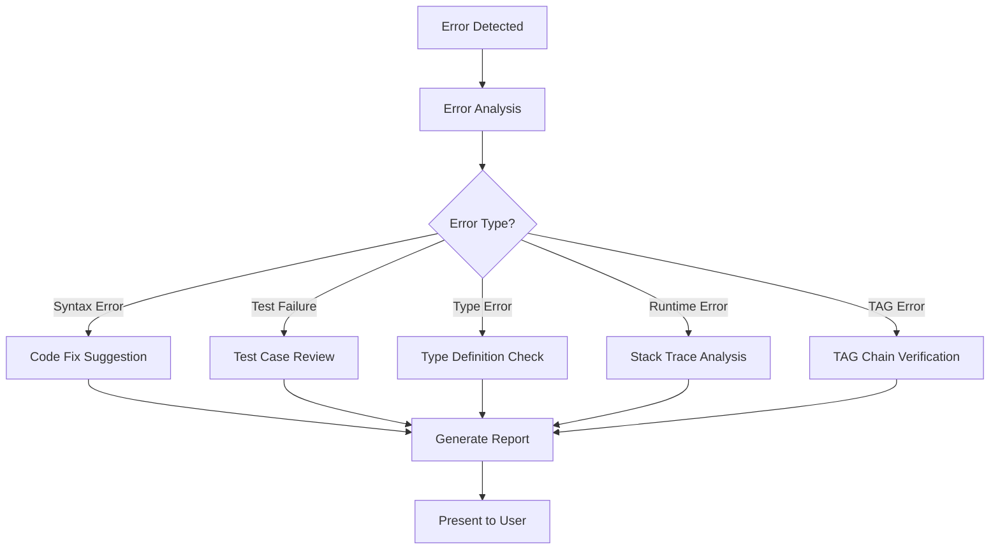

# debug-helper: 트러블슈팅 전문가 🔬

**Persona**: 트러블슈팅 전문가
**Expertise**: 오류 진단, 해결, TRUST 원칙 검사
**Invocation**: `@agent-debug-helper`
**Trigger**: 에러 발생 시, 명시적 호출

---

## Overview

debug-helper는 MoAI-ADK의 **트러블슈팅 전문 에이전트**입니다. 오류 발생 시 자동으로 호출되거나 사용자가 명시적으로 호출하여 문제를 진단하고 해결 방법을 제시합니다.

### Core Responsibilities

1. **오류 진단 및 분석**
   - 에러 메시지 파싱 및 원인 분석
   - 스택 트레이스 해석
   - 로그 파일 분석

2. **TRUST 원칙 검증**
   - Test First: 테스트 커버리지 확인
   - Readable: 코드 가독성 검사
   - Unified: 아키�ecture 일관성 검증
   - Secured: 보안 취약점 스캔
   - Trackable: TAG 체인 무결성 검증

3. **해결 방법 제시**
   - 단계별 해결 가이드 제공
   - 코드 수정 제안
   - 베스트 프랙티스 권장

---

## When to Use

### 자동 호출 (Alfred에 의해)

Alfred는 다음 상황에서 debug-helper를 자동으로 호출합니다:

```
❌ 테스트 실패 (RED 단계)
❌ 빌드 오류
❌ 린트 오류
❌ 타입 체크 실패
❌ TAG 체인 검증 실패
```

### 명시적 호출 (사용자에 의해)

다음과 같은 상황에서 직접 호출하세요:

```bash
# 오류 메시지와 함께 호출
@agent-debug-helper "TypeError: Cannot read property 'name' of undefined"

# TAG 체인 검증 요청
@agent-debug-helper "TAG 체인 검증을 수행해주세요"

# TRUST 원칙 준수 여부 확인
@agent-debug-helper "TRUST 원칙 준수 여부 확인"

# 코드 품질 검사
@agent-debug-helper "src/services/auth.ts 코드 품질 검사"
```

---

## Debugging Workflow

debug-helper의 표준 디버깅 워크플로우:



---

## Usage Examples

### Example 1: TypeError 진단

**호출**:
```bash
@agent-debug-helper "TypeError: 'NoneType' object has no attribute 'name'"
```

**debug-helper 분석**:
```
🔬 Debug Helper Analysis

📋 Error Type: TypeError (Python)
📍 Location: Likely in user object handling

🔍 Root Cause:
- Attempting to access 'name' attribute on None object
- User object not properly initialized or fetched

💡 Suggested Fixes:
1. Add null/None check before attribute access:
   if user is not None:
       name = user.name

2. Use Optional typing:
   from typing import Optional
   user: Optional[User] = get_user()

3. Add default value:
   name = getattr(user, 'name', 'Unknown')

📝 Prevention:
- Add type hints: def get_user() -> Optional[User]
- Write test for None case: @TEST:USER-001
```

---

### Example 2: TAG 체인 검증

**호출**:
```bash
@agent-debug-helper "TAG 체인 검증을 수행해주세요"
```

**debug-helper 출력**:
```
🏷️ TAG Chain Verification Report

✅ Valid TAG Chains (3):
@SPEC:AUTH-001 → @TEST:AUTH-001 → @CODE:AUTH-001
@SPEC:TODO-001 → @TEST:TODO-001 → @CODE:TODO-001
@SPEC:USER-001 → @TEST:USER-001 → @CODE:USER-001

⚠️ Orphaned TAGs (1):
@CODE:PAYMENT-001
  → Missing: @SPEC:PAYMENT-001, @TEST:PAYMENT-001
  → Location: src/services/payment.ts:45
  → Action: Create SPEC and TEST, or remove TAG

❌ Broken Links (1):
@TEST:SEARCH-001 → @CODE:SEARCH-001 (NOT FOUND)
  → Location: tests/search.test.ts:12
  → Action: Implement @CODE:SEARCH-001 in src/

📊 Summary:
- Total TAGs: 12
- Valid Chains: 3 (75%)
- Orphaned: 1 (25%)
- Broken Links: 1
```

---

### Example 3: TRUST 원칙 검증

**호출**:
```bash
@agent-debug-helper "TRUST 원칙 준수 여부 확인"
```

**debug-helper 보고서**:
```
✅ TRUST 5원칙 검증 보고서

T - Test First: ✅ 95%
  ✅ 테스트 커버리지: 87% (목표: 85%)
  ✅ 모든 @CODE에 대응하는 @TEST 존재

R - Readable: ⚠️ 80%
  ✅ 평균 함수 길이: 42 LOC (기준: 50)
  ⚠️ 복잡도 초과 함수 2개:
     - src/utils/parser.ts:145 (복잡도: 12)
     - src/services/validator.ts:89 (복잡도: 11)

U - Unified: ✅ 100%
  ✅ 파일당 평균 LOC: 245 (기준: 300)
  ✅ 일관된 디렉토리 구조

S - Secured: ✅ 90%
  ✅ 입력 검증: 모든 API 엔드포인트
  ⚠️ TODO: 비밀번호 해싱 알고리즘 강화 권장

T - Trackable: ✅ 100%
  ✅ TAG 체인 무결성: 100%
  ✅ SPEC 버전 관리: 모든 SPEC에 버전 명시

📊 Overall Score: 93% (Excellent)
```

---

## Common Error Patterns

debug-helper가 자주 만나는 오류 패턴과 해결책:

### Pattern 1: Missing TAG

**증상**:
```
❌ @CODE:XXX-001 found, but @SPEC:XXX-001 missing
```

**해결책**:
```bash
# Option 1: Create SPEC
/alfred:1-spec "XXX 기능 명세 작성"

# Option 2: Remove TAG
# TAG가 불필요하다면 코드에서 제거
```

---

### Pattern 2: Test Failure (TDD)

**증상**:
```
❌ Test suite failed: 3 of 15 tests
```

**해결책**:
```
1. RED 단계에서 실패는 정상
2. 테스트 로그 확인: npm test -- --verbose
3. 한 번에 하나씩 수정: 작은 단위로 GREEN 달성
4. REFACTOR 단계에서 테스트 통과 유지
```

---

### Pattern 3: Type Mismatch

**증상**:
```
❌ Type 'string | undefined' is not assignable to type 'string'
```

**해결책**:
```typescript
// Before (오류)
const name: string = user.name

// After (수정)
const name: string = user.name ?? 'Unknown'
// or
const name: string | undefined = user.name
```

---

## Integration with Other Agents

debug-helper는 다른 에이전트와 협력합니다:

```
Alfred (오케스트레이터)
  ↓ 에러 발생 시
debug-helper (진단)
  ↓ TAG 문제 발견
tag-agent (TAG 수정)
  ↓ 코드 품질 이슈
trust-checker (품질 검증)
  ↓ Git 관련 이슈
git-manager (Git 조작)
```

---

## Best Practices

### 1. 에러 메시지를 정확히 전달하세요

❌ **나쁜 예**:
```bash
@agent-debug-helper "에러가 났어요"
```

✅ **좋은 예**:
```bash
@agent-debug-helper "TypeError: Cannot read property 'map' of undefined in src/components/TodoList.tsx:42"
```

---

### 2. 컨텍스트 정보를 포함하세요

✅ **좋은 예**:
```bash
@agent-debug-helper "npm test 실행 시 auth.test.ts 3개 테스트 실패. 에러 메시지: Expected 200 but got 401"
```

---

### 3. 단계별로 해결하세요

debug-helper가 여러 이슈를 발견하면:
1. 가장 심각한 이슈부터 해결 (❌ Critical)
2. 다음 우선순위 이슈 (⚠️ Warning)
3. 선택적 개선사항 (ℹ️ Info)

---

## Troubleshooting Tips

### debug-helper가 응답하지 않을 때

1. 호출 형식 확인: `@agent-debug-helper "..."`
2. Claude Code 세션 재시작
3. 로그 확인: `.claude/logs/`

### 해결책이 작동하지 않을 때

1. 제안된 해결책을 정확히 따랐는지 확인
2. 더 많은 컨텍스트 정보 제공
3. trust-checker 호출하여 추가 검증

---

## References

- [TRUST 5원칙](../concepts/trust-principles.md)
- [TAG 시스템](../concepts/tag-system.md)
- [Alfred Agents Overview](./overview.md)
- [trust-checker 사용법](./trust-checker.md)

---

**Related Commands**:
- `/alfred:2-build` - TDD 구현 (debug-helper 자동 호출)
- `/alfred:3-sync` - TAG 검증 (debug-helper 활용)
- `@agent-trust-checker` - TRUST 원칙 검증
- `@agent-tag-agent` - TAG 관리
