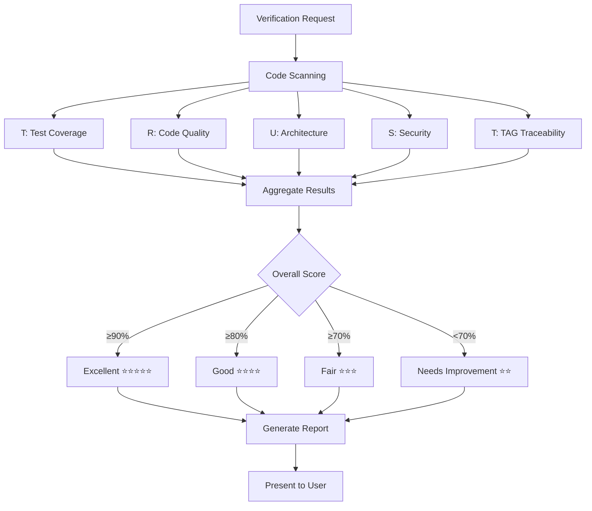

# trust-checker: 품질 보증 리드 ✅

**Persona**: 품질 보증 리드 (QA Lead)
**Expertise**: TRUST 검증, 성능, 보안, 통합 품질 관리
**Invocation**: `@agent-trust-checker`
**Trigger**: 검증 요청 시, `/alfred:3-sync` 실행 시

---

## Overview

trust-checker는 MoAI-ADK의 **품질 보증 전문 에이전트**입니다. TRUST 5원칙을 기반으로 코드 품질, 성능, 보안을 종합적으로 검증하고 개선 방향을 제시합니다.

### Core Responsibilities

1. **TRUST 5원칙 검증**
   - Test First: 테스트 커버리지 및 TDD 준수
   - Readable: 코드 가독성 및 유지보수성
   - Unified: 아키텍처 일관성 및 복잡도
   - Secured: 보안 취약점 및 베스트 프랙티스
   - Trackable: TAG 추적성 및 문서화

2. **통합 품질 관리**
   - 성능 메트릭 수집 및 분석
   - 보안 취약점 스캔
   - 코드 품질 지표 측정

3. **개선 방향 제시**
   - 우선순위 기반 개선 계획
   - 리팩토링 제안
   - 베스트 프랙티스 권장

---

## TRUST 5 Principles

trust-checker가 검증하는 5가지 품질 원칙:

### T - Test First (테스트 우선)

**검증 항목**:
- ✅ 테스트 커버리지 ≥ 85%
- ✅ 모든 `@CODE`에 대응하는 `@TEST` 존재
- ✅ RED-GREEN-REFACTOR 사이클 준수
- ✅ 단위/통합/E2E 테스트 구분

**측정 방법**:
```bash
# 언어별 커버리지 도구
Jest/Vitest (TypeScript)
pytest --cov (Python)
go test -cover (Go)
cargo tarpaulin (Rust)
```

---

### R - Readable (가독성)

**검증 항목**:
- ✅ 함수당 ≤ 50 LOC
- ✅ 파일당 ≤ 300 LOC
- ✅ 복잡도 ≤ 10 (Cyclomatic Complexity)
- ✅ 의도를 드러내는 이름 사용
- ✅ 가드절 우선 사용

**린터 도구**:
```bash
ESLint/Biome (TypeScript)
ruff/pylint (Python)
golint (Go)
clippy (Rust)
```

---

### U - Unified (통합 아키텍처)

**검증 항목**:
- ✅ SPEC 기반 일관된 구조
- ✅ 매개변수 ≤ 5개
- ✅ 언어별 모범 사례 준수
- ✅ 디렉토리 구조 일관성

**아키텍처 패턴**:
- Clean Architecture
- Hexagonal Architecture
- Domain-Driven Design (DDD)

---

### S - Secured (보안)

**검증 항목**:
- ✅ 입력 검증 및 정제
- ✅ 인증/인가 적용
- ✅ 민감 정보 보호
- ✅ 보안 헤더 설정
- ✅ 의존성 취약점 스캔

**보안 도구**:
```bash
npm audit / yarn audit (Node.js)
bandit (Python)
gosec (Go)
cargo audit (Rust)
```

---

### T - Trackable (추적성)

**검증 항목**:
- ✅ TAG 체인 무결성 (`@SPEC → @TEST → @CODE → @DOC`)
- ✅ 고아 TAG 없음
- ✅ SPEC 버전 관리
- ✅ 변경 이력 추적 (HISTORY 섹션)

**TAG 검증**:
```bash
rg '@(SPEC|TEST|CODE|DOC):' -n
```

---

## When to Use

### 자동 호출 (Alfred에 의해)

Alfred는 다음 상황에서 trust-checker를 자동으로 호출합니다:

```
✅ /alfred:3-sync 실행 시 (문서 동기화 후)
✅ /alfred:2-build 완료 시 (구현 완료 후)
✅ PR Ready 전환 시 (Team 모드)
```

### 명시적 호출 (사용자에 의해)

다음과 같은 상황에서 직접 호출하세요:

```bash
# 전체 TRUST 검증
@agent-trust-checker "전체 프로젝트 TRUST 검증"

# 특정 원칙만 검증
@agent-trust-checker "Test First 원칙만 검증"
@agent-trust-checker "보안 취약점 스캔"

# 특정 디렉토리/파일 검증
@agent-trust-checker "src/services/ 디렉토리 품질 검증"
@agent-trust-checker "src/auth/service.ts 코드 리뷰"
```

---

## Verification Workflow

trust-checker의 검증 워크플로우:



---

## Usage Examples

### Example 1: 전체 프로젝트 검증

**호출**:
```bash
@agent-trust-checker "전체 프로젝트 TRUST 검증"
```

**trust-checker 보고서**:
```
✅ TRUST 종합 품질 보고서

━━━━━━━━━━━━━━━━━━━━━━━━━━━━━━━━━━━━━━━━
📊 Overall Score: 87% (Good ⭐⭐⭐⭐)
━━━━━━━━━━━━━━━━━━━━━━━━━━━━━━━━━━━━━━━━

T - Test First: ✅ 95% (Excellent)
━━━━━━━━━━━━━━━━━━━━━━━━━━━━━━━━━━━━━━━━
  ✅ Test Coverage: 87% (Target: 85%)
  ✅ Unit Tests: 145 passed
  ✅ Integration Tests: 23 passed
  ✅ E2E Tests: 8 passed
  ✅ All @CODE has corresponding @TEST

R - Readable: ⚠️ 82% (Good)
━━━━━━━━━━━━━━━━━━━━━━━━━━━━━━━━━━━━━━━━
  ✅ Average Function Length: 42 LOC (Target: ≤50)
  ✅ Average File Length: 245 LOC (Target: ≤300)
  ⚠️ Complex Functions (2):
     - src/utils/parser.ts:145 (CC: 12)
     - src/services/validator.ts:89 (CC: 11)
  💡 Suggestion: Refactor complex functions

U - Unified: ✅ 90% (Excellent)
━━━━━━━━━━━━━━━━━━━━━━━━━━━━━━━━━━━━━━━━
  ✅ Consistent Directory Structure
  ✅ Function Parameters: avg 3.2 (Target: ≤5)
  ✅ SPEC-Based Architecture
  ✅ No Duplicate Code Detected

S - Secured: ⚠️ 75% (Fair)
━━━━━━━━━━━━━━━━━━━━━━━━━━━━━━━━━━━━━━━━
  ✅ Input Validation: All API endpoints
  ✅ Authentication: JWT implemented
  ✅ Authorization: Role-based access control
  ⚠️ Security Headers: Missing CSP
  ⚠️ Dependency Vulnerabilities: 3 low severity
  💡 Suggestion: Run `npm audit fix`

T - Trackable: ✅ 100% (Excellent)
━━━━━━━━━━━━━━━━━━━━━━━━━━━━━━━━━━━━━━━━
  ✅ TAG Chain Integrity: 100%
  ✅ No Orphaned TAGs
  ✅ All SPECs Have Version Numbers
  ✅ HISTORY Sections Complete

━━━━━━━━━━━━━━━━━━━━━━━━━━━━━━━━━━━━━━━━
🎯 Action Items (Priority Order)
━━━━━━━━━━━━━━━━━━━━━━━━━━━━━━━━━━━━━━━━

1. [HIGH] Add Content-Security-Policy header
   File: src/app.ts
   Impact: Security

2. [MEDIUM] Refactor complex functions
   Files: parser.ts:145, validator.ts:89
   Impact: Maintainability

3. [LOW] Update dependencies
   Command: npm audit fix
   Impact: Security (3 low severity)

━━━━━━━━━━━━━━━━━━━━━━━━━━━━━━━━━━━━━━━━
Next Steps:
- Fix HIGH priority items first
- Re-run verification after fixes
- Target: 90%+ overall score
━━━━━━━━━━━━━━━━━━━━━━━━━━━━━━━━━━━━━━━━
```

---

### Example 2: 보안 취약점 스캔

**호출**:
```bash
@agent-trust-checker "보안 취약점 스캔"
```

**trust-checker 출력**:
```
🔒 Security Vulnerability Scan

━━━━━━━━━━━━━━━━━━━━━━━━━━━━━━━━━━━━━━━━
📊 Overall Security Score: 85% (Good)
━━━━━━━━━━━━━━━━━━━━━━━━━━━━━━━━━━━━━━━━

✅ Passed Checks (8):
━━━━━━━━━━━━━━━━━━━━━━━━━━━━━━━━━━━━━━━━
  ✅ SQL Injection Protection: Parameterized queries
  ✅ XSS Protection: Input sanitization enabled
  ✅ CSRF Protection: Token validation
  ✅ Password Hashing: bcrypt (rounds: 12)
  ✅ Secret Management: Environment variables
  ✅ HTTPS Enforcement: All endpoints
  ✅ Rate Limiting: Configured (100 req/15min)
  ✅ Logging: Audit trail enabled

⚠️ Warnings (3):
━━━━━━━━━━━━━━━━━━━━━━━━━━━━━━━━━━━━━━━━
  ⚠️ Missing CSP Header
     Impact: Medium
     Fix: Add Content-Security-Policy header

  ⚠️ Weak JWT Secret
     Impact: Medium
     Fix: Use 256-bit+ random secret

  ⚠️ Debug Mode in Production
     Impact: Low
     Fix: Set NODE_ENV=production

❌ Critical Issues (0):
━━━━━━━━━━━━━━━━━━━━━━━━━━━━━━━━━━━━━━━━
  None found ✅

📦 Dependency Vulnerabilities:
━━━━━━━━━━━━━━━━━━━━━━━━━━━━━━━━━━━━━━━━
  Low:     3 vulnerabilities
  Medium:  0 vulnerabilities
  High:    0 vulnerabilities
  Critical: 0 vulnerabilities

  Run: npm audit fix

━━━━━━━━━━━━━━━━━━━━━━━━━━━━━━━━━━━━━━━━
Recommended Actions:
1. Add CSP header (Medium priority)
2. Rotate JWT secret (Medium priority)
3. Disable debug in production (Low priority)
4. Update vulnerable dependencies (Low priority)
━━━━━━━━━━━━━━━━━━━━━━━━━━━━━━━━━━━━━━━━
```

---

### Example 3: 특정 파일 검증

**호출**:
```bash
@agent-trust-checker "src/services/auth.ts 코드 리뷰"
```

**trust-checker 분석**:
```
📝 Code Review: src/services/auth.ts

━━━━━━━━━━━━━━━━━━━━━━━━━━━━━━━━━━━━━━━━
📊 File Quality Score: 92% (Excellent ⭐⭐⭐⭐⭐)
━━━━━━━━━━━━━━━━━━━━━━━━━━━━━━━━━━━━━━━━

✅ Strengths:
  ✅ Test Coverage: 95% (19/20 lines)
  ✅ Function Length: avg 28 LOC
  ✅ Cyclomatic Complexity: avg 4
  ✅ Clear Function Names
  ✅ Type Safety: 100% typed
  ✅ TAG Present: @CODE:AUTH-001

⚠️ Improvements:
  ⚠️ Line 45: Consider extracting validation logic
     Current: 15 LOC validation in single function
     Suggest: Extract to validateCredentials()

  ⚠️ Line 67: Error handling could be more specific
     Current: catch (error)
     Suggest: catch (error: AuthError | ValidationError)

💡 Suggestions:
  1. Add JSDoc comments for public methods
  2. Consider adding rate limiting decorator
  3. Extract magic numbers to constants

━━━━━━━━━━━━━━━━━━━━━━━━━━━━━━━━━━━━━━━━
TRUST Breakdown:
  T - Test: 95% ✅
  R - Readable: 90% ✅
  U - Unified: 95% ✅
  S - Secured: 85% ⚠️
  T - Trackable: 100% ✅

Overall: Excellent code quality! Minor security improvements recommended.
━━━━━━━━━━━━━━━━━━━━━━━━━━━━━━━━━━━━━━━━
```

---

## Quality Metrics

trust-checker가 측정하는 품질 지표:

### Code Metrics

| Metric | Target | Excellent | Good | Fair | Poor |
|--------|--------|-----------|------|------|------|
| Test Coverage | ≥85% | ≥90% | ≥85% | ≥70% | <70% |
| Cyclomatic Complexity | ≤10 | ≤7 | ≤10 | ≤15 | >15 |
| Function Length | ≤50 LOC | ≤30 | ≤50 | ≤70 | >70 |
| File Length | ≤300 LOC | ≤200 | ≤300 | ≤400 | >400 |
| Parameters | ≤5 | ≤3 | ≤5 | ≤7 | >7 |

### Security Metrics

| Category | Check |
|----------|-------|
| Authentication | JWT, OAuth, Session |
| Authorization | RBAC, ABAC |
| Input Validation | Sanitization, Whitelisting |
| Encryption | TLS, AES, bcrypt |
| Dependencies | Vulnerability scan |

### Performance Metrics

| Metric | Target |
|--------|--------|
| Response Time (API) | <200ms |
| Page Load Time | <2s |
| Time to Interactive | <3s |
| Memory Usage | Stable (no leaks) |

---

## Integration with Other Agents

trust-checker는 다른 에이전트와 협력합니다:

```
Alfred (오케스트레이터)
  ↓ 품질 검증 요청
trust-checker (TRUST 검증)
  ↓ 문제 발견 시
debug-helper (진단 및 해결)
  ↓ TAG 이슈 발견
tag-agent (TAG 수정)
  ↓ 코드 개선 필요
code-builder (리팩토링)
```

---

## Best Practices

### 1. 정기적으로 검증하세요

```bash
# 매일 또는 주간 단위로 실행
@agent-trust-checker "전체 프로젝트 TRUST 검증"
```

### 2. 우선순위 기반으로 개선하세요

1. ❌ Critical → 즉시 수정
2. ⚠️ High → 이번 스프린트
3. ℹ️ Medium → 다음 스프린트
4. 💡 Low → 시간 날 때

### 3. CI/CD에 통합하세요

```yaml
# .github/workflows/quality.yml
name: Quality Check
on: [push, pull_request]
jobs:
  trust-check:
    runs-on: ubuntu-latest
    steps:
      - uses: actions/checkout@v3
      - name: Run TRUST verification
        run: moai trust-check
```

### 4. 지표를 추적하세요

- 주간 TRUST 점수 변화 모니터링
- 목표: 매주 1-2% 개선
- 최종 목표: 90%+ 유지

---

## Troubleshooting

### trust-checker가 너무 엄격할 때

일부 규칙을 비활성화할 수 있습니다:

```json
// .moai/config.json
{
  "trust": {
    "rules": {
      "maxFunctionLength": 70,  // 기본: 50
      "maxComplexity": 12       // 기본: 10
    }
  }
}
```

### 예외 처리 (Waiver)

특정 파일에 대해 예외를 선언할 수 있습니다:

```typescript
// src/legacy/old-code.ts
/* TRUST-WAIVER: Legacy code, scheduled for refactor in Q2 2025 */
```

---

## References

- [TRUST 5원칙 상세 가이드](../concepts/trust-principles.md)
- [TAG 시스템](../concepts/tag-system.md)
- [debug-helper 사용법](./debug-helper.md)
- [Alfred Agents Overview](./overview.md)

---

**Related Commands**:
- `/alfred:2-build` - TDD 구현 (trust-checker 자동 호출)
- `/alfred:3-sync` - 문서 동기화 (trust-checker 활용)
- `@agent-debug-helper` - 오류 진단
- `@agent-tag-agent` - TAG 관리
