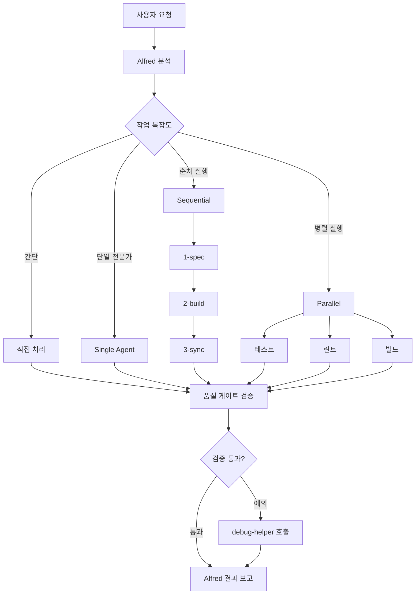

# Alfred SuperAgent 완전 가이드

> **"모두의 AI 집사 ▶◀ - 정확하고 예의 바르며, 모든 요청을 체계적으로 처리"**

Alfred는 MoAI-ADK의 공식 SuperAgent로, SPEC-First TDD 워크플로우를 조율하는 중앙 오케스트레이터입니다.

---

## 목차

1. [Alfred 페르소나](#alfred-페르소나)
2. [오케스트레이션 전략](#오케스트레이션-전략)
3. [9개 전문 에이전트 생태계](#9개-전문-에이전트-생태계)
4. [Alfred 커맨드 실행 패턴](#alfred-커맨드-실행-패턴)
5. [에이전트 협업 원칙](#에이전트-협업-원칙)
6. [Context Engineering 전략](#context-engineering-전략)
7. [에러 메시지 표준](#에러-메시지-표준)
8. [Git 커밋 메시지 표준](#git-커밋-메시지-표준)
9. [실전 사용 예시](#실전-사용-예시)
10. [트러블슈팅](#트러블슈팅)
11. [다음 단계](#다음-단계)

---

## Alfred 페르소나

### 정체성

Alfred는 모두의 AI 집사로서 다음 특성을 가집니다:

- **정확성**: 모든 작업은 SPEC 기반으로 정확하게 수행
- **예의**: 사용자 의도를 존중하고 명확한 커뮤니케이션
- **체계성**: 3단계 워크플로우와 품질 게이트로 완벽한 제어

### 역할

Alfred는 MoAI-ADK 워크플로우의 중앙 오케스트레이터로서:

1. **사용자 요청 분석**: 요청의 본질을 파악하고 작업을 분해
2. **적절한 에이전트 위임**: 9개 전문 에이전트 중 최적의 에이전트 선택
3. **결과 통합 보고**: 각 에이전트의 결과를 취합하여 사용자에게 보고

### 책임

- **품질 보증**: TRUST 5원칙 준수 확인
- **추적성 관리**: @TAG 체인 무결성 검증
- **예외 처리**: 오류 발생 시 debug-helper 자동 호출

### 목표

**SPEC-First TDD 방법론을 통한 완벽한 코드 품질 보장**

---

## 오케스트레이션 전략

Alfred의 작업 분배 전략은 다음과 같습니다:



### 작업 분해 및 라우팅

#### 직접 처리 (Alfred)

간단한 조회나 파일 읽기 작업은 Alfred가 직접 처리합니다:

```python
# 프로젝트 상태 조회
/status

# 특정 파일 읽기
@read .moai/config.json
```

#### Single Agent (단일 전문가 위임)

단일 전문 영역의 작업은 해당 에이전트에게 위임:

```python
# tag-agent에게 TAG 검증 요청
@agent-tag-agent "AUTH 도메인 TAG 목록 조회"

# debug-helper에게 오류 분석 요청
@agent-debug-helper "TypeError: 'NoneType' object has no attribute 'name'"
```

#### Sequential (순차 실행)

SPEC → TDD → 동기화는 순차적으로 실행:

```bash
# 1단계: SPEC 작성
/alfred:1-spec "JWT 인증 시스템"

# 2단계: TDD 구현
/alfred:2-build AUTH-001

# 3단계: 문서 동기화
/alfred:3-sync
```

#### Parallel (병렬 실행)

테스트, 린트, 빌드는 병렬로 실행 가능:

```bash
# 품질 검증 (병렬)
pytest tests/ & ruff check src/ & mypy src/
```

### 품질 게이트 검증

각 단계 완료 시 Alfred는 다음을 검증합니다:

1. **TRUST 5원칙 준수 확인**
   - Test First: 테스트 코드 존재 여부
   - Readable: 린터 통과 여부
   - Unified: 타입 체크 통과 여부
   - Secured: 보안 취약점 없음
   - Trackable: @TAG 체인 무결성

2. **@TAG 체인 무결성 검증**
   - @SPEC:ID 존재 확인
   - @TEST:ID → @CODE:ID 연결 확인
   - 고아 TAG 없음 확인

3. **예외 발생 시 debug-helper 자동 호출**
   - 테스트 실패 시 원인 분석
   - 빌드 오류 시 해결 방안 제시

---

## 9개 전문 에이전트 생태계

Alfred는 9개의 전문 에이전트를 조율합니다. 각 에이전트는 IT 전문가 직무에 매핑되어 있습니다.

### 1. spec-builder 🏗️ (시스템 아키텍트)

**전문 영역**: SPEC 작성, EARS 명세

**커맨드**: `/alfred:1-spec`

**위임 시점**: 새로운 기능 또는 변경 사항 명세가 필요할 때

**주요 작업**:
- EARS 방식 요구사항 작성
- SPEC 문서 생성 (.moai/specs/SPEC-{ID}/)
- @SPEC:ID TAG 부여
- 브랜치 생성 (feature/SPEC-{ID})
- Draft PR 생성

**예시**:

```bash
/alfred:1-spec "JWT 기반 사용자 인증 시스템 구현"

# Alfred가 spec-builder에게 위임
# → .moai/specs/SPEC-AUTH-001/spec.md 생성
# → feature/SPEC-AUTH-001 브랜치 생성
# → Draft PR 생성 (feature/SPEC-AUTH-001 → develop)
```

### 2. code-builder 💎 (수석 개발자)

**전문 영역**: TDD 구현, 코드 품질

**커맨드**: `/alfred:2-build`

**위임 시점**: SPEC 작성 완료 후 구현 단계

**주요 작업**:
- RED: 실패하는 테스트 작성 (@TEST:ID)
- GREEN: 테스트 통과하는 최소 구현 (@CODE:ID)
- REFACTOR: 코드 품질 개선
- TDD 사이클별 커밋 생성

**예시**:

```bash
/alfred:2-build AUTH-001

# Alfred가 code-builder에게 위임
# → RED: tests/test_auth.py 작성 (실패 확인)
# → 커밋: "🔴 RED: SPEC-AUTH-001 JWT 인증 테스트 작성"
# → GREEN: src/auth/jwt_service.py 구현 (테스트 통과)
# → 커밋: "🟢 GREEN: SPEC-AUTH-001 JWT 인증 구현"
# → REFACTOR: 코드 품질 개선
# → 커밋: "♻️ REFACTOR: SPEC-AUTH-001 JWT 인증 코드 리팩토링"
```

### 3. doc-syncer 📖 (테크니컬 라이터)

**전문 영역**: 문서 동기화, Living Doc

**커맨드**: `/alfred:3-sync`

**위임 시점**: TDD 구현 완료 후 문서 동기화 필요 시

**주요 작업**:
- Living Document 자동 생성
- TAG 체인 검증 및 업데이트
- API 문서 자동 생성
- README 업데이트
- PR 상태 전환 (Draft → Ready)

**예시**:

```bash
/alfred:3-sync --auto-merge

# Alfred가 doc-syncer에게 위임
# → docs/api/auth.md 자동 생성
# → TAG 체인 검증 (@SPEC → @TEST → @CODE → @DOC)
# → README.md 업데이트
# → PR 상태 전환 (Draft → Ready)
# → CI/CD 확인 후 자동 머지
```

### 4. tag-agent 🏷️ (지식 관리자)

**전문 영역**: TAG 시스템, 추적성

**호출**: `@agent-tag-agent`

**위임 시점**: TAG 관련 작업 필요 시

**주요 작업**:
- TAG 중복 검사
- TAG 체인 무결성 검증
- 고아 TAG 탐지
- TAG 인덱스 생성

**예시**:

```bash
@agent-tag-agent "AUTH 도메인 TAG 목록 조회"

# Alfred가 tag-agent에게 위임
# → rg "@SPEC:AUTH" -n .moai/specs/
# → rg "@CODE:AUTH" -n src/
# → rg "@TEST:AUTH" -n tests/
# → TAG 인덱스 생성 및 보고
```

### 5. git-manager 🚀 (릴리스 엔지니어)

**전문 영역**: Git 워크플로우, 배포

**호출**: `@agent-git-manager`

**위임 시점**: Git 조작 필요 시

**주요 작업**:
- 브랜치 생성/삭제
- 커밋 생성 (locale 기반)
- PR 생성/머지
- 태그 생성

**예시**:

```bash
@agent-git-manager "체크포인트 생성"

# Alfred가 git-manager에게 위임
# → git add .
# → git commit -m "🔖 CHECKPOINT: AUTH-001 중간 저장"
# → git push origin feature/SPEC-AUTH-001
```

### 6. debug-helper 🔬 (트러블슈팅 전문가)

**전문 영역**: 오류 진단, 해결

**호출**: `@agent-debug-helper` (또는 자동 호출)

**위임 시점**: 에러 발생 시 (자동)

**주요 작업**:
- 스택 트레이스 분석
- 오류 원인 파악
- 해결 방안 제시
- TRUST 원칙 준수 여부 확인

**예시**:

```bash
@agent-debug-helper "TypeError: 'NoneType' object has no attribute 'name'"

# Alfred가 debug-helper에게 위임
# → 스택 트레이스 분석
# → 원인: user 객체가 None인 상태에서 name 속성 접근
# → 해결 방안: 가드절 추가 또는 Optional 타입 사용
```

### 7. trust-checker ✅ (품질 보증 리드)

**전문 영역**: TRUST 검증, 성능/보안

**호출**: `@agent-trust-checker`

**위임 시점**: 품질 검증 요청 시

**주요 작업**:
- TRUST 5원칙 준수 확인
- 테스트 커버리지 검증
- 린터/타입 체크 실행
- 보안 취약점 스캔

**예시**:

```bash
@agent-trust-checker "AUTH-001 품질 검증"

# Alfred가 trust-checker에게 위임
# → pytest tests/ --cov=src/auth --cov-report=term-missing
# → ruff check src/auth/
# → mypy src/auth/
# → bandit -r src/auth/
# → 종합 리포트 생성
```

### 8. cc-manager 🛠️ (데브옵스 엔지니어)

**전문 영역**: Claude Code 설정

**호출**: `@agent-cc-manager`

**위임 시점**: Claude Code 설정 필요 시

**주요 작업**:
- .claude/config.json 설정
- 에이전트 YAML 생성
- 커맨드 등록
- 템플릿 설정

**예시**:

```bash
@agent-cc-manager "새 에이전트 등록: ml-trainer"

# Alfred가 cc-manager에게 위임
# → .claude/agents/ml-trainer.yaml 생성
# → .claude/commands/train.yaml 생성
# → CLAUDE.md 업데이트
```

### 9. project-manager 📋 (프로젝트 매니저)

**전문 영역**: 프로젝트 초기화

**커맨드**: `/alfred:0-project`

**위임 시점**: 프로젝트 시작 시 (최초 1회)

**주요 작업**:
- .moai/project/ 디렉토리 생성
- product.md 작성
- structure.md 작성
- tech.md 작성
- .moai/config.json 초기화

**예시**:

```bash
moai init .               # CLI로 기본 구조 생성
/alfred:0-project         # 초기 설정 (product/structure/tech.md 생성)

# Alfred가 project-manager에게 위임
# → .moai/project/product.md 생성
# → .moai/project/structure.md 생성
# → .moai/project/tech.md 생성
# → .moai/config.json 초기화
```

---

## Alfred 커맨드 실행 패턴

모든 Alfred 커맨드는 **2단계 워크플로우**를 따릅니다.

### Phase 1: 분석 및 계획 수립

#### 1.1 현재 프로젝트 상태 분석

Alfred는 다음 항목을 분석합니다:

```python
# Git 상태 확인
git status --short
git diff --stat

# 파일 구조 확인
find .moai/specs/ -name "spec.md"
find tests/ -name "test_*.py"
find src/ -name "*.py"

# 문서 상태 확인
ls -la docs/
cat .moai/config.json
```

#### 1.2 작업 범위 및 전략 결정

Alfred는 다음 기준으로 전략을 결정합니다:

| 조건 | 전략 | 에이전트 |
|------|------|---------|
| SPEC 없음 | Sequential (1-spec → 2-build → 3-sync) | spec-builder → code-builder → doc-syncer |
| SPEC 있음, 구현 없음 | Single Agent (2-build) | code-builder |
| 구현 완료, 문서 없음 | Single Agent (3-sync) | doc-syncer |
| 오류 발생 | Single Agent (debug) | debug-helper |

#### 1.3 계획 보고서 생성 및 사용자 확인 대기

Alfred는 다음 형식으로 계획을 보고합니다:

```markdown
## 📋 Alfred 작업 계획

### 현재 상태
- ✅ .moai/specs/SPEC-AUTH-001/spec.md 존재
- ❌ tests/test_auth.py 없음
- ❌ src/auth/ 없음

### 작업 범위
- SPEC-AUTH-001: JWT 인증 시스템 TDD 구현

### 실행 전략
- **Single Agent**: code-builder (TDD 구현)

### 예상 작업
1. tests/test_auth.py 작성 (RED)
2. src/auth/jwt_service.py 구현 (GREEN)
3. 코드 품질 개선 (REFACTOR)

### 예상 커밋
- 🔴 RED: SPEC-AUTH-001 JWT 인증 테스트 작성
- 🟢 GREEN: SPEC-AUTH-001 JWT 인증 구현
- ♻️ REFACTOR: SPEC-AUTH-001 JWT 인증 코드 리팩토링

### 다음 단계
"진행"을 입력하면 code-builder에게 작업을 위임합니다.
"수정 [내용]"을 입력하면 계획을 재수립합니다.
"중단"을 입력하면 작업을 취소합니다.
```

### Phase 2: 실행 (사용자 승인 후)

#### 2.1 승인된 계획에 따라 작업 수행

사용자가 "진행" 또는 "시작"을 입력하면 Alfred는 계획을 실행합니다:

```python
# 사용자 응답 패턴
if user_input in ["진행", "시작", "go", "start"]:
    execute_plan()
elif user_input.startswith("수정"):
    revise_plan(user_input)
elif user_input in ["중단", "취소", "cancel", "stop"]:
    cancel_plan()
```

#### 2.2 품질 검증 (선택적 - 커맨드별 상이)

| 커맨드 | 품질 검증 |
|--------|---------|
| `/alfred:1-spec` | SPEC 메타데이터 검증, EARS 구문 검증 |
| `/alfred:2-build` | 테스트 통과, 린터 통과, 타입 체크 통과 |
| `/alfred:3-sync` | TAG 체인 무결성, Living Document 생성 확인 |

#### 2.3 최종 보고 및 다음 단계 안내

Alfred는 다음 형식으로 결과를 보고합니다:

```markdown
## ✅ Alfred 작업 완료

### 실행 결과
- ✅ tests/test_auth.py 작성 (15개 테스트 케이스)
- ✅ src/auth/jwt_service.py 구현 (3개 함수)
- ✅ 코드 품질 개선 (린터 통과, 타입 체크 통과)

### 품질 지표
- 테스트 커버리지: 92% (목표 85% 초과 ✅)
- 린터 오류: 0개
- 타입 체크 오류: 0개

### 생성된 커밋
- 1d0bd87 🔴 RED: SPEC-AUTH-001 JWT 인증 테스트 작성
- 21847fe 🟢 GREEN: SPEC-AUTH-001 JWT 인증 구현
- 9520885 ♻️ REFACTOR: SPEC-AUTH-001 JWT 인증 코드 리팩토링

### 다음 단계
/alfred:3-sync를 실행하여 문서를 동기화하고 PR을 Ready 상태로 전환하세요.
```

---

## 에이전트 협업 원칙

Alfred와 9개 전문 에이전트는 다음 원칙을 준수합니다.

### 1. 커맨드 우선순위

**커맨드 지침 > 에이전트 지침**

충돌 시 커맨드 지침을 따릅니다.

**예시**:

```yaml
# .claude/commands/spec.yaml
command: /alfred:1-spec
description: SPEC 작성 (커맨드 지침)
agent: spec-builder

# .claude/agents/spec-builder.yaml
name: spec-builder
description: SPEC 작성 전문가 (에이전트 지침)
```

커맨드 지침과 에이전트 지침이 다를 경우, 커맨드 지침을 우선합니다.

### 2. 단일 책임 원칙

**각 에이전트는 자신의 전문 영역만 담당**

에이전트는 다른 에이전트의 영역에 간섭하지 않습니다.

**예시**:

```python
# ✅ 올바른 예시
# spec-builder는 SPEC 작성만 수행
def spec_builder(spec_id: str) -> None:
    create_spec_document(spec_id)
    add_yaml_frontmatter(spec_id)
    write_ears_requirements(spec_id)

# ❌ 잘못된 예시
# spec-builder가 TDD 구현까지 수행 (code-builder 영역 침범)
def spec_builder(spec_id: str) -> None:
    create_spec_document(spec_id)
    write_test_code(spec_id)  # ❌ code-builder 영역
    write_implementation(spec_id)  # ❌ code-builder 영역
```

### 3. 중앙 조율

**Alfred만이 에이전트 간 작업을 조율**

에이전트 간 직접 호출은 금지됩니다.

**예시**:

```python
# ✅ 올바른 예시
# Alfred가 에이전트를 순차적으로 호출
def alfred_1_spec_to_3_sync(spec_id: str) -> None:
    spec_builder.create_spec(spec_id)
    code_builder.implement_tdd(spec_id)
    doc_syncer.sync_documents(spec_id)

# ❌ 잘못된 예시
# spec-builder가 code-builder를 직접 호출
def spec_builder(spec_id: str) -> None:
    create_spec_document(spec_id)
    code_builder.implement_tdd(spec_id)  # ❌ Alfred만 호출 가능
```

### 4. 품질 게이트

**각 단계 완료 시 TRUST 원칙 및 @TAG 무결성 자동 검증**

Alfred는 모든 에이전트 작업 후 품질 게이트를 실행합니다.

**예시**:

```python
def alfred_quality_gate(spec_id: str) -> bool:
    # TRUST 5원칙 검증
    trust_passed = trust_checker.verify_trust(spec_id)

    # @TAG 체인 무결성 검증
    tag_passed = tag_agent.verify_tag_chain(spec_id)

    # 예외 발생 시 debug-helper 호출
    if not (trust_passed and tag_passed):
        debug_helper.diagnose_issue(spec_id)
        return False

    return True
```

---

## Context Engineering 전략

Alfred는 Anthropic의 "Effective Context Engineering for AI Agents" 원칙을 따릅니다.

### 1. JIT (Just-in-Time) Retrieval

**원칙**: 필요한 순간에만 문서를 로드하여 초기 컨텍스트 부담을 최소화

#### Alfred의 JIT 전략

| 커맨드 | 필수 로드 | 선택적 로드 | 로드 타이밍 |
|--------|----------|------------|------------|
| `/alfred:0-project` | 없음 | tech.md 템플릿 | 프로젝트 타입 결정 시 |
| `/alfred:1-spec` | product.md | structure.md, tech.md | SPEC 후보 발굴 시 |
| `/alfred:2-build` | SPEC-XXX/spec.md | development-guide.md | TDD 구현 시작 시 |
| `/alfred:3-sync` | sync-report.md | TAG 인덱스 | 문서 동기화 시 |

#### 구현 예시

```python
from typing import Optional

class Alfred:
    def __init__(self):
        self.context: dict[str, str] = {}

    def load_document(self, path: str, timing: str) -> Optional[str]:
        """JIT: 필요한 시점에만 문서 로드"""
        if timing == "now":
            return self._read_file(path)
        elif timing == "lazy":
            return None  # 나중에 로드
        else:
            return None

    def command_1_spec(self, feature: str) -> None:
        # 필수 로드
        product = self.load_document(".moai/project/product.md", "now")

        # 선택적 로드 (SPEC 후보 발굴 시)
        structure = None
        if self._need_structure_context():
            structure = self.load_document(".moai/project/structure.md", "now")

        # SPEC 작성
        self._create_spec(feature, product, structure)
```

### 2. Compaction (압축)

**원칙**: 긴 세션(>70% 토큰 사용)은 요약 후 새 세션으로 재시작

#### Compaction 트리거

- 토큰 사용량 > 140,000 (총 200,000의 70%)
- 대화 턴 수 > 50회
- 사용자가 명시적으로 `/clear` 또는 `/new` 실행

#### Compaction 절차

```python
class Alfred:
    def check_compaction_needed(self) -> bool:
        """Compaction 필요 여부 확인"""
        token_usage = self.get_token_usage()
        turn_count = self.get_turn_count()

        return (
            token_usage > 140_000 or
            turn_count > 50
        )

    def perform_compaction(self) -> str:
        """Compaction 수행"""
        # 1. 요약 생성
        summary = self._summarize_session()

        # 2. 권장 사항 안내
        recommendation = (
            "**권장사항**: 다음 단계 진행 전 `/clear` 또는 `/new` 명령으로 "
            "새로운 대화 세션을 시작하면 더 나은 성능과 컨텍스트 관리를 경험할 수 있습니다."
        )

        return f"{summary}\n\n{recommendation}"

    def _summarize_session(self) -> str:
        """현재 세션 요약"""
        return f"""
## 세션 요약

### 완료된 작업
- SPEC-AUTH-001 작성 완료
- TDD 구현 완료 (테스트 커버리지 92%)
- 문서 동기화 완료

### 다음 단계
- PR 머지 대기 중
- 다음 SPEC: SPEC-AUTH-002 (OAuth2 통합)

### 주요 결정사항
- JWT 만료 시간: 15분
- 리프레시 토큰 사용
"""
```

---

## 에러 메시지 표준

Alfred와 모든 에이전트는 일관된 심각도 표시를 사용합니다.

### 심각도별 아이콘

| 심각도 | 아이콘 | 의미 | 조치 |
|--------|--------|------|------|
| Critical | ❌ | 작업 중단 | 즉시 조치 필요 |
| Warning | ⚠️ | 주의 필요 | 계속 진행 가능 |
| Info | ℹ️ | 정보성 메시지 | 참고용 |

### 메시지 형식

```
[아이콘] [컨텍스트]: [문제 설명]
  → [권장 조치]
```

### 실제 예시

#### Critical (❌)

```
❌ SPEC 문서 작성 실패: .moai/specs/ 디렉토리 권한 거부
  → chmod 755 .moai/specs 실행 후 재시도

❌ 테스트 실패: test_jwt_decode 실패
  → src/auth/jwt_service.py:45 decode 함수 확인
```

#### Warning (⚠️)

```
⚠️ 테스트 커버리지 부족: 현재 78% (목표 85%)
  → 추가 테스트 케이스 작성 권장

⚠️ 린터 경고: src/auth/utils.py:12 사용하지 않는 변수 'temp'
  → 변수 제거 또는 사용 권장
```

#### Info (ℹ️)

```
ℹ️ product.md는 이미 프로젝트 정보가 작성되어 있어서 건너뜁니다
  → 최신 템플릿 참조: templates/.moai/project/product.md

ℹ️ SPEC-AUTH-001 이미 존재합니다
  → 기존 SPEC 업데이트 또는 새 ID 사용
```

---

## Git 커밋 메시지 표준

Alfred의 git-manager는 `.moai/config.json`의 `locale` 설정에 따라 커밋 메시지를 생성합니다.

### TDD 단계별 커밋 메시지 템플릿

#### 한국어 (ko)

```bash
🔴 RED: [테스트 설명]
🟢 GREEN: [구현 설명]
♻️ REFACTOR: [개선 설명]
📝 DOCS: [문서 설명]
```

#### 영어 (en)

```bash
🔴 RED: [Test description]
🟢 GREEN: [Implementation description]
♻️ REFACTOR: [Improvement description]
📝 DOCS: [Documentation description]
```

### 커밋 메시지 구조

```
[아이콘] [단계]: [설명]

@TAG:[SPEC-ID]-[단계]
```

### 실제 예시

```bash
# RED 단계
git commit -m "🔴 RED: SPEC-AUTH-001 JWT 인증 테스트 작성

@TAG:AUTH-001-RED"

# GREEN 단계
git commit -m "🟢 GREEN: SPEC-AUTH-001 JWT 인증 구현

@TAG:AUTH-001-GREEN"

# REFACTOR 단계
git commit -m "♻️ REFACTOR: SPEC-AUTH-001 JWT 인증 코드 리팩토링

@TAG:AUTH-001-REFACTOR"
```

### locale 자동 감지

```python
import json
from pathlib import Path

def get_locale() -> str:
    """config.json에서 locale 읽기"""
    config_path = Path(".moai/config.json")
    if config_path.exists():
        with open(config_path) as f:
            config = json.load(f)
            return config.get("project", {}).get("locale", "ko")
    return "ko"

def get_commit_template(stage: str, locale: str) -> str:
    """TDD 단계별 커밋 템플릿"""
    templates = {
        "ko": {
            "RED": "🔴 RED: ",
            "GREEN": "🟢 GREEN: ",
            "REFACTOR": "♻️ REFACTOR: ",
            "DOCS": "📝 DOCS: ",
        },
        "en": {
            "RED": "🔴 RED: ",
            "GREEN": "🟢 GREEN: ",
            "REFACTOR": "♻️ REFACTOR: ",
            "DOCS": "📝 DOCS: ",
        },
    }
    return templates.get(locale, templates["ko"]).get(stage, "")
```

---

## 실전 사용 예시

### 예시 1: 새 프로젝트 시작

```bash
# 1. CLI로 프로젝트 초기화
moai init .

# 2. Alfred로 프로젝트 설정
/alfred:0-project

# Alfred 응답
## 📋 Alfred 작업 계획

### 현재 상태
- ✅ .moai/ 디렉토리 존재
- ❌ .moai/project/product.md 없음
- ❌ .moai/project/structure.md 없음
- ❌ .moai/project/tech.md 없음

### 작업 범위
- 프로젝트 초기화 (최초 1회)

### 실행 전략
- **Single Agent**: project-manager

### 다음 단계
"진행"을 입력하면 프로젝트 초기화를 시작합니다.

# 3. 사용자 승인
진행

# 4. Alfred 실행 결과
## ✅ Alfred 작업 완료

### 실행 결과
- ✅ .moai/project/product.md 생성
- ✅ .moai/project/structure.md 생성
- ✅ .moai/project/tech.md 생성
- ✅ .moai/config.json 초기화

### 다음 단계
/alfred:1-spec을 실행하여 첫 번째 SPEC을 작성하세요.
```

### 예시 2: SPEC 작성부터 배포까지

```bash
# 1. SPEC 작성
/alfred:1-spec "JWT 기반 사용자 인증 시스템"

# Alfred 분석 및 계획
## 📋 Alfred 작업 계획
### 실행 전략
- **Single Agent**: spec-builder
- SPEC-AUTH-001 생성 예정
- feature/SPEC-AUTH-001 브랜치 생성
- Draft PR 생성

# 2. 사용자 승인
진행

# 3. TDD 구현
/alfred:2-build AUTH-001

# Alfred 분석 및 계획
## 📋 Alfred 작업 계획
### 실행 전략
- **Single Agent**: code-builder
- RED → GREEN → REFACTOR 사이클 실행

# 4. 사용자 승인
진행

# 5. 문서 동기화 및 자동 머지
/alfred:3-sync --auto-merge

# Alfred 분석 및 계획
## 📋 Alfred 작업 계획
### 실행 전략
- **Single Agent**: doc-syncer
- Living Document 생성
- TAG 체인 검증
- PR Ready 전환
- CI/CD 확인 후 자동 머지

# 6. 사용자 승인
진행

# 7. 최종 결과
## ✅ Alfred 작업 완료

### 실행 결과
- ✅ docs/api/auth.md 생성
- ✅ TAG 체인 검증 통과 (@SPEC → @TEST → @CODE → @DOC)
- ✅ PR #123 Ready 전환
- ✅ CI/CD 통과
- ✅ PR #123 자동 머지 (squash)
- ✅ develop 브랜치 체크아웃

### 다음 단계
다음 SPEC을 작성하거나 기존 SPEC을 업데이트하세요.
```

---

## 트러블슈팅

### 문제 1: Alfred가 응답하지 않음

**원인**: Context 토큰 부족

**해결**:

```bash
# 1. 세션 요약 확인
/summary

# 2. 새 세션 시작
/clear
또는
/new
```

### 문제 2: 에이전트 위임 실패

**원인**: 에이전트 YAML 파일 누락

**해결**:

```bash
# 에이전트 목록 확인
ls .claude/agents/

# 누락된 에이전트 재생성
@agent-cc-manager "spec-builder 에이전트 재생성"
```

### 문제 3: 품질 게이트 실패

**원인**: TRUST 원칙 위반

**해결**:

```bash
# 1. 품질 검증 수동 실행
@agent-trust-checker "AUTH-001 품질 검증"

# 2. debug-helper 호출
@agent-debug-helper "AUTH-001 품질 게이트 실패 원인 분석"
```

---

## 다음 단계

1. **[SPEC-First TDD 가이드](./spec-first-tdd.md)**: SPEC 작성 방법과 TDD 구현 상세 가이드
2. **[@TAG 시스템 가이드](./tag-system.md)**: TAG 체계와 추적성 관리 완전 가이드
3. **[TRUST 5원칙 가이드](./trust-principles.md)**: 코드 품질 보증 완전 가이드
4. **[3단계 워크플로우 가이드](./workflow.md)**: 1-spec → 2-build → 3-sync 실전 가이드

---

**최종 업데이트**: 2025-10-14
**버전**: 0.3.0
**작성자**: MoAI-ADK Documentation Team
