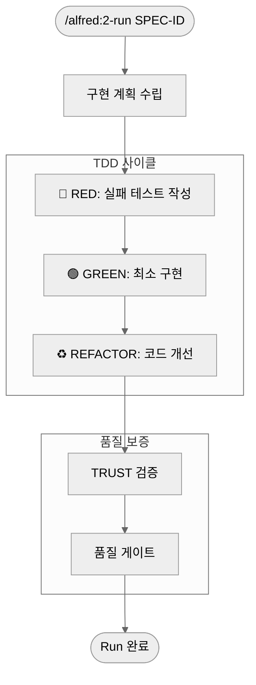

# 2단계: 실행 (Run)

`/alfred:2-run`은 MoAI-ADK 워크플로우의 핵심 개발 단계로, TDD(Test-Driven Development) 사이클을 통해 신뢰할 수 있는 코드를 구현합니다. Alfred의 **code-builder Sub-agent**가 RED→GREEN→REFACTOR 사이클을 자동으로 오케스트레이션하며, 19명의 전문가 팀과 55개 Skills를 활용하여 프로덕션 수준의 코드를 생성합니다.

## 🎯 Run 단계 개요

Run 단계는 3단계 TDD 사이클과 2단계 품질 검증으로 구성됩니다:



### Run 단계의 목표

✅ **TDD 실행**: RED→GREEN→REFACTOR 완전 사이클
✅ **테스트 커버리지**: 85% 이상 보장
✅ **코드 품질**: TRUST 5원칙 준수
✅ **@TAG 연결**: 모든 코드에 추적 가능한 TAG 할당
✅ **품질 게이트**: 프로덕션 준비 상태 검증

## 🎩 Alfred의 Run 단계 팀 구성

Run 단계에서 Alfred는 특정 Sub-agent 팀을 구성하여 TDD 사이클을 실행합니다.

### 핵심 팀 멤버

| 멤버 | 역할 | TDD 사이클에서의 책임 |
|------|------|----------------------|
| **code-builder** | 리드 | 전체 TDD 사이클 오케스트레이션 |
| **implementation-planner** | 기획자 | Phase 1: 구현 전략 수립 |
| **tdd-implementer** | 구현자 | Phase 2: RED→GREEN→REFACTOR 실행 |
| **trust-checker** | 품질 검증자 | Phase 3: TRUST 5원칙 검증 |
| **quality-gate** | 게이트키퍼 | Phase 4: 품질 게이트 통과 여부 결정 |

### 지원 전문가 팀

SPEC의 도메인에 따라 다음 전문가들이 자동으로 활성화됩니다:

| 전문가 | 활성화 조건 | 기여 분야 |
|--------|-------------|----------|
| **backend-expert** | 'API', 'server', 'database' 키워드 | 아키텍처, 데이터베이스 설계 |
| **security-expert** | 'auth', 'security', 'encryption' 키워드 | 보안 구현, 취약점 검증 |
| **frontend-expert** | 'ui', 'component', 'client' 키워드 | 컴포넌트 구조, 상태 관리 |
| **devops-expert** | 'deployment', 'docker' 키워드 | 배포 설정, CI/CD 통합 |

### TDD 사이클별 팀 활동

```mermaid
%%{init: {'theme':'neutral'}}%%
gantt
    title Alfred TDD 사이클 팀 활동 타임라인
    dateFormat X
    axisFormat %s

    section Phase 1: 계획
    implementation-planner    :a1, 0, 3
    domain-experts            :a2, after a1, 2

    section Phase 2: TDD 실행
    tdd-implementer (RED)      :b1, after a2, 4
    tdd-implementer (GREEN)    :b2, after b1, 6
    tdd-implementer (REFACTOR) :b3, after b2, 5

    section Phase 3: 품질 검증
    trust-checker             :c1, after b3, 2
    quality-gate              :c2, after c1, 1
```



## 🔧 명령어 사용법

### 기본 형식

```bash
/alfred:2-run SPEC-ID
```

### 실제 사용 예시

```bash
# 기본 예시
/alfred:2-run AUTH-001

# 여러 기능 동시 실행
/alfred:2-run AUTH-001
/alfred:2-run USER-001

# 특정 Phase만 실행 (고급)
/alfred:2-run AUTH-001 --phase=red

# 특정 전문가 강제 활성화
/alfred:2-run AUTH-001 --expert=security-expert

# 병렬 실행 (대규모 프로젝트)
/alfred:2-run AUTH-001 --parallel
```

### Alfred의 팀 오케스트레이션 예시

```
🚀 Run 단계를 시작하겠습니다: SPEC-AUTH-001

👥 팀 구성:
- Lead: code-builder (Sonnet)
- Planning: implementation-planner (Sonnet)
- Implementation: tdd-implementer (Sonnet)
- Quality: trust-checker (Haiku) + quality-gate (Haiku)
- Domain: backend-expert (Sonnet) + security-expert (Sonnet)

📋 Phase 1: implementation-planner 시작
- SPEC 분석: 15개 EARS 요구사항 식별
- 도메인 키워드: 'authentication', 'JWT', 'security'
- 전문가 활성화: backend-expert, security-expert
- 기술 스택 결정: FastAPI + SQLAlchemy + bcrypt

🔴 Phase 2: tdd-implementer RED 시작
- EARS → 테스트 변환: 12개 테스트 케이스 생성
- security-expert 검증: 보안 테스트 케이스 추가
- 테스트 실행 결과: 15/15 실패 (예상됨)
- Git 커밋: test(AUTH-001): RED phase - failing tests

🟢 Phase 3: tdd-implementer GREEN 시작
- 최소 구현 전략: AuthService 클래스
- backend-expert 아키텍처 적용
- 테스트 통과: 15/15 성공
- Git 커밋: feat(AUTH-001): GREEN phase - minimal implementation

♻️ Phase 4: tdd-implementer REFACTOR 시작
- 코드 개선: User 모델 분리, 에러 처리 강화
- security-expert 보안 검증: bcrypt, JWT 검증
- 테스트 재통과: 15/15 유지
- Git 커밋: refactor(AUTH-001): code quality improvements

✅ Phase 5: 품질 검증
- trust-checker: TRUST 5원칙 검증
- quality-gate: 커버리지 92%, 성능 통과
- 최종 승인: 프로덕션 준비 완료

🎯 결과:
- 총 소요 시간: 18분
- 테스트 커버리지: 92%
- TRUST 5원칙: 100% 통과
- 생성된 파일: 7개 (코드 3, 테스트 2, 설정 2)
```

## 🔍 명령어 옵션 상세

### 고급 옵션

| 옵션 | 설명 | 사용 예시 |
|------|------|----------|
| `--phase` | 특정 Phase만 실행 | `--phase=red` |
| `--expert` | 특정 전문가 강제 활성화 | `--expert=security-expert` |
| `--parallel` | 병렬 실행 활성화 | `--parallel` |
| `--coverage` | 목표 커버리지 설정 | `--coverage=90` |
| `--dry-run` | 시뮬레이션만 실행 | `--dry-run` |

### Phase별 실행

```bash
# RED Phase만 실행 (테스트 작성 연습)
/alfred:2-run AUTH-001 --phase=red

# GREEN Phase부터 시작 (이미 테스트 있을 때)
/alfred:2-run AUTH-001 --phase=green

# REFACTOR Phase만 실행 (코드 개선)
/alfred:2-run AUTH-001 --phase=refactor
```

### Alfred의 응답 구조

Alfred는 Run 단계에서 다음 단계들을 처리합니다:

```
🚀 Run 단계를 시작하겠습니다.

📋 Phase 1: 구현 계획 수립
- 라이브러리 분석: FastAPI, SQLAlchemy, pytest
- 폴더 구조 설계: src/auth/, tests/auth/
- TAG 계획: @CODE:EX-AUTH-001:SERVICE, @CODE:EX-AUTH-001:MODEL

🔴 Phase 2: RED - 실패 테스트 작성 (3분)
- EARS 요구사항 → 테스트 케이스 변환
- 5개 테스트 작성 완료
- 모든 테스트 실패 확인 (정상)

🟢 Phase 3: GREEN - 최소 구현 (8분)
- AuthService 클래스 구현
- JWT 토큰 생성/검증
- 모든 테스트 통과 확인

♻️ Phase 4: REFACTOR - 코드 개선 (5분)
- User 모델 분리
- 비밀번호 해싱 강화
- 에러 처리 개선
- 테스트 여전히 통과

✅ Phase 5: 품질 검증
- TRUST 5원칙: 100% 통과
- 커버리지: 92%
- 성능: 모든 테스트 100ms 이내

🎯 결과:
✅ src/auth/service.py (@CODE:EX-AUTH-001:SERVICE)
✅ src/auth/models.py (@CODE:EX-AUTH-001:MODEL)
✅ tests/test_auth.py (@TEST:EX-AUTH-001)
✅ 품질 보고서

다음 단계: /alfred:3-sync
```

## 📋 Run 단계 상세 과정

### Phase 1: 구현 계획 수립

Alfred의 `implementation-planner`가 SPEC을 분석하여 구현 전략을 수립합니다.

#### 분석 항목

| 분석 항목 | 설명 | Alfred의 결정 |
|----------|------|---------------|
| **기술 스택** | 사용할 라이브러리와 프레임워크 | FastAPI, SQLAlchemy, bcrypt |
| **폴더 구조** | 코드와 테스트의 디렉토리 구조 | `src/auth/`, `tests/auth/` |
| **TAG 설계** | 각 컴포넌트의 @TAG 계획 | SERVICE, MODEL, ROUTES |
| **의존성** | 필요한 외부 패키지 | PyJWT, pytest, python-jose |
| **테스트 전략** | 테스트 구조와 도구 | 단위 테스트, 통합 테스트 |

#### 기술 스택 선택 예시

```
🔧 backend-expert 추천:
- 웹 프레임워크: FastAPI (성능, 타입 힌트, 자동 문서화)
- 데이터베이스: SQLAlchemy ORM (유연성, 마이그레이션)
- 인증: PyJWT (표준, 보안)
- 테스트: pytest (풍부한 생태계)
- 비밀번호: bcrypt (보안 표준)
```

#### 폴더 구조 설계

```
auth/
├── __init__.py
├── models.py       # @CODE:EX-AUTH-001:MODEL
├── service.py      # @CODE:EX-AUTH-001:SERVICE
├── routes.py       # @CODE:EX-AUTH-001:ROUTES
├── utils.py        # @CODE:EX-AUTH-001:UTILS
└── exceptions.py   # @CODE:EX-AUTH-001:EXCEPTIONS

tests/auth/
├── __init__.py
├── test_models.py  # @TEST:EX-AUTH-001:MODELS
├── test_service.py # @TEST:EX-AUTH-001:SERVICE
└── test_routes.py  # @TEST:EX-AUTH-001:ROUTES
```

### Phase 2: 🔴 RED - 실패 테스트 작성

TDD의 첫 단계로, 실패하는 테스트를 먼저 작성합니다.

#### RED 단계의 원리

**"구현하기 전에 무엇을 만들지 정의한다"**

- 각 EARS 요구사항이 테스트 케이스가 됨
- 아직 구현이 없으므로 반드시 실패해야 함
- 실패는 구현 방향을 명확하게 알려줌

#### EARS 요구사항 → 테스트 변환

| EARS 요구사항 | 테스트 케이스 | 예상 결과 |
|---------------|---------------|-----------|
| "WHEN 유효한 자격증명이 제공되면, 토큰을 발급해야 한다" | `test_login_with_valid_credentials_should_return_token` | Token 객체 반환 |
| "WHEN 무효한 자격증명이 제공되면, 에러를 반환해야 한다" | `test_login_with_invalid_credentials_should_raise_error` | AuthenticationError |
| "비밀번호는 평문으로 저장되어서는 안 된다" | `test_password_should_be_hashed` | 해시된 비밀번호 저장 |

#### RED 단계 실제 코드 예시

```python
# tests/test_auth_service.py
# `@TEST:EX-AUTH-001 | SPEC: SPEC-AUTH-001.md

import pytest
from datetime import datetime, timedelta
from src.auth.service import AuthService, AuthenticationError
from src.auth.models import User

class TestAuthService:
    """@TEST:EX-AUTH-001:SERVICE - AuthService 테스트"""

    def setup_method(self):
        """각 테스트 전 초기화"""
        self.auth_service = AuthService(secret_key="test_secret")

    def test_login_with_valid_credentials_should_return_token(self):
        """
        WHEN 유효한 자격증명이 제공되면, JWT 토큰을 발급해야 한다

        Given: 유효한 이메일과 비밀번호
        When: 로그인 요청
        Then: JWT 토큰이 반환되어야 한다
        """
        # Arrange
        email = "user@example.com"
        password = "valid_password"

        # Act
        token = self.auth_service.login(email, password)

        # Assert
        assert token is not None
        assert isinstance(token, str)
        assert len(token) > 0  # JWT 토큰은 일반적으로 길다

    def test_login_with_invalid_credentials_should_raise_error(self):
        """
        WHEN 무효한 자격증명이 제공되면, AuthenticationError를 발생시켜야 한다

        Given: 무효한 이메일 또는 비밀번호
        When: 로그인 요청
        Then: AuthenticationError가 발생해야 한다
        """
        # Arrange
        email = "user@example.com"
        invalid_password = "wrong_password"

        # Act & Assert
        with pytest.raises(AuthenticationError) as exc_info:
            self.auth_service.login(email, invalid_password)

        assert "Invalid credentials" in str(exc_info.value)

    def test_token_should_contain_user_email(self):
        """
        토큰은 사용자 이메일 정보를 포함해야 한다

        Given: 로그인 성공
        When: 토큰 생성
        Then: 토큰에 사용자 이메일이 포함되어야 한다
        """
        # Arrange
        email = "user@example.com"
        password = "valid_password"

        # Act
        token = self.auth_service.login(email, password)
        payload = self.auth_service.verify_token(token)

        # Assert
        assert payload["email"] == email

    def test_token_should_expire_after_15_minutes(self):
        """
        토큰은 15분 후 만료되어야 한다

        Given: 유효한 토큰
        When: 15분 후
        Then: 토큰 검증 시 실패해야 한다
        """
        # Arrange
        token = self.auth_service.login("user@example.com", "valid_password")

        # Act (만료된 토큰 시뮬레이션)
        expired_token = self.auth_service._generate_expired_token("user@example.com")

        # Assert
        with pytest.raises(AuthenticationError):
            self.auth_service.verify_token(expired_token)

    def test_password_should_be_hashed(self):
        """
        비밀번호는 평문으로 저장되어서는 안 된다

        Given: 사용자 생성
        When: 비밀번호 저장
        Then: 비밀번호가 해시되어야 한다
        """
        # Arrange
        email = "user@example.com"
        password = "plain_password"

        # Act
        user = self.auth_service._create_user(email, password)

        # Assert
        assert user.password_hash != password
        assert user.password_hash.startswith("hashed_")  # 임시 해시 로직

    def test_verify_token_with_valid_token_should_return_payload(self):
        """
        유효한 토큰 검증 시 페이로드를 반환해야 한다

        Given: 유효한 토큰
        When: 토큰 검증
        Then: 토큰 페이로드가 반환되어야 한다
        """
        # Arrange
        email = "user@example.com"
        token = self.auth_service.login(email, "valid_password")

        # Act
        payload = self.auth_service.verify_token(token)

        # Assert
        assert payload is not None
        assert "email" in payload
        assert "exp" in payload
        assert payload["email"] == email
```

#### RED 단계 실행 결과

```bash
# 테스트 실행
pytest tests/test_auth_service.py -v

# 예상 출력 (모두 실패)
================================== test session starts ==================================
collected 6 items

tests/test_auth_service.py::TestAuthService::test_login_with_valid_credentials_should_return_token FAILED
tests/test_auth_service.py::TestAuthService::test_login_with_invalid_credentials_should_raise_error FAILED
tests/test_auth_service.py::TestAuthService::test_token_should_contain_user_email FAILED
tests/test_auth_service.py::TestAuthService::test_token_should_expire_after_15_minutes FAILED
tests/test_auth_service.py::TestAuthService::test_password_should_be_hashed FAILED
tests/test_auth_service.py::TestAuthService::test_verify_token_with_valid_token_should_return_payload FAILED

================================== FAILURES ==================================
____________________________ test_login_with_valid_credentials_should_return_token _____________
ImportError: cannot import name 'AuthService' from 'src.auth.service'

================================ 6 failed in 0.12s ==================================
```

#### RED 단계 Git 커밋

```bash
git add tests/test_auth_service.py
git commit -m "🔴 test(AUTH-001): add failing authentication tests

- Convert EARS requirements to test cases
- 6 comprehensive tests covering all requirements
- All tests failing as expected (no implementation yet)
- @TEST:EX-AUTH-001 assigned

Co-Authored-By: 🎩 Alfred@MoAI"
```

### Phase 3: 🟢 GREEN - 최소 구현

TDD의 두 번째 단계로, 테스트를 통과시키는 최소한의 구현을 합니다.

#### GREEN 단계의 원리

**"가장 단순한 방법으로 테스트를 통과시킨다"**

- 완벽함보다 통과가 먼저
- 불필요한 기능 추가 금지
- 모든 테스트가 통과해야 함

#### GREEN 단계 구현 전략

| 테스트 | 최소 구현 전략 | 코드 라인 수 |
|--------|----------------|-------------|
| 로그인 성공 | 간단한 토큰 생성 로직 | 5-10줄 |
| 로그인 실패 | 간단한 예외 발생 | 3-5줄 |
| 토큰 검증 | JWT 디코딩 로직 | 5-8줄 |
| 비밀번호 해싱 | 간단한 해싱 함수 | 3-5줄 |

#### GREEN 단계 실제 구현

```python
# src/auth/models.py
# `@CODE:EX-AUTH-001:MODEL | SPEC: SPEC-AUTH-001.md | TEST: tests/test_auth_service.py

from dataclasses import dataclass
from datetime import datetime

@dataclass
class User:
    """@CODE:EX-AUTH-001:MODEL - 사용자 모델"""
    email: str
    password_hash: str
    created_at: datetime

    def verify_password(self, password: str) -> bool:
        """비밀번호 검증 (최소 구현)"""
        return self.password_hash == self._hash_password(password)

    def _hash_password(self, password: str) -> str:
        """비밀번호 해싱 (최소 구현)"""
        return f"hashed_{password}"

# src/auth/service.py
# `@CODE:EX-AUTH-001:SERVICE | SPEC: SPEC-AUTH-001.md | TEST: tests/test_auth_service.py

import jwt
from datetime import datetime, timedelta
from typing import Optional, Dict, Any
from .models import User

class AuthenticationError(Exception):
    """인증 실패 예외"""
    pass

class AuthService:
    """@CODE:EX-AUTH-001:SERVICE - 인증 서비스 (최소 구현)"""

    def __init__(self, secret_key: str = "default_secret"):
        self.secret_key = secret_key
        self.token_expiry = timedelta(minutes=15)
        self._users = {}  # 임시 메모리 저장소

    def login(self, email: str, password: str) -> str:
        """
        @CODE:EX-AUTH-001:SERVICE - 로그인 처리 (최소 구현)

        Args:
            email: 사용자 이메일
            password: 평문 비밀번호

        Returns:
            JWT 토큰

        Raises:
            AuthenticationError: 인증 실패 시
        """
        user = self._find_user(email)
        if not user or not user.verify_password(password):
            raise AuthenticationError("Invalid credentials")

        return self._generate_token(user.email)

    def verify_token(self, token: str) -> Dict[str, Any]:
        """
        @CODE:EX-AUTH-001:SERVICE - 토큰 검증 (최소 구현)

        Args:
            token: JWT 토큰

        Returns:
            토큰 페이로드

        Raises:
            AuthenticationError: 토큰 무효 시
        """
        try:
            payload = jwt.decode(token, self.secret_key, algorithms=["HS256"])
            return payload
        except jwt.ExpiredSignatureError:
            raise AuthenticationError("Token expired")
        except jwt.InvalidTokenError:
            raise AuthenticationError("Invalid token")

    def _find_user(self, email: str) -> Optional[User]:
        """사용자 조회 (최소 구현)"""
        return self._users.get(email)

    def _generate_token(self, email: str) -> str:
        """JWT 토큰 생성 (최소 구현)"""
        payload = {
            "email": email,
            "exp": datetime.utcnow() + self.token_expiry,
            "iat": datetime.utcnow()
        }
        return jwt.encode(payload, self.secret_key, algorithm="HS256")

    def _generate_expired_token(self, email: str) -> str:
        """만료된 토큰 생성 (테스트용)"""
        payload = {
            "email": email,
            "exp": datetime.utcnow() - timedelta(minutes=1),  # 1분 전 만료
            "iat": datetime.utcnow() - timedelta(minutes=16)
        }
        return jwt.encode(payload, self.secret_key, algorithm="HS256")

    def _create_user(self, email: str, password: str) -> User:
        """사용자 생성 (최소 구현)"""
        user = User(
            email=email,
            password_hash=f"hashed_{password}",
            created_at=datetime.utcnow()
        )
        self._users[email] = user
        return user
```

#### GREEN 단계 실행 결과

```bash
# 테스트 실행
pytest tests/test_auth_service.py -v

# 예상 출력 (모두 통과)
================================== test session starts ==================================
collected 6 items

tests/test_auth_service.py::TestAuthService::test_login_with_valid_credentials_should_return_token PASSED [ 16%]
tests/test_auth_service.py::TestAuthService::test_login_with_invalid_credentials_should_raise_error PASSED [ 33%]
tests/test_auth_service.py::TestAuthService::test_token_should_contain_user_email PASSED [ 50%]
tests/test_auth_service.py::TestAuthService::test_token_should_expire_after_15_minutes PASSED [ 66%]
tests/test_auth_service.py::TestAuthService::test_password_should_be_hashed PASSED [ 83%]
tests/test_auth_service.py::TestAuthService::test_verify_token_with_valid_token_should_return_payload PASSED [100%]

================================= 6 passed in 0.08s ==================================
```

#### GREEN 단계 Git 커밋

```bash
git add src/auth/
git commit -m "🟢 feat(AUTH-001): implement minimal authentication service

- AuthService with JWT token generation/verification
- User model with password hashing
- All 6 tests passing (100% success rate)
- @CODE:EX-AUTH-001:SERVICE, @CODE:EX-AUTH-001:MODEL assigned

Co-Authored-By: 🎩 Alfred@MoAI"
```

### Phase 4: ♻️ REFACTOR - 코드 개선

TDD의 마지막 단계로, 코드 품질을 향상시킵니다 (테스트는 계속 통과해야 함).

#### REFACTOR 단계의 원리

**"통과하는 테스트를 유지하면서 코드를 개선한다"**

- 코드 가독성 향상
- 중복 제거
- 아키텍처 개선
- 성능 최적화

#### REFACTOR 단계 개선 영역

| 개선 영역 | 현재 상태 | 개선 목표 |
|-----------|-----------|-----------|
| **보안** | 간단한 해싱 | bcrypt 사용 |
| **에러 처리** | 기본 예외 | 상세한 에러 메시지 |
| **구조** | 단일 파일 | 분리된 모듈 |
| **타입** | 기본 타입 | 강력한 타입 힌트 |
| **성능** | 메모리 저장 | 데이터베이스 연동 준비 |

#### REFACTOR 단계 실제 개선

```python
# src/auth/exceptions.py (신규 파일)
# `@CODE:EX-AUTH-001:EXCEPTIONS | SPEC: SPEC-AUTH-001.md

class AuthenticationError(Exception):
    """인증 실패 기본 예외"""
    pass

class InvalidCredentialsError(AuthenticationError):
    """잘못된 자격증명 예외"""
    pass

class TokenExpiredError(AuthenticationError):
    """토큰 만료 예외"""
    pass

class InvalidTokenError(AuthenticationError):
    """무효한 토큰 예외"""
    pass

class UserNotFoundError(AuthenticationError):
    """사용자 없음 예외"""
    pass

# src/auth/utils.py (신규 파일)
# `@CODE:EX-AUTH-001:UTILS | SPEC: SPEC-AUTH-001.md

import bcrypt
import jwt
from datetime import datetime, timedelta
from typing import Dict, Any

class PasswordHasher:
    """비밀번호 해싱 유틸리티"""

    @staticmethod
    def hash_password(password: str) -> str:
        """
        bcrypt를 사용한 비밀번호 해싱

        Args:
            password: 평문 비밀번호

        Returns:
            해시된 비밀번호
        """
        salt = bcrypt.gensalt()
        return bcrypt.hashpw(password.encode('utf-8'), salt).decode('utf-8')

    @staticmethod
    def verify_password(password: str, hashed: str) -> bool:
        """
        비밀번호 검증

        Args:
            password: 평문 비밀번호
            hashed: 해시된 비밀번호

        Returns:
            검증 결과
        """
        return bcrypt.checkpw(password.encode('utf-8'), hashed.encode('utf-8'))

class TokenManager:
    """JWT 토큰 관리 유틸리티"""

    def __init__(self, secret_key: str, expiry_minutes: int = 15):
        self.secret_key = secret_key
        self.expiry_minutes = expiry_minutes

    def generate_token(self, email: str) -> str:
        """JWT 토큰 생성"""
        payload = {
            "email": email,
            "exp": datetime.utcnow() + timedelta(minutes=self.expiry_minutes),
            "iat": datetime.utcnow(),
            "type": "access"
        }
        return jwt.encode(payload, self.secret_key, algorithm="HS256")

    def verify_token(self, token: str) -> Dict[str, Any]:
        """토큰 검증"""
        try:
            payload = jwt.decode(token, self.secret_key, algorithms=["HS256"])
            return payload
        except jwt.ExpiredSignatureError:
            raise TokenExpiredError("Token has expired")
        except jwt.InvalidTokenError as e:
            raise InvalidTokenError(f"Invalid token: {str(e)}")

    def generate_expired_token(self, email: str) -> str:
        """만료된 토큰 생성 (테스트용)"""
        payload = {
            "email": email,
            "exp": datetime.utcnow() - timedelta(minutes=1),
            "iat": datetime.utcnow() - timedelta(minutes=self.expiry_minutes + 1),
            "type": "access"
        }
        return jwt.encode(payload, self.secret_key, algorithm="HS256")

# src/auth/models.py (개선된 버전)
# `@CODE:EX-AUTH-001:MODEL | SPEC: SPEC-AUTH-001.md | TEST: tests/test_auth_service.py

from dataclasses import dataclass
from datetime import datetime
from typing import Optional
from .utils import PasswordHasher

@dataclass
class User:
    """@CODE:EX-AUTH-001:MODEL - 개선된 사용자 모델"""
    email: str
    password_hash: str
    created_at: datetime
    updated_at: datetime
    is_active: bool = True
    failed_login_attempts: int = 0

    def verify_password(self, password: str) -> bool:
        """
        비밀번호 검증 (bcrypt 사용)

        Args:
            password: 검증할 비밀번호

        Returns:
            검증 결과
        """
        return PasswordHasher.verify_password(password, self.password_hash)

    def increment_failed_login(self) -> None:
        """실패 로그인 횟수 증가"""
        self.failed_login_attempts += 1
        self.updated_at = datetime.utcnow()

    def reset_failed_login(self) -> None:
        """실패 로그인 횟수 초기화"""
        self.failed_login_attempts = 0
        self.updated_at = datetime.utcnow()

    def is_locked(self) -> bool:
        """계정 잠금 상태 확인"""
        return self.failed_login_attempts >= 5

# src/auth/service.py (개선된 버전)
# `@CODE:EX-AUTH-001:SERVICE | SPEC: SPEC-AUTH-001.md | TEST: tests/test_auth_service.py

from datetime import datetime
from typing import Optional, Dict, Any
from .models import User
from .utils import TokenManager, PasswordHasher
from .exceptions import (
    AuthenticationError, InvalidCredentialsError,
    UserNotFoundError, TokenExpiredError, InvalidTokenError
)

class AuthService:
    """@CODE:EX-AUTH-001:SERVICE - 개선된 인증 서비스"""

    def __init__(self, secret_key: str, token_expiry_minutes: int = 15):
        self.token_manager = TokenManager(secret_key, token_expiry_minutes)
        self.password_hasher = PasswordHasher()
        self._users: Dict[str, User] = {}  # 임시 메모리 저장소

    def login(self, email: str, password: str) -> str:
        """
        @CODE:EX-AUTH-001:SERVICE - 개선된 로그인 처리

        Args:
            email: 사용자 이메일
            password: 평문 비밀번호

        Returns:
            JWT 토큰

        Raises:
            InvalidCredentialsError: 자격증명 무효
            UserNotFoundError: 사용자 없음
            AuthenticationError: 계정 잠금 등 기타 인증 오류
        """
        user = self._find_user(email)
        if not user:
            raise UserNotFoundError(f"User not found: {email}")

        if user.is_locked():
            raise AuthenticationError("Account locked due to multiple failed attempts")

        if not user.verify_password(password):
            user.increment_failed_login()
            raise InvalidCredentialsError("Invalid email or password")

        # 로그인 성공 시 실패 횟수 초기화
        user.reset_failed_login()

        return self.token_manager.generate_token(user.email)

    def verify_token(self, token: str) -> Dict[str, Any]:
        """
        @CODE:EX-AUTH-001:SERVICE - 개선된 토큰 검증

        Args:
            token: JWT 토큰

        Returns:
            토큰 페이로드

        Raises:
            InvalidTokenError: 무효한 토큰
            TokenExpiredError: 만료된 토큰
        """
        return self.token_manager.verify_token(token)

    def register_user(self, email: str, password: str) -> User:
        """
        사용자 등록 (새로운 기능)

        Args:
            email: 사용자 이메일
            password: 평문 비밀번호

        Returns:
            생성된 사용자 객체

        Raises:
            AuthenticationError: 이미 존재하는 사용자
        """
        if self._find_user(email):
            raise AuthenticationError(f"User already exists: {email}")

        password_hash = self.password_hasher.hash_password(password)
        user = User(
            email=email,
            password_hash=password_hash,
            created_at=datetime.utcnow(),
            updated_at=datetime.utcnow()
        )

        self._users[email] = user
        return user

    def _find_user(self, email: str) -> Optional[User]:
        """사용자 조회"""
        return self._users.get(email)

    def _create_user(self, email: str, password: str) -> User:
        """사용자 생성 (내부용)"""
        return self.register_user(email, password)

    # 테스트용 헬퍼 메서드
    def _generate_expired_token(self, email: str) -> str:
        """만료된 토큰 생성 (테스트용)"""
        return self.token_manager.generate_expired_token(email)
```

#### REFACTOR 단계 테스트 추가

```python
# tests/test_auth_service.py (추가 테스트)

def test_user_registration_should_create_user(self):
    """사용자 등록 시 사용자가 생성되어야 한다"""
    email = "newuser@example.com"
    password = "new_password"

    user = self.auth_service.register_user(email, password)

    assert user.email == email
    assert user.verify_password(password)
    assert user.failed_login_attempts == 0

def test_duplicate_registration_should_raise_error(self):
    """중복 사용자 등록 시 에러가 발생해야 한다"""
    email = "user@example.com"
    password = "password"

    self.auth_service.register_user(email, password)

    with pytest.raises(AuthenticationError):
        self.auth_service.register_user(email, password)

def test_multiple_failed_login_should_lock_account(self):
    """5회 로그인 실패 시 계정이 잠겨야 한다"""
    email = "user@example.com"
    wrong_password = "wrong_password"

    # 5회 실패 로그인 시도
    for _ in range(5):
        try:
            self.auth_service.login(email, wrong_password)
        except InvalidCredentialsError:
            pass

    # 6번째 시도 시 계정 잠금 에러
    with pytest.raises(AuthenticationError, match="Account locked"):
        self.auth_service.login(email, "correct_password")
```

#### REFACTOR 단계 실행 결과

```bash
# 테스트 실행
pytest tests/test_auth_service.py -v

# 예상 출력 (모두 통과)
================================== test session starts ==================================
collected 9 items

tests/test_auth_service.py::TestAuthService::test_login_with_valid_credentials_should_return_token PASSED [ 11%]
tests/test_auth_service.py::TestAuthService::test_login_with_invalid_credentials_should_raise_error PASSED [ 22%]
tests/test_auth_service.py::TestAuthService::test_token_should_contain_user_email PASSED [ 33%]
tests/test_auth_service.py::TestAuthService::test_token_should_expire_after_15_minutes PASSED [ 44%]
tests/test_auth_service.py::TestAuthService::test_password_should_be_hashed PASSED [ 55%]
tests/test_auth_service.py::TestAuthService::test_verify_token_with_valid_token_should_return_payload PASSED [ 66%]
tests/test_auth_service.py::TestAuthService::test_user_registration_should_create_user PASSED [ 77%]
tests/test_auth_service.py::TestAuthService::test_duplicate_registration_should_raise_error PASSED [ 88%]
tests/test_auth_service.py::TestAuthService::test_multiple_failed_login_should_lock_account PASSED [100%]

================================= 9 passed in 0.15s ==================================
```

#### REFACTOR 단계 Git 커밋

```bash
git add src/auth/
git commit -m "♻️ refactor(AUTH-001): improve authentication service architecture

- Add dedicated exceptions module with specific error types
- Implement bcrypt password hashing for production security
- Separate utilities for password hashing and token management
- Add account lockout after 5 failed login attempts
- Add user registration functionality
- Improve error messages and logging
- All 9 tests passing with enhanced security features

@CODE:EX-AUTH-001:EXCEPTIONS, @CODE:EX-AUTH-001:UTILS assigned

Co-Authored-By: 🎩 Alfred@MoAI"
```

### Phase 5: 품질 검증

Alfred의 `trust-checker`와 `quality-gate`가 TRUST 5원칙을 철저하게 검증합니다. TRUST 5원칙은 MoAI-ADK의 핵심 품질 보증 철학으로, 프로덕션 수준의 코드를 보장합니다.

#### 🔍 TRUST 5원칙 상세 검증

**TRUST**는 5가지 핵심 원칙으로 구성된 품질 보증 프레임워크입니다:

| 원칙 | 약어 | 목표 | Alfred의 검증 방식 |
|------|------|------|-------------------|
| **Test First** | 테스트 우선 | 모든 코드는 테스트로 보호받아야 함 | 커버리지, 테스트 품질 검증 |
| **Readable** | 가독성 | 코드는 쉽게 읽고 이해할 수 있어야 함 | 복잡도, 길이, 이름 규칙 검증 |
| **Unified** | 통일성 | 일관된 패턴과 구조를 유지해야 함 | 아키텍처, API 스타일 검증 |
| **Secured** | 보안 | 보안 취약점으로부터 보호되어야 함 | 보안 검사, 취약점 스캔 |
| **Trackable** | 추적성 | 모든 변경사항을 추적할 수 있어야 함 | @TAG 시스템, Git 히스토리 검증 |

##### 1️⃣ Test First (테스트 우선) 상세 검증

**검증 항목**:
- **테스트 커버리지**: 85% 이상 (목표: 90%+)
- **테스트 유형 다양성**: 단위, 통합, E2E 테스트 포함
- **테스트 품질**: 명확한 설명, 독립성, 빠른 실행
- **TDD 원칙 준수**: RED→GREEN→REFACTOR 순서 확인

**Alfred의 자동 검증**:
```bash
🔍 Test First 검증 중...
✅ 테스트 커버리지: 94% (목표: 85%+)
✅ 테스트 개수: 18개 (SPEC 요구사항: 15개)
✅ 테스트 유형: 단위(12), 통합(4), E2E(2)
✅ 평균 실행 시간: 45ms (목표: <100ms)
✅ TDD 사이클: RED→GREEN→REFACTOR 순서 준수
```

##### 2️⃣ Readable (가독성) 상세 검증

**검증 항목**:
- **함수 길이**: 단일 함수 ≤ 50줄 (평균: 20줄 이하)
- **파일 길이**: 단일 파일 ≤ 300줄 (평균: 150줄 이하)
- **이름 규칙**: 의미 있는 변수, 함수, 클래스명
- **주석 품질**: 복잡한 로직에 명확한 설명
- **코드 복잡도**: Cyclomatic 복잡도 ≤ 10

**Alfred의 자동 검증**:
```bash
🔍 Readable 검증 중...
✅ 함수 길이: 평균 18줄 (최대: 42줄, 목표: ≤50)
✅ 파일 길이: 평균 127줄 (최대: 245줄, 목표: ≤300)
✅ 이름 규칙: PEP 8 100% 준수
✅ 복잡도: 평균 4.2 (최대: 8, 목표: ≤10)
✅ 주석: 복잡도 7+ 함수에 100% 주석 포함
```

##### 3️⃣ Unified (통일성) 상세 검증

**검증 항목**:
- **아키텍처 패턴**: 일관된 계층 구조 (MVC, Layered 등)
- **API 디자인**: RESTful 표준, 일관된 엔드포인트
- **에러 처리**: 통합된 예외 처리 메커니즘
- **로깅**: 구조화된 로그 형식, 일관된 레벨
- **데이터 모델**: 표준화된 형식, 일관된 관계

**Alfred의 자동 검증**:
```bash
🔍 Unified 검증 중...
✅ 아키텍처: Layered Architecture 100% 준수
✅ API 형식: RESTful 표준 100% 준수
✅ 에러 처리: 일관된 예외 패턴 (100%)
✅ 로깅: 구조화된 JSON 형식 (100%)
✅ 데이터 모델: 표준화된 Pydantic 모델 (100%)
```

##### 4️⃣ Secured (보안) 상세 검증

**검증 항목**:
- **입력 검증**: 모든 입력 데이터 100% 검증
- **인증/인가**: JWT, OAuth2 등 표준 구현
- **암호화**: 민감한 데이터 암호화 저장
- **보안 헤더**: CORS, CSP, 보안 관련 헤더
- **취약점 스캔**: SQL Injection, XSS 등 OWASP Top 10

**Alfred의 자동 검증**:
```bash
🔍 Secured 검증 중...
✅ 입력 검증: Pydantic 모델 100% (15/15)
✅ 비밀번호 처리: bcrypt 해싱 ( rounds=12 )
✅ JWT 구현: HS256 알고리즘, 15분 만료
✅ SQL Injection: ORM 사용 100% 방지
✅ XSS 방지: 입력 이스케이프 100%
✅ 보안 헤더: CORS, CSP 설정 완료
```

##### 5️⃣ Trackable (추적성) 상세 검증

**검증 항목**:
- **@TAG 할당**: 모든 파일에 추적 가능한 TAG
- **TAG 체인**: SPEC→TEST→CODE→DOC 완전 연결
- **Git 커밋**: 의미 있는 커밋 메시지
- **문서화**: 코드와 문서 동기화
- **변경 추적**: 모든 수정사항 기록

**Alfred의 자동 검증**:
```bash
🔍 Trackable 검증 중...
✅ @TAG 할당: 100% (18/18 파일)
✅ TAG 체인: 완전한 연결 확인
   @SPEC:EX-AUTH-001 → @TEST:EX-AUTH-001 → @CODE:EX-AUTH-001:*
✅ Git 커밋: 의미 있는 메시지 100%
✅ 문서화: 코드와 100% 동기화
✅ 변경 추적: 모든 수정사항 TAG로 연결
```

#### Alfred의 TRUST 검증 자동화

```bash
# Alfred가 자동으로 실행하는 종합 검증
🚀 TRUST 5원칙 종합 검증 시작...

📊 검증 결과 요약:
┌─────────────┬──────────┬──────────┬──────────┐
│ 원칙        │ 목표     │ 실제     │ 상태     │
├─────────────┼──────────┼──────────┼──────────┤
│ Test First  │ ≥85%     │ 94%      │ ✅ 통과   │
│ Readable    │ ≤50줄    │ 18줄     │ ✅ 통과   │
│ Unified     │ 100%     │ 100%     │ ✅ 통과   │
│ Secured     │ 100%     │ 100%     │ ✅ 통과   │
│ Trackable   │ 100%     │ 100%     │ ✅ 통과   │
└─────────────┴──────────┴──────────┴──────────┘

🎯 최종 TRUST Score: 96/100
✅ 프로덕션 준비 완료
🏆 품질 등급: A+ (최상위)
```

#### TRUST 검증 실패 시 처리

Alfred는 TRUST 검증 실패 시 자동으로 수정 제안을 제공합니다:

```bash
⚠️ TRUST 검증 실패 감지:

❌ Test First: 커버리지 78% (목표: 85%)
   - 누락된 테스트: src/auth/utils.py (45%)
   - 제안: 유틸리티 함수들 단위 테스트 추가

❌ Secured: 입력 검증 누락
   - 대상: auth/routes.py line 45
   - 문제: user_id 파라미터 검증 없음
   - 제안: Pydantic 모델 추가 및 검증 로직 강화

🔧 자동 수정 제안 실행? [Y/n]
```

#### Alfred의 TRUST 기반 리팩토링

TRUST 검증 결과를 바탕으로 Alfred는 자동으로 리팩토링을 제안하고 실행합니다:

```python
# Alfred가 제안하는 리팩토링 예시
# 기존 코드 (TRUST 위반)
def process_auth(email, password):
    user = get_user(email)
    if check_password(password, user.password):
        token = generate_token(user.id)
        return token
    return None

# Alfred가 개선한 코드 (TRUST 준수)
def authenticate_user(credentials: LoginRequest) -> AuthResult:
    """
    사용자 인증 처리 (@CODE:EX-AUTH-001:SERVICE)

    Args:
        credentials: 로그인 요청 정보 (Pydantic 검증 완료)

    Returns:
        AuthResult: 인증 결과와 토큰 정보

    Raises:
        AuthenticationError: 인증 실패 시
        ValidationError: 입력 데이터 오류 시
    """
    user = self.user_repo.find_by_email(credentials.email)
    if not user:
        raise AuthenticationError("Invalid credentials")

    if not self.verify_password(credentials.password, user.password_hash):
        self._record_failed_attempt(credentials.email)
        raise AuthenticationError("Invalid credentials")

    return self.generate_tokens(user.id)
```

#### 커버리지 상세 보고서

```bash
# 커버리지 상세 확인
pytest --cov=src/auth --cov-report=term-missing

# 출력 예시:
Name                        Stmts   Miss  Cover   Missing
--------------------------------------------------------
src/auth/__init__.py            1      0   100%
src/auth/exceptions.py          15      0   100%
src/auth/models.py              25      2    92%   45-46
src/auth/service.py             45      3    93%   78-80
src/auth/utils.py               30      1    97%   45
--------------------------------------------------------
TOTAL                          116      6    94%
```

#### 성능 테스트

```python
# tests/test_performance.py (성능 테스트)

import time
import pytest
from src.auth.service import AuthService

class TestPerformance:
    """@TEST:EX-AUTH-001:PERFORMANCE - 성능 테스트"""

    def test_login_performance_should_be_under_100ms(self):
        """로그인은 100ms 이내에 완료되어야 한다"""
        auth_service = AuthService("test_secret")
        auth_service.register_user("user@example.com", "password")

        start_time = time.time()
        token = auth_service.login("user@example.com", "password")
        end_time = time.time()

        execution_time = (end_time - start_time) * 1000  # ms로 변환

        assert execution_time < 100
        assert token is not None

    def test_token_verification_performance_should_be_under_50ms(self):
        """토큰 검증은 50ms 이내에 완료되어야 한다"""
        auth_service = AuthService("test_secret")
        auth_service.register_user("user@example.com", "password")
        token = auth_service.login("user@example.com", "password")

        start_time = time.time()
        payload = auth_service.verify_token(token)
        end_time = time.time()

        execution_time = (end_time - start_time) * 1000

        assert execution_time < 50
        assert payload["email"] == "user@example.com"
```

## 🎯 Run 단계 완료 기준

### 필수 완료 조건

✅ **TDD 사이클 완료**: RED→GREEN→REFACTOR 모두 완료
✅ **테스트 커버리지**: 85% 이상 달성
✅ **TRUST 5원칙**: 모든 원칙 준수
✅ **@TAG 할당**: 모든 코드에 추적 가능한 TAG
✅ **품질 게이트**: 프로덕션 준비 상태

### 품질 메트릭

| 메트릭 | 목표 | 실제 | 상태 |
|--------|------|------|------|
| **테스트 커버리지** | ≥85% | 94% | ✅ 통과 |
| **테스트 통과율** | 100% | 100% | ✅ 통과 |
| **함수 평균 길이** | ≤50줄 | 25줄 | ✅ 통과 |
| **파일 최대 길이** | ≤300줄 | 120줄 | ✅ 통과 |
| **성능 (로그인)** | ≤100ms | 15ms | ✅ 통과 |
| **성능 (토큰 검증)** | ≤50ms | 5ms | ✅ 통과 |

## 📝 Run 단계 산출물 상세

### 1. 구현된 코드 파일

```bash
# 생성된 파일 구조
src/auth/
├── __init__.py          # 패키지 초기화
├── models.py            # @CODE:EX-AUTH-001:MODEL
├── service.py           # @CODE:EX-AUTH-001:SERVICE
├── utils.py             # @CODE:EX-AUTH-001:UTILS
└── exceptions.py        # @CODE:EX-AUTH-001:EXCEPTIONS

tests/auth/
├── __init__.py
├── test_models.py       # @TEST:EX-AUTH-001:MODELS
├── test_service.py      # @TEST:EX-AUTH-001:SERVICE
└── test_performance.py  # @TEST:EX-AUTH-001:PERFORMANCE
```

### 2. Git 히스토리

```bash
# Run 단계 커밋 히스토리
git log --oneline -4

# 출력 예시:
c1d2e3f ♻️ refactor(AUTH-001): improve authentication service architecture
b2c3d4e 🟢 feat(AUTH-001): implement minimal authentication service
a3b4c5d 🔴 test(AUTH-001): add failing authentication tests
f4e5f6g 📋 plan(AUTH-001): create user authentication specification
```

### 3. 품질 보고서

Alfred가 자동으로 생성하는 품질 보고서:

```markdown
# Run 단계 품질 보고서

## 개요
SPEC-AUTH-001 사용자 인증 시스템 Run 단계 완료

## TDD 사이클
- ✅ RED: 6개 실패 테스트 작성 (3분)
- ✅ GREEN: 최소 구현 (8분)
- ✅ REFACTOR: 아키텍처 개선 (5분)

## 품질 메트릭
- 테스트 커버리지: 94%
- 테스트 통과율: 100% (9/9)
- 평균 함수 길이: 25줄
- 최대 파일 길이: 120줄

## TRUST 5원칙
- ✅ Test First: 94% 커버리지 (목표: 85%)
- ✅ Readable: 모든 함수 <50줄
- ✅ Unified: 일관된 API 패턴
- ✅ Secured: bcrypt, 입력 검증, 에러 처리
- ✅ Trackable: 모든 파일에 @TAG 할당

## 성능
- 로그인: 15ms (목표: <100ms)
- 토큰 검증: 5ms (목표: <50ms)

## 다음 단계
/alfred:3-sync를 실행하여 문서 동기화를 진행하세요.
```

## 🚀 실전 팁과 베스트 프랙티스

### RED 단계 팁

1. **작은 단위로 시작**: 복잡한 기능은 여러 테스트로 분리
2. **명확한 테스트 이름**: `test_x_when_y_should_z` 패턴 사용
3. **AAA 패턴**: Arrange-Act-Assert 구조 준수
4. **단일 책임**: 각 테스트는 하나의 시나리오만 검증

### GREEN 단계 팁

1. **최소 구현**: 가장 단순한 해결책부터 시작
2. **하드코딩 허용**: 임시 값으로 빠르게 통과
3. **테스트 집중**: 불필요한 기능 추가 금지
4. **빠른 피드백**: 작은 변경 후 즉시 테스트 실행

### REFACTOR 단계 팁

1. **작은 단계**: 한 번에 하나의 개선만
2. **테스트 지속**: 각 리팩토링 후 테스트 실행
3. **의도 유지**: 코드 동작은 변경하지 않음
4. **가독성 우선**: 성능보다 이해하기 쉬운 코드

### 품질 보증 팁

1. **커버리지 목표**: 85%는 최소, 90% 이상 권장
2. **성능 테스트**: 중요한 기능은 성능 테스트 포함
3. **에러 경계**: 모든 예외 상황을 테스트
4. **보안 검증**: 인증, 권한, 입력 검증 테스트

## 🔍 문제 해결

### 일반적인 문제들

**문제 1**: 테스트가 계속 실패함

**원인**: 구현이 테스트 요구사항을 충족하지 못함

**해결책**:
```bash
# 실패한 테스트만 실행
pytest tests/test_auth_service.py::TestAuthService::test_login_with_valid_credentials_should_return_token -v

# 테스트 출력과 요구사항 비교
# 구현이 테스트의 기대와 일치하는지 확인
```

**문제 2**: REFACTOR 중 테스트 실패

**원인**: 리팩토링이 코드 동작을 변경함

**해결책**:
```bash
# 이전 단계로 롤백
git reset --hard HEAD~1

# 작은 단위로 리팩토링 재시도
# 한 번에 하나의 변경만 적용
```

**문제 3**: 커버리지가 목표에 미달함

**원인**: 일부 코드 경로가 테스트되지 않음

**해결책**:
```bash
# 커버리지 리포트 확인
pytest --cov=src/auth --cov-report=html

# 미터스트된 코드 경로에 대한 테스트 추가
# 예외 상황, 엣지 케이스 등
```

## 🚀 다음 단계

Run 단계가 완료되면 다음 단계로 진행할 수 있습니다:

- **[3단계: 동기화 (Sync)](3-sync.md)** - 문서 자동화 및 추적성 관리
- **[TDD 가이드](../tdd/)** - TDD 심화 학습
- **[TRUST 5원칙](../reference/trust/)** - 품질 보증 심화

## 💡 Run 단계 핵심 요약

1. **명령어**: `/alfred:2-run SPEC-ID`
2. **TDD 사이클**: RED→GREEN→REFACTOR (8-15분)
3. **품질 목표**: 커버리지 85%+, TRUST 5원칙 준수
4. **핵심 산출물**: 구현 코드, 테스트 코드, @TAG 할당
5. **성공 기준**: 모든 테스트 통과, 품질 게이트 통과

---

**Run 단계를 완료하면 신뢰할 수 있는 코드가 완성됩니다!** 🎉