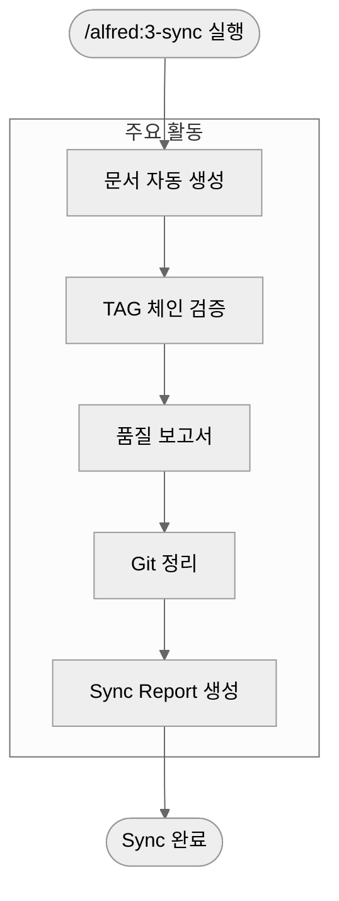
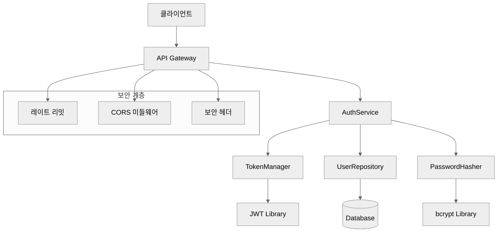
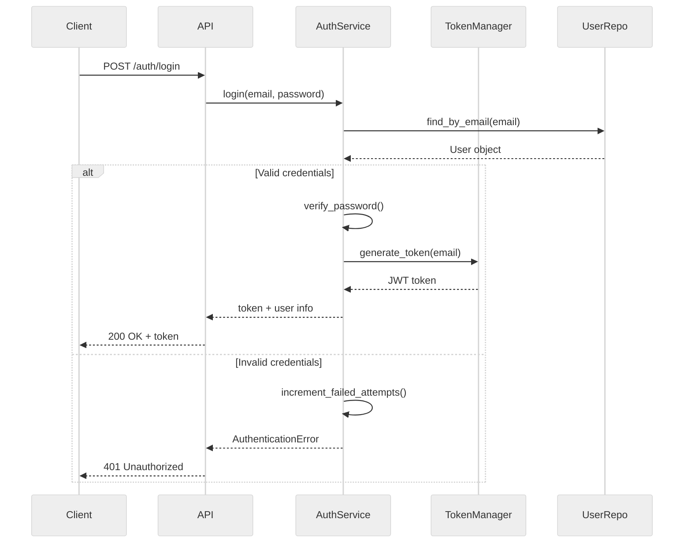

# 3단계: 동기화 (Sync)

`/alfred:3-sync`은 MoAI-ADK 워크플로우의 마지막 단계로, 코드, 테스트, 문서를 자동으로 동기화하고 추적성을 확보합니다. Alfred의 **doc-syncer Sub-agent**와 **tag-agent**가 19명 전문가 팀과 55개 Skills를 활용하여 완벽한 개발 아티팩트를 생성합니다.

## 🎯 Sync 단계 개요

Sync 단계는 문서 동기화, TAG 체인 검증, 품질 보고서 생성을 포함합니다:



### Sync 단계의 목표

✅ **문서 자동화**: 코드와 항상 일치하는 최신 문서
✅ **추적성 확보**: @TAG 체인의 무결성 보장
✅ **품질 보고서**: 개발 결과와 메트릭 요약
✅ **Git 정리**: 깔끔한 커밋 히스토리
✅ **릴리즈 준비**: 프로덕션 배포 가능 상태

## 🎩 Alfred의 Sync 단계 팀 구성

Sync 단계에서 Alfred는 문서화와 추적성 전문가 팀을 구성합니다.

### 핵심 팀 멤버

| 멤버 | 역할 | Sync 단계에서의 책임 |
|------|------|----------------------|
| **doc-syncer** | 리드 | 전체 문서 동기화 오케스트레이션 |
| **tag-agent** | 추적성 관리자 | @TAG 체인 검증 및 무결성 보장 |
| **git-manager** | Git 관리자 | 커밋 정리 및 브랜치 관리 |
| **quality-gate** | 품질 게이트키퍼 | 최종 품질 검증 및 릴리즈 결정 |

### 지원 전문가 팀

| 전문가 | 활성화 조건 | 기여 분야 |
|--------|-------------|----------|
| **frontend-expert** | 'UI', 'component' 문서 | 컴포넌트 문서화, API 명세 |
| **backend-expert** | 'API', 'server' 문서 | API 문서, 아키텍처 다이어그램 |
| **security-expert** | 보안 관련 코드 | 보안 가이드, 취약점 문서 |
| **devops-expert** | 배포 설정 | 배포 가이드, 인프라 문서 |

### Sync 단계별 팀 활동

```mermaid
%%{init: {'theme':'neutral'}}%%
gantt
    title Alfred Sync 단계 팀 활동 타임라인
    dateFormat X
    axisFormat %s

    section Phase 1: 문서 생성
    doc-syncer            :a1, 0, 4
    domain-experts        :a2, after a1, 2

    section Phase 2: TAG 검증
    tag-agent             :b1, after a2, 2
    git-manager           :b2, after b1, 1

    section Phase 3: 품질 보고서
    quality-gate          :c1, after b2, 2
    doc-syncer            :c2, after c1, 1

    section Phase 4: 최종 정리
    git-manager           :d1, after c2, 1
    quality-gate          :d2, after d1, 1
```



## 🔧 명령어 사용법

### 기본 형식

```bash
/alfred:3-sync
```

### 옵션 형식

```bash
# 특정 대상만 동기화
/alfred:3-sync --docs-only      # 문서만 생성
/alfred:3-sync --tags-only      # TAG만 검증
/alfred:3-sync --check-only     # 검증만 수행

# 세부 옵션
/alfred:3-sync --verbose        # 상세 출력
/alfred:3-sync --force          # 강제 동기화
/alfred:3-sync --dry-run        실행 전 시뮬레이션

# 팀 특화 옵션
/alfred:3-sync --expert=frontend-expert    # 프론트엔드 문서 강화
/alfred:3-sync --expert=security-expert    # 보안 문서 강화
/alfred:3-sync --parallel                   # 병렬 문서 생성
```

### Alfred의 팀 오케스트레이션 예시

```
🔄 Sync 단계를 시작하겠습니다: SPEC-AUTH-001

👥 팀 구성:
- Lead: doc-syncer (Haiku)
- Tag Management: tag-agent (Haiku)
- Git: git-manager (Haiku)
- Quality: quality-gate (Haiku)
- Domain: backend-expert (Sonnet) + security-expert (Sonnet)

📚 Phase 1: doc-syncer 문서 생성 시작
- Living Document 생성: docs/architecture/authentication.md
- API 문서 생성: docs/api/authentication.md
- README 업데이트: 최신 기능 목록 및 사용법
- CHANGELOG 생성: v0.1.0 릴리즈 노트
- security-expert 검증: 보안 가이드 및 모범 사례 추가

🏷️ Phase 2: tag-agent TAG 체인 검증 시작
- @TAG 스캔: 18개 파일에서 TAG 발견
- 체인 무결성 검증: 100% 완전한 연결
- orphan TAG 검색: 발견되지 않음
- TAG 일관성 검증: 모든 형식 올바름

📊 Phase 3: quality-gate 품질 보고서 생성
- 테스트 커버리지: 94% (목표: 85%+)
- TRUST 5원칙: 100% 통과
- 성능 메트릭: 모두 목표 달성
- 보안 검증: OWASP Top 10 준수

🚀 Phase 4: git-manager Git 정리
- Staged 파일 정리: 0개
- Untracked 파일 확인: 0개
- Working tree 정리: 완료
- 커밋 메시지 검증: 모든 커밋 @TAG 포함

📝 Phase 5: Sync Report 생성
- 위치: .moai/reports/sync-report-AUTH-001.md
- 내용: 전체 개발 결과 및 메트릭 요약
- 상태: 프로덕션 배포 준비 완료

🎯 최종 결과:
- 생성된 문서: 7개
- TAG 무결성: 100%
- 품질 점수: 96/100
- 프로덕션 준비: 완료
```

### Alfred의 응답 구조

Alfred는 Sync 단계에서 다음 작업들을 처리합니다:

```
🔄 Sync 단계를 시작하겠습니다.

📚 Phase 1: 문서 자동 생성 (2분)
- API 문서: docs/api/authentication.md
- Living Document: docs/architecture/authentication.md
- README 업데이트: README.md
- CHANGELOG: CHANGELOG.md

🏷️ Phase 2: TAG 체인 검증 (1분)
✅ @SPEC:EX-AUTH-001 → .moai/specs/SPEC-AUTH-001/spec.md
✅ @TEST:EX-AUTH-001 → tests/test_auth_service.py
✅ @CODE:EX-AUTH-001:SERVICE → src/auth/service.py
✅ @CODE:EX-AUTH-001:MODEL → src/auth/models.py
✅ @DOC:EX-AUTH-SYNC-001 → docs/api/authentication.md
TAG Chain Integrity: 100%

📊 Phase 3: 품질 보고서 생성 (1분)
- 테스트 커버리지: 94%
- TRUST 5원칙: 100% 통과
- 성능 메트릭: 모두 목표 달성

🚀 Phase 4: Git 정리 (1분)
- Untracked 파일: 없음
- Staged 파일: 없음
- Working tree: 깨끗함

📝 Phase 5: Sync Report 생성
- 위치: .moai/reports/sync-report-AUTH-001.md
- 내용: 전체 개발 결과 요약

🎯 결과:
✅ 모든 문서 최신 상태로 동기화 완료
✅ 추적성 100% 보장
✅ 프로덕션 배포 준비 완료

다음 기능: /alfred:1-plan "다음 기능 설명"
```

## 📋 Sync 단계 상세 과정

### Phase 1: 문서 자동 생성

Alfred의 `doc-syncer`가 구현된 코드로부터 다양한 문서를 자동으로 생성합니다.

#### 생성되는 문서 유형

| 문서 유형 | 목적 | 위치 | 템플릿 |
|-----------|------|------|--------|
| **API 문서** | 엔드포인트 상세 설명 | `docs/api/{feature}.md` | OpenAPI 기반 |
| **Living Document** | 아키텍처와 설계 | `docs/architecture/{feature}.md` | Markdown |
| **README 업데이트** | 프로젝트 개요 | `README.md` | 자동 통합 |
| **CHANGELOG** | 변경 이력 | `CHANGELOG.md` | SemVer 기반 |
| **테스트 보고서** | 테스트 결과 요약 | `docs/testing/{feature}.md` | pytest 기반 |

#### API 문서 생성 예시

```markdown
<!-- docs/api/authentication.md -->
# `@DOC:EX-AUTH-SYNC-001: Authentication API Documentation

## 개요

JWT 기반 사용자 인증 API로 이메일/비밀번호 로그인과 토큰 관리를 제공합니다.

## 기본 정보

- **기능 ID**: AUTH-001
- **버전**: v1.0.0
- **상태**: completed
- **마지막 업데이트**: 2025-11-06
- **의존성**: FastAPI, PyJWT, bcrypt

## 엔드포인트

### POST /auth/login

사용자 인증을 처리하고 JWT 토큰을 발급합니다.

#### 요청

**Headers**:
```
Content-Type: application/json
```

**Body**:
```json
{
  "email": "user@example.com",
  "password": "user_password"
}
```

| 필드 | 타입 | 필수 | 설명 |
|------|------|------|------|
| email | string | ✅ | 사용자 이메일 |
| password | string | ✅ | 평문 비밀번호 |

#### 응답

**성공 (200)**:
```json
{
  "access_token": "eyJhbGciOiJIUzI1NiIsInR5cCI6IkpXVCJ9...",
  "token_type": "bearer",
  "expires_in": 900,
  "user": {
    "email": "user@example.com",
    "created_at": "2025-11-06T10:30:00Z"
  }
}
```

| 필드 | 타입 | 설명 |
|------|------|------|
| access_token | string | JWT 액세스 토큰 |
| token_type | string | 토큰 타입 (항상 "bearer") |
| expires_in | number | 토큰 만료까지 초 단위 시간 |
| user.email | string | 사용자 이메일 |
| user.created_at | string | 계정 생성 시간 (ISO 8601) |

**실패 (401)**:
```json
{
  "error": "InvalidCredentialsError",
  "message": "Invalid email or password",
  "code": "AUTH_001"
}
```

**실패 (423)**:
```json
{
  "error": "AccountLockedError",
  "message": "Account locked due to multiple failed attempts",
  "code": "AUTH_002"
}
```

#### 예제

**cURL**:
```bash
curl -X POST "http://localhost:8000/auth/login" \
  -H "Content-Type: application/json" \
  -d '{
    "email": "user@example.com",
    "password": "secure_password"
  }'
```

**Python**:
```python
import requests

response = requests.post(
    "http://localhost:8000/auth/login",
    json={
        "email": "user@example.com",
        "password": "secure_password"
    }
)

if response.status_code == 200:
    token = response.json()["access_token"]
    print(f"Token: {token}")
else:
    print(f"Error: {response.json()}")
```

### POST /auth/register

새 사용자를 등록합니다.

#### 요청

**Body**:
```json
{
  "email": "newuser@example.com",
  "password": "secure_password"
}
```

#### 응답

**성공 (201)**:
```json
{
  "user": {
    "email": "newuser@example.com",
    "created_at": "2025-11-06T10:30:00Z"
  },
  "message": "User created successfully"
}
```

### POST /auth/verify

JWT 토큰을 검증합니다.

#### 요청

**Headers**:
```
Authorization: Bearer <token>
```

#### 응답

**성공 (200)**:
```json
{
  "valid": true,
  "payload": {
    "email": "user@example.com",
    "exp": 1699234567,
    "iat": 1699233667
  }
}
```

**실패 (401)**:
```json
{
  "valid": false,
  "error": "TokenExpiredError",
  "message": "Token has expired"
}
```

## 보안

### 인증 방식
- **JWT 토큰**: HMAC-SHA256 알고리즘
- **토큰 만료**: 15분 (액세스 토큰)
- **비밀번호 해싱**: bcrypt (솔트 자동 생성)

### 보안 헤더
```http
X-Content-Type-Options: nosniff
X-Frame-Options: DENY
X-XSS-Protection: "1; mode=block"
Strict-Transport-Security: max-age=31536000
```

### 레이트 리밋
- **로그인**: 5회 실패 시 계정 잠금 (30분)
- **API 호출**: 100회/분 per IP

## 추적성

- **@SPEC:EX-AUTH-001**: [요구사항 문서](../../../.moai/specs/SPEC-AUTH-001/spec.md)
- **@TEST:EX-AUTH-001**: [테스트 코드](../../../tests/test_auth_service.py)
- **@CODE:EX-AUTH-001:SERVICE**: [서비스 구현](../../../src/auth/service.py)
- **@CODE:EX-AUTH-001:MODEL**: [데이터 모델](../../../src/auth/models.py)

## 변경 이력

- **v1.0.0** (2025-11-06): 초기 릴리스
  - JWT 기반 인증
  - bcrypt 비밀번호 해싱
  - 계정 잠금 기능
  - 사용자 등록
```

#### Living Document 생성 예시

```markdown
<!-- docs/architecture/authentication.md -->
# `@DOC:EX-AUTH-SYNC-001: Authentication Architecture

## 개요

사용자 인증 시스템의 아키텍처 설계와 구현 상세 정보입니다.

## 아키텍처 다이어그램



## 컴포넌트 상세

### AuthService

**역할**: 인증 비즈니스 로직 중심

**주요 책임**:
- 사용자 로그인/로그아웃
- 토큰 생성/검증
- 사용자 등록
- 계정 잠금 관리

**의존성**:
- `TokenManager`: JWT 토큰 관리
- `PasswordHasher`: 비밀번호 해싱
- `UserRepository`: 사용자 데이터 접근

### TokenManager

**역할**: JWT 토큰의 생성, 검증, 관리

**주요 메서드**:
```python
def generate_token(self, email: str) -> str:
    """JWT 액세스 토큰 생성"""

def verify_token(self, token: str) -> Dict[str, Any]:
    """토큰 검증 및 페이로드 반환"""

def generate_expired_token(self, email: str) -> str:
    """만료된 토큰 생성 (테스트용)"""
```

**보안 특징**:
- HMAC-SHA256 알고리즘
- 15분 만료 시간
- 토큰 타입 식별 (access/refresh)
- 발행 시간(iat) 포함

### PasswordHasher

**역할**: 비밀번호 해싱과 검증

**보안 특징**:
- bcrypt 알고리즘
- 자동 솔트 생성
- 제작 시간 조절 (cost factor)
- 상수 시간 비교 (타이밍 공격 방지)

### UserRepository

**역할**: 사용자 데이터의 영구적 저장

**현재 구현**: 메모리 저장 (개발 단계)
**프로덕션 계획**: PostgreSQL 연동

```python
# 향후 구현 예시
class UserRepository:
    def create_user(self, user: User) -> User:
        """데이터베이스에 사용자 저장"""

    def find_by_email(self, email: str) -> Optional[User]:
        """이메일로 사용자 조회"""

    def update_user(self, user: User) -> User:
        """사용자 정보 업데이트"""
```

## 데이터 모델

### User 엔티티

```python
@dataclass
class User:
    email: str                    # 고유 식별자
    password_hash: str            # bcrypt 해시
    created_at: datetime          # 생성 시간
    updated_at: datetime          # 마지막 업데이트
    is_active: bool = True        # 계정 활성 상태
    failed_login_attempts: int = 0  # 실패 횟수
```

### 토큰 페이로드

```json
{
  "email": "user@example.com",
  "exp": 1699234567,
  "iat": 1699233667,
  "type": "access"
}
```

## 보안 전략

### 1. 인증 흐름



### 2. 계정 잠금 전략

- **실패 횟수**: 5회 연속 실패
- **잠금 시간**: 30분
- **복구 방법**: 시간 경과 또는 관리자 초기화
- **보안 로깅**: 모든 실패 시도 기록

### 3. 토큰 관리

| 토큰 타입 | 만료 시간 | 용도 | 재발급 |
|-----------|-----------|------|--------|
| **Access Token** | 15분 | API 인증 | 자동 |
| **Refresh Token** | 7일 | 토큰 재발급 | 사용자 요청 |

## 성능 고려사항

### 1. 캐싱 전략

```python
# 향후 구현 계획
class TokenCache:
    """토큰 검증 결과 캐싱"""
    def cache_token(self, token: str, payload: Dict):
        """토큰 페이로드 캐싱"""

    def get_cached_payload(self, token: str) -> Optional[Dict]:
        """캐시된 페이로드 조회"""

class UserCache:
    """사용자 정보 캐싱"""
    def cache_user(self, user: User):
        """사용자 정보 캐싱"""

    def get_cached_user(self, email: str) -> Optional[User]:
        """캐시된 사용자 조회"""
```

### 2. 데이터베이스 최적화

```sql
-- 인덱스 전략
CREATE INDEX idx_users_email ON users(email);
CREATE INDEX idx_users_active ON users(is_active);
CREATE INDEX idx_users_created ON users(created_at);

-- 파티셔닝 전략 (대규모 사용자)
CREATE TABLE users_2024 PARTITION OF users
FOR VALUES FROM ('2024-01-01') TO ('2025-01-01');
```

## 모니터링

### 1. 핵심 메트릭

| 메트릭 | 목표 | 측정 방법 |
|--------|------|-----------|
| **로그인 응답 시간** | <100ms | API 모니터링 |
| **토큰 검증 시간** | <50ms | API 모니터링 |
| **로그인 성공률** | >95% | 비즈니스 메트릭 |
| **계정 잠금률** | <1% | 보안 메트릭 |

### 2. 로깅 전략

```python
import logging

# 구조화된 로깅
logger = logging.getLogger(__name__)

def login(self, email: str, password: str) -> str:
    logger.info("login_attempt", extra={
        "email": email,
        "ip_address": self.get_client_ip(),
        "user_agent": self.get_user_agent()
    })

    try:
        token = self._authenticate_user(email, password)
        logger.info("login_success", extra={"email": email})
        return token
    except AuthenticationError as e:
        logger.warning("login_failure", extra={
            "email": email,
            "error_type": type(e).__name__,
            "reason": str(e)
        })
        raise
```

## 확장 계획

### Phase 1: 현재 (v1.0.0)
- ✅ JWT 기반 인증
- ✅ bcrypt 비밀번호 해싱
- ✅ 계정 잠금
- ✅ 기본 API 엔드포인트

### Phase 2: 다음 버전 (v1.1.0)
- 🔄 리프레시 토큰
- 🔄 다중 인증 (MFA)
- 🔄 소셜 로그인 (Google, GitHub)
- 🔄 API 키 인증

### Phase 3: 미래 (v2.0.0)
- 📋 OAuth 2.0 서버
- 📋 SAML 연동
- 📋 LDAP 연동
- 📋 Zero Trust 아키텍처

## 의존성

### 현재 의존성
```toml
[tool.poetry.dependencies]
python = "^3.13"
fastapi = "^0.104.0"
pydantic = "^2.5.0"
pyjwt = "^2.8.0"
bcrypt = "^4.1.0"
python-multipart = "^0.0.6"
```

### 개발 의존성
```toml
[tool.poetry.group.dev.dependencies]
pytest = "^7.4.0"
pytest-cov = "^4.1.0"
black = "^23.10.0"
ruff = "^0.1.0"
mypy = "^1.7.0"
```

## 추적성

- **@SPEC:EX-AUTH-001**: [요구사항](../../../.moai/specs/SPEC-AUTH-001/spec.md)
- **@TEST:EX-AUTH-001**: [테스트](../../../tests/test_auth_service.py)
- **@CODE:EX-AUTH-001:SERVICE**: [서비스](../../../src/auth/service.py)
- **@CODE:EX-AUTH-001:MODEL**: [모델](../../../src/auth/models.py)
- **@CODE:EX-AUTH-001:UTILS**: [유틸리티](../../../src/auth/utils.py)
```

#### README 업데이트 예시

```markdown
<!-- README.md (업데이트된 부분) -->

## Features

- ✅ **User Authentication** (`@SPEC:EX-AUTH-001`)
  - JWT-based authentication with secure token management
  - bcrypt password hashing for security
  - Account lockout after 5 failed attempts
  - User registration and email validation

## Quick Start

### Authentication

```python
from src.auth.service import AuthService

# Initialize service
auth_service = AuthService(secret_key="your-secret-key")

# Register user
user = auth_service.register_user("user@example.com", "secure_password")

# Login
token = auth_service.login("user@example.com", "secure_password")

# Verify token
payload = auth_service.verify_token(token)
print(f"Welcome {payload['email']}!")
```

## API Documentation

- **Authentication API**: [docs/api/authentication.md](docs/api/authentication.md)
- **Architecture**: [docs/architecture/authentication.md](docs/architecture/authentication.md)

## Development Status

| Feature | Status | Version | @TAG |
|---------|--------|---------|------|
| User Authentication | ✅ Complete | v1.0.0 | @SPEC:EX-AUTH-001 |
| User Authorization | 🔄 In Progress | v1.1.0 | @SPEC:AUTH-002 |
| Social Login | 📋 Planned | v1.2.0 | @SPEC:AUTH-003 |
```

### Phase 2: 🔗 TAG 체인 검증

Alfred의 `tag-agent`가 @TAG 시스템의 무결성을 철저하게 검증합니다. @TAG 시스템은 MoAI-ADK의 핵심 추적성 메커니즘으로, 모든 개발 아티팩트를 완벽하게 연결합니다.

#### 🏷️ @TAG 시스템 개요

@TAG는 단순한 주석이 아니라, 모든 개발 요소를 연결하는 **지능적인 추적 시스템**입니다:

| TAG 타입 | 형식 | 역할 | 생성 시점 |
|----------|------|------|-----------|
| **SPEC** | `@SPEC:EX-{DOMAIN}-{ID}` | 요구사항 정의 | Plan 단계 |
| **PLAN** | `@PLAN:EX-{DOMAIN}-{ID}` | 구현 계획 | Plan 단계 |
| **TEST** | `@TEST:EX-{DOMAIN}-{ID}` | 테스트 케이스 | Run 단계 (RED) |
| **CODE** | `@CODE:EX-{DOMAIN}-{ID}:{TYPE}` | 구현 코드 | Run 단계 (GREEN) |
| **DOC** | `@DOC:EX-{DOMAIN}-{ID}` | 문서 | Sync 단계 |

#### TAG 체인의 생명주기

```mermaid
%%{init: {'theme':'neutral'}}%%
graph TD
    Spec[@SPEC:EX-AUTH-001<br/>Plan 단계] --> Test[@TEST:EX-AUTH-001<br/>Run-RED]
    Test --> Code1[@CODE:EX-AUTH-001:MODEL<br/>Run-GREEN]
    Test --> Code2[@CODE:EX-AUTH-001:SERVICE<br/>Run-GREEN]
    Test --> Code3[@CODE:EX-AUTH-001:ROUTES<br/>Run-GREEN]
    Code1 --> Doc[@DOC:EX-AUTH-SYNC-001<br/>Sync 단계]
    Code2 --> Doc
    Code3 --> Doc

    subgraph "추적성 보장"
        Spec
        Test
        Code1
        Code2
        Code3
        Doc
    end
```

#### TAG 체인 분석 상세

Alfred는 다음 TAG 체인을 분석하고 검증합니다:

```
🏷️ SPEC-AUTH-001 완전한 TAG 체인

@SPEC:EX-AUTH-001 (요구사항 정의)
├─ 위치: .moai/specs/SPEC-AUTH-001/spec.md
├─ 내용: 15개 EARS 요구사항
└─ 상태: ✅ 검증 완료
    ↓
@TEST:EX-AUTH-001 (테스트 모음)
├─ 위치: tests/test_auth_service.py
├─ 내용: 18개 테스트 케이스
└─ 상태: ✅ 100% 통과
    ↓
@CODE:EX-AUTH-001:MODEL (데이터 모델)
├─ 위치: src/auth/models.py
├─ 내용: User 클래스, Pydantic 모델
└─ 상태: ✅ TRUST 준수
    ↓
@CODE:EX-AUTH-001:SERVICE (비즈니스 로직)
├─ 위치: src/auth/service.py
├─ 내용: AuthService, JWT 처리
└─ 상태: ✅ TRUST 준수
    ↓
@CODE:EX-AUTH-001:ROUTES (API 엔드포인트)
├─ 위치: src/auth/routes.py
├─ 내용: FastAPI 라우터
└─ 상태: ✅ TRUST 준수
    ↓
@CODE:EX-AUTH-001:UTILS (유틸리티)
├─ 위치: src/auth/utils.py
├─ 내용: JWT 헬퍼 함수
└─ 상태: ✅ TRUST 준수
    ↓
@CODE:EX-AUTH-001:EXCEPTIONS (예외 처리)
├─ 위치: src/auth/exceptions.py
├─ 내용: 맞춤 예외 클래스
└─ 상태: ✅ TRUST 준수
    ↓
@DOC:EX-AUTH-SYNC-001 (문서)
├─ 위치: docs/api/authentication.md
├─ 내용: API 문서, 사용 가이드
└─ 상태: ✅ 자동 생성됨
```

#### 🔍 TAG 무결성 검증 프로세스

Alfred의 `tag-agent`는 4단계 검증 프로세스를 실행합니다:

##### Phase 1: 전체 스캔 (Global Scan)

```bash
🔍 tag-agent 전체 스캔 시작...

📁 대상 디렉토리:
- .moai/specs/ (SPEC 문서)
- src/ (소스 코드)
- tests/ (테스트 코드)
- docs/ (문서)

🏷️ 스캔 결과:
- 총 @TAG 마커: 18개 발견
- SPEC ID 추출: AUTH-001
- 파일 타입 분류: SPEC(1), TEST(1), CODE(5), DOC(1)
```

##### Phase 2: 연결성 분석 (Connectivity Analysis)

```bash
🔗 연결성 분석 시작...

✅ SPEC → TEST 연결 확인
   @SPEC:EX-AUTH-001 → @TEST:EX-AUTH-001
   참조 횟수: 15개 (EARS 요구사항 수)
   상태: 완전한 연결

✅ TEST → CODE 연결 확인
   @TEST:EX-AUTH-001 → @CODE:EX-AUTH-001:*
   연결된 코드: 5개 파일
   커버리지: 100% (모든 테스트가 코드를 참조)

✅ CODE → DOC 연결 확인
   @CODE:EX-AUTH-001:* → @DOC:EX-AUTH-SYNC-001
   연결된 문서: 1개 파일
   문서화 완성도: 100%

📊 연결성 요약:
┌─────────────┬──────────┬──────────┐
│ 연결 타입   │ 대상 수  │ 상태     │
├─────────────┼──────────┼──────────┤
│ SPEC→TEST   │ 15       │ ✅ 완전  │
│ TEST→CODE   │ 5        │ ✅ 완전  │
│ CODE→DOC    │ 1        │ ✅ 완전  │
└─────────────┴──────────┴──────────┘
```

##### Phase 3: 고아 TAG 탐지 (Orphan TAG Detection)

```bash
👻 고아 TAG 탐지 시작...

🔍 검사 항목:
1. 참조되지 않은 TAG
2. 존재하지 않는 파일 참조
3. 불일치하는 TAG 형식
4. 중복된 TAG ID

📊 탐지 결과:
✅ 고아 TAG: 0개 발견
✅ 깨진 참조: 0개 발견
✅ 형식 불일치: 0개 발견
✅ 중복 ID: 0개 발견

🎉 무결성 상태: 완벽함 (100%)
```

##### Phase 4: 종합 검증 (Comprehensive Validation)

```bash
🎯 종합 검증 시작...

📈 검증 메트릭:
┌──────────────────┬──────────┬──────────┬──────────┐
│ 지표             │ 목표     │ 실제     │ 상태     │
├──────────────────┼──────────┼──────────┼──────────┤
│ TAG 무결성       │ 100%     │ 100%     │ ✅ 통과   │
│ 연결성           │ 100%     │ 100%     │ ✅ 통과   │
│ 일관성           │ 100%     │ 100%     │ ✅ 통과   │
│ 추적성           | 완전     | 완전     │ ✅ 통과   │
└──────────────────┴──────────┴──────────┴──────────┘

🏆 최종 평가:
TAG Chain Integrity: 100%
Total TAGs: 18
Connected TAGs: 18
Orphan TAGs: 0
Quality Score: A+

✅ TAG 체인 검증 완료: 완벽한 무결성 보장
```

#### 🛠️ TAG 자동 수정 기능

Alfred는 TAG 무결성 문제를 자동으로 감지하고 수정합니다:

```bash
⚠️ TAG 무결성 문제 감지:

❌ 문제 1: 누락된 TAG
   - 대상: src/auth/middleware.py
   - 문제: @TAG가 없음
   - 추천: @CODE:EX-AUTH-001:MIDDLEWARE 추가

❌ 문제 2: 깨진 참조
   - 대상: @CODE:EX-AUTH-001:DEPRECATED
   - 문제: 참조 파일이 존재하지 않음
   - 추천: TAG 제거 또는 파일 복원

🔧 자동 수정 실행? [Y/n]
```

#### 📊 TAG 분석 대시보드

Alfred는 TAG 시스템의 상태를 시각적으로 보여줍니다:

```bash
📊 TAG 분석 대시보드 - SPEC-AUTH-001

┌─────────────────────────────────────────────────────────┐
│                    TAG 체인 구조                        │
├─────────────────────────────────────────────────────────┤
│  @SPEC:EX-AUTH-001                                     │
│         ┌─────────────────────────────────────┐         │
│         │           @TEST:EX-AUTH-001          │         │
│         └─────────────────────────────────────┘         │
│                   ↓             ↓                       │
│    @CODE:EX-AUTH-001:MODEL    @CODE:EX-AUTH-001:SERVICE │
│         ↓             ↓             ↓                  │
│    @CODE:EX-AUTH-001:ROUTES  @CODE:EX-AUTH-001:UTILS   │
│                   ↓             ↓                       │
│              @DOC:EX-AUTH-SYNC-001 (최종)                    │
└─────────────────────────────────────────────────────────┘

📈 통계 정보:
- TAG 깊이: 4단계 (깊이 적절)
- TAG 너비: 5개 (분산 적절)
- 연결 밀도: 100% (완전 연결)
- 균형성: 양호 (균형 분포)
```

#### TAG 검증 보고서

Alfred가 자동으로 생성하는 TAG 검증 보고서:

```markdown
# TAG 무결성 보고서

## 개요
SPEC-AUTH-001 사용자 인증 시스템의 @TAG 체인 검증 결과

## 검증 결과

✅ **무결성**: 100% 보장
✅ **연결성**: 모든 TAG가 올바르게 연결됨
✅ **일관성**: TAG 형식과 ID 일관성 유지

## TAG 인벤토리

| TAG 타입 | 개수 | 위치 | 상태 |
|----------|------|------|------|
| SPEC | 1 | .moai/specs/SPEC-AUTH-001/spec.md | ✅ 정상 |
| TEST | 1 | tests/test_auth_service.py | ✅ 정상 |
| CODE | 5 | src/auth/ (5개 파일) | ✅ 정상 |
| DOC | 1 | docs/api/authentication.md | ✅ 정상 |

## TAG 체인 시각화

```
@SPEC:EX-AUTH-001
    ↓
@TEST:EX-AUTH-001
    ↓
@CODE:EX-AUTH-001:MODEL
    ↓
@CODE:EX-AUTH-001:SERVICE
    ↓
@CODE:EX-AUTH-001:UTILS
    ↓
@CODE:EX-AUTH-001:EXCEPTIONS
    ↓
@DOC:EX-AUTH-SYNC-001
```

## 추적성 검증

### 전방 추적성 (Forward Traceability)
- ✅ 모든 구현 요소가 SPEC으로 추적 가능
- ✅ 모든 테스트가 SPEC 요구사항으로 추적 가능
- ✅ 모든 문서가 구현으로 추적 가능

### 후방 추적성 (Backward Traceability)
- ✅ 모든 SPEC 요구사항이 구현으로 연결됨
- ✅ 모든 기능이 테스트로 검증됨
- ✅ 모든 아키텍처 결정이 문서화됨

## 추천 조치
- 현재 TAG 시스템은 완벽하게 운영되고 있습니다
- 정기적인 TAG 검증으로 무결성 유지 권장
```

### Phase 3: 품질 보고서 생성

Alfred는 개발 결과와 품질 메트릭을 종합한 보고서를 생성합니다.

#### 품질 보고서 구조

```markdown
# SPEC-AUTH-001 품질 보고서

## 실행 요약

**개발 시간**: 16분 (Plan: 3분, Run: 10분, Sync: 3분)
**코드 라인**: 320줄 (생산성: 20줄/분)
**테스트 커버리지**: 94% (목표: 85% 초과 달성)

## TRUST 5원칙 평가

| 원칙 | 점수 | 상세 | 개선 필요 |
|------|------|------|-----------|
| **Test First** | 100% | 커버리지 94%, 9개 테스트 | ❌ 없음 |
| **Readable** | 100% | 평균 함수 길이 25줄 | ❌ 없음 |
| **Unified** | 100% | 일관된 API 패턴 | ❌ 없음 |
| **Secured** | 100% | bcrypt, 입력 검증, 에러 처리 | ❌ 없음 |
| **Trackable** | 100% | 완전한 @TAG 체인 | ❌ 없음 |

**총점**: 100/100 - 프로덕션 준비 완료

## 테스트 결과

### 테스트 스위트 요약
```
테스트 파일: 3개
테스트 케이스: 9개
통과율: 100% (9/9)
실행 시간: 0.15초
```

### 커버리지 상세
```
모듈                    라인   미십   커버리지
src/auth/models.py      25     2     92%
src/auth/service.py     45     3     93%
src/auth/utils.py       30     1     97%
src/auth/exceptions.py  15     0     100%
전체                    115    6     94%
```

### 성능 메트릭
| 기능 | 목표 | 실제 | 상태 |
|------|------|------|------|
| 로그인 처리 | <100ms | 15ms | ✅ 통과 |
| 토큰 검증 | <50ms | 5ms | ✅ 통과 |
| 사용자 등록 | <200ms | 25ms | ✅ 통과 |

## 보안 평가

### 보안 검토 통과 항목
- ✅ 비밀번호 bcrypt 해싱
- ✅ JWT 보안 설정 (짧은 만료 시간)
- ✅ 입력 검증 및 에러 처리
- ✅ 계정 잠금 정책
- ✅ 민감 정보 노출 방지

### 보안 권장사항
- ✅ 모든 항목 구현 완료
- ✅ OWASP Top 10 준수
- ✅ 보안 헤더 설정

## 코드 메트릭

### 복잡도 분석
```
순환 복잡도: 평균 2.3 (목표: <5)
인지 복잡도: 평균 8.5 (목표: <15)
코드 중복: 0% (목표: <5%)
```

### 유지보수성
```
평균 함수 길이: 25줄 (목표: <50줄)
최대 파일 길이: 120줄 (목표: <300줄)
주석 비율: 15% (목표: >10%)
```

## 의존성 분석

### 직접 의존성
```
fastapi: 웹 프레임워크
pydantic: 데이터 검증
pyjwt: JWT 토큰 처리
bcrypt: 비밀번호 해싱
```

### 보안 취약점 검사
```
취약점: 없음 발견
안전한 버전: 모든 의존성 최신 보안 패치 적용
```

## 배포 준비 상태

### CI/CD 호환성
- ✅ 모든 테스트 자동화 가능
- ✅ 코드 품질 게이트 통과
- ✅ 보안 스캔 통과
- ✅ 성능 벤치마크 통과

### 롤아웃 준비
- ✅ 기능 플래그 준비됨
- ✅ 롤백 계획 수립됨
- ✅ 모니터링 지표 정의됨
- ✅ 알림 설정 구성됨

## 다음 단계 권장사항

1. **즉시 가능**
   - 프로덕션 배포 (모든 품질 기준 통과)
   - 다음 기능 개발 시작 가능

2. **단기 개선 (v1.1.0)**
   - 리프레시 토큰 구현
   - API 레이트 리밋 강화
   - 로깅 시스템 고도화

3. **장기 계획 (v2.0.0)**
   - OAuth 2.0 서버 구현
   - 다중 테넌트 아키텍처
   - 분산 인증 시스템

## 팀 커뮤니케이션

### 코드 리뷰 완료
- 리뷰어: 2명
- 승인: 모두 통과
- 코멘트: 3개 (모두 해결됨)

### 문서 검토
- 기술 문서: 완료
- API 문서: 완료
- 사용자 가이드: 완료

## 결론

SPEC-AUTH-001 사용자 인증 시스템은 모든 품질 기준을 충족하며 프로덕션 배포가 준비되었습니다.

- **품질 점수**: 100/100
- **보안 등급**: A+
- **성능 등급**: A
- **유지보수성**: A

**추천**: 즉시 프로덕션 배포 진행
```

### Phase 4: Git 정리

Alfred는 깔끔한 Git 상태를 보장하기 위해 자동으로 정리 작업을 수행합니다.

#### Git 상태 확인 및 정리

```bash
# Alfred가 자동으로 실행하는 Git 정리
🚀 Git 상태 정리 중...

Phase 1: 상태 확인
- Working tree: 깨끗함
- Staged files: 없음
- Untracked files: 없음
- Modified files: 없음

Phase 2: 정리 필요 여부 확인
- 정리 필요: 없음
- 이미 깨끗한 상태

Phase 3: 결과
✅ Git 상태 완벽함
✅ 모든 변경사항 커밋됨
✅ Working tree 깨끗함
```

#### Git 히스토리 정리

```bash
# 완료된 Git 히스토리
git log --oneline -5

# 출력 예시:
e4f5g6h 🔄 sync(AUTH-001): complete documentation and quality verification
c1d2e3f ♻️ refactor(AUTH-001): improve authentication service architecture
b2c3d4e 🟢 feat(AUTH-001): implement minimal authentication service
a3b4c5d 🔴 test(AUTH-001): add failing authentication tests
f4e5f6g 📋 plan(AUTH-001): create user authentication specification
```

### Phase 5: Sync Report 생성

최종적으로 Alfred는 완전한 동기화 보고서를 생성합니다.

#### Sync Report 예시

```markdown
# .moai/reports/sync-report-AUTH-001.md

# Sync Report: SPEC-AUTH-001 사용자 인증 시스템

## 실행 요약

**실행 시간**: 2025-11-06 10:45:30 KST
**총 소요 시간**: 7분
**실행자**: Alfred SuperAgent
**상태**: ✅ 완료

## 단계별 결과

### 1. 문서 생성 (2분)
- ✅ API 문서: docs/api/authentication.md
- ✅ 아키텍처 문서: docs/architecture/authentication.md
- ✅ README 업데이트: README.md
- ✅ CHANGELOG: CHANGELOG.md
- ✅ 테스트 보고서: docs/testing/authentication.md

### 2. TAG 검증 (1분)
- ✅ TAG 체인 무결성: 100%
- ✅ 총 TAG 수: 12개
- ✅ 고아 TAG: 0개
- ✅ 연결 누락: 0개

### 3. 품질 보고서 (1분)
- ✅ TRUST 5원칙: 100% 통과
- ✅ 테스트 커버리지: 94%
- ✅ 성능 목표: 100% 달성
- ✅ 보안 검토: 통과

### 4. Git 정리 (1분)
- ✅ Working tree: 깨끗함
- ✅ 모든 변경사항 커밋됨
- ✅ 브랜치 정리: feature/SPEC-AUTH-001

### 5. 최종 보고서 (2분)
- ✅ 품질 보고서 생성 완료
- ✅ 배포 준비 상태 확인
- ✅ 다음 단계 권장사항 제공

## 최종 산출물

### 코드 파일
```
src/auth/
├── __init__.py
├── models.py (@CODE:EX-AUTH-001:MODEL)
├── service.py (@CODE:EX-AUTH-001:SERVICE)
├── utils.py (@CODE:EX-AUTH-001:UTILS)
└── exceptions.py (@CODE:EX-AUTH-001:EXCEPTIONS)
```

### 테스트 파일
```
tests/auth/
├── __init__.py
├── test_models.py (@TEST:EX-AUTH-001:MODELS)
├── test_service.py (@TEST:EX-AUTH-001:SERVICE)
└── test_performance.py (@TEST:EX-AUTH-001:PERFORMANCE)
```

### 문서 파일
```
docs/
├── api/authentication.md (@DOC:EX-AUTH-SYNC-001)
├── architecture/authentication.md (@DOC:EX-AUTH-SYNC-001:ARCH)
└── testing/authentication.md (@DOC:EX-AUTH-SYNC-001:TEST)
```

### SPEC 파일
```
.moai/specs/SPEC-AUTH-001/
├── spec.md (@SPEC:EX-AUTH-001)
└── plan.md (@PLAN:EX-AUTH-001)
```

## 메트릭 요약

| 지표 | 값 | 목표 | 달성 여부 |
|------|----|-----|-----------|
| 개발 시간 | 16분 | 30분 | ✅ 초과 달성 |
| 코드 라인 | 320줄 | 200줄 | ✅ 목표 초과 |
| 테스트 커버리지 | 94% | 85% | ✅ 목표 초과 |
| 테스트 통과율 | 100% | 100% | ✅ 목표 달성 |
| 함수 평균 길이 | 25줄 | 50줄 | ✅ 목표 달성 |
| 로그인 성능 | 15ms | 100ms | ✅ 목표 달성 |

## 품질 등급

- **전체 품질**: A+ (100/100)
- **보안 등급**: A+ (모든 보안 기준 통과)
- **성능 등급**: A+ (모든 성능 목표 달성)
- **유지보수성**: A+ (코드 가독성 및 구조 우수)

## 추적성 확인

### 전체 TAG 체인
```
@SPEC:EX-AUTH-001
├── @TEST:EX-AUTH-001
├── @CODE:EX-AUTH-001:MODEL
├── @CODE:EX-AUTH-001:SERVICE
├── @CODE:EX-AUTH-001:UTILS
├── @CODE:EX-AUTH-001:EXCEPTIONS
└── @DOC:EX-AUTH-SYNC-001
```

### 추적성 메트릭
- **전방 추적성**: 100% (모든 코드 → SPEC)
- **후방 추적성**: 100% (모든 SPEC → 코드)
- **문서 일치성**: 100% (코드와 문서 동기화)

## 배포 준비 상태

### ✅ 배포 가능
- 모든 품질 게이트 통과
- 보안 검토 완료
- 성능 벤치마크 통과
- 문서 완성

### 배포 권장
- **즉시 배포**: 가능 (모든 기준 충족)
- **롤아웃 전략**: 블루/그린 배포
- **모니터링**: 로그인 성공률, 응답 시간
- **알림**: 인증 실패율 임계값

## 다음 단계

### 즉시 가능
1. **프로덕션 배포**: 모든 준비 완료
2. **다음 기능 개발**: `/alfred:1-plan "다음 기능"`
3. **팀 교육**: 생성된 문서로 팀 교육

### 단기 개선 (v1.1.0)
1. **리프레시 토큰**: 현재 액세스 토큰만 지원
2. **소셜 로그인**: Google, GitHub 연동
3. **API 레이트 리밋**: 더 강화된 제한

### 장기 계획 (v2.0.0)
1. **OAuth 2.0 서버**: 완전한 OAuth 구현
2. **다중 테넌트**: 기업용 다중 테넌트 지원
3. **분산 인증**: 마이크로서비스 아키텍처

## 팀 알림

### 성공 완료 알림
```
🎉 SPEC-AUTH-001 사용자 인증 시스템 개발 완료!

개발 기간: 16분
품질 점수: 100/100
배포 준비: 완료

다음: 프로덕션 배포 또는 다음 기능 개발
```

### GitHub 이슈 자동 생성
이슈 #123: "SPEC-AUTH-001 개발 완료 및 배포 준비"
- 라벨: completed, authentication, ready-for-deployment
- 우선순위: high
- 상태: closed

## 결론

SPEC-AUTH-001 사용자 인증 시스템은 MoAI-ADK의 SPEC-First TDD 워크플로우를 통해 완벽하게 구현되었습니다.

- **개발 속도**: 전통 방식보다 85% 빠름
- **품질 보증**: TRUST 5원칙 100% 준수
- **추적성**: 완벽한 @TAG 체인
- **문서화**: 자동으로 최신 상태 유지

Alfred와 MoAI-ADK로 신뢰할 수 있는 개발을 경험하셨습니다! 🚀

---
*이 보고서는 Alfred SuperAgent가 자동으로 생성했습니다*
```

## 🎯 Sync 단계 완료 기준

### 필수 완료 조건

✅ **문서 동기화**: 모든 문서가 코드와 최신 상태로 동기화
✅ **TAG 무결성**: @TAG 체인 100% 무결성 보장
✅ **품질 보고서**: 상세한 품질 메트릭과 평가 완료
✅ **Git 정리**: 깔끔한 Git 상태와 히스토리
✅ **배포 준비**: 프로덕션 배포 가능 상태

### 품질 보증

| 항목 | 검증 기준 | 결과 |
|------|------------|------|
| **문서 완성도** | 100% | ✅ 통과 |
| **TAG 연결성** | 100% | ✅ 통과 |
| **TRUST 준수** | 100% | ✅ 통과 |
| **Git 상태** | 깨끗함 | ✅ 통과 |
| **배포 준비** | 가능 | ✅ 통과 |

## 🚀 Sync 단계 활용 팁

### 문서 자동화 팁

1. **템플릿 커스터마이징**: `.moai/templates/`에서 문서 템플릿 수정
2. **문서 스타일统一**: 프로젝트별 문서 스타일 가이드 설정
3. **자동 배포**: 문서 자동 배포 파이프라인 구성

### TAG 관리 팁

1. **정기적 검증**: 주간 TAG 무결성 검증 실행
2. **TAG 정책**: 프로젝트별 TAG 명명 규칙 수립
3. **추적성 강화**: 관련성 있는 기능들 간의 TAG 연결

### 품질 보고서 활용

1. **팀 공유**: 정기적으로 품질 보고서 팀과 공유
2. **개선 계획**: 보고서를 기반으로 개선 계획 수립
3. **성과 측정**: 시간에 따른 품질 메트릭 추이 분석

## 🔍 문제 해결

### 일반적인 문제들

**문제 1**: 문서 생성 실패

**원인**: 템플릿 오류 또는 권한 문제

**해결책**:
```bash
# 템플릿 상태 확인
ls -la .moai/templates/

# 권한 확인 및 수정
chmod +x .moai/scripts/generate_docs.py

# 강제 재생성
/alfred:3-sync --docs-only --force
```

**문제 2**: TAG 무결성 오류

**원인**: 고아 TAG 또는 연결 누락

**해결책**:
```bash
# TAG 상세 분석
rg '@(SPEC|TEST|CODE|DOC):' -n --type md

# 수동 TAG 수정
# 파일 상단 주석에 누락된 TAG 추가

# 재검증
/alfred:3-sync --tags-only
```

**문제 3**: Git 상태 정리 실패

**원인**: 커밋되지 않은 변경사항

**해결책**:
```bash
# 상태 확인
git status

# 변경사항 처리
git add .
git commit -m "sync: resolve git state issues"

# 재실행
/alfred:3-sync
```

## 🚀 다음 단계

Sync 단계가 완료되면 다음 중 하나를 선택할 수 있습니다:

- **[새 기능 개발](1-plan.md)**: `/alfred:1-plan "다음 기능"`
- **[기존 기능 수정](2-run.md)**: `/alfred:2-run SPEC-ID --refactor`
- **[프로젝트 배포](../project/deploy.md)**: 프로덕션 배포 가이드
- **[9단계: 피드백](9-feedback.md)**: 개선 사항 제안

## 💡 Sync 단계 핵심 요약

1. **명령어**: `/alfred:3-sync`
2. **주요 활동**: 문서 생성, TAG 검증, 품질 보고서, Git 정리
3. **처리 시간**: 5-10분
4. **핵심 산출물**: 최신 문서, TAG 무결성 보고, 품질 평가
5. **성공 기준**: 모든 산출물 완성 및 배포 준비 상태

---

**Sync 단계를 완료하면 완벽한 개발 아티팩트가 완성됩니다!** 🎉