# 9단계: 피드백 (Feedback)

`/alfred:9-feedback`은 MoAI-ADK 개발 중 발견된 버그, 기능 아이디어, 개선 사항을 즉시 GitHub Issue로 변환하는 강력한 기능입니다. Alfred의 **전문가 팀**이 개발 흐름을 중단하지 않으면서 팀 전체가 문제를 추적할 수 있게 해줍니다.

## 🎯 Feedback 단계 개요

Feedback 단계는 개발자가 코딩 중에 아이디어나 문제를 즉시 기록하고 공유할 수 있도록 지원합니다:

```mermaid
%%{init: {'theme':'neutral'}}%%
graph TD
    Start([개발 중 문제 발견]) --> Command[/alfred:9-feedback]
    Command --> Type[이슈 타입 선택]
    Type --> Title[제목 입력]
    Title --> Desc[상세 설명]
    Desc --> Priority[우선순위 선택]
    Priority --> Create[GitHub Issue 생성]
    Create --> Link[링크와 라벨 자동 할당]
    Link --> Back[개발 계속]
    Back --> End([이슈 추적 시작])

    subgraph "자동 처리"
        Create
        Link
    end
```

### Feedback 단계의 가치

✅ **즉시 기록**: 아이디어를 잊지 않고 즉시 기록
✅ **개발 흐름 유지**: 코딩을 중단하지 않고 계속 진행
✅ **팀 가시성**: 생성된 이슈가 즉시 팀 전체에 보임
✅ **추적 가능**: 이슈 번호로 쉽게 추적하고 참조
✅ **자동 분류**: 타입과 우선순위에 따라 자동 라벨링

## 🎩 Alfred의 Feedback 단계 팀 구성

Feedback 단계에서 Alfred는 이슈 관리 및 GitHub 통합 전문가 팀을 구성합니다.

### 핵심 팀 멤버

| 멤버 | 역할 | Feedback 단계에서의 책임 |
|------|------|---------------------------|
| **debug-helper** | 리드 | 문제 분석 및 해결책 제안 |
| **git-manager** | GitHub 관리자 | Issue 생성 및 라벨링 |
| **Plan Agent** | 분석가 | 이슈 분류 및 우선순위 평가 |
| **Code Agent** | 코드 탐색가 | 관련 코드 검색 및 컨텍스트 제공 |

### 지원 전문가 팀

| 전문가 | 활성화 조건 | 기여 분야 |
|--------|-------------|----------|
| **security-expert** | 보안 관련 이슈 | 취약점 분석, 보안 가이드 |
| **frontend-expert** | UI/UX 관련 이슈 | 컴포넌트 분석, UI 개선 제안 |
| **backend-expert** | API/서버 관련 이슈 | 아키텍처 분석, 성능 최적화 |
| **devops-expert** | 배포/인프라 관련 이슈 | CI/CD 문제, 배포 개선 |

### Feedback 단계별 팀 활동

```mermaid
%%{init: {'theme':'neutral'}}%%
gantt
    title Alfred Feedback 단계 팀 활동 타임라인
    dateFormat X
    axisFormat %s

    section Phase 1: 이슈 분석
    debug-helper          :a1, 0, 2
    Plan Agent           :a2, after a1, 1

    section Phase 2: 컨텍스트 수집
    Code Agent           :b1, after a2, 2
    domain-experts       :b2, after b1, 1

    section Phase 3: Issue 생성
    git-manager           :c1, after b2, 2
    debug-helper          :c2, after c1, 1

    section Phase 4: 후속 조치
    Plan Agent           :d1, after c2, 1
    git-manager           :d2, after d1, 1
```



## 🔧 명령어 사용법

### 기본 형식

```bash
/alfred:9-feedback
```

### 고급 옵션

```bash
# 특정 타입으로 바로 시작
/alfred:9-feedback --type=bug
/alfred:9-feedback --type=feature
/alfred:9-feedback --type=improvement

# 우선순위 지정
/alfred:9-feedback --priority=critical
/alfred:9-feedback --priority=high

# 전문가 지정
/alfred:9-feedback --expert=security-expert
/alfred:9-feedback --expert=frontend-expert

# 백그라운드 처리 (개발 흐름 방해 최소화)
/alfred:9-feedback --background
```

### 실제 사용 시나리오

```bash
# 코드 리뷰 중 버그 발견
/alfred:9-feedback --type=bug --priority=high

# 새로운 기능 아이디어
/alfred:9-feedback --type=feature --expert=frontend-expert

# 성능 개선 아이디어
/alfred:9-feedback --type=improvement --expert=backend-expert

# 팀 논의가 필요한 질문
/alfred:9-feedback --type=discussion

# 보안 취약점 발견 (즉시 높은 우선순위)
/alfred:9-feedback --type=bug --priority=critical --expert=security-expert
```

### Alfred의 팀 오케스트레이션 예시

Alfred는 19명 전문가 팀을 활용하여 완벽한 GitHub Issue를 생성합니다:

```
🎯 Feedback 워크플로우를 시작하겠습니다.

👥 팀 구성:
- Lead: debug-helper (Sonnet)
- GitHub: git-manager (Haiku)
- Analysis: Plan Agent (내장 Claude)
- Context: Code Agent (내장 Claude)
- Domain: frontend-expert (Sonnet) [자동 활성화]

📋 Phase 1: debug-helper 문제 분석 시작
- 이슈 타입: 🐛 Bug Report
- 문제 영역: 프론트엔드 UI/UX (감지됨)
- frontend-expert 자동 활성화
- 영향도 분석: 중간 (사용자 로그인 차단)

🔍 Phase 2: Code Agent 컨텍스트 수집
- 관련 파일 검색: src/components/LoginButton.tsx
- 최근 변경사항: 2시간 전 커밋 발견
- 관련 이슈: #189 (유사한 UI 버그) 발견
- 컴포넌트 의존성: LoginForm, AuthContext 분석

📊 Phase 3: Plan Agent 우선순위 평가
- 사용자 영향: 로그인 기능 완전 차단
- 비즈니스 영향: 중간 (신규 사용자 가입 불가)
- 기술적 복잡도: 낮음 (UI 이벤트 핸들러)
- 추천 우선순위: 🟠 High

🏷️ Phase 4: git-manager Issue 생성
- 제목: 🐛 [BUG] 모바일에서 로그인 버튼이 응답하지 않음 (iPhone 15)
- 본문: frontend-expert 검증 완료
- 라벨: bug, priority-high, mobile, ui-component
- 할당: @frontend-lead (자동)
- 마일스톤: v1.2.1 (다음 릴리즈)

📝 Phase 5: debug-helper 해결책 제안
- 임시 해결책: 데스크톱 사용 안내
- 근본 원인: 이벤트 핸들러 충돌
- 해결 방안: useEffect 정리, 이벤트 위임
- 예상 해결 시간: 2시간

✅ GitHub Issue #234 생성 완료!
🎯 최종 결과:
- 완전한 컨텍스트: 코드 변경사항, 관련 이슈 포함
- 정확한 우선순위: 영향도 기반 자동 평가
- 전문가 검증: frontend-expert 기술 분석
- 해결 방안: debug-helper 구체적인 해결책
- 팀 알림: 슬랙 #frontend 채널 자동 알림

💡 이제 계속 작업하세요 - 이슈는 추적되고 있습니다!
```

### Alfred의 대화형 흐름

Alfred는 사용자 전문 수준에 맞춰 대화형 인터페이스를 제공합니다:

#### 초보자용 상세 가이드 모드

```
🎯 피드백 워크플로우를 시작하겠습니다.

1️⃣ 이슈 타입을 선택하세요:
[ ] 🐛 Bug Report - 문제가 발생했어요
[ ] ✨ Feature Request - 새 기능을 제안합니다
[ ] ⚡ Improvement - 기존 기능을 개선합니다
[ ] ❓ Question/Discussion - 팀에게 질문합니다

💡 팁: 각 타입에 대한 자세한 설명이 필요하면 "help"를 입력하세요.

2️⃣ 이슈 제목을 입력하세요:
> "모바일에서 로그인 버튼이 응답하지 않음"

✅ 좋은 제목입니다! 문제와 환경이 명확하게 드러납니다.

3️⃣ 상세한 설명을 입력하세요 (선택 사항):
> "iPhone 15에서 로그인 버튼을 누르면 5초간 멈춘 후 앱이 종료됩니다.
> iOS 17.2, Chrome 120에서 테스트했습니다."

✅ 훌륭합니다! Alfred가 자동으로 관련 정보를 추가할게요:
- 📱 디바이스 정보: iPhone 15, iOS 17.2
- 🌐 브라우저: Chrome 120
- 🔍 관련 코드: src/components/LoginButton.tsx (최근 2시간 내 변경)
- 🏷️ 태그 제안: mobile, ui-component, critical-path

4️⃣ 우선순위를 선택하세요:
[ ] 🔴 Critical - 시스템 다운, 데이터 손실, 보안 문제
[✓] 🟠 High - 주요 기능 고장, 심각한 영향
[ ] 🟡 Medium - 일반 우선순위 (기본값)
[ ] 🟢 Low - 경미한 문제, nice-to-have

✅ GitHub Issue #234 생성 완료!

📋 생성된 Issue:
- 제목: 🐛 [BUG] 모바일에서 로그인 버튼이 응답하지 않음 (iPhone 15)
- 우선순위: High
- 라벨: bug, priority-high, mobile, ui-component
- 담당자: @frontend-lead (자동 지정)
- 링크: https://github.com/owner/repo/issues/234

🎉 성공! 이제 계속 작업하세요 - 이슈는 팀 전체에 공유되었습니다.
```

#### 전문가용 빠른 모드

```
🎯 Feedback (전문가 모드)

🐛 Bug detected: Mobile login button unresponsive (iPhone 15, iOS 17.2)
📍 Location: src/components/LoginButton.tsx (last modified: 2h ago)
🔍 Root cause: Event handler conflict in useEffect cleanup
⚡ Priority: High (user login blocked)
👥 Assigned: @frontend-lead
🏷️ Labels: bug, priority-high, mobile, ui-component

✅ Issue #234 created: https://github.com/owner/repo/issues/234
💡 Continue working - issue is being tracked by the team.
```

## 📋 Feedback 단계 상세 과정

### 1단계: 이슈 타입 선택

Alfred가 4가지 이슈 타입을 제공합니다:

| 타입 | 아이콘 | 설명 | 사용 시점 |
|------|--------|------|-----------|
| **Bug Report** | 🐛 | 문제 상황 기록 | 버그 발견 시 |
| **Feature Request** | ✨ | 새 기능 제안 | 좋은 아이디어가 떠올랐을 때 |
| **Improvement** | ⚡ | 기존 기능 개선 | 성능이나 UX 개선 아이디어 |
| **Question/Discussion** | ❓ | 팀 논의 필요 | 아키텍처나 설계 질문 |

### 2단계: 이슈 제목 입력

#### 좋은 제목 작성법

| 구성 요소 | 예시 | 설명 |
|-----------|------|------|
| **문제 유형** | `[BUG]`, `[FEAT]`, `[IMPROVE]` | 이슈 종류 명시 |
| **대상 기능** | `로그인 버튼`, `인증 API` | 영향받는 기능 |
| **문제 상황** | `응답하지 않음`, `성능 저하` | 구체적인 문제 |

#### 제목 예시 모음

```bash
# 좋은 제목들
🐛 [BUG] 모바일에서 로그인 버튼이 응답하지 않음
✨ [FEAT] 리프레시 토큰 자동 갱신 기능
⚡ [IMPROVE] API 응답 시간 50% 개선
❓ [QUESTION] 마이크로서비스 아키텍처 전환 전략

# 피해야 할 제목들
버그 있음  # 너무 모호함
기능 추가  # 어떤 기능인지 명시 안 함
질문  # 어떤 질문인지 불분명
```

### 3단계: 상세 설명 입력

#### 효과적인 설명 구조

Alfred가 제안하는 설명 템플릿:

```markdown
## 문제 상황
- **환경**: OS, 브라우저, 버전 정보
- **재현 단계**: 구체적인 재현 방법
- **기대 동작**: 어떻게 되어야 하는가
- **실제 동작**: 실제로 어떻게 되는가
- **에러 메시지**: 전체 에러 메시지

## 영향 분석
- **영향 범위**: 어떤 기능/사용자에게 영향
- **심각도**: 왜 중요한 문제인가
- **긴급성**: 언제까지 해결되어야 하는가

## 제안/아이디어
- **해결 방안**: 문제 해결을 위한 아이디어
- **대안**: 다른 가능한 해결책
- **고려사항**: 구현 시 고려해야 할 점
```

#### 설명 작성 예시

```markdown
## 문제 상황
- **환경**: iPhone 15, iOS 17.2, Safari 16.5
- **재현 단계**:
  1. 앱을 열고 로그인 페이지로 이동
  2. 이메일과 비밀번호 입력
  3. 로그인 버튼 탭
- **기대 동작**: 로그인 처리 후 대시보드로 이동
- **실제 동작**: 5초간 멈춘 후 앱이 강제 종료됨
- **에러 메시지**: 콘솔에 "Cannot read property 'token' of undefined"

## 영향 분석
- **영향 범위**: 모든 모바일 사용자 (iOS 17+)
- **심각도**: 핵심 기능 작동 안 함
- **긴급성**: 프로덕션에서 발생 중, 즉시 해결 필요

## 제안/아이디어
- **원인 분석**: iOS 17에서 비동기 처리 방식 변경으로 추정
- **해결 방안**: Promise 처리 로직 수정, timeout 추가
- **고려사항**: 안드로이드 호환성 확인 필요
```

### 4단계: 우선순위 선택

Alfred가 4단계 우선순위 체계를 제공합니다:

| 우선순위 | 아이콘 | 설명 | 응답 시간 | 예시 |
|----------|--------|------|-----------|------|
| **Critical** | 🔴 | 시스템 다운, 데이터 손실, 보안 | 즉시 (1시간 내) | 프로덕션 다운 |
| **High** | 🟠 | 주요 기능 고장, 심각한 영향 | 빠름 (24시간 내) | 로그인 불가 |
| **Medium** | 🟡 | 일반 문제, 일부 영향 | 보통 (1주 내) | UI 개선 |
| **Low** | 🟢 | 경미한 문제, 향상 가치 | 여유 (다음 릴리즈) | 오타 수정 |

#### 우선순위 선택 가이드

```bash
# Critical 선택 기준
- 프로덕션 서비스 다운
- 데이터 손실 또는 유출 가능성
- 보안 취약점 발견
- 법적/규제적 문제

# High 선택 기준
- 핵심 비즈니스 기능 작동 안 함
- 다수 사용자 영향
- 성능 심각 저하
- 주요 고객사 영향

# Medium 선택 기준
- 부차적 기능 문제
- 일부 사용자만 영향
- 성능 약간 저하
- 개선이 필요한 UX 문제

# Low 선택 기준
- 사소한 UI 문제
- 오타나 문법 오류
- 성능 미세 저하
- 문서 개선 필요
```

### 5단계: 자동 이슈 생성

Alfred가 GitHub Issue를 자동으로 생성하고 관련 정보를 설정합니다.

#### 자동 설정되는 항목

| 항목 | 내용 | 예시 |
|------|------|------|
| **제목** | 이모지 포함 제목 | `🐛 [BUG] 모바일 로그인 버튼 응답 없음` |
| **본문** | 구조화된 내용 | 템플릿 기반 서식 |
| **라벨** | 타입과 우선순위 기반 | `bug`, `priority-high`, `mobile` |
| **담당자** | 자동 또는 수동 지정 | `@frontend-team` |
| **마일스톤** | 연관된 이슈 | 관련 PR이나 이슈 |
| **프로젝트** | 자동 프로젝트 지정 | `frontend`, `authentication` |

#### 생성된 GitHub Issue 예시

```markdown
# 🐛 [BUG] 모바일에서 로그인 버튼이 응답하지 않음

## 이슈 유형
Bug Report

## 우선순위
High

## 환경 정보
- **OS**: iOS 17.2
- **기기**: iPhone 15
- **브라우저**: Safari 16.5
- **앱 버전**: v1.2.0

## 문제 상황
### 재현 단계
1. 앱을 열고 로그인 페이지로 이동
2. 이메일과 비밀번호를 정확히 입력
3. 로그인 버튼을 탭

### 기대 동작
로그인 처리가 완료되고 대시보드 페이지로 이동해야 합니다.

### 실제 동작
5초간 앱이 멈춘 후 강제 종료됩니다.

### 에러 메시지
```
Uncaught TypeError: Cannot read property 'token' of undefined
    at AuthService.login (auth.service.js:45:12)
```

## 영향 분석
### 영향 범위
- 영향 사용자: iOS 17+ 사용자 전체 (약 60%)
- 영향 기능: 로그인, 인증 관련 모든 기능

### 심각도
- **심각도**: 높음 - 핵심 기능 작동 안 함
- **긴급성**: 즉시 - 프로덕션 문제

## 추가 정보
- **첫 발견**: 2025-11-06 10:30 KST
- **발생 빈도**: iOS 17 사용자의 100%에서 재현
- **임시 조치**: 없음

## 첨부 파일
- **스크린샷**: 
- **로그**: [ios-crash.log](attachment://ios-crash.log)

## 연결된 문서
- @SPEC:EX-AUTH-001: 사용자 인증 시스템
- @CODE:EX-AUTH-001:SERVICE: AuthService 구현
- @TEST:EX-AUTH-001: 인증 테스트

## 라벨
bug, priority-high, mobile, ios, authentication, critical-path

---
🤖 Alfred가 자동으로 생성됨
생성 시간: 2025-11-06 10:45:30 KST
```

## 🎯 실제 사용 시나리오

### 시나리오 1: 코드 리뷰 중 버그 발견

```bash
# 개발자가 코드 리뷰 중 심각한 문제 발견
$ /alfred:9-feedback

Alfred: 어떤 유형의 이슈를 만들고 싶으신가요?
> 🐛 Bug Report

Alfred: 이슈 제목을 입력하세요
> JWT 토큰 만료 로직이 제대로 동작하지 않음

Alfred: 상세한 설명을 입력하세요
> token.verify()가 만료된 토큰을 유효한 것으로 반환합니다.
> 이로 인해 보안상 심각한 문제가 발생할 수 있습니다.
> src/auth/utils.py의 TokenManager.verify_token() 메서드에서
> JWT_EXPIRED 예외를 제대로 처리하지 않고 있습니다.

Alfred: 우선순위를 선택하세요
> 🔴 Critical

✅ GitHub Issue #245 생성 완료!
📋 제목: 🐛 [BUG] JWT 토큰 만료 로직이 제대로 동작하지 않음
🔴 우선순위: Critical
🏷️ 라벨: bug, critical, security, jwt
🔗 링크: https://github.com/owner/repo/issues/245

💡 즉시 수정을 권장합니다 - 보안 관련 Critical 이슈입니다!
```

### 시나리오 2: 아키텍처 개선 아이디어

```bash
# 개발자가 아키텍처 개선 아이디어 발견
$ /alfred:9-feedback

Alfred: 어떤 유형의 이슈를 만들고 싶으신가요?
> ❓ Question/Discussion

Alfred: 이슈 제목을 입력하세요
> 마이크로서비스 아키텍처로의 전환 전략 논의

Alfred: 상세한 설명을 입력하세요
> 현재 모놀리thic 구조의 인증 서비스를 마이크로서비스로 분리할 필요가 있습니다.
> 이를 통해 확장성과 독립적인 배포가 가능해질 것입니다.
> 논의 필요사항:
> 1. 서비스 경계 설계 (인증, 인가, 사용자 관리)
> 2. 데이터 일관성 전략 (이벤트 소싱)
> 3. API 게이트웨이 통합 방안
> 4. 단계적 마이그레이션 계획

Alfred: 우선순위를 선택하세요
> 🟡 Medium

✅ GitHub Issue #246 생성 완료!
📋 제목: ❓ [QUESTION] 마이크로서비스 아키텍처로의 전환 전략 논의
🟡 우선순위: Medium
🏷️ 라벨: discussion, architecture, microservices, planning
🔗 링크: https://github.com/owner/repo/issues/246

💡 팀 논의를 위해 다음 회의 안건에 추가해두세요!
```

### 시나리오 3: 성능 개선 제안

```bash
# 개발자가 성능 병목 발견
$ /alfred:9-feedback

Alfred: 어떤 유형의 이슈를 만들고 싶으신가요?
> ⚡ Improvement

Alfred: 이슈 제목을 입력하세요
> 데이터베이스 쿼리 성능 50% 개선 제안

Alfred: 상세한 설명을 입력하세요
> 현재 사용자 조회 쿼리가 N+1 문제를 발생시키고 있습니다.
> 인덱스 추가와 쿼리 최적화를 통해 50% 이상 성능 개선이 가능합니다.
>
> 현재 성능: 평균 500ms
> 목표 성능: 250ms 이하
>
> 제안 개선안:
> 1. 복합 인덱스 추가 (email, created_at)
> 2. eager loading으로 N+1 문제 해결
> 3. Redis 캐싱 도입
> 4. 쿼리 결과 개수 제한

Alfred: 우선순위를 선택하세요
> 🟠 High

✅ GitHub Issue #247 생성 완료!
📋 제목: ⚡ [IMPROVE] 데이터베이스 쿼리 성능 50% 개선 제안
🟠 우선순위: High
🏷️ 라벨: improvement, performance, database, optimization
🔗 링크: https://github.com/owner/repo/issues/247

💡 성능 개선은 다음 릴리즈에 반영하는 것을 추천합니다!
```

## 🔧 고급 기능

### 옵션과 파라미터

```bash
# 특정 프로젝트 지정
/alfred:9-feedback --project frontend

# 특정 담당자 지정
/alfred:9-feedback --assignee @john-doe

# 특정 마일스톤 연결
/alfred:9-feedback --milestone "v1.3.0"

# 초안 저장 (나중에 완성)
/alfred:9-feedback --draft

# 템플릿 사용
/alfred:9-feedback --template bug-report
```

### 템플릿 시스템

Alfred는 다양한 이슈 템플릿을 제공합니다:

```bash
# 사용 가능한 템플릿 목록
/alfred:9-feedback --list-templates

# 템플릿 목록 출력:
1. bug-report - 버그 리포트 템플릿
2. feature-request - 기능 요청 템플릿
3. performance-issue - 성능 이슈 템플릿
4. security-issue - 보안 이슈 템플릿
5. ux-improvement - UX 개선 템플릿

# 특정 템플릿 사용
/alfred:9-feedback --template security-issue
```

### 커스텀 템플릿 생성

```bash
# 템플릿 파일 생성
mkdir -p .moai/templates/feedback
cat > .moai/templates/feedback/security-issue.md << 'EOF'
# 보안 이슈 리포트

## 보안 위협 유형
- [ ] 데이터 노출
- [ ] 인증 우회
- [ ] 권한 상승
- [ ] 입력 검증 취약점
- [ ] 기타: ___________

## 위협 수준
- [ ] Critical (즉시 조치 필요)
- [ ] High (24시간 내 조치)
- [ ] Medium (1주 내 조치)
- [ ] Low (다음 릴리즈)

## 영향 범위
- [ ] 전체 시스템
- [ ] 특정 기능
- [ ] 특정 사용자 그룹
- [ ] 내부 시스템만

## 재현 방법
1.
2.
3.

## 완화 방안
-
-
EOF

# 커스텀 템플릿 사용
/alfred:9-feedback --template .moai/templates/feedback/security-issue.md
```

## 📊 피드백 분석 및 추적

### 이슈 추적 시스템

Alfred는 생성된 이슈들을 추적하고 분석합니다:

```bash
# 이슈 추적 보고서
/alfred:9-feedback --report

# 보고서 출력:
# 피드백 분석 보고서 (최근 30일)

## 이슈 통계
- 총 생성 이슈: 23개
- 해결된 이슈: 18개 (78%)
- 평균 해결 시간: 3.2일
- 가장 많은 이슈 타입: Bug Report (45%)

## 우선순위 분포
- Critical: 2개 (9%)
- High: 8개 (35%)
- Medium: 10개 (43%)
- Low: 3개 (13%)

## 트렌드 분석
- 가장 많이 보고된 문제: 성능 관련 (35%)
- 가장 빠르게 해결된 유형: Bug Report (평균 1.8일)
- 가장 오래 걸리는 유형: Feature Request (평균 7.5일)

## 추천 조치
1. 성능 문제에 대한 전담 팀 구성
2. Feature Request 우선순위 재조정
3. Critical 이슈에 대한 SLA 설정
```

### 피드백 루프

```mermaid
%%{init: {'theme':'neutral'}}%%
graph TD
    Dev[개발자] --> Feedback[/alfred:9-feedback]
    Feedback --> Issue[GitHub Issue 생성]
    Issue --> Team[팀 검토]
    Team --> Plan[해결 계획 수립]
    Plan --> Implement[구현]
    Implement --> Resolve[이슈 해결]
    Resolve --> Notify[알림]
    Notify --> Dev

    subgraph "자동화"
        Feedback
        Issue
        Notify
    end

    subgraph "팀 협업"
        Team
        Plan
        Implement
        Resolve
    end
```

## 🎯 효과적인 피드백 문화 구축

### 팀 가이드라인

#### 1. 언제 피드백을 남길까?

```markdown
## 즉시 피드백이 필요한 경우
- 🔴 **Critical**: 보안 취약점, 시스템 다운
- 🟠 **High**: 핵심 기능 장애, 데이터 손실 위험

## 정기 피드백을 권장하는 경우
- 🟡 **Medium**: 성능 저하, UX 개선 필요
- 🟢 **Low**: 오타, 문서 개선, 코드 정리

## 회의에서 논의할 경우
- ❓ **아키텍처 결정**: 중요한 기술적 결정
- ❓ **팀 프로세스**: 개발 방식 개선
- ❓ **우선순위**: 기능 개발 순서
```

#### 2. 좋은 피드백 작성법

```markdown
## 피드백 작성 체크리스트

### 버그 리포트
- [ ] 환경 정보 명시 (OS, 브라우저, 버전)
- [ ] 재현 가능한 단계 제시
- [ ] 기대 동작 vs 실제 동작 명확히 구분
- [ ] 에러 메시지 전체 포함
- [ ] 스크린샷 또는 로그 첨부

### 기능 요청
- [ ] 문제 상황 명확히 설명
- [ ] 제안하는 해결책 구체적으로 제시
- [ ] 비즈니스 가치 설명
- [ ] 대안 가능성 고려
- [ ] 우선순위 제안

### 개선 제안
- [ ] 현재 문제점 명확히 정의
- [ ] 개선 효과 측정 가능하도록 제시
- [ ] 구현 방안 구체적으로 제안
- [ ] 필요한 리소스 추정
- [ ] 기대 결과 명시
```

#### 3. 피드백 처리 프로세스

```markdown
## 피드백 처리 워크플로우

### 1단계: 접수 (Alfred 자동)
- GitHub Issue 자동 생성
- 적절한 라벨과 우선순위 할당
- 팀 채널 자동 알림

### 2단계: 분석 (24시간 내)
- 영향도 평가
- 해결 방안 검토
- 담당자 지정

### 3단계: 계획 (3일 내)
- 해결 계획 수립
- 일정과 리소스 할당
- 이해관계자 동의

### 4단계: 구현 (계획에 따라)
- 개발 또는 수정
- 테스트 및 검증
- 코드 리뷰

### 5단계: 완료 (해결 후)
- 이슈 클로즈
- 결과 공유
- 학습 기록
```

## 🔍 문제 해결

### 일반적인 문제들

**문제 1**: GitHub Issue 생성 실패

**원인**: GitHub CLI 인증 문제 또는 권한 부족

**해결책**:
```bash
# GitHub CLI 인증 확인
gh auth status

# 재인증
gh auth login

# 권한 확인
gh repo view
```

**문제 2**: 라벨이 자동으로 할당되지 않음

**원인**: 레포지토리 라벨 설정 문제

**해결책**:
```bash
# 레포지토리 라벨 확인
gh label list

# 필요한 라벨 생성
gh label create bug --color "#d73a4a"
gh label create "priority-high" --color "#fbca04"
```

**문제 3**: 이슈 내용이 너무 길어서 잘림

**원인**: GitHub의 이슈 내용 길이 제한

**해결책**:
```bash
# 상세 내용은 파일 첨부
/alfred:9-feedback --attach-details

# 또는 외부 문서 링크
/alfred:9-feedback --external-doc
```

## 🚀 다음 단계

Feedback 단계를 통해 이슈를 생성한 후 다음 활동이 가능합니다:

- **[즉시 수정](2-run.md)**: Critical/High 우선순위 이슈 즉시 수정
- **[팀 논의]**: Question/Discussion 이슈 팀 회의 안건으로 추가
- **[계획 수립](1-plan.md)**: Feature Request 기반으로 새로운 SPEC 작성
- **[추적 관리]**: 이슈 번호로 커밋 메시지에 참조 추가

## 💡 Feedback 단계 핵심 요약

1. **명령어**: `/alfred:9-feedback`
2. **처리 시간**: 30초 - 2분 (상세 설명에 따라)
3. **주요 기능**: 자동 GitHub Issue 생성, 라벨링, 추적
4. **핵심 가치**: 개발 흐름 유지하며 즉시 문제 기록
5. **팀 효과**: 이슈 가시성, 추적 가능성, 협업 개선

---

**Alfred와 함께하면 어떤 아이디어도 놓치지 않습니다!** 💡