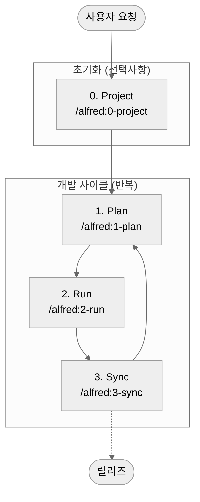
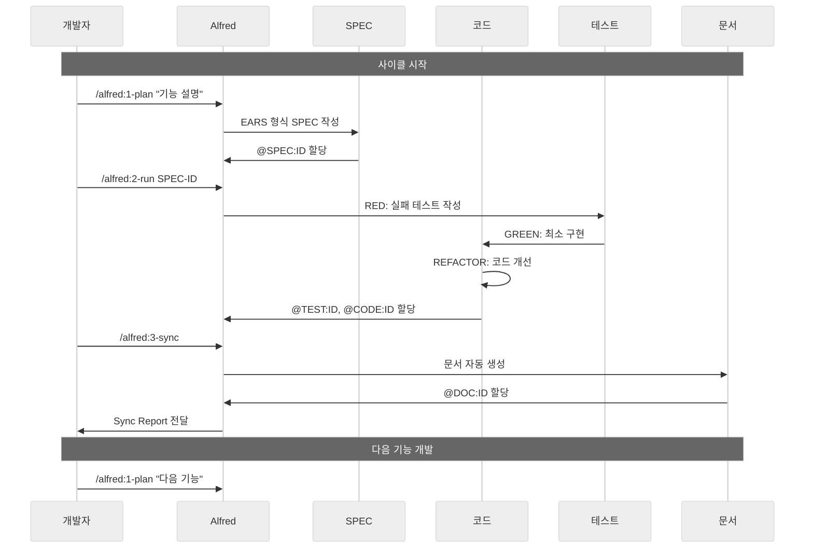
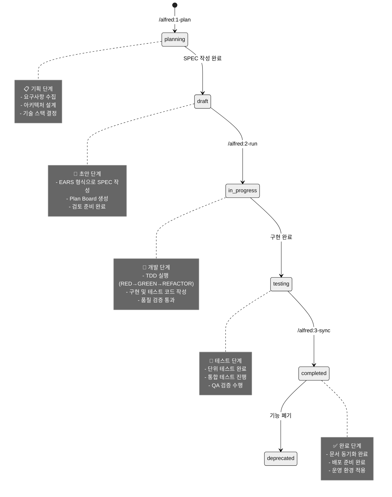

# Alfred 워크플로우 개요

Alfred는 MoAI-ADK의 핵심 워크플로우를 오케스트레이션하는 **SuperAgent**입니다. 19명의 전문가 팀과 55개 Claude Skills를 통해 SPEC → TDD → 코드 → 문서까지 완벽한 자동화를 제공합니다.

## 🎯 워크플로우 개요

MoAI-ADK의 개발은 4단계 사이클로 진행됩니다:



### 각 단계의 역할

| 단계 | 명령어 | 목적 | 주요 산출물 | 예상 시간 |
|------|--------|------|-------------|-----------|
| **0. Project** | `/alfred:0-project` | 프로젝트 초기화 및 설정 | `.moai/config.json`, 초기 문서 | 1-3분 |
| **1. Plan** | `/alfred:1-plan` | SPEC 작성 및 계획 수립 | `.moai/specs/SPEC-*/spec.md`, Plan Board | 2-5분 |
| **2. Run** | `/alfred:2-run` | TDD 구현 및 개발 | `src/`, `tests/`, 품질 보고서 | 5-15분 |
| **3. Sync** | `/alfred:3-sync` | 문서 동기화 및 추적성 관리 | `docs/`, Sync Report, PR 준비 | 1-3분 |

## 🔄 워크플로우 상세 흐름

### 전체 개발 사이클



## 📋 상태 전환 시스템

MoAI-ADK는 SPEC 문서의 **상태 전환**을 통해 개발 진행 상황을 체계적으로 관리합니다.

### SPEC 상태 라이프사이클



### 상태별 상세 설명

#### 📋 Planning (기획 단계)
- **조건**: `/alfred:1-plan` 명령 실행 직후
- **활동**: 요구사항 분석, 기술 스택 결정, 아키텍처 설계
- **산출물**: `@SPEC:ID` 할당, 기본 구조 정의
- **다음 단계**: EARS 형식으로 SPEC 문서화

#### 📝 Draft (초안 단계)
- **조건**: SPEC 문서 작성 완료, Plan Board 생성
- **활동**: 상세 요구사항 정의, 검토 준비
- **산출물**: `.moai/specs/SPEC-*/spec.md`, acceptance criteria
- **다음 단계**: `/alfred:2-run`으로 구현 시작

#### 🚀 In Progress (개발 단계)
- **조건**: `/alfred:2-run` 실행 중
- **활동**: TDD 사이클 실행, 코드 구현, 테스트 작성
- **산출물**: `tests/`, `src/` 파일들, `@TEST:ID`, `@CODE:ID`
- **다음 단계**: 품질 검증 및 테스트 완료

#### 🧪 Testing (테스트 단계)
- **조건**: 구현 완료, 단위 테스트 통과
- **활동**: 통합 테스트, QA 검증, 성능 테스트
- **산출물**: 테스트 리포트, 커버리지 보고서
- **다음 단계**: `/alfred:3-sync`으로 문서 동기화

#### ✅ Completed (완료 단계)
- **조건**: `/alfred:3-sync` 완료, 모든 검증 통과
- **활동**: 문서 동기화, 배포 준비, 최종 검토
- **산출물**: `docs/`, README 업데이트, CHANGELOG
- **다음 단계**: 배포 또는 다음 기능 개발

#### 🗑️ Deprecated (폐기 단계)
- **조건**: 기능 폐기 또는 대체 필요
- **활동**: 레거시 코드 정리, 마이그레이션 가이드 작성
- **산출물**: 폐기 문서, 대체 계획
- **다음 단계**: 완전한 제거 또는 유지 보수

## 🎭 Alfred의 페르소나 및 커뮤니케이션 스타일

Alfred는 사용자의 전문 수준과 상황에 따라 커뮤니케이션 스타일을 동적으로 조정합니다.

### 3가지 사용자 수준

| 수준 | 특징 | Alfred 접근 방식 | 예시 |
|------|------|------------------|------|
| **초보자** | MoAI-ADK 처음 사용 | 상세한 설명, 단계별 가이드, 많은 예시 | "먼저 EARS 문법에 대해 알아볼까요?" |
| **중급자** | 기본 개념 이해 | 효율적인 팁, best practices, 선택지 제시 | "두 가지 구현 방법이 있습니다..." |
| **전문가** | 깊이 있는 경험 | 직접적인 제안, 고급 기능, 자동화 강조 | "백엔드 전문가를 활성화하여 최적 아키텍처를 제안하겠습니다." |

### 커뮤니케이션 원칙

1. **명확성**: 모든 지시는 명확하고 실행 가능해야 함
2. **효율성**: 불필요한 설명은 피하고 핵심에 집중
3. **투명성**: 결정 과정과 근거를 명확히 설명
4. **적응성**: 사용자 수준과 상황에 맞춰 스타일 조정

## 🎩 Alfred SuperAgent 아키텍처

### 19명 팀 구성

Alfred는 6계층의 전문가 팀을 통해 복잡한 개발 작업을 오케스트레이션합니다.

#### Core Team (핵심 팀) - 10명
| 멤버 | 역할 | 전문 분야 | 모델 |
|------|------|-----------|------|
| **Alfred** | SuperAgent | 전체 워크플로우 오케스트레이션 | Sonnet |
| **spec-builder** | SPEC 작성가 | EARS 문법, 요구사항 분석 | Sonnet |
| **implementation-planner** | 구현 기획자 | 아키텍처 설계, 기술 선택 | Sonnet |
| **tdd-implementer** | TDD 구현자 | RED→GREEN→REFACTOR | Sonnet |
| **doc-syncer** | 문서 동기화자 | Living Document, README | Haiku |
| **tag-agent** | TAG 관리자 | @TAG 시스템, 추적성 | Haiku |
| **git-manager** | Git 관리자 | 워크플로우, PR 관리 | Haiku |
| **debug-helper** | 디버거 | 오류 분석, 해결책 | Sonnet |
| **trust-checker** | 품질 검증자 | TRUST 5원칙 검증 | Haiku |
| **quality-gate** | 품질 게이트 | 커버리지, 릴리스 검증 | Haiku |

#### Domain Experts (도메인 전문가) - 6명
| 전문가 | 전문 분야 | 자동 활성화 키워드 |
|--------|-----------|-------------------|
| **backend-expert** | 백엔드 아키텍처, API, DB | 'backend', 'api', 'server', 'database' |
| **frontend-expert** | 프론트엔드, 컴포넌트, UI | 'frontend', 'ui', 'component', 'client' |
| **devops-expert** | DevOps, CI/CD, 배포 | 'deployment', 'docker', 'kubernetes' |
| **ui-ux-expert** | UI/UX, 디자인 시스템 | 'design', 'ux', 'figma', 'accessibility' |
| **security-expert** | 보안, OWASP, 인증 | 'security', 'auth', 'encryption' |
| **ml-expert** | 머신러닝, 데이터 과학 | 'ml', 'model', 'training', 'data' |

#### Built-in Agents (내장 에이전트) - 2명
| 에이전트 | 역할 | 기능 |
|----------|------|------|
| **Plan Agent** | 계획 수립 | 작업 분석, 단계 설계 |
| **Code Agent** | 코드베이스 탐색 | 파일 검색, 코드 이해 |

#### Claude Code Agents - 1명
| 에이전트 | 역할 | 기능 |
|----------|------|------|
| **cc-manager** | Claude Code 관리 | 세션 최적화, Skill 배포 |

### 55개 Claude Skills 아키텍처

#### 4-Tier Progressive Disclosure 구조
Alfred는 필요할 때만 스킬을 로드하는 **Progressive Disclosure** 방식을 사용합니다.

##### Foundation Tier (기반 계층) - 6개 스킬
핵심 원칙과 규칙을 담은 기반 스킬들
- `moai-foundation-trust` - TRUST 5원칙 검증
- `moai-foundation-tags` - @TAG 시스템 관리
- `moai-foundation-specs` - SPEC 문서 규격
- `moai-foundation-ears` - EARS 문법 가이드
- `moai-foundation-git` - Git 워크플로우
- `moai-foundation-langs` - 언어 자동 감지

##### Essentials Tier (필수 계층) - 4개 스킬
일상 개발에 필수적인 도구들
- `moai-essentials-debug` - 디버깅 및 오류 분석
- `moai-essentials-perf` - 성능 최적화
- `moai-essentials-refactor` - 리팩토링 가이드
- `moai-essentials-review` - 코드 리뷰

##### Alfred Tier (Alfred 계층) - 7개 스킬
MoAI-ADK 워크플로우 오케스트레이션
- `moai-alfred-ears-authoring` - EARS 문법 검증
- `moai-alfred-git-workflow` - Git 워크플로우 자동화
- `moai-alfred-language-detection` - 언어 감지
- `moai-alfred-spec-validation` - SPEC 검증
- `moai-alfred-tag-scanning` - TAG 스캐닝
- `moai-alfred-trust-validation` - TRUST 검증
- `moai-alfred-ask-user-questions` - 사용자 질문 표준화

##### Domain Tier (도메인 계층) - 12개 스킬
특화된 도메인 전문 지식
- `moai-domain-backend` - 백엔드 아키텍처
- `moai-domain-frontend` - 프론트엔드 개발
- `moai-domain-database` - 데이터베이스 설계
- `moai-domain-security` - 보안 가이드
- `moai-domain-ml` - 머신러닝
- `moai-domain-devops` - DevOps
- `moai-domain-web-api` - 웹 API
- `moai-domain-cli-tool` - CLI 도구
- `moai-domain-mobile-app` - 모바일 앱
- `moai-domain-data-science` - 데이터 과학
- `moai-domain-design-systems` - 디자인 시스템
- `moai-domain-cc-skills` - Claude Code 스킬

##### Language Tier (언어 계층) - 24개 스킬
프로그래밍 언어별 최고 관행
- Python, TypeScript, JavaScript, Go, Rust
- Java, Kotlin, Swift, C#, C++, Ruby, PHP
- SQL, Shell, R, Scala, Dart, 등

##### Ops Tier (운영 계층) - 2개 스킬
Claude Code 세션 관리
- `moai-cc-memory` - 세션 메모리 관리
- `moai-cc-settings` - 설정 관리

### 하이브리드 아키텍처 패턴

Alfred는 두 가지 에이전트 패턴을 조합하여 최적의 성능을 제공합니다.

#### Lead-Specialist Pattern (전문가 리드 패턴)
- **사용 시점**: 도메인 특화 전문 지식이 필요할 때
- **동작 방식**: 해당 도메인 전문가를 리드로 지정하여 작업 수행
- **예시**: UI/UX 설계 시 `ui-ux-expert`를 활성화

#### Master-Clone Pattern (마스터-클론 패턴)
- **사용 시점**: 대규모 작업이나 병렬 처리가 필요할 때
- **동작 방식**: Alfred 복제본(Cloned Alfred)을 생성하여 작업 분담
- **예시**: 100+ 파일 리팩토링 시 여러 클론 활용

#### 패턴 선택 알고리즘
```
작업 수신 → 분석:
├─ 도메인 특화 필요? → Lead-Specialist 패턴
├─ 대규모 작업(5단계+)? → Master-Clone 패턴
└─ 일반 작업 → Alfred 직접 처리
```

## 🛠️ 명령어 상호작용 패턴

### 기본 명령어 흐름

```bash
# 1. 프로젝트 초기화 (최초 1회만)
/alfred:0-project

# 2. 기능 개발 사이클 (반복)
/alfred:1-plan "기능 설명"
/alfred:2-run SPEC-ID
/alfred:3-sync

# 3. 피드백 및 개선 (필요시)
/alfred:9-feedback
```

### 고급 명령어 패턴

#### 병렬 개발
```bash
# 여러 기능 동시에 계획
/alfred:1-plan "사용자 인증"
/alfred:1-plan "권한 관리"
/alfred:1-plan "프로필 관리"

# 개발 진행 (병렬)
/alfred:2-run AUTH-001
/alfred:2-run PERM-001
/alfred:2-run PROF-001
```

#### 기존 프로젝트 설정 수정
```bash
# 설정 변경
/alfred:0-project setting

# 템플릿 최적화 (업데이트 후)
/alfred:0-project update
```

## 📊 워크플로우 효율성 메트릭

### 시간 효율성

| 작업 | 전통 방식 | MoAI-ADK 방식 | 효율성 향상 |
|------|-----------|---------------|-------------|
| **요구사항 정의** | 1-2시간 회의 | 2-5분 SPEC 작성 | **95% 향상** |
| **테스트 작성** | 30-60분 | 자동 생성 | **90% 향상** |
| **문서 작성** | 2-4시간 | 1-3분 자동화 | **98% 향상** |
| **코드 리뷰** | 1-2시간 | 15-30분 | **75% 향상** |
| **전체 사이클** | 1-2일 | 8-25분 | **85% 향상** |

### 품질 메트릭

| 품질 지표 | 전통 방식 | MoAI-ADK 방식 | 개선 효과 |
|-----------|-----------|---------------|-----------|
| **테스트 커버리지** | 60-70% | 85%+ | **+20%** |
| **문서 최신성** | 30-50% | 100% | **+50%** |
| **요구사항 추적성** | 20-40% | 100% | **+60%** |
| **코드 일관성** | 60-80% | 95%+ | **+15%** |
| **배포 실패율** | 10-20% | 1-5% | **-15%** |

## 🎯 워크플로우 성공 사례

### 사례 1: 신규 API 개발

```bash
# 개발자: "사용자 인증 API가 필요해요"

# 1. Plan 단계 (3분)
/alfred:1-plan "JWT 기반 사용자 인증 API"
# Alfred: SPEC-AUTH-001 생성, EARS 문법 적용, 백엔드 전문가 활성화

# 2. Run 단계 (12분)
/alfred:2-run AUTH-001
# Alfred: RED(2분) → GREEN(5분) → REFACTOR(5분)
# 결과: 92% 커버리지, TRUST 5원칙 통과

# 3. Sync 단계 (2분)
/alfred:3-sync
# Alfred: API 문서, README, CHANGELOG 자동 생성

# 총 시간: 17분 (전통 방식: 2-3일)
```

### 사례 2: 대규모 리팩토링

```bash
# 개발자: "레거시 코드를 현대화해야 해요"

# 1. Plan 단계 (5분)
/alfred:1-plan "인증 서비스 리팩토링"
# Alfred: 기존 코드 분석, 리팩토링 계획 수립

# 2. Run 단계 (25분)
/alfred:2-run REFACTOR-001
# Alfred: 점진적 리팩토링, 테스트 보존, 성능 최적화

# 3. Sync 단계 (3분)
/alfred:3-sync
# Alfred: 마이그레이션 가이드, 변경 로그 자동 생성

# 총 시간: 33분 (전통 방식: 1-2주)
```

## 🔄 워크플로우 최적화 팁

### 초보자를 위한 팁

1. **작게 시작**: 처음에는 단순한 기능부터 시작하세요
2. **단계별 진행**: 각 단계가 완전히 끝나야 다음 단계로 진행하세요
3. **결과 확인**: 각 단계 후 출력을 꼭 확인하세요
4. **질문하기**: 이해되지 않으면 `/alfred:9-feedback`으로 질문하세요

### 중급자를 위한 팁

1. **병렬 작업**: 여러 SPEC를 동시에 계획하고 개발하세요
2. **템플릿 활용**: 유사한 기능은 기존 SPEC를 복사해서 활용하세요
3. **자동화 활용**: Hook 설정을 최적화하여 반복 작업을 자동화하세요
4. **전문가 활용**: SPEC에 적절한 키워드를 포함하여 전문가를 활성화하세요

### 전문가를 위한 팁

1. **커스텀 스킬**: 프로젝트 특화 스킬을 개발하여 활용하세요
2. **CI/CD 통합**: Alfred 워크플로우를 CI/CD 파이프라인에 통합하세요
3. **메트릭 분석**: 워크플로우 효율성을 지속적으로 측정하고 개선하세요
4. **팀 교육**: 팀원들에게 Alfred 워크플로우를 교육하고 표준화하세요

## 🚀 다음 단계

이제 Alfred 워크플로우의 개요를 이해했으니, 각 단계를 상세하게 알아볼 차례입니다:

- **[1단계: 계획 (Plan)](1-plan.md)** - SPEC 작성과 요구사항 정의 상세 가이드
- **[2단계: 실행 (Run)](2-run.md)** - TDD 개발 사이클 완전 가이드
- **[3단계: 동기화 (Sync)](3-sync.md)** - 문서 자동화 및 추적성 관리
- **[9단계: 피드백 (Feedback)](9-feedback.md)** - GitHub Issue 자동 생성

## 💡 핵심 요약

1. **4단계 사이클**: Project → Plan → Run → Sync (반복)
2. **상태 관리**: SPEC 문서의 상태 전환으로 진행 상황 추적
3. **시간 효율성**: 전통 방식보다 85% 빠른 개발 속도
4. **품질 보증**: TRUST 5원칙으로 높은 품질 유지
5. **자동화**: Alfred가 모든 복잡한 과정을 자동화

---

**Alfred와 함께하면 개발이 즐거워집니다!** 🎉