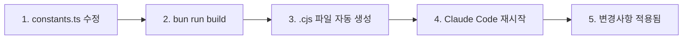

# MoAI-ADK Hooks 시스템

## 개요

**MoAI-ADK Hooks**는 Claude Code와의 상호작용 중 발생하는 도구 호출(Tool Call)을 **실시간으로 가로채고 검증**하는 품질 게이트 시스템입니다.

### 핵심 가치

- **사전 예방**: 위험한 작업을 사전에 차단
- **품질 보증**: CODE-FIRST TAG 시스템으로 코드 추적성 보장
- **자동화**: 수동 검증 없이 정책 자동 적용
- **확장성**: 프로젝트별 커스텀 룰 적용 가능

### 작동 방식

```
Claude Code → Tool Call → Hook 검증 → 승인/거부 → 실제 실행
```

**예시**:

```typescript
// Claude가 Write 도구를 호출하려고 할 때
Write(".env", "API_KEY=secret123")
↓
pre-write-guard Hook 실행
↓
BLOCKED: 민감한 파일은 편집할 수 없습니다.
```

---

## Hooks 시스템의 철학

### 1. Zero-Trust Architecture

모든 도구 호출은 기본적으로 검증 대상입니다.

### 2. Fail-Safe 설계

Hook 자체의 오류는 작업을 차단하지 않습니다. 시스템 안정성이 우선입니다.

### 3. 명확한 피드백

차단/경고 시 **구체적인 이유**와 **해결 방법**을 제공합니다.

```
❌ BLOCKED: @IMMUTABLE TAG 수정 금지
→ 권장 해결 방법:
   1. 새로운 TAG ID로 새 기능을 구현하세요
   2. 기존 TAG에 @DOC 마커를 추가하세요
```

---

## 4가지 핵심 Hook

### Hook 실행 순서 및 역할

| 순서 | Hook 이름 | 트리거 시점 | 주요 역할 | 차단 여부 |
|------|-----------|------------|----------|----------|
| 1 | **session-notice** | 세션 시작 | 프로젝트 상태 알림 | ❌ (정보 제공) |
| 2 | **policy-block** | Bash 도구 호출 시 | 위험 명령 차단 | ✅ (위험 시) |
| 3 | **pre-write-guard** | Write/Edit 도구 호출 시 | 민감 파일 보호 | ✅ (민감 파일) |
| 4 | **tag-enforcer** | Write/Edit 도구 호출 시 | TAG 무결성 검증 | ✅ (TAG 위반 시) |

---

## Hook 아키텍처 (v0.2.18+ 리팩토링)

MoAI-ADK v0.2.18에서 **SPEC-HOOKS-REFACTOR-001**을 통해 Hook 시스템이 완전히 리팩토링되었습니다.

### 리팩토링 주요 개선사항

#### 1. 코드 중복 제거 (100 LOC → 0 LOC)

**Before (v0.2.17)**:

- 각 Hook 파일마다 CLI Entry Point 중복 (100줄 × 4개 = 400줄)

**After (v0.2.18+)**:

```typescript
// moai-adk-ts/src/claude/hooks/base.ts
export async function runHook(
  HookClass: new () => MoAIHook
): Promise<void> {
  // 모든 Hook에서 재사용 가능한 단일 CLI Entry Point
}
```

#### 2. 중앙화된 상수 관리

```typescript
// moai-adk-ts/src/claude/hooks/constants.ts
export const SUPPORTED_LANGUAGES = { /* 15개 언어 */ };
export const READ_ONLY_TOOLS = [ /* 읽기 전용 도구 목록 */ ];
export const DANGEROUS_COMMANDS = [ /* 위험 명령어 */ ];
export const TIMEOUTS = { /* 타임아웃 설정 */ };
```

#### 3. 언어 지원 확대: 7개 → 15개

**추가된 언어**:

- Ruby, PHP, C#, Dart, Swift, Kotlin, Elixir
- C++ 확장자 확대 (`.cc`, `.h`, `.cxx`, `.hxx`)

```typescript
export const SUPPORTED_LANGUAGES = {
  typescript: ['.ts', '.tsx'],
  javascript: ['.js', '.jsx', '.mjs', '.cjs'],
  python: ['.py', '.pyi'],
  java: ['.java'],
  go: ['.go'],
  rust: ['.rs'],
  cpp: ['.cpp', '.hpp', '.cc', '.h', '.cxx', '.hxx'],
  ruby: ['.rb', '.rake', '.gemspec'],
  php: ['.php'],
  csharp: ['.cs'],
  dart: ['.dart'],
  swift: ['.swift'],
  kotlin: ['.kt', '.kts'],
  elixir: ['.ex', '.exs'],
  markdown: ['.md', '.mdx'],
} as const;
```

### 새로운 파일 구조

```
moai-adk-ts/src/claude/hooks/
├── base.ts              # CLI Entry Point 통합
├── constants.ts         # 모든 상수 중앙화
├── utils.ts             # 공통 유틸리티 함수
├── policy-block.ts      # 리팩토링됨
├── pre-write-guard.ts   # 리팩토링됨
├── tag-enforcer.ts      # 리팩토링됨
└── session-notice/
    └── index.ts         # 리팩토링됨
```

---

## 각 Hook 상세

### 1. policy-block: 위험 명령 차단

Bash 명령어 중 **시스템을 손상시킬 수 있는 위험한 명령**을 사전에 차단합니다.

**차단 대상 명령어**:

```javascript
const DANGEROUS_COMMANDS = [
  "rm -rf /",
  "sudo rm",
  "dd if=/dev/zero",
  ":(){:|:&};:",  // Fork Bomb
  "mkfs."
];
```

**허용 명령 접두사**:

```javascript
const ALLOWED_PREFIXES = [
  "git ", "python", "pytest", "npm ", "node ", "go ",
  "cargo ", "pnpm ", "rg ", "ls ", "cat ", "echo "
];
```

**동작 예시**:

```bash
# 차단
bash -c "sudo rm -rf /tmp/dangerous"
→ ❌ BLOCKED: 위험 명령이 감지되었습니다 (sudo rm).

# 허용
git status
→ ✅ (조용히 통과)
```

---

### 2. pre-write-guard: 민감 파일 보호

**민감한 파일**과 **시스템 핵심 파일**의 의도치 않은 편집을 방지합니다.

**보호 대상**:

```javascript
const SENSITIVE_KEYWORDS = [
  ".env",
  "/secrets",
  "/.git/",
  "/.ssh"
];

const PROTECTED_PATHS = [
  ".moai/memory/"
];
```

**템플릿 예외**: 템플릿 파일은 편집 허용

```javascript
const isTemplate = filePath.includes("/templates/.moai/");
```

**동작 예시**:

```typescript
// 차단
Write(".env", "API_KEY=secret123")
→ ❌ BLOCKED: 민감한 파일은 편집할 수 없습니다.

// 허용
Write("templates/.moai/memory/template.md", "...")
→ ✅ (템플릿이므로 허용)
```

---

### 3. session-notice: 프로젝트 상태 알림

Claude Code 세션 시작 시 **프로젝트 상태를 한눈에 파악**할 수 있는 대시보드를 제공합니다.

**표시 정보**:

1. 프로젝트 이름 및 MoAI-ADK 버전
2. Git 상태 (브랜치, 최신 커밋, 변경 파일)
3. SPEC 진행률
4. 업데이트 가능 버전 안내

**출력 예시**:

```
🗿 MoAI-ADK 프로젝트: my-awesome-app
📦 버전: v0.2.17 (최신)
🌿 현재 브랜치: feature/AUTH-001 (a1b2c3d Implement JWT)
📝 변경사항: 3개 파일
📝 SPEC 진행률: 5/8 (미완료 3개)
✅ 통합 체크포인트 시스템 사용 가능
```

---

### 4. tag-enforcer: TAG 무결성 보장

MoAI-ADK의 핵심인 **CODE-FIRST TAG 시스템**의 무결성을 보장합니다.

**검증 대상 파일 확장자** (15개 언어):

- TypeScript, JavaScript, Python, Java, Go, Rust, C++
- Ruby, PHP, C#, Dart, Swift, Kotlin, Elixir, Markdown

**TAG 블록 구조**:

```javascript
/**
 * @DOC:FEATURE:AUTH-001
 * CHAIN: REQ:AUTH-001 -> DESIGN:AUTH-001 -> TASK:AUTH-001 -> TEST:AUTH-001
 * DEPENDS: NONE
 * STATUS: active
 * CREATED: 2025-10-11
 * @IMMUTABLE
 */
```

**@IMMUTABLE 불변성 보장**:

- 한번 작성된 TAG는 수정할 수 없습니다
- 기능 변경 시 **새로운 TAG를 생성**해야 합니다

**동작 예시**:

```typescript
// 차단: @IMMUTABLE TAG 수정 시도
❌ BLOCKED: @IMMUTABLE TAG 수정 금지

✅ 권장 해결 방법:
1. 새로운 TAG ID로 새 기능을 구현하세요
   예: @DOC:FEATURE:AUTH-002
2. 새 TAG에서 이전 TAG를 참조하세요
   예: REPLACES: FEATURE:AUTH-001
```

---

## Hook 커스터마이징

### v0.2.18+ 커스터마이징 워크플로우



**핵심 원칙**:

- ✅ **소스 코드 수정**: `moai-adk-ts/src/claude/hooks/*.ts`
- ✅ **자동 빌드**: `bun run build` → `.cjs` 파일 생성
- ❌ **직접 수정 금지**: `.claude/hooks/alfred/*.cjs` 파일 직접 편집

**빌드 명령어**:

```bash
cd moai-adk-ts
bun run build  # 또는 npm run build

# 빌드 결과 확인
ls -la .claude/hooks/alfred/*.cjs
```

### 허용 명령 추가하기

```typescript
// moai-adk-ts/src/claude/hooks/constants.ts 수정

export const ALLOWED_PREFIXES = [
  'git ',
  'python',
  'npm ',
  'docker ',          // 추가
  'docker-compose ',  // 추가
  'kubectl ',         // 추가
] as const;
```

### 보호 파일 추가하기

```typescript
// moai-adk-ts/src/claude/hooks/constants.ts 수정

export const SENSITIVE_KEYWORDS = [
  '.env',
  '/secrets',
  '/.git/',
  '/.ssh',
  'credentials.json',  // 추가
  'private-key',       // 추가
] as const;

export const PROTECTED_PATHS = [
  '.moai/memory/',
  'config/production/',  // 추가
  'internal/config/',    // 추가
] as const;
```

### TAG 검증 언어 추가하기

```typescript
// moai-adk-ts/src/claude/hooks/constants.ts 수정

export const SUPPORTED_LANGUAGES = {
  // ... 기존 15개 언어

  // 새 언어 추가
  scala: ['.scala', '.sc'],
  haskell: ['.hs', '.lhs'],
  clojure: ['.clj', '.cljs', '.cljc'],
} as const;
```

**적용 방법**:

```bash
cd moai-adk-ts
bun run build
# .claude/hooks/ 디렉토리의 .cjs 파일들이 자동 업데이트됨
```

---

## Best Practices

### 1. Hook은 빠르게

- 목표: 100ms 이내 실행
- 외부 API는 2초 타임아웃 설정

### 2. Fail-Safe 설계

- Hook 오류는 작업을 차단하지 않음
- 모든 예외는 `try-catch`로 처리

### 3. 명확한 피드백

- 차단 시 **이유**와 **해결 방법** 제공
- 심각도별 아이콘 사용:
  - **❌ Critical**: 작업 중단
  - **⚠️ Warning**: 주의 필요
  - **ℹ️ Info**: 참고용

### 4. 성능 모니터링

- 실행 시간 측정
- 100ms 초과 시 경고 로그

### 5. 읽기 전용 도구는 바이패스

- `Read`, `Grep`, `Glob` 등은 검증 불필요
- MCP 도구(`mcp__*`)는 자동 허용

---

## 디버깅 및 문제 해결

### 문제 1: Hook이 실행되지 않음

**원인**:

- `.claude/settings.json`에 등록되지 않음
- 파일 경로가 잘못됨

**해결**:

```bash
# 1. 등록 확인
cat .claude/settings.json | grep "hooks"

# 2. 파일 존재 확인
ls -la .claude/hooks/alfred/
```

### 문제 2: Hook이 너무 느림

**원인**:

- 동기 I/O 사용
- 외부 API 호출 타임아웃 없음

**해결**:

```javascript
// ❌ 나쁜 예
const response = await fetch(url);

// ✅ 좋은 예
const controller = new AbortController();
setTimeout(() => controller.abort(), 2000);
const response = await fetch(url, { signal: controller.signal });
```

### 문제 3: Hook이 정상 작업을 차단함

**원인**:

- 검증 로직이 너무 엄격함

**해결**:

```javascript
// ❌ 너무 엄격
if (filePath.includes(".json")) {
  return { success: false, blocked: true };
}

// ✅ 특정 파일만 차단
const sensitiveJsonFiles = [".env.json", "secrets.json"];
if (sensitiveJsonFiles.some(f => filePath.endsWith(f))) {
  return { success: false, blocked: true };
}
```

---

## 실전 시나리오

### 시나리오 1: 위험 명령 차단

**상황**: Claude가 실수로 중요한 디렉토리를 삭제하려고 합니다.

```bash
# Claude 시도
rm -rf /tmp/project-backup

# policy-block Hook
❌ BLOCKED: 위험 명령이 감지되었습니다 (rm -rf).
```

### 시나리오 2: 환경 변수 파일 보호

**상황**: Claude가 `.env` 파일을 편집하려고 합니다.

```typescript
// Claude 시도
Write(".env", "DATABASE_URL=postgresql://...")

// pre-write-guard Hook
❌ BLOCKED: 민감한 파일은 편집할 수 없습니다.
```

### 시나리오 3: @IMMUTABLE TAG 수정 시도

**상황**: Claude가 기존 @IMMUTABLE TAG를 수정하려고 합니다.

```typescript
// tag-enforcer Hook
❌ BLOCKED: @IMMUTABLE TAG 수정 금지

✅ 권장 해결 방법:
1. 새로운 TAG ID로 새 기능을 구현하세요
2. 새 TAG에서 이전 TAG를 참조하세요
```

---

## 관련 문서

- **[SPEC-First TDD](guides/concepts/spec-first-tdd.md)** - 개발 방법론
- **[TAG System](guides/concepts/tag-system.md)** - TAG 시스템 상세
- **[TRUST Principles](guides/concepts/trust-principles.md)** - 품질 원칙
- **[Alfred Agents](guides/agents/overview.md)** - Alfred 에이전트 생태계

---

**문서 작성일**: 2025-10-11
**작성자**: MoAI-ADK Documentation Team
**버전**: 2.0.0 (v0.2.18 리팩토링 반영)
