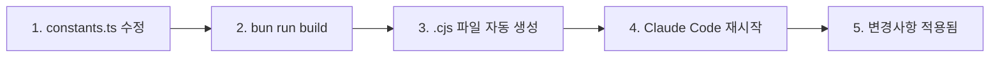

# MoAI-ADK Hooks 시스템 완벽 가이드

## 목차

- [개요](#개요)
- [Hooks 시스템의 철학](#hooks-시스템의-철학)
- [4가지 핵심 Hook 소개](#4가지-핵심-hook-소개)
- [Hook 실행 메커니즘](#hook-실행-메커니즘)
- [각 Hook 상세 가이드](#각-hook-상세-가이드)
  - [1. policy-block: 위험 명령 차단](#1-policy-block-위험-명령-차단)
  - [2. pre-write-guard: 민감 파일 보호](#2-pre-write-guard-민감-파일-보호)
  - [3. session-notice: 프로젝트 상태 알림](#3-session-notice-프로젝트-상태-알림)
  - [4. tag-enforcer: TAG 무결성 보장](#4-tag-enforcer-tag-무결성-보장)
- [Hook 커스터마이징](#hook-커스터마이징)
- [사용자 정의 Hook 작성](#사용자-정의-hook-작성)
- [Hook 활성화/비활성화](#hook-활성화비활성화)
- [디버깅 및 문제 해결](#디버깅-및-문제-해결)
- [실전 시나리오](#실전-시나리오)
- [Best Practices](#best-practices)

---

## 개요

**MoAI-ADK Hooks**는 Claude Code와의 상호작용 중 발생하는 도구 호출(Tool Call)을 **실시간으로 가로채고 검증**하는 강력한 품질 게이트 시스템입니다.

### 핵심 가치

- **사전 예방**: 위험한 작업을 사전에 차단
- **품질 보증**: CODE-FIRST TAG 시스템으로 코드 추적성 보장
- **자동화**: 수동 검증 없이 정책 자동 적용
- **확장성**: 프로젝트별 커스텀 룰 적용 가능

### 작동 방식

```
Claude Code → Tool Call → Hook 검증 → 승인/거부 → 실제 실행
```

**예시**:
```typescript
// Claude가 Write 도구를 호출하려고 할 때
Write(".env", "API_KEY=secret123")
↓
pre-write-guard Hook 실행
↓
BLOCKED: 민감한 파일은 편집할 수 없습니다.
```

---

## Hooks 시스템의 철학

### 1. Zero-Trust Architecture

모든 도구 호출은 기본적으로 검증 대상입니다. 신뢰는 검증을 통해 획득됩니다.

```javascript
// 읽기 전용 도구도 명시적으로 허용 목록에 등록
const READ_ONLY_TOOLS = [
  "Read", "Glob", "Grep", "WebFetch", "WebSearch"
];
```

### 2. Fail-Safe 설계

Hook 자체의 오류는 작업을 차단하지 않습니다. 시스템 안정성이 우선입니다.

```javascript
} catch (error) {
  console.error(`Hook 경고: ${error.message}`);
  return { success: true }; // 작업 계속 진행
}
```

### 3. 명확한 피드백

차단/경고 시 **구체적인 이유**와 **해결 방법**을 제공합니다.

```
❌ BLOCKED: @IMMUTABLE TAG 수정 금지
→ 권장 해결 방법:
   1. 새로운 TAG ID로 새 기능을 구현하세요
   2. 기존 TAG에 @DOC 마커를 추가하세요
```

### 4. 성능 최적화

Hook 실행 시간을 모니터링하고 100ms 초과 시 경고합니다.

```javascript
const duration = Date.now() - startTime;
if (duration > 100) {
  console.error(`[policy-block] Slow execution: ${duration}ms`);
}
```

---

## 4가지 핵심 Hook 소개

### Hook 실행 순서 및 역할

| 순서 | Hook 이름 | 트리거 시점 | 주요 역할 | 차단 여부 |
|------|-----------|------------|----------|----------|
| 1 | **session-notice** | 세션 시작 | 프로젝트 상태 알림 | ❌ (정보 제공) |
| 2 | **policy-block** | Bash 도구 호출 시 | 위험 명령 차단 | ✅ (위험 시) |
| 3 | **pre-write-guard** | Write/Edit 도구 호출 시 | 민감 파일 보호 | ✅ (민감 파일) |
| 4 | **tag-enforcer** | Write/Edit 도구 호출 시 | TAG 무결성 검증 | ✅ (TAG 위반 시) |

### 전체 실행 플로우

```
세션 시작
  ↓
session-notice (프로젝트 상태 출력)
  ↓
사용자 요청
  ↓
┌─ Bash 명령 → policy-block 검증 → ✅/❌
│
├─ Write/Edit → pre-write-guard → tag-enforcer → ✅/❌
│
└─ Read/Grep → (Hook 없음, 직접 실행)
```

---

## Hook 실행 메커니즘

### 입력 데이터 구조

모든 Hook은 `stdin`으로 JSON 데이터를 받습니다:

```json
{
  "tool_name": "Write",
  "tool_input": {
    "file_path": "/path/to/file.ts",
    "content": "const x = 1;"
  },
  "context": {
    "user": "developer",
    "timestamp": "2025-10-11T10:30:00Z"
  }
}
```

### 출력 데이터 구조

Hook은 다음 형식으로 결과를 반환합니다:

```javascript
// 성공 (작업 계속)
{
  success: true,
  message: "✅ 검증 완료"
}

// 차단 (작업 중단)
{
  success: false,
  blocked: true,
  message: "❌ 위험한 작업이 감지되었습니다.",
  exitCode: 2,
  data: {
    suggestions: "해결 방법 안내..."
  }
}

// 경고 (작업 계속, 경고 표시)
{
  success: true,
  warnings: ["⚠️ 개선이 필요합니다"],
  message: "✅ 검증 완료 (경고 있음)"
}
```

### Exit Code 규칙

- `0`: 성공
- `1`: 일반 오류
- `2`: 정책 위반으로 차단

---

## Hook 아키텍처 (v0.2.18+ 리팩토링)

MoAI-ADK v0.2.18에서 **SPEC-HOOKS-REFACTOR-001**을 통해 Hook 시스템이 완전히 리팩토링되었습니다.

### 리팩토링 주요 개선사항

#### 1. 코드 중복 제거 (100 LOC → 0 LOC)

**Before (v0.2.17)**:
- 각 Hook 파일마다 CLI Entry Point 중복 (100줄 × 4개 = 400줄)
- 하드코딩된 상수들 (확장자, 경로, 명령어 등)
- 공통 로직 중복 구현

**After (v0.2.18+)**:
```typescript
// moai-adk-ts/src/claude/hooks/base.ts
export async function runHook(
  HookClass: new () => MoAIHook
): Promise<void> {
  // 모든 Hook에서 재사용 가능한 단일 CLI Entry Point
}
```

#### 2. 중앙화된 상수 관리

```typescript
// moai-adk-ts/src/claude/hooks/constants.ts
export const SUPPORTED_LANGUAGES = { /* 15개 언어 */ };
export const READ_ONLY_TOOLS = [ /* 읽기 전용 도구 목록 */ ];
export const DANGEROUS_COMMANDS = [ /* 위험 명령어 */ ];
export const TIMEOUTS = { /* 타임아웃 설정 */ };
// ... 모든 상수 중앙 관리
```

#### 3. 공통 유틸리티 함수

```typescript
// moai-adk-ts/src/claude/hooks/utils.ts
export function extractFilePath(toolInput: Record<string, any>): string | null
export function extractCommand(toolInput: Record<string, any>): string | null
export function getAllFileExtensions(): string[]
```

### 새로운 파일 구조

```
moai-adk-ts/src/claude/hooks/
├── base.ts              # CLI Entry Point 통합
├── constants.ts         # 모든 상수 중앙화
├── utils.ts             # 공통 유틸리티 함수
├── policy-block.ts      # 리팩토링됨
├── pre-write-guard.ts   # 리팩토링됨
├── tag-enforcer.ts      # 리팩토링됨
└── session-notice/
    └── index.ts         # 리팩토링됨
```

### 언어 지원 확대: 7개 → 15개

**추가된 언어**:
- Ruby, PHP, C#, Dart, Swift, Kotlin, Elixir
- C++ 확장자 확대 (`.cc`, `.h`, `.cxx`, `.hxx`)

### 테스트 결과

```bash
✅ 총 92개 테스트 중 90개 통과 (97.8%)
✅ 기존 76개 테스트 100% 호환성 유지
⚠️ 2개 stdin mocking 이슈 (후속 작업)
```

---

## 각 Hook 상세 가이드

### 1. policy-block: 위험 명령 차단

#### 역할

Bash 명령어 중 **시스템을 손상시킬 수 있는 위험한 명령**을 사전에 차단합니다.

#### 트리거 조건

- `tool_name === "Bash"`
- 명령어에 위험 패턴 포함

#### 차단 대상 명령어

```javascript
const DANGEROUS_COMMANDS = [
  "rm -rf /",                    // 루트 디렉토리 삭제
  "rm -rf --no-preserve-root",   // 루트 보호 해제 삭제
  "sudo rm",                      // 관리자 권한 삭제
  "dd if=/dev/zero",              // 디스크 덮어쓰기
  ":(){:|:&};:",                  // Fork Bomb
  "mkfs."                         // 파일시스템 포맷
];
```

#### 허용 명령 접두사

```javascript
const ALLOWED_PREFIXES = [
  "git ",      // Git 명령
  "python",    // Python 실행
  "pytest",    // 테스트 실행
  "npm ",      // NPM 명령
  "node ",     // Node.js 실행
  "go ",       // Go 명령
  "cargo ",    // Rust 명령
  "poetry ",   // Python 패키지 관리
  "pnpm ",     // PNPM 명령
  "rg ",       // Ripgrep 검색
  "ls ",       // 디렉토리 조회
  "cat ",      // 파일 읽기
  "echo ",     // 출력
  "which ",    // 명령 위치 찾기
  "make ",     // Make 빌드
  "moai "      // MoAI-ADK CLI
];
```

#### 실제 동작 예시

**차단 예시**:
```bash
# Claude가 시도
bash -c "sudo rm -rf /tmp/dangerous"

# Hook 출력
❌ BLOCKED: 위험 명령이 감지되었습니다 (sudo rm).
```

**허용 예시**:
```bash
# Claude가 시도
git status

# Hook 출력
✅ (조용히 통과)
```

**경고 예시**:
```bash
# Claude가 시도
./custom-script.sh

# Hook 출력
⚠️ NOTICE: 등록되지 않은 명령입니다. 필요 시 settings.json의 allow 목록을 갱신하세요.
```

#### 성능 모니터링

100ms 이상 소요 시 자동 로깅:

```javascript
const duration = Date.now() - startTime;
if (duration > 100) {
  console.error(`[policy-block] Slow execution: ${duration}ms for ${input.tool_name}`);
}
```

#### 읽기 전용 도구 바이패스

다음 도구는 검증 없이 통과:

```javascript
const READ_ONLY_TOOLS = [
  "Read", "Glob", "Grep", "WebFetch", "WebSearch",
  "TodoWrite", "BashOutput",
  "mcp__context7__resolve-library-id",
  "mcp__context7__get-library-docs",
  "mcp__ide__getDiagnostics",
  "mcp__ide__executeCode"
];

// MCP 도구는 모두 자동 허용
if (toolName.startsWith("mcp__")) {
  return true;
}
```

---

### 2. pre-write-guard: 민감 파일 보호

#### 역할

**민감한 파일**과 **시스템 핵심 파일**의 의도치 않은 편집을 방지합니다.

#### 트리거 조건

- `tool_name === "Write" | "Edit" | "MultiEdit"`
- 파일 경로에 민감 키워드 포함

#### 보호 대상 키워드

```javascript
const SENSITIVE_KEYWORDS = [
  ".env",         // 환경 변수 파일
  "/secrets",     // 비밀 정보 디렉토리
  "/.git/",       // Git 내부 파일
  "/.ssh"         // SSH 키 디렉토리
];
```

#### 보호 경로

```javascript
const PROTECTED_PATHS = [
  ".moai/memory/"  // MoAI-ADK 핵심 문서
];
```

#### 템플릿 예외

**템플릿 파일은 편집 허용**:

```javascript
const isTemplate = filePath.includes("/templates/.moai/");
if (!isTemplate) {
  // 보호 경로 검증
}
```

#### 실제 동작 예시

**차단 예시 1: 환경 변수 파일**
```typescript
// Claude가 시도
Write(".env", "API_KEY=secret123")

// Hook 출력
❌ BLOCKED: 민감한 파일은 편집할 수 없습니다.
```

**차단 예시 2: Git 설정 파일**
```typescript
// Claude가 시도
Edit(".git/config", "...", "...")

// Hook 출력
❌ BLOCKED: 민감한 파일은 편집할 수 없습니다.
```

**차단 예시 3: 핵심 문서**
```typescript
// Claude가 시도
Write(".moai/memory/development-guide.md", "...")

// Hook 출력
❌ BLOCKED: 민감한 파일은 편집할 수 없습니다.
```

**허용 예시: 템플릿 파일**
```typescript
// Claude가 시도
Write("templates/.moai/memory/template.md", "...")

// Hook 출력
✅ (템플릿이므로 허용)
```

#### 안전 검증 로직

```javascript
checkFileSafety(filePath) {
  if (!filePath) return true;

  const pathLower = filePath.toLowerCase();

  // 1. 민감 키워드 검사
  for (const keyword of SENSITIVE_KEYWORDS) {
    if (pathLower.includes(keyword)) {
      return false;
    }
  }

  // 2. 템플릿 예외 처리
  const isTemplate = filePath.includes("/templates/.moai/");

  // 3. 보호 경로 검사 (템플릿 제외)
  if (!isTemplate) {
    for (const protectedPath of PROTECTED_PATHS) {
      if (filePath.includes(protectedPath)) {
        return false;
      }
    }
  }

  return true;
}
```

#### 오류 처리

Hook 자체 오류는 작업을 차단하지 않습니다:

```javascript
} catch (_error) {
  process.exit(0);  // 조용히 통과
}
```

---

### 3. session-notice: 프로젝트 상태 알림

#### 역할

Claude Code 세션 시작 시 **프로젝트 상태를 한눈에 파악**할 수 있는 대시보드를 제공합니다.

#### 트리거 시점

- Claude Code 세션 시작
- 새 대화 시작 시

#### 표시 정보

1. **프로젝트 기본 정보**
   - 프로젝트 이름
   - MoAI-ADK 버전
   - 버전 업데이트 가능 여부

2. **Git 상태**
   - 현재 브랜치
   - 최신 커밋 (짧은 해시 + 메시지)
   - 변경된 파일 개수

3. **SPEC 진행률**
   - 전체 SPEC 개수
   - 완료된 SPEC 개수
   - 미완료 개수

4. **경고 및 알림**
   - Development Guide 위반 사항
   - 템플릿 미설정 파일 목록
   - 업데이트 가능 버전 안내

#### 실제 출력 예시

**정상 프로젝트**:
```
🗿 MoAI-ADK 프로젝트: my-awesome-app
📦 버전: v0.2.17 (최신)
🌿 현재 브랜치: feature/AUTH-001 (a1b2c3d Implement JWT authentication)
📝 변경사항: 3개 파일
📝 SPEC 진행률: 5/8 (미완료 3개)
✅ 통합 체크포인트 시스템 사용 가능
```

**업데이트 가능**:
```
🗿 MoAI-ADK 프로젝트: my-awesome-app
📦 버전: v0.2.15 → ⚡ v0.2.17 업데이트 가능
🌿 현재 브랜치: main (d4e5f6g Update docs)
📝 SPEC 진행률: 2/5 (미완료 3개)
✅ 통합 체크포인트 시스템 사용 가능
```

**템플릿 미설정 경고**:
```
⚠️  템플릿 설정이 완료되지 않았습니다:
   • CLAUDE.md
   • .moai/project/product.md
   • .moai/config.json

💡 `/alfred:8-project` 실행으로 맞춤형 설정 완료하기

🗿 MoAI-ADK 프로젝트: my-new-project
📦 버전: v0.2.17
🌿 현재 브랜치: main (e7f8g9h Initial commit)
📝 SPEC 진행률: 0/0 (미완료 0개)
✅ 통합 체크포인트 시스템 사용 가능
```

**초기화 안내**:
```
💡 Run `/alfred:8-project` to initialize MoAI-ADK
```

#### 핵심 검증 함수들

**1. MoAI 프로젝트 확인**
```javascript
function isMoAIProject(projectRoot) {
  const moaiDir = path.join(projectRoot, ".moai");
  const alfredCommands = path.join(projectRoot, ".claude", "commands", "alfred");

  return fs.existsSync(moaiDir) && fs.existsSync(alfredCommands);
}
```

**2. 버전 가져오기 (3단계 폴백)**
```javascript
function getMoAIVersion(projectRoot) {
  // 1. .moai/config.json에서 읽기
  const config = JSON.parse(fs.readFileSync(".moai/config.json"));
  if (config.moai?.version && !config.moai.version.includes("{{")) {
    return config.moai.version;
  }

  // 2. node_modules/moai-adk/package.json에서 읽기
  const packageJson = JSON.parse(fs.readFileSync("node_modules/moai-adk/package.json"));
  if (packageJson.version) {
    return packageJson.version;
  }

  // 3. 알 수 없음
  return "unknown";
}
```

**3. SPEC 진행률 계산**
```javascript
function getSpecProgress(projectRoot) {
  const specsDir = path.join(projectRoot, ".moai", "specs");
  const specDirs = fs.readdirSync(specsDir)
    .filter(name => name.startsWith("SPEC-"));

  const totalSpecs = specDirs.length;
  let completed = 0;

  for (const specDir of specDirs) {
    const specPath = path.join(specsDir, specDir, "spec.md");
    const planPath = path.join(specsDir, specDir, "plan.md");

    // spec.md와 plan.md가 모두 있으면 완료로 간주
    if (fs.existsSync(specPath) && fs.existsSync(planPath)) {
      completed++;
    }
  }

  return { total: totalSpecs, completed };
}
```

**4. Git 정보 조회 (타임아웃 2초)**
```javascript
async function getGitInfo(projectRoot) {
  const [branch, commit, message, changesCount] = await Promise.all([
    runGitCommand(projectRoot, ["rev-parse", "--abbrev-ref", "HEAD"]),
    runGitCommand(projectRoot, ["rev-parse", "HEAD"]),
    runGitCommand(projectRoot, ["log", "-1", "--pretty=%s"]),
    getGitChangesCount(projectRoot)
  ]);

  return {
    branch: branch || "unknown",
    commit: commit || "unknown",
    message: message || "No commit message",
    changesCount
  };
}

async function runGitCommand(projectRoot, args) {
  return new Promise((resolve) => {
    const proc = spawn("git", args, { cwd: projectRoot });
    let stdout = "";

    proc.stdout?.on("data", (data) => {
      stdout += data.toString();
    });

    // 2초 타임아웃
    const timeout = setTimeout(() => {
      proc.kill();
      resolve(null);
    }, 2000);

    proc.on("close", (code) => {
      clearTimeout(timeout);
      resolve(code === 0 ? stdout.trim() : null);
    });
  });
}
```

**5. 최신 버전 확인 (NPM Registry)**
```javascript
async function checkLatestVersion(currentVersion) {
  try {
    const controller = new AbortController();
    const timeoutId = setTimeout(() => controller.abort(), 2000);

    const response = await fetch("https://registry.npmjs.org/moai-adk/latest", {
      signal: controller.signal
    });

    clearTimeout(timeoutId);

    const data = await response.json();
    const latest = data.version;

    return {
      current: currentVersion,
      latest,
      hasUpdate: compareVersions(currentVersion, latest) < 0
    };
  } catch (_error) {
    return null;  // 네트워크 오류 시 null 반환
  }
}
```

**6. 템플릿 상태 확인**
```javascript
function checkTemplateStatus(projectRoot) {
  const filesToCheck = [
    "CLAUDE.md",
    ".moai/project/product.md",
    ".moai/project/structure.md",
    ".moai/project/tech.md",
    ".moai/config.json"
  ];

  const uncustomizedFiles = [];

  for (const file of filesToCheck) {
    const filePath = path.join(projectRoot, file);
    if (hasTemplatePlaceholder(filePath)) {
      uncustomizedFiles.push(file);
    }
  }

  return {
    isCustomized: uncustomizedFiles.length === 0,
    uncustomizedFiles
  };
}

function hasTemplatePlaceholder(filePath) {
  const content = fs.readFileSync(filePath, "utf-8");
  const templatePatterns = [
    "{{PROJECT_NAME}}",
    "{{PROJECT_DESCRIPTION}}",
    "{{PROJECT_VERSION}}",
    "{{PROJECT_MODE}}"
  ];

  return templatePatterns.some(pattern => content.includes(pattern));
}
```

#### 성능 최적화

- **Git 명령 타임아웃**: 2초
- **NPM Registry 타임아웃**: 2초
- **병렬 실행**: `Promise.all` 사용
- **오류 허용**: 모든 오류는 기본값으로 대체

---

### 4. tag-enforcer: TAG 무결성 보장

#### 역할

MoAI-ADK의 핵심인 **CODE-FIRST TAG 시스템**의 무결성을 보장합니다.

#### 트리거 조건

- `tool_name === "Write" | "Edit" | "MultiEdit" | "NotebookEdit"`
- 파일 확장자가 검증 대상에 포함
- 테스트 파일, node_modules, .git 등은 제외

#### 검증 대상 파일 확장자 (15개 언어 지원)

MoAI-ADK v0.2.18+에서 **15개 주요 프로그래밍 언어**를 지원합니다:

```typescript
// moai-adk-ts/src/claude/hooks/constants.ts
export const SUPPORTED_LANGUAGES = {
  typescript: ['.ts', '.tsx'],
  javascript: ['.js', '.jsx', '.mjs', '.cjs'],
  python: ['.py', '.pyi'],
  java: ['.java'],
  go: ['.go'],
  rust: ['.rs'],
  cpp: ['.cpp', '.hpp', '.cc', '.h', '.cxx', '.hxx'],
  ruby: ['.rb', '.rake', '.gemspec'],
  php: ['.php'],
  csharp: ['.cs'],
  dart: ['.dart'],
  swift: ['.swift'],
  kotlin: ['.kt', '.kts'],
  elixir: ['.ex', '.exs'],
  markdown: ['.md', '.mdx'],
} as const;
```

**v0.2.18 리팩토링으로 추가된 언어**:
- Ruby (.rb, .rake, .gemspec)
- PHP (.php)
- C# (.cs)
- Dart (.dart)
- Swift (.swift)
- Kotlin (.kt, .kts)
- Elixir (.ex, .exs)
- C++ 확장자 추가 (.cc, .h, .cxx, .hxx)

#### 제외 대상

```javascript
if (filePath.includes("test") ||
    filePath.includes("spec") ||
    filePath.includes("__test__")) {
  return false;  // 테스트 파일 제외
}

if (filePath.includes("node_modules") ||
    filePath.includes(".git") ||
    filePath.includes("dist") ||
    filePath.includes("build")) {
  return false;  // 빌드/의존성 파일 제외
}
```

#### TAG 블록 구조

**표준 TAG 블록**:
```javascript
/**
 * @DOC:FEATURE:AUTH-001
 * CHAIN: REQ:AUTH-001 -> DESIGN:AUTH-001 -> TASK:AUTH-001 -> TEST:AUTH-001
 * DEPENDS: NONE
 * STATUS: active
 * CREATED: 2025-10-11
 * @IMMUTABLE
 */
```

#### 검증 규칙

**1. TAG 라인 검증**
```javascript
// 형식: @CATEGORY:DOMAIN-ID
const MAIN_TAG = /^\s*\*\s*@DOC:([A-Z]+):([A-Z0-9_-]+)\s*$/m;

// 유효한 카테고리
const VALID_CATEGORIES = {
  lifecycle: ["SPEC", "REQ", "DESIGN", "TASK", "TEST"],  // 필수 체인
  implementation: ["FEATURE", "API", "FIX"]              // 선택적
};

// 도메인 ID 형식: DOMAIN-001
if (!/^[A-Z0-9]+-\d{3,}$/.test(domainId)) {
  warnings.push(`도메인 ID 형식 권장: ${domainId} -> DOMAIN-001`);
}
```

**2. CHAIN 라인 검증**
```javascript
// 형식: CHAIN: @TAG1 -> @TAG2 -> @TAG3
const CHAIN_LINE = /^\s*\*\s*CHAIN:\s*(.+)\s*$/m;

const chainTags = chainStr.split(/\s*->\s*/);
for (const chainTag of chainTags) {
  if (!TAG_REFERENCE.test(chainTag.trim())) {
    warnings.push(`체인의 TAG 형식을 확인하세요: ${chainTag.trim()}`);
  }
}
```

**3. DEPENDS 라인 검증**
```javascript
// 형식: DEPENDS: @TAG1, @TAG2 또는 NONE
const DEPENDS_LINE = /^\s*\*\s*DEPENDS:\s*(.+)\s*$/m;

if (dependsStr.trim().toLowerCase() !== "none") {
  const dependsTags = dependsStr.split(/,\s*/);
  for (const dependTag of dependsTags) {
    if (!TAG_REFERENCE.test(dependTag.trim())) {
      warnings.push(`의존성 TAG 형식을 확인하세요: ${dependTag.trim()}`);
    }
  }
}
```

**4. STATUS 라인 검증**
```javascript
// 유효한 상태: active, deprecated, completed
const STATUS_LINE = /^\s*\*\s*STATUS:\s*(\w+)\s*$/m;

const validStatuses = ["active", "deprecated", "completed"];
if (!validStatuses.includes(status.toLowerCase())) {
  warnings.push(`알 수 없는 STATUS: ${status}`);
}
```

**5. CREATED 라인 검증**
```javascript
// 형식: YYYY-MM-DD
const CREATED_LINE = /^\s*\*\s*CREATED:\s*(\d{4}-\d{2}-\d{2})\s*$/m;

if (!/^\d{4}-\d{2}-\d{2}$/.test(created)) {
  warnings.push(`생성 날짜 형식을 확인하세요: ${created} (YYYY-MM-DD)`);
}
```

**6. @IMMUTABLE 마커 검증**
```javascript
// @IMMUTABLE 마커 권장
if (!IMMUTABLE_MARKER.test(blockContent)) {
  warnings.push(
    "@IMMUTABLE 마커를 추가하여 TAG 불변성을 보장하는 것을 권장합니다"
  );
}
```

#### @IMMUTABLE 불변성 보장

**핵심 철학**: 한번 작성된 TAG는 수정할 수 없습니다. 기능 변경 시 **새로운 TAG를 생성**해야 합니다.

**검증 로직**:
```javascript
checkImmutability(oldContent, newContent, filePath) {
  // 1. 기존 파일의 TAG 블록 추출
  const oldTagBlock = this.validator.extractTagBlock(oldContent);
  if (!oldTagBlock) return { violated: false };

  // 2. @IMMUTABLE 마커 확인
  const wasImmutable = IMMUTABLE_MARKER.test(oldTagBlock.content);
  if (!wasImmutable) return { violated: false };

  // 3. 새 파일의 TAG 블록 추출
  const newTagBlock = this.validator.extractTagBlock(newContent);

  // 4. TAG 블록 삭제 검사
  if (!newTagBlock) {
    return {
      violated: true,
      modifiedTag: this.validator.extractMainTag(oldTagBlock.content),
      violationDetails: "@IMMUTABLE TAG 블록이 삭제되었습니다"
    };
  }

  // 5. TAG 블록 내용 변경 검사 (정규화 후 비교)
  const oldNormalized = this.validator.normalizeTagBlock(oldTagBlock.content);
  const newNormalized = this.validator.normalizeTagBlock(newTagBlock.content);

  if (oldNormalized !== newNormalized) {
    return {
      violated: true,
      modifiedTag: this.validator.extractMainTag(oldTagBlock.content),
      violationDetails: "@IMMUTABLE TAG 블록의 내용이 변경되었습니다"
    };
  }

  return { violated: false };
}
```

**정규화 함수**:
```javascript
normalizeTagBlock(blockContent) {
  return blockContent
    .split("\n")
    .map(line => line.trim())
    .filter(line => line.length > 0)
    .join("\n");
}
```

#### 실제 동작 예시

**차단 예시 1: TAG 블록 삭제**
```typescript
// 기존 파일 (auth.ts)
/**
 * @DOC:FEATURE:AUTH-001
 * @IMMUTABLE
 */
export function login() { ... }

// Claude가 수정 시도
export function login() { ... }  // TAG 블록 제거

// Hook 출력
❌ BLOCKED: @IMMUTABLE TAG 수정 금지: @IMMUTABLE TAG 블록이 삭제되었습니다

📋 Code-First TAG 규칙:
• @IMMUTABLE 마커가 있는 TAG 블록은 수정할 수 없습니다
• TAG는 한번 작성되면 불변(immutable)입니다
• 기능 변경 시에는 새로운 TAG를 생성하세요

✅ 권장 해결 방법:
1. 새로운 TAG ID로 새 기능을 구현하세요
   예: @DOC:FEATURE:AUTH-002
2. 기존 TAG에 @DOC 마커를 추가하세요
3. 새 TAG에서 이전 TAG를 참조하세요
   예: REPLACES: FEATURE:AUTH-001

🔍 수정 시도된 TAG: @FEATURE:AUTH-001
```

**차단 예시 2: TAG 블록 내용 변경**
```typescript
// 기존 파일
/**
 * @DOC:FEATURE:AUTH-001
 * STATUS: active
 * @IMMUTABLE
 */

// Claude가 수정 시도
/**
 * @DOC:FEATURE:AUTH-001
 * STATUS: deprecated  // 상태 변경
 * @IMMUTABLE
 */

// Hook 출력
❌ BLOCKED: @IMMUTABLE TAG 수정 금지: @IMMUTABLE TAG 블록의 내용이 변경되었습니다
```

**경고 예시 1: TAG 블록 없음**
```typescript
// Claude가 작성
export function newFeature() { ... }

// Hook 출력
⚠️ TAG 개선 권장: 파일 최상단에 TAG 블록이 없습니다 (권장사항)
📝 TAG 블록이 없는 파일 (권장사항)
```

**경고 예시 2: @IMMUTABLE 마커 없음**
```typescript
// Claude가 작성
/**
 * @DOC:FEATURE:AUTH-001
 * STATUS: active
 */

// Hook 출력
⚠️ TAG 개선 권장: @IMMUTABLE 마커를 추가하여 TAG 불변성을 보장하는 것을 권장합니다
✅ Code-First TAG 검증 완료
```

**성공 예시: 올바른 TAG**
```typescript
/**
 * @DOC:FEATURE:AUTH-001
 * CHAIN: REQ:AUTH-001 -> DESIGN:AUTH-001 -> TASK:AUTH-001 -> TEST:AUTH-001
 * DEPENDS: NONE
 * STATUS: active
 * CREATED: 2025-10-11
 * @IMMUTABLE
 */
export function login() { ... }

// Hook 출력
✅ Code-First TAG 검증 완료
```

#### TAG 제안 생성

TAG 위반 시 **구체적인 예시**를 제공합니다:

```javascript
generateTagSuggestions(filePath, _content) {
  const fileName = path.basename(filePath, path.extname(filePath));

  return `
📝 Code-First TAG 블록 예시:

\`\`\`
/**
 * @DOC:FEATURE:${fileName.toUpperCase()}-001
 * CHAIN: REQ:${fileName.toUpperCase()}-001 -> DESIGN:${fileName.toUpperCase()}-001 -> TASK:${fileName.toUpperCase()}-001 -> TEST:${fileName.toUpperCase()}-001
 * DEPENDS: NONE
 * STATUS: active
 * CREATED: ${new Date().toISOString().split("T")[0]}
 * @IMMUTABLE
 */
\`\`\`

🎯 TAG 카테고리 가이드:
• SPEC, REQ, DESIGN, TASK, TEST: 필수 생명주기
• FEATURE, API, FIX: 구현 카테고리

💡 추가 팁:
• TAG 블록은 파일 최상단에 위치
• @IMMUTABLE 마커로 불변성 보장
• 체인으로 관련 TAG들 연결
  `;
}
```

#### TAG 블록 추출 로직

파일 최상단 30줄 이내에서 TAG 블록을 찾습니다:

```javascript
extractTagBlock(content) {
  const lines = content.split("\n");
  let inBlock = false;
  let blockLines = [];
  let startLineNumber = 0;

  for (let i = 0; i < Math.min(lines.length, 30); i++) {
    const line = lines[i]?.trim();

    // 빈 줄, 쉬뱅 건너뛰기
    if (!line || line.startsWith("#!")) {
      continue;
    }

    // 블록 시작
    if (line.startsWith("/**") && !inBlock) {
      inBlock = true;
      blockLines = [line];
      startLineNumber = i + 1;
      continue;
    }

    // 블록 중간
    if (inBlock) {
      blockLines.push(line);

      // 블록 종료
      if (line.endsWith("*/")) {
        const blockContent = blockLines.join("\n");

        // TAG 블록인지 확인
        if (CODE_FIRST_PATTERNS.MAIN_TAG.test(blockContent)) {
          return {
            content: blockContent,
            lineNumber: startLineNumber
          };
        }

        // TAG 블록 아니면 계속 검색
        inBlock = false;
        blockLines = [];
        continue;
      }
    }

    // 코드 시작되면 중단 (주석 아닌 첫 번째 줄)
    if (!inBlock && line && !line.startsWith("//") && !line.startsWith("/*")) {
      break;
    }
  }

  return null;
}
```

---

## Hook 커스터마이징

### 설정 파일 위치

**v0.2.18+**: Hook 소스 코드는 `moai-adk-ts/src/claude/hooks/`에 있습니다:

```
moai-adk-ts/src/claude/hooks/
├── base.ts              # CLI Entry Point
├── constants.ts         # ⭐ 모든 상수 (커스터마이징 권장)
├── utils.ts             # 공통 유틸리티
├── policy-block.ts
├── pre-write-guard.ts
├── tag-enforcer.ts
└── session-notice/
```

**배포된 Hook 파일** (`.claude/hooks/alfred/*.cjs`):
- 이 파일들은 빌드된 결과물이므로 **직접 수정하지 마세요**
- 대신 소스 코드(`constants.ts`)를 수정하고 재빌드하세요

### v0.2.18+ 커스터마이징 워크플로우



**핵심 원칙**:
- ✅ **소스 코드 수정**: `moai-adk-ts/src/claude/hooks/*.ts`
- ✅ **자동 빌드**: `bun run build` → `.cjs` 파일 생성
- ❌ **직접 수정 금지**: `.claude/hooks/alfred/*.cjs` 파일 직접 편집

**빌드 명령어**:
```bash
cd moai-adk-ts
bun run build  # 또는 npm run build

# 빌드 결과 확인
ls -la .claude/hooks/alfred/*.cjs
```

### 허용 명령 추가하기

**v0.2.18+ 권장 방법**:

```typescript
// moai-adk-ts/src/claude/hooks/constants.ts 수정

export const ALLOWED_PREFIXES = [
  'git ',
  'python',
  'npm ',
  'docker ',          // 추가
  'docker-compose ',  // 추가
  'kubectl ',         // 추가
  // ... 기존 항목
] as const;
```

**적용 방법**:
```bash
# 1. constants.ts 수정
# 2. 재빌드
cd moai-adk-ts
bun run build

# 3. Hook 파일 재배포 (자동)
# .claude/hooks/ 디렉토리의 .cjs 파일들이 자동 업데이트됨
```

### 보호 파일 추가하기

**v0.2.18+ 권장 방법**:

```typescript
// moai-adk-ts/src/claude/hooks/constants.ts 수정

export const SENSITIVE_KEYWORDS = [
  '.env',
  '/secrets',
  '/.git/',
  '/.ssh',
  'credentials.json',  // 추가
  'private-key',       // 추가
] as const;

export const PROTECTED_PATHS = [
  '.moai/memory/',
  'config/production/',  // 추가
  'internal/config/',    // 추가
  'src/core/'            // 추가
] as const;
```

### TAG 검증 파일 확장자 추가하기

**v0.2.18+ 권장 방법**:

MoAI-ADK v0.2.18+에서는 `constants.ts`의 `SUPPORTED_LANGUAGES`를 수정하여 언어 지원을 추가합니다.

```typescript
// moai-adk-ts/src/claude/hooks/constants.ts 수정

export const SUPPORTED_LANGUAGES = {
  typescript: ['.ts', '.tsx'],
  javascript: ['.js', '.jsx', '.mjs', '.cjs'],
  python: ['.py', '.pyi'],
  // ... 기존 15개 언어

  // 새 언어 추가
  scala: ['.scala', '.sc'],           // Scala 추가
  haskell: ['.hs', '.lhs'],           // Haskell 추가
  clojure: ['.clj', '.cljs', '.cljc'], // Clojure 추가
} as const;
```

**적용 방법**:
```bash
# 1. constants.ts 수정
# 2. 재빌드
cd moai-adk-ts
bun run build

# 3. Hook 파일 재배포 (자동)
# .claude/hooks/ 디렉토리의 .cjs 파일들이 자동 업데이트됨
```

**참고**: `tag-enforcer`는 `constants.ts`의 `SUPPORTED_LANGUAGES`를 자동으로 참조하므로, 별도로 `tag-enforcer.ts`를 수정할 필요가 없습니다.

### TAG 카테고리 추가하기

**v0.2.18+ 권장 방법**:

TAG 카테고리는 `tag-enforcer.ts` 소스 파일에서 직접 수정합니다.

```typescript
// moai-adk-ts/src/claude/hooks/tag-enforcer.ts 수정

const VALID_CATEGORIES = {
  lifecycle: ["SPEC", "REQ", "DESIGN", "TASK", "TEST"],
  implementation: ["FEATURE", "API", "FIX"],
  custom: ["EXPERIMENT", "MIGRATION", "HOTFIX"]  // 프로젝트별 카테고리 추가
} as const;
```

**적용 방법**:
```bash
# 1. tag-enforcer.ts 수정
# 2. 재빌드
cd moai-adk-ts
bun run build

# 3. Hook 파일 재배포 (자동)
```

**참고**: TAG 카테고리는 tag-enforcer 전용 설정이므로 `constants.ts`가 아닌 `tag-enforcer.ts`에서 관리합니다.

---

## 사용자 정의 Hook 작성

### Hook 기본 구조

모든 Hook은 다음 인터페이스를 따릅니다:

```typescript
interface Hook {
  name: string;
  execute(input: HookInput): Promise<HookResult>;
}

interface HookInput {
  tool_name: string;
  tool_input: Record<string, any>;
  context: Record<string, any>;
}

interface HookResult {
  success: boolean;
  blocked?: boolean;
  message?: string;
  warnings?: string[];
  exitCode?: number;
  data?: Record<string, any>;
}
```

### 예제 1: 파일 크기 제한 Hook

**목적**: 10MB 이상 파일 쓰기를 차단합니다.

**파일**: `.claude/hooks/alfred/file-size-limit.cjs`

```javascript
'use strict';

// Claude Code Hook 헬퍼 함수
async function parseClaudeInput() {
  return new Promise((resolve, reject) => {
    let data = "";
    process.stdin.setEncoding("utf8");
    process.stdin.on("data", (chunk) => { data += chunk; });
    process.stdin.on("end", () => {
      try {
        const parsed = JSON.parse(data);
        resolve(parsed);
      } catch (error) {
        reject(new Error(`Failed to parse input: ${error.message}`));
      }
    });
  });
}

function outputResult(result) {
  if (result.blocked) {
    console.error(`BLOCKED: ${result.message || "Operation blocked"}`);
    process.exit(result.exitCode || 2);
  } else if (!result.success) {
    console.error(`ERROR: ${result.message || "Operation failed"}`);
    process.exit(result.exitCode || 1);
  } else {
    if (result.message) console.log(result.message);
    if (result.warnings?.length) console.warn(`Warnings: ${result.warnings.join(", ")}`);
    process.exit(0);
  }
}

// Hook 클래스
class FileSizeLimit {
  name = "file-size-limit";
  MAX_FILE_SIZE = 10 * 1024 * 1024; // 10MB

  async execute(input) {
    // Write/Edit 도구만 검증
    if (!["Write", "Edit"].includes(input.tool_name)) {
      return { success: true };
    }

    // 파일 내용 추출
    const content = this.extractContent(input.tool_input);
    if (!content) {
      return { success: true };
    }

    // 크기 확인
    const sizeInBytes = Buffer.byteLength(content, 'utf8');
    const sizeInMB = (sizeInBytes / 1024 / 1024).toFixed(2);

    if (sizeInBytes > this.MAX_FILE_SIZE) {
      return {
        success: false,
        blocked: true,
        message: `파일 크기 제한 초과: ${sizeInMB}MB (최대 10MB)`,
        exitCode: 2
      };
    }

    // 8MB 이상이면 경고
    if (sizeInBytes > 8 * 1024 * 1024) {
      return {
        success: true,
        warnings: [`⚠️ 파일 크기가 큽니다: ${sizeInMB}MB`]
      };
    }

    return { success: true };
  }

  extractContent(toolInput) {
    return toolInput.content || toolInput.new_string || "";
  }
}

// 메인 함수
async function main() {
  try {
    const input = await parseClaudeInput();
    const hook = new FileSizeLimit();
    const result = await hook.execute(input);
    outputResult(result);
  } catch (error) {
    console.error(`ERROR: ${error.message}`);
    process.exit(1);
  }
}

if (require.main === module) {
  main();
}

exports.FileSizeLimit = FileSizeLimit;
exports.main = main;
```

### 예제 2: 커밋 메시지 검증 Hook

**목적**: Git 커밋 메시지가 Conventional Commits 형식인지 검증합니다.

**파일**: `.claude/hooks/alfred/commit-lint.cjs`

```javascript
'use strict';

// Claude Code Hook 헬퍼 함수 (위와 동일)
// ...

// Hook 클래스
class CommitLint {
  name = "commit-lint";

  // Conventional Commits 패턴
  COMMIT_PATTERN = /^(feat|fix|docs|style|refactor|test|chore)(\(.+\))?: .{1,100}$/;

  async execute(input) {
    // Bash 도구만 검증
    if (input.tool_name !== "Bash") {
      return { success: true };
    }

    // git commit 명령어만 검증
    const command = this.extractCommand(input.tool_input);
    if (!command || !command.includes("git commit")) {
      return { success: true };
    }

    // 커밋 메시지 추출
    const message = this.extractCommitMessage(command);
    if (!message) {
      return { success: true }; // 메시지 없으면 통과 (에디터 사용)
    }

    // 형식 검증
    if (!this.COMMIT_PATTERN.test(message)) {
      return {
        success: false,
        blocked: true,
        message: `❌ 커밋 메시지 형식이 올바르지 않습니다: ${message}`,
        data: {
          suggestions: this.generateSuggestions()
        },
        exitCode: 2
      };
    }

    return {
      success: true,
      message: "✅ 커밋 메시지 형식 검증 완료"
    };
  }

  extractCommand(toolInput) {
    return toolInput.command || toolInput.cmd || "";
  }

  extractCommitMessage(command) {
    // git commit -m "message" 형식에서 메시지 추출
    const match = command.match(/git commit.*-m\s+["'](.+?)["']/);
    return match ? match[1] : null;
  }

  generateSuggestions() {
    return `
📋 Conventional Commits 형식:
<type>[optional scope]: <description>

🎯 유효한 타입:
• feat: 새로운 기능
• fix: 버그 수정
• docs: 문서 변경
• style: 코드 포맷팅
• refactor: 리팩토링
• test: 테스트 추가/수정
• chore: 빌드/설정 변경

✅ 올바른 예시:
feat: add user authentication
fix(api): resolve null pointer exception
docs: update installation guide
    `;
  }
}

// 메인 함수
async function main() {
  try {
    const input = await parseClaudeInput();
    const hook = new CommitLint();
    const result = await hook.execute(input);
    outputResult(result);
  } catch (error) {
    console.error(`ERROR: ${error.message}`);
    process.exit(1);
  }
}

if (require.main === module) {
  main();
}

exports.CommitLint = CommitLint;
exports.main = main;
```

### Hook 등록하기

**`.claude/settings.json` 수정**:

```json
{
  "hooks": {
    "before_tool_use": [
      ".claude/hooks/alfred/policy-block.cjs",
      ".claude/hooks/alfred/pre-write-guard.cjs",
      ".claude/hooks/alfred/tag-enforcer.cjs",
      ".claude/hooks/alfred/file-size-limit.cjs",     // 추가
      ".claude/hooks/alfred/commit-lint.cjs"          // 추가
    ],
    "after_session_start": [
      ".claude/hooks/alfred/session-notice.cjs"
    ]
  }
}
```

---

## Hook 활성화/비활성화

### 방법 1: 설정 파일 수정

**완전 비활성화**:

```json
{
  "hooks": {
    "before_tool_use": [],
    "after_session_start": []
  }
}
```

**선택적 비활성화**:

```json
{
  "hooks": {
    "before_tool_use": [
      ".claude/hooks/alfred/policy-block.cjs",
      // ".claude/hooks/alfred/pre-write-guard.cjs",  // 주석 처리로 비활성화
      ".claude/hooks/alfred/tag-enforcer.cjs"
    ]
  }
}
```

### 방법 2: Hook 파일 내부에서 조건부 실행

**환경 변수 기반**:

```javascript
class PreWriteGuard {
  async execute(input) {
    // DISABLE_WRITE_GUARD 환경 변수가 설정되면 비활성화
    if (process.env.DISABLE_WRITE_GUARD === "true") {
      return { success: true };
    }

    // 나머지 검증 로직...
  }
}
```

**사용**:
```bash
DISABLE_WRITE_GUARD=true claude
```

### 방법 3: 임시 파일명 변경

```bash
# 비활성화
mv .claude/hooks/alfred/tag-enforcer.cjs .claude/hooks/alfred/tag-enforcer.cjs.disabled

# 재활성화
mv .claude/hooks/alfred/tag-enforcer.cjs.disabled .claude/hooks/alfred/tag-enforcer.cjs
```

---

## 디버깅 및 문제 해결

### 로그 활성화

Hook 내부에서 디버그 로그를 추가합니다:

```javascript
class MyHook {
  async execute(input) {
    const DEBUG = process.env.DEBUG_HOOKS === "true";

    if (DEBUG) {
      console.error(`[DEBUG] Hook: ${this.name}`);
      console.error(`[DEBUG] Input: ${JSON.stringify(input, null, 2)}`);
    }

    // 검증 로직...

    if (DEBUG) {
      console.error(`[DEBUG] Result: ${JSON.stringify(result, null, 2)}`);
    }

    return result;
  }
}
```

**사용**:
```bash
DEBUG_HOOKS=true claude
```

### 일반적인 문제

#### 문제 1: Hook이 실행되지 않음

**원인**:
- `.claude/settings.json`에 등록되지 않음
- 파일 경로가 잘못됨
- 실행 권한 없음

**해결**:
```bash
# 1. 등록 확인
cat .claude/settings.json | grep "hooks"

# 2. 파일 존재 확인
ls -la .claude/hooks/alfred/

# 3. 실행 권한 부여 (필요 시)
chmod +x .claude/hooks/alfred/*.cjs
```

#### 문제 2: Hook이 너무 느림

**원인**:
- 동기 I/O 사용
- 외부 API 호출 타임아웃 없음
- 무거운 정규식 연산

**해결**:
```javascript
// ❌ 나쁜 예
const content = fs.readFileSync(filePath, "utf-8"); // 동기

// ✅ 좋은 예
const content = await fs.promises.readFile(filePath, "utf-8"); // 비동기

// ❌ 나쁜 예
const response = await fetch(url); // 타임아웃 없음

// ✅ 좋은 예
const controller = new AbortController();
setTimeout(() => controller.abort(), 2000);
const response = await fetch(url, { signal: controller.signal });
```

**성능 모니터링 추가**:
```javascript
async execute(input) {
  const startTime = Date.now();

  // 검증 로직...

  const duration = Date.now() - startTime;
  if (duration > 100) {
    console.error(`[${this.name}] Slow execution: ${duration}ms`);
  }

  return result;
}
```

#### 문제 3: Hook이 정상 작업을 차단함

**원인**:
- 검증 로직이 너무 엄격함
- 예외 케이스 미처리

**해결**:
```javascript
// ❌ 너무 엄격
if (filePath.includes(".json")) {
  return { success: false, blocked: true };
}

// ✅ 특정 파일만 차단
const sensitiveJsonFiles = [".env.json", "secrets.json"];
if (sensitiveJsonFiles.some(f => filePath.endsWith(f))) {
  return { success: false, blocked: true };
}

// ✅ 경고로 완화
if (filePath.includes(".json")) {
  return {
    success: true,
    warnings: ["⚠️ JSON 파일 편집 시 주의하세요"]
  };
}
```

#### 문제 4: Hook 오류로 인한 작업 중단

**원인**:
- 예외 처리 누락

**해결 (Fail-Safe 패턴)**:
```javascript
async execute(input) {
  try {
    // 검증 로직...
    return result;
  } catch (error) {
    console.error(`[${this.name}] ERROR: ${error.message}`);
    return { success: true }; // 오류 발생 시 통과
  }
}
```

### 테스트 방법

**수동 테스트**:

```bash
# Hook 단독 실행 테스트
echo '{"tool_name":"Write","tool_input":{"file_path":".env","content":"test"}}' | \
  node .claude/hooks/alfred/pre-write-guard.cjs

# 예상 출력:
# BLOCKED: 민감한 파일은 편집할 수 없습니다.
```

**자동화 테스트 (Node.js)**:

```javascript
// test-hook.js
const { PreWriteGuard } = require('./.claude/hooks/alfred/pre-write-guard.cjs');

async function testHook() {
  const hook = new PreWriteGuard();

  // 테스트 1: .env 파일 차단
  const result1 = await hook.execute({
    tool_name: "Write",
    tool_input: { file_path: ".env", content: "test" }
  });

  console.assert(result1.blocked === true, "Test 1 failed");
  console.log("✅ Test 1 passed: .env 차단");

  // 테스트 2: 일반 파일 허용
  const result2 = await hook.execute({
    tool_name: "Write",
    tool_input: { file_path: "src/index.ts", content: "test" }
  });

  console.assert(result2.success === true, "Test 2 failed");
  console.log("✅ Test 2 passed: 일반 파일 허용");
}

testHook();
```

```bash
node test-hook.js
```

---

## 실전 시나리오

### 시나리오 1: 위험 명령 차단

**상황**: Claude가 실수로 중요한 디렉토리를 삭제하려고 합니다.

**Hook 동작**:
```bash
# Claude 시도
rm -rf /tmp/project-backup

# policy-block Hook
❌ BLOCKED: 위험 명령이 감지되었습니다 (rm -rf).
```

**사용자 대응**: 명령을 확인하고 안전한 방법으로 수정합니다.

### 시나리오 2: 환경 변수 파일 보호

**상황**: Claude가 `.env` 파일을 편집하려고 합니다.

**Hook 동작**:
```typescript
// Claude 시도
Write(".env", "DATABASE_URL=postgresql://...")

// pre-write-guard Hook
❌ BLOCKED: 민감한 파일은 편집할 수 없습니다.
```

**사용자 대응**: `.env.example`에 템플릿만 작성하도록 안내합니다.

### 시나리오 3: TAG 없는 코드 작성

**상황**: Claude가 TAG 블록 없이 새 기능을 작성합니다.

**Hook 동작**:
```typescript
// Claude 시도
// src/auth/login.ts
export function login() { ... }

// tag-enforcer Hook
⚠️ TAG 개선 권장: 파일 최상단에 TAG 블록이 없습니다 (권장사항)
📝 TAG 블록이 없는 파일 (권장사항)

📝 Code-First TAG 블록 예시:
/**
 * @DOC:FEATURE:LOGIN-001
 * CHAIN: REQ:LOGIN-001 -> DESIGN:LOGIN-001 -> TASK:LOGIN-001 -> TEST:LOGIN-001
 * DEPENDS: NONE
 * STATUS: active
 * CREATED: 2025-10-11
 * @IMMUTABLE
 */
```

**사용자 대응**: Claude에게 TAG 블록을 추가하도록 요청합니다.

### 시나리오 4: @IMMUTABLE TAG 수정 시도

**상황**: Claude가 기존 @IMMUTABLE TAG를 수정하려고 합니다.

**Hook 동작**:
```typescript
// 기존 파일
/**
 * @DOC:FEATURE:AUTH-001
 * STATUS: active
 * @IMMUTABLE
 */
export function authenticate() { ... }

// Claude 수정 시도
/**
 * @DOC:FEATURE:AUTH-001
 * STATUS: deprecated  // 변경
 * @IMMUTABLE
 */

// tag-enforcer Hook
❌ BLOCKED: @IMMUTABLE TAG 수정 금지: @IMMUTABLE TAG 블록의 내용이 변경되었습니다

📋 Code-First TAG 규칙:
• @IMMUTABLE 마커가 있는 TAG 블록은 수정할 수 없습니다
• TAG는 한번 작성되면 불변(immutable)입니다
• 기능 변경 시에는 새로운 TAG를 생성하세요

✅ 권장 해결 방법:
1. 새로운 TAG ID로 새 기능을 구현하세요
   예: @DOC:FEATURE:AUTH-002
2. 기존 TAG에 @DOC 마커를 추가하세요
3. 새 TAG에서 이전 TAG를 참조하세요
   예: REPLACES: FEATURE:AUTH-001

🔍 수정 시도된 TAG: @FEATURE:AUTH-001
```

**사용자 대응**: 새로운 TAG ID로 새 버전을 작성하도록 안내합니다.

### 시나리오 5: 세션 시작 시 프로젝트 상태 확인

**상황**: Claude Code 세션을 시작합니다.

**Hook 동작**:
```
🗿 MoAI-ADK 프로젝트: my-awesome-app
📦 버전: v0.2.15 → ⚡ v0.2.17 업데이트 가능
🌿 현재 브랜치: feature/AUTH-001 (a1b2c3d Implement JWT authentication)
📝 변경사항: 3개 파일
📝 SPEC 진행률: 5/8 (미완료 3개)
✅ 통합 체크포인트 시스템 사용 가능
```

**사용자 대응**:
- 업데이트 가능 버전 확인 → `/alfred:9-update` 실행
- 미완료 SPEC 확인 → `/alfred:2-build` 계속 진행
- 변경사항 확인 → 커밋 여부 결정

---

## Best Practices

### 1. Hook은 빠르게

- 목표: 100ms 이내 실행
- 무거운 작업은 비동기로
- 외부 API는 2초 타임아웃 설정

```javascript
// ✅ 좋은 예
const controller = new AbortController();
setTimeout(() => controller.abort(), 2000);
const response = await fetch(url, { signal: controller.signal });

// ❌ 나쁜 예
const response = await fetch(url); // 타임아웃 없음
```

### 2. Fail-Safe 설계

- Hook 오류는 작업을 차단하지 않음
- 모든 예외는 `try-catch`로 처리
- 오류 발생 시 `{ success: true }` 반환

```javascript
// ✅ 좋은 예
try {
  // 검증 로직
  return result;
} catch (error) {
  console.error(`Hook error: ${error.message}`);
  return { success: true }; // 작업 계속
}

// ❌ 나쁜 예
// 검증 로직 (예외 처리 없음)
return result; // 예외 발생 시 프로세스 중단
```

### 3. 명확한 피드백

- 차단 시 **이유**와 **해결 방법** 제공
- 경고는 `warnings` 배열 사용
- 성공 시에도 간결한 메시지 제공

```javascript
// ✅ 좋은 예
return {
  success: false,
  blocked: true,
  message: "❌ 파일 크기 제한 초과: 15MB (최대 10MB)",
  data: {
    suggestions: "큰 파일은 Git LFS를 사용하세요"
  }
};

// ❌ 나쁜 예
return {
  success: false,
  blocked: true,
  message: "File too large" // 이유/해결책 없음
};
```

### 4. 성능 모니터링

- 실행 시간 측정
- 100ms 초과 시 경고 로그
- 성능 병목 지점 파악

```javascript
async execute(input) {
  const startTime = Date.now();

  // 검증 로직...

  const duration = Date.now() - startTime;
  if (duration > 100) {
    console.error(`[${this.name}] Slow execution: ${duration}ms`);
  }

  return result;
}
```

### 5. 읽기 전용 도구는 바이패스

- `Read`, `Grep`, `Glob` 등은 검증 불필요
- MCP 도구(`mcp__*`)는 자동 허용
- 불필요한 검증으로 성능 저하 방지

```javascript
// ✅ 좋은 예
if (this.isReadOnlyTool(input.tool_name)) {
  return { success: true };
}

isReadOnlyTool(toolName) {
  if (toolName.startsWith("mcp__")) return true;
  return ["Read", "Grep", "Glob", "WebFetch"].includes(toolName);
}
```

### 6. 환경별 설정 분리

- 개발/프로덕션 환경별 다른 정책
- 환경 변수로 동적 제어
- `.env`에 Hook 설정 저장

```javascript
// ✅ 좋은 예
const MAX_FILE_SIZE = process.env.NODE_ENV === "production"
  ? 5 * 1024 * 1024   // 프로덕션: 5MB
  : 50 * 1024 * 1024; // 개발: 50MB
```

### 7. 테스트 가능하게 작성

- Hook 클래스는 독립적으로 실행 가능
- 입력/출력이 명확한 순수 함수
- 단위 테스트 작성 권장

```javascript
// ✅ 좋은 예 (테스트 가능)
class MyHook {
  async execute(input) {
    // 검증 로직 (순수 함수)
    return this.validate(input);
  }

  validate(input) {
    // 구체적 검증 로직
  }
}

// 테스트
const hook = new MyHook();
const result = await hook.execute({ tool_name: "Write", ... });
assert(result.success === false);
```

### 8. 문서화 필수

- Hook의 목적과 동작 방식 설명
- 차단 조건 명시
- 커스터마이징 방법 안내

```javascript
/**
 * File Size Limit Hook
 *
 * Purpose: 10MB 이상 파일 쓰기를 차단합니다.
 *
 * Triggers:
 * - tool_name: "Write" | "Edit"
 * - content size > 10MB
 *
 * Configuration:
 * - MAX_FILE_SIZE: 최대 파일 크기 (기본 10MB)
 * - 환경 변수 MAX_FILE_SIZE_MB로 오버라이드 가능
 */
class FileSizeLimit {
  // ...
}
```

### 9. 점진적 적용

- 처음에는 **경고만** 출력
- 안정화 후 **차단**으로 전환
- 사용자 피드백 수집

```javascript
// Phase 1: 경고만 (1주일)
if (violation) {
  return {
    success: true,
    warnings: ["⚠️ 규칙 위반이 감지되었습니다 (곧 차단됩니다)"]
  };
}

// Phase 2: 차단 (안정화 후)
if (violation) {
  return {
    success: false,
    blocked: true,
    message: "❌ 규칙 위반으로 차단되었습니다"
  };
}
```

### 10. 버전 관리

- Hook 파일에 버전 명시
- 변경 이력 관리
- 호환성 깨지는 변경 시 마이그레이션 가이드 제공

```javascript
/**
 * Pre-Write Guard Hook
 *
 * Version: 2.0.0
 *
 * Changelog:
 * - v2.0.0 (2025-10-11): 템플릿 예외 로직 추가
 * - v1.1.0 (2025-09-15): .ssh 디렉토리 보호 추가
 * - v1.0.0 (2025-08-01): 초기 버전
 */
class PreWriteGuard {
  version = "2.0.0";
  // ...
}
```

---

## 요약

MoAI-ADK Hooks 시스템은 **강력한 품질 게이트**로서 다음을 제공합니다:

1. **policy-block**: 위험 명령 사전 차단
2. **pre-write-guard**: 민감 파일 보호
3. **session-notice**: 프로젝트 상태 실시간 알림
4. **tag-enforcer**: CODE-FIRST TAG 무결성 보장

### 핵심 가치

- **Zero-Trust**: 모든 작업은 검증 대상
- **Fail-Safe**: Hook 오류는 작업을 차단하지 않음
- **명확한 피드백**: 차단 이유와 해결 방법 제공
- **확장 가능**: 프로젝트별 커스텀 룰 적용 가능

### 시작하기

1. **현재 Hook 확인**: `.claude/hooks/alfred/` 디렉토리 탐색
2. **설정 파일 확인**: `.claude/settings.json`에서 Hook 등록 상태 확인
3. **커스터마이징**: 프로젝트에 맞게 허용 목록/보호 경로 수정
4. **사용자 정의 Hook 작성**: 프로젝트별 정책을 Hook으로 구현

### 다음 단계

- [MoAI-ADK Workflow 가이드](/guides/workflow/overview.md)
- [Alfred SuperAgent 가이드](/guides/agents/alfred.md)
- [TAG 시스템 상세 가이드](/guides/concepts/tag-system.md)

---

**문서 작성일**: 2025-10-11
**작성자**: MoAI-ADK Documentation Team
**버전**: 1.0.0
