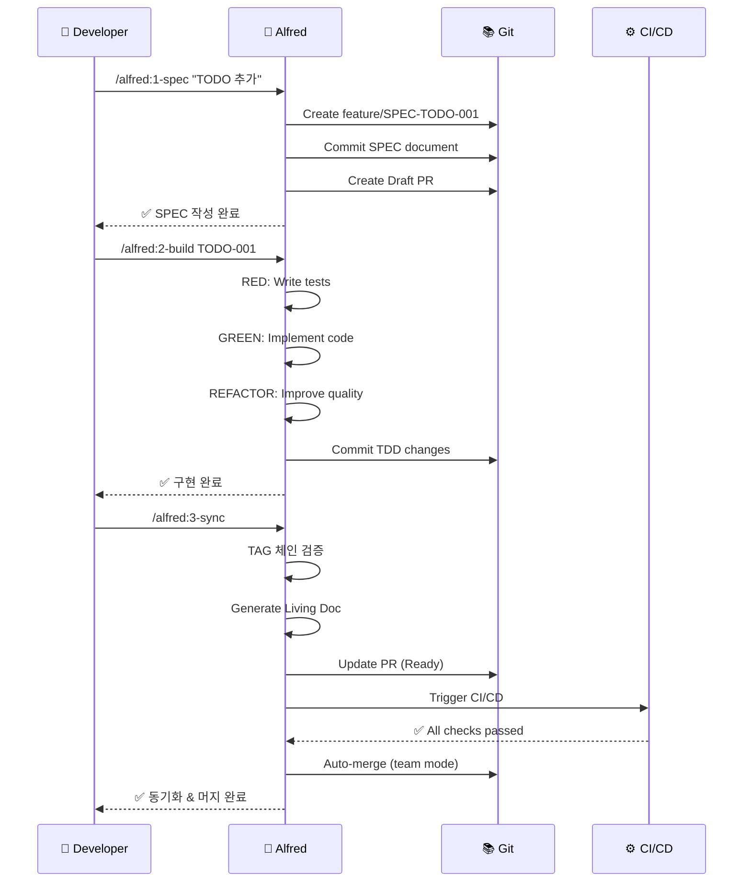

# Quick Start Tutorial

5분만에 MoAI-ADK의 핵심 워크플로우를 체험해보세요! 이 튜토리얼에서는 간단한 TODO 앱을 SPEC-First TDD 방식으로 구현합니다.

## Prerequisites

시작하기 전에 확인하세요:

- ✅ MoAI-ADK 설치 완료 (`moai --version`)
- ✅ Claude Code 설치 (권장)
- ✅ Git 설정 완료

설치가 안 되어 있다면: [Installation Guide](/guides/installation)

---

## Step 1: Create Project

### 1.1 Initialize Project

```bash
# 프로젝트 디렉토리 생성
mkdir todo-app
cd todo-app

# MoAI-ADK 초기화
moai init .
```

### 1.2 Interactive Setup

다음과 같이 입력합니다:

```
✨ Welcome to MoAI-ADK Initialization

? Project name: todo-app
? Description: Simple TODO app with MoAI-ADK
? Development mode: personal
? Primary language: TypeScript
? Initialize Git repository? Yes
? Install dependencies? Yes

✅ Project initialized successfully!
```

### 1.3 Verify Structure

```bash
ls -la
```

생성된 파일들:

```
todo-app/
├── .moai/
│   ├── config.json
│   ├── specs/
│   ├── project/
│   └── memory/
├── .claude/
│   ├── commands/
│   ├── agents/
│   └── hooks/
├── CLAUDE.md
├── package.json
└── .gitignore
```

---

## Step 2: Write SPEC (명세 작성)

이제 Claude Code를 열고 `/alfred:1-spec` 커맨드를 사용합니다.

### 2.1 Execute SPEC Command

**Claude Code**:

```
/alfred:1-spec "TODO 항목 추가 기능"
```

### 2.2 Alfred Response

Alfred가 다음과 같이 SPEC을 작성합니다:

```markdown
📋 SPEC 작성 계획

다음 SPEC을 작성합니다:
- SPEC ID: TODO-001
- 제목: TODO 항목 추가 기능
- 브랜치: feature/SPEC-TODO-001
- Draft PR: 생성 예정

진행하시겠습니까? (진행/수정/중단)
```

**답변**: `진행`

### 2.3 Generated SPEC

Alfred가 자동으로 다음 파일을 생성합니다:

**`.moai/specs/SPEC-TODO-001/spec.md`**:

```markdown
---
id: TODO-001
version: 0.0.1
status: draft
created: 2025-10-11
updated: 2025-10-11
author: @YourName
priority: high
---

# @SPEC:TODO-001: TODO 항목 추가 기능

## HISTORY
### v0.0.1 (2025-10-11)
- **INITIAL**: TODO 항목 추가 기능 명세 작성

## Overview
사용자가 새로운 TODO 항목을 추가할 수 있는 기능을 제공합니다.

## EARS Requirements

### Ubiquitous Requirements
- 시스템은 TODO 항목 추가 기능을 제공해야 한다

### Event-driven Requirements
- WHEN 사용자가 할 일을 입력하고 추가 버튼을 클릭하면, 시스템은 새로운 TODO 항목을 생성해야 한다
- WHEN TODO 항목이 생성되면, 시스템은 항목을 목록에 표시해야 한다

### Constraints
- IF 입력이 비어있으면, 시스템은 항목 추가를 거부해야 한다
- 각 TODO 항목은 고유 ID를 가져야 한다
```

### 2.4 Git Status

```bash
git status
```

출력:

```
On branch feature/SPEC-TODO-001
Changes to be committed:
  new file:   .moai/specs/SPEC-TODO-001/spec.md
```

---

## Step 3: Implement with TDD (구현)

### 3.1 Execute Build Command

**Claude Code**:

```
/alfred:2-build SPEC-TODO-001
```

### 3.2 RED Phase (실패하는 테스트)

Alfred가 먼저 테스트를 작성합니다:

**`tests/todo.test.ts`**:

```typescript
// @TEST:TODO-001 | SPEC: SPEC-TODO-001.md

import { describe, it, expect } from 'vitest'
import { TodoManager } from '@/todo'

describe('@TEST:TODO-001: TODO 항목 추가', () => {
  it('should add a new todo item', () => {
    const manager = new TodoManager()
    const todo = manager.addTodo('Buy milk')

    expect(todo).toBeDefined()
    expect(todo.id).toBeTruthy()
    expect(todo.text).toBe('Buy milk')
    expect(todo.completed).toBe(false)
  })

  it('should reject empty todo items', () => {
    const manager = new TodoManager()

    expect(() => manager.addTodo('')).toThrow('TODO text cannot be empty')
  })
})
```

**테스트 실행** (실패해야 함):

```bash
bun test
# ❌ FAIL tests/todo.test.ts
# Cannot find module '@/todo'
```

### 3.3 GREEN Phase (구현)

Alfred가 구현합니다:

**`src/todo.ts`**:

```typescript
// @CODE:TODO-001 | SPEC: SPEC-TODO-001.md | TEST: tests/todo.test.ts

export interface Todo {
  id: string
  text: string
  completed: boolean
}

export class TodoManager {
  private todos: Todo[] = []

  addTodo(text: string): Todo {
    if (!text.trim()) {
      throw new Error('TODO text cannot be empty')
    }

    const todo: Todo = {
      id: crypto.randomUUID(),
      text: text.trim(),
      completed: false
    }

    this.todos.push(todo)
    return todo
  }

  getTodos(): Todo[] {
    return [...this.todos]
  }
}
```

**테스트 실행** (통과해야 함):

```bash
bun test
# ✅ PASS tests/todo.test.ts (2 tests)
```

### 3.4 REFACTOR Phase

Alfred가 코드 품질을 개선합니다:

```typescript
// @CODE:TODO-001 | SPEC: SPEC-TODO-001.md | TEST: tests/todo.test.ts
//
// TDD History:
// - RED: 테스트 케이스 작성 (2 tests)
// - GREEN: TodoManager.addTodo() 구현
// - REFACTOR: 입력 검증 및 타입 안전성 강화

import { v4 as uuidv4 } from 'uuid'

export interface Todo {
  readonly id: string
  readonly text: string
  readonly completed: boolean
  readonly createdAt: Date
}

export class TodoManager {
  private readonly todos: Map<string, Todo> = new Map()

  addTodo(text: string): Todo {
    this.validateInput(text)

    const todo: Todo = {
      id: uuidv4(),
      text: text.trim(),
      completed: false,
      createdAt: new Date()
    }

    this.todos.set(todo.id, todo)
    return todo
  }

  private validateInput(text: string): void {
    if (!text?.trim()) {
      throw new Error('TODO text cannot be empty')
    }
  }

  getTodos(): ReadonlyArray<Todo> {
    return Array.from(this.todos.values())
  }
}
```

---

## Step 4: Sync Documentation (문서 동기화)

### 4.1 Execute Sync Command

**Claude Code**:

```
/alfred:3-sync
```

### 4.2 Alfred Response

```markdown
📝 문서 동기화 시작

검색된 TAG:
- @SPEC:TODO-001 (1)
- @TEST:TODO-001 (1)
- @CODE:TODO-001 (1)

TAG 체인 검증: ✅ 무결성 확인됨

Living Document 생성:
- .moai/reports/sync-report-2025-10-11.md

PR 상태 업데이트:
- feature/SPEC-TODO-001: Draft → Ready for Review

완료! 🎉
```

### 4.3 Review Sync Report

**`.moai/reports/sync-report-2025-10-11.md`**:

```markdown
# Sync Report - 2025-10-11

## TAG Chain Summary

### SPEC-TODO-001
- ✅ @SPEC:TODO-001 (.moai/specs/SPEC-TODO-001/spec.md)
- ✅ @TEST:TODO-001 (tests/todo.test.ts)
- ✅ @CODE:TODO-001 (src/todo.ts)
- ⚠️  @DOC:TODO-001 (not found - optional)

## Test Coverage
- Total: 100%
- Passed: 2/2

## TRUST Compliance
- ✅ Test: 100% coverage
- ✅ Readable: ESLint passed
- ✅ Unified: TypeScript strict mode
- ✅ Secured: No vulnerabilities
- ✅ Trackable: TAG chain intact
```

---

## Step 5: Verify & Merge

### 5.1 Final Verification

```bash
# 테스트 실행
bun test

# 린트 검사
bun run lint

# 타입 체크
bun run type-check

# 모든 검증
bun run check
```

### 5.2 Review Pull Request

```bash
# PR 확인
gh pr view

# 또는 브라우저에서 확인
gh pr view --web
```

### 5.3 Merge (Team Mode)

```bash
# CI/CD 통과 후 자동 머지 (team mode)
/alfred:3-sync --auto-merge

# 또는 수동 머지
gh pr merge --squash
```

---

## Workflow Diagram

완성된 3단계 워크플로우:



---

## What You've Learned

축하합니다! 5분 만에 다음을 배웠습니다:

- ✅ **SPEC-First**: 명세 작성 (`/alfred:1-spec`)
- ✅ **TDD**: RED-GREEN-REFACTOR 사이클 (`/alfred:2-build`)
- ✅ **Traceability**: TAG 체인 (`@SPEC → @TEST → @CODE`)
- ✅ **Documentation**: Living Document 자동 생성 (`/alfred:3-sync`)
- ✅ **GitFlow**: 브랜치 전략 및 PR 관리

---

## Next Steps

이제 실제 프로젝트에 적용해보세요:

### 심화 학습

1. **[Workflow: SPEC Writing](/guides/workflow/1-spec)** - SPEC 작성 상세 가이드
2. **[Workflow: TDD Implementation](/guides/workflow/2-build)** - TDD 구현 패턴
3. **[Workflow: Document Sync](/guides/workflow/3-sync)** - 동기화 전략

### 고급 기능

- **[EARS Requirements](/guides/concepts/ears-guide)** - 체계적 요구사항 작성
- **[TAG System](/guides/concepts/tag-system)** - 추적성 시스템 심화
- **[TRUST Principles](/guides/concepts/trust-principles)** - 품질 원칙 이해
- **[Alfred Agents](/guides/agents/overview)** - 에이전트 활용법

---

<div style="text-align: center; margin-top: 40px;">
  <p><strong>Ready to build amazing things!</strong> 🚀</p>
  <p>다음 프로젝트에서 MoAI-ADK를 사용해보세요.</p>
</div>
