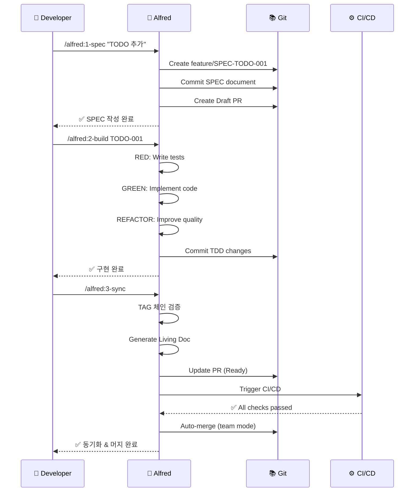

# Quick Start Tutorial

MoAI-ADK를 **5분 안에** 시작하는 완벽 가이드입니다. 설치부터 첫 프로젝트 완성까지 단계별로 안내합니다.

## 🎯 What You'll Learn

이 튜토리얼을 완료하면 다음을 할 수 있습니다:

- ✅ MoAI-ADK 설치 및 프로젝트 초기화
- ✅ SPEC-First 개발 방법론 이해
- ✅ Alfred SuperAgent를 활용한 TDD 구현
- ✅ TAG 시스템으로 코드 추적성 확보
- ✅ Living Document 자동 생성

**예상 소요 시간**: 5-10분

---

## 📦 Installation

### Step 1: 시스템 요구사항 확인

MoAI-ADK를 사용하려면 다음이 필요합니다:

| 항목 | 최소 버전 | 권장 버전 | 확인 명령어 |
|------|----------|----------|------------|
| **Node.js** | 18.0.0+ | 20.0.0+ | `node --version` |
| **패키지 매니저** | - | bun 1.2.0+ | `bun --version` |
| **Git** | 2.0+ | 최신 | `git --version` |
| **Claude Code** | - | 최신 | VSCode 확장 |

::: tip Bun 권장
Bun은 가장 빠른 패키지 매니저입니다. 설치: `curl -fsSL https://bun.sh/install | bash`
:::

### Step 2: MoAI-ADK 설치

전역으로 설치하여 어디서든 `moai` 명령어를 사용하세요:

::: code-group

```bash [bun (권장)]
# Bun으로 전역 설치
bun add -g moai-adk

# 설치 확인
moai --version
# 출력: 0.2.17
```

```bash [npm]
# npm으로 전역 설치
npm install -g moai-adk

# 설치 확인
moai --version
# 출력: 0.2.17
```

```bash [pnpm]
# pnpm으로 전역 설치
pnpm add -g moai-adk

# 설치 확인
moai --version
# 출력: 0.2.17
```

```bash [yarn]
# Yarn으로 전역 설치
yarn global add moai-adk

# 설치 확인
moai --version
# 출력: 0.2.17
```

:::

### Step 3: 시스템 진단

설치가 완료되면 시스템 환경을 확인합니다:

```bash
moai doctor
```

**정상 출력 예시**:

```
🔍 Checking system requirements...

  ⚙️  Runtime:
    ✅ Git (2.50.1)
    ✅ Node.js (20.19.4)

  🛠️  Development:
    ✅ npm (10.8.2)

  📦 Optional:
    ✅ Git LFS (3.7.0)

────────────────────────────────────────────────────────────
  📊 Summary:
     Checks: 4 total
     Status: 4 passed
────────────────────────────────────────────────────────────

✅ All requirements satisfied!
```

::: warning 오류 발생 시

- **Node.js 없음**: [Node.js 공식 사이트](https://nodejs.org/)에서 설치
- **Git 없음**: `brew install git` (macOS) 또는 [Git 공식 사이트](https://git-scm.com/)
- **권한 오류**: `sudo chown -R $(whoami) ~/.npm` 또는 `~/.bun` 실행
:::

---

## 🚀 Your First Project

이제 간단한 TODO 앱을 SPEC-First TDD 방식으로 만들어봅니다.

## Prerequisites

시작하기 전에 다음이 준비되었는지 확인하세요:

- ✅ MoAI-ADK 설치 완료 (`moai --version`)
- ✅ Claude Code 설치 (필수, [VSCode 확장 설치](https://marketplace.visualstudio.com/items?itemName=Anthropic.claude-code))
- ✅ Git 설정 완료 (`git config --global user.name` 확인)

---

## Step 1: Create Project

### 1.1 Initialize Project

```bash
# 프로젝트 디렉토리 생성
mkdir todo-app
cd todo-app

# MoAI-ADK 초기화
moai init .
```

### 1.2 Interactive Setup

다음과 같이 입력합니다:

```
✨ Welcome to MoAI-ADK Initialization

? Project name: todo-app
? Description: Simple TODO app with MoAI-ADK
? Development mode: personal
? Primary language: TypeScript
? Initialize Git repository? Yes
? Install dependencies? Yes

✅ Project initialized successfully!
```

### 1.3 Verify Structure

```bash
ls -la
```

생성된 파일들:

```
todo-app/
├── .moai/
│   ├── config.json
│   ├── specs/
│   ├── project/
│   └── memory/
├── .claude/
│   ├── commands/
│   ├── agents/
│   └── hooks/
├── CLAUDE.md
├── package.json
└── .gitignore
```

---

## Step 2: Write SPEC (명세 작성)

이제 Claude Code를 열고 `/alfred:1-spec` 커맨드를 사용합니다.

### 2.1 Execute SPEC Command

**Claude Code**:

```
/alfred:1-spec "TODO 항목 추가 기능"
```

### 2.2 Alfred Response

Alfred가 다음과 같이 SPEC을 작성합니다:

```markdown
📋 SPEC 작성 계획

다음 SPEC을 작성합니다:
- SPEC ID: TODO-001
- 제목: TODO 항목 추가 기능
- 브랜치: feature/SPEC-TODO-001
- Draft PR: 생성 예정

진행하시겠습니까? (진행/수정/중단)
```

**답변**: `진행`

### 2.3 Generated SPEC

Alfred가 자동으로 다음 파일을 생성합니다:

**`.moai/specs/SPEC-TODO-001/spec.md`**:

```markdown
---
id: TODO-001
version: 0.0.1
status: draft
created: 2025-10-11
updated: 2025-10-11
author: @YourName
priority: high
---

# @SPEC:TODO-001: TODO 항목 추가 기능

## HISTORY
### v0.0.1 (2025-10-11)
- **INITIAL**: TODO 항목 추가 기능 명세 작성

## Overview
사용자가 새로운 TODO 항목을 추가할 수 있는 기능을 제공합니다.

## EARS Requirements

### Ubiquitous Requirements
- 시스템은 TODO 항목 추가 기능을 제공해야 한다

### Event-driven Requirements
- WHEN 사용자가 할 일을 입력하고 추가 버튼을 클릭하면, 시스템은 새로운 TODO 항목을 생성해야 한다
- WHEN TODO 항목이 생성되면, 시스템은 항목을 목록에 표시해야 한다

### Constraints
- IF 입력이 비어있으면, 시스템은 항목 추가를 거부해야 한다
- 각 TODO 항목은 고유 ID를 가져야 한다
```

### 2.4 Git Status

```bash
git status
```

출력:

```
On branch feature/SPEC-TODO-001
Changes to be committed:
  new file:   .moai/specs/SPEC-TODO-001/spec.md
```

---

## Step 3: Implement with TDD (구현)

### 3.1 Execute Build Command

**Claude Code**:

```
/alfred:2-build SPEC-TODO-001
```

### 3.2 RED Phase (실패하는 테스트)

Alfred가 먼저 테스트를 작성합니다:

**`tests/todo.test.ts`**:

```typescript
// @TEST:TODO-001 | SPEC: SPEC-TODO-001.md

import { describe, it, expect } from 'vitest'
import { TodoManager } from '@/todo'

describe('@TEST:TODO-001: TODO 항목 추가', () => {
  it('should add a new todo item', () => {
    const manager = new TodoManager()
    const todo = manager.addTodo('Buy milk')

    expect(todo).toBeDefined()
    expect(todo.id).toBeTruthy()
    expect(todo.text).toBe('Buy milk')
    expect(todo.completed).toBe(false)
  })

  it('should reject empty todo items', () => {
    const manager = new TodoManager()

    expect(() => manager.addTodo('')).toThrow('TODO text cannot be empty')
  })
})
```

**테스트 실행** (실패해야 함):

```bash
bun test
# ❌ FAIL tests/todo.test.ts
# Cannot find module '@/todo'
```

### 3.3 GREEN Phase (구현)

Alfred가 구현합니다:

**`src/todo.ts`**:

```typescript
// @CODE:TODO-001 | SPEC: SPEC-TODO-001.md | TEST: tests/todo.test.ts

export interface Todo {
  id: string
  text: string
  completed: boolean
}

export class TodoManager {
  private todos: Todo[] = []

  addTodo(text: string): Todo {
    if (!text.trim()) {
      throw new Error('TODO text cannot be empty')
    }

    const todo: Todo = {
      id: crypto.randomUUID(),
      text: text.trim(),
      completed: false
    }

    this.todos.push(todo)
    return todo
  }

  getTodos(): Todo[] {
    return [...this.todos]
  }
}
```

**테스트 실행** (통과해야 함):

```bash
bun test
# ✅ PASS tests/todo.test.ts (2 tests)
```

### 3.4 REFACTOR Phase

Alfred가 코드 품질을 개선합니다:

```typescript
// @CODE:TODO-001 | SPEC: SPEC-TODO-001.md | TEST: tests/todo.test.ts
//
// TDD History:
// - RED: 테스트 케이스 작성 (2 tests)
// - GREEN: TodoManager.addTodo() 구현
// - REFACTOR: 입력 검증 및 타입 안전성 강화

import { v4 as uuidv4 } from 'uuid'

export interface Todo {
  readonly id: string
  readonly text: string
  readonly completed: boolean
  readonly createdAt: Date
}

export class TodoManager {
  private readonly todos: Map<string, Todo> = new Map()

  addTodo(text: string): Todo {
    this.validateInput(text)

    const todo: Todo = {
      id: uuidv4(),
      text: text.trim(),
      completed: false,
      createdAt: new Date()
    }

    this.todos.set(todo.id, todo)
    return todo
  }

  private validateInput(text: string): void {
    if (!text?.trim()) {
      throw new Error('TODO text cannot be empty')
    }
  }

  getTodos(): ReadonlyArray<Todo> {
    return Array.from(this.todos.values())
  }
}
```

---

## Step 4: Sync Documentation (문서 동기화)

### 4.1 Execute Sync Command

**Claude Code**:

```
/alfred:3-sync
```

### 4.2 Alfred Response

```markdown
📝 문서 동기화 시작

검색된 TAG:
- @SPEC:TODO-001 (1)
- @TEST:TODO-001 (1)
- @CODE:TODO-001 (1)

TAG 체인 검증: ✅ 무결성 확인됨

Living Document 생성:
- .moai/reports/sync-report-2025-10-11.md

PR 상태 업데이트:
- feature/SPEC-TODO-001: Draft → Ready for Review

완료! 🎉
```

### 4.3 Review Sync Report

**`.moai/reports/sync-report-2025-10-11.md`**:

```markdown
# Sync Report - 2025-10-11

## TAG Chain Summary

### SPEC-TODO-001
- ✅ @SPEC:TODO-001 (.moai/specs/SPEC-TODO-001/spec.md)
- ✅ @TEST:TODO-001 (tests/todo.test.ts)
- ✅ @CODE:TODO-001 (src/todo.ts)
- ⚠️  @DOC:TODO-001 (not found - optional)

## Test Coverage
- Total: 100%
- Passed: 2/2

## TRUST Compliance
- ✅ Test: 100% coverage
- ✅ Readable: ESLint passed
- ✅ Unified: TypeScript strict mode
- ✅ Secured: No vulnerabilities
- ✅ Trackable: TAG chain intact
```

---

## Step 5: Verify & Merge

### 5.1 Final Verification

```bash
# 테스트 실행
bun test

# 린트 검사
bun run lint

# 타입 체크
bun run type-check

# 모든 검증
bun run check
```

### 5.2 Review Pull Request

```bash
# PR 확인
gh pr view

# 또는 브라우저에서 확인
gh pr view --web
```

### 5.3 Merge (Team Mode)

```bash
# CI/CD 통과 후 자동 머지 (team mode)
/alfred:3-sync --auto-merge

# 또는 수동 머지
gh pr merge --squash
```

---

## Workflow Diagram

완성된 3단계 워크플로우:



---

## What You've Learned

축하합니다! 5분 만에 다음을 배웠습니다:

- ✅ **SPEC-First**: 명세 작성 (`/alfred:1-spec`)
- ✅ **TDD**: RED-GREEN-REFACTOR 사이클 (`/alfred:2-build`)
- ✅ **Traceability**: TAG 체인 (`@SPEC → @TEST → @CODE`)
- ✅ **Documentation**: Living Document 자동 생성 (`/alfred:3-sync`)
- ✅ **GitFlow**: 브랜치 전략 및 PR 관리

---

## 🔄 Keeping MoAI-ADK Updated

### 업데이트 확인 및 실행

MoAI-ADK는 주기적으로 업데이트됩니다. Claude Code에서 `/alfred:9-update` 커맨드를 사용하여 안전하게 업데이트할 수 있습니다.

**기본 사용법**:

```bash
# Claude Code에서 실행
/alfred:9-update
```

**고급 옵션**:

```bash
# 업데이트 가능 여부만 확인
/alfred:9-update --check

# 품질 검증 포함 (프로덕션 환경)
/alfred:9-update --check-quality

# 백업 없이 강제 업데이트 (주의)
/alfred:9-update --force
```

**출력 예시 (--check 옵션)**:

```
🔍 업데이트 확인 중...

현재 버전: v0.2.16
최신 버전: v0.2.17
업데이트 유형: Patch (완전 호환)

✅ 업데이트 가능

업데이트하려면: /alfred:9-update
```

**업데이트 프로세스**:

1. ✅ **백업 생성** - `.moai-backup/{timestamp}/` 자동 생성
2. ✅ **패키지 업데이트** - npm/pnpm/bun/yarn 자동 감지
3. ✅ **템플릿 동기화** - 최신 명령어/에이전트/훅 파일 복사
4. ✅ **무결성 검증** - 파일 개수, 버전, 권한 확인
5. ✅ **품질 검증** (선택) - TRUST 5원칙 검증

::: tip 사용자 데이터 보호
업데이트는 **절대로** 다음 디렉토리를 건드리지 않습니다:

- `.moai/specs/` - 사용자 SPEC 파일
- `.moai/reports/` - 동기화 리포트
- `.moai/project/*.md` - 사용자 작성 프로젝트 문서
:::

### 업데이트 실패 시 복원

만약 업데이트 중 문제가 발생하면 자동 백업에서 복원할 수 있습니다:

```bash
# 백업 목록 확인
ls -la .moai-backup/

# 출력 예시:
# drwxr-xr-x  2025-10-11-15-30-00
# drwxr-xr-x  2025-10-10-09-15-22

# 수동 복원
cp -r .moai-backup/2025-10-11-15-30-00/.claude/ ./
cp -r .moai-backup/2025-10-11-15-30-00/.moai/ ./
cp .moai-backup/2025-10-11-15-30-00/CLAUDE.md ./
```

### 버전별 호환성

| 업데이트 유형 | 호환성 | 예시 | 권장 방법 |
|------------|-------|------|----------|
| **Patch** | ✅ 완전 호환 | v0.2.16 → v0.2.17 | `/alfred:9-update` |
| **Minor** | ⚠️ 설정 확인 권장 | v0.2.x → v0.3.x | `/alfred:9-update --check-quality` |
| **Major** | ❌ Breaking Changes | v0.x.x → v1.x.x | 마이그레이션 가이드 필수 확인 |

---

## 📚 Next Steps

축하합니다! MoAI-ADK의 기본을 완료했습니다. 이제 실제 프로젝트에 적용해보세요:

### 심화 학습 (필수)

다음 순서로 학습하면 MoAI-ADK를 완벽히 활용할 수 있습니다:

1. **[Workflow: Project Init](guides/workflow/0-project.md)** - 프로젝트 초기화 상세 가이드
2. **[Workflow: SPEC Writing](guides/workflow/1-spec.md)** - EARS 기반 명세 작성법
3. **[Workflow: TDD Implementation](guides/workflow/2-build.md)** - RED-GREEN-REFACTOR 사이클
4. **[Workflow: Document Sync](guides/workflow/3-sync.md)** - 문서 동기화 및 TAG 검증
5. **[Workflow: Update](guides/workflow/9-update.md)** - 안전한 업데이트 전략

### 핵심 개념 이해

MoAI-ADK의 철학과 원칙을 이해하세요:

- **[SPEC-First TDD](guides/concepts/spec-first-tdd.md)** - 명세 주도 개발 방법론
- **[EARS Requirements](guides/concepts/ears-guide.md)** - 체계적 요구사항 작성법
- **[TAG System](guides/concepts/tag-system.md)** - 코드 추적성 시스템
- **[TRUST Principles](guides/concepts/trust-principles.md)** - 5가지 품질 원칙

### 에이전트 활용

Alfred와 9개의 전문 에이전트를 활용하세요:

- **[Alfred SuperAgent](guides/agents/alfred.md)** - 중앙 오케스트레이터
- **[Specialized Agents](guides/agents/overview.md)** - 9개의 전문 에이전트 소개

### 문제 해결

막히는 부분이 있다면:

- **[Troubleshooting](guides/troubleshooting.md)** - 일반적인 문제 해결
- **[FAQ](guides/faq.md)** - 자주 묻는 질문
- **[GitHub Issues](https://github.com/modu-ai/moai-adk/issues)** - 버그 리포트 및 기능 요청

---

## 🆘 Need Help?

### 커뮤니티 지원

- **[GitHub Discussions](https://github.com/modu-ai/moai-adk/discussions)** - 질문 및 아이디어 공유
- **[GitHub Issues](https://github.com/modu-ai/moai-adk/issues)** - 버그 리포트
- **[Changelog](https://github.com/modu-ai/moai-adk/releases)** - 버전별 변경사항

### 시스템 진단

문제가 발생하면 다음 명령어로 진단하세요:

```bash
# 시스템 환경 확인
moai doctor

# 상세 로그 보기
moai doctor --verbose

# 프로젝트 상태 확인
moai status

# 백업 목록 확인
moai doctor --list-backups
```

---

<div style="text-align: center; margin-top: 40px;">
  <p><strong>🎉 축하합니다! MoAI-ADK를 시작했습니다!</strong></p>
  <p>이제 SPEC-First TDD로 품질 높은 코드를 작성할 준비가 되었습니다.</p>
  <p style="margin-top: 20px;">
    <strong>Ready to build amazing things!</strong> 🚀
  </p>
</div>
