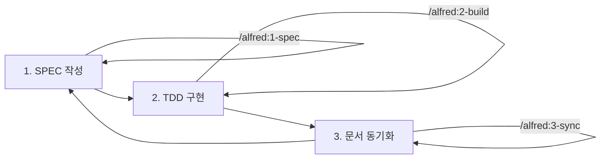

# SPEC-First TDD 방법론 완전 가이드

> **"명세 없으면 코드 없다. 테스트 없으면 구현 없다."**

MoAI-ADK는 SPEC-First TDD 방법론을 통해 완벽한 코드 품질과 추적성을 보장합니다.

---

## 목차

1. [SPEC-First TDD란?](#spec-first-tdd란)
2. [핵심 개발 루프 (3단계)](#핵심-개발-루프-3단계)
3. [EARS 요구사항 작성법](#ears-요구사항-작성법)
4. [SPEC 문서 구조](#spec-문서-구조)
5. [TDD 사이클 상세](#tdd-사이클-상세)
6. [언어별 TDD 구현](#언어별-tdd-구현)
7. [SPEC 버전 관리](#spec-버전-관리)
8. [실전 예시](#실전-예시)
9. [트러블슈팅](#트러블슈팅)
10. [다음 단계](#다음-단계)

---

## SPEC-First TDD란?

### 정의

**SPEC-First TDD**는 다음 3가지 원칙을 결합한 개발 방법론입니다:

1. **SPEC-First**: 코드 작성 전 명세를 먼저 작성
2. **TDD (Test-Driven Development)**: 테스트를 먼저 작성하고 구현
3. **Traceability**: @TAG 시스템으로 완전한 추적성 보장

### 철학

```
SPEC (요구사항) → TEST (검증 기준) → CODE (구현) → DOC (문서화)
```

각 단계는 이전 단계를 참조하며, @TAG 시스템으로 연결됩니다.

### 장점

| 장점 | 설명 |
|------|------|
| **명확한 요구사항** | EARS 구문으로 모호함 없는 명세 |
| **높은 테스트 커버리지** | TDD로 85% 이상 보장 |
| **완전한 추적성** | @TAG로 SPEC → CODE 추적 |
| **Living Document** | 코드와 문서 자동 동기화 |
| **빠른 피드백** | RED → GREEN → REFACTOR 즉시 검증 |

### 전통적 개발 방식과의 비교

| 항목 | 전통적 방식 | SPEC-First TDD |
|------|------------|---------------|
| **요구사항** | 구두 또는 간단한 문서 | EARS 방식 상세 SPEC |
| **테스트** | 구현 후 작성 (선택) | 구현 전 작성 (필수) |
| **문서** | 수동 업데이트 (낙후) | 자동 동기화 (최신) |
| **추적성** | 없음 또는 수동 | @TAG 자동 추적 |
| **품질** | 불확실 | TRUST 5원칙 보장 |

---

## 핵심 개발 루프 (3단계)

MoAI-ADK의 핵심 개발 루프는 다음 3단계로 구성됩니다:



### 1단계: SPEC 작성 (`/alfred:1-spec`)

**목표**: 명세 없이는 코드 없음

**입력**:
- 기능 설명 (자연어)
- 참조 문서 (선택)

**출력**:
- `.moai/specs/SPEC-{ID}/spec.md`
- @SPEC:ID TAG
- feature/SPEC-{ID} 브랜치
- Draft PR

**예시**:

```bash
/alfred:1-spec "JWT 기반 사용자 인증 시스템"
```

### 2단계: TDD 구현 (`/alfred:2-build`)

**목표**: 테스트 없이는 구현 없음

**입력**:
- SPEC ID (예: AUTH-001)

**출력**:
- `tests/test_*.py` (@TEST:ID)
- `src/*.py` (@CODE:ID)
- TDD 사이클별 커밋 (RED → GREEN → REFACTOR)

**예시**:

```bash
/alfred:2-build AUTH-001
```

### 3단계: 문서 동기화 (`/alfred:3-sync`)

**목표**: 추적성 없이는 완성 없음

**입력**:
- 현재 브랜치 상태

**출력**:
- Living Document (docs/)
- TAG 체인 검증
- PR Ready 전환

**예시**:

```bash
/alfred:3-sync --auto-merge
```

---

## EARS 요구사항 작성법

### EARS란?

**EARS (Easy Approach to Requirements Syntax)**: 체계적인 요구사항 작성 방법론

NASA와 Rolls-Royce가 공동 개발한 방법론으로, 명확하고 검증 가능한 요구사항을 작성하기 위한 5가지 구문을 제공합니다.

### EARS 5가지 구문

#### 1. Ubiquitous (기본 요구사항)

**형식**: 시스템은 [기능]을 제공해야 한다

**사용 시기**: 항상 제공되어야 하는 기능

**예시**:

```markdown
### Ubiquitous Requirements

- 시스템은 사용자 인증 기능을 제공해야 한다
- 시스템은 JWT 토큰 생성 기능을 제공해야 한다
- 시스템은 토큰 검증 기능을 제공해야 한다
```

**Python 테스트 예시**:

```python
def test_auth_system_provides_jwt_generation():
    """시스템은 JWT 토큰 생성 기능을 제공해야 한다"""
    auth_service = AuthService()
    assert hasattr(auth_service, "generate_token")
```

#### 2. Event-driven (이벤트 기반)

**형식**: WHEN [조건]이면, 시스템은 [동작]해야 한다

**사용 시기**: 특정 이벤트 발생 시 동작

**예시**:

```markdown
### Event-driven Requirements

- WHEN 사용자가 유효한 자격증명으로 로그인하면, 시스템은 JWT 토큰을 발급해야 한다
- WHEN 토큰이 만료되면, 시스템은 401 에러를 반환해야 한다
- WHEN 잘못된 토큰이 제공되면, 시스템은 인증을 거부해야 한다
```

**Python 테스트 예시**:

```python
def test_login_with_valid_credentials_generates_token():
    """WHEN 사용자가 유효한 자격증명으로 로그인하면, JWT 토큰을 발급해야 한다"""
    auth_service = AuthService()
    user = User(username="test", password="password123")

    token = auth_service.login(user)

    assert token is not None
    assert isinstance(token, str)
```

#### 3. State-driven (상태 기반)

**형식**: WHILE [상태]일 때, 시스템은 [동작]해야 한다

**사용 시기**: 특정 상태가 유지되는 동안 동작

**예시**:

```markdown
### State-driven Requirements

- WHILE 사용자가 인증된 상태일 때, 시스템은 보호된 리소스 접근을 허용해야 한다
- WHILE 토큰이 유효한 상태일 때, 시스템은 API 요청을 처리해야 한다
```

**Python 테스트 예시**:

```python
def test_authenticated_user_can_access_protected_resource():
    """WHILE 사용자가 인증된 상태일 때, 보호된 리소스 접근을 허용해야 한다"""
    auth_service = AuthService()
    token = auth_service.generate_token(user_id=1)

    # WHILE 토큰이 유효한 상태
    is_authenticated = auth_service.verify_token(token)
    assert is_authenticated is True

    # 보호된 리소스 접근 허용
    resource = auth_service.get_protected_resource(token)
    assert resource is not None
```

#### 4. Optional (선택적 기능)

**형식**: WHERE [조건]이면, 시스템은 [동작]할 수 있다

**사용 시기**: 선택적으로 제공되는 기능

**예시**:

```markdown
### Optional Features

- WHERE 리프레시 토큰이 제공되면, 시스템은 새로운 액세스 토큰을 발급할 수 있다
- WHERE 2FA가 활성화되면, 시스템은 추가 인증을 요구할 수 있다
```

**Python 테스트 예시**:

```python
def test_refresh_token_generates_new_access_token():
    """WHERE 리프레시 토큰이 제공되면, 새로운 액세스 토큰을 발급할 수 있다"""
    auth_service = AuthService()
    refresh_token = auth_service.generate_refresh_token(user_id=1)

    # WHERE 리프레시 토큰이 제공되면
    if refresh_token:
        new_access_token = auth_service.refresh_access_token(refresh_token)
        assert new_access_token is not None
```

#### 5. Constraints (제약사항)

**형식**: IF [조건]이면, 시스템은 [제약]해야 한다

**사용 시기**: 시스템 제약사항 명시

**예시**:

```markdown
### Constraints

- IF 잘못된 토큰이 제공되면, 시스템은 접근을 거부해야 한다
- 액세스 토큰 만료시간은 15분을 초과하지 않아야 한다
- 비밀번호는 최소 8자 이상이어야 한다
```

**Python 테스트 예시**:

```python
def test_invalid_token_denies_access():
    """IF 잘못된 토큰이 제공되면, 접근을 거부해야 한다"""
    auth_service = AuthService()
    invalid_token = "invalid.token.here"

    with pytest.raises(AuthenticationError):
        auth_service.verify_token(invalid_token)

def test_access_token_expiry_constraint():
    """액세스 토큰 만료시간은 15분을 초과하지 않아야 한다"""
    auth_service = AuthService()
    token = auth_service.generate_token(user_id=1)

    payload = auth_service.decode_token(token)
    expiry_time = payload["exp"] - payload["iat"]

    assert expiry_time <= 15 * 60  # 15분 = 900초
```

### EARS 작성 체크리스트

- [ ] 각 요구사항은 하나의 EARS 구문을 사용
- [ ] 모호한 표현 없음 ("빠르게", "쉽게" 등 제거)
- [ ] 측정 가능한 기준 명시 ("15분", "85%" 등)
- [ ] 검증 가능한 테스트 케이스 작성 가능
- [ ] SPEC ID와 연결된 @TAG 포함

---

## SPEC 문서 구조

### 필수 구조

모든 SPEC 문서는 다음 구조를 따릅니다:

```markdown
---
# 필수 필드 (7개)
id: AUTH-001
version: 0.0.1
status: draft
created: 2025-10-14
updated: 2025-10-14
author: @Goos
priority: high

# 선택 필드 (권장)
category: feature
labels:
  - authentication
  - jwt
---

# @SPEC:AUTH-001: JWT 인증 시스템

## HISTORY

### v0.0.1 (2025-10-14)
- **INITIAL**: JWT 기반 인증 시스템 명세 작성
- **AUTHOR**: @Goos

## 개요

[SPEC 개요 및 배경]

## EARS 요구사항

### Ubiquitous Requirements
[기본 요구사항]

### Event-driven Requirements
[이벤트 기반 요구사항]

### State-driven Requirements
[상태 기반 요구사항]

### Optional Features
[선택적 기능]

### Constraints
[제약사항]

## 아키텍처

[시스템 아키텍처 다이어그램 및 설명]

## 인터페이스

[API 인터페이스 명세]

## 테스트 계획

[테스트 시나리오 및 검증 기준]

## 리스크

[예상 리스크 및 완화 방안]
```

### YAML Front Matter 필수 필드

| 필드 | 타입 | 설명 | 예시 |
|------|------|------|------|
| `id` | string | SPEC 고유 ID | `AUTH-001` |
| `version` | string | Semantic Version | `0.0.1` |
| `status` | enum | 진행 상태 | `draft` |
| `created` | date | 생성일 | `2025-10-14` |
| `updated` | date | 최종 수정일 | `2025-10-14` |
| `author` | string | 작성자 | `@Goos` |
| `priority` | enum | 우선순위 | `high` |

### HISTORY 섹션 작성 규칙

**변경 유형 태그**:
- `INITIAL`: 최초 작성 (v0.0.1)
- `ADDED`: 새 기능/요구사항 추가
- `CHANGED`: 기존 내용 수정
- `FIXED`: 버그/오류 수정
- `REMOVED`: 기능/요구사항 제거
- `BREAKING`: 하위 호환성 깨지는 변경
- `DEPRECATED`: 향후 제거 예정 표시

**예시**:

```markdown
## HISTORY

### v0.2.0 (2025-10-15)
- **ADDED**: OAuth2 통합 요구사항 추가
- **AUTHOR**: @Goos
- **REVIEW**: @Alice (승인)
- **RELATED**: #123

### v0.1.1 (2025-10-14)
- **FIXED**: 토큰 만료 시간 명세 오류 수정 (15분 → 900초)
- **AUTHOR**: @Bob
- **REASON**: 단위 불일치 해결

### v0.1.0 (2025-10-14)
- **CHANGED**: status: draft → completed
- **AUTHOR**: @Goos (Alfred /alfred:3-sync 자동 업데이트)

### v0.0.1 (2025-10-14)
- **INITIAL**: JWT 기반 인증 시스템 명세 작성
- **AUTHOR**: @Goos
```

---

## TDD 사이클 상세

### TDD 3단계 사이클

```mermaid
graph LR
    A[RED: 실패하는 테스트] --> B[GREEN: 최소 구현]
    B --> C[REFACTOR: 코드 개선]
    C --> A

    A -->|@TEST:ID| A
    B -->|@CODE:ID| B
    C -->|@CODE:ID| C
```

### RED 단계: 실패하는 테스트 작성

**목표**: SPEC 요구사항을 검증하는 테스트 작성

**원칙**:
- SPEC의 EARS 요구사항을 직접 테스트
- 구현이 없으므로 반드시 실패해야 함
- @TEST:ID TAG 포함

**Python 예시**:

```python
# @TEST:AUTH-001 | SPEC: SPEC-AUTH-001.md
import pytest
from src.auth.jwt_service import JWTService, AuthenticationError


class TestJWTAuthentication:
    """@SPEC:AUTH-001 JWT 인증 시스템 테스트"""

    def test_system_provides_jwt_generation(self):
        """Ubiquitous: 시스템은 JWT 토큰 생성 기능을 제공해야 한다"""
        service = JWTService()
        assert hasattr(service, "generate_token")

    def test_login_with_valid_credentials_generates_token(self):
        """Event-driven: WHEN 유효한 자격증명으로 로그인하면, JWT 토큰을 발급해야 한다"""
        service = JWTService()
        token = service.generate_token(user_id=1)

        assert token is not None
        assert isinstance(token, str)
        assert len(token.split(".")) == 3  # JWT 형식 확인

    def test_invalid_token_denies_access(self):
        """Constraint: IF 잘못된 토큰이 제공되면, 접근을 거부해야 한다"""
        service = JWTService()

        with pytest.raises(AuthenticationError):
            service.verify_token("invalid.token.here")
```

**실행 결과 (실패)**:

```bash
$ pytest tests/test_jwt_service.py -v

tests/test_jwt_service.py::TestJWTAuthentication::test_system_provides_jwt_generation FAILED
tests/test_jwt_service.py::TestJWTAuthentication::test_login_with_valid_credentials_generates_token FAILED
tests/test_jwt_service.py::TestJWTAuthentication::test_invalid_token_denies_access FAILED

==================== FAILURES ====================
...
ModuleNotFoundError: No module named 'src.auth.jwt_service'
```

**커밋**:

```bash
git add tests/test_jwt_service.py
git commit -m "🔴 RED: SPEC-AUTH-001 JWT 인증 테스트 작성

@TAG:AUTH-001-RED"
```

### GREEN 단계: 최소 구현

**목표**: 테스트를 통과하는 최소한의 코드 작성

**원칙**:
- 모든 테스트가 통과해야 함
- 코드 품질보다 동작 우선
- @CODE:ID TAG 포함

**Python 예시**:

```python
# @CODE:AUTH-001 | SPEC: SPEC-AUTH-001.md | TEST: tests/test_jwt_service.py
import jwt
from datetime import datetime, timedelta
from typing import Dict, Any


class AuthenticationError(Exception):
    """인증 오류"""
    pass


class JWTService:
    """@SPEC:AUTH-001 JWT 인증 서비스"""

    def __init__(self, secret_key: str = "secret"):
        self.secret_key = secret_key

    def generate_token(self, user_id: int) -> str:
        """JWT 토큰 생성"""
        payload = {
            "user_id": user_id,
            "iat": datetime.utcnow(),
            "exp": datetime.utcnow() + timedelta(minutes=15),
        }
        return jwt.encode(payload, self.secret_key, algorithm="HS256")

    def verify_token(self, token: str) -> Dict[str, Any]:
        """JWT 토큰 검증"""
        try:
            return jwt.decode(token, self.secret_key, algorithms=["HS256"])
        except jwt.InvalidTokenError:
            raise AuthenticationError("Invalid token")
```

**실행 결과 (성공)**:

```bash
$ pytest tests/test_jwt_service.py -v

tests/test_jwt_service.py::TestJWTAuthentication::test_system_provides_jwt_generation PASSED
tests/test_jwt_service.py::TestJWTAuthentication::test_login_with_valid_credentials_generates_token PASSED
tests/test_jwt_service.py::TestJWTAuthentication::test_invalid_token_denies_access PASSED

==================== 3 passed in 0.12s ====================
```

**커밋**:

```bash
git add src/auth/jwt_service.py
git commit -m "🟢 GREEN: SPEC-AUTH-001 JWT 인증 구현

@TAG:AUTH-001-GREEN"
```

### REFACTOR 단계: 코드 개선

**목표**: 테스트 통과를 유지하면서 코드 품질 개선

**원칙**:
- 테스트는 여전히 통과해야 함
- 코드 제약 준수 (함수 ≤50 LOC, 복잡도 ≤10)
- 린터/타입 체크 통과
- @CODE:ID TAG 유지

**Python 예시** (리팩토링):

```python
# @CODE:AUTH-001 | SPEC: SPEC-AUTH-001.md | TEST: tests/test_jwt_service.py
import jwt
from datetime import datetime, timedelta, timezone
from typing import Dict, Any
from dataclasses import dataclass


class AuthenticationError(Exception):
    """인증 오류"""
    pass


@dataclass
class TokenConfig:
    """토큰 설정"""
    secret_key: str = "secret"
    algorithm: str = "HS256"
    expiry_minutes: int = 15


class JWTService:
    """
    @SPEC:AUTH-001 JWT 인증 서비스

    TDD 이력:
    - v0.0.1 (2025-10-14): RED - 테스트 작성
    - v0.1.0 (2025-10-14): GREEN - 최소 구현
    - v0.1.1 (2025-10-14): REFACTOR - 코드 품질 개선
    """

    def __init__(self, config: TokenConfig | None = None):
        self.config = config or TokenConfig()

    def generate_token(self, user_id: int) -> str:
        """
        JWT 토큰 생성

        Args:
            user_id: 사용자 ID

        Returns:
            JWT 토큰 문자열

        Raises:
            ValueError: user_id가 유효하지 않을 때
        """
        if user_id <= 0:
            raise ValueError("user_id must be positive")

        payload = self._create_payload(user_id)
        return jwt.encode(payload, self.config.secret_key, algorithm=self.config.algorithm)

    def verify_token(self, token: str) -> Dict[str, Any]:
        """
        JWT 토큰 검증

        Args:
            token: JWT 토큰 문자열

        Returns:
            디코딩된 페이로드

        Raises:
            AuthenticationError: 토큰이 유효하지 않을 때
        """
        try:
            return jwt.decode(
                token,
                self.config.secret_key,
                algorithms=[self.config.algorithm],
            )
        except jwt.InvalidTokenError as e:
            raise AuthenticationError(f"Invalid token: {e}") from e

    def _create_payload(self, user_id: int) -> Dict[str, Any]:
        """페이로드 생성 (내부 헬퍼)"""
        now = datetime.now(timezone.utc)
        return {
            "user_id": user_id,
            "iat": now,
            "exp": now + timedelta(minutes=self.config.expiry_minutes),
        }
```

**품질 검증**:

```bash
# 테스트 통과 확인
pytest tests/test_jwt_service.py --cov=src/auth --cov-report=term-missing
# Coverage: 92%

# 린터 통과 확인
ruff check src/auth/jwt_service.py
# All checks passed!

# 타입 체크 통과 확인
mypy src/auth/jwt_service.py
# Success: no issues found
```

**커밋**:

```bash
git add src/auth/jwt_service.py
git commit -m "♻️ REFACTOR: SPEC-AUTH-001 JWT 인증 코드 리팩토링

- TokenConfig dataclass 추가
- 페이로드 생성 헬퍼 함수 분리
- 타입 힌트 개선 (mypy strict 통과)
- Docstring 추가
- TDD 이력 주석 추가

@TAG:AUTH-001-REFACTOR"
```

---

## 언어별 TDD 구현

### Python (pytest)

**테스트 프레임워크**: pytest
**타입 체크**: mypy
**린터**: ruff

**디렉토리 구조**:

```
.
├── src/
│   └── auth/
│       └── jwt_service.py      # @CODE:AUTH-001
└── tests/
    └── test_jwt_service.py     # @TEST:AUTH-001
```

**테스트 작성**:

```python
# tests/test_jwt_service.py
import pytest
from src.auth.jwt_service import JWTService, AuthenticationError


def test_generate_token_creates_valid_jwt():
    """JWT 토큰 생성 테스트"""
    service = JWTService()
    token = service.generate_token(user_id=1)

    assert token is not None
    assert isinstance(token, str)
```

**실행**:

```bash
pytest tests/ --cov=src --cov-report=term-missing
```

### TypeScript (Vitest)

**테스트 프레임워크**: Vitest
**타입 체크**: TypeScript (strict)
**린터**: Biome

**디렉토리 구조**:

```
.
├── src/
│   └── auth/
│       └── jwt-service.ts      # @CODE:AUTH-001
└── tests/
    └── jwt-service.test.ts     # @TEST:AUTH-001
```

**테스트 작성**:

```typescript
// tests/jwt-service.test.ts
import { describe, it, expect } from "vitest";
import { JWTService, AuthenticationError } from "@/auth/jwt-service";

describe("JWTService", () => {
  it("should generate valid JWT token", () => {
    const service = new JWTService();
    const token = service.generateToken(1);

    expect(token).toBeDefined();
    expect(typeof token).toBe("string");
  });
});
```

**실행**:

```bash
vitest run --coverage
```

### Go (go test)

**테스트 프레임워크**: go test (표준 라이브러리)
**린터**: golint, gofmt

**디렉토리 구조**:

```
.
├── auth/
│   ├── jwt_service.go          # @CODE:AUTH-001
│   └── jwt_service_test.go     # @TEST:AUTH-001
```

**테스트 작성**:

```go
// auth/jwt_service_test.go
package auth

import "testing"

// @TEST:AUTH-001 | SPEC: SPEC-AUTH-001.md
func TestGenerateToken(t *testing.T) {
    service := NewJWTService()
    token, err := service.GenerateToken(1)

    if err != nil {
        t.Errorf("Expected no error, got %v", err)
    }

    if token == "" {
        t.Error("Expected non-empty token")
    }
}
```

**실행**:

```bash
go test ./... -cover
```

### Rust (cargo test)

**테스트 프레임워크**: cargo test (표준)
**린터**: clippy, rustfmt

**디렉토리 구조**:

```
.
├── src/
│   └── auth/
│       └── jwt_service.rs      # @CODE:AUTH-001 + #[cfg(test)]
```

**테스트 작성**:

```rust
// src/auth/jwt_service.rs

// @CODE:AUTH-001 | SPEC: SPEC-AUTH-001.md
pub struct JWTService {
    secret_key: String,
}

#[cfg(test)]
mod tests {
    use super::*;

    // @TEST:AUTH-001
    #[test]
    fn test_generate_token() {
        let service = JWTService::new();
        let token = service.generate_token(1);

        assert!(token.is_ok());
        assert!(!token.unwrap().is_empty());
    }
}
```

**실행**:

```bash
cargo test --all-features
```

---

## SPEC 버전 관리

### Semantic Versioning

MoAI-ADK는 Semantic Versioning (SemVer)을 따릅니다:

```
MAJOR.MINOR.PATCH (예: 1.2.3)
```

### 버전 체계

| 버전 | 의미 | 변경 유형 | 예시 |
|------|------|----------|------|
| **v0.0.1** | INITIAL | 최초 작성 (draft) | SPEC 초안 작성 |
| **v0.0.x** | Draft 수정 | SPEC 문서 수정 | 요구사항 보완 |
| **v0.1.0** | TDD 완료 | 구현 완료 (completed) | `/alfred:3-sync` 자동 |
| **v0.1.x** | 버그 수정 | 패치 버전 | 테스트 케이스 추가 |
| **v0.x.0** | 기능 추가 | 마이너 버전 | 새 요구사항 추가 |
| **v1.0.0** | 정식 릴리스 | 메이저 버전 | 프로덕션 준비 |

### 버전 업데이트 시나리오

#### 시나리오 1: SPEC 초안 작성

```bash
/alfred:1-spec "JWT 인증 시스템"

# .moai/specs/SPEC-AUTH-001/spec.md
---
id: AUTH-001
version: 0.0.1        # ← INITIAL
status: draft
---
```

#### 시나리오 2: SPEC 수정 (draft 단계)

```bash
# SPEC 문서 수정 (요구사항 추가)
vi .moai/specs/SPEC-AUTH-001/spec.md

# HISTORY 추가
## HISTORY

### v0.0.2 (2025-10-14)
- **CHANGED**: OAuth2 통합 요구사항 추가
- **AUTHOR**: @Goos

### v0.0.1 (2025-10-14)
- **INITIAL**: JWT 기반 인증 시스템 명세 작성
- **AUTHOR**: @Goos
```

#### 시나리오 3: TDD 구현 완료

```bash
/alfred:2-build AUTH-001
# RED → GREEN → REFACTOR 완료

/alfred:3-sync
# Alfred가 자동으로 version: 0.1.0으로 업데이트
# status: draft → completed

# HISTORY 자동 추가
### v0.1.0 (2025-10-14)
- **CHANGED**: status: draft → completed
- **AUTHOR**: @Goos (Alfred /alfred:3-sync 자동 업데이트)
```

#### 시나리오 4: 버그 수정

```bash
# 버그 발견 및 수정
pytest tests/test_jwt_service.py
# test_token_expiry_constraint FAILED

# 버그 수정 후 재테스트
pytest tests/test_jwt_service.py
# All tests passed

# SPEC 버전 업데이트 (패치)
---
version: 0.1.1        # ← 0.1.0 → 0.1.1
---

# HISTORY 추가
### v0.1.1 (2025-10-14)
- **FIXED**: 토큰 만료 시간 계산 오류 수정
- **AUTHOR**: @Bob
```

---

## 실전 예시

### 예시 1: JWT 인증 시스템 (Python)

#### 1단계: SPEC 작성

```bash
/alfred:1-spec "JWT 기반 사용자 인증 시스템 구현"
```

**생성된 SPEC** (`.moai/specs/SPEC-AUTH-001/spec.md`):

```markdown
---
id: AUTH-001
version: 0.0.1
status: draft
created: 2025-10-14
updated: 2025-10-14
author: @Goos
priority: high
category: feature
labels:
  - authentication
  - jwt
  - security
---

# @SPEC:AUTH-001: JWT 인증 시스템

## HISTORY

### v0.0.1 (2025-10-14)
- **INITIAL**: JWT 기반 인증 시스템 명세 작성
- **AUTHOR**: @Goos

## 개요

사용자 인증을 위한 JWT (JSON Web Token) 기반 인증 시스템을 구현합니다.

## EARS 요구사항

### Ubiquitous Requirements

- 시스템은 JWT 토큰 생성 기능을 제공해야 한다
- 시스템은 JWT 토큰 검증 기능을 제공해야 한다

### Event-driven Requirements

- WHEN 사용자가 유효한 자격증명으로 로그인하면, 시스템은 JWT 토큰을 발급해야 한다
- WHEN 토큰이 만료되면, 시스템은 401 에러를 반환해야 한다

### Constraints

- 액세스 토큰 만료시간은 15분을 초과하지 않아야 한다
- IF 잘못된 토큰이 제공되면, 시스템은 접근을 거부해야 한다
```

#### 2단계: TDD 구현 (RED → GREEN → REFACTOR)

```bash
/alfred:2-build AUTH-001
```

**Alfred 실행 결과**:

```markdown
## ✅ Alfred 작업 완료 (code-builder)

### RED 단계
- ✅ tests/test_jwt_service.py 작성 (5개 테스트 케이스)
- ✅ 커밋: 🔴 RED: SPEC-AUTH-001 JWT 인증 테스트 작성

### GREEN 단계
- ✅ src/auth/jwt_service.py 구현
- ✅ 모든 테스트 통과 (5/5)
- ✅ 커밋: 🟢 GREEN: SPEC-AUTH-001 JWT 인증 구현

### REFACTOR 단계
- ✅ 코드 품질 개선 (린터 통과, 타입 체크 통과)
- ✅ 테스트 커버리지: 92% (목표 85% 초과)
- ✅ 커밋: ♻️ REFACTOR: SPEC-AUTH-001 JWT 인증 코드 리팩토링

### 다음 단계
/alfred:3-sync를 실행하여 문서를 동기화하고 PR을 Ready 상태로 전환하세요.
```

#### 3단계: 문서 동기화

```bash
/alfred:3-sync --auto-merge
```

**Alfred 실행 결과**:

```markdown
## ✅ Alfred 작업 완료 (doc-syncer)

### 문서 동기화
- ✅ docs/api/auth.md 자동 생성
- ✅ TAG 체인 검증 (@SPEC → @TEST → @CODE)
- ✅ README.md 업데이트

### PR 관리
- ✅ PR #123 상태 전환 (Draft → Ready)
- ✅ CI/CD 통과
- ✅ PR #123 자동 머지 (squash)
- ✅ develop 브랜치 체크아웃

### SPEC 버전 업데이트
- ✅ version: 0.0.1 → 0.1.0
- ✅ status: draft → completed
```

---

## 트러블슈팅

### 문제 1: 테스트가 통과하지 않음 (GREEN 단계)

**증상**:

```bash
pytest tests/test_jwt_service.py
# FAILED tests/test_jwt_service.py::test_generate_token
```

**원인**: 구현이 SPEC 요구사항을 충족하지 않음

**해결**:

```bash
# 1. debug-helper 호출
@agent-debug-helper "test_generate_token 실패 원인 분석"

# 2. SPEC 재확인
cat .moai/specs/SPEC-AUTH-001/spec.md

# 3. 테스트 케이스 재검토
cat tests/test_jwt_service.py

# 4. 구현 수정
vi src/auth/jwt_service.py

# 5. 재테스트
pytest tests/test_jwt_service.py
```

### 문제 2: 린터 오류 (REFACTOR 단계)

**증상**:

```bash
ruff check src/auth/jwt_service.py
# src/auth/jwt_service.py:12:1: E501 Line too long (105 > 100)
```

**해결**:

```bash
# 자동 수정
ruff check --fix src/auth/jwt_service.py

# 수동 수정 (필요 시)
vi src/auth/jwt_service.py
```

### 문제 3: TAG 체인 끊어짐

**증상**:

```bash
/alfred:3-sync
# ❌ TAG 체인 검증 실패: @CODE:AUTH-001 없음
```

**해결**:

```bash
# 1. TAG 검색
rg "@CODE:AUTH-001" -n src/

# 2. TAG 추가 (누락 시)
vi src/auth/jwt_service.py
# 파일 상단에 추가:
# @CODE:AUTH-001 | SPEC: SPEC-AUTH-001.md | TEST: tests/test_jwt_service.py

# 3. 재검증
/alfred:3-sync
```

---

## 다음 단계

1. **[@TAG 시스템 가이드](./tag-system.md)**: TAG 체계와 추적성 관리 완전 가이드
2. **[TRUST 5원칙 가이드](./trust-principles.md)**: 코드 품질 보증 완전 가이드
3. **[3단계 워크플로우 가이드](./workflow.md)**: 1-spec → 2-build → 3-sync 실전 가이드
4. **[Alfred SuperAgent 가이드](./alfred-superagent.md)**: Alfred 사용법 완전 가이드

---

**최종 업데이트**: 2025-10-14
**버전**: 0.3.0
**작성자**: MoAI-ADK Documentation Team
