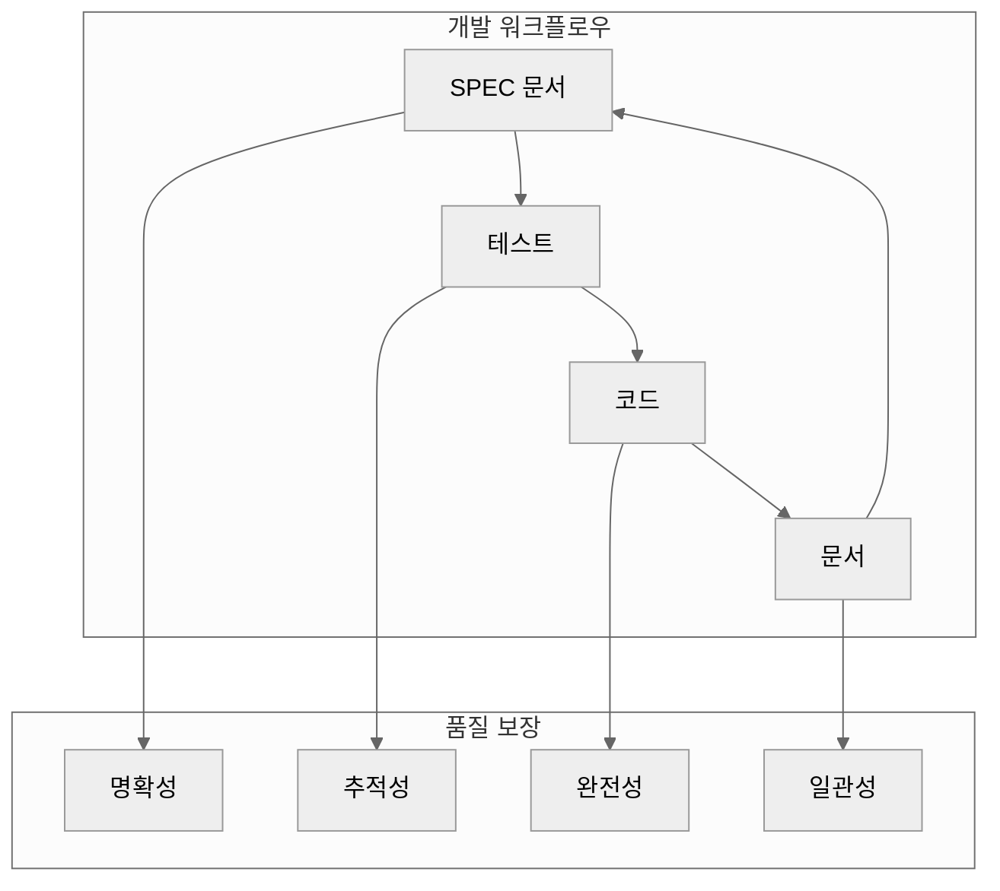
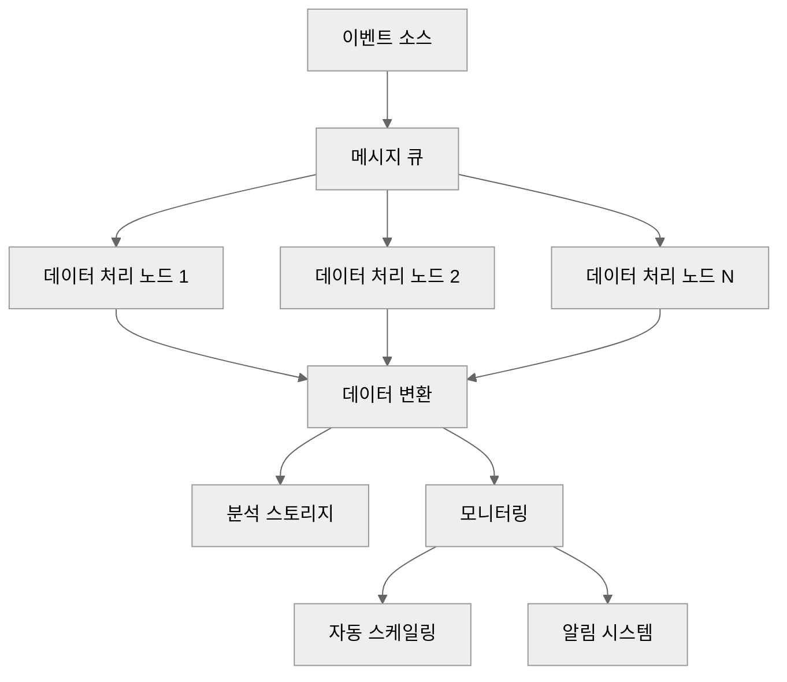

# SPEC 작성 기초

SPEC(Specification)은 MoAI-ADK의 핵심 요소로, "무엇을 만들지"를 명확하게 정의하는 문서입니다. 이 가이드는 SPEC 작성의 기본 원칙부터 구조, 작성법까지 상세하게 안내합니다.

## 🎯 SPEC이란 무엇인가?

### SPEC의 정의

SPEC는 시스템이나 기능에 대한 **명확하고 실행 가능한 요구사항 문서**입니다. 단순한 기술 문서가 아니라, 개발의 모든 단계에서 참조할 수 있는 **실행 가능한 명세서**입니다.

### SPEC의 중요성



### SPEC가 해결하는 문제

| 문제 | SPEC 없이 | SPEC 있을 때 |
|------|-----------|-------------|
| **요구사항 불명확** | "로그인 기능 만들어줘" | "JWT 기반 인증, 15분 만료, 5회 실패 시 잠금" |
| **테스트 누락** | 해피 경로만 테스트 | 모든 엣지 케이스와 예외 상황 테스트 |
| **팀 이해도 차이** | 각자 다르게 해석 | 동일한 요구사항으로 모두 이해 |
| **변경 영향 파악** | 어디를 수정해야 할지 모름 | @TAG로 영향 범위 즉시 파악 |

## 📋 SPEC의 기본 구조

MoAI-ADK의 SPEC은 다음 구조를 따릅니다:

### 1. YAML Frontmatter (메타데이터)

```yaml
---
id: AUTH-001              # 고유 식별자
version: 1.0.0           # 버전 (Semantic Versioning)
status: draft            # 상태 (draft, in_progress, completed, deprecated)
priority: high           # 우선순위 (critical, high, medium, low)
created: 2025-11-06      # 생성일
updated: 2025-11-06      # 마지막 수정일
author: @developer       # 작성자
domain: authentication   # 도메인 분류
complexity: medium       # 복잡도 (simple, medium, complex)
estimated_hours: 16     # 예상 개발 시간
dependencies:           # 의존성
  - USER-001
  - DB-001
tags:                   # 검색 태그
  - authentication
  - security
  - jwt
---
```

#### 메타데이터 필드 상세 설명

| 필드 | 필수 | 형식 | 설명 | 예시 |
|------|------|------|------|------|
| **id** | ✅ | `{DOMAIN}-{NNN}` | 고유 식별자 | `AUTH-001` |
| **version** | ✅ | `v{major}.{minor}.{patch}` | 시맨틱 버전 | `1.0.0` |
| **status** | ✅ | 열거값 | 문서 상태 | `draft`, `in_progress`, `completed` |
| **priority** | ✅ | 열거값 | 개발 우선순위 | `critical`, `high`, `medium`, `low` |
| **created** | ✅ | `YYYY-MM-DD` | 생성일 | `2025-11-06` |
| **updated** | ✅ | `YYYY-MM-DD` | 마지막 수정일 | `2025-11-06` |
| **author** | ✅ | `@username` | 작성자 | `@developer` |
| **domain** | ✅ | 문자열 | 기능 도메인 | `authentication`, `database`, `ui` |
| **complexity** | ❌ | 열거값 | 개발 복잡도 | `simple`, `medium`, `complex` |
| **estimated_hours** | ❌ | 숫자 | 예상 개발 시간 | `16` |
| **dependencies** | ❌ | 리스트 | 의존하는 다른 SPEC | `USER-001` |
| **tags** | ❌ | 리스트 | 검색 키워드 | `security`, `jwt` |

### 2. 문서 본문

```markdown
# `@SPEC:EX-AUTH-001: 사용자 인증 시스템

## 개요
JWT 기반 사용자 인증 시스템으로 이메일/비밀번호 로그인과 토큰 관리를 제공합니다.

## EARS Requirements

### Ubiquitous Requirements (기본 기능)
- 시스템은 JWT 기반 인증을 제공해야 한다
- 시스템은 비밀번호 해싱을 지원해야 한다
- 시스템은 사용자 등록을 지원해야 한다

### Event-driven Requirements (조건부)
- **WHEN** 유효한 이메일과 비밀번호가 제공되면, 시스템은 JWT 토큰을 발급해야 한다
- **WHEN** 만료된 토큰이 제공되면, 시스템은 401 Unauthorized 에러를 반환해야 한다
- **WHEN** 유효한 리프레시 토큰이 제공되면, 시스템은 새로운 액세스 토큰을 발급해야 한다

### State-driven Requirements (상태 기반)
- **WHILE** 사용자가 인증된 상태일 때, 시스템은 보호된 리소스에 접근을 허용해야 한다
- **WHILE** 토큰이 유효한 상태일 때, 시스템은 토큰 갱신을 허용해야 한다

### Optional Requirements (선택 사항)
- **WHERE** 소셜 로그인이 구성되면, 시스템은 제3자 인증을 지원할 수 있다
- **WHERE** 2FA가 활성화되면, 시스템은 추가 인증을 요구할 수 있다

### Unwanted Behaviors (제약 조건)
- 비밀번호는 평문으로 저장되어서는 안 된다
- 토큰 만료 시간은 15분을 초과하지 않아야 한다
- 동일 IP에서 5회 이상 로그인 실패 시 계정을 잠가야 한다
- 이메일은 중복 가입을 허용하지 않아야 한다

## Acceptance Criteria
- 사용자는 이메일과 비밀번호로 로그인할 수 있다
- 시스템은 JWT 액세스 토큰(15분)과 리프레시 토큰(7일)을 발급한다
- 비밀번호는 bcrypt로 해싱된다
- 로그인 실패는 5회로 제한된다
- 모든 API 엔드포인트는 인증이 필요하다

## Dependencies
- 데이터베이스 시스템 (PostgreSQL 권장)
- 이메일 서비스 (가입 확인용)
- 환경변수 설정 (JWT 시크릿 키)

## History
- v1.0.0 - 초기 SPEC 작성 (2025-11-06)
- v1.0.1 - 2FA 기능 추가 제안 (2025-11-07)
- v1.1.0 - 소셜 로그인 명세 (2025-11-10)
```

## 🎯 SPEC 작성 원칙

### 1. 명확성 (Clarity)

**좋은 예시**:
```
시스템은 유효한 이메일과 비밀번호가 제공되면, JWT 토큰을 발급해야 한다
```

**나쁜 예시**:
```
로그인 기능이 있어야 한다
```

### 2. 구체성 (Specificity)

**좋은 예시**:
```
토큰 만료 시간은 15분으로 설정해야 한다
```

**나쁜 예시**:
```
토큰은 적절한 시간 후 만료되어야 한다
```

### 3. 테스트 가능성 (Testability)

**좋은 예시**:
```
WHEN 잘못된 비밀번호를 5번 입력하면, 계정이 30분간 잠겨야 한다
```

**나쁜 예시**:
```
보안이 강화되어야 한다
```

### 4. 일관성 (Consistency)

**용어 일관성 유지**:
- "사용자" vs "고객" → "사용자"로 통일
- "로그인" vs "로그인하다" → "로그인"으로 통일
- "토큰" vs "토큰값" → "토큰"으로 통일

## 📝 SPEC 작성 단계별 가이드

### 1단계: 요구사항 수집

#### 정보 수집 체크리스트

- [ ] **목표 정의**: 이 기능이 무엇을 해결하는가?
- [ ] **사용자**: 누가 이 기능을 사용하는가?
- [ ] **범위**: 어떤 기능이 포함되고 제외되는가?
- [ ] **제약**: 기술적, 비즈니스적 제약사항은 무엇인가?
- [ ] **성능**: 성능 요구사항은 무엇인가?
- [ ] **보안**: 보안 요구사항은 무엇인가?

#### 요구사항 수집 예시

```
# 프로젝트: 전자상거래 플랫폼
# 기능: 사용자 인증 시스템

## 목표 정의
사용자가 안전하게 계정을 생성하고 로그인할 수 있도록 함

## 사용자
- 신규 가입자
- 기존 사용자
- 관리자

## 범위
### 포함 기능
- 이메일/비밀번호 로그인
- 회원가입
- 비밀번호 재설정
- 계정 잠금

### 제외 기능
- 소셜 로그인 (다음 버전)
- 2단계 인증 (고려 중)
- SSO 연동 (전사용 기능)

## 제약사항
### 기술적
- JWT 토큰 사용
- bcrypt 비밀번호 해싱
- PostgreSQL 데이터베이스

### 비즈니스적
- GDPR 준수
- 이메일 인증 필수
- 13세 미만 가입 제한

## 성능 요구사항
- 로그인: 100ms 이내
- 회원가입: 500ms 이내
- 동시 1000명 처리 가능

## 보안 요구사항
- 비밀번호 복잡도: 8자 이상
- 로그인 실패: 5회 제한
- 세션 타임아웃: 15분
```

### 2단계: EARS 문법 적용

EARS(Easy Approach to Requirements Syntax) 문법을 사용하여 요구사항을 체계적으로 작성합니다.

#### EARS 패턴 매핑

| 상황 | EARS 패턴 | 예시 |
|------|-----------|------|
| **시스템이 항상 해야 하는 기능** | Ubiquitous | 시스템은 사용자 등록을 지원해야 한다 |
| **특정 조건에서의 동작** | Event-driven | WHEN 이메일이 중복되면, 에러를 반환해야 한다 |
| **특정 상태에서의 동작** | State-driven | WHILE 로그인된 상태에서, 리소스 접근을 허용해야 한다 |
| **선택적 기능** | Optional | WHERE 리프레시 토큰이 있으면, 자동 로그인할 수 있다 |
| **금지되는 동작** | Unwanted Behaviors | 비밀번호는 평문으로 저장되어서는 안 된다 |

#### EARS 문법 작성 예시

**Ubiquitous Requirements (기본 기능)**:
```
- 시스템은 사용자 등록을 지원해야 한다
- 시스템은 이메일 인증을 제공해야 한다
- 시스템은 비밀번호 재설정을 지원해야 한다
```

**Event-driven Requirements (조건부)**:
```
- WHEN 유효한 이메일과 비밀번호가 제공되면, 시스템은 인증 토큰을 발급해야 한다
- WHEN 이메일이 중복되면, 시스템은 409 Conflict 에러를 반환해야 한다
- WHEN 비밀번호가 8자 미만이면, 시스템은 400 Bad Request 에러를 반환해야 한다
```

**State-driven Requirements (상태 기반)**:
```
- WHILE 사용자가 인증된 상태일 때, 시스템은 보호된 리소스에 접근을 허용해야 한다
- WHILE 비밀번호 재설정 토큰이 유효한 상태일 때, 시스템은 새 비밀번호 설정을 허용해야 한다
```

**Optional Requirements (선택 사항)**:
```
- WHERE 리프레시 토큰이 존재하면, 시스템은 자동 로그인을 제공할 수 있다
- WHERE 소셜 로그인이 설정되면, 시스템은 제3자 인증을 지원할 수 있다
```

**Unwanted Behaviors (제약 조건)**:
```
- 비밀번호는 평문으로 저장되어서는 안 된다
- 인증 토큰은 영구적으로 유효해서는 안 된다
- 동일 IP에서 무제한 로그인 시도를 허용해서는 안 된다
```

### 3단계: Acceptance Criteria 정의

수용 기준(Acceptance Criteria)은 기능이 완료되었는지 판단하는 구체적인 조건입니다.

#### Acceptance Criteria 작성 원칙

1. **구체적이고 측정 가능**: 숫자나 구체적인 조건 제시
2. **사용자 관점**: 사용자가 경험하는 것을 중심으로 작성
3. **독립적**: 각 기준은 독립적으로 검증 가능
4. **완전성**: 모든 중요한 기능이 포함

#### Acceptance Criteria 예시

```
## Acceptance Criteria

### 기능성 요구사항
- [ ] 사용자는 이메일 주소와 비밀번호로 계정을 생성할 수 있다
- [ ] 사용자는 이메일 주소와 비밀번호로 로그인할 수 있다
- [ ] 사용자는 등록된 이메일로 비밀번호 재설정을 요청할 수 있다
- [ ] 관리자는 사용자 목록을 조회할 수 있다

### 보안 요구사항
- [ ] 비밀번호는 bcrypt로 해싱되어 데이터베이스에 저장된다
- [ ] 로그인 세션은 15분 후 자동으로 만료된다
- [ ] 동일 IP에서 5회 로그인 실패 시 30분간 계정이 잠긴다
- [ ] 비밀번호는 최소 8자 이상이어야 한다 (문자, 숫자, 특수문자 포함)

### 성능 요구사항
- [ ] 로그인 요청은 평균 100ms 이내에 응답한다
- [ ] 회원가입 요청은 평균 500ms 이내에 완료된다
- [ ] 시스템은 동시에 1000개의 인증 요청을 처리할 수 있다

### 사용자 경험 요구사항
- [ ] 로그인 실패 시 명확한 에러 메시지가 표시된다
- [ ] 비밀번호 재설정 이메일은 5분 이내에 도착한다
- [ ] 모든 입력 필드에는 유효성 검사가 실시간으로 적용된다
```

### 4단계: 의존성 식별

다른 시스템, 서비스, 또는 기능과의 관계를 명확하게 정의합니다.

#### 의존성 유형

| 의존성 유형 | 설명 | 예시 |
|-------------|------|------|
| **기능적 의존성** | 다른 기능이 먼저 구현되어야 함 | "사용자 관리 (USER-001)" |
| **기술적 의존성** | 특정 기술이나 서비스 필요 | "PostgreSQL 데이터베이스" |
| **데이터 의존성** | 특정 데이터나 스키마 필요 | "사용자 테이블" |
| **외부 서비스 의존성** | 외부 API나 서비스 필요 | "이메일 전송 서비스" |

#### 의존성 정의 예시

```
## Dependencies

### 기능적 의존성
- USER-001: 사용자 관리 시스템 (사용자 정보 기반)
- NOTIF-001: 알림 시스템 (이메일 인증)

### 기술적 의존성
- **데이터베이스**: PostgreSQL 14+
- **인증 라이브러리**: PyJWT 2.0+
- **비밀번호 해싱**: bcrypt 4.0+
- **이메일 서비스**: SendGrid 또는 AWS SES

### 데이터 의존성
```sql
-- 필요한 데이터베이스 테이블 구조
CREATE TABLE users (
    id UUID PRIMARY KEY DEFAULT gen_random_uuid(),
    email VARCHAR(255) UNIQUE NOT NULL,
    password_hash VARCHAR(255) NOT NULL,
    is_verified BOOLEAN DEFAULT FALSE,
    created_at TIMESTAMP DEFAULT NOW(),
    updated_at TIMESTAMP DEFAULT NOW()
);

CREATE TABLE login_attempts (
    id UUID PRIMARY KEY DEFAULT gen_random_uuid(),
    email VARCHAR(255) NOT NULL,
    ip_address INET NOT NULL,
    created_at TIMESTAMP DEFAULT NOW()
);
```

### 외부 서비스 의존성
- **이메일 전송**: SMTP 서버 또는 SendGrid API
- **레이트 리밋**: Redis (로그인 시도 제한)
- **로깅**: ELK Stack 또는 CloudWatch
```

### 5단계: 버전 관리

SPEC은 변경 이력을 추적할 수 있도록 버전 관리가 중요합니다.

#### Semantic Versioning 적용

- **MAJOR**: 호환되지 않는 변경, 기능 삭제
- **MINOR**: 새로운 기능 추가 (하위 호환)
- **PATCH**: 버그 수정, 문서 개선

#### History 섹션 예시

```
## History

### v1.0.0 (2025-11-06)
- 초기 SPEC 작성 완료
- 기본 인증 기능 정의
- 보안 요구사항 명시
- 성능 목표 설정

### v1.1.0 (2025-11-10)
- 소셜 로그인 기능 추가
- Google OAuth 통합 명세
- 소셜 로그인 테스트 케이스 추가

### v1.2.0 (2025-11-15)
- 2단계 인증 기능 추가
- TOTP(Time-based OTP) 지원
- 백업 코드 복구 기능

### v1.2.1 (2025-11-16)
- TOTP 설정 UI 개선
- 백업 코드 생성 로직 수정
- 문서 오타 수정

### v2.0.0 (2025-12-01)
- 마이크로서비스 아키텍처 전환
- 인증 서비스 분리
- API Gateway 통합
```

## 🔍 SPEC 품질 검증

작성된 SPEC의 품질을 검증하는 체크리스트입니다.

### 품질 검증 체크리스트

#### 내용 품질
- [ ] **목표 명확성**: SPEC의 목표가 명확하게 정의되었는가?
- [ ] **범위 적절성**: 범위가 너무 넓거나 좁지 않은가?
- [ ] **모호함성**: 모호한 표현이 없는가?
- [ ] **완전성**: 모든 중요한 측면이 다루어졌는가?

#### 구조 품질
- [ ] **EARS 문법 준수**: 5가지 패턴이 올바르게 사용되었는가?
- [ ] **메타데이터 완성**: 필수 메타데이터가 모두 작성되었는가?
- [ ] **섹션 구조**: 논리적인 순서로 섹션이 구성되었는가?
- [ ] **일관성**: 용어와 형식이 일관되게 사용되었는가?

#### 실용성 품질
- [ ] **테스트 가능성**: 모든 요구사항이 테스트 가능한가?
- [ ] **구현 가능성**: 기술적으로 구현 가능한가?
- [ ] **측정 가능성**: 성공 기준이 측정 가능한가?
- [ ] **우선순위 적절성**: 우선순위가 비즈니스 가치에 맞는가?

#### 추적성 품질
- [ ] **@TAG 할당**: 모든 관련 요소에 TAG가 할당되었는가?
- [ ] **의존성 명시**: 필요한 의존성이 모두 명시되었는가?
- [ ] **연결성**: 다른 SPEC와의 연결이 명확한가?
- [ ] **버전 관리**: 변경 이력이 적절히 관리되고 있는가?

### SPEC 품질 등급

| 등급 | 점수 | 특징 | 개선 필요 |
|------|------|------|-----------|
| **A+** | 95-100 | 완벽한 SPEC, 즉시 개발 가능 | ❌ 없음 |
| **A** | 90-94 | 우수한 SPEC, 약간의 개선 필요 | 사소한 개선 |
| **B** | 80-89 | 좋은 SPEC, 중요한 개선 필요 | 구체화, 명확성 |
| **C** | 70-79 | 보통 SPEC, 상당한 개선 필요 | 구조, 완전성 |
| **D** | 60-69 | 미흡한 SPEC, 대규모 개선 필요 | 전면 재작성 |
| **F** | <60 | 사용 불가능, 처음부터 다시 작성 | 전면 재작성 |

## 🚀 실전 SPEC 작성 예시

### 예시 1: 간단한 API 기능

```markdown
---
id: HELLO-001
version: 1.0.0
status: draft
priority: medium
created: 2025-11-06
updated: 2025-11-06
author: @developer
domain: api
complexity: simple
estimated_hours: 4
---

# `@SPEC:EX-HELLO-001: Hello World API

## 개요
사용자에게 개인화된 인사말을 반환하는 간단한 API입니다.

## EARS Requirements

### Ubiquitous Requirements
- 시스템은 GET /hello 엔드포인트를 제공해야 한다

### Event-driven Requirements
- **WHEN** name 쿼리 파라미터가 제공되면, 시스템은 "Hello, {name}!" 메시지를 반환해야 한다
- **WHEN** name 파라미터가 없으면, 시스템은 "Hello, World!" 기본 메시지를 반환해야 한다
- **WHEN** name이 50자를 초과하면, 시스템은 400 Bad Request 에러를 반환해야 한다

### Unwanted Behaviors
- name 파라미터는 50자를 초과할 수 없다
- 응답은 반드시 JSON 형식이어야 한다

## Acceptance Criteria
- GET /hello 엔드포인트가 정상적으로 응답한다
- name 파라미터로 개인화된 인사말을 반환한다
- name 파라미터 없을 때 기본 인사말을 반환한다
- name 길이 제한을 검증한다

## Dependencies
- 웹 프레임워크 (FastAPI 권장)

## History
- v1.0.0 - 초기 SPEC 작성 (2025-11-06)
```

### 예시 2: 복잡한 데이터 처리 기능

```markdown
---
id: DATA-PIPELINE-001
version: 1.0.0
status: draft
priority: high
created: 2025-11-06
updated: 2025-11-06
author: @developer
domain: data
complexity: complex
estimated_hours: 40
dependencies:
  - DB-001
  - QUEUE-001
tags:
  - etl
  - data-processing
  - analytics
---

# `@SPEC:EX-DATA-PIPELINE-001: 실시간 데이터 처리 파이프라인

## 개요
대용량의 이벤트 데이터를 실시간으로 수집, 처리, 분석하는 데이터 파이프라인입니다.

## EARS Requirements

### Ubiquitous Requirements
- 시스템은 실시간 데이터 수집을 지원해야 한다
- 시스템은 데이터 변환 및 집계를 제공해야 한다
- 시스템은 처리 결과를 분석 스토리지에 저장해야 한다

### Event-driven Requirements
- **WHEN** 이벤트 데이터가 수신되면, 시스템은 데이터 유효성을 검증해야 한다
- **WHEN** 데이터 변환이 실패하면, 시스템은 실패 이벤트를 생성해야 한다
- **WHEN** 처리량이 임계값을 초과하면, 시스템은 자동으로 스케일아웃해야 한다

### State-driven Requirements
- **WHILE** 파이프라인이 실행 중인 상태일 때, 시스템은 상태 모니터링을 제공해야 한다
- **WHILE** 데이터 백프가 발생한 상태일 때, 시스템은 우선순위 처리를 적용해야 한다

### Optional Requirements
- **WHERE** 재처리가 필요하면, 시스템은 실패한 데이터를 재처리 큐에 추가할 수 있다
- **WHERE** 실시간 분석이 필요하면, 시스템은 스트리밍 처리를 지원할 수 있다

### Unwanted Behaviors
- 데이터는 손실되어서는 안 된다
- 처리 순서는 보장되어야 한다
- 중복 처리가 발생해서는 안 된다

## Acceptance Criteria

### 기능성 요구사항
- [ ] 시스템는 초당 10,000개의 이벤트를 처리할 수 있다
- [ ] 데이터 처리 지연은 1초 이내여야 한다
- [ ] 실패한 데이터는 자동으로 재처리된다
- [ ] 파이프라인 상태를 실시간으로 모니터링할 수 있다

### 신뢰성 요구사항
- [ ] 데이터 처리 순서가 보장된다 (최소 한 번)
- [ ] 시스템 장애 시 5분 내에 자동 복구된다
- [ ] 데이터 백프는 1GB 미만으로 유지된다
- [ ] 중복 처리 감지 기능이 제공된다

### 확장성 요구사항
- [ ] 처리량 증가 시 자동으로 스케일아웃된다
- [ ] 새로운 데이터 유형을 동적으로 추가할 수 있다
- [ ] 병렬 처리 노드를 동적으로 추가할 수 있다

## Dependencies

### 기능적 의존성
- DB-001: 실시간 데이터베이스
- QUEUE-001: 메시지 큐 시스템
- MONITOR-001: 모니터링 시스템

### 기술적 의존성
- **메시지 큐**: Apache Kafka
- **스트림 처리**: Apache Flink
- **데이터베이스**: Apache Cassandra
- **모니터링**: Prometheus + Grafana

## Architecture



## Performance Targets

| 메트릭 | 목표 | 측정 방법 |
|--------|------|-----------|
| **처리량** | 10,000 events/sec | Kafka Producer/Consumer 메트릭 |
| **지연 시간** | < 1초 | End-to-end 지연 측정 |
| **가용성** | 99.9% | 시스템 가동 시간 측정 |
| **정확성** | 99.99% | 데이터 손실률 측정 |

## History
- v1.0.0 - 초기 SPEC 작성 (2025-11-06)
- v1.0.1 - 성능 목표 구체화 (2025-11-07)
- v1.1.0 - 스트리밍 처리 추가 (2025-11-15)
```

## 🛠️ SPEC 작성 도구 및 지원

### MoAI-ADK 지원 기능

```bash
# Alfred를 통한 SPEC 작성
/alfred:1-plan "기능 설명"

# SPEC 템플릿 확인
moai-adk spec --template-list

# SPEC 품질 검증
moai-adk spec --validate path/to/spec.md
```

### SPEC 작성을 도와하는 도구

#### 1. 텍스트 에디터 설정

**VS Code 확장 추천**:
```json
{
  "recommendations": [
    "ms-vscode.markdown",
    "yzhang.markdown-all-in-one",
    "shd101wyy.markdown-preview-enhanced"
  ]
}
```

#### 2. 템플릿 조각 도구

```bash
# SPEC 템플릿 생성
moai-adk spec --template basic > my-spec.md

# 복잡한 기능용 템플릿
moai-adk spec --template complex > complex-spec.md

# API 기능용 템플릿
moai-adk spec --template api > api-spec.md
```

#### 3. 협업 도구

**GitHub 통합**:
```markdown
<!-- SPEC 문서에 PR 템플릿 링크 -->
## Review Checklist
- [ ] 모든 EARS 패턴이 올바르게 사용되었는가?
- [ ] Acceptance Criteria가 구체적인가?
- [ ] 의존성이 명확하게 정의되었는가?
- [ ] 테스트 가능한가?
```

## 🎯 SPEC 작성 모범 사례

### 성공적인 SPEC의 특징

1. **명확한 목표**: 독자가 무엇을 구축해야 하는지 즉시 이해
2. **구체적인 요구사항**: 모호함 없이 구체적인 동작 정의
3. **측정 가능한 성공 기준**: 명확한 Acceptance Criteria
4. **완전한 의존성**: 필요한 모든 의존성 명시
5. **실현 가능성**: 기술적으로 구현 가능한 범위

### 피해야 할 함정

1. **모호한 표현**: "사용자 친화적인", "좋은 성능"
2. **과도한 범위**: 하나의 SPEC에 너무 많은 기능 포함
3. **기술적 편향**: 구현 방법에 집중하고 요구사항 소활
4. **불가능한 요구사항**: 현재 기술로 불가능한 기능 명시
5. **부실한 문서**: 작성 후 업데이트하지 않고 방치

## 🚀 다음 단계

SPEC 작성 기초를 마쳤습니다. 다음 단계로 진행할 수 있습니다:

- **[EARS 문법 상세](ears.md)**: EARS 문법의 심화 학습
- **[TAG 시스템 상세](tags.md)**: @TAG 추적성 시스템 마스터
- **[SPEC 예시 모음](examples.md)**: 실제 프로젝트 SPEC 템플릿 모음
- **[실습 문제](../exercises/)**: SPEC 작성 실습 문제 풀이

## 💡 SPEC 작성 핵심 요약

1. **목적**: 명확하고 실행 가능한 요구사항 정의
2. **구조**: YAML Frontmatter + EARS Requirements + Acceptance Criteria
3. **원칙**: 명확성, 구체성, 테스트 가능성, 일관성
4. **품질**: A등급 SPEC를 위한 체계적인 검증과 개선
5. **도구**: Alfred와 MoAI-ADK가 SPEC 작성을 자동화 지원

---

**잘 작성된 SPEC은 성공적인 프로젝트의 첫걸음입니다!** 🎯