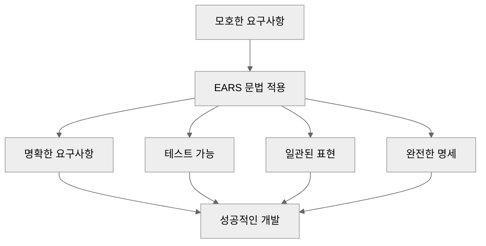

# EARS 문법 상세

EARS(Easy Approach to Requirements Syntax)는 요구사항을 명확하고 일관되게 작성하기 위한 체계적인 문법입니다. MoAI-ADK의 SPEC 작성은 EARS 문법을 기반으로 하여 품질을 보장합니다.

## 🎯 EARS란 무엇인가?

### EARS의 정의

EARS는 **"Requirements를 쉽게 작성하는 접근법"**으로, 자연어에 가까운 문법으로 요구사항을 체계적으로 표현하는 방법론입니다. 소프트웨어 공학자가 개발한 표준화된 요구사항 작성 프레임워크입니다.

### EARS의 5가지 핵심 패턴

| 패턴 | 형식 | 목적 | 빈도 |
|------|------|------|------|
| **Ubiquitous** | "시스템은 ~해야 한다" | 기본 기능 정의 | 높음 |
| **Event-driven** | "WHEN ~ THEN ~" | 조건부 동작 | 높음 |
| **State-driven** | "WHILE ~ ~해야 한다" | 상태 기반 동작 | 중간 |
| **Optional** | "WHERE ~ 할 수 있다" | 선택적 기능 | 중간 |
| **Unwanted Behaviors** | "~해서는 안 된다" | 제약 조건 | 높음 |

### EARS의 가치



## 📋 EARS 패턴 상세 가이드

### 1. Ubiquitous Requirements (기본 기능)

#### 정의와 목적

시스템이 항상 수행해야 하는 기본적인 기능을 정의합니다. EARS에서 가장 기본적이고 빈번하게 사용되는 패턴입니다.

#### 문법 구조

```
시스템은 [동사] [대상]을/를 [목적어] 해야 한다
```

#### 구성 요소

| 요소 | 설명 | 예시 |
|------|------|------|
| **시스템** | 주체 (생략 가능) | 시스템, 애플리케이션, 서비스 |
| **동사** | 수행할 행위 | 제공, 지원, 관리, 처리 |
| **대상** | 기능의 대상 | 사용자, 데이터, 리소스 |
| **목적어** | 기능의 목표 | 등록, 조회, 삭제, 생성 |

#### 좋은 예시

```
✅ 시스템은 사용자 등록을 지원해야 한다
✅ 애플리케이션은 주문 검색 기능을 제공해야 한다
✅ 서비스는 데이터를 암호화해서 저장해야 한다
✅ API는 JSON 형식으로 응답해야 한다
```

#### 나쁜 예시

```
❌ 로그인 기능 (목적어 부족)
❌ 시스템이 사용자 처리 (동사 불명확)
❌ 좋은 사용자 경험 (주관적 표현)
❌ 빠른 성능 (측정 불가)
```

#### 실전 적용 예시

```markdown
### Ubiquitous Requirements

- 시스템은 사용자 인증을 제공해야 한다
- 시스템은 비밀번호 재설정을 지원해야 한다
- 시스템은 사용자 프로필 관리를 제공해야 한다
- 시스템은 세션 관리를 지원해야 한다
- 시스템은 API 레이트 리밋을 적용해야 한다
- 시스템은 데이터 암호화를 지원해야 한다
```

### 2. Event-driven Requirements (조건부)

#### 정의와 목적

특정 조건이나 이벤트가 발생했을 때 시스템이 어떻게 동작해야 하는지 정의합니다. 가장 강력하고 자주 사용되는 EARS 패턴입니다.

#### 문법 구조

```
WHEN [조건]이/가 [발생]하면, 시스템은 [결과]을/를 [동작]해야 한다
```

#### 구성 요소

| 요소 | 설명 | 예시 |
|------|------|------|
| **WHEN** | 조건/이벤트 키워드 | WHEN, WHENEVER |
| **조건** | 트리거 조건 | 유효한 자격증명이 제공되면 |
| **발생** | 조건의 발생 형태 | 입력되면, 감지되면, 요청되면 |
| **결과** | 동작의 결과 | JWT 토큰, 에러 메시지 |
| **동작** | 수행할 행위 | 발급해야 한다, 반환해야 한다 |

#### 시간/순서 표현

```
# 시간적 조건
WHEN [시간]이 지나면, 시스템은 [동작]해야 한다

# 순차적 조건
WHEN [조건1]이/가 [발생]하고 [조건2]가/가 [충족]하면, 시스템은 [동작]해야 한다

# 중첩 조건
WHEN [조건]이/가 [발생]하지만 [제약]이/가 [있으면], 시스템은 [동작]해야 한다
```

#### 좋은 예시

```
✅ WHEN 유효한 이메일과 비밀번호가 제공되면, 시스템은 JWT 토큰을 발급해야 한다
✅ WHEN 잘못된 자격증명이 제공되면, 시스템은 401 Unauthorized 에러를 반환해야 한다
✅ WHEN 사용자가 30분간 비활동 상태이면, 시스템은 세션을 종료해야 한다
✅ WHEN 데이터베이스 연결이 실패하면, 시스템은 백업 데이터베이스로 전환해야 한다
```

#### 나쁜 예시

```
❌ 사용자가 로그인하면 (구체성 부족)
❌ 에러가 발생하면 (어떤 에러인지 불명확)
❌ 입력이 있으면 (어떤 입력인지 불명활)
❌ 빠르게 처리해야 한다 (조건 부재)
```

#### 실전 적용 예시

```markdown
### Event-driven Requirements

- **WHEN** 유효한 이메일과 비밀번호가 제공되면, 시스템은 JWT 액세스 토큰(15분)과 리프레시 토큰(7일)을 발급해야 한다
- **WHEN** 만료된 토큰이 제공되면, 시스템은 401 Unauthorized 에러와 함께 토큰 만료 메시지를 반환해야 한다
- **WHEN** 리프레시 토큰이 유효하고 만료되지 않았으면, 시스템은 새로운 액세스 토큰을 발급해야 한다
- **WHEN** 동일 IP 주소에서 5분 내 5회 로그인이 실패하면, 시스템은 해당 IP를 30분간 차단해야 한다
- **WHEN** 사용자 계정이 6개월간 비활성 상태이면, 시스템은 계정을 휴면 상태로 변경해야 한다
- **WHEN** 시스템 부하가 80%를 초과하면, 시스템은 자동으로 수평 확장을 시작해야 한다
```

#### 복잡한 Event-driven Requirements

```markdown
### 복잡한 조건부 요구사항

- **WHEN** 사용자가 소셜 로그인을 요청하고, **WHEN** 제3자 인증이 성공하고, **WHEN** 사용자 정보가 시스템에 존재하지 않으면, 시스템은 사용자 정보를 자동으로 생성하고 로그인해야 한다
- **WHEN** 데이터 처리 작업이 시작되고, **WHILE** 처리가 진행 중인 상태일 때, **WHEN** 오류가 발생하면, 시스템은 실패한 작업을 재시도 큐에 추가하고, 시스템 관리자에게 알림을 보내야 한다
- **WHEN** 주문 검색 요청이 들어오고, **WHEN** 검색어가 3개 미만이면, 시스템은 전체 텍스트 검색을 수행하고, **WHEN** 검색어가 3개 이상이면, 시스템은 인덱스 검색을 수행해야 한다
```

### 3. State-driven Requirements (상태 기반)

#### 정의와 목적

시스템이나 사용자가 특정 상태에 있을 때의 동작을 정의합니다. 지속적인 상태나 조건을 유지해야 하는 요구사항에 사용됩니다.

#### 문법 구조

```
WHILE [상태]일/를 때, 시스템은 [동작]을/를 해야 한다
```

#### 구성 요소

| 요소 | 설명 | 예시 |
|------|------|------|
| **WHILE** | 상태 조건 키워드 | WHILE, DURING |
| **상태** | 유지되어야 하는 상태 | 인증된 상태, 로그인된 상태 |
| **동작** | 상태 유지 중의 행위 | 리소스 접근 허용, 기능 제공 |

#### 좋은 예시

```
✅ WHILE 사용자가 인증된 상태일 때, 시스템은 보호된 리소스에 접근을 허용해야 한다
✅ WHILE 세션이 활성 상태일 때, 시스템은 자동 저장을 지원해야 한다
✅ WHILE 시스템이 유지보수 모드일 때, 시스템은 읽기 전용 접근만 허용해야 한다
✅ WHILE 데이터베이스 백업이 진행 중일 때, 시스템은 쓰기 작업을 제한해야 한다
```

#### 나쁜 예시

```
❌ 로그인한 사용자 (상태 표현 부족)
❌ 관리자일 때 (구체적 상태 부족)
❌ 안전한 상태 (어떤 상태인지 불명확)
❌ 계속적으로 (구체적 동작 부족)
```

#### 실전 적용 예시

```markdown
### State-driven Requirements

- **WHILE** 사용자가 인증된 상태일 때, 시스템은 개인 설정을 수정할 수 있어야 한다
- **WHILE** 세션 타임아웃이 아직 유효한 상태일 때, 시스템은 페이지 새로고침 시 세션을 유지해야 한다
- **WHILE** 관리자 권한이 부여된 상태일 때, 시스템은 사용자 관리 기능에 접근할 수 있어야 한다
- **WHILE** 데이터 마이그레이션이 진행 중인 상태일 때, 시스템은 해당 데이터에 대한 쓰기 작업을 제한해야 한다
- **WHILE** 긴급 유지보수 모드가 활성화된 상태일 때, 시스템은 모든 비필수 기능을 비활성화해야 한다
- **WHILE** 사용자 계정이 잠겨 있는 상태일 때, 시스템은 모든 로그인 시도를 차단하고 잠금 해제 절차를 안내해야 한다
```

#### 상태 전환 Requirements

```markdown
### 상태 전환 Requirements

- **WHILE** 사용자가 인증되지 않은 상태일 때, 시스템은 로그인 페이지만 접근을 허용해야 한다
- **WHILE** 사용자가 인증된 상태일 때, 시스템은 대시보드와 프로필 페이지에 접근을 허용해야 한다
- **WHEN** 사용자가 로그아웃하면, 시스템은 인증된 상태에서 인증되지 않은 상태로 전환해야 한다
```

### 4. Optional Requirements (선택 사항)

#### 정의와 목적

선택적으로 구현되거나 특정 조건에서만 활성화되는 기능을 정의합니다. 필수 기능과 선택적 기능을 명확히 구분하는 데 사용됩니다.

#### 문법 구조

```
WHERE [조건]이/가 [존재]하면, 시스템은 [기능]을/를 [제공]할 수 있다
```

#### 구성 요소

| 요소 | 설명 | 예시 |
|------|------|------|
| **WHERE** | 조건부 가능성 키워드 | WHERE, IF PROVIDED |
| **조건** | 기능 활성화 조건 | 설정이 있으면, 라이선스가 있으면 |
| **기능** | 선택적으로 제공되는 기능 | 기능을, 동작을 |
| **제공** | 가능성 표현 | 할 수 있다, 지원할 수 있다 |

#### 좋은 예시

```
✅ WHERE OAuth 2.0 설정이 구성되면, 시스템은 소셜 로그인을 지원할 수 있다
✅ WHERE 유료 구독이 있으면, 시스템은 고급 분석 기능을 제공할 수 있다
✅ WHERE 관리자 권한이 있으면, 시스템은 사용자 관리 대시보드를 표시할 수 있다
✅ WHERE API 키가 발급되면, 시스템은 프로그래맍 방식 접근을 허용할 수 있다
```

#### 나쁜 예시

```
❌ 소셜 로그인 (조건 부재)
❌ 좋은 기능 (주관적 표현)
❌ 가능하면 (어떤 기능인지 불명확)
❌ 지원해야 한다 (필수성 오해)
```

#### 실전 적용 예시

```markdown
### Optional Requirements

- **WHERE** Google OAuth 2.0 클라이언트 ID가 구성되면, 시스템은 Google 계정으로 로그인할 수 있다
- **WHERE** SAML 2.0 설정이 활성화되면, 시스템은 기업 SSO(single sign-on)을 지원할 수 있다
- **WHERE** Redis 캐시가 구성되면, 시스템은 세션 데이터를 Redis에 저장할 수 있다
- **WHERE** Elasticsearch가 설치되면, 시스템은 전문 검색 기능을 제공할 수 있다
- **WHERE** 다국어 지원 설정이 있으면, 시스템은 i18n 기반의 다국어 인터페이스를 제공할 수 있다
- **WHERE** 분석 서비스가 연동되면, 시스템은 사용자 행동 분석 대시보드를 표시할 수 있다
```

#### 선택적 기능의 우선순위

```markdown
### 선택적 기능 우선순위

#### Phase 1 (MVP - 필수 구현)
- [ ] 기본 이메일/비밀번호 인증

#### Phase 2 (향상 - 선택적 구현)
- [ ] **WHERE** OAuth 2.0 설정이 있으면: 소셜 로그인
- [ ] **WHERE** Redis가 있으면: 세션 캐싱
- [ ] **WHERE** i18n 설정이 있으면: 다국어 지원

#### Phase 3 (고급 - 선택적 구현)
- [ ] **WHERE** SAML 설정이 있으면: 기업 SSO
- [ ] **WHERE** 분석 서비스가 있으면: 행동 분석
- [ ] **WHERE** ML 모델이 있으면: 이상 탐지
```

### 5. Unwanted Behaviors (제약 조건)

#### 정의와 목적

시스템이 결코 해서는 안 되는 제약 조건이나 금지된 동작을 명확하게 정의합니다. 보안, 성능, 비즈니스 규칙 등 중요한 제약사항을 정의하는 데 사용됩니다.

#### 문법 구조

```
[대상]은/는 [금지된 동작]을/를 해서는 안 된다
```

#### 구성 요소

| 요소 | 설명 | 예시 |
|------|------|------|
| **대상** | 제약의 대상 | 데이터, 시스템, 사용자 |
| **금지된 동작** | 금지되는 구체적인 행위 | 평문 저장, 무제한 접근 |
| **해서는 안 된다** | 금지 표현 | 되어서는 안 된다, 해서는 안 된다 |

#### 보안 관련 Unwanted Behaviors

```markdown
### 보안 제약 조건

- 비밀번호는 평문으로 저장되어서는 안 된다
- 사용자의 민감 정보는 로그에 기록되어서는 안 된다
- SQL 인젝이 가능한 사용자 입력을 허용해서는 안 된다
- 인증 토큰은 영구적으로 유효해서는 안 된다
- 관리자 계정으로 권한 상승이 가능해서는 안 된다
```

#### 성능 관련 Unwanted Behaviors

```markdown
### 성능 제약 조건

- 시스템 응답 시간은 5초를 초과해서는 안 된다
- 동시 접속자 수는 시스템 용량의 90%를 초과해서는 안 된다
- 데이터베이스 쿼리 실행 시간은 1초를 초과해서는 안 된다
- 메모리 사용량은 서버 용량의 80%를 초과해서는 안 된다
```

#### 비즈니스 관련 Unwanted Behaviors

```markdown
### 비즈니스 제약 조건

- 13세 미만 사용자의 가입이 허용되어서는 안 된다
- 사용자 동의 없는 개인정보 수집이 허용되어서는 안 된다
- 결제 정보의 평문 전송이 허용되어서는 안 된다
- 법적 요구사항을 위반하는 기능이 제공되어서는 안 된다
```

#### 좋은 예시

```
✅ 비밀번호는 평문으로 저장되어서는 안 된다
✅ 시스템은 SQL 인젝 공격에 취약해서는 안 된다
✅ 사용자 개인정보는 무단으로 제3자와 공유되어서는 안 된다
✅ 인증 없이 민감한 데이터에 접근하는 것이 허용되어서는 안 된다
✅ 관리자 권한이 없는 사용자가 시스템 설정을 변경할 수 없다
```

#### 나쁜 예시

```
❌ 안전하지 않아야 한다 (어떤 것인지 불명확)
❌ 보안이 중요하다 (구체적 기준 부재)
❌ 좋은 보안을 제공해야 한다 (어떻게인지 불명활)
❌ 문제가 생기면 안 된다 (어떤 문제인지 불명활)
```

#### 실전 적용 예시

```markdown
### Unwanted Behaviors

#### 보안 제약 조건
- 비밀번호는 평문으로 저장되어서는 안 된다 (bcrypt 해싱 필수)
- JWT 토큰의 서명 키는 코드에 하드코딩되어서는 안 된다 (환경변수 사용)
- 사용자 비밀번호는 복호화 없이 전송되어서는 안 된다 (HTTPS 필수)
- 세션 ID는 예측 가능한 값으로 생성되어서는 안 된다 (UUID 사용)
- 인증 실패 시 구체적인 실패 이유가 노출되어서는 안 된다

#### 성능 제약 조건
- 로그인 응답 시간은 100ms를 초과해서는 안 된다
- 데이터베이스 커넥션 풀 크기는 10을 초과해서는 안 된다
- 동시 처리량은 시스템 한계치의 80%를 초과해서는 안 된다
- 파일 업로드 크기는 100MB를 초과해서는 안 된다
- API 레이트 리밋을 우회하는 것이 허용되어서는 안 된다

#### 데이터 무결성 제약 조건
- 중요한 데이터의 무단 삭제가 허용되어서는 안 된다 (소프트 삭제만)
- 데이터 백업 없는 스키마 변경이 허용되어서는 안 된다
- 트랜잭션의 원자성이 보장되지 않아서는 안 된다
- 외부 키 제약조건 위반이 허용되어서는 안 된다
- 정합성 제약을 위반하는 데이터 수정이 허용되어서는 안 된다

#### 사용자 경험 제약 조건
- 404 에러 페이지에 기술적 정보가 노출되어서는 안 된다
- 에러 메시지가 사용자에게 이해하기 어렵게 표시되어서는 안 된다
- 필수 입력란에 명확한 에러 메시지가 제공되지 않아서는 안 된다
- 모바일 반응형 디자인이 지원되지 않아서는 안 된다
- 접근성 가이드라인을 준수하지 않은 디자인이 사용되어서는 안 된다
```

## 🔄 EARS 패턴 조합과 복잡성

### 다중 패턴 조합

EARS 패턴은 서로 조합하여 더 복잡한 요구사항을 표현할 수 있습니다.

#### Ubiquitous + Event-driven 조합

```markdown
- 시스템은 사용자 등록을 지원해야 한다
- **WHEN** 중복된 이메일로 등록을 시도하면, 시스템은 "이미 사용 중인 이메일입니다" 메시지와 함께 409 Conflict 에러를 반환해야 한다
```

#### Event-driven + State-driven 조합

```markdown
- **WHILE** 사용자가 인증된 상태일 때, 시스템은 보호된 리소스에 접근을 허용해야 한다
- **WHEN** 인증 토큰이 만료되면, 시스템은 인증되지 않은 상태로 전환하고 리소스 접근을 차단해야 한다
```

#### Event-driven + Optional 조합

```markdown
- **WHEN** 사용자가 비밀번호 분실을 신청하면, 시스템은 재설정 토큰을 생성해야 한다
- **WHERE** SMS 서비스가 구성되면, 시스템은 SMS로 재설정 링크를 전송할 수 있다
```

### 복잡한 시나리오 표현

```markdown
### 복잡한 시나리오: 주문 검색 및 권한 관리

- 시스템은 문서 검색 기능을 제공해야 한다
- **WHEN** 인증된 사용자가 검색어를 입력하면, 시스템은 관련 문서를 반환해야 한다
- **WHILE** 사용자가 프리미엄 구독자인 상태일 때, 시스템은 모든 문서에 접근할 수 있어야 한다
- **WHILE** 사용자가 일반 구독자인 상태일 때, 시스템은 공개된 문서만 접근할 수 있어야 한다
- **WHEN** 일반 구독자가 프리미엄 문서에 접근하면, 시스템은 업그레이드 안내와 함께 403 Forbidden 에러를 반환해야 한다
- **WHERE** 관리자 권한이 있으면, 시스템은 문서 공개/비공개 상태를 변경할 수 있다
- **WHEN** 관리자가 문서를 비공개로 설정하면, 시스템은 접근 권한을 확인하고 적절한 제한을 적용해야 한다
```

## 🎯 EARS 문법 작성 베스트 프랙티스

### 1. 명확성 원칙

**DO**: 구체적이고 측정 가능한 표현 사용
```
✅ WHEN 사용자가 5번 로그인에 실패하면, 계정이 30분간 잠겨야 한다
```

**DON'T**: 모호하고 주관적인 표현 사용
```
❌ WHEN 사용자가 여러 번 실패하면, 계정이 적절한 시간 동안 잠겨야 한다
```

### 2. 단일 책임 원칙

**DO**: 하나의 요구사항에는 하나의 핵심 아이디어만 포함
```
✅ WHEN 유효한 자격증명이 제공되면, 시스템은 JWT 토큰을 발급해야 한다
```

**DON'T**: 여러 관련 아이디어를 하나의 요구사항에 포함
```
❌ WHEN 유효한 자격증명이 제공되면, 시스템은 JWT 토큰을 발급하고, 세션을 생성하고, 환영해야 한다
```

### 3. 테스트 가능성 원칙

**DO**: 테스트로 검증할 수 있는 명확한 조건 제시
```
✅ WHEN 비밀번호가 8자 미만이면, 시스템은 400 Bad Request 에러를 반환해야 한다
```

**DON'T**: 테스트하기 어려운 주관적 기준 제시
```
❌ WHEN 비밀번호가 약하면, 시스템은 에러를 반환해야 한다
```

### 4. 일관성 원칙

**DO**: 동일한 용어와 문법 구조 사용
```
✅ 시스템은 사용자를 생성해야 한다
✅ 시스템은 사용자를 수정할 수 있다
✅ 시스템은 사용자를 삭제할 수 있다
```

**DON'T**: 유사한 기능에 다른 용어 사용
```
❌ 시스템은 사용자를 만들어야 한다
❌ 시스템은 사용자를 편집할 수 있다
❌ 시스템은 사용자를 없앨 수 있다
```

### 5. 완전성 원칙

**DO**: 필요한 모든 측면을 포함
```
✅ WHEN 사용자 등록 시 이메일 인증이 필요하면, 시스템은 인증 이메일을 발송해야 한다
✅ WHEN 이메일 인증 링크를 클릭하면, 시스템은 계정을 활성화해야 한다
✅ WHEN 이메일 인증 링크가 24시간 내에 클릭되지 않으면, 시스템은 인증 링크를 무효화해야 한다
```

**DON'T**: 중요한 예외 상황이나 경계 조건 누락
```
❌ WHEN 사용자 등록 시 이메일 인증이 필요하면, 시스템은 인증 이메일을 발송해야 한다
// (24시간 유효기간, 링크 무효화 조건 누락)
```

## 🔍 EARS 문법 검증 도구

### 자동 검증 체크리스트

```markdown
## EARS 문법 검증 체크리스트

### 구조 검증
- [ ] YAML frontmatter가 올바르게 작성되었는가?
- [ ] 각 요구사항이 EARS 패턴을 따르는가?
- [ ] 패턴 키워드가 올바르게 사용되었는가?

### 내용 검증
- [ ] 모든 요구사항이 명확한가?
- [ ] 모호한 표현이 없는가?
- [ ] 테스트 가능한가?
- [ ] 측정 가능한가?

### 일관성 검증
- [ ] 용어 사용이 일관적인가?
- [ ] 문법 구조가 일관적인가?
- [ ] 유사한 기능에 일관된 표현을 사용하는가?

### 완전성 검증
- [ ] 필요한 모든 예외 상황이 다루어졌는가?
- [ ] 경계 조건이 명시되었는가?
- [ ] 의존성이 명확하게 정의되었는가?
```

### MoAI-ADK 자동 검증

```bash
# Alfred를 통한 EARS 문법 검증
/alfred:1-plan "기능 설명"

# Alfred가 자동으로 검증
✅ EARS 문법 준수: 5가지 패턴 모두 올바름
✅ Ubiquitous: 3개 요구사항
✅ Event-driven: 8개 요구사항
✅ State-driven: 2개 요구사항
✅ Optional: 1개 요구사항
✅ Unwanted Behaviors: 5개 제약 조건
```

### EARS 문법 점수기

```bash
# EARS 문법 자동 교정 도구
moai-adk spec --correct-ears path/to/spec.md

# 출력 예시:
# EARS 문법 교정 결과
수정 전: "시스템은 사용자 관리를 지원해야 한다"
수정 후: "시스템은 사용자 등록을 지원해야 한다"

수정 전: "사용자가 로그인하면 토큰을 준다"
수정 후: "WHEN 사용자가 유효한 자격증명을 제공하면, 시스템은 JWT 토큰을 발급해야 한다"
```

## 📚 EARS 문법 심화 예시

### 실전 프로젝트 EARS 적용 사례

#### 1. 전자상거래 플랫폼

```markdown
### EARS Requirements for E-commerce Platform

#### Ubiquitous Requirements
- 시스템은 상품 검색 기능을 제공해야 한다
- 시스템은 장바구니 기능을 지원해야 한다
- 시스템은 주문 결제 기능을 제공해야 한다
- 시스템은 주문 조회 기능을 지원해야 한다

#### Event-driven Requirements
- **WHEN** 재고가 없는 상품이 주문되면, 시스템은 자동으로 주문을 승인해야 한다
- **WHEN** 재고가 필요한 상품이 주문되면, 시스템은 관리자에게 알림을 보내야 한다
- **WHEN** 결제가 실패하면, 시스템은 주문 상태를 '결제 실패'로 변경해야 한다
- **WHEN** 상품 재고가 거절되면, 시스템은 판매자에게 알림을 보내야 한다

#### State-driven Requirements
- **WHILE** 주문이 '배송 준비' 상태일 때, 시스템은 배송 정보를 수정할 수 있어야 한다
- **WHILE** 주문이 '배송 중' 상태일 때, 시스템은 배송 취소만 허용해야 한다
- **WHILE** 고객의 VIP 등급이 유효한 상태일 때, 시스템은 우선 고객 지원을 제공해야 한다

#### Optional Requirements
- **WHERE** 브랜드별 웹사이트가 설정되면, 시스템은 브랜드화된 검색 결과를 제공할 수 있다
- **WHERE** 추천 엔진이 활성화되면, 시스템은 개인화된 상품 추천을 제공할 수 있다
- **WHERE** 외부 결제 시스템이 연동되면, 시스템은 다양한 결제 수단을 지원할 수 있다

#### Unwanted Behaviors
- 상품 가격은 계약 없이 변경되어서는 안 된다
- 고객의 개인정보보는 명시적 동의 없이 제3자와 공유되어서는 안 된다
- 주문 취소 시 환불 정책이 명시되지 않으면 전액 환불이 허용되어서는 안 된다
```

#### 2. 헬스케어 관리 시스템

```markdown
### EARS Requirements for Healthcare Management System

#### Ubiquitous Requirements
- 시스템은 환자 등록 기능을 제공해야 한다
- 시스템은 의료 기록 관리 기능을 지원해야 한다
- 시스템은 약물 처방전 기능을 제공해야 한다
- 시스템은 보험실 검사 결과 관리 기능을 지원해야 한다

#### Event-driven Requirements
- **WHEN** 새로운 환자가 등록되면, 시스템은 고유 환자 ID를 생성해야 한다
- **WHEN** 의사가 처방전을 작성하면, 시스템은 약물 상호작용 검사를 수행해야 한다
- **WHEN** 약물 부작용이 감지되면, 시스템은 경고를 표시하고 처방전 수정을 요구해야 한다
- **WHEN** 응급 상황이 발생하면, 시스템은 즉시 담당 의사에게 알림을 보내야 한다

#### State-driven Requirements
- **WHILE** 환자가 입원 중인 상태일 때, 시스템은 진료 기록 조회를 제한해야 한다
- **WHILE** 약물 처방전이 유효한 상태일 때, 시스템은 해당 약물의 처방전 금지를 허용하지 않아야 한다
- **WHILE** 보험실 검사가 진행 중인 상태일 때, 시스템은 해당 검사 결과의 수정을 제한해야 한다

#### Optional Requirements
- **WHERE** 원격 진료가 설정되면, 시스템은 비디오 상담 기능을 제공할 수 있다
- **WHERE** 의료 보험사이트와 연동되면, 시스템은 청구 기능을 제공할 수 있다
- **WHERE** 약물 정보 데이터베이스가 연동되면, 시스템은 약물 상호작용 자동 검사를 지원할 수 있다

#### Unwanted Behaviors
- 환자의 민감정보는 HIPAA 규정을 위반해서는 안 된다
- 처방전 약물 조합이 심각한 상호작용을 일으킬 수 있다면 처방전 금지가 적용되어야 한다
- 의료 기록은 무단으로 수정되거나 삭제되어서는 안 된다
- 시스템 접근 권한이 없는 사용자가 민감정보에 접근해서는 안 된다
```

## 🚀 다음 단계

EARS 문법 상세를 마쳤습니다. 다음 단계로 진행할 수 있습니다:

- **[TAG 시스템 상세](tags.md)**: @TAG 추적성 시스템 마스터
- **[SPEC 예시 모음](examples.md)**: 실제 프로젝트 SPEC 템플릿 모음
- **[실습 문제](../exercises/)**: EARS 문법 적용 실습
- **[검증 도구](../tools/)**: EARS 문법 검증 도구 사용법

## 💡 EARS 문법 핵심 요약

1. **5가지 핵심 패턴**: Ubiquitous, Event-driven, State-driven, Optional, Unwanted Behaviors
2. **명확성**: 구체적이고 측정 가능한 요구사항 작성
3. **일관성**: 통일된 용어와 문법 구조 유지
4. **테스트 가능성**: 모든 요구사항이 검증 가능해야 함
5. **실용성**: 실제 프로젝트에 즉시 적용 가능한 문법

---

**EARS 문법으로 명확한 요구사항은 성공적인 프로젝트의 기초입니다!** 🎯