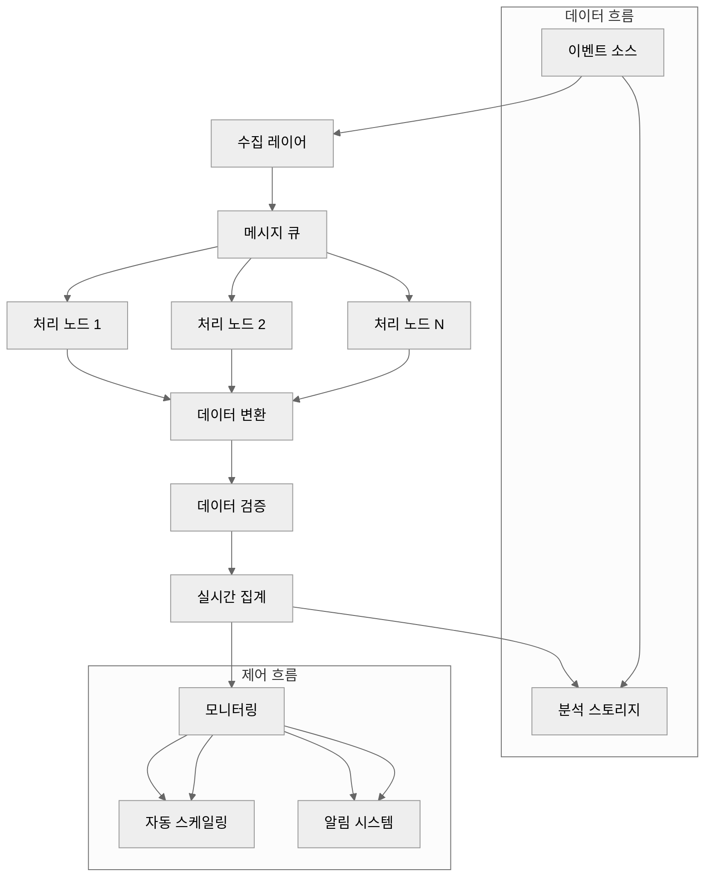
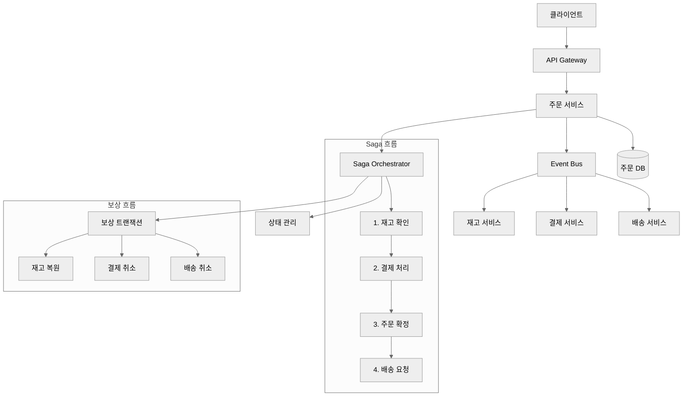
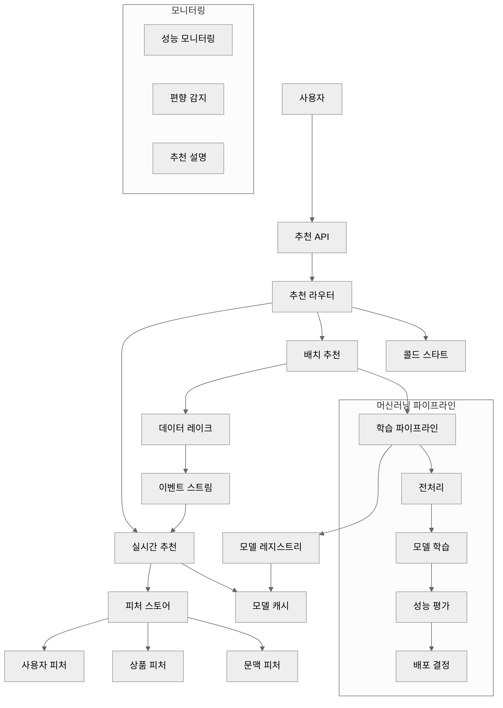

# SPEC 작성 예시 모음

이 문서는 실제 프로젝트에서 즉시 사용할 수 있는 SPEC 템플릿과 예시들을 제공합니다. 각 예시는 완전한 구조와 EARS 문법을 따르며, 다양한 도메인과 복잡도를 포함합니다.

## 🎯 SPEC 예시 개요

### 예시 분류

| 도메인 | 복잡도 | SPEC ID | 설명 | 추천 사용자 |
|--------|--------|---------|------|-------------|
| **웹 API** | Simple | API-001 | 간단한 REST API | 초보자 |
| **인증 시스템** | Medium | AUTH-001 | JWT 기반 인증 | 중급자 |
| **데이터 처리** | Complex | DATA-001 | ETL 파이프라인 | 고급자 |
| **UI 컴포넌트** | Simple | UI-001 | React 컴포넌트 | 초보자 |
| **마이크로서비스** | Complex | MS-001 | 주문 처리 서비스 | 고급자 |
| **머신러닝** | Complex | ML-001 | 추천 시스템 | 고급자 |

---

## 📚 1. 웹 API 예시 (Simple)

### SPEC:EX-API-001: 사용자 정보 조회 API

```yaml
---
id: API-001
version: 1.0.0
status: draft
priority: medium
created: 2025-11-06
updated: 2025-11-06
author: @developer
domain: api
complexity: simple
estimated_hours: 8
dependencies:
  - USER-001
  - DB-001
tags:
  - rest-api
  - user-management
  - json
---

# `@SPEC:EX-API-001: 사용자 정보 조회 API

## 개요
사용자 ID를 기반으로 사용자 정보를 조회하는 간단한 REST API입니다. JSON 형식으로 사용자 기본 정보를 반환합니다.

## EARS Requirements

### Ubiquitous Requirements (기본 기능)
- 시스템은 GET /api/users/{user_id} 엔드포인트를 제공해야 한다
- 시스템은 JSON 형식으로 응답해야 한다
- 시스템은 사용자 정보 조회 기능을 지원해야 한다

### Event-driven Requirements (조건부)
- **WHEN** 유효한 사용자 ID가 제공되면, 시스템은 사용자 정보를 반환해야 한다
- **WHEN** 존재하지 않는 사용자 ID가 제공되면, 시스템은 404 Not Found 에러를 반환해야 한다
- **WHEN** 잘못된 형식의 사용자 ID가 제공되면, 시스템은 400 Bad Request 에러를 반환해야 한다
- **WHEN** 인증 없이 접근하면, 시스템은 401 Unauthorized 에러를 반환해야 한다

### Unwanted Behaviors (제약 조건)
- 민감 정보(비밀번호, 카드번호)는 응답에 포함되어서는 안 된다
- 응답 시간은 500ms를 초과해서는 안 된다
- 동시 요청은 100개를 초과해서는 안 된다

## Acceptance Criteria

### 기능성 요구사항
- [ ] GET /api/users/123 요청 시 사용자 정보를 반환한다
- [ ] 응답은 JSON 형식이다
- [ ] 사용자가 존재하지 않으면 404 에러를 반환한다
- [ ] 인증 토큰이 필요하다

### 응답 형식
```json
{
  "id": "123",
  "email": "user@example.com",
  "name": "홍길동",
  "created_at": "2025-11-06T10:00:00Z",
  "updated_at": "2025-11-06T10:00:00Z"
}
```

### 에러 응답 형식
```json
{
  "error": "User not found",
  "code": "USER_NOT_FOUND",
  "timestamp": "2025-11-06T10:00:00Z"
}
```

## Dependencies
- 데이터베이스 연결 (PostgreSQL)
- 인증 미들웨어
- 사용자 테이블 스키마

## History
- v1.0.0 - 초기 SPEC 작성 (2025-11-06)
```

---

## 🔐 2. 인증 시스템 예시 (Medium)

### SPEC:EX-AUTH-001: JWT 기반 사용자 인증 시스템

```yaml
---
id: AUTH-001
version: 1.2.0
status: in_progress
priority: high
created: 2025-11-06
updated: 2025-11-06
author: @developer
domain: authentication
complexity: medium
estimated_hours: 24
dependencies:
  - USER-001
  - DB-001
  - EMAIL-001
tags:
  - authentication
  - security
  - jwt
  - bcrypt
---

# `@SPEC:EX-AUTH-001: JWT 기반 사용자 인증 시스템

## 개요
JWT(JSON Web Token) 기반의 현대적인 인증 시스템입니다. 이메일/비밀번호 로그인, 토큰 갱신, 비밀번호 재설정 기능을 포함합니다.

## EARS Requirements

### Ubiquitous Requirements (기본 기능)
- 시스템은 JWT 기반 인증을 제공해야 한다
- 시스템은 bcrypt 비밀번호 해싱을 지원해야 한다
- 시스템은 사용자 등록 기능을 제공해야 한다
- 시스템은 로그인 기능을 지원해야 한다
- 시스템은 로그아웃 기능을 제공해야 한다

### Event-driven Requirements (조건부)
- **WHEN** 유효한 이메일과 비밀번호가 제공되면, 시스템은 JWT 액세스 토큰(15분)과 리프레시 토큰(7일)을 발급해야 한다
- **WHEN** 만료된 액세스 토큰이 제공되면, 시스템은 401 Unauthorized 에러를 반환해야 한다
- **WHEN** 유효한 리프레시 토큰이 제공되면, 시스템은 새로운 액세스 토큰을 발급해야 한다
- **WHEN** 사용자가 비밀번호 재설정을 요청하면, 시스템은 재설정 토큰을 이메일로 발송해야 한다
- **WHEN** 재설정 토큰이 유효하고 새 비밀번호가 제공되면, 시스템은 비밀번호를 업데이트해야 한다
- **WHEN** 동일 IP 주소에서 5분 내 5회 로그인이 실패하면, 시스템은 해당 IP를 30분간 차단해야 한다
- **WHEN** 사용자 계정이 6개월간 비활성 상태이면, 시스템은 계정을 휴면 상태로 변경해야 한다

### State-driven Requirements (상태 기반)
- **WHILE** 사용자가 인증된 상태일 때, 시스템은 보호된 리소스에 접근을 허용해야 한다
- **WHILE** 사용자 계정이 잠겨 있는 상태일 때, 시스템은 모든 로그인 시도를 차단하고 잠금 해제 절차를 안내해야 한다
- **WHILE** 세션이 활성 상태일 때, 시스템은 자동 토큰 갱신을 지원해야 한다

### Optional Requirements (선택 사항)
- **WHERE** Google OAuth 2.0이 구성되면, 시스템은 소셜 로그인을 지원할 수 있다
- **WHERE** 2FA(2단계 인증)가 활성화되면, 시스템은 TOTP 기반 추가 인증을 요구할 수 있다
- **WHERE** Redis가 구성되면, 시스템은 토큰 블랙리스팅을 지원할 수 있다

### Unwanted Behaviors (제약 조건)
- 비밀번호는 평문으로 저장되어서는 안 된다 (bcrypt 해싱 필수)
- JWT 토큰의 서명 키는 코드에 하드코딩되어서는 안 된다 (환경변수 사용)
- 사용자 비밀번호는 복호화 없이 전송되어서는 안 된다 (HTTPS 필수)
- 세션 ID는 예측 가능한 값으로 생성되어서는 안 된다 (UUID 사용)
- 인증 실패 시 구체적인 실패 이유가 노출되어서는 안 된다
- 동일 사용자의 동시 세션은 3개를 초과할 수 없다

## Acceptance Criteria

### 기능성 요구사항
- [ ] 사용자는 이메일과 비밀번호로 가입할 수 있다
- [ ] 사용자는 이메일과 비밀번호로 로그인할 수 있다
- [ ] 로그인 성공 시 액세스 토큰(15분)과 리프레시 토큰(7일)을 받는다
- [ ] 리프레시 토큰으로 새로운 액세스 토큰을 발급받을 수 있다
- [ ] 사용자는 로그아웃할 수 있다
- [ ] 사용자는 비밀번호를 재설정할 수 있다

### 보안 요구사항
- [ ] 비밀번호는 bcrypt로 해싱되어 저장된다
- [ ] JWT 토큰은 RS256 알고리즘으로 서명된다
- [ ] 로그인 실패는 5회로 제한된다
- [ ] IP 기반 레이트 리밋이 적용된다
- [ ] 모든 인증 관련 요청은 HTTPS를 통해서만 허용된다

### 성능 요구사항
- [ ] 로그인 응답 시간은 100ms를 초과하지 않는다
- [ ] 토큰 검증 시간은 10ms를 초과하지 않는다
- [ ] 동시 1000개의 인증 요청을 처리할 수 있다

### API 엔드포인트
```
POST   /api/auth/register      # 사용자 등록
POST   /api/auth/login         # 로그인
POST   /api/auth/refresh       # 토큰 갱신
POST   /api/auth/logout        # 로그아웃
POST   /api/auth/forgot        # 비밀번호 재설정 요청
POST   /api/auth/reset         # 비밀번호 재설정
GET    /api/auth/me            # 현재 사용자 정보
```

### 데이터베이스 스키마
```sql
CREATE TABLE users (
    id UUID PRIMARY KEY DEFAULT gen_random_uuid(),
    email VARCHAR(255) UNIQUE NOT NULL,
    password_hash VARCHAR(255) NOT NULL,
    is_verified BOOLEAN DEFAULT FALSE,
    is_active BOOLEAN DEFAULT TRUE,
    last_login TIMESTAMP,
    created_at TIMESTAMP DEFAULT NOW(),
    updated_at TIMESTAMP DEFAULT NOW()
);

CREATE TABLE refresh_tokens (
    id UUID PRIMARY KEY DEFAULT gen_random_uuid(),
    user_id UUID REFERENCES users(id) ON DELETE CASCADE,
    token_hash VARCHAR(255) NOT NULL,
    expires_at TIMESTAMP NOT NULL,
    created_at TIMESTAMP DEFAULT NOW()
);
```

## Dependencies

### 기능적 의존성
- USER-001: 사용자 관리 시스템
- EMAIL-001: 이메일 발송 시스템
- RATE-001: 레이트 리밋 시스템

### 기술적 의존성
- **데이터베이스**: PostgreSQL 14+
- **인증 라이브러리**: PyJWT 2.0+
- **비밀번호 해싱**: bcrypt 4.0+
- **이메일 서비스**: SendGrid 또는 AWS SES
- **캐시**: Redis 6+ (토큰 블랙리스팅용)

## Security Considerations

### 취약점 방어
- **SQL Injection**: 파라미터화된 쿼리 사용
- **XSS**: 입력값 escaping 및 CSP 헤더
- **CSRF**: CSRF 토큰 사용
- **Brute Force**: IP 기반 차단 및 계정 잠금
- **Token Theft**: HTTP-only 쿠키 및 Secure 플래그

### 보안 헤더
```
X-Content-Type-Options: nosniff
X-Frame-Options: DENY
X-XSS-Protection: 1; mode=block
Strict-Transport-Security: max-age=31536000
Content-Security-Policy: default-src 'self'
```

## History
- v1.0.0 - 초기 SPEC 작성 (2025-11-06)
- v1.1.0 - 소셜 로그인 기능 추가 (2025-11-10)
- v1.2.0 - 2FA 기능 추가 (2025-11-15)
```

---

## 🔄 3. 데이터 처리 예시 (Complex)

### SPEC:EX-DATA-001: 실시간 데이터 처리 파이프라인

```yaml
---
id: DATA-001
version: 1.1.0
status: draft
priority: high
created: 2025-11-06
updated: 2025-11-06
author: @developer
domain: data
complexity: complex
estimated_hours: 80
dependencies:
  - KAFKA-001
  - DB-001
  - MONITOR-001
tags:
  - etl
  - data-processing
  - analytics
  - streaming
---

# `@SPEC:EX-DATA-001: 실시간 데이터 처리 파이프라인

## 개요
대용량의 이벤트 데이터를 실시간으로 수집, 변환, 집계, 저장하는 데이터 파이프라인입니다. 분석 및 보고서 생성을 위한 데이터 기반을 제공합니다.

## EARS Requirements

### Ubiquitous Requirements (기본 기능)
- 시스템은 실시간 데이터 수집을 지원해야 한다
- 시스템은 데이터 변환 및 정제 기능을 제공해야 한다
- 시스템은 실시간 데이터 집계를 지원해야 한다
- 시스템은 처리 결과를 분석 스토리지에 저장해야 한다
- 시스템은 데이터 파이프라인 모니터링을 제공해야 한다

### Event-driven Requirements (조건부)
- **WHEN** 이벤트 데이터가 수신되면, 시스템은 데이터 유효성을 검증해야 한다
- **WHEN** 데이터 변환이 실패하면, 시스템은 실패 이벤트를 생성하고 재시작 큐에 추가해야 한다
- **WHEN** 처리량이 임계값(10,000 events/sec)을 초과하면, 시스템은 자동으로 스케일아웃해야 한다
- **WHEN** 데이터 소스에서 스키마 변경이 감지되면, 시스템은 호환성 검사를 수행하고 알림을 보내야 한다
- **WHEN** 장애가 발생하면, 시스템은 자동으로 장애 복구 절차를 시작하고 관리자에게 알림을 보내야 한다
- **WHEN** 데이터 품질이 임계치 이하로 떨어지면, 시스템은 경고를 생성하고 데이터 일시 중지를 고려해야 한다

### State-driven Requirements (상태 기반)
- **WHILE** 파이프라인이 실행 중인 상태일 때, 시스템은 실시간 상태 모니터링을 제공해야 한다
- **WHILE** 데이터 백프(backpressure)가 발생한 상태일 때, 시스템은 우선순위 처리와 동적 스케일링을 적용해야 한다
- **WHILE** 장애 복구가 진행 중인 상태일 때, 시스템은 데이터 손실 방지를 위해 체크포인트를 유지해야 한다
- **WHILE** 유지보수 모드가 활성화된 상태일 때, 시스템은 새로운 데이터 처리를 중단하고 진행 중인 작업을 완료해야 한다

### Optional Requirements (선택 사항)
- **WHERE** 머신러닝 모델이 배포되면, 시스템은 실시간 예측 분석을 제공할 수 있다
- **WHERE** 외부 데이터 소스가 연결되면, 시스템은 데이터 확장 및 풍부화(enrichment)를 지원할 수 있다
- **WHERE** 데이터 레이크가 구성되면, 시스템은 장기 보관을 위한 아카이빙을 지원할 수 있다

### Unwanted Behaviors (제약 조건)
- 데이터는 손실되어서는 안 된다 (최소 한 번 전달 보장)
- 처리 순서는 같은 키 내에서 보장되어야 한다
- 중복 처리가 발생해서는 안 된다 (멱등성 보장)
- 파이프라인 가동 중단 시간은 5분을 초과해서는 안 된다
- 데이터 처리 지연은 1초를 초과해서는 안 된다
- 메모리 사용량은 노드 용량의 80%를 초과해서는 안 된다

## Acceptance Criteria

### 기능성 요구사항
- [ ] 초당 10,000개의 이벤트를 처리할 수 있다
- [ ] 데이터 처리 지연은 1초 이내여야 한다
- [ ] 실패한 데이터는 자동으로 재처리된다
- [ ] 파이프라인 상태를 실시간으로 모니터링할 수 있다
- [ ] 데이터 품질 지표를 자동으로 계산한다

### 신뢰성 요구사항
- [ ] 데이터 처리 순서가 보장된다 (키 내에서)
- [ ] 시스템 장애 시 5분 내에 자동 복구된다
- [ ] 데이터 백프는 1GB 미만으로 유지된다
- [ ] 중복 처리 감지 및 방지 기능이 제공된다
- [ ] 체크포인트를 통한 데이터 손실 방지

### 확장성 요구사항
- [ ] 처리량 증가 시 자동으로 스케일아웃된다
- [ ] 새로운 데이터 유형을 동적으로 추가할 수 있다
- [ ] 병렬 처리 노드를 동적으로 추가할 수 있다
- [ ] 스키마 변경을 무중단으로 적용할 수 있다

### 성능 목표
| 메트릭 | 목표 | 측정 방법 |
|--------|------|-----------|
| **처리량** | 10,000 events/sec | Kafka Producer/Consumer 메트릭 |
| **지연 시간** | < 1초 | End-to-end 지연 측정 |
| **가용성** | 99.9% | 시스템 가동 시간 측정 |
| **정확성** | 99.99% | 데이터 손실률 측정 |
| **확장성** | 100 nodes | 클러스터 크기 제한 |

## Architecture



## Data Flow

### 1. 데이터 수집 (Ingestion)
```python
# Kafka Producer 설정
producer = KafkaProducer(
    bootstrap_servers=['kafka1:9092', 'kafka2:9092'],
    value_serializer=lambda v: json.dumps(v).encode('utf-8'),
    acks='all',  # 모든 복제본에서 확인
    retries=3
)

# 이벤트 발송
event = {
    'event_id': str(uuid.uuid4()),
    'user_id': 'user123',
    'event_type': 'purchase',
    'timestamp': datetime.utcnow().isoformat(),
    'data': {'product_id': 'prod456', 'amount': 99.99}
}

producer.send('events', key=event['user_id'].encode(), value=event)
```

### 2. 데이터 처리 (Processing)
```python
# Flink 스트리밍 작업
def process_events():
    env = StreamExecutionEnvironment.get_execution_environment()

    # Kafka 소스
    kafka_source = KafkaSource.builder() \
        .set_bootstrap_servers("kafka:9092") \
        .set_topics("events") \
        .set_deserialization_schema(SimpleStringSchema()) \
        .build()

    # 스트림 처리
    events = env.from_source(kafka_source, WatermarkStrategy.no_watermarks(), "kafka-source")

    # 데이터 변환 및 집계
    processed = events \
        .map(parse_event) \
        .filter(validate_event) \
        .key_by(lambda e: e['user_id']) \
        .window(TumblingProcessingTimeWindows.of(Time.seconds(60))) \
        .aggregate(CountAggregate())

    # 싱크로 결과 전송
    processed.add_sink(ElasticsearchSink())

    env.execute("Event Processing Pipeline")
```

## Dependencies

### 기능적 의존성
- KAFKA-001: 메시지 큐 시스템
- DB-001: 분석 데이터베이스
- MONITOR-001: 모니터링 시스템
- ALERT-001: 알림 시스템

### 기술적 의존성
- **메시지 큐**: Apache Kafka 3.0+
- **스트림 처리**: Apache Flink 1.17+
- **데이터베이스**: Elasticsearch 8.0+, PostgreSQL 14+
- **모니터링**: Prometheus + Grafana
- **오케스트레이션**: Kubernetes
- **컨테이너**: Docker

## Monitoring & Alerting

### 핵심 지표
```yaml
# Prometheus 메트릭
metrics:
  - name: events_processed_total
    type: counter
    description: 총 처리된 이벤트 수

  - name: processing_latency_seconds
    type: histogram
    description: 이벤트 처리 지연 시간

  - name: pipeline_health
    type: gauge
    description: 파이프라인 상태 (1=healthy, 0=unhealthy)

  - name: error_rate
    type: gauge
    description: 에러 비율 (%)
```

### 알림 규칙
```yaml
# AlertManager 규칙
alerts:
  - name: HighErrorRate
    condition: error_rate > 5
    duration: 5m
    severity: warning

  - name: PipelineDown
    condition: pipeline_health == 0
    duration: 1m
    severity: critical

  - name: HighLatency
    condition: processing_latency_seconds > 2
    duration: 10m
    severity: warning
```

## History
- v1.0.0 - 초기 SPEC 작성 (2025-11-06)
- v1.0.1 - 성능 목표 구체화 (2025-11-07)
- v1.1.0 - 머신러닝 통합 추가 (2025-11-15)
```

---

## 🎨 4. UI 컴포넌트 예시 (Simple)

### SPEC:EX-UI-001: 사용자 프로필 카드 컴포넌트

```yaml
---
id: UI-001
version: 1.0.0
status: draft
priority: medium
created: 2025-11-06
updated: 2025-11-06
author: @frontend-developer
domain: ui
complexity: simple
estimated_hours: 12
dependencies:
  - DESIGN-001
  - USER-001
tags:
  - react
  - component
  - ui
  - profile
---

# `@SPEC:EX-UI-001: 사용자 프로필 카드 컴포넌트

## 개요
사용자의 기본 정보를 표시하는 재사용 가능한 React 컴포넌트입니다. 반응형 디자인을 지원하며 다양한 크기와 스타일을 제공합니다.

## EARS Requirements

### Ubiquitous Requirements (기본 기능)
- 컴포넌트는 사용자 기본 정보를 표시해야 한다
- 컴포넌트는 프로필 이미지를 표시해야 한다
- 컴포넌트는 반응형 디자인을 지원해야 한다
- 컴포넌트는 재사용 가능해야 한다

### Event-driven Requirements (조건부)
- **WHEN** 프로필 이미지가 없으면, 컴포넌트는 기본 아바타를 표시해야 한다
- **WHEN** 사용자 이름이 길면, 컴포넌트는 이름을 적절히 잘라서 표시해야 한다
- **WHEN** 컴포넌트를 클릭하면, 컴포넌트는 onClick 콜백을 호출해야 한다
- **WHEN** 이미지 로딩에 실패하면, 컴포넌트는 에러 상태를 표시해야 한다

### Optional Requirements (선택 사항)
- **WHERE** showStatus prop이 true이면, 컴포넌트는 사용자 온라인 상태를 표시할 수 있다
- **WHERE** size prop이 large이면, 컴포넌트는 추가 정보를 표시할 수 있다
- **WHERE** theme prop이 dark이면, 컴포넌트는 다크 모드 스타일을 적용할 수 있다

### Unwanted Behaviors (제약 조건)
- 컴포넌트 렌더링 시간은 100ms를 초과해서는 안 된다
- 이미지 파일 크기는 1MB를 초과할 수 없다
- 컴포넌트 높이는 300px를 초과할 수 없다

## Acceptance Criteria

### 기능성 요구사항
- [ ] 사용자 이름과 이메일을 표시한다
- [ ] 프로필 이미지를 표시한다
- [ ] 이미지가 없을 때 기본 아바타를 표시한다
- [ ] 클릭 이벤트를 처리한다
- [ ] 반응형 디자인을 지원한다

### 스타일 요구사항
- [ ] 모바일 (320px+): 세로 레이아웃
- [ ] 태블릿 (768px+): 가로 레이아웃
- [ ] 데스크톱 (1024px+): 가로 레이아웃
- [ ] 다크 모드를 지원한다

### 접근성 요구사항
- [ ] 키보드 네비게이션을 지원한다
- [ ] 스크린 리더를 지원한다
- [ ] 적절한 ARIA 레이블을 제공한다
- [ ] 충분한 색상 대비를 보장한다

## Component API

### Props Interface
```typescript
interface UserProfileCardProps {
  /** 사용자 정보 */
  user: {
    id: string;
    name: string;
    email: string;
    avatar?: string;
    status?: 'online' | 'offline' | 'away';
  };

  /** 컴포넌트 크기 */
  size?: 'small' | 'medium' | 'large';

  /** 테마 */
  theme?: 'light' | 'dark';

  /** 상태 표시 여부 */
  showStatus?: boolean;

  /** 클릭 핸들러 */
  onClick?: (user: User) => void;

  /** 추가 CSS 클래스 */
  className?: string;
}
```

### 사용 예시
```tsx
import { UserProfileCard } from './UserProfileCard';

// 기본 사용법
<UserProfileCard
  user={{
    id: '1',
    name: '홍길동',
    email: 'hong@example.com',
    avatar: 'https://example.com/avatar.jpg'
  }}
  onClick={(user) => navigate(`/users/${user.id}`)}
/>

// 고급 사용법
<UserProfileCard
  user={user}
  size="large"
  theme="dark"
  showStatus={true}
  onClick={handleUserClick}
  className="custom-profile-card"
/>
```

## 구현 상세

### 컴포넌트 구조
```tsx
import React, { useState } from 'react';
import './UserProfileCard.css';

export const UserProfileCard: React.FC<UserProfileCardProps> = ({
  user,
  size = 'medium',
  theme = 'light',
  showStatus = false,
  onClick,
  className = ''
}) => {
  const [imageError, setImageError] = useState(false);

  const handleClick = () => {
    onClick?.(user);
  };

  const handleImageError = () => {
    setImageError(true);
  };

  const getAvatarUrl = () => {
    if (imageError || !user.avatar) {
      return `https://ui-avatars.com/api/?name=${encodeURIComponent(user.name)}&size=128`;
    }
    return user.avatar;
  };

  return (
    <div
      className={`user-profile-card size-${size} theme-${theme} ${className}`}
      onClick={handleClick}
      role="button"
      tabIndex={0}
      onKeyDown={(e) => e.key === 'Enter' && handleClick()}
      aria-label={`사용자 프로필: ${user.name}`}
    >
      <div className="avatar-container">
        
        {showStatus && user.status && (
          <span className={`status-indicator status-${user.status}`} />
        )}
      </div>

      <div className="user-info">
        <h3 className="user-name" title={user.name}>
          {truncateText(user.name, size === 'small' ? 15 : 25)}
        </h3>
        <p className="user-email" title={user.email}>
          {truncateText(user.email, size === 'small' ? 20 : 30)}
        </p>
      </div>
    </div>
  );
};

function truncateText(text: string, maxLength: number): string {
  return text.length > maxLength ? `${text.substring(0, maxLength)}...` : text;
}
```

### 스타일 시트
```css
/* UserProfileCard.css */
.user-profile-card {
  display: flex;
  align-items: center;
  padding: 12px;
  border-radius: 8px;
  background: white;
  border: 1px solid #e0e0e0;
  cursor: pointer;
  transition: all 0.2s ease;
}

.user-profile-card:hover {
  box-shadow: 0 2px 8px rgba(0, 0, 0, 0.1);
  transform: translateY(-1px);
}

.user-profile-card:focus {
  outline: 2px solid #4a90e2;
  outline-offset: 2px;
}

/* 크기 변형 */
.size-small {
  padding: 8px;
  gap: 8px;
}

.size-medium {
  padding: 12px;
  gap: 12px;
}

.size-large {
  padding: 16px;
  gap: 16px;
}

/* 테마 변형 */
.theme-dark {
  background: #2c2c2c;
  border-color: #444;
  color: white;
}

.theme-dark .user-email {
  color: #ccc;
}

/* 아바타 */
.avatar-container {
  position: relative;
  flex-shrink: 0;
}

.avatar {
  border-radius: 50%;
  object-fit: cover;
}

.size-small .avatar {
  width: 40px;
  height: 40px;
}

.size-medium .avatar {
  width: 48px;
  height: 48px;
}

.size-large .avatar {
  width: 64px;
  height: 64px;
}

/* 상태 표시기 */
.status-indicator {
  position: absolute;
  bottom: 0;
  right: 0;
  width: 12px;
  height: 12px;
  border-radius: 50%;
  border: 2px solid white;
}

.status-online {
  background-color: #4caf50;
}

.status-offline {
  background-color: #9e9e9e;
}

.status-away {
  background-color: #ff9800;
}

/* 사용자 정보 */
.user-info {
  flex: 1;
  min-width: 0;
}

.user-name {
  margin: 0 0 4px 0;
  font-size: 16px;
  font-weight: 600;
  white-space: nowrap;
  overflow: hidden;
  text-overflow: ellipsis;
}

.user-email {
  margin: 0;
  font-size: 14px;
  color: #666;
  white-space: nowrap;
  overflow: hidden;
  text-overflow: ellipsis;
}

/* 반응형 디자인 */
@media (max-width: 768px) {
  .user-profile-card {
    padding: 8px;
    gap: 8px;
  }

  .user-name {
    font-size: 14px;
  }

  .user-email {
    font-size: 12px;
  }
}
```

## Test Cases

### 컴포넌트 테스트
```tsx
import { render, screen, fireEvent } from '@testing-library/react';
import { UserProfileCard } from './UserProfileCard';

describe('UserProfileCard', () => {
  const mockUser = {
    id: '1',
    name: '홍길동',
    email: 'hong@example.com',
    avatar: 'https://example.com/avatar.jpg'
  };

  test('사용자 정보를 올바르게 렌더링한다', () => {
    render(<UserProfileCard user={mockUser} />);

    expect(screen.getByText('홍길동')).toBeInTheDocument();
    expect(screen.getByText('hong@example.com')).toBeInTheDocument();
    expect(screen.getByAltText('홍길동 프로필')).toBeInTheDocument();
  });

  test('이미지가 없을 때 기본 아바타를 표시한다', () => {
    render(<UserProfileCard user={{ ...mockUser, avatar: undefined }} />);

    const avatar = screen.getByRole('img');
    expect(avatar).toHaveAttribute('src', expect.stringContaining('ui-avatars.com'));
  });

  test('클릭 이벤트를 처리한다', () => {
    const handleClick = jest.fn();
    render(<UserProfileCard user={mockUser} onClick={handleClick} />);

    fireEvent.click(screen.getByRole('button'));
    expect(handleClick).toHaveBeenCalledWith(mockUser);
  });

  test('긴 이름을 잘라서 표시한다', () => {
    const longNameUser = { ...mockUser, name: '아주긴사용자이름입니다' };
    render(<UserProfileCard user={longNameUser} size="small" />);

    expect(screen.getByText(/아주긴사용자이름.../)).toBeInTheDocument();
  });
});
```

## Dependencies

### 기술적 의존성
- **React**: 18.0+
- **TypeScript**: 4.9+
- **CSS Modules**: 또는 Styled Components
- **Testing Library**: React Testing Library

### 기능적 의존성
- DESIGN-001: 디자인 시스템
- ICONS-001: 아이콘 라이브러리

## History
- v1.0.0 - 초기 SPEC 작성 (2025-11-06)
```

---

## 🏗️ 5. 마이크로서비스 예시 (Complex)

### SPEC:EX-MS-001: 주문 처리 마이크로서비스

```yaml
---
id: MS-001
version: 1.0.0
status: draft
priority: high
created: 2025-11-06
updated: 2025-11-06
author: @backend-developer
domain: microservices
complexity: complex
estimated_hours: 120
dependencies:
  - USER-001
  - PRODUCT-001
  - PAYMENT-001
  - INVENTORY-001
tags:
  - microservices
  - order-processing
  - saga-pattern
  - event-driven
---

# `@SPEC:EX-MS-001: 주문 처리 마이크로서비스

## 개요
이벤트 기반 아키텍처를 사용하는 주문 처리 마이크로서비스입니다. Saga 패턴을 통해 분산 트랜잭션을 관리하고, 다른 마이크로서비스와의 상호작용을 위해 이벤트 기반 통신을 사용합니다.

## EARS Requirements

### Ubiquitous Requirements (기본 기능)
- 서비스는 주문 생성 기능을 제공해야 한다
- 서비스는 주문 상태 관리를 지원해야 한다
- 서비스는 주문 조회 기능을 제공해야 한다
- 서비스는 이벤트 기반 통신을 지원해야 한다
- 서비스는 분산 트랜잭션 관리를 지원해야 한다

### Event-driven Requirements (조건부)
- **WHEN** 주문 요청이 수신되면, 서비스는 재고 확인을 위해 재고 서비스에 이벤트를 발행해야 한다
- **WHEN** 재고 확인이 성공하면, 서비스는 결제 처리를 위해 결제 서비스에 이벤트를 발행해야 한다
- **WHEN** 결제가 성공하면, 서비스는 주문을 확정하고 배송 서비스에 이벤트를 발행해야 한다
- **WHEN** 결제가 실패하면, 서비스는 보상 트랜잭션을 실행하고 재고를 복원해야 한다
- **WHEN** 주문 취소 요청이 수신되면, 서비스는 취소 Saga를 시작하고 관련 서비스에 보상 이벤트를 발행해야 한다
- **WHEN** 시간 초과가 발생하면, 서비스는 자동으로 타임아웃 처리를 실행하고 상태를 업데이트해야 한다
- **WHEN** 동시성 충돌이 발생하면, 서비스는 낙관적 잠금을 사용하고 재시도를 수행해야 한다

### State-driven Requirements (상태 기반)
- **WHILE** 주문이 '처리 중' 상태일 때, 서비스는 상태 변경을 이벤트로 발행해야 한다
- **WHILE** Saga가 실행 중인 상태일 때, 서비스는 중간 상태를 영속적으로 저장해야 한다
- **WHILE** 서비스가 다운된 상태일 때, 서비스는 복구 시 미완료된 Saga를 자동으로 재시작해야 한다
- **WHILE** 장애 복구가 진행 중인 상태일 때, 서비스는 새로운 요청을 제한하고 진행 중인 트랜잭션을 완료해야 한다

### Optional Requirements (선택 사항)
- **WHERE** 분산 캐시가 구성되면, 서비스는 주문 데이터를 캐싱하여 조회 성능을 향상시킬 수 있다
- **WHERE** 이벤트 스트림이 구성되면, 서비스는 실시간 주문 추적을 지원할 수 있다
- **WHERE** API 게이트웨이가 구성되면, 서비스는 외부 API 노출을 위한 인증을 지원할 수 있다

### Unwanted Behaviors (제약 조건)
- 주문 데이터는 손실되어서는 안 된다
- 불일치 상태는 1분 이상 지속될 수 없다
- Saga 실행 시간은 30분을 초과할 수 없다
- 동시 주문 처리는 1000개를 초과할 수 없다
- 네트워크 분할 시 데이터 일관성이 깨져서는 안 된다

## Acceptance Criteria

### 기능성 요구사항
- [ ] 주문을 생성하고 상태를 추적할 수 있다
- [ ] 분산 트랜잭션을 안정적으로 처리한다
- [ ] 장애 발생 시 자동으로 복구한다
- [ ] 실시간 주문 상태를 제공한다
- [ ] 주문 취소 및 환불을 처리한다

### 성능 요구사항
- [ ] 주문 생성 응답 시간은 200ms 이내여야 한다
- [ ] 동시 1000개의 주문을 처리할 수 있다
- [ ] Saga 완료 시간은 5분 이내여야 한다
- [ ] 장애 복구 시간은 1분 이내여야 한다

### 신뢰성 요구사항
- [ ] 99.9% 가용성을 보장한다
- [ ] 데이터 일관성을 보장한다
- [ ] 장애 시 자동 복구가 가능하다
- [ ] 모든 트랜잭션을 추적할 수 있다

## Architecture



## Order Service Implementation

### 메인 서비스 클래스
```python
# order_service.py
from typing import Optional
from dataclasses import dataclass
from datetime import datetime
import uuid
import json
from enum import Enum

class OrderStatus(Enum):
    PENDING = "pending"
    INVENTORY_RESERVED = "inventory_reserved"
    PAYMENT_PROCESSED = "payment_processed"
    CONFIRMED = "confirmed"
    SHIPPED = "shipped"
    CANCELLED = "cancelled"
    FAILED = "failed"

@dataclass
class Order:
    id: str
    user_id: str
    items: list[dict]
    total_amount: float
    status: OrderStatus
    created_at: datetime
    updated_at: datetime

class OrderService:
    def __init__(self, db_client, event_bus, saga_manager):
        self.db = db_client
        self.events = event_bus
        self.saga_manager = saga_manager

    async def create_order(self, user_id: str, items: list[dict]) -> Order:
        """주문 생성 및 Saga 시작"""
        order_id = str(uuid.uuid4())
        total_amount = sum(item['price'] * item['quantity'] for item in items)

        order = Order(
            id=order_id,
            user_id=user_id,
            items=items,
            total_amount=total_amount,
            status=OrderStatus.PENDING,
            created_at=datetime.utcnow(),
            updated_at=datetime.utcnow()
        )

        # 데이터베이스에 주문 저장
        await self.db.save_order(order)

        # Saga 시작
        saga = self.saga_manager.create_saga(
            order_id=order_id,
            steps=[
                'reserve_inventory',
                'process_payment',
                'confirm_order',
                'request_shipping'
            ],
            compensations=[
                'release_inventory',
                'refund_payment',
                'cancel_order',
                'cancel_shipping'
            ]
        )

        # 첫 번째 단계 실행
        await self.events.publish('order.created', {
            'order_id': order_id,
            'user_id': user_id,
            'items': items,
            'total_amount': total_amount,
            'saga_id': saga.id
        })

        return order

    async def handle_inventory_reserved(self, event: dict):
        """재고 예약 완료 처리"""
        order_id = event['order_id']
        saga_id = event['saga_id']

        # 주문 상태 업데이트
        await self.db.update_order_status(
            order_id,
            OrderStatus.INVENTORY_RESERVED
        )

        # Saga 다음 단계 진행
        await self.saga_manager.next_step(saga_id, {
            'payment_data': {
                'order_id': order_id,
                'amount': event['total_amount'],
                'user_id': event['user_id']
            }
        })

    async def handle_payment_processed(self, event: dict):
        """결제 처리 완료"""
        order_id = event['order_id']
        saga_id = event['saga_id']

        await self.db.update_order_status(
            order_id,
            OrderStatus.PAYMENT_PROCESSED
        )

        await self.saga_manager.next_step(saga_id, {
            'shipping_data': {
                'order_id': order_id,
                'items': event['items']
            }
        })

    async def handle_payment_failed(self, event: dict):
        """결제 실패 - 보상 트랜잭션 실행"""
        order_id = event['order_id']
        saga_id = event['saga_id']

        await self.db.update_order_status(
            order_id,
            OrderStatus.FAILED
        )

        # 보상 트랜잭션 실행
        await self.saga_manager.compensate(saga_id)
```

### Saga 매니저
```python
# saga_manager.py
from typing import Dict, List, Optional
import asyncio
import json

class Saga:
    def __init__(self, saga_id: str, order_id: str, steps: List[str],
                 compensations: List[str]):
        self.id = saga_id
        self.order_id = order_id
        self.steps = steps
        self.compensations = compensations
        self.current_step = 0
        self.status = 'running'
        self.created_at = datetime.utcnow()

    def next_step(self) -> Optional[str]:
        if self.current_step < len(self.steps):
            step = self.steps[self.current_step]
            self.current_step += 1
            return step
        return None

    def get_compensation(self) -> Optional[str]:
        if self.current_step > 0:
            return self.compensations[self.current_step - 1]
        return None

class SagaManager:
    def __init__(self, db_client, event_bus):
        self.db = db_client
        self.events = event_bus
        self.active_sagas: Dict[str, Saga] = {}

    def create_saga(self, order_id: str, steps: List[str],
                   compensations: List[str]) -> Saga:
        saga_id = str(uuid.uuid4())
        saga = Saga(saga_id, order_id, steps, compensations)

        self.active_sagas[saga_id] = saga
        asyncio.create_task(self.persist_saga(saga))

        return saga

    async def next_step(self, saga_id: str, data: dict):
        saga = self.active_sagas.get(saga_id)
        if not saga or saga.status != 'running':
            return

        next_step = saga.next_step()
        if next_step:
            await self.events.publish(f'saga.step.{next_step}', {
                'saga_id': saga_id,
                'order_id': saga.order_id,
                'data': data
            })
        else:
            # Saga 완료
            saga.status = 'completed'
            await self.events.publish('saga.completed', {
                'saga_id': saga_id,
                'order_id': saga.order_id
            })

    async def compensate(self, saga_id: str):
        saga = self.active_sagas.get(saga_id)
        if not saga:
            return

        saga.status = 'compensating'

        # 역순으로 보상 트랜잭션 실행
        while saga.current_step > 0:
            compensation = saga.get_compensation()
            if compensation:
                await self.events.publish(f'saga.compensate.{compensation}', {
                    'saga_id': saga_id,
                    'order_id': saga.order_id
                })
                saga.current_step -= 1
            else:
                break

        saga.status = 'compensated'
        await self.events.publish('saga.compensated', {
            'saga_id': saga_id,
            'order_id': saga.order_id
        })
```

## API Specification

### REST 엔드포인트
```yaml
# OpenAPI 3.0 스펙
openapi: 3.0.3
info:
  title: Order Service API
  version: 1.0.0
  description: 주문 처리 마이크로서비스 API

paths:
  /api/v1/orders:
    post:
      summary: 주문 생성
      requestBody:
        required: true
        content:
          application/json:
            schema:
              type: object
              properties:
                user_id:
                  type: string
                items:
                  type: array
                  items:
                    type: object
                    properties:
                      product_id:
                        type: string
                      quantity:
                        type: integer
                      price:
                        type: number
      responses:
        '201':
          description: 주문 생성 성공
          content:
            application/json:
              schema:
                $ref: '#/components/schemas/Order'
        '400':
          description: 잘못된 요청
        '500':
          description: 서버 에러

  /api/v1/orders/{order_id}:
    get:
      summary: 주문 조회
      parameters:
        - name: order_id
          in: path
          required: true
          schema:
            type: string
      responses:
        '200':
          description: 주문 정보
          content:
            application/json:
              schema:
                $ref: '#/components/schemas/Order'
        '404':
          description: 주문을 찾을 수 없음

  /api/v1/orders/{order_id}/cancel:
    post:
      summary: 주문 취소
      parameters:
        - name: order_id
          in: path
          required: true
          schema:
            type: string
      responses:
        '200':
          description: 주문 취소 성공
        '404':
          description: 주문을 찾을 수 없음
        '409':
          description: 취소할 수 없는 상태

components:
  schemas:
    Order:
      type: object
      properties:
        id:
          type: string
        user_id:
          type: string
        items:
          type: array
          items:
            $ref: '#/components/schemas/OrderItem'
        total_amount:
          type: number
        status:
          type: string
          enum: [pending, inventory_reserved, payment_processed, confirmed, shipped, cancelled, failed]
        created_at:
          type: string
          format: date-time
        updated_at:
          type: string
          format: date-time

    OrderItem:
      type: object
      properties:
        product_id:
          type: string
        quantity:
          type: integer
        price:
          type: number
```

## Testing Strategy

### 통합 테스트
```python
# test_order_service_integration.py
import pytest
from testcontainers.kafka import KafkaContainer
from testcontainers.postgres import PostgresContainer

@pytest.fixture
async def test_environment():
    """테스트 환경 설정"""
    kafka = KafkaContainer()
    postgres = PostgresContainer("postgres:14")

    kafka.start()
    postgres.start()

    yield {
        'kafka': kafka.get_bootstrap_server(),
        'postgres': postgres.get_connection_url()
    }

    kafka.stop()
    postgres.stop()

@pytest.mark.asyncio
async def test_order_creation_flow(test_environment):
    """주문 생성 흐름 테스트"""
    order_service = create_order_service(test_environment)

    # 주문 생성
    order = await order_service.create_order(
        user_id="user123",
        items=[
            {"product_id": "prod1", "quantity": 2, "price": 10.0},
            {"product_id": "prod2", "quantity": 1, "price": 20.0}
        ]
    )

    assert order.status == OrderStatus.PENDING
    assert order.total_amount == 40.0

    # 재고 예약 이벤트 시뮬레이션
    await order_service.handle_inventory_reserved({
        'order_id': order.id,
        'saga_id': 'saga123',
        'total_amount': 40.0,
        'user_id': 'user123'
    })

    updated_order = await order_service.get_order(order.id)
    assert updated_order.status == OrderStatus.INVENTORY_RESERVED

@pytest.mark.asyncio
async def test_payment_failure_compensation(test_environment):
    """결제 실패 시 보상 트랜잭션 테스트"""
    order_service = create_order_service(test_environment)

    order = await order_service.create_order(
        user_id="user123",
        items=[{"product_id": "prod1", "quantity": 1, "price": 10.0}]
    )

    # 결제 실패 이벤트 시뮬레이션
    await order_service.handle_payment_failed({
        'order_id': order.id,
        'saga_id': 'saga123'
    })

    # 보상 트랜잭션이 실행되었는지 확인
    assert order.status == OrderStatus.FAILED

    # 재고 복원 이벤트가 발행되었는지 확인
    # (테스트 더블을 통해 이벤트 발행 확인)
```

## Dependencies

### 기술적 의존성
- **프레임워크**: FastAPI 0.104+
- **데이터베이스**: PostgreSQL 14+
- **메시지 큐**: Apache Kafka 3.0+
- **오케스트레이션**: Kubernetes
- **모니터링**: Prometheus + Grafana
- **로깅**: ELK Stack

### 서비스 의존성
- USER-001: 사용자 서비스
- PRODUCT-001: 상품 서비스
- INVENTORY-001: 재고 서비스
- PAYMENT-001: 결제 서비스
- SHIPPING-001: 배송 서비스

## History
- v1.0.0 - 초기 SPEC 작성 (2025-11-06)
```

---

## 🤖 6. 머신러닝 예시 (Complex)

### SPEC:EX-ML-001: 개인화 상품 추천 시스템

```yaml
---
id: ML-001
version: 1.0.0
status: draft
priority: high
created: 2025-11-06
updated: 2025-11-06
author: @ml-engineer
domain: machine-learning
complexity: complex
estimated_hours: 160
dependencies:
  - USER-001
  - PRODUCT-001
  - DATA-001
  - API-001
tags:
  - machine-learning
  - recommendation
  - collaborative-filtering
  - deep-learning
---

# `@SPEC:EX-ML-001: 개인화 상품 추천 시스템

## 개요
딥러닝과 협업 필터링을 결합한 개인화 상품 추천 시스템입니다. 사용자 행동 데이터를 기반으로 실시간으로 맞춤형 상품을 추천하고, 지속적인 학습을 통해 추천 정확도를 향상시킵니다.

## EARS Requirements

### Ubiquitous Requirements (기본 기능)
- 시스템은 개인화 상품 추천을 제공해야 한다
- 시스템은 실시간 추천 업데이트를 지원해야 한다
- 시스템은 다양한 추천 알고리즘을 지원해야 한다
- 시스템은 추천 성능 측정을 제공해야 한다
- 시스템은 모델 자동 학습을 지원해야 한다

### Event-driven Requirements (조건부)
- **WHEN** 사용자가 상품을 조회하면, 시스템은 조회 기반 추천을 업데이트해야 한다
- **WHEN** 사용자가 상품을 구매하면, 시스템은 구매 기반 추천을 즉시 업데이트해야 한다
- **WHEN** 새로운 사용자가 가입하면, 시스템은 콜드 스타트 문제를 해결하기 위해 인구통계학적 추천을 제공해야 한다
- **WHEN** 새로운 상품이 등록되면, 시스템은 유사 상품 기반 추천을 업데이트해야 한다
- **WHEN** 모델 성능이 임계치 이하로 떨어지면, 시스템은 자동으로 모델 재학습을 시작해야 한다
- **WHEN** 배치 학습이 완료되면, 시스템은 A/B 테스트를 통해 새로운 모델을 배포해야 한다
- **WHEN** 추천 품질이 저하되면, 시스템은 자동으로 편향(bias)을 감지하고 보정해야 한다

### State-driven Requirements (상태 기반)
- **WHILE** 사용자 세션이 활성 상태일 때, 시스템은 실시간으로 추천을 업데이트해야 한다
- **WHILE** 모델 학습이 진행 중인 상태일 때, 시스템은 현재 모델을 계속 사용해야 한다
- **WHILE** A/B 테스트가 실행 중인 상태일 때, 시스템은 트래픽을 분배하고 성능을 측정해야 한다
- **WHILE** 시스템 부하가 높은 상태일 때, 시스템은 캐시된 추천 결과를 반환해야 한다

### Optional Requirements (선택 사항)
- **WHERE** 사용자 위치 정보가 있으면, 시스템은 지역 기반 추천을 제공할 수 있다
- **WHERE** 소셜 데이터가 연결되면, 시스템은 친구 기반 추천을 제공할 수 있다
- **WHERE** 시간 정보가 있으면, 시스템은 시간대별 추천 패턴을 학습할 수 있다

### Unwanted Behaviors (제약 조건)
- 추천 응답 시간은 100ms를 초과해서는 안 된다
- 개인정보는 추천 목적으로만 사용되어야 한다
- 편향된 추천이 지속되어서는 안 된다
- 모델 업데이트는 서비스 가용성에 영향을 주어서는 안 된다
- 추천 결과의 90% 이상이 관련성이 있어야 한다

## Acceptance Criteria

### 기능성 요구사항
- [ ] 개인화된 상품 추천 목록을 제공한다
- [ ] 실시간으로 추천을 업데이트한다
- [ ] 다양한 추천 알고리즘을 지원한다
- [ ] 콜드 스타트 문제를 해결한다
- [ ] 추천 성능을 측정하고 개선한다

### 성능 요구사항
- [ ] 추천 생성 시간은 100ms 이내여야 한다
- [ ] 동시 10,000개의 추천 요청을 처리할 수 있다
- [ ] 추천 정확도(Precision@10)는 15% 이상이어야 한다
- [ ] 다양성 지표는 0.7 이상이어야 한다

### 품질 요구사항
- [ ] 편향 감지 및 보정 기능을 제공한다
- [ ] 개인정보보호를 준수한다
- [ ] A/B 테스트를 통한 모델 개선을 지원한다
- [ ] 추천 결과 설명(Explainability)을 제공한다

## Architecture



## ML Model Architecture

### 딥러닝 추천 모델
```python
# recommendation_model.py
import torch
import torch.nn as nn
import numpy as np
from typing import Dict, List, Tuple

class RecommendationModel(nn.Module):
    """딥러닝 기반 개인화 추천 모델"""

    def __init__(self,
                 num_users: int,
                 num_products: int,
                 embedding_dim: int = 128,
                 hidden_dims: List[int] = [256, 128, 64],
                 dropout_rate: float = 0.2):
        super().__init__()

        self.num_users = num_users
        self.num_products = num_products
        self.embedding_dim = embedding_dim

        # 임베딩 레이어
        self.user_embedding = nn.Embedding(num_users, embedding_dim)
        self.product_embedding = nn.Embedding(num_products, embedding_dim)

        # 피처 임베딩
        self.user_features_embedding = nn.Linear(20, embedding_dim)  # 20개 사용자 피처
        self.product_features_embedding = nn.Linear(15, embedding_dim)  # 15개 상품 피처
        self.context_features_embedding = nn.Linear(10, embedding_dim)  # 10개 문맥 피처

        # 딥러닝 레이어
        layers = []
        input_dim = embedding_dim * 4  # user + product + user_features + context

        for hidden_dim in hidden_dims:
            layers.extend([
                nn.Linear(input_dim, hidden_dim),
                nn.ReLU(),
                nn.Dropout(dropout_rate),
                nn.BatchNorm1d(hidden_dim)
            ])
            input_dim = hidden_dim

        layers.append(nn.Linear(input_dim, 1))
        self.mlp = nn.Sequential(*layers)

        # Attention 메커니즘
        self.attention = nn.MultiheadAttention(
            embed_dim=embedding_dim,
            num_heads=8,
            dropout=dropout_rate
        )

    def forward(self,
                user_ids: torch.Tensor,
                product_ids: torch.Tensor,
                user_features: torch.Tensor,
                product_features: torch.Tensor,
                context_features: torch.Tensor) -> torch.Tensor:

        # 임베딩 조회
        user_emb = self.user_embedding(user_ids)
        product_emb = self.product_embedding(product_ids)

        # 피처 임베딩
        user_feat_emb = self.user_features_embedding(user_features)
        product_feat_emb = self.product_features_embedding(product_features)
        context_feat_emb = self.context_features_embedding(context_features)

        # Attention을 통한 상호작용
        query = user_emb.unsqueeze(1)
        key = product_emb.unsqueeze(1)
        value = product_emb.unsqueeze(1)

        attended, _ = self.attention(query, key, value)
        attended = attended.squeeze(1)

        # 피처 결합
        combined = torch.cat([
            attended,
            product_emb,
            user_feat_emb,
            context_feat_emb
        ], dim=-1)

        # 최종 예측
        output = self.mlp(combined)
        return torch.sigmoid(output)

    def get_recommendations(self,
                           user_id: int,
                           candidate_products: List[int],
                           user_features: np.ndarray,
                           product_features: Dict[int, np.ndarray],
                           context_features: np.ndarray,
                           top_k: int = 10) -> List[Tuple[int, float]]:
        """사용자에 대한 추천 상품 목록 반환"""

        self.eval()
        with torch.no_grad():
            user_tensor = torch.tensor([user_id] * len(candidate_products))
            product_tensor = torch.tensor(candidate_products)

            user_feat_tensor = torch.tensor(user_features).repeat(len(candidate_products), 1)
            context_feat_tensor = torch.tensor(context_features).repeat(len(candidate_products), 1)

            product_feat_tensor = torch.stack([
                torch.tensor(product_features[pid]) for pid in candidate_products
            ])

            scores = self.forward(
                user_tensor,
                product_tensor,
                user_feat_tensor,
                product_feat_tensor,
                context_feat_tensor
            )

            scores = scores.squeeze().cpu().numpy()

            # 상위 K개 추천
            top_indices = np.argsort(scores)[::-1][:top_k]
            recommendations = [
                (candidate_products[i], float(scores[i]))
                for i in top_indices
            ]

        return recommendations
```

### 협업 필터링 모델
```python
# collaborative_filtering.py
from implicit.als import AlternatingLeastSquares
from implicit.nearest_neighbours import bm25_weight
import scipy.sparse as sp
from typing import Dict, List, Tuple

class CollaborativeFilteringModel:
    """협업 필터링 기반 추천 모델"""

    def __init__(self,
                 factors: int = 128,
                 regularization: float = 0.01,
                 iterations: int = 15):
        self.model = AlternatingLeastSquares(
            factors=factors,
            regularization=regularization,
            iterations=iterations,
            calculate_training_loss=True
        )
        self.user_factors = None
        self.item_factors = None
        self.user_mapping = {}
        self.item_mapping = {}
        self.reverse_user_mapping = {}
        self.reverse_item_mapping = {}

    def fit(self, user_item_matrix: sp.csr_matrix):
        """모델 학습"""
        # 가중치 적용 (BM25)
        weighted_matrix = bm25_weight(user_item_matrix, K1=100, B=0.8)

        # ALS 알고리즘으로 모델 학습
        self.model.fit(weighted_matrix)

        # 사용자/아이템 팩터 저장
        self.user_factors = self.model.user_factors
        self.item_factors = self.model.item_factors

    def recommend(self,
                  user_id: int,
                  user_items: sp.csr_matrix,
                  n_recommendations: int = 10,
                  filter_already_liked_items: bool = True) -> List[Tuple[int, float]]:
        """사용자에 대한 추천 생성"""
        recommendations = self.model.recommend(
            user_id,
            user_items,
            N=n_recommendations,
            filter_already_liked_items=filter_already_liked_items
        )
        return recommendations

    def similar_items(self,
                      item_id: int,
                      n_similar: int = 10) -> List[Tuple[int, float]]:
        """유사 상품 찾기"""
        similar = self.model.similar_items(item_id, N=n_similar)
        return similar
```

## Feature Engineering

### 피처 파이프라인
```python
# feature_pipeline.py
from pyspark.sql import SparkSession, functions as F
from pyspark.ml.feature import VectorAssembler, StandardScaler
from pyspark.ml import Pipeline
import numpy as np

class FeaturePipeline:
    """피처 엔지니어링 파이프라인"""

    def __init__(self, spark: SparkSession):
        self.spark = spark
        self.user_features_pipeline = None
        self.product_features_pipeline = None

    def build_user_features(self, interactions_df):
        """사용자 피처 생성"""

        # 기본 통계 피처
        user_stats = interactions_df.groupBy("user_id").agg(
            F.count("*").alias("interaction_count"),
            F.countDistinct("product_id").alias("unique_products"),
            F.avg("rating").alias("avg_rating"),
            F.stddev("rating").alias("rating_std"),
            F.min("timestamp").alias("first_interaction"),
            F.max("timestamp").alias("last_interaction")
        )

        # 시간 기반 피처
        user_stats = user_stats.withColumn(
            "activity_duration_days",
            F.datediff(F.col("last_interaction"), F.col("first_interaction"))
        )

        # 카테고리 선호도 피처
        category_preference = interactions_df.groupBy("user_id", "category").agg(
            F.count("*").alias("category_count")
        )

        category_window = Window.partitionBy("user_id").orderBy(F.desc("category_count"))
        category_ranked = category_preference.withColumn(
            "category_rank",
            F.rank().over(category_window)
        )

        # 주요 카테고리
        main_categories = category_ranked.filter(F.col("category_rank") <= 3)

        # 범주형 피처 원-핫 인코딩
        category_pivot = main_categories.groupBy("user_id").pivot("category").sum("category_count")

        # 최종 사용자 피처
        user_features = user_stats.join(category_pivot, "user_id", "left")

        # 결측치 처리
        user_features = user_features.fillna(0)

        return user_features

    def build_product_features(self, interactions_df, products_df):
        """상품 피처 생성"""

        # 기본 상품 정보
        product_stats = interactions_df.groupBy("product_id").agg(
            F.count("*").alias("interaction_count"),
            F.countDistinct("user_id").alias("unique_users"),
            F.avg("rating").alias("avg_rating"),
            F.stddev("rating").alias("rating_std")
        )

        # 상품 메타데이터와 조인
        product_features = product_stats.join(products_df, "product_id", "left")

        # 인기도 점수 계산
        product_features = product_features.withColumn(
            "popularity_score",
            F.log(F.col("interaction_count") + 1) * F.col("avg_rating")
        )

        return product_features

    def build_context_features(self, interactions_df):
        """문맥 피처 생성"""

        # 시간 관련 피처
        context_features = interactions_df.withColumn(
            "hour_of_day",
            F.hour("timestamp")
        ).withColumn(
            "day_of_week",
            F.dayofweek("timestamp")
        ).withColumn(
            "is_weekend",
            F.when(F.col("day_of_week").isin([1, 7]), 1).otherwise(0)
        )

        # 디바이스 피처
        device_stats = context_features.groupBy("user_id").pivot("device_type").count()

        return device_stats
```

## Real-time Recommendation Service

### 추천 API 서비스
```python
# recommendation_service.py
from fastapi import FastAPI, HTTPException
from pydantic import BaseModel
from typing import List, Dict, Optional
import redis
import json
import asyncio
from datetime import datetime, timedelta

app = FastAPI(title="Recommendation Service", version="1.0.0")

# 모델 로드
dl_model = RecommendationModel(num_users=100000, num_products=50000)
dl_model.load_state_dict(torch.load("models/recommendation_model.pth"))

cf_model = CollaborativeFilteringModel()
cf_model.load("models/collaborative_filtering_model.npz")

# Redis 캐시
redis_client = redis.Redis(host="redis", port=6379, db=0)

class RecommendationRequest(BaseModel):
    user_id: int
    context: Optional[Dict] = {}
    num_recommendations: int = 10

class RecommendationResponse(BaseModel):
    user_id: int
    recommendations: List[Dict]
    algorithm_used: str
    timestamp: datetime

@app.post("/recommendations", response_model=RecommendationResponse)
async def get_recommendations(request: RecommendationRequest):
    """실시간 추천 생성"""

    user_id = request.user_id
    num_recommendations = request.num_recommendations

    # 캐시 확인
    cache_key = f"recommendations:{user_id}"
    cached_result = redis_client.get(cache_key)

    if cached_result:
        return RecommendationResponse(
            user_id=user_id,
            recommendations=json.loads(cached_result),
            algorithm_used="cached",
            timestamp=datetime.utcnow()
        )

    try:
        # 피처 로드
        user_features = get_user_features(user_id)
        context_features = get_context_features(request.context)

        # 후보 상품 생성
        candidates = generate_candidates(user_id, context_features)

        # 추천 점수 계산
        if len(candidates) > 100:
            # 많은 후보가 있을 경우 협업 필터링으로 필터링
            cf_recommendations = cf_model.recommend(user_id, candidates, n=50)
            candidate_products = [rec[0] for rec in cf_recommendations]
        else:
            candidate_products = candidates

        # 딥러닝 모델로 최종 점수 계산
        product_features = {pid: get_product_features(pid) for pid in candidate_products}

        recommendations = dl_model.get_recommendations(
            user_id=user_id,
            candidate_products=candidate_products,
            user_features=user_features,
            product_features=product_features,
            context_features=context_features,
            top_k=num_recommendations
        )

        # 추천 결과 포맷팅
        formatted_recommendations = []
        for product_id, score in recommendations:
            product_info = get_product_info(product_id)
            formatted_recommendations.append({
                "product_id": product_id,
                "score": score,
                "product_info": product_info
            })

        # 캐시 저장 (5분)
        redis_client.setex(
            cache_key,
            timedelta(minutes=5),
            json.dumps(formatted_recommendations)
        )

        return RecommendationResponse(
            user_id=user_id,
            recommendations=formatted_recommendations,
            algorithm_used="hybrid_dl_cf",
            timestamp=datetime.utcnow()
        )

    except Exception as e:
        raise HTTPException(status_code=500, detail=str(e))

@app.post("/feedback")
async def collect_feedback(user_id: int, product_id: int, feedback_type: str):
    """추천 피드백 수집"""

    feedback_data = {
        "user_id": user_id,
        "product_id": product_id,
        "feedback_type": feedback_type,  # "click", "purchase", "like", "dislike"
        "timestamp": datetime.utcnow().isoformat()
    }

    # 피드백 이벤트 발행
    publish_feedback_event(feedback_data)

    # 실시간 모델 업데이트 (온라인 학습)
    asyncio.create_task(online_learning_update(user_id, product_id, feedback_type))

    return {"status": "success"}

# 보조 함수들
def get_user_features(user_id: int) -> np.ndarray:
    """사용자 피처 로드"""
    # 피처 스토어에서 사용자 피처 조회
    pass

def get_product_features(product_id: int) -> np.ndarray:
    """상품 피처 로드"""
    # 피처 스토어에서 상품 피처 조회
    pass

def get_context_features(context: Dict) -> np.ndarray:
    """문맥 피처 생성"""
    # 문맥 정보를 피처 벡터로 변환
    pass

def generate_candidates(user_id: int, context_features: np.ndarray) -> List[int]:
    """후보 상품 생성"""
    # 다양한 후보 생성 전략 사용
    pass

def publish_feedback_event(feedback_data: Dict):
    """피드백 이벤트 발행"""
    # Kafka로 피드백 이벤트 발행
    pass

async def online_learning_update(user_id: int, product_id: int, feedback_type: str):
    """온라인 학습 업데이트"""
    # 실시간으로 모델 파라미터 업데이트
    pass
```

## Model Training Pipeline

### 모델 학습 파이프라인
```python
# training_pipeline.py
import pandas as pd
import numpy as np
from sklearn.model_selection import train_test_split
from sklearn.metrics import precision_score, recall_score, f1_score
import torch
import torch.optim as optim
from torch.utils.data import DataLoader, Dataset
import mlflow
import mlflow.pytorch

class RecommendationDataset(Dataset):
    """추천 모델 학습용 데이터셋"""

    def __init__(self, interactions_df, user_features, product_features, context_features):
        self.interactions = interactions_df
        self.user_features = user_features
        self.product_features = product_features
        self.context_features = context_features

    def __len__(self):
        return len(self.interactions)

    def __getitem__(self, idx):
        row = self.interactions.iloc[idx]

        return {
            'user_id': row['user_id'],
            'product_id': row['product_id'],
            'user_features': self.user_features[row['user_id']],
            'product_features': self.product_features[row['product_id']],
            'context_features': self.context_features[idx],
            'target': row['rating']  # 또는 interaction 여부
        }

class RecommendationTrainer:
    """추천 모델 학습 클래스"""

    def __init__(self, model, config):
        self.model = model
        self.config = config
        self.device = torch.device("cuda" if torch.cuda.is_available() else "cpu")
        self.model.to(self.device)

        self.optimizer = optim.Adam(
            model.parameters(),
            lr=config['learning_rate'],
            weight_decay=config['weight_decay']
        )

        self.criterion = nn.BCELoss()

    def train_epoch(self, dataloader):
        """한 에포크 학습"""
        self.model.train()
        total_loss = 0
        num_batches = 0

        for batch in dataloader:
            self.optimizer.zero_grad()

            # 데이터를 GPU로 이동
            user_ids = batch['user_id'].to(self.device)
            product_ids = batch['product_id'].to(self.device)
            user_features = batch['user_features'].float().to(self.device)
            product_features = batch['product_features'].float().to(self.device)
            context_features = batch['context_features'].float().to(self.device)
            targets = batch['target'].float().unsqueeze(1).to(self.device)

            # 순전파
            outputs = self.model(
                user_ids, product_ids, user_features,
                product_features, context_features
            )

            # 손실 계산
            loss = self.criterion(outputs, targets)

            # 역전파
            loss.backward()
            self.optimizer.step()

            total_loss += loss.item()
            num_batches += 1

        return total_loss / num_batches

    def validate(self, dataloader):
        """검증"""
        self.model.eval()
        total_loss = 0
        all_predictions = []
        all_targets = []

        with torch.no_grad():
            for batch in dataloader:
                user_ids = batch['user_id'].to(self.device)
                product_ids = batch['product_id'].to(self.device)
                user_features = batch['user_features'].float().to(self.device)
                product_features = batch['product_features'].float().to(self.device)
                context_features = batch['context_features'].float().to(self.device)
                targets = batch['target'].float().unsqueeze(1).to(self.device)

                outputs = self.model(
                    user_ids, product_ids, user_features,
                    product_features, context_features
                )

                loss = self.criterion(outputs, targets)
                total_loss += loss.item()

                all_predictions.extend(outputs.cpu().numpy())
                all_targets.extend(targets.cpu().numpy())

        # 메트릭 계산
        predictions_binary = (np.array(all_predictions) > 0.5).astype(int)
        targets_binary = np.array(all_targets)

        precision = precision_score(targets_binary, predictions_binary)
        recall = recall_score(targets_binary, predictions_binary)
        f1 = f1_score(targets_binary, predictions_binary)

        return {
            'loss': total_loss / len(dataloader),
            'precision': precision,
            'recall': recall,
            'f1': f1
        }

    def train(self, train_loader, val_loader, num_epochs):
        """전체 학습"""
        mlflow.start_run()

        best_val_f1 = 0

        for epoch in range(num_epochs):
            # 학습
            train_loss = self.train_epoch(train_loader)

            # 검증
            val_metrics = self.validate(val_loader)

            # 로깅
            mlflow.log_metrics({
                'train_loss': train_loss,
                'val_loss': val_metrics['loss'],
                'val_precision': val_metrics['precision'],
                'val_recall': val_metrics['recall'],
                'val_f1': val_metrics['f1']
            }, step=epoch)

            print(f"Epoch {epoch+1}/{num_epochs}")
            print(f"Train Loss: {train_loss:.4f}")
            print(f"Val Metrics: {val_metrics}")

            # 최적 모델 저장
            if val_metrics['f1'] > best_val_f1:
                best_val_f1 = val_metrics['f1']
                torch.save(self.model.state_dict(), 'best_model.pth')
                mlflow.pytorch.log_model(self.model, "best_model")

        mlflow.end_run()

def main():
    """메인 학습 파이프라인"""

    # 데이터 로드
    interactions_df = pd.read_csv("data/interactions.csv")
    user_features_df = pd.read_csv("data/user_features.csv")
    product_features_df = pd.read_csv("data/product_features.csv")

    # 데이터 전처리
    # ... 전처리 로직 ...

    # 데이터셋 분할
    train_df, val_df = train_test_split(interactions_df, test_size=0.2, random_state=42)

    # 데이터셋 생성
    train_dataset = RecommendationDataset(train_df, user_features, product_features, context_features)
    val_dataset = RecommendationDataset(val_df, user_features, product_features, context_features)

    # 데이터로더 생성
    train_loader = DataLoader(train_dataset, batch_size=1024, shuffle=True)
    val_loader = DataLoader(val_dataset, batch_size=1024)

    # 모델 초기화
    model = RecommendationModel(
        num_users=len(user_features_df),
        num_products=len(product_features_df)
    )

    # 학습 설정
    config = {
        'learning_rate': 0.001,
        'weight_decay': 1e-5,
        'num_epochs': 50
    }

    # 학습 시작
    trainer = RecommendationTrainer(model, config)
    trainer.train(train_loader, val_loader, config['num_epochs'])

if __name__ == "__main__":
    main()
```

## Dependencies

### 기술적 의존성
- **머신러닝**: PyTorch 2.0+, TensorFlow 2.12+
- **데이터 처리**: Pandas, NumPy, Spark
- **API**: FastAPI, Uvicorn
- **캐시**: Redis
- **메시징**: Apache Kafka
- **모델 레지스트리**: MLflow
- **모니터링**: Prometheus, Grafana

### 데이터 의존성
- **상호작용 데이터**: 사용자 행동 로그
- **사용자 데이터**: 인구통계학적 정보
- **상품 데이터**: 상품 메타데이터
- **문맥 데이터**: 시간, 디바이스, 위치 정보

## History
- v1.0.0 - 초기 SPEC 작성 (2025-11-06)
```

---

## 📝 SPEC 작성 체크리스트

### 기본 검증 (모든 SPEC 필수)
- [ ] **YAML Frontmatter**: 모든 필수 필드가 작성되었는가?
  - [ ] id (형식: DOMAIN-NNN)
  - [ ] version (시맨틱 버전)
  - [ ] status (draft/in_progress/completed/deprecated)
  - [ ] priority (critical/high/medium/low)
  - [ ] created, updated (YYYY-MM-DD 형식)
  - [ ] author (@username 형식)
  - [ ] domain (기능 도메인)
- [ ] **문서 제목**: `@SPEC:EX-{ID}: {제목}` 형식이 맞는가?
- [ ] **개요**: 기능의 목적과 범위가 명확하게 설명되었는가?

### EARS Requirements 검증
- [ ] **Ubiquitous**: 시스템이 항상 수행해야 하는 기능이 정의되었는가?
- [ ] **Event-driven**: 조건부 동작이 WHEN-THEN 형식으로 작성되었는가?
- [ ] **State-driven**: 특정 상태에서의 동작이 WHILE 형식으로 작성되었는가?
- [ ] **Optional**: 선택적 기능이 WHERE 형식으로 작성되었는가?
- [ ] **Unwanted Behaviors**: 제약 조건이 명확하게 정의되었는가?

### Acceptance Criteria 검증
- [ ] **기능성**: 사용자 관점에서의 요구사항이 모두 포함되었는가?
- [ ] **성능**: 측정 가능한 성능 목표가 설정되었는가?
- [ ] **보안**: 관련 보안 요구사항이 포함되었는가?
- [ ] **테스트 가능성**: 각 기준이 검증 가능한가?

### 의존성 검증
- [ ] **기능적 의존성**: 다른 SPEC와의 관계가 명시되었는가?
- [ ] **기술적 의존성**: 필요한 기술 스택이 정의되었는가?
- [ ] **데이터 의존성**: 필요한 데이터 구조가 정의되었는가?

### 문서화 품질
- [ ] **일관성**: 용어 사용이 일관적인가?
- [ ] **명확성**: 모호한 표현이 없는가?
- [ ] **완전성**: 필요한 모든 정보가 포함되었는가?
- [ ] **예시**: 코드 예시나 다이어그램이 적절히 포함되었는가?

### 추적성
- [ ] **@TAG 참조**: 관련 코드, 테스트, 문서에 TAG가 할당되었는가?
- [ ] **버전 관리**: 변경 이력이 적절히 관리되고 있는가?
- [ ] **연결성**: 다른 문서와의 연결이 명확한가?

---

## 🎯 SPEC 템플릿 라이브러리

### 빠른 시작 템플릿
```bash
# 기본 SPEC 템플릿 복사
cp templates/spec-basic.md my-spec.md

# API SPEC 템플릿
cp templates/spec-api.md my-api-spec.md

# ML SPEC 템플릿
cp templates/spec-ml.md my-ml-spec.md
```

### 자동 SPEC 생성
```bash
# Alfred를 통한 SPEC 자동 생성
/alfred:1-plan "JWT 기반 사용자 인증 시스템"

# 결과: 완전한 SPEC 문서 자동 생성
# - YAML frontmatter 자동 완성
# - EARS 문법 자신 적용
# - Acceptance Criteria 자동 생성
# - 의존성 자동 분석
```

---

## 💡 SPEC 작성 모범 사례

### 성공적인 SPEC의 특징

1. **명확한 목표**: 독자가 무엇을 구축해야 하는지 즉시 이해
2. **구체적인 요구사항**: 모호함 없이 구체적인 동작 정의
3. **측정 가능한 성공 기준**: 명확한 Acceptance Criteria
4. **완전한 의존성**: 필요한 모든 의존성 명시
5. **실현 가능성**: 기술적으로 구현 가능한 범위

### 피해야 할 함정

1. **모호한 표현**: "사용자 친화적인", "좋은 성능"
2. **과도한 범위**: 하나의 SPEC에 너무 많은 기능 포함
3. **기술적 편향**: 구현 방법에 집중하고 요구사항 소활
4. **불가능한 요구사항**: 현재 기술로 불가능한 기능 명시
5. **부실한 문서**: 작성 후 업데이트하지 않고 방치

---

## 🚀 다음 단계

SPEC 예시 모음을 마쳤습니다. 다음 단계로 진행할 수 있습니다:

- **[TDD 가이드](../tdd/)**: RED→GREEN→REFACTOR 심화 학습
- **[프로젝트 관리](../project/)**: 초기화, 설정, 배포 가이드
- **[기술 참고](../../reference/)**: CLI, 에이전트, 스킬 상세 문서
- **[실습 문제](../../exercises/)**: SPEC 작성 실습 문제 풀이

## 💡 SPEC 작성 핵심 요약

1. **목적**: 명확하고 실행 가능한 요구사항 정의
2. **구조**: YAML Frontmatter + EARS Requirements + Acceptance Criteria
3. **원칙**: 명확성, 구체성, 테스트 가능성, 일관성
4. **품질**: A등급 SPEC를 위한 체계적인 검증과 개선
5. **자동화**: Alfred와 MoAI-ADK가 SPEC 작성을 자동화 지원

---

**잘 작성된 SPEC은 성공적인 프로젝트의 첫걸음입니다!** 🎯