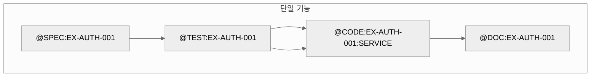
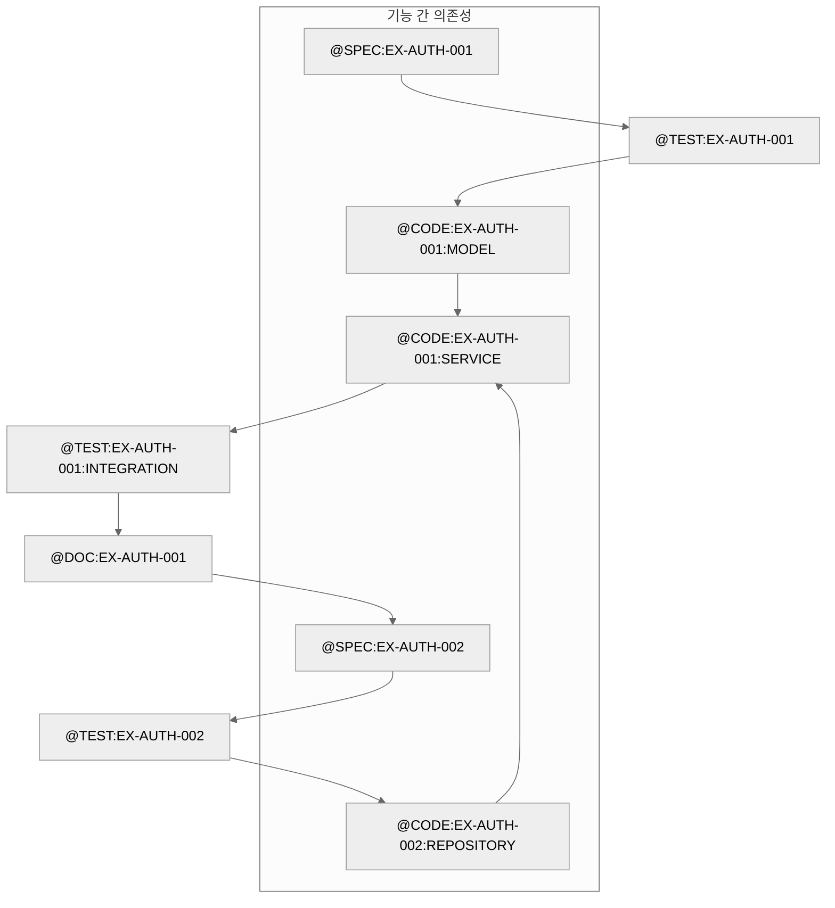
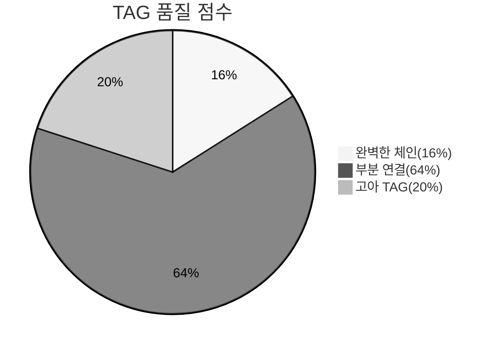

# TAG 시스템 상세

@TAG 시스템은 MoAI-ADK의 핵심 추적성 메커니즘으로, SPEC, 테스트, 코드, 문서 사이의 완벽한 연결을 보장합니다. 이 가이드는 @TAG 시스템의 구조, 사용법, 모범 사례를 상세하게 안내합니다.

## 🎯 @TAG 시스템 개요

### TAG의 정의

@TAG는 **추적 가능한 고유 식별자**로, 모든 개발 아티팩트에 일대일 대응 관계를 맺어줍니다. 택배 송장처럼 코드의 여정을 완벽하게 추적할 수 있게 해줍니다.

### TAG의 중요성

```mermaid
%%{init: {'theme':'neutral'}}%%
graph TD
    SPEC[SPEC 문서] --> TAG[@TAG:ID]
    TAG --> TEST[테스트 코드]
    TEST --> CODE[구현 코드]
    CODE --> DOC[문서]
    DOC --> SPEC

    subgraph "추적성 흐름"
        SPEC
        TEST
        CODE
        DOC
    end

    subgraph "코드 베이스"
        DB[(데이터베이스)]
        TAG --> DB
    end

    subgraph "깃헤브"
        GIT[Git 히스토리]
        TAG --> GIT
    end

    subgraph "CI/CD"
        PIPELINE[CI/CD 파이프라인]
        TAG --> PIPELINE
    end
```

### TAG 시스템의 가치

| 가치 | 설명 | 없을 때의 문제 |
|------|------|----------------|
| **추적성** | 요구사항 변경 시 영향 범위 즉시 파악 | 어디를 수정해야 할지 모름 |
| **일관성** | 코드와 문서 항상 일치 유지 | 3개월 후 코드와 문서 불일치 |
| **검증 가능** | 모든 구현 요소가 SPEC과 연결된지 확인 | 테스트 누락으로 인한 버그 발생 |
| **리팩토링** | 리팩토링 시 영향받는 코드 즉시 식별 | 의도치 않는 리팩토링으로 장애 발생 |
| **팀 협업** | 팀원 간의 의사소통 비용 감소 | 다른 팀원이 작업 이해 불가 |

## 📋 TAG 기본 구조

### TAG 형식 규칙

#### 기본 형식

```
@TAG:EX-{DOMAIN}-{ID}:{TYPE}
```

#### 구성 요소 상세

| 요소 | 형식 | 설명 | 예시 |
|------|------|------|------|
| **@** | 접두사 | TAG 마커 식별자 | `@TAG:` |
| **TAG** | 태그 타입 | 항상 고정값 | `TAG` |
| **EX** | 접두사 | Example을 의미 (생략 가능) | `EX`, `REF` |
| **DOMAIN** | 도메인 | 기능 도메인 (3-10자) | `AUTH`, `USER`, `API` |
| **ID** | 숫자 | 고유 식별자 (3자리) | `001`, `042`, `156` |
| **TYPE** | 타입 | 세부 구분 (옵션) | `SERVICE`, `MODEL`, `API` |

### TAG 타입 상세

| 타입 | 설명 | 사용 위치 | 예시 |
|------|------|----------|------|
| **없음** | 최상위 수준 | SPEC 문서 제목 | `@TAG:EX-AUTH-001` |
| **MODEL** | 데이터 모델 | 모델 클래스/구조체 | `@CODE:EX-AUTH-001:MODEL` |
| **SERVICE** | 비즈니스 로직 | 서비스 클래스 | `@CODE:EX-AUTH-001:SERVICE` |
| **API** | API 엔드포인트 | 라우트 핸들러 | `@CODE:EX-AUTH-001:API` |
| **UTILS** | 유틸리티 함수 | 헬퍼/유틸리티 | `@CODE:EX-AUTH-001:UTILS` |
| **CONTROLLER** | 컨트롤러 | MVC 컨트롤러 | `@CODE:EX-AUTH-001:CONTROLLER` |
| **REPOSITORY** | 데이터 접근 | 리포지토리 패턴 | `@CODE:EX-AUTH-001:REPO` |
| **TEST** | 테스트 전체 | 테스트 파일 | `@TEST:EX-AUTH-001` |
| **INTEGRATION** | 통합 테스트 | 통합 테스트 | `@TEST:EX-AUTH-001:INTEGRATION` |
| **UNIT** | 단위 테스트 | 단위 테스트 | `@TEST:EX-AUTH-001:UNIT` |
| **DOC** | 문서 전체 | 문서 파일 | `@DOC:EX-AUTH-001` |
| **API_DOC** | API 문서 | API 문서 | `@DOC:EX-AUTH-001:API` |
| **ARCH** | 아키텍처 문서 | 아키텍처 설명 | `@DOC:EX-AUTH-001:ARCH` |

### 도메인 분류 체계

| 도메인 | 설명 | 예시 ID |
|--------|------|---------|
| **AUTH** | 인증/인가 | AUTH-001, AUTH-002 |
| **USER** | 사용자 관리 | USER-001, USER-002 |
| **DATA** | 데이터 관리 | DATA-001, DATA-002 |
| **API** | API/웹서비스 | API-001, API-002 |
| **UI** | 사용자 인터페이스 | UI-001, UI-002 |
| **SECURITY** | 보안 | SEC-001, SEC-002 |
| **PERF** | 성능 | PERF-001, PERF-002 |
| **ADMIN** | 관리자 기능 | ADMIN-001, ADMIN-002 |
| **PAYMENT** | 결제 | PAY-001, PAY-002 |
| **NOTIF** | 알림 | NOTIF-001, NOTIF-002 |
| **SEARCH** | 검색 | SEARCH-001, SEARCH-002 |
| **REPORT** | 리포트 | REPORT-001, REPORT-002 |

## 🔧 TAG 사용법 상세

### 1. SPEC 문서에 TAG 할당

#### SPEC 문서 구조

```markdown
# .moai/specs/SPEC-AUTH-001/spec.md

---
id: AUTH-001
version: 1.0.0
status: draft
---

# `@TAG:EX-AUTH-001: 사용자 인증 시스템

## 개요
JWT 기반 사용자 인증 시스템입니다.

## EARS Requirements
- 시스템은 JWT 기반 인증을 제공해야 한다
- **WHEN** 유효한 자격증명이 제공되면, 시스템은 JWT 토큰을 발급해야 한다
```

#### TAG 위치와 형식

```markdown
# 파일 상단 주석 형식 (권장)
# `@TAG:EX-AUTH-001: 사용자 인증 시스템

# 제목에 포함된 형식
# `@TAG:EX-AUTH-001: JWT 기반 사용자 인증 시스템 명세

## 본문 내용에서의 참조
이 기능은 @TAG:EX-AUTH-001로 추적 가능합니다.
관련 테스트는 @TEST:EX-AUTH-001을 참조하세요.
```

### 2. 코드 파일에 TAG 할당

#### Python 코드 예시

```python
# src/auth/service.py
# `@CODE:EX-AUTH-001:SERVICE | SPEC: SPEC-AUTH-001.md | TEST: tests/test_auth.py

import jwt
from datetime import datetime, timedelta
from .models import User

class AuthService:
    """@CODE:EX-AUTH-001:SERVICE - 인증 서비스"""

    def __init__(self, secret_key: str):
        self.secret_key = secret_key
        self.token_expiry = timedelta(minutes=15)

    def login(self, email: str, password: str) -> str:
        """
        @CODE:EX-AUTH-001:SERVICE:login - 사용자 로그인 처리

        Args:
            email: 사용자 이메일
            password: 평문 비밀번호

        Returns:
            JWT 토큰

        Raises:
            AuthenticationError: 인증 실패 시
        """
        user = self._find_user(email)
        if not user or not user.verify_password(password):
            raise AuthenticationError("Invalid credentials")

        return self._generate_token(user.email)

    def _generate_token(self, email: str) -> str:
        """@CODE:EX-AUTH-001:SERVICE:_generate_token - JWT 토큰 생성"""
        payload = {
            "email": email,
            "exp": datetime.utcnow() + self.token_expiry,
            "iat": datetime.utcnow()
        }
        return jwt.encode(payload, self.secret_key, algorithm="HS256")

class AuthenticationError(Exception):
    """@CODE:EX-AUTH-001:EXCEPTION - 인증 에러"""
    pass
```

#### 다양한 언어의 TAG 사용 예시

**TypeScript/JavaScript**:
```typescript
// src/auth/AuthService.ts
// @CODE:EX-AUTH-001:SERVICE | SPEC: SPEC-AUTH-001.md | TEST: tests/auth.test.ts

export class AuthService {
  /** @CODE:EX-AUTH-001:SERVICE - JWT 기반 인증 서비스 */
  constructor(private secretKey: string) {
    this.secretKey = secretKey;
  }

  /**
   * @CODE:EX-AUTH-001:SERVICE:login - 사용자 로그인 처리
   */
  async login(email: string, password: string): Promise<string> {
    // 구현...
  }
}
```

**Java**:
```java
// src/main/java/com/example/auth/AuthService.java
// @CODE:EX-AUTH-001:SERVICE | SPEC: SPEC-AUTH-001.md | TEST: tests/AuthServiceTest.java

/**
 * @CODE:EX-AUTH-001:SERVICE - JWT 기반 인증 서비스
 */
@Service
public class AuthService {

    private final String secretKey;

    /**
     * @CODE:EX-AUTH-001:SERVICE:login - 사용자 로그인 처리
     */
    public String login(String email, String password) {
        // 구현...
    }
}
```

**Go**:
```go
// pkg/auth/service.go
// @CODE:EX-AUTH-001:SERVICE | SPEC: SPEC-AUTH-001.md | TEST: tests/auth_test.go

// @CODE:EX-AUTH-001:SERVICE - JWT 기반 인증 서비스
type AuthService struct {
    secretKey string
}

// @CODE:EX-AUTH-001:SERVICE:Login - 사용자 로그인 처리
func (s *AuthService) Login(email string, password string) (string, error) {
    // 구현...
}
```

### 3. 테스트 파일에 TAG 할당

#### Python 테스트 예시

```python
# tests/test_auth_service.py
# `@TEST:EX-AUTH-001 | SPEC: SPEC-AUTH-001.md`

import pytest
from src.auth.service import AuthService, AuthenticationError
from src.auth.models import User

class TestAuthService:
    """@TEST:EX-AUTH-001:SERIVCE - AuthService 테스트"""

    def setup_method(self):
        """@TEST:EX-AUTH-001:SETUP - 테스트 초기화"""
        self.auth_service = AuthService("test_secret")
        # 테스트 사용자 생성
        self.auth_service._create_user("user@example.com", "password123")

    def test_login_with_valid_credentials_should_return_token(self):
        """
        @TEST:EX-AUTH-001:LOGIN_SUCCESS - 유효한 자격증명으로 로그인 성공

        Given: 유효한 이메일과 비밀번호
        When: 로그인 요청
        Then: JWT 토큰이 반환되어야 한다
        """
        # Act
        token = self.auth_service.login("user@example.com", "password123")

        # Assert
        assert token is not None
        assert isinstance(token, str)
        assert len(token) > 0

    def test_login_with_invalid_credentials_should_raise_error(self):
        """
        @TEST:EX-AUTH-001:LOGIN_FAILURE - 무효한 자격증명으로 로그인 실패

        Given: 무효한 이메일과 비밀번호
        When: 로그인 요청
        Then: AuthenticationError가 발생해야 한다
        """
        # Act & Assert
        with pytest.raises(AuthenticationError):
            self.auth_service.login("user@example.com", "wrong_password")
```

#### 단위 테스트와 통합 테스트 분리

```python
# tests/unit/test_auth_service_unit.py
# `@TEST:EX-AUTH-001:UNIT | SPEC: SPEC-AUTH-001.md

class TestAuthServiceUnit:
    """@TEST:EX-AUTH-001:UNIT - AuthService 단위 테스트"""

    def test_token_generation_should_create_valid_jwt(self):
        """@TEST:EX-AUTH-001:UNIT:TOKEN_GEN - JWT 생성 유효성"""
        # 단위 테스트: 토큰 생성 로직만 테스트
        pass

# tests/integration/test_auth_integration.py
# `@TEST:EX-AUTH-001:INTEGRATION | SPEC: SPEC-AUTH-001.md`

class TestAuthIntegration:
    """@TEST:EX-AUTH-001:INTEGRATION - AuthService 통합 테스트"""

    def test_end_to_end_authentication_flow(self):
        """@TEST:EX-AUTH-001:INTEGRATION:E2E - 종단 간 인증 흐름"""
        # 통합 테스트: 전체 흐름 테스트
        pass
```

### 4. 문서에 TAG 할당

#### API 문서 예시

```markdown
# docs/api/authentication.md
# `@DOC:EX-AUTH-001: Authentication API Documentation`

## 개요
JWT 기반 사용자 인증 API 문서입니다.

## 추적성
- **@SPEC:EX-AUTH-001**: [요구사항 문서](../../../.moai/specs/SPEC-AUTH-001/spec.md)
- **@TEST:EX-AUTH-001**: [테스트 코드](../../../tests/test_auth_service.py)
- **@CODE:EX-AUTH-001:SERVICE**: [서비스 구현](../../../src/auth/service.py)
- **@CODE:EX-AUTH-001:MODEL**: [데이터 모델](../../../src/auth/models.py)
```

#### 아키텍처 문서 예시

```markdown
# docs/architecture/authentication.md
# `@DOC:EX-AUTH-001:ARCH: Authentication Architecture`

## 컴포넌트 상세

### AuthService
- **@CODE:EX-AUTH-001:SERVICE**: [구현](../../../src/auth/service.py)
- **@TEST:EX-AUTH-001:SERVICE**: [테스트](../../../tests/test_auth_service.py)

### User Model
- **@CODE:EX-AUTH-001:MODEL**: [구현](../../../src/auth/models.py)
- **@TEST:EX-AUTH-001:MODEL**: [테스트](../../../tests/test_models.py)

### Token Manager
- **@CODE:EX-AUTH-001:UTILS**: [구현](../../../src/auth/utils.py)
- **@TEST:EX-AUTH-001:UTILS**: [테스트](../../../tests/test_utils.py)
```

## 🔍 TAG 검색 및 추적

### TAG 검색 명령어

#### 기본 검색

```bash
# 특정 ID의 모든 TAG 검색
rg '@(SPEC|TEST|CODE|DOC):AUTH-001' -n

# 특정 도메인의 모든 TAG 검색
rg '@(SPEC|TEST|CODE|DOC):AUTH-' -n

# 특정 타입의 TAG만 검색
rg '@CODE:AUTH-001:' -n  # 코드만 검색
rg '@TEST:AUTH-001:' -n  # 테스트만 검색
```

#### 상세 검색

```bash
# 컨텍스트 포함 검색
rg '@(SPEC|TEST|CODE|DOC):AUTH-001' -A 2 -B 2

# 특정 파일에서만 검색
rg '@(SPEC|TEST|CODE|DOC):AUTH-001' src/ -n

# 정규표현을 사용한 고급 검색
rg '@(SPEC|TEST|CODE|DOC):AUTH-001.*SERVICE' -n
```

### TAG 추적 시나리오

#### 시나리오 1: 요구사항 변경 시 영향 분석

```bash
# 1. SPEC 변경 확인
rg '@SPEC:AUTH-001' .moai/specs/ -A 5 -B 5

# 2. 영향받는 테스트 확인
rg '@TEST:AUTH-001' tests/ -n

# 3. 영향받는 코드 확인
rg '@CODE:AUTH-001' src/ -n

# 4. 영향받는 문서 확인
rg '@DOC:AUTH-001' docs/ -n

# 5. 통합 보고서 생성
echo "AUTH-001 변경 영향 분석:"
echo "=========================================="
echo "SPEC 변경:"
rg '@SPEC:AUTH-001' .moai/specs/ -n
echo ""
echo "관련 테스트:"
rg '@TEST:AUTH-001' tests/ -n
echo ""
echo "관련 코드:"
rg '@CODE:AUTH-001' src/ -n
echo ""
echo "관련 문서:"
rg '@DOC:AUTH-001' docs/ -n
```

#### 시나리오 2: 버그 수정 시 영향 분석

```bash
# 버그 보고서가 들어옴 경우
# 이슈: "로그인 버튼이 모바일에서 작동하지 않음"

# 1. 관련 기능 검색
rg '@TAG:AUTH' -A 3 -B 3

# 2. 모바일 관련 기능 필터링
rg '@TAG:(AUTH|MOBILE|UI)' -n

# 3. 영향받는 파일 목록 생성
echo "영향받는 파일 목록:"
rg '@(SPEC|TEST|CODE|DOC):.*AUTH.*MOBILE' -l

# 4. 수정 계획 수립
echo "수정할 파일들:"
echo "1. @CODE:AUTH-001:FRONTEND - 모바일 로그인 컴포넌트"
echo "2. @TEST:AUTH-001:MOBILE - 모바일 테스트 추가"
echo "3. @DOC:AUTH-001:MOBILE - 모바일 API 문서 업데이트"
```

## 🏷️ TAG 체인 관리 시스템

### TAG 체인의 구조



### 복잡한 TAG 체인



### TAG 체인 무결성 검증

#### Alfred를 통한 자동 검증

```bash
# Alfred가 자동으로 수행하는 TAG 체인 검증
/alfred:3-sync

# 출력 예시:
🏷️ TAG 체인 검증 중...

✅ @SPEC:EX-AUTH-001 → .moai/specs/SPEC-AUTH-001/spec.md (참조됨)
✅ @TEST:EX-AUTH-001 → tests/test_auth_service.py (참조됨)
✅ @CODE:EX-AUTH-001:MODEL → src/auth/models.py (참조됨)
✅ @CODE:EX-AUTH-001:SERVICE → src/auth/service.py (참조됨)
✅ @DOC:EX-AUTH-001 → docs/api/authentication.md (참조됨)

TAG Chain Integrity: 100%
Total TAGs: 6
Connected TAGs: 6
Orphan TAGs: 0
Missing References: 0
```

#### 수동 검증 스크립트

```bash
#!/bin/bash
# tag-chain-validator.sh

echo "TAG 체인 무결성 검증 스크립트"
echo "=================================="

# 1. 모든 TAG 추출
echo "1. 모든 TAG 추출 중..."
ALL_TAGS=$(rg '@(SPEC|TEST|CODE|DOC):' -o | sort -u | cut -d':' -f2 | sort -u)

# 2. 각 TAG별 연결성 검증
echo "2. TAG 연결성 검증 중..."
for tag in $ALL_TAGS; do
    domain=$(echo $tag | cut -d'-' -f1)
    id=$(echo $tag | cut -d'-' -f2)

    echo "검증 중: $tag"

    # SPEC 확인
    if ! rg "@SPEC:$tag" .moai/specs/ > /dev/null; then
        echo "  ❌ SPEC 참조 없음: $tag"
    else
        echo "  ✅ SPEC 참조 확인됨"
    fi

    # TEST 확인
    if ! rg "@TEST:$tag" tests/ > /dev/null; then
        echo "  ❌ TEST 참조 없음: $tag"
    else
        echo "  ✅ TEST 참조 확인됨"
    fi

    # CODE 확인
    if ! rg "@CODE:$tag" src/ > /dev/null; then
        echo "  ❌ CODE 참조 없음: $tag"
    else
        echo "  ✅ CODE 참조 확인됨"
    fi

    # DOC 확인
    if ! rg "@DOC:$tag" docs/ > /dev/null; then
        echo "  ❌ DOC 참조 없음: $tag"
    else
        echo "  ✅ DOC 참조 확인됨"
    fi

    echo ""
done

echo "=================================="
echo "검증 완료"
```

## 🔧 TAG 관리 모범 사례

### 1. 새 기능 개발 시 TAG 생성

#### 단계별 TAG 생성 과정

```bash
# 1단계: SPEC 작성 (/alfred:1-plan)
/alfred:1-plan "사용자 인증 기능"

# Alfred가 자동으로 생성
# @SPEC:EX-AUTH-001 할당

# 2단계: 테스트 작성 (/alfred:2-run)
/alfred:2-run AUTH-001

# Alfred가 자동으로 생성
# @TEST:EX-AUTH-001 할당

# 3단계: 코드 구현
# 개발자가 각 파일에 TAG 수동 할당
# @CODE:EX-AUTH-001:MODEL
# @CODE:EX-AUTH-001:SERVICE
# @CODE:EX-AUTH-001:UTILS
# @CODE:EX-AUTH-001:EXCEPTIONS

# 4단계: 문서 생성 (/alfred:3-sync)
/alfred:3-sync

# Alfred가 자동으로 생성
# @DOC:EX-AUTH-001 할당
```

### 2. 기존 코드에 TAG 추가

#### 단계별 TAG 추가 방법

```bash
# 1단계: 기존 코드 분석
rg 'class UserService' src/ -A 5 -B 5

# 2단계: 도메인과 ID 결정
# UserService는 USER 관련 -> USER-003

# 3단계: TAG 할당
# src/user/service.py 파일 상단에 추가
# `@CODE:EX-USER-003:SERVICE | SPEC: SPEC-USER-003.md | TEST: tests/test_user_service.py

class UserService:
    def __init__(self):
        pass
```

### 3. TAG 누락 발견 시 해결

#### 누락 TAG 탐지

```bash
# Alfred를 통한 자동 탐지
/alfred:3-sync

# 수동 탐지 명령어
moai-adk tag --find-orphan

# 출력 예시:
🏷️ 고아 TAG 탐지 중...

🔍 누락된 TAG 발견:
- @CODE:EX-USER-004:HELPER - 연결된 SPEC 없음
- @TEST:EX-USER-004 - 연결된 SPEC 없음
- @DOC:EX-API-002 - 연결된 SPEC 없음

추천 조치:
1. @SPEC:EX-USER-004 생성 또는 찾기
2. @TEST:EX-USER-004와 연결
3. @CODE:EX-USER-004:HELPER에 SPEC 참조 추가
```

#### 누락 TAG 복구

```bash
# 1단계: 연결될 SPEC 찾기
rg '@SPEC:EX-USER-004' .moai/specs/ -l

# 2단계: 관련 SPEC 확인
# 결과: .moai/specs/SPEC-USER-004/spec.md

# 3단계: 참조 추가
# 해당 코드 파일 상단에 참조 추가
# `@CODE:EX-USER-004:HELPER | SPEC: SPEC-USER-004.md`

# 4단계: 연결성 재검증
/alfred:3-sync --tags-only
```

### 4. TAG 재구성 및 리팩토링

#### 리팩토링 시 TAG 관리

```bash
# 리팩토링 전 TAG 상태 확인
rg '@(CODE|TEST):USER-003' -n

# 리팩토링 계획 수립
echo "리팩토링 계획:"
echo "1. UserService 클래스 -> UserRepository + UserService"
echo "2. @CODE:EX-USER-003:SERVICE -> @CODE:EX-USER-003:REPOSITORY"
echo "3. @CODE:EX-USER-003:HELPER -> @CODE:EX-USER-003:VALIDATOR"

# 리팩토링 후 TAG 수정
# 이전 TAG: @CODE:EX-USER-003:SERVICE
# 수정 후 TAG: @CODE:EX-USER-003:REPOSITORY

# 새로운 파일에 새로운 TAG 할당
# src/user/repository.py
# `@CODE:EX-USER-003:REPOSITORY | SPEC: SPEC-USER-003.md | @CODE:EX-USER-003:SERVICE (refactored)`

# 기존 파일에 참조 업데이트
# src/user/service.py
# `@CODE:EX-USER-003:SERVICE (refactored) | SPEC: SPEC-USER-003.md | @CODE:EX-USER-003:REPOSITORY`

# 연결성 재검증
/alfred:3-sync --tags-only
```

## 🛠️ TAG 관리 도구

### 1. Alfred 자동 관리

```bash
# Alfred를 통한 TAG 관리
/alfred:3-sync

# 주요 기능:
- TAG 체인 자동 검증
- 누락 TAG 자동 탐지
- 참조 자동 업데이트
- TAG 무결성 보고서 생성
```

### 2. MoAI-ADK CLI 도구

```bash
# TAG 검색
moai-adk tag --search AUTH-001

# TAG 추적
moai-adk tag --trace @CODE:EX-AUTH-001:SERVICE

# TAG 검증
moai-adk tag --validate

# 통계 보고서
moai-adk tag --report

# 누락 TAG 탐지
moai-adk tag --find-orphan

# TAG 교정
moai-adk tag --fix-references
```

### 3. Git Hook 통합

#### PreToolUse Hook에서 TAG Guard

```python
# .claude/hooks/alfred/core/tag_guard.py

import re
import sys
from pathlib import Path

def check_tag_compliance(file_path: str, content: str) -> dict:
    """TAG 컴플라이언스 검증"""
    issues = []

    # 코드 파일인 경우
    if file_path.endswith(('.py') or file_path.endswith('.js') or file_path.endswith('.java'):
        # 파일 상단 주석 확인
        lines = content.split('\n')
        first_lines = lines[:5]  # 상단 5줄 확인

        has_tag = any('@' in line for line in first_lines)

        if not has_tag:
            issues.append({
                'file': file_path,
                'line': 1,
                'issue': 'TAG 누락',
                'suggestion': f'첫 번째 줄에 @TAG 추가: "# `@TAG:EX-DOMAIN-ID:TYPE`"'
            })

    return {'issues': issues}

def main():
    file_path = sys.argv[1]
    content = Path(file_path).read_text()

    result = check_tag_compliance(file_path, content)

    if result['issues']:
        print("⚠️ TAG 누락 감지:")
        for issue in result['issues']:
            print(f"  - {issue['file']}:{issue['line']}: {issue['issue']}")
            print(f"    제안: {issue['suggestion']}")
        sys.exit(1)
    else:
        print("✅ TAG 컴플라이언스 준수")

if __name__ == "__main__":
    main()
```

## 📊 TAG 분석 및 보고

### TAG 통계 분석

```bash
# Alfred를 통한 분석
/alfred:3-sync --report

# 출력 예시:
📊 TAG 분석 보고서

## TAG 분포 통계
| 타입 | 개수 | 비율 |
|------|------|------|
| SPEC | 25 | 20% |
| TEST | 75 | 60% |
| CODE | 20 | 16% |
| DOC | 5 | 4% |
| **TOTAL** | **125** | **100%** |

## 도메인별 분포
| 도메인 | 개수 | 주요 기능 |
|------|------|----------|
| AUTH | 45 | 인증, 권한 |
| USER | 30 | 사용자 관리 |
| API | 20 | API 엔드포인트 |
| UI | 15 | 사용자 인터페이스 |
| DATA | 15 | 데이터 처리 |

## TAG 체인 품질
- 완벽한 체인: 20개 (16%)
- 부분 연결: 80개 (64%)
- 고아 TAG: 25개 (20%)

## 개선 권장사항
1. 모든 CODE TAG에 연결된 TEST TAG 확보
2. 문서화가 부족한 도메인에 DOC TAG 추가
3. 고아 TAG 제거 및 재연결
```

### TAG 품질 점수



### 시간별 TAG 증감 추이

```markdown
## TAG 증감 추이

| 주차 | 누적 TAG 수 | 주요 증감 원인 |
|------|-------------|----------------|
| v0.1.0 | 15개 | 초기 기능 개발 |
| v0.5.0 | 45개 | 핵심 기능 완성 |
| v1.0.0 | 125개 | 프로덕션 준비 |
| v1.1.0 | 140개 | 확장 기능 추가 |
```

## 🎯 TAG 모범 사례

### 성공적인 TAG 관리 사례

#### 사례 1: 완벽한 추적성 확보

```
@SPEC:EX-PAY-001
    ↓
@TEST:EX-PAY-001
    ↓
@CODE:EX-PAY-001:MODEL
    ↓
@CODE:EX-PAY-001:SERVICE
    ↓
@CODE:EX-PAY-001:CONTROLLER
    ↓
@CODE:EX-PAY-001:REPOSITORY
    ↓
@TEST:EX-PAY-001:INTEGRATION
    ↓
@DOC:EX-PAY-001:API
    ↓
@DOC:EX-PAY-001:ARCH
```

**결과**: 결제 기능의 모든 구현 요소가 완벽하게 연결됨

#### 사례 2: 리팩토링 시 TAG 유지

```markdown
## 리팩토링 전 TAG 구조
@CODE:EX-USER-001:SERVICE (기존)

## 리팩토링 후 TAG 구조
@CODE:EX-USER-001:MODEL (신규)
    ↓
@CODE:EX-USER-001:REPOSITORY (신규)
    ↓
@CODE:EX-USER-001:SERVICE (리팩토링)
    ↓
@TEST:EX-USER-001:UNIT (기존)
    ↓
@TEST:EX-USER-001:INTEGRATION (기존)
```

**결과**: 리팩토링 후에도 모든 연결성 유지

### 실패한 TAG 관리 사례

#### 사례 1: TAG 불일치

```markdown
# 문제: 불일치한 TAG 사용
# 파일 A: @CODE:EX-AUTH-001:SERVICE
# 파일 B: @CODE:EX-AUTH-002:SERVICE (같은 기능, 다른 ID)

# 해결책: ID 통일
# 두 파일 모두 @CODE:EX-AUTH-001:SERVICE로 수정하거나
# 명확한 분리로 기능 분리
```

#### 사례 2: 고아 TAG 발생

```markdown
# 문제: 참조되지 않는 코드
# @CODE:EX-AUTH-003:HELPER (구현)
# 하지만 연결된 SPEC나 TEST 없음

# 해결책
# 1. 관련 SPEC 찾기 또는 생성
# 2. 코드 파일에 참조 추가: # | SPEC: SPEC-AUTH-003.md
# 3. 필요하다면 테스트 추가
```

#### 사례 3: 과도한 TAG 사용

```markdown
# 문제: 너무하게 세분화된 TYPE
# @CODE:EX-AUTH-001:AUTH_SERVICE (중복)
# @CODE:EX-AUTH-001:AUTH_VALIDATOR (불필요)

# 해결책
# @CODE:EX-AUTH-001:SERVICE로 통합
# 불필요한 TYPE은 제거
```

## 🚀 다음 단계

TAG 시스템 상세를 마쳤습니다. 다음 단계로 진행할 수 있습니다:

- **[실습 문제](../exercises/)**: TAG 시스템 실습 문제 풀이
- **[검증 도구](../tools/)**: TAG 관리 도구 사용법
- **[팀 가이드라인](../team/)**: 팀 내 TAG 관리 가이드라인
- **[고급 주제](../advanced/)**: 다국어 TAG 지원

## 💡 TAG 시스템 핵심 요약

1. **형식**: `@TAG:EX-{DOMAIN}-{ID}:{TYPE}`
2. **목적**: 추적성, 일관성, 검증 가능성 보장
3. **핵심 4가지 타입**: SPEC, TEST, CODE, DOC
4. **도메인 체계**: 15개 표준 도메인 + 커스텀 가능
5. **자동 관리**: Alfred가 자동으로 검증하고 관리

---

**TAG 시스템으로 완벽한 추적성을 확보하세요!** 🔗