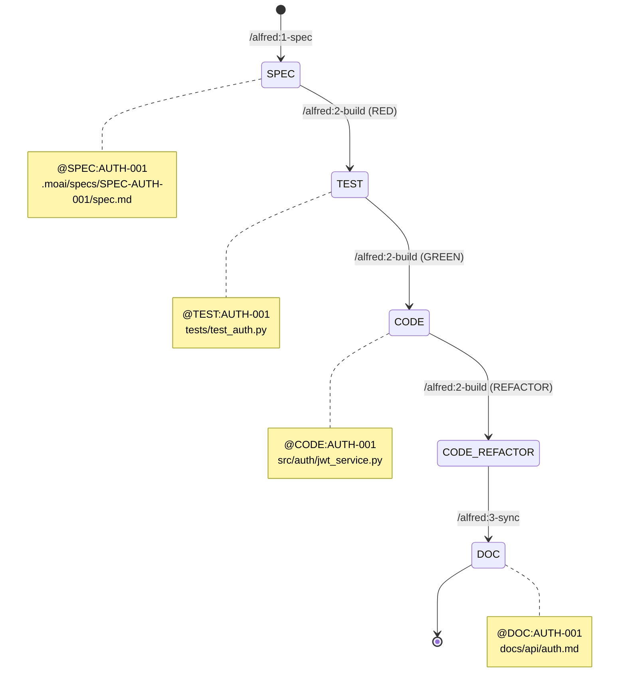

# @TAG 시스템 완전 가이드

> **"TAG의 진실은 코드 자체에만 존재한다 - CODE-FIRST 원칙"**

MoAI-ADK의 @TAG 시스템은 SPEC → TEST → CODE → DOC 전체 라이프사이클을 추적하는 핵심 메커니즘입니다.

---

## 목차

1. [@TAG 시스템 개요](#tag-시스템-개요)
2. [핵심 설계 철학](#핵심-설계-철학)
3. [TAG 체계](#tag-체계)
4. [TAG BLOCK 템플릿](#tag-block-템플릿)
5. [@CODE 서브 카테고리](#code-서브-카테고리)
6. [TAG 사용 규칙](#tag-사용-규칙)
7. [TAG 검증 및 무결성](#tag-검증-및-무결성)
8. [CODE-FIRST 원칙](#code-first-원칙)
9. [언어별 TAG 작성법](#언어별-tag-작성법)
10. [실전 예시](#실전-예시)
11. [트러블슈팅](#트러블슈팅)
12. [다음 단계](#다음-단계)

---

## @TAG 시스템 개요

### TAG란?

**TAG**는 코드, 테스트, 문서를 SPEC 요구사항과 연결하는 추적성 마커입니다.

### TAG의 역할

1. **추적성 (Traceability)**: SPEC → CODE 전체 체인 추적
2. **의존성 관리**: 어떤 SPEC이 어떤 코드에 영향을 주는지 파악
3. **변경 영향도 분석**: SPEC 수정 시 영향받는 코드 자동 탐지
4. **Living Document**: TAG 기반 문서 자동 생성

### TAG vs 주석

| 항목 | 일반 주석 | @TAG |
|------|---------|------|
| **목적** | 코드 설명 | 추적성 보장 |
| **위치** | 코드 어디든 | 파일 상단 (필수) |
| **형식** | 자유 | 엄격한 구문 |
| **자동화** | 불가능 | 자동 검증/추출 가능 |
| **변경** | 자유 | HISTORY 기록 필수 |

---

## 핵심 설계 철학

### 1. TDD 완벽 정렬

TAG는 TDD 사이클과 완벽하게 정렬됩니다:

```mermaid
graph LR
    A[@SPEC:ID<br>사전 준비] --> B[@TEST:ID<br>RED]
    B --> C[@CODE:ID<br>GREEN]
    C --> D[@CODE:ID<br>REFACTOR]
    D --> E[@DOC:ID<br>문서화]

    style A fill:#f9f,stroke:#333
    style B fill:#f99,stroke:#333
    style C fill:#9f9,stroke:#333
    style D fill:#99f,stroke:#333
    style E fill:#ff9,stroke:#333
```

### 2. 단순성

**4개 TAG로 전체 라이프사이클 관리**:

- `@SPEC:ID`: 요구사항 명세
- `@TEST:ID`: 테스트 케이스
- `@CODE:ID`: 구현 코드
- `@DOC:ID`: 문서화

### 3. 코드 직접 스캔 (CODE-FIRST)

**중간 캐시 없음, 코드가 SSOT (Single Source of Truth)**:

```bash
# TAG 검색은 항상 코드를 직접 스캔
rg '@SPEC:' -n .moai/specs/
rg '@TEST:' -n tests/
rg '@CODE:' -n src/
rg '@DOC:' -n docs/
```

---

## TAG 체계

### 기본 체계

```
@SPEC:ID → @TEST:ID → @CODE:ID → @DOC:ID
```

### TAG 테이블

| TAG | 역할 | TDD 단계 | 위치 | 필수 | 파일 수 |
|-----|------|---------|------|------|--------|
| `@SPEC:ID` | 요구사항 명세 (EARS) | 사전 준비 | .moai/specs/ | ✅ | 1개 |
| `@TEST:ID` | 테스트 케이스 | RED | tests/ | ✅ | 1개 이상 |
| `@CODE:ID` | 구현 코드 | GREEN + REFACTOR | src/ | ✅ | 1개 이상 |
| `@DOC:ID` | 문서화 | REFACTOR | docs/ | ⚠️ | 0~N개 |

### TAG 라이프사이클



---

## TAG BLOCK 템플릿

### SPEC 문서 TAG

**위치**: `.moai/specs/SPEC-{ID}/spec.md`

**형식**:

```markdown
---
id: AUTH-001
version: 0.0.1
status: draft
created: 2025-10-14
updated: 2025-10-14
author: @Goos
priority: high
---

# @SPEC:AUTH-001: JWT 인증 시스템

## HISTORY
### v0.0.1 (2025-10-14)
- **INITIAL**: JWT 기반 인증 시스템 명세 작성
- **AUTHOR**: @Goos
```

### 테스트 코드 TAG

**위치**: `tests/test_*.py` (Python 예시)

**형식**:

```python
# @TEST:AUTH-001 | SPEC: SPEC-AUTH-001.md
import pytest
from src.auth.jwt_service import JWTService


class TestJWTAuthentication:
    """@SPEC:AUTH-001 JWT 인증 시스템 테스트"""

    def test_generate_token(self):
        """JWT 토큰 생성 테스트"""
        service = JWTService()
        token = service.generate_token(user_id=1)
        assert token is not None
```

### 소스 코드 TAG

**위치**: `src/*.py` (Python 예시)

**형식**:

```python
# @CODE:AUTH-001 | SPEC: SPEC-AUTH-001.md | TEST: tests/test_auth.py
from typing import Dict, Any
import jwt


class JWTService:
    """
    @SPEC:AUTH-001 JWT 인증 서비스

    TDD 이력:
    - v0.0.1 (2025-10-14): RED - 테스트 작성
    - v0.1.0 (2025-10-14): GREEN - 최소 구현
    - v0.1.1 (2025-10-14): REFACTOR - 코드 품질 개선
    """

    def generate_token(self, user_id: int) -> str:
        """JWT 토큰 생성"""
        # @CODE:AUTH-001:DOMAIN - 비즈니스 로직
        payload = {"user_id": user_id}
        return jwt.encode(payload, "secret", algorithm="HS256")
```

### 문서 TAG

**위치**: `docs/api/*.md`

**형식**:

```markdown
# @DOC:AUTH-001: JWT 인증 API

> **SPEC**: SPEC-AUTH-001.md
> **CODE**: src/auth/jwt_service.py
> **TEST**: tests/test_auth.py

## 개요

JWT 기반 사용자 인증 시스템 API 문서입니다.

## API Reference

### `generate_token(user_id: int) -> str`

JWT 토큰을 생성합니다.
```

---

## @CODE 서브 카테고리

### 서브 카테고리 목록

구현 세부사항은 `@CODE:ID` 내부에 주석으로 표기합니다:

| 서브 카테고리 | 설명 | 예시 |
|-------------|------|------|
| `@CODE:ID:API` | REST API, GraphQL 엔드포인트 | FastAPI 라우터 |
| `@CODE:ID:UI` | 컴포넌트, 뷰, 화면 | React 컴포넌트 |
| `@CODE:ID:DATA` | 데이터 모델, 스키마, 타입 | SQLAlchemy 모델 |
| `@CODE:ID:DOMAIN` | 비즈니스 로직, 도메인 규칙 | 서비스 클래스 |
| `@CODE:ID:INFRA` | 인프라, 데이터베이스, 외부 연동 | DB 커넥션 |

### 사용 예시

#### Python - FastAPI 예시

```python
# @CODE:AUTH-001 | SPEC: SPEC-AUTH-001.md | TEST: tests/test_auth.py
from fastapi import APIRouter, Depends, HTTPException
from typing import Dict, Any

router = APIRouter()


# @CODE:AUTH-001:API - REST API 엔드포인트
@router.post("/login")
async def login(credentials: LoginRequest) -> Dict[str, str]:
    """
    사용자 로그인 API

    @SPEC:AUTH-001 Event-driven:
    WHEN 사용자가 유효한 자격증명으로 로그인하면, JWT 토큰을 발급해야 한다
    """
    # @CODE:AUTH-001:DOMAIN - 비즈니스 로직
    service = get_jwt_service()
    token = service.authenticate(credentials)

    if not token:
        raise HTTPException(status_code=401, detail="Invalid credentials")

    return {"token": token}


# @CODE:AUTH-001:DATA - 데이터 모델
class LoginRequest:
    """로그인 요청 모델"""
    username: str
    password: str


# @CODE:AUTH-001:DOMAIN - 비즈니스 로직
class JWTService:
    """JWT 인증 서비스"""

    def authenticate(self, credentials: LoginRequest) -> str | None:
        """사용자 인증 및 토큰 생성"""
        # @CODE:AUTH-001:INFRA - 외부 연동 (DB 조회)
        user = self._find_user(credentials.username)

        if not user or not self._verify_password(credentials.password, user.password):
            return None

        return self.generate_token(user.id)
```

#### TypeScript - React 예시

```typescript
// @CODE:AUTH-001 | SPEC: SPEC-AUTH-001.md | TEST: tests/auth.test.ts

// @CODE:AUTH-001:UI - React 컴포넌트
export function LoginForm() {
  const [credentials, setCredentials] = useState<LoginRequest>({
    username: "",
    password: "",
  });

  // @CODE:AUTH-001:DOMAIN - 비즈니스 로직
  const handleLogin = async () => {
    const token = await authService.login(credentials);
    if (token) {
      // @CODE:AUTH-001:INFRA - 로컬 스토리지 저장
      localStorage.setItem("token", token);
    }
  };

  return (
    <form onSubmit={handleLogin}>
      <input value={credentials.username} onChange={...} />
      <input value={credentials.password} onChange={...} type="password" />
      <button type="submit">로그인</button>
    </form>
  );
}

// @CODE:AUTH-001:DATA - 데이터 모델
interface LoginRequest {
  username: string;
  password: string;
}
```

---

## TAG 사용 규칙

### 1. TAG ID 규칙

**형식**: `<DOMAIN>-<NUMBER>`

**규칙**:
- 도메인: 대문자 영문 (하이픈 사용 가능)
- 번호: 3자리 숫자 (001~999)
- **영구 불변**: 한 번 부여하면 변경 불가

**예시**:

```
✅ 올바른 예시:
- AUTH-001
- USER-PROFILE-001
- PAYMENT-GATEWAY-001
- API-V2-001

❌ 잘못된 예시:
- auth-001 (소문자)
- AUTH-1 (2자리)
- AUTH-1000 (4자리)
- AUTH_001 (언더스코어)
```

### 2. 디렉토리 명명 규칙

**형식**: `.moai/specs/SPEC-{ID}/`

**규칙**:
- 반드시 `SPEC-` 접두사 사용
- ID는 TAG ID와 동일

**예시**:

```
✅ 올바른 예시:
- .moai/specs/SPEC-AUTH-001/
- .moai/specs/SPEC-USER-PROFILE-001/
- .moai/specs/SPEC-PAYMENT-GATEWAY-001/

❌ 잘못된 예시:
- .moai/specs/AUTH-001/ (SPEC- 접두사 없음)
- .moai/specs/SPEC-001-auth/ (ID 뒤에 설명)
- .moai/specs/SPEC-AUTH-001-jwt/ (ID 뒤에 설명)
```

### 3. TAG 내용 수정 규칙

**원칙**: TAG ID는 불변, TAG 내용은 자유롭게 수정 가능

**수정 시 필수**:
- HISTORY 섹션에 변경 이력 기록
- version 필드 업데이트
- updated 필드 업데이트

**예시**:

```markdown
---
id: AUTH-001          # ← 영구 불변
version: 0.1.1        # ← 업데이트
updated: 2025-10-15   # ← 업데이트
---

# @SPEC:AUTH-001: JWT 인증 시스템

## HISTORY

### v0.1.1 (2025-10-15)
- **CHANGED**: OAuth2 통합 요구사항 추가
- **AUTHOR**: @Goos

### v0.1.0 (2025-10-14)
- **CHANGED**: status: draft → completed
- **AUTHOR**: @Goos (Alfred /alfred:3-sync 자동 업데이트)

### v0.0.1 (2025-10-14)
- **INITIAL**: JWT 기반 인증 시스템 명세 작성
- **AUTHOR**: @Goos
```

### 4. 버전 관리 규칙

**Semantic Versioning**: `MAJOR.MINOR.PATCH`

| 버전 | 변경 내용 | 예시 |
|------|----------|------|
| v0.0.1 | INITIAL (최초 작성) | SPEC 초안 |
| v0.0.x | Draft 수정 | 요구사항 보완 |
| v0.1.0 | TDD 구현 완료 | status: completed |
| v0.1.x | 버그 수정 | 패치 |
| v0.x.0 | 기능 추가 | 새 요구사항 |
| v1.0.0 | 정식 릴리스 | 프로덕션 |

### 5. TAG 참조 규칙

**원칙**: 버전 없이 파일명만 사용

**이유**: 파일명은 최신 버전을 가리킴

**예시**:

```python
# ✅ 올바른 예시
# @CODE:AUTH-001 | SPEC: SPEC-AUTH-001.md | TEST: tests/test_auth.py

# ❌ 잘못된 예시
# @CODE:AUTH-001 | SPEC: SPEC-AUTH-001-v0.1.0.md | TEST: tests/test_auth.py
#                         ↑ 버전 포함 (불필요)
```

---

## TAG 검증 및 무결성

### 중복 방지

**원칙**: 새 TAG 생성 전 중복 확인 필수

**검증 명령어**:

```bash
# 특정 도메인 검색
rg "@SPEC:AUTH" -n .moai/specs/

# 특정 ID 검색
rg "AUTH-001" -n

# 전체 TAG 검색
rg '@(SPEC|TEST|CODE|DOC):AUTH-001' -n
```

**예시**:

```bash
# 1. 새 SPEC 작성 전 중복 확인
$ rg "@SPEC:AUTH-001" -n .moai/specs/
# (결과 없음 = 사용 가능)

# 2. SPEC 작성
/alfred:1-spec "JWT 인증 시스템"
# → SPEC-AUTH-001 생성

# 3. 재확인
$ rg "@SPEC:AUTH-001" -n .moai/specs/
.moai/specs/SPEC-AUTH-001/spec.md:19:# @SPEC:AUTH-001: JWT 인증 시스템
```

### TAG 체인 검증

**원칙**: `/alfred:3-sync` 실행 시 자동 검증

**검증 항목**:
1. @SPEC:ID 존재 확인
2. @TEST:ID → @SPEC:ID 참조 확인
3. @CODE:ID → @SPEC:ID, @TEST:ID 참조 확인
4. @DOC:ID → @SPEC:ID 참조 확인 (선택)

**검증 명령어**:

```bash
# 전체 TAG 스캔
rg '@(SPEC|TEST|CODE|DOC):' -n .moai/specs/ tests/ src/ docs/

# 결과 예시:
# .moai/specs/SPEC-AUTH-001/spec.md:19:# @SPEC:AUTH-001
# tests/test_auth.py:1:# @TEST:AUTH-001 | SPEC: SPEC-AUTH-001.md
# src/auth/jwt_service.py:1:# @CODE:AUTH-001 | SPEC: SPEC-AUTH-001.md | TEST: tests/test_auth.py
```

### 고아 TAG 탐지

**정의**: 참조가 끊어진 TAG

**탐지 방법**:

```bash
# 1. CODE는 있는데 SPEC이 없는 경우
rg '@CODE:AUTH-001' -n src/
# → src/auth/jwt_service.py:1

rg '@SPEC:AUTH-001' -n .moai/specs/
# → (결과 없음) ← 고아 TAG!

# 2. TEST는 있는데 CODE가 없는 경우
rg '@TEST:AUTH-002' -n tests/
# → tests/test_oauth.py:1

rg '@CODE:AUTH-002' -n src/
# → (결과 없음) ← 구현 누락!
```

### TAG 인덱스 생성

**자동 생성**: `/alfred:3-sync` 실행 시

**파일 위치**: `.moai/reports/tag-index.md`

**예시**:

```markdown
# TAG Index

## @SPEC Tags

- AUTH-001: JWT 인증 시스템
  - Version: 0.1.0
  - Status: completed
  - Tests: tests/test_auth.py
  - Code: src/auth/jwt_service.py
  - Docs: docs/api/auth.md

## @TEST Tags

- AUTH-001: tests/test_auth.py (15 tests)

## @CODE Tags

- AUTH-001: src/auth/jwt_service.py (120 LOC)

## @DOC Tags

- AUTH-001: docs/api/auth.md
```

---

## CODE-FIRST 원칙

### 정의

**CODE-FIRST**: TAG의 진실은 코드 자체에만 존재

### 원칙

1. **중간 캐시 없음**: TAG 정보를 별도 DB나 파일에 저장하지 않음
2. **코드 직접 스캔**: 항상 코드를 직접 스캔하여 TAG 추출
3. **실시간 동기화**: 코드 변경 시 TAG도 즉시 반영

### 전통적 방식 vs CODE-FIRST

| 항목 | 전통적 방식 | CODE-FIRST |
|------|-----------|-----------|
| **TAG 저장** | DB, Excel, Wiki | 코드 주석 |
| **동기화** | 수동 업데이트 | 자동 (코드 스캔) |
| **일치성** | 불일치 가능 | 항상 일치 |
| **추적성** | 제한적 | 완전한 추적 |

### CODE-FIRST 구현

#### TAG 스캔 함수 (Python)

```python
import subprocess
from pathlib import Path
from typing import Dict, List


def scan_tags(pattern: str, path: str = ".") -> List[Dict[str, str]]:
    """
    CODE-FIRST: 코드를 직접 스캔하여 TAG 추출

    Args:
        pattern: TAG 패턴 (예: '@SPEC:', '@CODE:')
        path: 스캔할 경로

    Returns:
        TAG 정보 리스트
    """
    # ripgrep로 코드 직접 스캔
    result = subprocess.run(
        ["rg", pattern, "-n", path],
        capture_output=True,
        text=True,
    )

    tags = []
    for line in result.stdout.splitlines():
        file_path, line_num, content = line.split(":", 2)
        tags.append({
            "file": file_path,
            "line": line_num,
            "content": content.strip(),
        })

    return tags


# 사용 예시
spec_tags = scan_tags("@SPEC:", ".moai/specs/")
test_tags = scan_tags("@TEST:", "tests/")
code_tags = scan_tags("@CODE:", "src/")

print(f"SPEC Tags: {len(spec_tags)}")
print(f"TEST Tags: {len(test_tags)}")
print(f"CODE Tags: {len(code_tags)}")
```

#### TAG 체인 검증 (Python)

```python
def verify_tag_chain(spec_id: str) -> bool:
    """
    TAG 체인 무결성 검증

    Args:
        spec_id: SPEC ID (예: 'AUTH-001')

    Returns:
        검증 통과 여부
    """
    # 1. @SPEC 존재 확인
    spec_tags = scan_tags(f"@SPEC:{spec_id}", ".moai/specs/")
    if not spec_tags:
        print(f"❌ @SPEC:{spec_id} not found")
        return False

    # 2. @TEST 존재 확인
    test_tags = scan_tags(f"@TEST:{spec_id}", "tests/")
    if not test_tags:
        print(f"❌ @TEST:{spec_id} not found")
        return False

    # 3. @CODE 존재 확인
    code_tags = scan_tags(f"@CODE:{spec_id}", "src/")
    if not code_tags:
        print(f"❌ @CODE:{spec_id} not found")
        return False

    # 4. TAG 체인 완성
    print(f"✅ @SPEC:{spec_id} → @TEST:{spec_id} → @CODE:{spec_id}")
    return True


# 사용 예시
verify_tag_chain("AUTH-001")
```

---

## 언어별 TAG 작성법

### Python

```python
# @CODE:AUTH-001 | SPEC: SPEC-AUTH-001.md | TEST: tests/test_auth.py
"""
JWT 인증 서비스 모듈

@SPEC:AUTH-001 JWT 인증 시스템
"""


class JWTService:
    """
    JWT 인증 서비스

    TDD 이력:
    - v0.0.1 (2025-10-14): RED - 테스트 작성
    - v0.1.0 (2025-10-14): GREEN - 최소 구현
    - v0.1.1 (2025-10-14): REFACTOR - 코드 품질 개선
    """

    def generate_token(self, user_id: int) -> str:
        """
        JWT 토큰 생성

        @CODE:AUTH-001:DOMAIN - 비즈니스 로직
        """
        pass
```

### TypeScript

```typescript
// @CODE:AUTH-001 | SPEC: SPEC-AUTH-001.md | TEST: tests/auth.test.ts

/**
 * JWT 인증 서비스
 *
 * @SPEC:AUTH-001 JWT 인증 시스템
 *
 * TDD 이력:
 * - v0.0.1 (2025-10-14): RED - 테스트 작성
 * - v0.1.0 (2025-10-14): GREEN - 최소 구현
 * - v0.1.1 (2025-10-14): REFACTOR - 코드 품질 개선
 */
export class JWTService {
  /**
   * JWT 토큰 생성
   *
   * @CODE:AUTH-001:DOMAIN - 비즈니스 로직
   */
  generateToken(userId: number): string {
    // 구현
  }
}
```

### Go

```go
// @CODE:AUTH-001 | SPEC: SPEC-AUTH-001.md | TEST: auth_test.go
package auth

/*
JWT 인증 서비스

@SPEC:AUTH-001 JWT 인증 시스템

TDD 이력:
- v0.0.1 (2025-10-14): RED - 테스트 작성
- v0.1.0 (2025-10-14): GREEN - 최소 구현
- v0.1.1 (2025-10-14): REFACTOR - 코드 품질 개선
*/
type JWTService struct {
    secretKey string
}

// GenerateToken JWT 토큰 생성
//
// @CODE:AUTH-001:DOMAIN - 비즈니스 로직
func (s *JWTService) GenerateToken(userID int) (string, error) {
    // 구현
}
```

### Rust

```rust
// @CODE:AUTH-001 | SPEC: SPEC-AUTH-001.md | TEST: tests/auth_test.rs

/// JWT 인증 서비스
///
/// @SPEC:AUTH-001 JWT 인증 시스템
///
/// TDD 이력:
/// - v0.0.1 (2025-10-14): RED - 테스트 작성
/// - v0.1.0 (2025-10-14): GREEN - 최소 구현
/// - v0.1.1 (2025-10-14): REFACTOR - 코드 품질 개선
pub struct JWTService {
    secret_key: String,
}

impl JWTService {
    /// JWT 토큰 생성
    ///
    /// @CODE:AUTH-001:DOMAIN - 비즈니스 로직
    pub fn generate_token(&self, user_id: u32) -> Result<String, AuthError> {
        // 구현
    }
}
```

---

## 실전 예시

### 예시 1: 새 SPEC 생성부터 TAG 체인 완성까지

#### 1단계: SPEC 작성 (`/alfred:1-spec`)

```bash
$ /alfred:1-spec "JWT 인증 시스템"

# Alfred 실행 결과
✅ SPEC-AUTH-001 생성 완료

# 파일 생성
$ cat .moai/specs/SPEC-AUTH-001/spec.md
---
id: AUTH-001
version: 0.0.1
status: draft
---

# @SPEC:AUTH-001: JWT 인증 시스템
```

#### 2단계: TAG 중복 확인

```bash
$ rg "@SPEC:AUTH-001" -n .moai/specs/
.moai/specs/SPEC-AUTH-001/spec.md:19:# @SPEC:AUTH-001: JWT 인증 시스템

# ✅ 1개만 존재 (정상)
```

#### 3단계: TDD 구현 (`/alfred:2-build`)

```bash
$ /alfred:2-build AUTH-001

# Alfred 실행 결과 (RED)
✅ tests/test_auth.py 작성 완료

# 파일 확인
$ cat tests/test_auth.py
# @TEST:AUTH-001 | SPEC: SPEC-AUTH-001.md
```

```bash
# Alfred 실행 결과 (GREEN)
✅ src/auth/jwt_service.py 구현 완료

# 파일 확인
$ cat src/auth/jwt_service.py
# @CODE:AUTH-001 | SPEC: SPEC-AUTH-001.md | TEST: tests/test_auth.py
```

#### 4단계: TAG 체인 검증

```bash
$ rg '@(SPEC|TEST|CODE):AUTH-001' -n

.moai/specs/SPEC-AUTH-001/spec.md:19:# @SPEC:AUTH-001: JWT 인증 시스템
tests/test_auth.py:1:# @TEST:AUTH-001 | SPEC: SPEC-AUTH-001.md
src/auth/jwt_service.py:1:# @CODE:AUTH-001 | SPEC: SPEC-AUTH-001.md | TEST: tests/test_auth.py

# ✅ TAG 체인 완성: @SPEC → @TEST → @CODE
```

#### 5단계: 문서 동기화 (`/alfred:3-sync`)

```bash
$ /alfred:3-sync

# Alfred 실행 결과
✅ docs/api/auth.md 생성 완료
✅ TAG 체인 검증 통과

# 파일 확인
$ cat docs/api/auth.md
# @DOC:AUTH-001: JWT 인증 API

# 최종 TAG 체인 확인
$ rg '@(SPEC|TEST|CODE|DOC):AUTH-001' -n

.moai/specs/SPEC-AUTH-001/spec.md:19:# @SPEC:AUTH-001
tests/test_auth.py:1:# @TEST:AUTH-001
src/auth/jwt_service.py:1:# @CODE:AUTH-001
docs/api/auth.md:1:# @DOC:AUTH-001

# ✅ 완전한 TAG 체인: @SPEC → @TEST → @CODE → @DOC
```

### 예시 2: 복잡한 TAG 구조 (여러 파일)

#### 시나리오

JWT 인증 시스템이 여러 파일로 구성된 경우:

```
src/auth/
├── jwt_service.py        # JWT 생성/검증
├── jwt_config.py         # 설정
└── jwt_exceptions.py     # 예외 클래스
```

#### TAG 작성

**jwt_service.py**:

```python
# @CODE:AUTH-001 | SPEC: SPEC-AUTH-001.md | TEST: tests/test_jwt_service.py
from .jwt_config import JWTConfig


class JWTService:
    """@CODE:AUTH-001:DOMAIN - 비즈니스 로직"""
    pass
```

**jwt_config.py**:

```python
# @CODE:AUTH-001 | SPEC: SPEC-AUTH-001.md | TEST: tests/test_jwt_config.py
from dataclasses import dataclass


@dataclass
class JWTConfig:
    """@CODE:AUTH-001:DATA - 데이터 모델"""
    secret_key: str = "secret"
    algorithm: str = "HS256"
```

**jwt_exceptions.py**:

```python
# @CODE:AUTH-001 | SPEC: SPEC-AUTH-001.md | TEST: tests/test_jwt_exceptions.py


class AuthenticationError(Exception):
    """@CODE:AUTH-001:DOMAIN - 도메인 예외"""
    pass
```

#### TAG 스캔

```bash
$ rg '@CODE:AUTH-001' -n src/auth/

src/auth/jwt_service.py:1:# @CODE:AUTH-001 | SPEC: SPEC-AUTH-001.md | TEST: tests/test_jwt_service.py
src/auth/jwt_config.py:1:# @CODE:AUTH-001 | SPEC: SPEC-AUTH-001.md | TEST: tests/test_jwt_config.py
src/auth/jwt_exceptions.py:1:# @CODE:AUTH-001 | SPEC: SPEC-AUTH-001.md | TEST: tests/test_jwt_exceptions.py

# ✅ 3개 파일 모두 @CODE:AUTH-001 TAG 포함
```

---

## 트러블슈팅

### 문제 1: TAG 중복 발견

**증상**:

```bash
$ rg "@SPEC:AUTH-001" -n .moai/specs/

.moai/specs/SPEC-AUTH-001/spec.md:19:# @SPEC:AUTH-001
.moai/specs/SPEC-AUTH-001-v2/spec.md:19:# @SPEC:AUTH-001  ← 중복!
```

**원인**: 같은 ID를 가진 SPEC이 2개 이상 존재

**해결**:

```bash
# 1. 중복 SPEC 확인
ls .moai/specs/SPEC-AUTH-001*/

# 2. 불필요한 SPEC 제거 또는 ID 변경
rm -rf .moai/specs/SPEC-AUTH-001-v2/

# 또는 새 ID 부여
mv .moai/specs/SPEC-AUTH-001-v2/ .moai/specs/SPEC-AUTH-002/
```

### 문제 2: 고아 TAG 발견

**증상**:

```bash
$ rg '@CODE:AUTH-999' -n src/
src/auth/legacy.py:1:# @CODE:AUTH-999

$ rg '@SPEC:AUTH-999' -n .moai/specs/
# (결과 없음) ← SPEC이 없는 고아 TAG!
```

**원인**: SPEC 삭제 후 CODE TAG가 남아있음

**해결**:

```bash
# 1. 고아 TAG 확인
@agent-tag-agent "고아 TAG 탐지"

# 2. 두 가지 선택
# A. SPEC 재생성
/alfred:1-spec "레거시 코드 정리"
# → SPEC-AUTH-999 재생성

# B. CODE TAG 제거 (레거시 코드 삭제)
rm src/auth/legacy.py
```

### 문제 3: TAG 체인 끊어짐

**증상**:

```bash
/alfred:3-sync
# ❌ TAG 체인 검증 실패: @TEST:AUTH-001 → @CODE:AUTH-001 참조 없음
```

**원인**: 테스트 파일에서 @CODE 참조가 누락됨

**해결**:

```bash
# 1. 테스트 파일 확인
$ cat tests/test_auth.py
# @TEST:AUTH-001 | SPEC: SPEC-AUTH-001.md
#                  ↑ TEST 참조 누락!

# 2. TAG 수정
vi tests/test_auth.py
# @TEST:AUTH-001 | SPEC: SPEC-AUTH-001.md

# 3. 재검증
/alfred:3-sync
# ✅ TAG 체인 검증 통과
```

---

## 다음 단계

1. **[TRUST 5원칙 가이드](./trust-principles.md)**: 코드 품질 보증 완전 가이드
2. **[3단계 워크플로우 가이드](./workflow.md)**: 1-spec → 2-build → 3-sync 실전 가이드
3. **[Alfred SuperAgent 가이드](./alfred-superagent.md)**: Alfred 사용법 완전 가이드
4. **[SPEC-First TDD 가이드](./spec-first-tdd.md)**: SPEC 작성 방법과 TDD 구현 상세 가이드

---

**최종 업데이트**: 2025-10-14
**버전**: 0.3.0
**작성자**: MoAI-ADK Documentation Team
