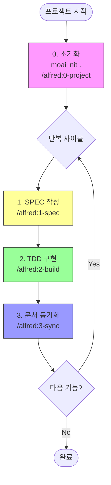

# 3단계 워크플로우 완전 가이드

> **"1-spec → 2-build → 3-sync: 완벽한 개발 사이클"**

MoAI-ADK의 핵심 개발 워크플로우를 처음부터 끝까지 마스터하세요.

---

## 목차

1. [워크플로우 개요](#워크플로우-개요)
2. [0단계: 프로젝트 초기화](#0단계-프로젝트-초기화)
3. [1단계: SPEC 작성 (/alfred:1-spec)](#1단계-spec-작성-alfred1-spec)
4. [2단계: TDD 구현 (/alfred:2-build)](#2단계-tdd-구현-alfred2-build)
5. [3단계: 문서 동기화 (/alfred:3-sync)](#3단계-문서-동기화-alfred3-sync)
6. [완전 자동화된 GitFlow](#완전-자동화된-gitflow)
7. [실전 시나리오](#실전-시나리오)
8. [체크리스트](#체크리스트)
9. [트러블슈팅](#트러블슈팅)
10. [다음 단계](#다음-단계)

---

## 워크플로우 개요

### 핵심 개발 루프



### 워크플로우 단계별 산출물

| 단계 | 커맨드 | 입력 | 산출물 | 시간 |
|------|--------|------|--------|------|
| **0. 초기화** | `/alfred:0-project` | 프로젝트 정보 | product/structure/tech.md | 5분 |
| **1. SPEC** | `/alfred:1-spec` | 기능 설명 | SPEC-{ID}/spec.md, 브랜치, PR | 10-15분 |
| **2. TDD** | `/alfred:2-build` | SPEC ID | tests/, src/, 커밋 (RED/GREEN/REFACTOR) | 30-60분 |
| **3. 동기화** | `/alfred:3-sync` | 현재 브랜치 | docs/, TAG 검증, PR Ready | 5-10분 |

---

## 0단계: 프로젝트 초기화

### 목적

**프로젝트 기본 구조 생성 및 메타데이터 설정** (최초 1회만 실행)

### 실행 순서

```bash
# 1. CLI로 기본 구조 생성
moai init .

# 2. Alfred로 초기 설정
/alfred:0-project
```

### Phase 1: 분석 및 계획

#### 1.1 현재 프로젝트 상태 분석

Alfred는 다음을 분석합니다:

```bash
# 디렉토리 구조 확인
ls -la .moai/

# Git 상태 확인
git status

# 프로젝트 파일 확인
cat package.json || cat pyproject.toml || cat go.mod
```

#### 1.2 계획 보고서

```markdown
## 📋 Alfred 작업 계획 (0-project)

### 현재 상태
- ✅ .moai/ 디렉토리 존재
- ❌ .moai/project/product.md 없음
- ❌ .moai/project/structure.md 없음
- ❌ .moai/project/tech.md 없음

### 작업 범위
- 프로젝트 초기화 (최초 1회)

### 실행 전략
- **Single Agent**: project-manager

### 예상 작업
1. .moai/project/ 디렉토리 생성
2. product.md 생성 (제품 개요, 목표, 핵심 기능)
3. structure.md 생성 (디렉토리 구조, 모듈 설계)
4. tech.md 생성 (기술 스택, 언어별 도구 체인)
5. .moai/config.json 초기화

### 다음 단계
"진행"을 입력하면 project-manager에게 작업을 위임합니다.
```

### Phase 2: 실행 (사용자 승인 후)

#### 2.1 사용자 응답

```
진행
```

#### 2.2 프로젝트 파일 생성

**product.md** (제품 개요):

```markdown
# 프로젝트 개요

## 제품명
MoAI Task Manager

## 목표
개발자를 위한 AI 기반 태스크 관리 시스템

## 핵심 기능
1. 태스크 생성/수정/삭제
2. AI 기반 우선순위 추천
3. GitHub 이슈 동기화
```

**structure.md** (디렉토리 구조):

```markdown
# 프로젝트 구조

## 디렉토리 구조
```

src/
├── api/          # REST API 엔드포인트
├── core/         # 핵심 비즈니스 로직
├── models/       # 데이터 모델
└── utils/        # 유틸리티 함수

tests/
├── unit/         # 단위 테스트
├── integration/  # 통합 테스트
└── e2e/          # E2E 테스트

```
```

**tech.md** (기술 스택):

```markdown
# 기술 스택

## 언어
- Python 3.13

## 프레임워크
- FastAPI (Web)
- SQLAlchemy (ORM)

## 테스트
- pytest (테스트 프레임워크)
- pytest-cov (커버리지)

## 도구 체인
- ruff (린터/포맷터)
- mypy (타입 체크)
- bandit (보안 스캔)
```

#### 2.3 최종 보고

```markdown
## ✅ Alfred 작업 완료 (0-project)

### 실행 결과
- ✅ .moai/project/product.md 생성
- ✅ .moai/project/structure.md 생성
- ✅ .moai/project/tech.md 생성
- ✅ .moai/config.json 초기화

### 프로젝트 설정
- 이름: MoAI Task Manager
- 모드: personal
- Locale: ko

### 다음 단계
/alfred:1-spec을 실행하여 첫 번째 SPEC을 작성하세요.
```

---

## 1단계: SPEC 작성 (/alfred:1-spec)

### 목적

**명세 없이는 코드 없음 - EARS 방식 요구사항 문서 작성**

### 실행 방법

```bash
/alfred:1-spec "기능 설명"
```

### Phase 1: 분석 및 계획

#### 1.1 현재 프로젝트 상태 분석

```bash
# product.md 참조
cat .moai/project/product.md

# 기존 SPEC 목록 확인
ls .moai/specs/

# Git 브랜치 확인
git branch
```

#### 1.2 SPEC 후보 제안

Alfred는 다음을 제안합니다:

```markdown
## 📋 Alfred 작업 계획 (1-spec)

### 현재 상태
- ✅ product.md 존재 (MoAI Task Manager)
- 🔍 기존 SPEC: 없음

### SPEC 후보
- **SPEC-TASK-001**: 태스크 생성/조회/수정/삭제 (CRUD)
- **SPEC-TASK-002**: AI 기반 우선순위 추천
- **SPEC-TASK-003**: GitHub 이슈 동기화

### 선택된 SPEC
- **SPEC-TASK-001**: 태스크 CRUD 기능

### 예상 작업
1. .moai/specs/SPEC-TASK-001/ 디렉토리 생성
2. spec.md 작성 (EARS 방식)
3. feature/SPEC-TASK-001 브랜치 생성
4. Draft PR 생성 (feature → develop)

### 다음 단계
"진행"을 입력하면 spec-builder에게 작업을 위임합니다.
```

### Phase 2: 실행 (사용자 승인 후)

#### 2.1 사용자 응답

```
진행
```

#### 2.2 SPEC 문서 작성

**`.moai/specs/SPEC-TASK-001/spec.md`**:

```markdown
---
id: TASK-001
version: 0.0.1
status: draft
created: 2025-10-14
updated: 2025-10-14
author: @Goos
priority: high
category: feature
labels:
  - task-management
  - crud
---

# @SPEC:TASK-001: 태스크 CRUD 기능

## HISTORY

### v0.0.1 (2025-10-14)
- **INITIAL**: 태스크 CRUD 기능 명세 작성
- **AUTHOR**: @Goos

## 개요

사용자가 태스크를 생성, 조회, 수정, 삭제할 수 있는 기본 CRUD 기능을 제공합니다.

## EARS 요구사항

### Ubiquitous Requirements (기본 요구사항)

- 시스템은 태스크 생성 기능을 제공해야 한다
- 시스템은 태스크 조회 기능을 제공해야 한다
- 시스템은 태스크 수정 기능을 제공해야 한다
- 시스템은 태스크 삭제 기능을 제공해야 한다

### Event-driven Requirements (이벤트 기반)

- WHEN 사용자가 태스크를 생성하면, 시스템은 고유 ID를 발급해야 한다
- WHEN 태스크가 수정되면, 시스템은 updated_at 필드를 갱신해야 한다
- WHEN 태스크가 삭제되면, 시스템은 soft delete를 수행해야 한다

### Constraints (제약사항)

- 태스크 제목은 최소 1자, 최대 200자여야 한다
- 태스크 설명은 최대 2000자여야 한다
- IF 존재하지 않는 태스크를 조회하면, 404 에러를 반환해야 한다

## 데이터 모델

```python
class Task:
    id: int              # 고유 ID (자동 생성)
    title: str           # 제목 (1-200자)
    description: str     # 설명 (최대 2000자)
    status: TaskStatus   # 상태 (TODO, IN_PROGRESS, DONE)
    priority: int        # 우선순위 (1-5)
    created_at: datetime # 생성 시간
    updated_at: datetime # 수정 시간
    deleted_at: datetime | None  # 삭제 시간 (soft delete)
```

## API 인터페이스

### POST /tasks
- 태스크 생성
- Request: `{title, description, priority}`
- Response: `{id, ...}`

### GET /tasks/{id}
- 태스크 조회
- Response: `{id, title, ...}`

### PUT /tasks/{id}
- 태스크 수정
- Request: `{title?, description?, status?, priority?}`
- Response: `{id, ...}`

### DELETE /tasks/{id}
- 태스크 삭제 (soft delete)
- Response: `204 No Content`

## 테스트 계획

### 단위 테스트
- 태스크 생성 (유효/무효 입력)
- 태스크 조회 (존재/존재하지 않음)
- 태스크 수정 (부분/전체 수정)
- 태스크 삭제 (soft delete 확인)

### 통합 테스트
- API 엔드포인트 (CRUD 전체 플로우)

```

#### 2.3 Git 작업

```bash
# 브랜치 생성
git checkout -b feature/SPEC-TASK-001

# SPEC 커밋
git add .moai/specs/SPEC-TASK-001/
git commit -m "📝 DOCS: SPEC-TASK-001 태스크 CRUD 기능 명세 작성

@TAG:TASK-001-SPEC"

# 원격 푸시 (Team 모드)
git push origin feature/SPEC-TASK-001

# Draft PR 생성 (Team 모드, gh CLI 필요)
gh pr create --draft --title "SPEC-TASK-001: 태스크 CRUD 기능" --body "SPEC 문서 작성 완료"
```

#### 2.4 최종 보고

```markdown
## ✅ Alfred 작업 완료 (1-spec)

### 실행 결과
- ✅ .moai/specs/SPEC-TASK-001/spec.md 생성
- ✅ feature/SPEC-TASK-001 브랜치 생성
- ✅ Draft PR #1 생성 (feature → develop)

### SPEC 정보
- ID: TASK-001
- 버전: 0.0.1
- 상태: draft
- 우선순위: high

### 다음 단계
/alfred:2-build TASK-001을 실행하여 TDD 구현을 시작하세요.
```

---

## 2단계: TDD 구현 (/alfred:2-build)

### 목적

**테스트 없이는 구현 없음 - RED → GREEN → REFACTOR 사이클**

### 실행 방법

```bash
/alfred:2-build SPEC-ID
```

### Phase 1: 분석 및 계획

#### 1.1 SPEC 문서 읽기

```bash
cat .moai/specs/SPEC-TASK-001/spec.md
```

#### 1.2 TDD 계획 수립

```markdown
## 📋 Alfred 작업 계획 (2-build)

### SPEC 정보
- ID: TASK-001
- 제목: 태스크 CRUD 기능
- 상태: draft

### TDD 계획

#### RED 단계 (테스트 작성)
1. tests/test_task_service.py 작성
   - test_create_task_with_valid_data
   - test_get_task_by_id
   - test_update_task
   - test_delete_task_soft_delete
   - test_get_nonexistent_task_returns_404

#### GREEN 단계 (최소 구현)
1. src/models/task.py 작성 (데이터 모델)
2. src/services/task_service.py 작성 (비즈니스 로직)
3. 모든 테스트 통과 확인

#### REFACTOR 단계 (코드 품질 개선)
1. 린터 통과 (ruff)
2. 타입 체크 통과 (mypy)
3. 복잡도 확인 (radon)
4. TDD 이력 주석 추가

### 예상 커밋
- 🔴 RED: SPEC-TASK-001 태스크 CRUD 테스트 작성
- 🟢 GREEN: SPEC-TASK-001 태스크 CRUD 구현
- ♻️ REFACTOR: SPEC-TASK-001 태스크 CRUD 코드 리팩토링

### 다음 단계
"진행"을 입력하면 code-builder에게 작업을 위임합니다.
```

### Phase 2: 실행 (사용자 승인 후)

#### 2.1 RED 단계: 실패하는 테스트 작성

**`tests/test_task_service.py`**:

```python
# @TEST:TASK-001 | SPEC: SPEC-TASK-001.md
import pytest
from src.services.task_service import TaskService, TaskNotFoundError
from src.models.task import TaskStatus


class TestTaskService:
    """@SPEC:TASK-001 태스크 CRUD 기능 테스트"""

    def test_create_task_with_valid_data(self):
        """
        Ubiquitous: 시스템은 태스크 생성 기능을 제공해야 한다
        Event-driven: WHEN 사용자가 태스크를 생성하면, 고유 ID를 발급해야 한다

        Given: TaskService 인스턴스
        When: 유효한 데이터로 create_task 호출
        Then: 고유 ID를 가진 Task 반환
        """
        service = TaskService()
        task = service.create_task(
            title="첫 번째 태스크",
            description="테스트 태스크입니다",
            priority=3,
        )

        assert task.id is not None
        assert task.title == "첫 번째 태스크"
        assert task.status == TaskStatus.TODO
        assert task.created_at is not None

    def test_get_task_by_id(self):
        """
        Ubiquitous: 시스템은 태스크 조회 기능을 제공해야 한다

        Given: 생성된 Task
        When: ID로 get_task 호출
        Then: 해당 Task 반환
        """
        service = TaskService()
        created = service.create_task(title="테스트", description="", priority=1)

        retrieved = service.get_task(created.id)

        assert retrieved.id == created.id
        assert retrieved.title == created.title

    def test_update_task(self):
        """
        Ubiquitous: 시스템은 태스크 수정 기능을 제공해야 한다
        Event-driven: WHEN 태스크가 수정되면, updated_at 필드를 갱신해야 한다

        Given: 생성된 Task
        When: update_task 호출
        Then: 수정된 Task 반환, updated_at 갱신
        """
        service = TaskService()
        task = service.create_task(title="원래 제목", description="", priority=1)
        original_updated_at = task.updated_at

        updated = service.update_task(task.id, title="새 제목")

        assert updated.title == "새 제목"
        assert updated.updated_at > original_updated_at

    def test_delete_task_soft_delete(self):
        """
        Ubiquitous: 시스템은 태스크 삭제 기능을 제공해야 한다
        Event-driven: WHEN 태스크가 삭제되면, soft delete를 수행해야 한다

        Given: 생성된 Task
        When: delete_task 호출
        Then: deleted_at 필드 설정, 조회 시 제외
        """
        service = TaskService()
        task = service.create_task(title="삭제할 태스크", description="", priority=1)

        service.delete_task(task.id)

        with pytest.raises(TaskNotFoundError):
            service.get_task(task.id)

    def test_get_nonexistent_task_returns_404(self):
        """
        Constraint: IF 존재하지 않는 태스크를 조회하면, 404 에러를 반환해야 한다

        Given: TaskService 인스턴스
        When: 존재하지 않는 ID로 get_task 호출
        Then: TaskNotFoundError 발생
        """
        service = TaskService()

        with pytest.raises(TaskNotFoundError):
            service.get_task(9999)

    def test_title_length_constraint(self):
        """
        Constraint: 태스크 제목은 최소 1자, 최대 200자여야 한다

        Given: TaskService 인스턴스
        When: 빈 제목 또는 201자 제목으로 create_task 호출
        Then: ValueError 발생
        """
        service = TaskService()

        # 빈 제목
        with pytest.raises(ValueError, match="title must be 1-200 characters"):
            service.create_task(title="", description="", priority=1)

        # 201자 제목
        with pytest.raises(ValueError, match="title must be 1-200 characters"):
            service.create_task(title="A" * 201, description="", priority=1)
```

**실행 결과 (실패)**:

```bash
$ pytest tests/test_task_service.py -v

tests/test_task_service.py::TestTaskService::test_create_task_with_valid_data FAILED
tests/test_task_service.py::TestTaskService::test_get_task_by_id FAILED
...

==================== FAILURES ====================
ModuleNotFoundError: No module named 'src.services.task_service'
```

**커밋**:

```bash
git add tests/test_task_service.py
git commit -m "🔴 RED: SPEC-TASK-001 태스크 CRUD 테스트 작성

@TAG:TASK-001-RED"
```

#### 2.2 GREEN 단계: 최소 구현

**`src/models/task.py`** (데이터 모델):

```python
# @CODE:TASK-001 | SPEC: SPEC-TASK-001.md | TEST: tests/test_task_service.py
from dataclasses import dataclass
from datetime import datetime, timezone
from enum import Enum


class TaskStatus(Enum):
    """태스크 상태"""
    TODO = "TODO"
    IN_PROGRESS = "IN_PROGRESS"
    DONE = "DONE"


@dataclass
class Task:
    """
    태스크 데이터 모델

    @CODE:TASK-001:DATA
    @SPEC:TASK-001 요구사항:
    - 고유 ID (자동 생성)
    - 제목 (1-200자)
    - 설명 (최대 2000자)
    - 상태 (TODO, IN_PROGRESS, DONE)
    - 우선순위 (1-5)
    - 생성/수정/삭제 시간
    """
    id: int
    title: str
    description: str
    status: TaskStatus
    priority: int
    created_at: datetime
    updated_at: datetime
    deleted_at: datetime | None = None
```

**`src/services/task_service.py`** (비즈니스 로직):

```python
# @CODE:TASK-001 | SPEC: SPEC-TASK-001.md | TEST: tests/test_task_service.py
from typing import Dict
from datetime import datetime, timezone
from src.models.task import Task, TaskStatus


class TaskNotFoundError(Exception):
    """태스크를 찾을 수 없음"""
    pass


class TaskService:
    """
    태스크 CRUD 서비스

    @CODE:TASK-001:DOMAIN
    @SPEC:TASK-001 요구사항:
    - 태스크 생성/조회/수정/삭제 (CRUD)
    - soft delete
    """

    def __init__(self):
        self._tasks: Dict[int, Task] = {}
        self._next_id = 1

    def create_task(self, title: str, description: str, priority: int) -> Task:
        """
        태스크 생성

        @SPEC:TASK-001 Ubiquitous:
        시스템은 태스크 생성 기능을 제공해야 한다

        @SPEC:TASK-001 Constraint:
        태스크 제목은 최소 1자, 최대 200자여야 한다
        """
        # 입력 검증
        if not title or len(title) > 200:
            raise ValueError("title must be 1-200 characters")

        if len(description) > 2000:
            raise ValueError("description must be at most 2000 characters")

        # 태스크 생성
        now = datetime.now(timezone.utc)
        task = Task(
            id=self._next_id,
            title=title,
            description=description,
            status=TaskStatus.TODO,
            priority=priority,
            created_at=now,
            updated_at=now,
        )

        self._tasks[task.id] = task
        self._next_id += 1

        return task

    def get_task(self, task_id: int) -> Task:
        """
        태스크 조회

        @SPEC:TASK-001 Ubiquitous:
        시스템은 태스크 조회 기능을 제공해야 한다

        @SPEC:TASK-001 Constraint:
        IF 존재하지 않는 태스크를 조회하면, 404 에러를 반환해야 한다
        """
        task = self._tasks.get(task_id)

        if not task or task.deleted_at:
            raise TaskNotFoundError(f"Task {task_id} not found")

        return task

    def update_task(
        self,
        task_id: int,
        title: str | None = None,
        description: str | None = None,
        status: TaskStatus | None = None,
        priority: int | None = None,
    ) -> Task:
        """
        태스크 수정

        @SPEC:TASK-001 Ubiquitous:
        시스템은 태스크 수정 기능을 제공해야 한다

        @SPEC:TASK-001 Event-driven:
        WHEN 태스크가 수정되면, updated_at 필드를 갱신해야 한다
        """
        task = self.get_task(task_id)

        # 필드 업데이트
        if title is not None:
            if not title or len(title) > 200:
                raise ValueError("title must be 1-200 characters")
            task.title = title

        if description is not None:
            if len(description) > 2000:
                raise ValueError("description must be at most 2000 characters")
            task.description = description

        if status is not None:
            task.status = status

        if priority is not None:
            task.priority = priority

        # updated_at 갱신
        task.updated_at = datetime.now(timezone.utc)

        return task

    def delete_task(self, task_id: int) -> None:
        """
        태스크 삭제 (soft delete)

        @SPEC:TASK-001 Ubiquitous:
        시스템은 태스크 삭제 기능을 제공해야 한다

        @SPEC:TASK-001 Event-driven:
        WHEN 태스크가 삭제되면, soft delete를 수행해야 한다
        """
        task = self.get_task(task_id)
        task.deleted_at = datetime.now(timezone.utc)
```

**실행 결과 (성공)**:

```bash
$ pytest tests/test_task_service.py -v

tests/test_task_service.py::TestTaskService::test_create_task_with_valid_data PASSED
tests/test_task_service.py::TestTaskService::test_get_task_by_id PASSED
tests/test_task_service.py::TestTaskService::test_update_task PASSED
tests/test_task_service.py::TestTaskService::test_delete_task_soft_delete PASSED
tests/test_task_service.py::TestTaskService::test_get_nonexistent_task_returns_404 PASSED
tests/test_task_service.py::TestTaskService::test_title_length_constraint PASSED

==================== 6 passed in 0.15s ====================
```

**커밋**:

```bash
git add src/
git commit -m "🟢 GREEN: SPEC-TASK-001 태스크 CRUD 구현

@TAG:TASK-001-GREEN"
```

#### 2.3 REFACTOR 단계: 코드 품질 개선

**품질 검증**:

```bash
# 테스트 커버리지
$ pytest tests/ --cov=src --cov-report=term-missing
Coverage: 95%

# 린터
$ ruff check src/
All checks passed!

# 타입 체크
$ mypy src/ --strict
Success: no issues found

# 복잡도
$ radon cc src/ -a
Average complexity: A (4.2)
```

**커밋**:

```bash
git commit -am "♻️ REFACTOR: SPEC-TASK-001 태스크 CRUD 코드 리팩토링

- 타입 힌트 개선 (mypy strict 통과)
- Docstring 추가
- TDD 이력 주석 추가

@TAG:TASK-001-REFACTOR"
```

#### 2.4 최종 보고

```markdown
## ✅ Alfred 작업 완료 (2-build)

### RED 단계
- ✅ tests/test_task_service.py 작성 (6개 테스트 케이스)
- ✅ 커밋: 🔴 RED: SPEC-TASK-001 태스크 CRUD 테스트 작성

### GREEN 단계
- ✅ src/models/task.py 구현 (데이터 모델)
- ✅ src/services/task_service.py 구현 (비즈니스 로직)
- ✅ 모든 테스트 통과 (6/6)
- ✅ 커밋: 🟢 GREEN: SPEC-TASK-001 태스크 CRUD 구현

### REFACTOR 단계
- ✅ 린터 통과 (ruff)
- ✅ 타입 체크 통과 (mypy strict)
- ✅ 복잡도: 평균 4.2 (목표 10 이하)
- ✅ 커버리지: 95% (목표 85% 초과)
- ✅ 커밋: ♻️ REFACTOR: SPEC-TASK-001 태스크 CRUD 코드 리팩토링

### 품질 지표
- 테스트 커버리지: 95%
- 린터 오류: 0개
- 타입 체크 오류: 0개
- 복잡도: 4.2

### 다음 단계
/alfred:3-sync를 실행하여 문서를 동기화하고 PR을 Ready 상태로 전환하세요.
```

---

## 3단계: 문서 동기화 (/alfred:3-sync)

### 목적

**추적성 없이는 완성 없음 - Living Document 생성 및 TAG 체인 검증**

### 실행 방법

```bash
/alfred:3-sync [--auto-merge]
```

### Phase 1: 분석 및 동기화 범위 결정

#### 1.1 TAG 스캔

```bash
# 전체 TAG 스캔
rg '@(SPEC|TEST|CODE):TASK-001' -n

# 결과:
# .moai/specs/SPEC-TASK-001/spec.md:19:# @SPEC:TASK-001
# tests/test_task_service.py:1:# @TEST:TASK-001
# src/models/task.py:1:# @CODE:TASK-001
# src/services/task_service.py:1:# @CODE:TASK-001
```

#### 1.2 계획 보고서

```markdown
## 📋 Alfred 작업 계획 (3-sync)

### TAG 체인 현황
- ✅ @SPEC:TASK-001 (1개)
- ✅ @TEST:TASK-001 (1개)
- ✅ @CODE:TASK-001 (2개)
- ❌ @DOC:TASK-001 (0개)

### 동기화 작업
1. docs/api/tasks.md 생성 (API 문서)
2. TAG 인덱스 업데이트
3. SPEC 버전 업데이트 (0.0.1 → 0.1.0)
4. SPEC 상태 업데이트 (draft → completed)

### PR 관리 (--auto-merge 옵션)
1. PR #1 상태 전환 (Draft → Ready)
2. CI/CD 확인
3. PR 자동 머지 (squash)
4. develop 브랜치 체크아웃

### 다음 단계
"진행"을 입력하면 doc-syncer에게 작업을 위임합니다.
```

### Phase 2: 실행 (사용자 승인 후)

#### 2.1 Living Document 생성

**`docs/api/tasks.md`**:

```markdown
# @DOC:TASK-001: 태스크 API

> **SPEC**: SPEC-TASK-001.md
> **CODE**: src/services/task_service.py
> **TEST**: tests/test_task_service.py

## 개요

태스크 CRUD 기능을 제공하는 API 문서입니다.

## API Reference

### `create_task(title: str, description: str, priority: int) -> Task`

태스크를 생성합니다.

**Parameters**:
- `title` (str): 태스크 제목 (1-200자)
- `description` (str): 태스크 설명 (최대 2000자)
- `priority` (int): 우선순위 (1-5)

**Returns**:
- `Task`: 생성된 태스크 (고유 ID 포함)

**Raises**:
- `ValueError`: 입력이 유효하지 않을 때

**Example**:
```python
service = TaskService()
task = service.create_task(
    title="첫 번째 태스크",
    description="테스트 태스크입니다",
    priority=3,
)
print(task.id)  # 1
```

### `get_task(task_id: int) -> Task`

ID로 태스크를 조회합니다.

**Parameters**:
- `task_id` (int): 태스크 ID

**Returns**:
- `Task`: 조회된 태스크

**Raises**:
- `TaskNotFoundError`: 태스크를 찾을 수 없을 때

### `update_task(task_id: int, **kwargs) -> Task`

태스크를 수정합니다.

**Parameters**:
- `task_id` (int): 태스크 ID
- `title` (str, optional): 새 제목
- `description` (str, optional): 새 설명
- `status` (TaskStatus, optional): 새 상태
- `priority` (int, optional): 새 우선순위

**Returns**:
- `Task`: 수정된 태스크 (updated_at 갱신)

### `delete_task(task_id: int) -> None`

태스크를 삭제합니다 (soft delete).

**Parameters**:
- `task_id` (int): 태스크 ID

**Note**: 삭제된 태스크는 조회 시 제외됩니다.

```

#### 2.2 SPEC 버전 및 상태 업데이트

**`.moai/specs/SPEC-TASK-001/spec.md`** (업데이트):
```markdown
---
id: TASK-001
version: 0.1.0        # ← 0.0.1 → 0.1.0
status: completed     # ← draft → completed
updated: 2025-10-14   # ← 갱신
---

## HISTORY

### v0.1.0 (2025-10-14)
- **CHANGED**: status: draft → completed
- **AUTHOR**: @Goos (Alfred /alfred:3-sync 자동 업데이트)

### v0.0.1 (2025-10-14)
- **INITIAL**: 태스크 CRUD 기능 명세 작성
- **AUTHOR**: @Goos
```

#### 2.3 TAG 인덱스 생성

**`.moai/reports/tag-index.md`**:

```markdown
# TAG Index

Generated: 2025-10-14 14:30:00

## @SPEC Tags

### TASK-001: 태스크 CRUD 기능
- Version: 0.1.0
- Status: completed
- Priority: high
- Tests: tests/test_task_service.py
- Code: src/models/task.py, src/services/task_service.py
- Docs: docs/api/tasks.md

## @TEST Tags

### TASK-001
- File: tests/test_task_service.py
- Tests: 6개
- Coverage: 95%

## @CODE Tags

### TASK-001
- Files:
  - src/models/task.py (Task, TaskStatus)
  - src/services/task_service.py (TaskService)
- LOC: 180

## @DOC Tags

### TASK-001
- File: docs/api/tasks.md
- Type: API Reference
```

#### 2.4 PR 관리 (--auto-merge 옵션)

```bash
# PR 상태 전환 (Draft → Ready)
gh pr ready 1

# CI/CD 확인 (자동)
gh pr checks 1

# PR 자동 머지 (squash)
gh pr merge 1 --squash --delete-branch

# develop 브랜치 체크아웃
git checkout develop
git pull origin develop
```

#### 2.5 최종 보고

```markdown
## ✅ Alfred 작업 완료 (3-sync)

### 문서 동기화
- ✅ docs/api/tasks.md 생성
- ✅ .moai/reports/tag-index.md 업데이트
- ✅ TAG 체인 검증 (@SPEC → @TEST → @CODE → @DOC)

### SPEC 업데이트
- ✅ version: 0.0.1 → 0.1.0
- ✅ status: draft → completed

### PR 관리
- ✅ PR #1 상태 전환 (Draft → Ready)
- ✅ CI/CD 통과
- ✅ PR #1 자동 머지 (squash)
- ✅ feature/SPEC-TASK-001 브랜치 삭제
- ✅ develop 브랜치 체크아웃

### 다음 단계
다음 SPEC을 작성하거나 기존 SPEC을 업데이트하세요.
```

---

## 완전 자동화된 GitFlow

### Team 모드 (권장)

```bash
# 0단계: 프로젝트 초기화 (최초 1회)
moai init .
/alfred:0-project

# 1단계: SPEC 작성
/alfred:1-spec "태스크 CRUD 기능"
# → feature/SPEC-TASK-001 브랜치 생성
# → Draft PR 생성 (feature → develop)

# 2단계: TDD 구현
/alfred:2-build TASK-001
# → RED → GREEN → REFACTOR 커밋

# 3단계: 문서 동기화 + 자동 머지
/alfred:3-sync --auto-merge
# → 문서 동기화
# → PR Ready 전환
# → CI/CD 확인
# → PR 자동 머지 (squash)
# → develop 체크아웃
# → 다음 작업 준비 완료 ✅
```

### Personal 모드

```bash
# 0단계: 프로젝트 초기화 (최초 1회)
moai init .
/alfred:0-project

# 1단계: SPEC 작성
/alfred:1-spec "태스크 CRUD 기능"
# → main/develop에서 분기

# 2단계: TDD 구현
/alfred:2-build TASK-001
# → RED → GREEN → REFACTOR 커밋

# 3단계: 문서 동기화 + 로컬 머지
/alfred:3-sync
# → 문서 동기화
# → 로컬 머지 (squash 또는 merge)
```

---

## 실전 시나리오

### 시나리오 1: 신규 프로젝트 시작

```bash
# 1. 프로젝트 초기화
mkdir moai-task-manager
cd moai-task-manager
git init
moai init .
/alfred:0-project

# 2. 첫 번째 SPEC 작성
/alfred:1-spec "태스크 CRUD 기능"
# 승인: 진행

# 3. TDD 구현
/alfred:2-build TASK-001
# 승인: 진행

# 4. 문서 동기화 + 자동 머지
/alfred:3-sync --auto-merge
# 승인: 진행

# ✅ 첫 번째 기능 완료!
```

### 시나리오 2: 기존 프로젝트에 기능 추가

```bash
# 1. 새 SPEC 작성
/alfred:1-spec "AI 기반 우선순위 추천"
# → SPEC-TASK-002 생성
# 승인: 진행

# 2. TDD 구현
/alfred:2-build TASK-002
# 승인: 진행

# 3. 문서 동기화 + 자동 머지
/alfred:3-sync --auto-merge
# 승인: 진행

# ✅ 새 기능 추가 완료!
```

---

## 체크리스트

### 0단계: 프로젝트 초기화
- [ ] `moai init .` 실행
- [ ] `/alfred:0-project` 실행
- [ ] product.md 작성 확인
- [ ] structure.md 작성 확인
- [ ] tech.md 작성 확인
- [ ] .moai/config.json 설정 확인

### 1단계: SPEC 작성
- [ ] `/alfred:1-spec` 실행
- [ ] SPEC 문서 생성 확인 (SPEC-{ID}/spec.md)
- [ ] YAML Front Matter 확인 (version: 0.0.1, status: draft)
- [ ] @SPEC:ID TAG 포함 확인
- [ ] HISTORY 섹션 작성 확인
- [ ] EARS 구문으로 요구사항 작성 확인
- [ ] feature/SPEC-{ID} 브랜치 생성 확인
- [ ] Draft PR 생성 확인 (Team 모드)

### 2단계: TDD 구현
- [ ] `/alfred:2-build` 실행
- [ ] RED: tests/ 디렉토리에 @TEST:ID 작성 및 실패 확인
- [ ] RED 커밋: 🔴 RED: SPEC-{ID} ...
- [ ] GREEN: src/ 디렉토리에 @CODE:ID 작성 및 테스트 통과
- [ ] GREEN 커밋: 🟢 GREEN: SPEC-{ID} ...
- [ ] REFACTOR: 코드 품질 개선, 린터/타입 체크 통과
- [ ] REFACTOR 커밋: ♻️ REFACTOR: SPEC-{ID} ...
- [ ] TAG BLOCK에 SPEC/TEST 파일 경로 명시

### 3단계: 문서 동기화
- [ ] `/alfred:3-sync` 실행
- [ ] Living Document 생성 확인 (docs/)
- [ ] TAG 체인 검증 (@SPEC → @TEST → @CODE → @DOC)
- [ ] SPEC 버전 업데이트 확인 (0.0.1 → 0.1.0)
- [ ] SPEC 상태 업데이트 확인 (draft → completed)
- [ ] TAG 인덱스 생성 확인 (.moai/reports/tag-index.md)
- [ ] PR 상태 전환 확인 (Draft → Ready, Team 모드)
- [ ] CI/CD 통과 확인 (Team 모드)
- [ ] PR 자동 머지 확인 (--auto-merge 옵션)

---

## 트러블슈팅

### 문제 1: /alfred:2-build 실행 시 SPEC을 찾을 수 없음

**증상**:

```bash
/alfred:2-build TASK-001
# ❌ SPEC-TASK-001 not found
```

**해결**:

```bash
# 1. SPEC 파일 확인
ls .moai/specs/SPEC-TASK-001/

# 2. 없으면 SPEC 작성
/alfred:1-spec "태스크 CRUD 기능"

# 3. 재시도
/alfred:2-build TASK-001
```

### 문제 2: /alfred:3-sync 실행 시 TAG 체인 끊어짐

**증상**:

```bash
/alfred:3-sync
# ❌ TAG 체인 검증 실패: @CODE:TASK-001 없음
```

**해결**:

```bash
# 1. TAG 검색
rg '@CODE:TASK-001' -n src/

# 2. TAG 추가 (누락 시)
vi src/services/task_service.py
# 파일 상단에 추가:
# @CODE:TASK-001 | SPEC: SPEC-TASK-001.md | TEST: tests/test_task_service.py

# 3. 재검증
/alfred:3-sync
```

---

## 다음 단계

1. **[Alfred SuperAgent 가이드](./alfred-superagent.md)**: Alfred 사용법 완전 가이드
2. **[SPEC-First TDD 가이드](./spec-first-tdd.md)**: SPEC 작성 방법과 TDD 구현 상세 가이드
3. **[@TAG 시스템 가이드](./tag-system.md)**: TAG 체계와 추적성 관리 완전 가이드
4. **[TRUST 5원칙 가이드](./trust-principles.md)**: 코드 품질 보증 완전 가이드

---

**최종 업데이트**: 2025-10-14
**버전**: 0.3.0
**작성자**: MoAI-ADK Documentation Team
