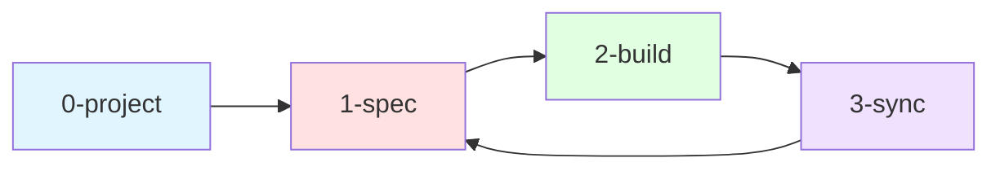

# Workflow Overview

MoAI-ADK의 완전 자동화된 개발 워크플로우를 소개합니다.

## Alfred Workflow Commands

Alfred는 10개의 워크플로우 커맨드를 제공합니다. 각 커맨드는 독립적으로 실행 가능하며, 순차적으로 실행하면 완전한 개발 사이클을 완성합니다.

### 핵심 워크플로우 (0-3)

| 커맨드 | 설명 | 목적 |
|--------|------|------|
| **[/alfred:0-project](/guides/workflow/0-project)** | 프로젝트 초기화 | product/structure/tech.md 생성 |
| **[/alfred:1-spec](/guides/workflow/1-spec)** | SPEC 작성 | EARS 방식 요구사항 명세 |
| **[/alfred:2-build](/guides/workflow/2-build)** | TDD 구현 | RED-GREEN-REFACTOR 사이클 |
| **[/alfred:3-sync](/guides/workflow/3-sync)** | 문서 동기화 | Living Document 생성, TAG 검증 |

### 유지보수 커맨드 (9)

| 커맨드 | 설명 | 목적 |
|--------|------|------|
| **[/alfred:9-update](/guides/workflow/9-update)** | 패키지 업데이트 | 템플릿 및 패키지 최신화 |

---

## Complete Development Cycle



### Stage 0: 프로젝트 초기화

```bash
/alfred:0-project
```

**목적**: 프로젝트 기본 정보 설정

- `.moai/project/product.md` - 제품 개요
- `.moai/project/structure.md` - 프로젝트 구조
- `.moai/project/tech.md` - 기술 스택

**실행 시점**: 프로젝트 시작 시 1회

---

### Stage 1: SPEC 작성

```bash
/alfred:1-spec "기능 설명"
```

**목적**: 명세 없이는 코드 없음

- EARS 방식 요구사항 작성
- Git 브랜치 생성 (`feature/SPEC-{ID}`)
- Draft PR 생성 (Team 모드)

**출력**: `.moai/specs/SPEC-{ID}/spec.md`

---

### Stage 2: TDD 구현

```bash
/alfred:2-build SPEC-ID
```

**목적**: 테스트 없이는 구현 없음

- **RED**: 실패하는 테스트 작성 (`@TEST:ID`)
- **GREEN**: 최소 구현 (`@CODE:ID`)
- **REFACTOR**: 품질 개선

**출력**: `tests/*.test.ts`, `src/*.ts`

---

### Stage 3: 문서 동기화

```bash
/alfred:3-sync
```

**목적**: 추적성 없이는 완성 없음

- Living Document 자동 생성
- TAG 체인 검증 (`@SPEC → @TEST → @CODE → @DOC`)
- PR Ready 전환 (Team 모드)

**출력**: `.moai/reports/sync-report-*.md`

---

### Stage 9: 패키지 업데이트

```bash
/alfred:9-update
```

**목적**: 안전한 업데이트, 완벽한 복원

- 자동 백업 생성
- 패키지 및 템플릿 업데이트
- 무결성 검증

**실행 시점**: 새 버전 출시 시

---

## Workflow Patterns

### Pattern 1: 새 기능 개발

```bash
# 1. SPEC 작성
/alfred:1-spec "사용자 로그인"

# 2. TDD 구현
/alfred:2-build AUTH-001

# 3. 문서 동기화
/alfred:3-sync
```

### Pattern 2: 프로젝트 시작

```bash
# 1. 프로젝트 초기화
/alfred:0-project

# 2. 첫 SPEC 작성
/alfred:1-spec "첫 기능"

# 3. TDD 구현
/alfred:2-build XXX-001

# 4. 문서 동기화
/alfred:3-sync
```

### Pattern 3: 반복 개발

```bash
# 반복: 1-spec → 2-build → 3-sync
/alfred:1-spec "기능 2"
/alfred:2-build XXX-002
/alfred:3-sync

/alfred:1-spec "기능 3"
/alfred:2-build XXX-003
/alfred:3-sync
```

---

## Command Reference

### 필수 워크플로우

- **[0-project](/guides/workflow/0-project)**: 프로젝트 초기화
- **[1-spec](/guides/workflow/1-spec)**: SPEC 작성
- **[2-build](/guides/workflow/2-build)**: TDD 구현
- **[3-sync](/guides/workflow/3-sync)**: 문서 동기화

### 유지보수

- **[9-update](/guides/workflow/9-update)**: 패키지 업데이트

---

## Best Practices

### 1. 항상 SPEC 우선

```bash
# ✅ Good
/alfred:1-spec → /alfred:2-build → /alfred:3-sync

# ❌ Bad
직접 코드 작성 (SPEC 없이)
```

### 2. TDD 사이클 준수

```bash
# ✅ Good
RED (테스트 작성) → GREEN (구현) → REFACTOR (개선)

# ❌ Bad
구현 먼저 → 테스트 나중에
```

### 3. 동기화 자주 실행

```bash
# ✅ Good
매 SPEC 완료 후 /alfred:3-sync

# ❌ Bad
여러 SPEC 누적 후 한 번에 동기화
```

---

## Next Steps

- **[0-project](/guides/workflow/0-project)** - 프로젝트 초기화 상세 가이드
- **[1-spec](/guides/workflow/1-spec)** - SPEC 작성 가이드
- **[2-build](/guides/workflow/2-build)** - TDD 구현 가이드
- **[3-sync](/guides/workflow/3-sync)** - 문서 동기화 가이드
- **[9-update](/guides/workflow/9-update)** - 패키지 업데이트 가이드

---

<div style="text-align: center; margin-top: 40px;">
  <p><strong>Alfred와 함께하는 완전 자동화 개발</strong> 🤖</p>
  <p>SPEC-First TDD로 완벽한 품질을 만드세요!</p>
</div>
