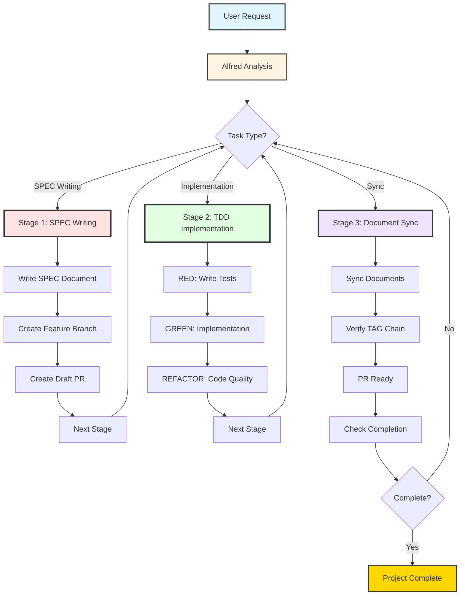
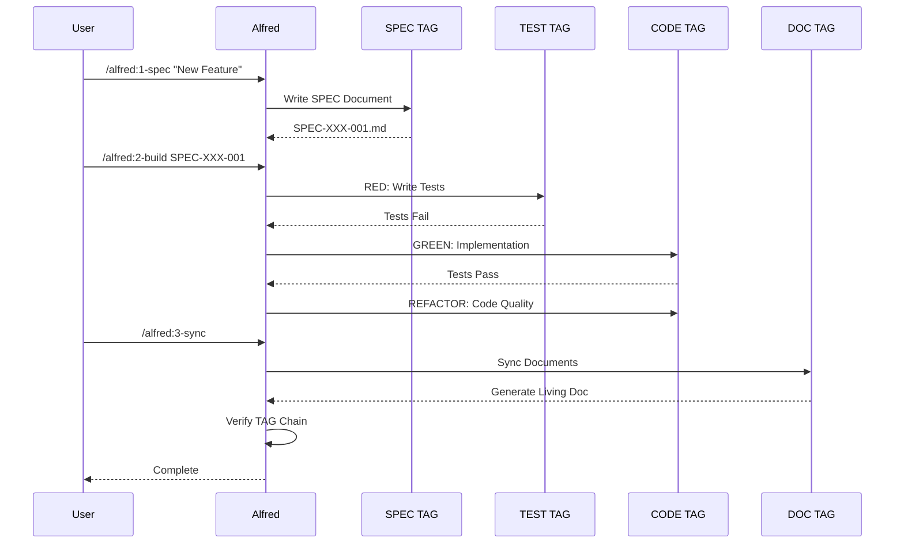

## Quick Start

### Installation

::: code-group

```bash [npm]
npm install -g moai-adk
```

```bash [pnpm]
pnpm add -g moai-adk
```

```bash [bun]
bun add -g moai-adk
```

```bash [yarn]
yarn global add moai-adk
```

:::

### Initialize Project

```bash
# Initialize MoAI-ADK project
moai init .

# Run system diagnostics
moai doctor

# Check project status
moai status
```

---

## 3-Stage Development Workflow

MoAI-ADK의 핵심 개발 사이클을 Mermaid 차트로 시각화했습니다:



### Stage 1: SPEC Writing (`/alfred:1-spec`)

**목적**: 명세 없이는 코드 없음. EARS 방식으로 체계적인 요구사항을 작성합니다.

**주요 작업**:
- **SPEC 문서 작성**: `.moai/specs/SPEC-{ID}/spec.md` 생성
  - YAML Front Matter (id, version, status, author, priority)
  - EARS 구문 (Ubiquitous, Event-driven, State-driven, Optional, Constraints)
  - `@SPEC:ID` TAG 추가
- **브랜치 생성**: `feature/SPEC-{ID}` 자동 생성 (develop 기반)
- **Draft PR 생성**: 초기 PR 생성으로 코드 리뷰 준비

**출력**: `.moai/specs/SPEC-{ID}/spec.md` + Feature Branch + Draft PR

---

### Stage 2: TDD Implementation (`/alfred:2-build`)

**목적**: 테스트 없이는 구현 없음. RED-GREEN-REFACTOR 사이클로 품질을 보장합니다.

**주요 작업**:
- **RED (실패하는 테스트)**:
  - `tests/` 디렉토리에 `@TEST:ID` 작성
  - SPEC 요구사항 기반 테스트 케이스
  - 테스트 실패 확인 (예상된 동작)
- **GREEN (최소 구현)**:
  - `src/` 디렉토리에 `@CODE:ID` 작성
  - 테스트를 통과하는 최소한의 코드
  - SPEC 충족 확인
- **REFACTOR (품질 개선)**:
  - 코드 품질 향상 (가독성, 성능, 구조)
  - TDD 이력 주석 추가
  - 테스트 통과 유지

**출력**: `tests/*.test.ts` + `src/*.ts` (SPEC 충족 + 테스트 통과)

---

### Stage 3: Document Sync (`/alfred:3-sync`)

**목적**: 추적성 없이는 완성 없음. 코드와 문서를 자동 동기화하고 TAG 체인을 검증합니다.

**주요 작업**:
- **문서 동기화**:
  - Living Document 자동 생성
  - API 문서 업데이트
  - README 동기화
- **TAG 체인 검증**:
  - `@SPEC → @TEST → @CODE → @DOC` 연결 확인
  - 고아 TAG 탐지
  - 끊어진 링크 수정
- **PR Ready**:
  - Draft → Ready for Review 전환
  - CI/CD 통과 확인
  - 자동 머지 옵션 (Personal/Team 모드)

**출력**: Living Document + TAG 검증 보고서 + PR Ready

---

## TRUST 5 Principles

MoAI-ADK가 준수하는 5가지 품질 원칙:

```mermaid
graph TB
    TRUST[TRUST 5 Principles]

    TRUST --> Row1[ ]
    TRUST --> Row2[ ]

    Row1 --> T[T: Test First]
    Row1 --> R[R: Readable]
    Row1 --> U[U: Unified]

    Row2 --> S[S: Secured]
    Row2 --> Tr[T: Trackable]

    T --> T1[SPEC-based Testing]
    T --> T2[RED-GREEN-REFACTOR]
    T --> T3[Coverage 85%+]

    R --> R1[Intention-revealing]
    R --> R2[Guard Clauses First]
    R --> R3[Function 50 LOC Max]

    U --> U1[SPEC Architecture]
    U --> U2[Complexity Control]
    U --> U3[Cross-language Trace]

    S --> S1[Security Requirements]
    S --> S2[Input Validation]
    S --> S3[Audit Logging]

    Tr --> Tr1[TAG System]
    Tr --> Tr2[SPEC Traceability]
    Tr --> Tr3[Direct Code Scan]

    style TRUST fill:#ffd700,stroke:#333,stroke-width:3px
    style Row1 fill:none,stroke:none
    style Row2 fill:none,stroke:none
    style T fill:#ffe1e1,stroke:#333,stroke-width:2px
    style R fill:#e1ffe1,stroke:#333,stroke-width:2px
    style U fill:#e1f5ff,stroke:#333,stroke-width:2px
    style S fill:#f0e1ff,stroke:#333,stroke-width:2px
    style Tr fill:#fff4e1,stroke:#333,stroke-width:2px
    style T1 fill:#ffe1e1,stroke:#333,stroke-width:1px
    style T2 fill:#ffe1e1,stroke:#333,stroke-width:1px
    style T3 fill:#ffe1e1,stroke:#333,stroke-width:1px
    style R1 fill:#e1ffe1,stroke:#333,stroke-width:1px
    style R2 fill:#e1ffe1,stroke:#333,stroke-width:1px
    style R3 fill:#e1ffe1,stroke:#333,stroke-width:1px
    style U1 fill:#e1f5ff,stroke:#333,stroke-width:1px
    style U2 fill:#e1f5ff,stroke:#333,stroke-width:1px
    style U3 fill:#e1f5ff,stroke:#333,stroke-width:1px
    style S1 fill:#f0e1ff,stroke:#333,stroke-width:1px
    style S2 fill:#f0e1ff,stroke:#333,stroke-width:1px
    style S3 fill:#f0e1ff,stroke:#333,stroke-width:1px
    style Tr1 fill:#fff4e1,stroke:#333,stroke-width:1px
    style Tr2 fill:#fff4e1,stroke:#333,stroke-width:1px
    style Tr3 fill:#fff4e1,stroke:#333,stroke-width:1px
```



---

## TAG Lifecycle



---

## Alfred Agent Ecosystem

Alfred가 조율하는 9명의 전문 에이전트:

| 에이전트 | 페르소나 | 전문 영역 | 호출 시점 |
|---------|---------|----------|----------|
| 🏗️ **spec-builder** | 시스템 아키텍트 | SPEC 작성, EARS 명세 | 명세 필요 시 |
| 💎 **code-builder** | 수석 개발자 | TDD 구현, 코드 품질 | 구현 단계 |
| 📖 **doc-syncer** | 테크니컬 라이터 | 문서 동기화 | 동기화 필요 시 |
| 🏷️ **tag-agent** | 지식 관리자 | TAG 시스템, 추적성 | TAG 작업 시 |
| 🚀 **git-manager** | 릴리스 엔지니어 | Git 워크플로우 | Git 조작 시 |
| 🔬 **debug-helper** | 트러블슈팅 전문가 | 오류 진단, 해결 | 에러 발생 시 |
| ✅ **trust-checker** | 품질 보증 리드 | TRUST 검증 | 검증 요청 시 |
| 🛠️ **cc-manager** | 데브옵스 엔지니어 | Claude Code 설정 | 설정 필요 시 |
| 📋 **project-manager** | 프로젝트 매니저 | 프로젝트 초기화 | 프로젝트 시작 |

---

## What's Next?

- **[Getting Started](/guides/getting-started)** - 5분 안에 시작하기
- **[SPEC-First TDD](/guides/concepts/spec-first-tdd)** - 핵심 개념 이해하기
- **[API Reference](/api/index.html)** - API 문서 살펴보기
- **[GitHub](https://github.com/modu-ai/moai-adk)** - 소스코드 및 이슈 트래커
