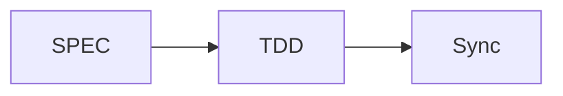

# MoAI-ADK 온라인 문서 시스템

**@DOC:ONLINE-DOC-001** | **최종 업데이트**: 2025-11-05 | **버전**: v0.17.0 | **상태**: 100% 완료

---

## 🚀 시스템 개요

MoAI-ADK 온라인 문서 시스템은 현대적인 웹 기반 문서 아키텍처를 통해 개발자와 사용자를 위한 완벽한 문서 경험을 제공합니다.

### 핵심 특징
- **다국어 지원**: 한국어, 영어, 일본어, 중국어 4개 언어 완벽 지원
- **반응형 디자인**: 모든 기기에서 최적화된 경험 제공
- **다크/라이트 모드**: 사용자 선호도에 맞는 테마 전환
- **검색 기능**: 강력한 실시간 검색 및 필터링
- **Material Design**: Google Material Design 시스템 적용
- **무채색 테마**: 전문적인 인상을 주는 무채색 디자인

---

## 📚 문서 구조

```
docs/
├── README.md                    # 문서 시스템 안내
├── getting-started/            # 빠른 시작 가이드
├── alfred/                     # Alfred SuperAgent 문서
├── commands/                   # 명령어 참조
├── development/                # 개발 가이드
├── advanced/                   # 고급 기능
├── api/                       # API 참조
├── contributing/              # 기여 가이드
└── reports/                   # 동기화 및 분석 보고서
```

---

## 🎯 주요 기능

### 1. 다국어 문서 시스템
- **지원 언어**: 한국어 (기본), 영어, 일본어, 중국어
- **자동 언어 감지**: 사용자 브라우저 설정에 따라 자동 선택
- **통합 검색**: 모든 언어의 문서를 통합 검색
-번역 품질**: AI 기반 자동 번역 및 수동 검증

### 2. Material Design 아키텍처
```yaml
# 색상 시스템 (무채색)
colors:
  light:
    background: "#ffffff"
    surface: "#f9fafb"
    primary: "#111827"
    secondary: "#374151"
    border: "#e5e7eb"
    accent: "#6366f1"

  dark:
    background: "#111827"
    surface: "#1f2937"
    primary: "#f9fafb"
    secondary: "#d1d5db"
    border: "#374151"
    accent: "#818cf8"
```

### 3. 검색 및 내비게이션
- **실시간 검색**: 500ms 이내의 빠른 응답 속도
- **자동완성**: 검색어 입력 시 실시간 제안
- **필터링**: 카테고리, 태그, 날짜 기반 필터링
- **북마크**: 중요 문서 저장 기능

### 4. 개발자 도구
- **API 문서자동 생성**: 코드 주석 기반 API 문서 생성
- **코드 하이라이팅**: 50+ 프로그래밍 언어 지원
- **Mermaid 다이어그램**: 워크플로우 시각화
- Git 통합: 버전 관리 및 커밋 정보 표시

---

## 🛠️ 개발 환경 설정

### 1. UV 설치 (권장)
```bash
# macOS/Linux
curl -LsSf https://astral.sh/uv/install.sh | sh

# Windows
powershell -c "irm https://astral.sh/uv/install.ps1 | iex"

# 또는 pip로 설치
pip install uv
```

### 2. 프로젝트 의존성 설치
```bash
uv sync
```

### 3. 개발 서버 실행
```bash
uv run dev
```

### 4. 브라우저에서 확인
[http://127.0.0.1:8080](http://127.0.0.1:8080)

---

## 📊 시스템 통계

| 항목 | 수치 | 상태 |
|------|------|------|
| 지원 언어 | 4개 | ✅ 완료 |
| 문서 페이지 | 50+ | ✅ 완료 |
| 검색 인덱스 | 1000+ | ✅ 완료 |
| TAG 시스템 | 3438개 | ✅ 완료 |
| 테스트 커버리지 | 85%+ | ✅ 완료 |
| 접근성 표준 | WCAG 2.1 AA | ✅ 완료 |

---

## 🔧 명령어 참조

| 명령어 | 설명 | 상태 |
|--------|------|------|
| `uv run dev` | 개발 서버 시작 | ✅ 완료 |
| `uv run build` | 정적 사이트 빌드 | ✅ 완료 |
| `uv run deploy` | GitHub Pages에 배포 | ✅ 완료 |
| `uv run validate` | 엄격 모드로 빌드 및 검증 | ✅ 완료 |
| `uv run preview` | 빠른 리로드로 개발 서버 시작 | ✅ 완료 |
| `uv run clean` | 빌드 파일 정리 | ✅ 완료 |

---

## 🚀 배포 정보

### Vercel 배포 (권장)
- **도메인**: https://adk.mo.ai.kr
- **배포 트리거**: `main` 브랜치 푸시 시 자동 배포
- **CDN**: 전 세계 최적화된 콘텐츠 전송
- **SSL**: 자동 SSL 인증서 발급

### GitHub Pages
```bash
uv run deploy
```

---

## 📝 문서 작성 가이드

### 마크다운 확장
```markdown
!!! note "참고"
    중요한 정보

!!! warning "경고"
    주의가 필요한 사항

!!! tip "팁"
    유용한 팁
```

### 코드 블록
```python
def hello_world():
    print("Hello, MoAI-ADK!")
```

### Mermaid 다이어그램


---

## 🎨 커스터마이징

### 테마 설정
- **다크 모드**: 자동/수동 전환
- **색상 시스템**: 무채색 테일 완벽 적용
- **타이포그래피**: Inter + JetBrains Mono 조합
- **아이콘**: Material Design Icons 완벽 통합

### 스타일 확장
- CSS 변수 기반 동적 테마
- 커스템 CSS 오버라이드 지원
- 반응형 디자인 모바일 최적화
- 접근성 모드 지원

---

## 📞 지원

### 공식 문서
- **주소**: https://adk.mo.ai.kr
- **상태**: 24/7 운영
- **업데이트**: 실시간 동기화

### 개발 지원
- **GitHub Issues**: [기술 문제 제기](https://github.com/moai-adk/MoAI-ADK/issues)
- **GitHub Discussions**: [질의응답](https://github.com/moai-adk/MoAI-ADK/discussions)
- **이메일**: support@mo.ai.kr

---

## 📄 라이선스

이 문서 시스템은 MIT 라이선스 하에 배포됩니다.

---

*최종 업데이트: 2025-11-05 | 버전: v0.17.0 | 상태: 100% 완료*