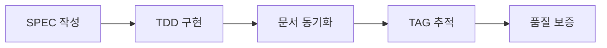

# @DOC:INTRO-001 | Chain: @SPEC:DOCS-003 -> @DOC:INTRO-001

# Introduction to MoAI-ADK

## 바이브 코딩의 한계

현대 AI 보조 개발 도구들(Claude Code, GitHub Copilot, Cursor 등)은 놀라운 코드 생성 능력을 제공합니다. 하지만 다음과 같은 근본적인 문제가 있습니다:

### 1. 플랑켄슈타인 코드 (Frankenstein Code)

AI가 생성한 코드 조각들을 짜깁기하면서 발생하는 문제:

- **일관성 부재**: 각 세션마다 다른 스타일, 다른 아키텍처 패턴
- **중복 코드**: 같은 기능을 다른 방식으로 구현
- **기술 부채**: 임시방편으로 작성된 코드가 누적

```python
# 세션 1에서 생성된 코드
def process_data(data):
    return [x * 2 for x in data]

# 세션 2에서 생성된 동일 기능 코드
def processData(input):  # 다른 네이밍 컨벤션
    result = []
    for item in input:
        result.append(item * 2)  # 다른 구현 방식
    return result
```

### 2. 추적성 부재 (No Traceability)

- **요구사항과 코드 연결 불가**: 이 코드가 왜 필요한지 추적 불가
- **변경 이력 관리 어려움**: 무엇이 언제 왜 바뀌었는지 불명확
- **협업 장애**: 팀원이 코드의 맥락을 이해하기 어려움

### 3. 품질 일관성 결여

- **테스트 부재**: "일단 작동하면 OK" 접근법
- **문서화 누락**: AI가 생성한 코드는 문서가 없음
- **보안 취약점**: 자동 생성 코드의 보안 검증 부족

---

## MoAI-ADK의 해결책

**MoAI-ADK (MoAI Agentic Development Kit)**는 SPEC-First TDD 방법론을 통해 위 문제를 해결합니다.

### ✅ 체계적 개발 프로세스



### ✅ 추적성 보장 (@TAG 시스템)

모든 코드는 SPEC과 연결됩니다:

```python
# @CODE:AUTH-001 | Chain: @SPEC:AUTH-001 -> @CODE:AUTH-001 -> @TEST:AUTH-001
def authenticate_user(username: str, password: str) -> bool:
    """
    사용자 인증 처리

    Related: @REQ:AUTH-001-LOGIN
    """
    pass
```

### ✅ 품질 일관성 (TRUST 5원칙)

1. **T**est-first: 테스트 주도 개발
2. **R**eadable: 가독성 우선
3. **U**niform: 일관된 아키텍처
4. **S**implicity: 단순성 추구
5. **T**raceability: 추적 가능성

---

## MoAI-ADK 핵심 특징

### 🤖 Alfred SuperAgent

9개 전문 에이전트를 조율하는 중앙 오케스트레이터:

| 에이전트 | 역할 | 호출 |
|---------|------|------|
| spec-builder 🏗️ | SPEC 작성 | `/alfred:1-spec` |
| code-builder 💎 | TDD 구현 | `/alfred:2-build` |
| doc-syncer 📖 | 문서 동기화 | `/alfred:3-sync` |

### 📋 3단계 워크플로우

```bash
/alfred:1-spec     # SPEC 작성 (EARS 방식)
/alfred:2-build    # TDD 구현 (RED → GREEN → REFACTOR)
/alfred:3-sync     # 문서 동기화 (TAG 체인 검증)
```

### 🔗 @TAG 추적 시스템

모든 산출물은 TAG로 연결됩니다:

```
@SPEC:AUTH-001 (사용자 인증 요구사항)
  ├─ @CODE:AUTH-001 (인증 구현 코드)
  ├─ @TEST:AUTH-001 (인증 테스트)
  └─ @DOC:AUTH-001 (인증 문서)
```

---

## 다음 단계

MoAI-ADK를 시작할 준비가 되셨나요?

1. [설치하기](getting-started/installation.md) - PyPI에서 MoAI-ADK 설치
2. [빠른 시작](getting-started/quick-start.md) - 첫 프로젝트 생성
3. [워크플로우 이해](workflow.md) - 3단계 개발 사이클 학습

---

**다음**: [Getting Started →](getting-started/installation.md)
