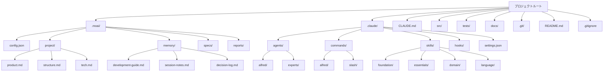

# プロジェクト初期化完全ガイド

MoAI-ADKプロジェクトの初期化プロセスのすべてをカバーする詳細なガイドです。新規プロジェクトの作成から既存プロジェクトへの追加、さまざまなテンプレートの活用、トラブルシューティングまで包括的に説明します。

## 目次

1. [概要](#概要)
2. [事前要件](#事前要件)
3. [新規プロジェクト作成](#新規プロジェクト作成)
4. [既存プロジェクトへの追加](#既存プロジェクトへの追加)
5. [生成されるファイル構造の詳細](#生成されるファイル構造の詳細)
6. [.moai/ディレクトリの詳細分析](#moaiディレクトリの詳細分析)
7. [.claude/ディレクトリの詳細分析](#claudeディレクトリの詳細分析)
8. [プロジェクトタイプ別テンプレート](#プロジェクトタイプ別テンプレート)
9. [初期化自動化設定](#初期化自動化設定)
10. [初期化後の検証](#初期化後の検証)
11. [トラブルシューティング](#トラブルシューティング)
12. [ベストプラクティス](#ベストプラクティス)

## 概要

MoAI-ADKのプロジェクト初期化は、単なるファイル生成を超えて、AI支援開発のための完全なエコシステムを構築するプロセスです。初期化を通じて以下が得られます:

- **Alfred SuperAgent**: 19人のAI専門家チームと56のClaude Skills
- **SPEC-First TDD**: 要件 → テスト → コード → ドキュメントの一貫したワークフロー
- **@TAGシステム**: すべてのアーティファクトを接続するトレーサビリティネットワーク
- **自動化Hook**: 開発フローを妨げないスマートなセーフティガード

### 初期化の核心原則

1. **最小限の介入**: ユーザーはプロジェクト名のみを提供
2. **自動検出**: 言語、フレームワーク、構造を自動的に把握
3. **段階的設定**: 詳細設定は`/alfred:0-project`で収集
4. **安全なマージ**: 既存プロジェクトに安全に統合

## 事前要件

### システム要件

| 項目 | 最小要件 | 推奨仕様 |
|------|----------|----------|
| OS | Windows 10+, macOS 11+, Ubuntu 20.04+ | 最新LTSバージョン |
| Python | 3.13+ | 3.13.0+ |
| Git | 2.25+ | 2.40+ |
| メモリ | 4GB RAM | 8GB+ RAM |
| ストレージ | 1GB空き容量 | 2GB+空き容量 |

### 必須ツールのインストール

#### 1. UVインストール (Pythonパッケージマネージャー)

UVはMoAI-ADKの公式パッケージマネージャーです。

```bash
# macOS/Linux
curl -LsSf https://astral.sh/uv/install.sh | sh

# Windows (PowerShell)
powershell -c "irm https://astral.sh/uv/install.ps1 | iex"

# インストール確認
uv --version
```

#### 2. Gitのインストールと設定

```bash
# インストール確認
git --version

# 基本設定 (初回のみ)
git config --global user.name "ユーザー名"
git config --global user.email "email@example.com"

# Gitリポジトリの初期化 (新規プロジェクトの場合)
git init
```

#### 3. MoAI-ADKのインストール

```bash
# UVを通じたインストール (推奨)
uv tool install moai-adk

# またはpipを通じたインストール
pip install moai-adk

# インストール確認
moai-adk --version
```

### オプションツール

特定の開発スタックに応じて、追加ツールのインストールを推奨します:

```bash
# Pythonプロジェクト
uv add pytest ruff mypy black

# Node.jsプロジェクト
npm install --save-dev eslint prettier typescript

# Goプロジェクト
go install github.com/golangci/golangci-lint/cmd/golangci-lint@latest

# Rustプロジェクト
rustup component add clippy rustfmt
```

## 新規プロジェクト作成

### 基本コマンド

```bash
# 新しいプロジェクトを作成
moai-adk init <プロジェクト名>

# 例
moai-adk init my-awesome-app
cd my-awesome-app
```

### 高度なオプション

```bash
# 特定のテンプレートで作成
moai-adk init my-app --template web-api

# 特定の言語で作成
moai-adk init my-app --language python

# MCPサーバーを含めて作成
moai-adk init my-app --with-mcp

# 詳細情報出力
moai-adk init my-app --verbose

# ヘルプ確認
moai-adk init --help
```

### 初期化プロセスの詳細

#### ステップ1: プロジェクト情報収集

```bash
$ moai-adk init hello-world
🚀 MoAI-ADK v0.17.0 プロジェクト初期化開始...

📁 作成場所: /Users/username/projects/hello-world
⚙️ テンプレート: auto-detect (デフォルト)
🌍 言語: 自動検出予定
```

#### ステップ2: ディレクトリ構造生成

```bash
📂 ディレクトリ構造生成中...
✅ .moai/ - MoAI-ADKプロジェクト設定
✅ .claude/ - Claude Code自動化
✅ src/ - ソースコードディレクトリ
✅ tests/ - テストディレクトリ
✅ docs/ - ドキュメントディレクトリ
```

#### ステップ3: 設定ファイル生成

```bash
⚙️  設定ファイル生成中...
✅ .moai/config.json - プロジェクト設定
✅ .moai/project/ - プロジェクト情報
✅ .claude/settings.json - Claude Code設定
✅ CLAUDE.md - プロジェクトガイド
```

#### ステップ4: エージェントとスキルのインストール

```bash
🤖 AIエージェント設定中...
✅ 16個のSub-agentインストール完了
✅ 74個のClaude Skillsロード完了
✅ 5個のClaude Code Hooks有効化
```

#### ステップ5: 初期化完了

```bash
🎉 プロジェクト初期化完了!

📋 次のステップ:
1. cd hello-world
2. claude (Claude Code実行)
3. /alfred:0-project (プロジェクト設定完了)

💡 ヒント: moai-adk doctorコマンドでシステム状態を確認できます。
```

## 既存プロジェクトへの追加

既に進行中のプロジェクトにMoAI-ADKを統合できます。既存のコードは絶対に変更されません。

### 基本統合

```bash
# 既存プロジェクトディレクトリに移動
cd your-existing-project

# MoAI-ADK初期化
moai-adk init .

# または明示的に現在のディレクトリを指定
moai-adk init . --force
```

### 統合前の検証

```bash
# プロジェクト構造確認
tree -L 2

# Gitステータス確認
git status

# 必要なファイルのバックアップ (オプション)
cp -r . /backup/your-project-$(date +%Y%m%d)
```

### 統合プロセス

#### ステップ1: プロジェクト分析

```bash
🔍 既存プロジェクト分析中...
✅ Pythonプロジェクト検出 (pyproject.toml発見)
✅ FastAPIフレームワーク検出
✅ 既に25個のPythonファイル存在
⚠️ tests/ディレクトリ発見 (既存テスト保存)
```

#### ステップ2: 最小限のファイル追加

```bash
📂 MoAI-ADKファイル追加中...
✅ .moai/ - 新規作成
✅ .claude/ - 新規作成
✅ CLAUDE.md - 新規作成
⚠️ src/, tests/, docs/ 既存ファイル維持
```

#### ステップ3: 設定最適化

```bash
⚙️  既存プロジェクトに合わせて設定最適化...
✅ 言語: python (検出済み)
✅ フレームワーク: fastapi (検出済み)
✅ テストツール: pytest (既存設定維持)
✅ ドキュメント形式: markdown (既存ドキュメント維持)
```

### 既存プロジェクトとの統合例

#### 既存構造
```
my-api/
├── app/
│   ├── main.py
│   ├── models/
│   └── routes/
├── tests/
│   ├── test_main.py
│   └── conftest.py
├── requirements.txt
├── README.md
└── .git/
```

#### MoAI-ADK追加後の構造
```
my-api/
├── .moai/                    # ✅ 新規追加
│   ├── config.json
│   ├── project/
│   ├── memory/
│   ├── specs/
│   └── reports/
├── .claude/                  # ✅ 新規追加
│   ├── agents/
│   ├── commands/
│   ├── skills/
│   ├── hooks/
│   └── settings.json
├── CLAUDE.md                 # ✅ 新規追加
├── app/                      # ✅ 既存維持
│   ├── main.py
│   ├── models/
│   └── routes/
├── tests/                    # ✅ 既存維持
│   ├── test_main.py
│   └── conftest.py
├── requirements.txt
├── README.md
└── .git/
```

## 生成されるファイル構造の詳細

### 全体構造ダイアグラム



### 核心ファイルの説明

#### 1. `.moai/config.json` - プロジェクトの心臓

```json
{
  "version": "0.17.0",
  "moai": {
    "version": "0.17.0",
    "template_version": "0.17.0",
    "optimized": false
  },
  "language": {
    "conversation_language": "ko",
    "conversation_language_name": "한국어",
    "code_language": "python"
  },
  "project": {
    "name": "my-project",
    "description": "MoAI-ADKで生成されたプロジェクト",
    "owner": "username",
    "mode": "personal",
    "created_at": "2025-11-06T10:00:00Z",
    "domains": ["backend"]
  },
  "github": {
    "enabled": false,
    "auto_delete_branches": true,
    "spec_git_workflow": "develop_direct"
  },
  "report_generation": {
    "enabled": false,
    "level": "minimal"
  },
  "hooks": {
    "timeout_seconds": 5
  },
  "tags": {
    "policy": "strict",
    "auto_validation": true
  },
  "constitution": {
    "trust_principles": true,
    "tdd_workflow": true,
    "spec_first": true
  }
}
```

#### 2. `.moai/project/` - プロジェクトメタデータ

##### `product.md` - 製品ビジョン
```markdown
# 製品ビジョン

## 概要
プロジェクトのコアバリューと目標を定義します。

## ターゲットユーザー
- 主要ユーザーグループの定義
- ユーザーのニーズと問題点

## コア機能
- 製品が提供する主な機能
- 差別化された価値提案

## 成功指標
- 製品の成功を測定するKPI
- 短期および長期目標
```

##### `structure.md` - プロジェクト構造
```markdown
# プロジェクト構造

## ディレクトリ構造
```
src/
├── core/           # コアビジネスロジック
├── api/            # APIエンドポイント
├── models/         # データモデル
├── services/       # サービス層
└── utils/          # ユーティリティ関数
```

## アーキテクチャパターン
- 使用するアーキテクチャパターン (MVC, クリーンアーキテクチャなど)
- レイヤー別の責任と相互作用

## データフロー
- 主要データフローの説明
- 外部システムとの連携方法
```

##### `tech.md` - 技術スタック
```markdown
# 技術スタック

## コア技術
- **言語**: Python 3.13
- **フレームワーク**: FastAPI
- **データベース**: PostgreSQL
- **テスト**: pytest

## 開発ツール
- **パッケージ管理**: uv
- **コードフォーマット**: black, ruff
- **型チェック**: mypy
- **ドキュメント**: Sphinx

## インフラ
- **デプロイ**: Docker
- **CI/CD**: GitHub Actions
- **モニタリング**: Prometheus + Grafana
```

#### 3. `.claude/settings.json` - Claude Code設定

```json
{
  "models": {
    "default": "claude-3-5-sonnet-20241022",
    "fast": "claude-3-5-haiku-20241022"
  },
  "permissions": {
    "allow": [
      "Read(*)",
      "Write(src/*, tests/*, docs/*, .moai/*)",
      "Bash(git status, git log, git diff, pytest, python, uv)",
      "Grep(*), Glob(*), Edit(*), Bash(*, cd, ls, mkdir, echo)"
    ],
    "ask": [
      "Bash(git push, git merge, rm -rf)",
      "Write(.claude/*, .moai/config.json)"
    ],
    "deny": [
      "Bash(sudo, rm -rf /, dd)",
      "Write(*.key, *.pem, .env)"
    ]
  },
  "hooks": {
    "SessionStart": ["alfred-hooks"],
    "PreToolUse": ["alfred-hooks"],
    "UserPromptSubmit": ["alfred-hooks"],
    "PostToolUse": ["alfred-hooks"],
    "SessionEnd": ["alfred-hooks"]
  },
  "environment": {
    "PYTHONPATH": "${CLAUDE_PROJECT_DIR}/src",
    "MOAI_PROJECT_ROOT": "${CLAUDE_PROJECT_DIR}"
  }
}
```

## .moai/ディレクトリの詳細分析

### ディレクトリ構造と役割

```
.moai/
├── config.json              # プロジェクト設定ファイル
├── project/                 # プロジェクトドキュメント
│   ├── product.md           # 製品ビジョンと目標
│   ├── structure.md         # プロジェクト構造説明
│   └── tech.md              # 技術スタック仕様
├── memory/                  # Alfredのメモリストレージ
│   ├── development-guide.md # 開発ガイド
│   ├── session-notes.md     # セッションノート
│   ├── decision-log.md      # 意思決定ログ
│   ├── user-preferences.md  # ユーザー設定
│   ├── project-context.md   # プロジェクトコンテキスト
│   ├── learning-history.md  # 学習履歴
│   └── expertise-profile.md # 専門性プロファイル
├── specs/                   # SPECドキュメントリポジトリ
│   └── SPEC-XXX-XXX/
│       ├── spec.md          # メインSPECドキュメント
│       ├── plan.md          # 実装計画
│       ├── acceptance.md    # 受け入れ基準
│       └── history.md       # 変更履歴
└── reports/                 # 分析レポート
    ├── sync-report-*.md     # 同期レポート
    ├── quality-report-*.md  # 品質レポート
    └── analysis-*.md        # 分析レポート
```

### memory/ディレクトリの詳細

#### `development-guide.md`
Alfredが学習した開発パターンとベストプラクティスを保存します。

```markdown
# 開発ガイド

## コードスタイル
- 関数は50行以内で作成
- 変数名は明確に
- 型ヒントを使用

## テストパターン
- AAAパターン (Arrange, Act, Assert)
- テスト名は明確に
- Edge caseテスト必須

## Gitコミットメッセージ
- feat: 新機能
- fix: バグ修正
- refactor: リファクタリング
- test: テスト関連
```

#### `session-notes.md`
開発セッション中の重要な発見と決定事項を記録します。

```markdown
# セッションノート

## 2025-11-06 セッション
### 主な活動
- ユーザー認証API実装 (AUTH-001)
- テストカバレッジ92%達成

### 発見事項
- FastAPIの依存性注入がテストに有利
- JWTトークン有効期限処理改善必要

### 次のステップ
- リフレッシュトークン実装
- セキュリティ強化措置
```

### specs/ディレクトリの詳細

SPEC文書はMoAI-ADKの核心です。すべての開発はSPECから始まります。

#### SPEC文書構造
```
.moai/specs/SPEC-AUTH-001/
├── spec.md              # メインSPEC文書
├── plan.md              # 実装計画
├── acceptance.md        # 受け入れ基準
├── history.md           # 変更履歴
└── reviews/             # レビュー記録
    ├── review-1.md
    └── review-2.md
```

#### `spec.md` 例
```yaml
---
id: AUTH-001
version: 1.0.0
status: completed
priority: high
created: 2025-11-06T10:00:00Z
updated: 2025-11-06T15:30:00Z
author: Alfred
reviewer: username
---

# @SPEC:AUTH-001: ユーザー認証システム

## 概要
ユーザー認証のためのJWTベースシステム実装

## Ubiquitous Requirements (基本要件)
- システムはJWTベース認証を提供しなければならない
- ユーザーはメールとパスワードでログインできなければならない
- 認証されたユーザーは保護されたリソースにアクセスできなければならない

## Event-driven Requirements (条件付き要件)
- WHEN 有効な資格情報が提供された場合、システムはJWTトークンを発行しなければならない
- WHEN 期限切れトークンが提供された場合、システムは401エラーを返さなければならない
- WHILE ユーザーが認証された状態の場合、システムは保護されたリソースへのアクセスを許可しなければならない

## Optional Requirements (オプション要件)
- WHERE リフレッシュトークンがある場合、システムは新しいアクセストークンを発行できる
- WHERE ソーシャルログインが設定されている場合、ユーザーはソーシャルアカウントで認証できる

## Unwanted Behaviors (禁止動作)
- システムは平文パスワードを保存してはならない
- システムは無効なトークンでリソースアクセスを許可してはならない
- システムはレート制限なしでログインを許可してはならない

## Constraints (制約条件)
- パスワードは最小8文字、最大128文字でなければならない
- JWTトークン有効期限は15分を超えてはならない
- ログイン試行は分あたり5回に制限しなければならない
```

## .claude/ディレクトリの詳細分析

### ディレクトリ構造と役割

```
.claude/
├── agents/                  # Sub-agent定義
│   ├── alfred/              # Alfredコアエージェント
│   │   ├── project-manager.md
│   │   ├── spec-builder.md
│   │   ├── code-builder.md
│   │   ├── doc-syncer.md
│   │   ├── tag-agent.md
│   │   ├── git-manager.md
│   │   ├── debug-helper.md
│   │   ├── trust-checker.md
│   │   ├── quality-gate.md
│   │   └── cc-manager.md
│   └── experts/             # ドメインエキスパートエージェント
│       ├── backend-expert.md
│       ├── frontend-expert.md
│       ├── ui-ux-expert.md
│       ├── devops-expert.md
│       └── security-expert.md
├── commands/                # スラッシュコマンド定義
│   ├── alfred/              # Alfredコマンド
│   │   ├── 0-project.md
│   │   ├── 1-plan.md
│   │   ├── 2-run.md
│   │   ├── 3-sync.md
│   │   └── 9-feedback.md
│   └── slash/               # 一般スラッシュコマンド
│       ├── help.md
│       ├── status.md
│       └── debug.md
├── skills/                  # Claude Skills
│   ├── foundation/          # 基礎スキル
│   │   ├── trust.md
│   │   ├── tags.md
│   │   ├── specs.md
│   │   ├── ears.md
│   │   ├── git.md
│   │   └── langs.md
│   ├── essentials/          # 必須スキル
│   │   ├── debug.md
│   │   ├── perf.md
│   │   ├── refactor.md
│   │   └── review.md
│   ├── alfred/              # Alfred専用スキル
│   │   ├── workflow.md
│   │   ├── language-detection.md
│   │   ├── spec-validation.md
│   │   └── ask-user-questions.md
│   ├── domain/              # ドメインスキル
│   │   ├── backend.md
│   │   ├── frontend.md
│   │   ├── database.md
│   │   ├── security.md
│   │   ├── devops.md
│   │   └── mobile-app.md
│   └── language/            # 言語スキル
│       ├── python.md
│       ├── typescript.md
│       ├── javascript.md
│       ├── go.md
│       ├── rust.md
│       └── sql.md
├── hooks/                   # Claude Code Hooks
│   └── alfred/
│       ├── alfred_hooks.py  # メインHookスクリプト
│       ├── core/
│       │   ├── checkpoint.py
│       │   ├── risk_detector.py
│       │   ├── tag_guard.py
│       │   └── session_manager.py
│       └── utils/
│           ├── file_utils.py
│           └── git_utils.py
├── settings.json            # Claude Code設定
└── mcp.json                 # MCPサーバー設定 (オプション)
```

### agents/ディレクトリの詳細

#### Alfredコアエージェント

##### `project-manager.md`
```markdown
# Project Manager Agent

## 役割
プロジェクトの初期化とメタデータ管理を担当します。

## 主な機能
- プロジェクト設定収集
- 言語とフレームワーク検出
- 適切なSkill Pack推奨
- プロジェクト構造設計

## アクティベーション条件
- `/alfred:0-project`コマンド実行
- 新プロジェクト初期化必要

## 使用モデル
- デフォルト: Claude 3.5 Sonnet
- 簡単なタスク: Claude 3.5 Haiku
```

##### `spec-builder.md`
```markdown
# Spec Builder Agent

## 役割
EARS形式で明確なSPEC文書を作成します。

## 主な機能
- 要件分析と構造化
- EARSパターン適用
- Plan Board生成
- 受け入れ基準定義

## アクティベーション条件
- `/alfred:1-plan`コマンド実行
- SPEC作成必要

## 専門知識
- EARS (Easy Approach to Requirements Syntax)
- 要件工学
- システム設計
```

### commands/ディレクトリの詳細

#### Alfredコマンド構造

##### `0-project.md` - プロジェクト初期化
```markdown
# /alfred:0-project

## 説明
プロジェクトの初期化と設定を管理するコマンドです。

## 使用法
```bash
/alfred:0-project                    # 自動検出モード
/alfred:0-project setting           # 設定変更モード
/alfred:0-project update            # テンプレート最適化モード
```

## ステップバイステッププロセス
1. プロジェクト状態分析
2. ユーザー情報収集 (必要時)
3. 適切な設定適用
4. Skill Pack配置
5. 初期化レポート

## 期待される結果
- 完全に設定された`.moai/config.json`
- プロジェクトドキュメント5種類生成
- 推奨Skill Packロード
```

### skills/ディレクトリの詳細

#### Foundation Skills

##### `trust.md` - TRUST 5原則
```markdown
# TRUST 5 Principles Skill

## 説明
すべてのコードはTRUST 5原則を満たさなければなりません。

## 原則
1. **Test First**: テストが最初に作成されなければならない
2. **Readable**: 読みやすいコードでなければならない
3. **Unified**: 一貫した構造を維持しなければならない
4. **Secured**: セキュリティを考慮しなければならない
5. **Trackable**: 追跡可能でなければならない

## 検証基準
- テストカバレッジ ≥ 85%
- 関数 ≤ 50行
- 一貫した命名規則
- 入力検証
- @TAGシステム使用

## 適用方法
- コードレビュー時に自動検証
- `/alfred:3-sync`実行時に確認
- Pull Request要件
```

### hooks/ディレクトリの詳細

#### Hookアーキテクチャ

```python
# alfred_hooks.py
import os
import sys
import json
from pathlib import Path

def main():
    """メインHookエントリーポイント"""
    hook_name = os.environ.get('CLAUDE_HOOK_NAME')
    project_dir = os.environ.get('CLAUDE_PROJECT_DIR')

    if hook_name == 'SessionStart':
        session_start(project_dir)
    elif hook_name == 'PreToolUse':
        pre_tool_use(project_dir)
    # ... 他のHook

def session_start(project_dir: str):
    """セッション開始時にプロジェクト状態を要約"""
    config_path = Path(project_dir) / '.moai' / 'config.json'

    if config_path.exists():
        with open(config_path) as f:
            config = json.load(f)

        print(f"📋 プロジェクト: {config['project']['name']}")
        print(f"🌍 言語: {config['language']['conversation_language_name']}")
        print(f"🤖 Alfred準備完了")
```

## プロジェクトタイプ別テンプレート

MoAI-ADKはさまざまなプロジェクトタイプに適したテンプレートを提供します。

### 1. Web APIテンプレート

```bash
moai-adk init my-api --template web-api
```

#### 特徴
- FastAPI/Express/NestJS基本構造
- RESTful APIガイドライン
- APIドキュメント自動化設定
- JWT認証基本構造

#### 生成される構造
```
my-api/
├── src/
│   ├── api/
│   │   ├── __init__.py
│   │   ├── dependencies.py
│   │   └── middleware.py
│   ├── models/
│   │   ├── __init__.py
│   │   └── base.py
│   ├── schemas/
│   │   ├── __init__.py
│   │   └── common.py
│   └── main.py
├── tests/
│   ├── api/
│   └── conftest.py
├── docs/
│   └── api/
└── .moai/specs/SPEC-API-001/
```

### 2. CLIツールテンプレート

```bash
moai-adk init my-cli --template cli-tool
```

#### 特徴
- Click/argparse基本構造
- コマンドラインインターフェースガイド
- 設定ファイル処理
- ロギングシステム

#### 生成される構造
```
my-cli/
├── src/
│   ├── my_cli/
│   │   ├── __init__.py
│   │   ├── main.py
│   │   ├── commands/
│   │   └── config/
│   └── my_cli.py
├── tests/
│   └── unit/
├── docs/
│   └── usage/
└── .moai/specs/SPEC-CLI-001/
```

### 3. データ分析テンプレート

```bash
moai-adk init my-analysis --template data-science
```

#### 特徴
- Jupyter Notebook基本構造
- pandas/numpy設定
- データ可視化設定
- 実験追跡システム

#### 生成される構造
```
my-analysis/
├── notebooks/
│   ├── 01-exploration.ipynb
│   └── 02-analysis.ipynb
├── src/
│   ├── data/
│   │   ├── __init__.py
│   │   ├── loading.py
│   │   └── cleaning.py
│   └── analysis/
│       ├── __init__.py
│       └── statistics.py
├── data/
│   ├── raw/
│   └── processed/
├── tests/
└── .moai/specs/SPEC-DATA-001/
```

### 4. モバイルアプリテンプレート

```bash
moai-adk init my-app --template mobile-app
```

#### 特徴
- Flutter/React Native基本構造
- 状態管理設定
- API通信層
- テスト環境

#### 生成される構造
```
my-app/
├── lib/
│   ├── main.dart
│   ├── app/
│   │   ├── screens/
│   │   ├── widgets/
│   │   └── services/
│   └── core/
│       ├── constants.dart
│       └── themes.dart
├── test/
├── integration_test/
├── docs/
└── .moai/specs/SPEC-MOBILE-001/
```

### 5. 機械学習テンプレート

```bash
moai-adk init my-ml --template ml-project
```

#### 特徴
- モデルトレーニング/推論構造
- データパイプライン
- 実験管理 (MLflow)
- モデルサービングAPI

#### 生成される構造
```
my-ml/
├── src/
│   ├── models/
│   │   ├── __init__.py
│   │   ├── base.py
│   │   └── training.py
│   ├── data/
│   │   ├── __init__.py
│   │   ├── preprocessing.py
│   │   └── loading.py
│   └── inference/
│       ├── __init__.py
│       └── predict.py
├── experiments/
├── models/
├── data/
├── tests/
└── .moai/specs/SPEC-ML-001/
```

### テンプレート選択ガイド

| プロジェクトタイプ | 推奨テンプレート | 主な特徴 | 適した状況 |
|--------------|-------------|-----------|-----------|
| Webバックエンド | `web-api` | REST API, データベース連携 | APIサーバー、マイクロサービス |
| コマンドラインツール | `cli-tool` | CLIインターフェース、設定管理 | 開発ツール、ユーティリティ |
| データ分析 | `data-science` | Jupyter, pandas, 可視化 | 研究プロジェクト、分析 |
| モバイルアプリ | `mobile-app` | Flutter/React Native | iOS/Androidアプリ |
| 機械学習 | `ml-project` | モデルトレーニング、実験管理 | MLプロジェクト、研究 |
| 一般 | `default` | 汎用構造 | その他プロジェクト |

## 初期化自動化設定

### 環境変数設定

MoAI-ADK初期化時に環境変数を通じてデフォルト値を設定できます。

```bash
# 基本設定
export MOAI_DEFAULT_LANGUAGE="ko"
export MOAI_DEFAULT_OWNER="username"
export MOAI_DEFAULT_MODE="personal"

# GitHub統合
export MOAI_GITHUB_ENABLED="true"
export MOAI_GITHUB_AUTO_DELETE_BRANCHES="true"

# レポート設定
export MOAI_REPORT_GENERATION="minimal"

# Hook設定
export MOAI_HOOK_TIMEOUT="5"
```

### 初期化スクリプト

反復的な初期化を自動化するスクリプト例:

```bash
#!/bin/bash
# init-moai-project.sh

set -e

# 引数確認
if [ $# -eq 0 ]; then
    echo "Usage: $0 <project-name> [template]"
    exit 1
fi

PROJECT_NAME=$1
TEMPLATE=${2:-"default"}

# 環境変数設定
export MOAI_DEFAULT_LANGUAGE="ko"
export MOAI_DEFAULT_OWNER="$(git config user.name)"
export MOAI_GITHUB_ENABLED="true"

# プロジェクト作成
echo "🚀 Creating MoAI-ADK project: $PROJECT_NAME"
moai-adk init "$PROJECT_NAME" --template "$TEMPLATE"

# プロジェクトディレクトリ移動
cd "$PROJECT_NAME"

# Git初期化
echo "📦 Initializing Git repository"
git init
git add .
git commit -m "🎉 Initial commit with MoAI-ADK"

# 仮想環境設定 (Pythonプロジェクトの場合)
if [ "$TEMPLATE" = "web-api" ] || [ "$TEMPLATE" = "default" ]; then
    echo "🐍 Setting up Python virtual environment"
    uv venv
    source .venv/bin/activate
    uv add pytest ruff mypy
fi

# 案内メッセージ
echo "✅ Project '$PROJECT_NAME' created successfully!"
echo "📋 Next steps:"
echo "   1. cd $PROJECT_NAME"
echo "   2. claude"
echo "   3. /alfred:0-project"
```

### Docker統合初期化

```bash
#!/bin/bash
# init-with-docker.sh

PROJECT_NAME=$1
TEMPLATE=${2:-"web-api"}

# プロジェクト作成
moai-adk init "$PROJECT_NAME" --template "$TEMPLATE"

cd "$PROJECT_NAME"

# Dockerfile生成
cat > Dockerfile << 'EOF'
FROM python:3.13-slim

WORKDIR /app

COPY requirements.txt .
RUN pip install -r requirements.txt

COPY src/ ./src/
COPY tests/ ./tests/

EXPOSE 8000

CMD ["uvicorn", "src.main:app", "--host", "0.0.0.0", "--port", "8000"]
EOF

# docker-compose.yml生成
cat > docker-compose.yml << 'EOF'
version: '3.8'

services:
  app:
    build: .
    ports:
      - "8000:8000"
    environment:
      - DATABASE_URL=postgresql://user:pass@db:5432/mydb
    depends_on:
      - db

  db:
    image: postgres:15
    environment:
      - POSTGRES_DB=mydb
      - POSTGRES_USER=user
      - POSTGRES_PASSWORD=pass
    volumes:
      - postgres_data:/var/lib/postgresql/data

volumes:
  postgres_data:
EOF

echo "🐳 Docker configuration added"
```

## 初期化後の検証

### システム診断

```bash
# 基本診断
moai-adk doctor

# 詳細診断
moai-adk doctor --verbose

# 特定項目確認
moai-adk doctor --check python,git,uv
```

#### 診断項目詳細

1. **Python環境**
   - バージョン確認 (3.13+)
   - 仮想環境状態
   - PATH設定

2. **Git設定**
   - バージョン確認
   - ユーザー設定
   - リポジトリ状態

3. **MoAI-ADK構造**
   - .moai/ディレクトリ
   - .claude/ディレクトリ
   - 設定ファイル整合性

4. **依存関係**
   - uvインストール状態
   - 必須パッケージ
   - オプションツール

### ファイル構造検証

```bash
# 全体構造確認
tree -L 3

# コアファイル確認
ls -la .moai/config.json
ls -la .claude/settings.json
ls -la CLAUDE.md

# エージェント確認
find .claude/agents -name "*.md" | wc -l
# 期待される出力: 16

# スキル確認
find .claude/skills -name "*.md" | wc -l
# 期待される出力: 74
```

### 設定ファイル検証

```bash
# config.json構文確認
python3 -c "import json; json.load(open('.moai/config.json'))"

# CLAUDE.md内容確認
head -20 CLAUDE.md

# Hook設定確認
python3 -c "import json; json.load(open('.claude/settings.json'))"
```

### Alfred機能テスト

```bash
# Claude Code実行
claude

# Alfredテスト
/alfred:0-project

# コマンドリスト確認
/help

# セッション情報確認
/alfred:session-info
```

### サンプルSPEC生成テスト

```bash
# 簡単なSPEC生成テスト
/alfred:1-plan "簡単なHello World API"

# 生成されたSPEC確認
ls -la .moai/specs/
cat .moai/specs/SPEC-HELLO-001/spec.md
```

## トラブルシューティング

### 一般的な初期化問題

#### 1. 権限エラー

**症状**:
```
Permission denied: .moai/config.json
```

**原因**: ファイルシステム権限問題

**解決**:
```bash
# 所有者確認
ls -la

# 権限修正
chmod 755 .
chmod 644 .moai/config.json

# またはsudo使用 (推奨しない)
sudo moai-adk init my-project
```

#### 2. パスエラー

**症状**:
```
Error: Directory already exists and is not empty
```

**原因**: ターゲットディレクトリが空でない

**解決**:
```bash
# 方法1: 空のディレクトリ作成
mkdir new-project
cd new-project
moai-adk init .

# 方法2: 既存プロジェクトに追加
moai-adk init . --force

# 方法3: 別の名前を使用
moai-adk init my-project-v2
```

#### 3. ネットワークエラー

**症状**:
```
Error: Failed to download template
```

**原因**: インターネット接続またはPyPIアクセス問題

**解決**:
```bash
# ネットワーク確認
ping pypi.org

# プロキシ設定 (必要時)
export https_proxy=http://proxy.company.com:8080
export http_proxy=http://proxy.company.com:8080

# オフラインモード (ローカルテンプレート)
moai-adk init my-project --offline
```

#### 4. バージョン互換性問題

**症状**:
```
Error: Python 3.11 found, but 3.13+ required
```

**原因**: Pythonバージョン互換性問題

**解決**:
```bash
# pyenvでPythonバージョン管理
pyenv install 3.13.0
pyenv local 3.13.0

# またはuvでPython自動管理
uv python install 3.13
uv python pin 3.13

# 確認
python --version
```

### 復旧手順

#### 初期化失敗時の復旧

```bash
#!/bin/bash
# recover-init.sh

PROJECT_NAME=$1

# 失敗したディレクトリのクリーンアップ
echo "🧹 Cleaning up failed initialization..."
rm -rf "$PROJECT_NAME"

# システム状態確認
echo "🔍 Checking system state..."
moai-adk doctor

# 再試行
echo "🔄 Retrying initialization..."
moai-adk init "$PROJECT_NAME"

# 検証
echo "✅ Verifying initialization..."
cd "$PROJECT_NAME"
moai-adk doctor
```

#### 設定ファイル破損復旧

```bash
# 設定ファイルバックアップ確認
ls -la .moai/backups/

# バックアップから復元
cp .moai/backups/config.json.backup .moai/config.json

# または再生成
moai-adk init . --restore-config
```

### ログ分析

#### 初期化ログ確認

```bash
# MoAI-ADKログ場所
ls -la ~/.moai/logs/

# 最新ログ確認
tail -f ~/.moai/logs/latest.log

# エラーログフィルタリング
grep "ERROR" ~/.moai/logs/latest.log
```

#### Claude Codeログ確認

```bash
# Claude Codeログ場所
ls -la ~/.claude/logs/

# セッションログ確認
cat ~/.claude/projects/*/session-*.log | tail -20
```

## ベストプラクティス

### プロジェクト命名規則

```bash
# 良い例
moai-adk init user-auth-service
moai-adk init data-analytics-platform
moai-adk init mobile-shopping-app
moai-adk init cli-deployment-tool

# 避けるべき例
moai-adk init project1
moai-adk init test
moai-adk init temp
moai-adk init my-app-v2.0.1-beta
```

### ディレクトリ構造のベストプラクティス

#### 成功するプロジェクト構造
```
awesome-api/
├── .moai/                   # ✅ 明確なMoAI-ADK設定
├── .claude/                 # ✅ Claude Code自動化
├── src/                     # ✅ ソースコードの論理的分離
│   ├── core/               # ✅ コアビジネスロジック
│   ├── api/                # ✅ API層
│   ├── models/             # ✅ データモデル
│   └── services/           # ✅ サービス層
├── tests/                   # ✅ テストコード分離
│   ├── unit/               # ✅ ユニットテスト
│   ├── integration/        # ✅ 統合テスト
│   └── e2e/                # ✅ エンドツーエンドテスト
├── docs/                    # ✅ ドキュメント化
├── scripts/                 # ✅ ユーティリティスクリプト
├── docker/                  # ✅ Docker設定
└── README.md                # ✅ プロジェクト説明
```

### 初期化チェックリスト

#### 事前確認
- [ ] Python 3.13+インストール済み
- [ ] uvインストール済み
- [ ] Git設定済み
- [ ] MoAI-ADK最新バージョンインストール済み
- [ ] 十分なディスクスペース確保
- [ ] 安定したネットワーク接続

#### 初期化中
- [ ] 適切なプロジェクト名選択
- [ ] 正しいテンプレート選択
- [ ] 推奨ツールインストール確認
- [ ] 生成されるファイル構造理解

#### 初期化後
- [ ] `moai-adk doctor`実行
- [ ] Gitリポジトリ初期化
- [ ] 最初のコミット作成
- [ ] `/alfred:0-project`実行
- [ ] サンプルSPEC生成テスト

### チーム協業ベストプラクティス

#### チーム標準設定

```bash
# チーム標準設定スクリプト
#!/bin/bash
# setup-team-standards.sh

# チーム共通設定
export MOAI_DEFAULT_LANGUAGE="ko"
export MOAI_DEFAULT_OWNER="$(git config user.name)"
export MOAI_GITHUB_ENABLED="true"
export MOAI_REPORT_GENERATION="enable"

# チーム標準テンプレート
TEAM_TEMPLATES=("web-api" "cli-tool" "data-science")

for template in "${TEAM_TEMPLATES[@]}"; do
    echo "📦 Setting up template: $template"
    moai-adk init "example-$template" --template "$template"
    cd "example-$template"

    # チーム標準設定適用
    /alfred:0-project

    # ドキュメント化
    echo "📖 Team standard setup for $template" > TEAM_SETUP.md

    cd ..
done
```

#### ドキュメント化標準

```markdown
# チームプロジェクト初期化ガイド

## 1. プロジェクト作成
```bash
moai-adk init project-name --template web-api
```

## 2. 初期設定
- `/alfred:0-project`実行
- チーム設定適用
- GitHub連携

## 3. 最初の機能開発
- `/alfred:1-plan`でSPEC作成
- `/alfred:2-run`でTDD実装
- `/alfred:3-sync`でドキュメント同期

## 4. コードレビュー
- PR作成時にTAGチェーン確認
- TRUST 5原則検証
- 自動化された品質検査パス
```

---

このガイドを通じてMoAI-ADKプロジェクト初期化のすべてのステップを理解し、成功的にプロジェクトを開始できます。初期化は単なるファイル生成を超えて、AI支援開発のための強力な基盤を構築するプロセスであることを覚えておいてください。
