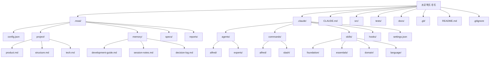

# 프로젝트 초기화 완전 가이드

MoAI-ADK 프로젝트 초기화 과정의 모든 것을 다루는 상세 가이드입니다. 신규 프로젝트 생성부터 기존 프로젝트 추가, 다양한 템플릿 활용, 문제 해결까지 포괄적으로 설명합니다.

## 목차

1. [개요](#개요)
2. [사전 요구사항](#사전-요구사항)
3. [신규 프로젝트 생성](#신규-프로젝트-생성)
4. [기존 프로젝트에 추가](#기존-프로젝트에-추가)
5. [생성되는 파일 구조 상세](#생성되는-파일-구조-상세)
6. [.moai/ 디렉토리 심층 분석](#moai-디렉토리-심층-분석)
7. [.claude/ 디렉토리 심층 분석](#claude-디렉토리-심층-분석)
8. [프로젝트 유형별 템플릿](#프로젝트-유형별-템플릿)
9. [초기화 자동화 설정](#초기화-자동화-설정)
10. [초기화 후 검증](#초기화-후-검증)
11. [문제 해결](#문제-해결)
12. [모범 사례](#모범-사례)

## 개요

MoAI-ADK의 프로젝트 초기화는 단순한 파일 생성을 넘어, AI 지원 개발을 위한 완전한 생태계를 구축하는 과정입니다. 초기화를 통해 다음을 얻을 수 있습니다:

- **Alfred SuperAgent**: 19명의 AI 전문가 팀과 56개의 Claude Skills
- **SPEC-First TDD**: 요구사항 → 테스트 → 코드 → 문서의 일관된 워크플로우
- **@TAG 시스템**: 모든 아티팩트를 연결하는 추적성 네트워크
- **자동화된 Hook**: 개발 흐름을 방해하지 않는 스마트한 보안장치

### 초기화의 핵심 원칙

1. **최소 개입**: 사용자는 프로젝트 이름만 제공
2. **자동 감지**: 언어, 프레임워크, 구조를 자동으로 파악
3. **점진적 설정**: 세부 설정은 `/alfred:0-project`에서 수집
4. **안전한 병합**: 기존 프로젝트에 안전하게 통합

## 사전 요구사항

### 시스템 요구사항

| 항목 | 최소 요구사항 | 권장 사양 |
|------|-------------|----------|
| 운영체제 | Windows 10+, macOS 11+, Ubuntu 20.04+ | 최신 LTS 버전 |
| Python | 3.13+ | 3.13.0+ |
| Git | 2.25+ | 2.40+ |
| 메모리 | 4GB RAM | 8GB+ RAM |
| 저장 공간 | 1GB 여유 공간 | 2GB+ 여유 공간 |

### 필수 도구 설치

#### 1. UV 설치 (Python 패키지 매니저)

UV는 MoAI-ADK의 공식 패키지 매니저입니다.

```bash
# macOS/Linux
curl -LsSf https://astral.sh/uv/install.sh | sh

# Windows (PowerShell)
powershell -c "irm https://astral.sh/uv/install.ps1 | iex"

# 설치 확인
uv --version
```

#### 2. Git 설치 및 설정

```bash
# 설치 확인
git --version

# 기본 설정 (최초 1회)
git config --global user.name "사용자 이름"
git config --global user.email "이메일@example.com"

# Git 저장소 초기화 (신규 프로젝트의 경우)
git init
```

#### 3. MoAI-ADK 설치

```bash
# UV를 통한 설치 (권장)
uv tool install moai-adk

# 또는 pip를 통한 설치
pip install moai-adk

# 설치 확인
moai-adk --version
```

### 선택적 도구

特定の開発スタックに応じて、追加ツールのインストールを推奨します：

```bash
# Python 프로젝트
uv add pytest ruff mypy black

# Node.js 프로젝트
npm install --save-dev eslint prettier typescript

# Go 프로젝트
go install github.com/golangci/golangci-lint/cmd/golangci-lint@latest

# Rust 프로젝트
rustup component add clippy rustfmt
```

## 신규 프로젝트 생성

### 기본 명령어

```bash
# 새 프로젝트 생성
moai-adk init <프로젝트-이름>

# 예시
moai-adk init my-awesome-app
cd my-awesome-app
```

### 고급 옵션

```bash
# 특정 템플릿으로 생성
moai-adk init my-app --template web-api

# 특정 언어로 생성
moai-adk init my-app --language python

# MCP 서버 포함하여 생성
moai-adk init my-app --with-mcp

# 상세 정보 출력
moai-adk init my-app --verbose

# 도움말 확인
moai-adk init --help
```

### 초기화 과정 상세

#### 1단계: 프로젝트 정보 수집

```bash
$ moai-adk init hello-world
🚀 MoAI-ADK v0.17.0 프로젝트 초기화 시작...

📁 생성 위치: /Users/username/projects/hello-world
⚙️ 템플릿: auto-detect (기본값)
🌍 언어: 자동 감지 예정
```

#### 2단계: 디렉토리 구조 생성

```bash
📂 디렉토리 구조 생성 중...
✅ .moai/ - MoAI-ADK 프로젝트 설정
✅ .claude/ - Claude Code 자동화
✅ src/ - 소스 코드 디렉토리
✅ tests/ - 테스트 디렉토리
✅ docs/ - 문서 디렉토리
```

#### 3단계: 설정 파일 생성

```bash
⚙️  설정 파일 생성 중...
✅ .moai/config.json - 프로젝트 설정
✅ .moai/project/ - 프로젝트 정보
✅ .claude/settings.json - Claude Code 설정
✅ CLAUDE.md - 프로젝트 가이드
```

#### 4단계: 에이전트 및 스킬 설치

```bash
🤖 AI 에이전트 설정 중...
✅ 16개 Sub-agent 설치 완료
✅ 74개 Claude Skills 로드 완료
✅ 5개 Claude Code Hooks 활성화
```

#### 5단계: 초기화 완료

```bash
🎉 프로젝트 초기화 완료!

📋 다음 단계:
1. cd hello-world
2. claude (Claude Code 실행)
3. /alfred:0-project (프로젝트 설정 완료)

💡 팁: moai-adk doctor 명령으로 시스템 상태를 확인할 수 있습니다.
```

## 기존 프로젝트에 추가

이미 진행 중인 프로젝트에 MoAI-ADK를 통합할 수 있습니다. 기존 코드는 절대 수정되지 않습니다.

### 기본 통합

```bash
# 기존 프로젝트 디렉토리로 이동
cd your-existing-project

# MoAI-ADK 초기화
moai-adk init .

# 또는 명시적으로 현재 디렉토리 지정
moai-adk init . --force
```

### 통합 전 검증

```bash
# 프로젝트 구조 확인
tree -L 2

# Git 상태 확인
git status

# 필요한 파일 백업 (선택사항)
cp -r . /backup/your-project-$(date +%Y%m%d)
```

### 통합 과정

#### 1단계: 프로젝트 분석

```bash
<span class="material-icons">search</span> 기존 프로젝트 분석 중...
✅ Python 프로젝트 감지 (pyproject.toml 발견)
✅ FastAPI 프레임워크 감지
✅ 이미 25개의 Python 파일 존재
<span class="material-icons">warning</span>  tests/ 디렉토리 발견 (기존 테스트 보존)
```

#### 2단계: 최소한의 파일 추가

```bash
📂 MoAI-ADK 파일 추가 중...
✅ .moai/ - 새로 생성
✅ .claude/ - 새로 생성
✅ CLAUDE.md - 새로 생성
<span class="material-icons">warning</span>  src/, tests/, docs/ 기존 파일 유지
```

#### 3단계: 설정 최적화

```bash
⚙️  기존 프로젝트에 맞게 설정 최적화...
✅ 언어: python (감지됨)
✅ 프레임워크: fastapi (감지됨)
✅ 테스트 도구: pytest (기존 설정 유지)
✅ 문서 형식: markdown (기존 문서 유지)
```

### 기존 프로젝트와의 통합 예시

#### 기존 구조
```
my-api/
├── app/
│   ├── main.py
│   ├── models/
│   └── routes/
├── tests/
│   ├── test_main.py
│   └── conftest.py
├── requirements.txt
├── README.md
└── .git/
```

#### MoAI-ADK 추가 후 구조
```
my-api/
├── .moai/                    # ✅ 새로 추가
│   ├── config.json
│   ├── project/
│   ├── memory/
│   ├── specs/
│   └── reports/
├── .claude/                  # ✅ 새로 추가
│   ├── agents/
│   ├── commands/
│   ├── skills/
│   ├── hooks/
│   └── settings.json
├── CLAUDE.md                 # ✅ 새로 추가
├── app/                      # ✅ 기존 유지
│   ├── main.py
│   ├── models/
│   └── routes/
├── tests/                    # ✅ 기존 유지
│   ├── test_main.py
│   └── conftest.py
├── requirements.txt
├── README.md
└── .git/
```

## 생성되는 파일 구조 상세

### 전체 구조 다이어그램



### 핵심 파일 설명

#### 1. `.moai/config.json` - 프로젝트 심장

```json
{
  "version": "0.17.0",
  "moai": {
    "version": "0.17.0",
    "template_version": "0.17.0",
    "optimized": false
  },
  "language": {
    "conversation_language": "ko",
    "conversation_language_name": "한국어",
    "code_language": "python"
  },
  "project": {
    "name": "my-project",
    "description": "MoAI-ADK로 생성된 프로젝트",
    "owner": "username",
    "mode": "personal",
    "created_at": "2025-11-06T10:00:00Z",
    "domains": ["backend"]
  },
  "github": {
    "enabled": false,
    "auto_delete_branches": true,
    "spec_git_workflow": "develop_direct"
  },
  "report_generation": {
    "enabled": false,
    "level": "minimal"
  },
  "hooks": {
    "timeout_seconds": 5
  },
  "tags": {
    "policy": "strict",
    "auto_validation": true
  },
  "constitution": {
    "trust_principles": true,
    "tdd_workflow": true,
    "spec_first": true
  }
}
```

#### 2. `.moai/project/` - 프로젝트 메타데이터

##### `product.md` - 제품 비전
```markdown
# 제품 비전

## 개요
프로젝트의 핵심 가치와 목표를 정의합니다.

## 타겟 사용자
- 주요 사용자 그룹 정의
- 사용자의 요구사항과 문제점

## 핵심 기능
- 제품이 제공하는 주요 기능
- 차별화된 가치 제안

## 성공 지표
- 제품 성공을 측정하는 KPI
- 단기 및 장기 목표
```

##### `structure.md` - 프로젝트 구조
```markdown
# 프로젝트 구조

## 디렉토리 구조
```
src/
├── core/           # 핵심 비즈니스 로직
├── api/            # API 엔드포인트
├── models/         # 데이터 모델
├── services/       # 서비스 계층
└── utils/          # 유틸리티 함수
```

## 아키텍처 패턴
- 사용하는 아키텍처 패턴 (MVC, 클린 아키텍처 등)
- 레이어별 책임과 상호작용

## 데이터 흐름
- 주요 데이터 흐름 설명
- 외부 시스템과의 연동 방식
```

##### `tech.md` - 기술 스택
```markdown
# 기술 스택

## 핵심 기술
- **언어**: Python 3.13
- **프레임워크**: FastAPI
- **데이터베이스**: PostgreSQL
- **테스트**: pytest

## 개발 도구
- **패키지 관리**: uv
- **코드 포맷팅**: black, ruff
- **타입 검사**: mypy
- **문서**: Sphinx

## 인프라
- **배포**: Docker
- **CI/CD**: GitHub Actions
- **모니터링**: Prometheus + Grafana
```

#### 3. `.claude/settings.json` - Claude Code 설정

```json
{
  "models": {
    "default": "claude-3-5-sonnet-20241022",
    "fast": "claude-3-5-haiku-20241022"
  },
  "permissions": {
    "allow": [
      "Read(*)",
      "Write(src/*, tests/*, docs/*, .moai/*)",
      "Bash(git status, git log, git diff, pytest, python, uv)",
      "Grep(*), Glob(*), Edit(*), Bash(*, cd, ls, mkdir, echo)"
    ],
    "ask": [
      "Bash(git push, git merge, rm -rf)",
      "Write(.claude/*, .moai/config.json)"
    ],
    "deny": [
      "Bash(sudo, rm -rf /, dd)",
      "Write(*.key, *.pem, .env)"
    ]
  },
  "hooks": {
    "SessionStart": ["alfred-hooks"],
    "PreToolUse": ["alfred-hooks"],
    "UserPromptSubmit": ["alfred-hooks"],
    "PostToolUse": ["alfred-hooks"],
    "SessionEnd": ["alfred-hooks"]
  },
  "environment": {
    "PYTHONPATH": "${CLAUDE_PROJECT_DIR}/src",
    "MOAI_PROJECT_ROOT": "${CLAUDE_PROJECT_DIR}"
  }
}
```

## .moai/ 디렉토리 심층 분석

### 디렉토리 구조와 역할

```
.moai/
├── config.json              # 프로젝트 설정 파일
├── project/                 # 프로젝트 문서들
│   ├── product.md           # 제품 비전과 목표
│   ├── structure.md         # 프로젝트 구조 설명
│   └── tech.md              # 기술 스택 명세
├── memory/                  # Alfred의 기억 저장소
│   ├── development-guide.md # 개발 가이드
│   ├── session-notes.md     # 세션 노트
│   ├── decision-log.md      # 의사결정 로그
│   ├── user-preferences.md  # 사용자 선호도
│   ├── project-context.md   # 프로젝트 컨텍스트
│   ├── learning-history.md  # 학습 이력
│   └── expertise-profile.md # 전문성 프로필
├── specs/                   # SPEC 문서 저장소
│   └── SPEC-XXX-XXX/
│       ├── spec.md          # 주요 SPEC 문서
│       ├── plan.md          # 구현 계획
│       ├── acceptance.md    # 수용 기준
│       └── history.md       # 변경 이력
└── reports/                 # 분석 리포트
    ├── sync-report-*.md     # 동기화 리포트
    ├── quality-report-*.md  # 품질 리포트
    └── analysis-*.md        # 분석 리포트
```

### memory/ 디렉토리 상세

#### `development-guide.md`
Alfred가 학습한 개발 패턴과 모범 사례를 저장합니다.

```markdown
# 개발 가이드

## 코드 스타일
- 함수는 50줄 이내로 작성
- 변수명은 명확하게
- 타입 힌트 사용

## 테스트 패턴
- AAA 패턴 (Arrange, Act, Assert)
- 테스트 이름은 명확하게
- Edge case 테스트 필수

## Git 커밋 메시지
- feat: 새 기능
- fix: 버그 수정
- refactor: 리팩토링
- test: 테스트 관련
```

#### `session-notes.md`
개발 세션 중의 중요한 발견과 결정사항을 기록합니다.

```markdown
# 세션 노트

## 2025-11-06 세션
### 주요 활동
- 사용자 인증 API 구현 (AUTH-001)
- 테스트 커버리지 92% 달성

### 발견된 사항
- FastAPI의 의존성 주입이 테스트에 유리
- JWT 토큰 만료 처리 개선 필요

### 다음 단계
- 리프레시 토큰 구현
- 보안 강화 조치
```

### specs/ 디렉토리 상세

SPEC 문서는 MoAI-ADK의 핵심입니다. 모든 개발은 SPEC에서 시작합니다.

#### SPEC 문서 구조
```
.moai/specs/SPEC-AUTH-001/
├── spec.md              # 메인 SPEC 문서
├── plan.md              # 구현 계획
├── acceptance.md        # 수용 기준
├── history.md           # 변경 이력
└── reviews/             # 리뷰 기록
    ├── review-1.md
    └── review-2.md
```

#### `spec.md` 예시
```yaml
---
id: AUTH-001
version: 1.0.0
status: completed
priority: high
created: 2025-11-06T10:00:00Z
updated: 2025-11-06T15:30:00Z
author: Alfred
reviewer: username
---

# `@SPEC:AUTH-001: 사용자 인증 시스템

## 개요
사용자 인증을 위한 JWT 기반 시스템 구현

## Ubiquitous Requirements (기본 요구사항)
- 시스템은 JWT 기반 인증을 제공해야 한다
- 사용자는 이메일과 비밀번호로 로그인할 수 있어야 한다
- 인증된 사용자는 보호된 리소스에 접근할 수 있어야 한다

## Event-driven Requirements (조건부 요구사항)
- WHEN 유효한 자격증명이 제공되면, 시스템은 JWT 토큰을 발급해야 한다
- WHEN 만료된 토큰이 제공되면, 시스템은 401 에러를 반환해야 한다
- WHILE 사용자가 인증된 상태일 때, 시스템은 보호된 리소스 접근을 허용해야 한다

## Optional Requirements (선택 요구사항)
- WHERE 리프레시 토큰이 있으면, 시스템은 새 액세스 토큰을 발급할 수 있다
- WHERE 소셜 로그인이 설정되면, 사용자는 소셜 계정으로 인증할 수 있다

## Unwanted Behaviors (금지 동작)
- 시스템은 평문 비밀번호를 저장해서는 안 된다
- 시스템은 무효한 토큰으로 리소스 접근을 허용해서는 안 된다
- 시스템은 rate limiting 없이 로그인을 허용해서는 안 된다

## Constraints (제약 조건)
- 비밀번호는 최소 8자, 최대 128자여야 한다
- JWT 토큰 만료 시간은 15분을 초과하지 않아야 한다
- 로그인 시도는 분당 5회로 제한해야 한다
```

## .claude/ 디렉토리 심층 분석

### 디렉토리 구조와 역할

```
.claude/
├── agents/                  # Sub-agent 정의
│   ├── alfred/              # Alfred 핵심 에이전트
│   │   ├── project-manager.md
│   │   ├── spec-builder.md
│   │   ├── code-builder.md
│   │   ├── doc-syncer.md
│   │   ├── tag-agent.md
│   │   ├── git-manager.md
│   │   ├── debug-helper.md
│   │   ├── trust-checker.md
│   │   ├── quality-gate.md
│   │   └── cc-manager.md
│   └── experts/             # 도메인 전문가 에이전트
│       ├── backend-expert.md
│       ├── frontend-expert.md
│       ├── ui-ux-expert.md
│       ├── devops-expert.md
│       └── security-expert.md
├── commands/                # 슬래시 명령어 정의
│   ├── alfred/              # Alfred 명령어
│   │   ├── 0-project.md
│   │   ├── 1-plan.md
│   │   ├── 2-run.md
│   │   ├── 3-sync.md
│   │   └── 9-feedback.md
│   └── slash/               # 일반 슬래시 명령어
│       ├── help.md
│       ├── status.md
│       └── debug.md
├── skills/                  # Claude Skills
│   ├── foundation/          # 기초 스킬
│   │   ├── trust.md
│   │   ├── tags.md
│   │   ├── specs.md
│   │   ├── ears.md
│   │   ├── git.md
│   │   └── langs.md
│   ├── essentials/          # 필수 스킬
│   │   ├── debug.md
│   │   ├── perf.md
│   │   ├── refactor.md
│   │   └── review.md
│   ├── alfred/              # Alfred 전용 스킬
│   │   ├── workflow.md
│   │   ├── language-detection.md
│   │   ├── spec-validation.md
│   │   └── ask-user-questions.md
│   ├── domain/              # 도메인 스킬
│   │   ├── backend.md
│   │   ├── frontend.md
│   │   ├── database.md
│   │   ├── security.md
│   │   ├── devops.md
│   │   └── mobile-app.md
│   └── language/            # 언어 스킬
│       ├── python.md
│       ├── typescript.md
│       ├── javascript.md
│       ├── go.md
│       ├── rust.md
│       └── sql.md
├── hooks/                   # Claude Code Hooks
│   └── alfred/
│       ├── alfred_hooks.py  # 메인 Hook 스크립트
│       ├── core/
│       │   ├── checkpoint.py
│       │   ├── risk_detector.py
│       │   ├── tag_guard.py
│       │   └── session_manager.py
│       └── utils/
│           ├── file_utils.py
│           └── git_utils.py
├── settings.json            # Claude Code 설정
└── mcp.json                 # MCP 서버 설정 (선택사항)
```

### agents/ 디렉토리 상세

#### Alfred 핵심 에이전트

##### `project-manager.md`
```markdown
# Project Manager Agent

## 역할
프로젝트 초기화와 메타데이터 관리를 담당합니다.

## 주요 기능
- 프로젝트 설정 수집
- 언어 및 프레임워크 감지
- 적절한 Skill Pack 추천
- 프로젝트 구조 설계

## 활성화 조건
- `/alfred:0-project` 명령 실행
- 새 프로젝트 초기화 필요

## 사용 모델
- 기본: Claude 3.5 Sonnet
- 단순 작업: Claude 3.5 Haiku
```

##### `spec-builder.md`
```markdown
# Spec Builder Agent

## 역할
EARS 형식으로 명확한 SPEC 문서를 작성합니다.

## 주요 기능
- 요구사항 분석 및 구조화
- EARS 패턴 적용
- Plan Board 생성
- 수용 기준 정의

## 활성화 조건
- `/alfred:1-plan` 명령 실행
- SPEC 작성 필요

## 전문 지식
- EARS (Easy Approach to Requirements Syntax)
- 요구사항 공학
- 시스템 설계
```

### commands/ 디렉토리 상세

#### Alfred 명령어 구조

##### `0-project.md` - 프로젝트 초기화
```markdown
# /alfred:0-project

## 설명
프로젝트 초기화와 설정을 관리하는 명령어입니다.

## 사용법
```bash
/alfred:0-project                    # 자동 감지 모드
/alfred:0-project setting           # 설정 수정 모드
/alfred:0-project update            # 템플릿 최적화 모드
```

## 단계별 프로세스
1. 프로젝트 상태 분석
2. 사용자 정보 수집 (필요시)
3. 적절한 설정 적용
4. Skill Pack 배치
5. 초기화 보고

## 예상 결과
- 완전히 설정된 `.moai/config.json`
- 프로젝트 문서 5종 생성
- 추천 Skill Pack 로드
```

### skills/ 디렉토리 상세

#### Foundation Skills

##### `trust.md` - TRUST 5원칙
```markdown
# TRUST 5 Principles Skill

## 설명
모든 코드는 TRUST 5원칙을 만족해야 합니다.

## 원칙
1. **Test First**: 테스트가 먼저 작성되어야 함
2. **Readable**: 읽기 쉬운 코드여야 함
3. **Unified**: 일관된 구조를 유지해야 함
4. **Secured**: 보안을 고려해야 함
5. **Trackable**: 추적 가능해야 함

## 검증 기준
- 테스트 커버리지 ≥ 85%
- 함수 ≤ 50줄
- 일관된 명명 규칙
- 입력 검증
- @TAG 시스템 사용

## 적용 방법
- 코드 리뷰 시 자동 검증
- `/alfred:3-sync` 실행 시 확인
- Pull Request 요구사항
```

### hooks/ 디렉토리 상세

#### Hook 아키텍처

```python
# alfred_hooks.py
import os
import sys
import json
from pathlib import Path

def main():
    """메인 Hook 진입점"""
    hook_name = os.environ.get('CLAUDE_HOOK_NAME')
    project_dir = os.environ.get('CLAUDE_PROJECT_DIR')

    if hook_name == 'SessionStart':
        session_start(project_dir)
    elif hook_name == 'PreToolUse':
        pre_tool_use(project_dir)
    # ... 다른 Hook들

def session_start(project_dir: str):
    """세션 시작 시 프로젝트 상태 요약"""
    config_path = Path(project_dir) / '.moai' / 'config.json'

    if config_path.exists():
        with open(config_path) as f:
            config = json.load(f)

        print(f"📋 프로젝트: {config['project']['name']}")
        print(f"🌍 언어: {config['language']['conversation_language_name']}")
        print(f"🤖 Alfred 준비 완료")
```

## 프로젝트 유형별 템플릿

MoAI-ADK는 다양한 프로젝트 유형에 맞는 템플릿을 제공합니다.

### 1. Web API 템플릿

```bash
moai-adk init my-api --template web-api
```

#### 특징
- FastAPI/Express/NestJS 기본 구조
- RESTful API 가이드라인
- API 문서 자동화 설정
- JWT 인증 기본 구조

#### 생성되는 구조
```
my-api/
├── src/
│   ├── api/
│   │   ├── __init__.py
│   │   ├── dependencies.py
│   │   └── middleware.py
│   ├── models/
│   │   ├── __init__.py
│   │   └── base.py
│   ├── schemas/
│   │   ├── __init__.py
│   │   └── common.py
│   └── main.py
├── tests/
│   ├── api/
│   └── conftest.py
├── docs/
│   └── api/
└── .moai/specs/SPEC-API-001/
```

### 2. CLI 도구 템플릿

```bash
moai-adk init my-cli --template cli-tool
```

#### 특징
- Click/argparse 기본 구조
- 커맨드 라인 인터페이스 가이드
- 설정 파일 처리
- 로깅 시스템

#### 생성되는 구조
```
my-cli/
├── src/
│   ├── my_cli/
│   │   ├── __init__.py
│   │   ├── main.py
│   │   ├── commands/
│   │   └── config/
│   └── my_cli.py
├── tests/
│   └── unit/
├── docs/
│   └── usage/
└── .moai/specs/SPEC-CLI-001/
```

### 3. 데이터 분석 템플릿

```bash
moai-adk init my-analysis --template data-science
```

#### 특징
- Jupyter Notebook 기본 구조
- pandas/numpy 설정
- 데이터 시각화 설정
- 실험 추적 시스템

#### 생성되는 구조
```
my-analysis/
├── notebooks/
│   ├── 01-exploration.ipynb
│   └── 02-analysis.ipynb
├── src/
│   ├── data/
│   │   ├── __init__.py
│   │   ├── loading.py
│   │   └── cleaning.py
│   └── analysis/
│       ├── __init__.py
│       └── statistics.py
├── data/
│   ├── raw/
│   └── processed/
├── tests/
└── .moai/specs/SPEC-DATA-001/
```

### 4. 모바일 앱 템플릿

```bash
moai-adk init my-app --template mobile-app
```

#### 특징
- Flutter/React Native 기본 구조
- 상태 관리 설정
- API 통신 레이어
- 테스트 환경

#### 생성되는 구조
```
my-app/
├── lib/
│   ├── main.dart
│   ├── app/
│   │   ├── screens/
│   │   ├── widgets/
│   │   └── services/
│   └── core/
│       ├── constants.dart
│       └── themes.dart
├── test/
├── integration_test/
├── docs/
└── .moai/specs/SPEC-MOBILE-001/
```

### 5. 머신러닝 템플릿

```bash
moai-adk init my-ml --template ml-project
```

#### 특징
- 모델 훈련/추론 구조
- 데이터 파이프라인
- 실험 관리 (MLflow)
- 모델 서빙 API

#### 생성되는 구조
```
my-ml/
├── src/
│   ├── models/
│   │   ├── __init__.py
│   │   ├── base.py
│   │   └── training.py
│   ├── data/
│   │   ├── __init__.py
│   │   ├── preprocessing.py
│   │   └── loading.py
│   └── inference/
│       ├── __init__.py
│       └── predict.py
├── experiments/
├── models/
├── data/
├── tests/
└── .moai/specs/SPEC-ML-001/
```

### 템플릿 선택 가이드

| 프로젝트 유형 | 추천 템플릿 | 주요 특징 | 적합한 상황 |
|--------------|-------------|-----------|-----------|
| 웹 백엔드 | `web-api` | REST API, 데이터베이스 연동 | API 서버, 마이크로서비스 |
| 커맨드라인 도구 | `cli-tool` | CLI 인터페이스, 설정 관리 | 개발 도구, 유틸리티 |
| 데이터 분석 | `data-science` | Jupyter, pandas, 시각화 | 연구 프로젝트, 분석 |
| 모바일 앱 | `mobile-app` | Flutter/React Native | iOS/Android 앱 |
| 머신러닝 | `ml-project` | 모델 훈련, 실험 관리 | ML 프로젝트, 연구 |
| 일반적 | `default` | 범용 구조 | 기타 프로젝트 |

## 초기화 자동화 설정

### 환경 변수 설정

MoAI-ADK 초기화 시 환경 변수를 통해 기본값을 설정할 수 있습니다.

```bash
# 기본 설정
export MOAI_DEFAULT_LANGUAGE="ko"
export MOAI_DEFAULT_OWNER="username"
export MOAI_DEFAULT_MODE="personal"

# GitHub 통합
export MOAI_GITHUB_ENABLED="true"
export MOAI_GITHUB_AUTO_DELETE_BRANCHES="true"

# 보고서 설정
export MOAI_REPORT_GENERATION="minimal"

# Hook 설정
export MOAI_HOOK_TIMEOUT="5"
```

### 초기화 스크립트

반복적인 초기화를 자동화하는 스크립트 예시:

```bash
#!/bin/bash
# init-moai-project.sh

set -e

# 인자 확인
if [ $# -eq 0 ]; then
    echo "Usage: $0 <project-name> [template]"
    exit 1
fi

PROJECT_NAME=$1
TEMPLATE=${2:-"default"}

# 환경 변수 설정
export MOAI_DEFAULT_LANGUAGE="ko"
export MOAI_DEFAULT_OWNER="$(git config user.name)"
export MOAI_GITHUB_ENABLED="true"

# 프로젝트 생성
echo "🚀 Creating MoAI-ADK project: $PROJECT_NAME"
moai-adk init "$PROJECT_NAME" --template "$TEMPLATE"

# 프로젝트 디렉토리 이동
cd "$PROJECT_NAME"

# Git 초기화
echo "📦 Initializing Git repository"
git init
git add .
git commit -m "🎉 Initial commit with MoAI-ADK"

# 가상환경 설정 (Python 프로젝트의 경우)
if [ "$TEMPLATE" = "web-api" ] || [ "$TEMPLATE" = "default" ]; then
    echo "🐍 Setting up Python virtual environment"
    uv venv
    source .venv/bin/activate
    uv add pytest ruff mypy
fi

# 안내 메시지
echo "✅ Project '$PROJECT_NAME' created successfully!"
echo "📋 Next steps:"
echo "   1. cd $PROJECT_NAME"
echo "   2. claude"
echo "   3. /alfred:0-project"
```

### Docker 통합 초기화

```bash
#!/bin/bash
# init-with-docker.sh

PROJECT_NAME=$1
TEMPLATE=${2:-"web-api"}

# 프로젝트 생성
moai-adk init "$PROJECT_NAME" --template "$TEMPLATE"

cd "$PROJECT_NAME"

# Dockerfile 생성
cat > Dockerfile << 'EOF'
FROM python:3.13-slim

WORKDIR /app

COPY requirements.txt .
RUN pip install -r requirements.txt

COPY src/ ./src/
COPY tests/ ./tests/

EXPOSE 8000

CMD ["uvicorn", "src.main:app", "--host", "0.0.0.0", "--port", "8000"]
EOF

# docker-compose.yml 생성
cat > docker-compose.yml << 'EOF'
version: '3.8'

services:
  app:
    build: .
    ports:
      - "8000:8000"
    environment:
      - DATABASE_URL=postgresql://user:pass@db:5432/mydb
    depends_on:
      - db

  db:
    image: postgres:15
    environment:
      - POSTGRES_DB=mydb
      - POSTGRES_USER=user
      - POSTGRES_PASSWORD=pass
    volumes:
      - postgres_data:/var/lib/postgresql/data

volumes:
  postgres_data:
EOF

echo "🐳 Docker configuration added"
```

## 초기화 후 검증

### 시스템 진단

```bash
# 기본 진단
moai-adk doctor

# 상세 진단
moai-adk doctor --verbose

# 특정 항목 확인
moai-adk doctor --check python,git,uv
```

#### 진단 항목 상세

1. **Python 환경**
   - 버전 확인 (3.13+)
   - 가상환경 상태
   - PATH 설정

2. **Git 설정**
   - 버전 확인
   - 사용자 설정
   - 저장소 상태

3. **MoAI-ADK 구조**
   - .moai/ 디렉토리
   - .claude/ 디렉토리
   - 설정 파일 무결성

4. **의존성**
   - uv 설치 상태
   - 필수 패키지
   - 선택적 도구

### 파일 구조 검증

```bash
# 전체 구조 확인
tree -L 3

# 핵심 파일 확인
ls -la .moai/config.json
ls -la .claude/settings.json
ls -la CLAUDE.md

# 에이전트 확인
find .claude/agents -name "*.md" | wc -l
# 예상 출력: 16

# 스킬 확인
find .claude/skills -name "*.md" | wc -l
# 예상 출력: 74
```

### 설정 파일 검증

```bash
# config.json 문법 확인
python3 -c "import json; json.load(open('.moai/config.json'))"

# CLAUDE.md 내용 확인
head -20 CLAUDE.md

# Hook 설정 확인
python3 -c "import json; json.load(open('.claude/settings.json'))"
```

### Alfred 기능 테스트

```bash
# Claude Code 실행
claude

# Alfred 테스트
/alfred:0-project

# 명령어 목록 확인
/help

# 세션 정보 확인
/alfred:session-info
```

### 샘플 SPEC 생성 테스트

```bash
# 간단한 SPEC 생성 테스트
/alfred:1-plan "간단한 Hello World API"

# 생성된 SPEC 확인
ls -la .moai/specs/
cat .moai/specs/SPEC-HELLO-001/spec.md
```

## 문제 해결

### 일반적인 초기화 문제

#### 1. 권한 오류

**증상**:
```
Permission denied: .moai/config.json
```

**원인**: 파일 시스템 권한 문제

**해결**:
```bash
# 소유자 확인
ls -la

# 권한 수정
chmod 755 .
chmod 644 .moai/config.json

# 또는 sudo 사용 (권장하지 않음)
sudo moai-adk init my-project
```

#### 2. 경로 오류

**증상**:
```
Error: Directory already exists and is not empty
```

**원인**: 대상 디렉토리가 비어있지 않음

**해결**:
```bash
# 방법 1: 빈 디렉토리 생성
mkdir new-project
cd new-project
moai-adk init .

# 방법 2: 기존 프로젝트에 추가
moai-adk init . --force

# 방법 3: 다른 이름 사용
moai-adk init my-project-v2
```

#### 3. 네트워크 오류

**증상**:
```
Error: Failed to download template
```

**원인**: 인터넷 연결 또는 PyPI 접속 문제

**해결**:
```bash
# 네트워크 확인
ping pypi.org

# 프록시 설정 (필요시)
export https_proxy=http://proxy.company.com:8080
export http_proxy=http://proxy.company.com:8080

# 오프라인 모드 (로컬 템플릿)
moai-adk init my-project --offline
```

#### 4. 버전 호환성 문제

**증상**:
```
Error: Python 3.11 found, but 3.13+ required
```

**원인**: Python 버전 호환성 문제

**해결**:
```bash
# pyenv로 Python 버전 관리
pyenv install 3.13.0
pyenv local 3.13.0

# 또는 uv로 Python 자동 관리
uv python install 3.13
uv python pin 3.13

# 확인
python --version
```

### 복구 절차

#### 초기화 실패 시 복구

```bash
#!/bin/bash
# recover-init.sh

PROJECT_NAME=$1

# 실패한 디렉토리 정리
echo "🧹 Cleaning up failed initialization..."
rm -rf "$PROJECT_NAME"

# 시스템 상태 확인
echo "<span class="material-icons">search</span> Checking system state..."
moai-adk doctor

# 재시도
echo "🔄 Retrying initialization..."
moai-adk init "$PROJECT_NAME"

# 검증
echo "✅ Verifying initialization..."
cd "$PROJECT_NAME"
moai-adk doctor
```

#### 설정 파일 손상 복구

```bash
# 설정 파일 백업 확인
ls -la .moai/backups/

# 백업에서 복원
cp .moai/backups/config.json.backup .moai/config.json

# 또는 재생성
moai-adk init . --restore-config
```

### 로그 분석

#### 초기화 로그 확인

```bash
# MoAI-ADK 로그 위치
ls -la ~/.moai/logs/

# 최신 로그 확인
tail -f ~/.moai/logs/latest.log

# 오류 로그 필터링
grep "ERROR" ~/.moai/logs/latest.log
```

#### Claude Code 로그 확인

```bash
# Claude Code 로그 위치
ls -la ~/.claude/logs/

# 세션 로그 확인
cat ~/.claude/projects/*/session-*.log | tail -20
```

## 모범 사례

### 프로젝트 명명 규칙

```bash
# 좋은 예시
moai-adk init user-auth-service
moai-adk init data-analytics-platform
moai-adk init mobile-shopping-app
moai-adk init cli-deployment-tool

# 피해야 할 예시
moai-adk init project1
moai-adk init test
moai-adk init temp
moai-adk init my-app-v2.0.1-beta
```

### 디렉토리 구조 모범 사례

#### 성공적인 프로젝트 구조
```
awesome-api/
├── .moai/                   # ✅ 명확한 MoAI-ADK 설정
├── .claude/                 # ✅ Claude Code 자동화
├── src/                     # ✅ 소스 코드 논리적 분리
│   ├── core/               # ✅ 핵심 비즈니스 로직
│   ├── api/                # ✅ API 계층
│   ├── models/             # ✅ 데이터 모델
│   └── services/           # ✅ 서비스 계층
├── tests/                   # ✅ 테스트 코드 분리
│   ├── unit/               # ✅ 단위 테스트
│   ├── integration/        # ✅ 통합 테스트
│   └── e2e/                # ✅ 엔드투엔드 테스트
├── docs/                    # ✅ 문서화
├── scripts/                 # ✅ 유틸리티 스크립트
├── docker/                  # ✅ Docker 설정
└── README.md                # ✅ 프로젝트 설명
```

### 초기화 체크리스트

#### 사전 확인
- [ ] Python 3.13+ 설치됨
- [ ] uv 설치됨
- [ ] Git 설정됨
- [ ] MoAI-ADK 최신 버전 설치됨
- [ ] 충분한 디스크 공간 확보
- [ ] 안정적인 네트워크 연결

#### 초기화 중
- [ ] 적절한 프로젝트 이름 선택
- [ ] 올바른 템플릿 선택
- [ ] 권장 도구 설치 확인
- [ ] 생성되는 파일 구조 이해

#### 초기화 후
- [ ] `moai-adk doctor` 실행
- [ ] Git 저장소 초기화
- [ ] 첫 커밋 생성
- [ ] `/alfred:0-project` 실행
- [ ] 샘플 SPEC 생성 테스트

### 팀 협업 모범 사례

#### 팀 표준 설정

```bash
# 팀 표준 설정 스크립트
#!/bin/bash
# setup-team-standards.sh

# 팀 공통 설정
export MOAI_DEFAULT_LANGUAGE="ko"
export MOAI_DEFAULT_OWNER="$(git config user.name)"
export MOAI_GITHUB_ENABLED="true"
export MOAI_REPORT_GENERATION="enable"

# 팀 표준 템플릿
TEAM_TEMPLATES=("web-api" "cli-tool" "data-science")

for template in "${TEAM_TEMPLATES[@]}"; do
    echo "📦 Setting up template: $template"
    moai-adk init "example-$template" --template "$template"
    cd "example-$template"

    # 팀 표준 설정 적용
    /alfred:0-project

    # 문서화
    echo "<span class="material-icons">menu_book</span> Team standard setup for $template" > TEAM_SETUP.md

    cd ..
done
```

#### 문서화 표준

```markdown
# 팀 프로젝트 초기화 가이드

## 1. 프로젝트 생성
```bash
moai-adk init project-name --template web-api
```

## 2. 초기 설정
- `/alfred:0-project` 실행
- 팀 설정 적용
- GitHub 연동

## 3. 첫 기능 개발
- `/alfred:1-plan`으로 SPEC 작성
- `/alfred:2-run`으로 TDD 구현
- `/alfred:3-sync`로 문서 동기화

## 4. 코드 리뷰
- PR 생성 시 TAG 체인 확인
- TRUST 5원칙 검증
- 자동화된 품질 검사 통과
```

---

이 가이드를 통해 MoAI-ADK 프로젝트 초기화의 모든 단계를 이해하고 성공적으로 프로젝트를 시작할 수 있습니다. 초기화는 단순한 파일 생성을 넘어, AI 지원 개발을 위한 강력한 기반을 구축하는 과정임을 기억하세요.