# Complete Project Configuration Guide

A guide that explains in detail all configuration options for MoAI-ADK projects. Covers every aspect of project configuration from language settings to GitHub integration, agent optimization, and personalization settings.

## Table of Contents

01. [Overview](#overview)
02. [Core Configuration Files](#core-configuration-files)
03. [Language and Localization Settings](#language-and-localization-settings)
04. [Project Metadata Configuration](#project-metadata-configuration)
05. [GitHub Integration Settings](#github-integration-settings)
06. [Report Generation Control](#report-generation-control)
07. [Git Workflow Configuration](#git-workflow-configuration)
08. [Hook Configuration Optimization](#hook-configuration-optimization)
09. [Agent Configuration](#agent-configuration)
10. [TAG System Configuration](#tag-system-configuration)
11. [TRUST 5 Principles Configuration](#trust-5-principles-configuration)
12. [Personalization Settings](#personalization-settings)
13. [Configuration File Backup and Restore](#configuration-file-backup-and-restore)
14. [Configuration Optimization Strategies](#configuration-optimization-strategies)
15. [Troubleshooting](#troubleshooting)

## Overview

The MoAI-ADK configuration system is designed with flexibility and extensibility at its core. Beyond simple environment settings, you can control everything from AI agent behavior to development workflows and team collaboration methods.

### Core Principles of the Configuration System

1. **Hierarchical Structure**: Defaults → Project settings → User personalization
2. **Auto-Detection**: Automatically detect as many settings as possible
3. **Progressive Disclosure**: Expose only necessary settings, minimize complexity
4. **Safe Defaults**: Default settings prioritizing security and stability
5. **Team Compatibility**: Personal settings don't break team standards

### Configuration File Structure

```
.moai/
├── config.json              # Main configuration file
├── user-config.json         # User personal settings (optional)
├── team-config.json         # Team common settings (optional)
└── environment-config.json  # Environment-specific settings (optional)

.claude/
├── settings.json            # Claude Code configuration
├── mcp.json                 # MCP server configuration
└── permissions.json         # Permission settings (optional)
```

## Core Configuration Files

### `.moai/config.json` - Main Configuration File

File managing all core project settings.

```json
{
  "version": "0.17.0",
  "moai": {
    "version": "0.17.0",
    "template_version": "0.17.0",
    "optimized": false,
    "auto_update": true
  },
  "language": {
    "conversation_language": "ko",
    "conversation_language_name": "한국어",
    "code_language": "python",
    "locale": "ko-KR",
    "timezone": "Asia/Seoul"
  },
  "project": {
    "name": "my-awesome-project",
    "description": "AI-based innovative project",
    "owner": "username",
    "team": "development-team",
    "mode": "personal",
    "created_at": "2025-11-06T10:00:00Z",
    "updated_at": "2025-11-06T15:30:00Z",
    "domains": ["backend", "api", "database"],
    "tags": ["fastapi", "postgresql", "docker"],
    "visibility": "private"
  },
  "github": {
    "enabled": true,
    "repository": "username/my-awesome-project",
    "default_branch": "main",
    "auto_delete_branches": true,
    "spec_git_workflow": "feature_branch",
    "require_review": true,
    "auto_merge": false,
    "issue_sync": true,
    "release_automation": true
  },
  "report_generation": {
    "enabled": true,
    "level": "minimal",
    "formats": ["markdown"],
    "auto_commit": true,
    "include_metrics": true,
    "include_changelog": true,
    "max_file_size_kb": 100
  },
  "hooks": {
    "timeout_seconds": 5,
    "auto_checkpoint": true,
    "risk_detection": true,
    "tag_validation": true,
    "auto_linting": true,
    "session_recording": true
  },
  "tags": {
    "policy": "strict",
    "auto_validation": true,
    "format": "@TYPE:DOMAIN-NNN",
    "required_types": ["SPEC", "TEST", "CODE", "DOC"],
    "auto_assignment": true,
    "orphan_detection": true
  },
  "constitution": {
    "trust_principles": true,
    "tdd_workflow": true,
    "spec_first": true,
    "code_review_required": false,
    "documentation_required": true
  },
  "ai": {
    "default_model": "claude-3-5-sonnet-20241022",
    "fast_model": "claude-3-5-haiku-20241022",
    "max_tokens": 100000,
    "temperature": 0.1,
    "timeout": 300,
    "retry_attempts": 3
  },
  "security": {
    "scan_dependencies": true,
    "scan_secrets": true,
    "require_authentication": false,
    "audit_log": true,
    "encryption_at_rest": false
  },
  "performance": {
    "parallel_processing": true,
    "cache_enabled": true,
    "cache_ttl": 3600,
    "memory_limit_mb": 1024,
    "concurrent_agents": 3
  }
}
```

### `.claude/settings.json` - Claude Code Configuration

Configuration file controlling Claude Code behavior.

```json
{
  "models": {
    "default": "claude-3-5-sonnet-20241022",
    "fast": "claude-3-5-haiku-20241022",
    "reasoning": "claude-3-5-sonnet-20241022"
  },
  "permissions": {
    "allow": [
      "Read(*)",
      "Write(src/*, tests/*, docs/*, .moai/*)",
      "Bash(git status, git log, git diff, pytest, python, uv, node, npm)",
      "Grep(*), Glob(*), Edit(*), Bash(*, cd, ls, mkdir, echo, cat)"
    ],
    "ask": [
      "Bash(git push, git merge, git pull, rm -rf)",
      "Write(.claude/*, .moai/config.json, .env*)",
      "Bash(sudo, docker exec)"
    ],
    "deny": [
      "Bash(sudo rm, dd, mkfs, format)",
      "Write(*.key, *.pem, id_rsa)",
      "Bash(curl -X DELETE, wget -qO-)"
    ]
  },
  "hooks": {
    "SessionStart": ["alfred-hooks"],
    "PreToolUse": ["alfred-hooks"],
    "UserPromptSubmit": ["alfred-hooks"],
    "PostToolUse": ["alfred-hooks"],
    "SessionEnd": ["alfred-hooks"],
    "timeout": 5
  },
  "environment": {
    "PYTHONPATH": "${CLAUDE_PROJECT_DIR}/src",
    "MOAI_PROJECT_ROOT": "${CLAUDE_PROJECT_DIR}",
    "PATH": "${CLAUDE_PROJECT_DIR}/.venv/bin:${PATH}"
  },
  "ui": {
    "theme": "dark",
    "font_size": 14,
    "line_numbers": true,
    "word_wrap": true,
    "auto_save": true
  },
  "features": {
    "auto_completion": true,
    "syntax_highlighting": true,
    "inline_errors": true,
    "quick_actions": true
  },
  "experimental": {
    "multimodal": false,
    "advanced_reasoning": true,
    "context_compression": true
  }
}
```

## Language and Localization Settings

### Language Configuration Options

#### conversation_language (Conversation Language)

Language used for all interactions with Alfred.

```json
{
  "language": {
    "conversation_language": "ko",
    "conversation_language_name": "한국어",
    "supported_languages": {
      "ko": "한국어",
      "en": "English",
      "ja": "日本語",
      "zh": "中文",
      "es": "Español"
    }
  }
}
```

**Supported Languages**:

| Code | Language | Support Level | Notes                        |
| ---- | -------- | ------------- | ---------------------------- |
| ko   | 한국어   | Complete      | Default language             |
| en   | English  | Complete      | Global standard              |
| ja   | 日本語   | Complete      | Japanese support             |
| zh   | 中文     | Complete      | Chinese simplified/traditional |
| es   | Español  | Complete      | Spanish support              |
| fr   | Français | Partial       | French (in development)      |
| de   | Deutsch  | Partial       | German (in development)      |

#### code_language (Programming Language)

Primary programming language setting for the project.

```json
{
  "language": {
    "code_language": "python",
    "auto_detection": true,
    "fallback": "python",
    "multi_language": {
      "enabled": false,
      "primary": "python",
      "secondary": ["javascript", "sql"]
    }
  }
}
```

**Supported Programming Languages**:

| Language   | Auto-detect Files                          | Default Tools            | Template Support |
| ---------- | ------------------------------------------ | ------------------------ | ---------------- |
| python     | pyproject.toml, setup.py, requirements.txt | pytest, ruff, mypy       | ✅               |
| javascript | package.json, yarn.lock                    | jest, eslint, prettier   | ✅               |
| typescript | tsconfig.json, package.json                | typescript, eslint, prettier | ✅           |
| go         | go.mod, go.sum                             | go test, golint, gofmt   | ✅               |
| rust       | Cargo.toml                                 | cargo test, clippy, rustfmt | ✅            |
| java       | pom.xml, build.gradle                      | junit, maven, gradle     | ✅               |
| kotlin     | build.gradle.kts                           | junit, ktlint            | ✅               |
| ruby       | Gemfile                                    | rspec, rubocop           | ✅               |
| php        | composer.json                              | phpunit, phpstan         | ✅               |
| csharp     | *.csproj, *.sln                            | xunit, dotnet            | ✅               |
| sql        | *.sql, schema.sql                          | -                        | ⚠️ Limited      |

#### locale Settings

Configure localization-related formatting rules.

```json
{
  "language": {
    "locale": "ko-KR",
    "timezone": "Asia/Seoul",
    "date_format": "YYYY-MM-DD",
    "time_format": "HH:mm:ss",
    "currency": "KRW",
    "number_format": {
      "decimal_separator": ".",
      "thousands_separator": ","
    }
  }
}
```

### Language Configuration Optimization

#### Automatic Language Detection

```python
# .claude/hooks/alfred/utils/language_detector.py
import os
from pathlib import Path

def detect_project_language(project_dir: Path) -> dict:
    """Automatically detect project language"""
    indicators = {
        'python': ['pyproject.toml', 'setup.py', 'requirements.txt', 'Pipfile'],
        'javascript': ['package.json', 'yarn.lock', 'package-lock.json'],
        'typescript': ['tsconfig.json', 'package.json'],
        'go': ['go.mod', 'go.sum'],
        'rust': ['Cargo.toml'],
        'java': ['pom.xml', 'build.gradle'],
        'ruby': ['Gemfile', 'Rakefile'],
        'php': ['composer.json', 'composer.lock']
    }

    project_files = os.listdir(project_dir)

    for language, files in indicators.items():
        if any(file in project_files for file in files):
            return {
                'detected_language': language,
                'confidence': 'high',
                'indicators': [f for f in files if f in project_files]
            }

    return {'detected_language': 'python', 'confidence': 'low'}
```

#### Multi-language Project Configuration

```json
{
  "language": {
    "multi_language": {
      "enabled": true,
      "primary": "python",
      "secondary": ["javascript", "sql"],
      "bridging": {
        "enabled": true,
        "apis": ["grpc", "rest"],
        "data_formats": ["json", "protobuf"]
      }
    },
    "documentation": {
      "primary": "ko",
      "secondary": ["en"],
      "auto_translation": false
    }
  }
}
```

## Project Metadata Configuration

### Basic Project Information

```json
{
  "project": {
    "name": "my-awesome-project",
    "display_name": "My Awesome Project",
    "description": "AI-based innovative web application",
    "short_description": "AI-powered web application",
    "version": "1.0.0",
    "owner": "username",
    "team": "development-team",
    "organization": "company-name",
    "license": "MIT",
    "homepage": "https://github.com/username/my-awesome-project",
    "repository": "https://github.com/username/my-awesome-project.git",
    "documentation": "https://docs.my-awesome-project.com",
    "created_at": "2025-11-06T10:00:00Z",
    "updated_at": "2025-11-06T15:30:00Z"
  }
}
```

### Project Classification

```json
{
  "project": {
    "type": "web-api",
    "category": "backend",
    "domains": ["backend", "api", "database", "security"],
    "tags": ["fastapi", "postgresql", "docker", "jwt", "rest"],
    "technologies": [
      {
        "name": "Python",
        "version": "3.13",
        "type": "language"
      },
      {
        "name": "FastAPI",
        "version": "0.104",
        "type": "framework"
      },
      {
        "name": "PostgreSQL",
        "version": "15",
        "type": "database"
      }
    ],
    "platforms": ["linux", "macos", "windows"],
    "target_environments": ["development", "staging", "production"]
  }
}
```

### Project Mode Configuration

```json
{
  "project": {
    "mode": "team",
    "visibility": "private",
    "access_level": "internal",
    "collaboration": {
      "enabled": true,
      "team_size": 5,
      "review_policy": "required",
      "approval_policy": "majority"
    },
    "compliance": {
      "standards": ["ISO27001", "SOC2"],
      "audit_required": true,
      "data_classification": "confidential"
    }
  }
}
```

**Project Mode Types**:

| Mode        | Description        | Suitable Situations      | Features                            |
| ----------- | ------------------ | ------------------------ | ----------------------------------- |
| personal    | Personal project   | Individual development, learning | Simple setup, quick start      |
| team        | Team project       | Small team development   | Collaboration features, code review |
| enterprise  | Enterprise project | Large-scale organizations | Security, compliance, auditing     |
| open-source | Open-source project | Public projects         | Community, transparency, licensing  |

## GitHub Integration Settings

### Basic GitHub Configuration

```json
{
  "github": {
    "enabled": true,
    "repository": "username/my-awesome-project",
    "owner": "username",
    "default_branch": "main",
    "protected_branches": ["main", "develop"],
    "auto_delete_branches": true,
    "require_review": true,
    "auto_merge": false,
    "sync_issues": true,
    "sync_projects": true
  }
}
```

### Git Workflow Configuration

```json
{
  "github": {
    "spec_git_workflow": "feature_branch",
    "branch_strategy": {
      "main": {
        "protected": true,
        "require_reviews": 2,
        "require_status_checks": ["ci/cd", "quality-gate"],
        "enforce_admins": true
      },
      "develop": {
        "protected": false,
        "auto_merge": true,
        "require_status_checks": ["lint", "test"]
      },
      "feature": {
        "naming_pattern": "feature/{spec-id}-{description}",
        "auto_create": true,
        "from_spec": true
      }
    },
    "pull_request": {
      "template": ".github/PULL_REQUEST_TEMPLATE.md",
      "auto_assign_reviewers": true,
      "reviewers": ["team-lead", "senior-dev"],
      "require_up_to_date": true
    }
  }
}
```

**Git Workflow Options**:

| Workflow       | Description                   | Branch Strategy                        | PR Policy       |
| -------------- | ----------------------------- | -------------------------------------- | --------------- |
| develop_direct | Direct commits to develop     | develop → main                          | Draft PR        |
| feature_branch | Create feature branches       | feature → develop → main                | Full PR         |
| release_branch | Use release branches          | feature → develop → release → main      | Full PR + QA    |
| gitflow        | Traditional GitFlow           | feature → develop → release → main → hotfix | Complex PR  |

### GitHub Actions Integration

```json
{
  "github": {
    "actions": {
      "enabled": true,
      "workflows": [
        {
          "name": "ci.yml",
          "triggers": ["push", "pull_request"],
          "jobs": ["lint", "test", "build", "security-scan"]
        },
        {
          "name": "release.yml",
          "triggers": ["push:tags"],
          "jobs": ["build", "test", "publish", "deploy"]
        },
        {
          "name": "spec-sync.yml",
          "triggers": ["pull_request:opened", "pull_request:synchronize"],
          "jobs": ["spec-validation", "issue-sync"]
        }
      ],
      "secrets": {
        "required": ["GH_TOKEN", "DOCKER_REGISTRY_TOKEN"],
        "optional": ["SLACK_WEBHOOK", "NOTIFICATION_EMAIL"]
      }
    }
  }
}
```

### Issue and Project Management

```json
{
  "github": {
    "issue_management": {
      "auto_sync": true,
      "spec_to_issue": true,
      "labels": {
        "spec": ["spec", "planning"],
        "bug": ["bug", "priority-high"],
        "feature": ["enhancement", "priority-medium"],
        "documentation": ["documentation", "good-first-issue"]
      },
      "templates": {
        "bug_report": ".github/ISSUE_TEMPLATE/bug_report.md",
        "feature_request": ".github/ISSUE_TEMPLATE/feature_request.md",
        "spec": ".github/ISSUE_TEMPLATE/spec.md"
      }
    },
    "project_management": {
      "boards": ["Development", "Backlog", "In Review", "Done"],
      "auto_update": true,
      "sync_with_spec": true
    }
  }
}
```

## Report Generation Control

### Report Generation Configuration

```json
{
  "report_generation": {
    "enabled": true,
    "level": "minimal",
    "formats": ["markdown", "html"],
    "output_directory": ".moai/reports",
    "auto_commit": true,
    "schedule": {
      "enabled": false,
      "frequency": "weekly",
      "day": "friday",
      "time": "17:00"
    },
    "triggers": {
      "on_sync": true,
      "on_completion": true,
      "on_release": true,
      "manual_only": false
    }
  }
}
```

### Report Level Configuration

| Level         | Description             | Generated Reports          | Token Usage |
| ------------- | ----------------------- | -------------------------- | ----------- |
| disable       | No report generation    | None                       | 0%          |
| minimal       | Minimal reports only    | Sync summary, TAG status   | 20%         |
| standard      | Standard reports        | Sync, quality, coverage    | 60%         |
| comprehensive | All reports             | All analysis, recommendations, forecasts | 100% |

#### Minimal Level Report

```markdown
# Sync Report - 2025-11-06

## Summary
- Synced SPECs: 3
- Generated TAGs: 12
- Quality Validation: Passed

## Changes
- AUTH-001: User authentication completed
- USER-002: User management implementation in progress
- API-003: API documentation updated

## Next Steps
- Complete USER-002 implementation
- API-003 review needed
```

#### Standard Level Report

```markdown
# Detailed Project Report - 2025-11-06

## Project Overview
- Name: My Awesome Project
- Version: 1.0.0
- Status: In development

## Quality Metrics
- Test Coverage: 87.5%
- Code Quality Score: 92/100
- Security Score: 95/100

## SPEC Status
| ID | Title | Status | Progress |
|----|-------|--------|----------|
| AUTH-001 | User authentication | completed | 100% |
| USER-002 | User management | in_progress | 75% |
| API-003 | API documentation | draft | 30% |

## Recommendations
1. Improve test coverage for USER-002
2. Clarify acceptance criteria for API-003
3. Recommend shortening security review cycle
```

### Report Format Configuration

```json
{
  "report_generation": {
    "formats": {
      "markdown": {
        "enabled": true,
        "template": "default",
        "include_toc": true,
        "include_charts": false
      },
      "html": {
        "enabled": true,
        "theme": "light",
        "include_interactive_charts": true,
        "export_to_pdf": false
      },
      "json": {
        "enabled": true,
        "pretty_print": true,
        "include_metadata": true
      },
      "csv": {
        "enabled": false,
        "include_metrics_only": true
      }
    }
  }
}
```

## Git Workflow Configuration

### Workflow Strategy Selection

```json
{
  "github": {
    "spec_git_workflow": "feature_branch",
    "workflow_config": {
      "auto_create_branches": true,
      "branch_naming": "feature/{domain}-{id}",
      "auto_create_pr": true,
      "pr_template": "spec_template",
      "require_review": true,
      "auto_merge": false,
      "auto_delete_branches": true
    }
  }
}
```

### Branch Strategy Details

#### Feature Branch Workflow


```json
{
  "github": {
    "workflow": "feature_branch",
    "branches": {
      "main": {
        "protection": {
          "enabled": true,
          "required_status_checks": {
            "strict": true,
            "contexts": ["ci/cd", "quality-gate", "security-scan"]
          },
          "enforce_admins": true,
          "required_pull_request_reviews": {
            "required_approving_review_count": 2,
            "dismiss_stale_reviews": true,
            "require_code_owner_reviews": true
          }
        }
      },
      "develop": {
        "protection": {
          "enabled": false,
          "required_status_checks": {
            "contexts": ["lint", "test"]
          }
        }
      },
      "feature": {
        "pattern": "feature/{domain}-{id}",
        "auto_create": true,
        "source_branch": "develop",
        "delete_after_merge": true
      }
    }
  }
}
```

#### Develop Direct Workflow

```mermaid
graph TD
    A[Write SPEC] --> B[Work directly on develop branch]
    B --> C[TDD implementation]
    C --> D[Commit]
    D --> E[Automatic quality check]
    E --> F{Passed?}
    F -->|Yes| G[Next feature]
    F -->|No| H[Fix]
    H --> C
    G --> I[Periodic develop → main merge]
```



```json
{
  "github": {
    "workflow": "develop_direct",
    "settings": {
      "main_branch": "main",
      "develop_branch": "develop",
      "sync_schedule": "daily",
      "auto_merge_develop_to_main": false,
      "require_manual_review_for_main": true
    },
    "quality_gates": {
      "test_coverage_threshold": 85,
      "code_quality_threshold": 90,
      "security_scan_required": true
    }
  }
}
```

### Commit Message Configuration

```json
{
  "github": {
    "commit_convention": "conventional_commits",
    "commit_templates": {
      "feature": "feat({scope}): {description}",
      "fix": "fix({scope}): {description}",
      "refactor": "refactor({scope}): {description}",
      "test": "test({scope}): {description}",
      "docs": "docs({scope}): {description}",
      "chore": "chore({scope}): {description}"
    },
    "auto_tag_commits": true,
    "require_issue_link": false,
    "max_commit_message_length": 72
  }
}
```

## Hook Configuration Optimization

### Hook System Overview

MoAI-ADK's Hook system automatically operates at all stages of the development flow to improve productivity and ensure quality.

```json
{
  "hooks": {
    "timeout_seconds": 5,
    "enabled_hooks": {
      "SessionStart": {
        "enabled": true,
        "actions": ["project_summary", "context_loading", "version_check"],
        "priority": "high"
      },
      "PreToolUse": {
        "enabled": true,
        "actions": ["risk_detection", "checkpoint_creation", "tag_validation"],
        "priority": "critical"
      },
      "UserPromptSubmit": {
        "enabled": true,
        "actions": ["jit_context_loading", "intent_analysis"],
        "priority": "medium"
      },
      "PostToolUse": {
        "enabled": true,
        "actions": ["auto_linting", "test_execution", "change_detection"],
        "priority": "medium"
      },
      "SessionEnd": {
        "enabled": true,
        "actions": ["session_summary", "context_persistence", "cleanup"],
        "priority": "low"
      }
    },
    "auto_checkpoint": {
      "enabled": true,
      "triggers": [
        "file_deletion",
        "large_file_modification",
        "config_changes",
        "git_merge_operations"
      ],
      "max_checkpoints": 10,
      "retention_days": 30
    }
  }
}
```

### SessionStart Hook

```python
# .claude/hooks/alfred/session_start.py
import json
import os
from datetime import datetime
from pathlib import Path

def main():
    """Summarize project status at session start"""
    project_dir = os.environ.get('CLAUDE_PROJECT_DIR')
    config_path = Path(project_dir) / '.moai' / 'config.json'

    if config_path.exists():
        with open(config_path) as f:
            config = json.load(f)

        # Print project information
        print(f"📋 Project: {config['project']['name']}")
        print(f"🌍 Language: {config['language']['conversation_language_name']}")
        print(f"👤 Owner: {config['project']['owner']}")
        print(f"⚙️ Mode: {config['project']['mode']}")

        # SPEC status summary
        specs_dir = Path(project_dir) / '.moai' / 'specs'
        if specs_dir.exists():
            spec_count = len([d for d in specs_dir.iterdir() if d.is_dir()])
            print(f"📄 SPEC documents: {spec_count}")

        # Check Git status
        os.system('git status --porcelain | wc -l | xargs echo "🔄 Changed files:"')

        # Recent activity
        print(f"🕐 Last updated: {config['project']['updated_at']}")
        print("✅ Alfred ready")

if __name__ == "__main__":
    main()
```

### PreToolUse Hook

```python
# .claude/hooks/alfred/pre_tool_use.py
import json
import os
import re
from pathlib import Path

def check_risk(operation: str, target: str) -> dict:
    """Assess risk level"""
    risk_patterns = {
        'high': [r'rm\s+-rf', r'sudo', r'format', r'dd\s+if='],
        'medium': [r'git\s+push\s+--force', r'merge', r'reset'],
        'low': [r'rm\s+', r'chmod', r'chown']
    }

    for risk_level, patterns in risk_patterns.items():
        for pattern in patterns:
            if re.search(pattern, operation, re.IGNORECASE):
                return {'level': risk_level, 'pattern': pattern}

    return {'level': 'safe'}

def validate_tags(file_path: str) -> list:
    """Validate TAG presence"""
    if not file_path.endswith(('.py', '.js', '.ts', '.md')):
        return []

    with open(file_path, 'r') as f:
        content = f.read()

    # Search TAG pattern
    tag_pattern = r'@(SPEC|TEST|CODE|DOC):[A-Z]+-\d+'
    tags = re.findall(tag_pattern, content)

    if not tags:
        file_type = file_path.split('/')[-2]  # src/, tests/, docs/
        expected_tag = {
            'src': '@CODE:',
            'tests': '@TEST:',
            'docs': '@DOC:',
            '.moai/specs': '@SPEC:'
        }.get(file_type, '')

        return [f"⚠️ TAG missing: {file_path} (expected: {expected_tag})"]

    return []

def main():
    """PreToolUse Hook main logic"""
    tool_name = os.environ.get('CLAUDE_TOOL_NAME')
    tool_args = os.environ.get('CLAUDE_TOOL_ARGS', '')
    project_dir = os.environ.get('CLAUDE_PROJECT_DIR')

    # Risk assessment
    risk = check_risk(tool_name, tool_args)
    if risk['level'] in ['high', 'medium']:
        print(f"⚠️ Risk detected: {risk['level']} - {risk['pattern']}")
        if risk['level'] == 'high':
            response = input("Continue? (y/N): ")
            if response.lower() != 'y':
                exit(1)

    # TAG validation (when modifying files)
    if tool_name in ['Write', 'Edit']:
        file_path = tool_args.split()[0] if tool_args else ''
        full_path = Path(project_dir) / file_path

        if full_path.exists():
            tag_issues = validate_tags(str(full_path))
            for issue in tag_issues:
                print(issue)

if __name__ == "__main__":
    main()
```

### PostToolUse Hook

```python
# .claude/hooks/alfred/post_tool_use.py
import json
import os
import subprocess
from pathlib import Path

def run_linting(file_path: str) -> dict:
    """Run automatic linting based on file type"""
    if file_path.endswith('.py'):
        return run_python_linting(file_path)
    elif file_path.endswith(('.js', '.ts')):
        return run_js_linting(file_path)
    elif file_path.endswith(('.go')):
        return run_go_linting(file_path)

    return {'status': 'skipped', 'reason': 'unsupported_file_type'}

def run_python_linting(file_path: str) -> dict:
    """Python file linting"""
    try:
        # ruff formatting
        result = subprocess.run(['ruff', 'format', file_path],
                              capture_output=True, text=True)

        if result.returncode != 0:
            return {'status': 'error', 'message': result.stderr}

        # ruff linting
        result = subprocess.run(['ruff', 'check', '--fix', file_path],
                              capture_output=True, text=True)

        if result.returncode != 0:
            return {'status': 'warning', 'message': result.stderr}

        return {'status': 'success', 'message': 'Formatting and linting completed'}

    except FileNotFoundError:
        return {'status': 'skipped', 'reason': 'ruff_not_installed'}

def run_tests_if_needed(file_path: str) -> dict:
    """Automatically run related tests"""
    if 'tests' not in file_path:
        return {'status': 'skipped', 'reason': 'not_test_file'}

    try:
        # Run test file
        result = subprocess.run(['pytest', file_path, '-v'],
                              capture_output=True, text=True)

        return {
            'status': 'success' if result.returncode == 0 else 'failed',
            'output': result.stdout,
            'errors': result.stderr
        }

    except FileNotFoundError:
        return {'status': 'skipped', 'reason': 'pytest_not_installed'}

def main():
    """PostToolUse Hook main logic"""
    tool_name = os.environ.get('CLAUDE_TOOL_NAME')
    tool_args = os.environ.get('CLAUDE_TOOL_ARGS', '')
    project_dir = os.environ.get('CLAUDE_PROJECT_DIR')

    if tool_name in ['Write', 'Edit']:
        file_path = tool_args.split()[0] if tool_args else ''
        full_path = Path(project_dir) / file_path

        if full_path.exists():
            # Automatic linting
            lint_result = run_linting(file_path)
            if lint_result['status'] == 'success':
                print(f"✨ {lint_result['message']}")

            # Run tests (if test file)
            if 'tests' in file_path:
                test_result = run_tests_if_needed(file_path)
                if test_result['status'] == 'success':
                    print(f"✅ Tests passed")
                else:
                    print(f"❌ Tests failed")

if __name__ == "__main__":
    main()
```

## Agent Configuration

### AI Model Settings

```json
{
  "ai": {
    "default_model": "claude-3-5-sonnet-20241022",
    "fast_model": "claude-3-5-haiku-20241022",
    "reasoning_model": "claude-3-5-sonnet-20241022",
    "multimodal_model": "claude-3-5-sonnet-20241022",
    "models": {
      "claude-3-5-sonnet-20241022": {
        "context_window": 200000,
        "max_output_tokens": 8192,
        "temperature": 0.1,
        "timeout": 300,
        "retry_attempts": 3,
        "cost_per_input_token": 0.000003,
        "cost_per_output_token": 0.000015
      },
      "claude-3-5-haiku-20241022": {
        "context_window": 200000,
        "max_output_tokens": 4096,
        "temperature": 0.0,
        "timeout": 120,
        "retry_attempts": 2,
        "cost_per_input_token": 0.00000025,
        "cost_per_output_token": 0.00000125
      }
    }
  }
}
```

### Agent-specific Settings

```json
{
  "agents": {
    "project_manager": {
      "model": "claude-3-5-sonnet-20241022",
      "temperature": 0.1,
      "max_tokens": 4000,
      "timeout": 180,
      "skills": ["project-init", "language-detection", "skill-recommendation"],
      "memory_retention": "session"
    },
    "spec_builder": {
      "model": "claude-3-5-sonnet-20241022",
      "temperature": 0.2,
      "max_tokens": 6000,
      "timeout": 240,
      "skills": ["ears-authoring", "requirement-analysis", "plan-board"],
      "expertise_domains": ["requirements-engineering", "system-design"]
    },
    "code_builder": {
      "model": "claude-3-5-sonnet-20241022",
      "temperature": 0.1,
      "max_tokens": 8000,
      "timeout": 300,
      "skills": ["tdd-implementation", "architecture-design", "code-review"],
      "sub_agents": ["implementation-planner", "tdd-implementer"]
    },
    "doc_syncer": {
      "model": "claude-3-5-haiku-20241022",
      "temperature": 0.0,
      "max_tokens": 4000,
      "timeout": 120,
      "skills": ["documentation-generation", "markdown-formatting", "api-docs"],
      "auto_sync": true
    }
  }
}
```

### Expert Agent Settings

```json
{
  "expert_agents": {
    "backend_expert": {
      "enabled": true,
      "auto_activate": ["backend", "api", "server", "database"],
      "model": "claude-3-5-sonnet-20241022",
      "expertise": ["system-design", "scalability", "performance", "security"],
      "skills": ["api-design", "database-design", "caching-strategies", "microservices"],
      "response_style": "detailed",
      "code_examples": true
    },
    "frontend_expert": {
      "enabled": true,
      "auto_activate": ["frontend", "ui", "component", "client-side"],
      "model": "claude-3-5-sonnet-20241022",
      "expertise": ["react", "vue", "angular", "css", "accessibility"],
      "skills": ["component-design", "state-management", "performance-optimization"],
      "response_style": "practical",
      "include_ui_mockups": true
    },
    "security_expert": {
      "enabled": true,
      "auto_activate": ["security", "authentication", "authorization", "vulnerability"],
      "model": "claude-3-5-sonnet-20241022",
      "expertise": ["owasp-top-10", "encryption", "authentication", "audit"],
      "skills": ["threat-modeling", "security-review", "compliance"],
      "response_style": "cautious",
      "require_approval": false
    }
  }
}
```

### Agent Optimization Settings

```json
{
  "agent_optimization": {
    "parallel_processing": true,
    "max_concurrent_agents": 3,
    "agent_timeout": 300,
    "memory_management": {
      "context_compression": true,
      "max_context_size": 150000,
      "priority_cutoff": 0.7
    },
    "cost_optimization": {
      "use_fast_model_for_simple_tasks": true,
      "cache_agent_responses": true,
      "cache_ttl": 3600,
      "max_cache_size_mb": 100
    },
    "performance_monitoring": {
      "track_response_times": true,
      "track_token_usage": true,
      "alert_on_slow_responses": true,
      "slow_response_threshold": 30
    }
  }
}
```

## TAG System Configuration

### TAG Policy Settings

```json
{
  "tags": {
    "policy": "strict",
    "format": "@TYPE:DOMAIN-NNN",
    "required_types": ["SPEC", "TEST", "CODE", "DOC"],
    "auto_assignment": true,
    "validation": {
      "enabled": true,
      "enforce_uniqueness": true,
      "check_format": true,
      "validate_domain": true
    },
    "domains": {
      "AUTH": "Authentication and authorization",
      "USER": "User management",
      "API": "API endpoints",
      "DB": "Database",
      "UI": "User interface",
      "SEC": "Security",
      "PERF": "Performance",
      "DOCS": "Documentation"
    }
  }
}
```

### TAG Generation Rules

```json
{
  "tag_generation": {
    "auto_increment": true,
    "domain_reset": false,
    "padding": 3,
    "separator": "-",
    "examples": {
      "SPEC": "@SPEC:AUTH-001",
      "TEST": "@TEST:AUTH-001",
      "CODE": "@CODE:AUTH-001:SERVICE",
      "DOC": "@DOC:AUTH-001:API"
    }
  },
  "tag_mapping": {
    "file_patterns": {
      "src/**/*.py": "@CODE",
      "tests/**/*.py": "@TEST",
      "docs/**/*.md": "@DOC",
      ".moai/specs/**/spec.md": "@SPEC"
    },
    "content_patterns": {
      "test_*.py": "@TEST",
      "*_test.py": "@TEST",
      "conftest.py": "@TEST",
      "README.md": "@DOC",
      "CHANGELOG.md": "@DOC"
    }
  }
}
```

### TAG Validation Settings

```python
# .claude/hooks/alfred/core/tag_validator.py
import re
import json
from pathlib import Path
from typing import Dict, List, Optional

class TagValidator:
    def __init__(self, config_path: str):
        with open(config_path) as f:
            self.config = json.load(f)
        self.tag_policy = self.config.get('tags', {})

    def validate_tag_format(self, tag: str) -> Dict:
        """Validate TAG format"""
        pattern = self.tag_policy.get('format', r'@[A-Z]+:[A-Z]+-\d+')

        if not re.match(pattern, tag):
            return {
                'valid': False,
                'error': f'Invalid format. Expected: {pattern}',
                'tag': tag
            }

        return {'valid': True, 'tag': tag}

    def validate_tag_chain(self, project_dir: Path) -> Dict:
        """Validate TAG chain integrity"""
        spec_tags = self._find_tags(project_dir, pattern="@SPEC:")
        test_tags = self._find_tags(project_dir, pattern="@TEST:")
        code_tags = self._find_tags(project_dir, pattern="@CODE:")
        doc_tags = self._find_tags(project_dir, pattern="@DOC:")

        issues = []

        # Check if each SPEC has corresponding TEST, CODE, DOC
        for spec_tag in spec_tags:
            spec_id = self._extract_tag_id(spec_tag)

            test_match = any(spec_id in tag for tag in test_tags)
            code_match = any(spec_id in tag for tag in code_tags)
            doc_match = any(spec_id in tag for tag in doc_tags)

            if not test_match:
                issues.append(f"Missing TEST tag for {spec_tag}")
            if not code_match:
                issues.append(f"Missing CODE tag for {spec_tag}")
            if not doc_match:
                issues.append(f"Missing DOC tag for {spec_tag}")

        # Find orphan TAGs
        orphan_tags = []
        all_spec_ids = {self._extract_tag_id(tag) for tag in spec_tags}

        for tag in test_tags + code_tags + doc_tags:
            tag_id = self._extract_tag_id(tag)
            if tag_id not in all_spec_ids:
                orphan_tags.append(tag)

        return {
            'valid': len(issues) == 0,
            'issues': issues,
            'orphan_tags': orphan_tags,
            'total_tags': len(spec_tags + test_tags + code_tags + doc_tags)
        }

    def _find_tags(self, directory: Path, pattern: str) -> List[str]:
        """Search for TAG patterns in directory"""
        tags = []
        regex_pattern = re.compile(pattern)

        for file_path in directory.rglob("*"):
            if file_path.is_file() and self._should_search_file(file_path):
                try:
                    with open(file_path, 'r', encoding='utf-8') as f:
                        content = f.read()
                        matches = regex_pattern.findall(content)
                        tags.extend(matches)
                except (UnicodeDecodeError, PermissionError):
                    continue

        return list(set(tags))

    def _should_search_file(self, file_path: Path) -> bool:
        """Determine whether to search file"""
        exclude_patterns = {
            '.git', '__pycache__', 'node_modules', '.venv',
            '.DS_Store', '*.pyc', '*.log'
        }

        return not any(
            file_path.match(pattern) or pattern in str(file_path)
            for pattern in exclude_patterns
        )

    def _extract_tag_id(self, tag: str) -> str:
        """Extract ID from TAG"""
        match = re.search(r'@[A-Z]+:([A-Z]+-\d+)', tag)
        return match.group(1) if match else tag
```

## TRUST 5 Principles Configuration

### TRUST Principles Activation

```json
{
  "constitution": {
    "trust_principles": {
      "enabled": true,
      "principles": {
        "test_first": {
          "enabled": true,
          "coverage_threshold": 85,
          "required_tests": ["unit", "integration"],
          "frameworks": {
            "python": ["pytest"],
            "javascript": ["jest"],
            "typescript": ["jest", "vitest"],
            "go": ["go test"]
          }
        },
        "readable": {
          "enabled": true,
          "max_function_lines": 50,
          "max_file_lines": 300,
          "naming_convention": "snake_case",
          "require_docstrings": true,
          "comment_coverage": 0.3
        },
        "unified": {
          "enabled": true,
          "architectural_consistency": true,
          "naming_consistency": true,
          "pattern_consistency": true,
          "code_style": "enforced"
        },
        "secured": {
          "enabled": true,
          "security_scan": true,
          "dependency_scan": true,
          "secret_detection": true,
          "input_validation": "required",
          "output_encoding": "required"
        },
        "trackable": {
          "enabled": true,
          "tag_system": "required",
          "git_history": "detailed",
          "change_tracking": "automatic",
          "decision_logging": "required"
        }
      }
    }
  }
}
```

### Quality Gate Settings

```json
{
  "quality_gates": {
    "enabled": true,
    "gates": [
      {
        "name": "code_quality",
        "type": "static_analysis",
        "tools": ["ruff", "mypy", "security-scan"],
        "threshold": {
          "errors": 0,
          "warnings": 10,
          "suggestions": 50
        },
        "blocking": true
      },
      {
        "name": "test_coverage",
        "type": "test_analysis",
        "tools": ["pytest", "coverage"],
        "threshold": {
          "minimum_coverage": 85,
          "failed_tests": 0
        },
        "blocking": true
      },
      {
        "name": "security_scan",
        "type": "security_analysis",
        "tools": ["bandit", "safety"],
        "threshold": {
          "high_vulnerabilities": 0,
          "medium_vulnerabilities": 5
        },
        "blocking": true
      },
      {
        "name": "documentation",
        "type": "doc_analysis",
        "tools": ["doc_coverage"],
        "threshold": {
          "api_documentation": 100,
          "code_documentation": 80
        },
        "blocking": false
      }
    ],
    "auto_fix": {
      "enabled": true,
      "fixable_issues": ["formatting", "simple_linting"],
      "require_approval": false
    }
  }
}
```

## Personalization Settings

### User Profile Settings

```json
{
  "user_profile": {
    "name": "User Name",
    "nickname": "Developer",
    "email": "user@example.com",
    "timezone": "Asia/Seoul",
    "preferred_working_hours": {
      "start": "09:00",
      "end": "18:00",
      "breaks": ["12:00-13:00"]
    },
    "communication_style": {
      "formality": "casual",
      "verbosity": "detailed",
      "language": "ko",
      "include_emoji": true
    },
    "expertise": {
      "primary": ["python", "backend", "api"],
      "secondary": ["docker", "database", "testing"],
      "learning": ["kubernetes", "machine_learning"]
    },
    "preferences": {
      "auto_suggestions": true,
      "code_examples": true,
      "step_by_step": true,
      "ask_before_major_changes": true
    }
  }
}
```

### Shortcuts and Macros Settings

```json
{
  "shortcuts": {
    "command_shortcuts": {
      "qp": "/alfred:1-plan",
      "qr": "/alfred:2-run",
      "qs": "/alfred:3-sync",
      "q0": "/alfred:0-project",
      "doc": "/alfred:3-sync --docs-only",
      "test": "pytest -v",
      "lint": "ruff check && ruff format"
    },
    "text_macros": {
      "todo": "// TODO: ",
      "fixme": "// FIXME: ",
      "note": "// NOTE: ",
      "spec_template": "# `@SPEC:{DOMAIN}-{ID}: {TITLE}\\n\\n## Overview\\n\\n## Requirements\\n\\n## Acceptance Criteria"
    },
    "workflow_shortcuts": {
      "new_feature": ["qp", "qr", "qs"],
      "bug_fix": ["qp --type=bug", "qr", "qs"],
      "refactor": ["qr --type=refactor", "qs"]
    }
  }
}
```

### AI Response Style Settings

```json
{
  "ai_response_preferences": {
    "code_style": {
      "include_comments": true,
      "include_docstrings": true,
      "include_type_hints": true,
      "follow_project_conventions": true,
      "error_handling": "comprehensive"
    },
    "explanation_style": {
      "detail_level": "detailed",
      "include_examples": true,
      "include_alternatives": true,
      "include_rationale": true,
      "step_by_step": true
    },
    "interaction_style": {
      "ask_confirmations": true,
      "provide_options": true,
      "summarize_actions": true,
      "include_progress": true
    }
  }
}
```

## Configuration File Backup and Restore

### Automatic Backup Settings

```json
{
  "backup": {
    "enabled": true,
    "automatic": {
      "enabled": true,
      "schedule": "daily",
      "time": "02:00",
      "retention_days": 30,
      "max_backups": 10
    },
    "manual": {
      "enabled": true,
      "prompt_before_major_changes": true,
      "backup_before_sync": true
    },
    "storage": {
      "location": ".moai/backups",
      "compression": true,
      "encryption": false
    },
    "scope": {
      "include": [
        ".moai/config.json",
        ".claude/settings.json",
        ".moai/project/",
        ".moai/memory/"
      ],
      "exclude": [
        ".moai/reports/",
        ".moai/cache/",
        "*.log"
      ]
    }
  }
}
```

### Backup Script

```bash
#!/bin/bash
# backup-config.sh

set -e

PROJECT_DIR="$(pwd)"
BACKUP_DIR=".moai/backups"
TIMESTAMP=$(date +"%Y%m%d_%H%M%S")
BACKUP_NAME="config_backup_${TIMESTAMP}"

echo "🔄 Creating configuration backup..."

# Create backup directory
mkdir -p "${BACKUP_DIR}"

# Backup configuration files
tar -czf "${BACKUP_DIR}/${BACKUP_NAME}.tar.gz" \
    .moai/config.json \
    .claude/settings.json \
    .moai/project/ \
    .moai/memory/ \
    --exclude='.moai/reports/' \
    --exclude='.moai/cache/' \
    --exclude='*.log'

# Save backup information
cat > "${BACKUP_DIR}/${BACKUP_NAME}.info" << EOF
Backup created: $(date)
Project: $(basename $PROJECT_DIR)
Git branch: $(git branch --show-current 2>/dev/null || echo 'N/A')
Git commit: $(git rev-parse --short HEAD 2>/dev/null || echo 'N/A')
Files included:
- .moai/config.json
- .claude/settings.json
- .moai/project/
- .moai/memory/
EOF

echo "✅ Backup created: ${BACKUP_DIR}/${BACKUP_NAME}.tar.gz"

# Clean up old backups
cd "${BACKUP_DIR}"
ls -t config_backup_*.tar.gz | tail -n +11 | xargs -r rm
echo "🧹 Old backups cleaned up"
```

### Restore Script

```bash
#!/bin/bash
# restore-config.sh

set -e

BACKUP_DIR=".moai/backups"

# Display backup list
echo "📋 Available backups:"
ls -la "${BACKUP_DIR}"/config_backup_*.tar.gz | nl

if [ $# -eq 0 ]; then
    echo -n "Select backup number (1-${#BACKUPS}): "
    read -r SELECTION
else
    SELECTION=$1
fi

BACKUP_FILE=$(ls "${BACKUP_DIR}"/config_backup_*.tar.gz | sed -n "${SELECTION}p")

if [ ! -f "$BACKUP_FILE" ]; then
    echo "❌ Invalid backup selection"
    exit 1
fi

echo "🔄 Restoring from: $(basename "$BACKUP_FILE")"

# Backup current configuration
TIMESTAMP=$(date +"%Y%m%d_%H%M%S")
PRE_RESTORE_BACKUP="pre_restore_${TIMESTAMP}"
tar -czf "${BACKUP_DIR}/${PRE_RESTORE_BACKUP}.tar.gz" \
    .moai/config.json \
    .claude/settings.json \
    .moai/project/ \
    .moai/memory/ \
    2>/dev/null || true

# Execute restore
tar -xzf "$BACKUP_FILE" -C .

echo "✅ Configuration restored"
echo "💾 Pre-restore backup: ${PRE_RESTORE_BACKUP}.tar.gz"
```

## Configuration Optimization Strategies

### Performance Optimization

```json
{
  "performance": {
    "ai_optimization": {
      "context_compression": true,
      "max_context_tokens": 150000,
      "use_fast_model_for_simple_tasks": true,
      "simple_task_threshold": 1000,
      "cache_responses": true,
      "cache_ttl": 3600
    },
    "parallel_processing": {
      "enabled": true,
      "max_concurrent_agents": 3,
      "agent_timeout": 300,
      "load_balancing": "round_robin"
    },
    "memory_management": {
      "session_memory_limit": "1GB",
      "cache_cleanup_interval": 3600,
      "garbage_collection": "automatic"
    }
  }
}
```

### Cost Optimization

```json
{
  "cost_optimization": {
    "token_management": {
      "track_usage": true,
      "daily_limit": 1000000,
      "alert_threshold": 0.8,
      "cost_tracking": {
        "enabled": true,
        "currency": "USD",
        "monthly_budget": 100
      }
    },
    "model_selection": {
      "auto_optimize": true,
      "prefer_fast_model": true,
      "complexity_threshold": 0.7,
      "cost_threshold": 0.01
    },
    "caching": {
      "enabled": true,
      "intelligent_caching": true,
      "cache_hit_rate_target": 0.7,
      "cache_size_limit": "100MB"
    }
  }
}
```

### Workflow Optimization

```json
{
  "workflow_optimization": {
    "automation_level": "high",
    "auto_approve_safe_operations": true,
    "batch_similar_operations": true,
    "parallel_independent_tasks": true,
    "predictive_suggestions": true,
    "learning_from_history": true
  },
  "user_experience": {
    "response_time_target": 2000,
    "progress_indicators": true,
    "cancel_long_operations": true,
    "undo_functionality": true,
    "quick_actions": true
  }
}
```

## Troubleshooting

### Common Configuration Issues

#### 1. Configuration File Corruption

**Symptom**:

```
Error: Invalid JSON in .moai/config.json
```

**Solution**:

```bash
# Restore from backup
./restore-config.sh

# Or regenerate with defaults
moai-adk init . --restore-config
```

#### 2. Permission Issues

**Symptom**:

```
Permission denied: .claude/settings.json
```

**Solution**:

```bash
# Fix permissions
chmod 644 .moai/config.json
chmod 644 .claude/settings.json

# Check ownership
ls -la .moai/ .claude/
```

#### 3. Hooks Not Working

**Symptom**:

```
Hooks not responding
```

**Solution**:

```bash
# Check hook scripts
ls -la .claude/hooks/alfred/
chmod +x .claude/hooks/alfred/*.py

# Restart Claude Code
exit
claude
```

### Configuration Diagnostics Tool

```bash
#!/bin/bash
# diagnose-config.sh

echo "🔍 MoAI-ADK Configuration Diagnostics"
echo "======================================"

# 1. Check essential files exist
echo "📁 Checking essential files..."
files=(
    ".moai/config.json"
    ".claude/settings.json"
    ".claude/hooks/alfred/alfred_hooks.py"
    "CLAUDE.md"
)

for file in "${files[@]}"; do
    if [ -f "$file" ]; then
        echo "✅ $file exists"
    else
        echo "❌ $file missing"
    fi
done

# 2. Validate JSON files
echo -e "\n📋 Validating JSON files..."
for json_file in .moai/config.json .claude/settings.json; do
    if [ -f "$json_file" ]; then
        if python3 -c "import json; json.load(open('$json_file'))" 2>/dev/null; then
            echo "✅ $json_file is valid JSON"
        else
            echo "❌ $json_file has invalid JSON"
        fi
    fi
done

# 3. Check permissions
echo -e "\n🔐 Checking permissions..."
for file in .moai/config.json .claude/settings.json; do
    if [ -f "$file" ]; then
        permissions=$(stat -f "%Lp" "$file" 2>/dev/null || stat -c "%a" "$file" 2>/dev/null)
        if [ "$permissions" = "644" ]; then
            echo "✅ $file has correct permissions ($permissions)"
        else
            echo "⚠️ $file has unusual permissions ($permissions)"
        fi
    fi
done

# 4. Check hook scripts
echo -e "\n🪝 Checking hooks..."
if [ -f ".claude/hooks/alfred/alfred_hooks.py" ]; then
    if [ -x ".claude/hooks/alfred/alfred_hooks.py" ]; then
        echo "✅ Hook script is executable"
    else
        echo "❌ Hook script is not executable"
        echo "   Run: chmod +x .claude/hooks/alfred/alfred_hooks.py"
    fi
else
    echo "❌ Hook script missing"
fi

# 5. Check version compatibility
echo -e "\n🔍 Checking version compatibility..."
if [ -f ".moai/config.json" ]; then
    moai_version=$(python3 -c "import json; print(json.load(open('.moai/config.json')).get('moai', {}).get('version', 'unknown'))" 2>/dev/null)
    echo "📦 MoAI-ADK version in config: $moai_version"

    current_version=$(moai-adk --version 2>/dev/null | cut -d' ' -f3 || echo "unknown")
    echo "📦 Installed MoAI-ADK version: $current_version"

    if [ "$moai_version" != "$current_version" ] && [ "$moai_version" != "unknown" ] && [ "$current_version" != "unknown" ]; then
        echo "⚠️ Version mismatch detected"
        echo "   Run: moai-adk update"
    fi
fi

echo -e "\n🎯 Diagnostics complete!"
```

---

This guide helps you understand and optimize all settings for MoAI-ADK projects. Since configuration plays a critical role in project success, it's recommended to review and adjust settings regularly as needed.
