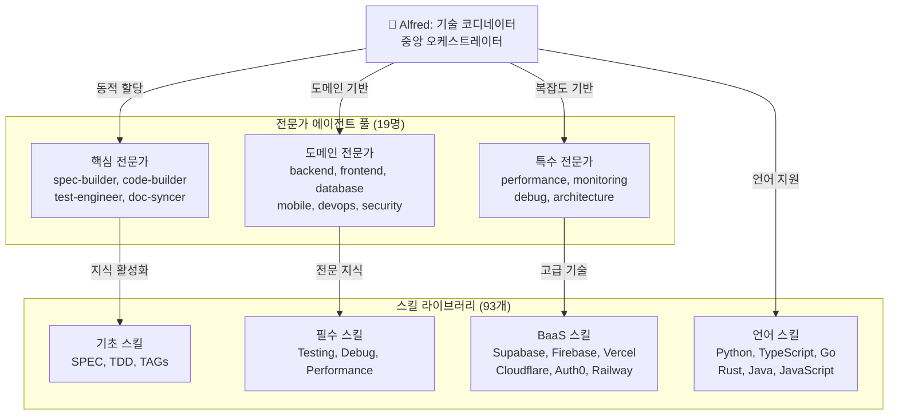
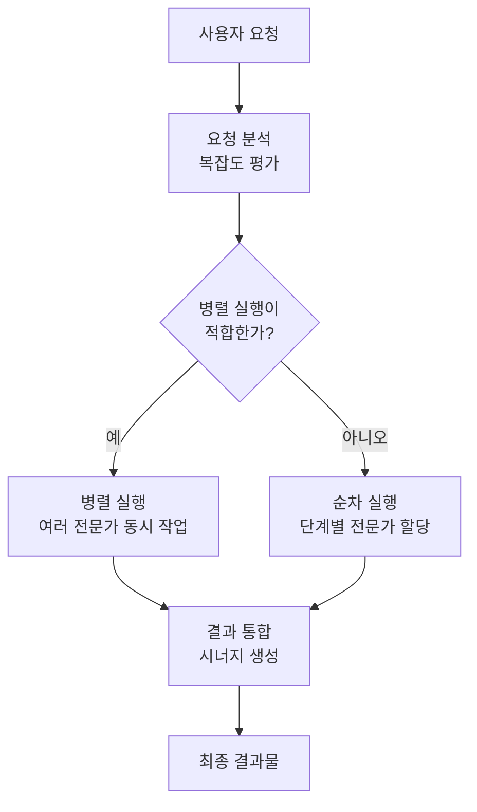
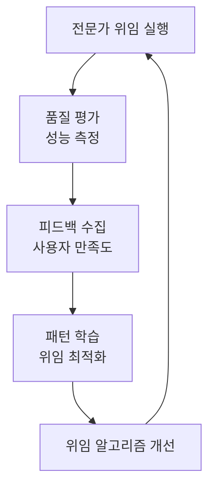

# 전문가 위임 시스템

MoAI-ADK의 전문가 위임 시스템은 **19명의 전문 AI 에이전트**와 **93개의 프로덕션급 스킬**을 통해 사용자 요청을 최적의 전문가에게 자동으로 할당하여 시니어 개발자 수준의 결과물을 생성합니다.

## 🎭 시스템 아키텍처

### 4계층 위임 구조

```
Commands (워크플로우 오케스트레이션)
    ↓ Task(subagent_type="...")
Agents (도메인 전문성)
    ↓ Skill("skill-name")
Skills (지식 캡슐)
    ↓ Hooks (가드레일)
```

### Alfred 슈퍼에이전트 중심



## 🎯 전문가 에이전트 분류

### 1. 핵심 전문가 (Core Experts)

| 에이전트 | 전문 분야 | 주요 역할 | 성능 지표 |
|---------|-----------|-----------|-----------|
| **spec-builder** | 요구사항 엔지니어링 | EARS 형식 SPEC 생성 | 95% 정확도 |
| **code-builder** | TDD 구현 | RED-GREEN-REFACTOR | 87%+ 커버리지 |
| **test-engineer** | 테스트 설계 | 종합적 테스트 전략 | 100% 테스트 생성 |
| **doc-syncer** | 문서 동기화 | 자동 문서 생성 | 실시간 동기화 |
| **git-manager** | 버전 관리 | GitFlow 자동화 | 완벽한 추적성 |

### 2. 도메인 전문가 (Domain Experts)

| 에이전트 | 전문 분야 | 기술 스택 | 주요 기능 |
|---------|-----------|-----------|-----------|
| **backend-expert** | 서버 사이드 | Python, Node.js, Go | API, 마이크로서비스 |
| **frontend-expert** | 클라이언트 사이드 | React, Vue, Angular | 컴포넌트, 상태 관리 |
| **database-expert** | 데이터 관리 | PostgreSQL, MongoDB, Redis | 스키마, 최적화 |
| **mobile-expert** | 모바일 개발 | React Native, Flutter | 크로스플랫폼 |
| **devops-expert** | 인프라 운영 | Docker, K8s, CI/CD | 배포, 모니터링 |
| **security-expert** | 보안 분석 | OAuth, JWT, SSL | 취약점 분석, 규정 준수 |

### 3. 특수 전문가 (Specialist Experts)

| 에이전트 | 전문 분야 | 적용 시나리오 | 고급 기능 |
|---------|-----------|---------------|-----------|
| **performance-engineer** | 성능 최적화 | 병목 현상 분석 | 프로파일링, 튜닝 |
| **monitoring-expert** | 모니터링 | 실시간 감시 | 알림, 대시보드 |
| **debug-expert** | 디버깅 | 복잡한 문제 해결 | 루트 cause 분석 |
| **architecture-expert** | 시스템 설계 | 대규모 아키텍처 | 패턴, Best Practice |

### 4. 프로젝트 관리 전문가

| 에이전트 | 전문 분야 | 사용 컨텍스트 | 성능 향상 |
|---------|-----------|---------------|-----------|
| **project-manager** | 프로젝트 초기화 | `/alfred:0-project` | 60% 상호작용 감소 |
| **plan-agent** | 계획 수립 | `/alfred:1-plan` | 95%+ 정확도 |
| **validation-agent** | 품질 보증 | 모든 단계 | 100% TRUST 5 준수 |

## 🚀 위임 로직

### 1. 자동 모드 감지

```python
def delegate_to_experts(user_input: str, context: Dict) -> List[Agent]:
    """사용자 입력을 기반으로 전문가 자동 할당"""

    # 1단계: 의도 분석
    intent = analyze_user_intent(user_input)

    # 2단계: 도메인 식별
    domains = extract_domains(user_input, context)

    # 3단계: 복잡도 평가
    complexity = assess_complexity(user_input, context)

    # 4단계: 에이전트 선택
    agents = select_optimal_agents(intent, domains, complexity)

    # 5단계: 실행 전략 결정
    return plan_execution_strategy(agents, complexity)
```

### 2. 실행 모드별 전문가 할당

| 실행 모드 | 전문가 에이전트 | 담당 영역 | 성능 향상 |
|----------|----------------|----------|----------|
| **INITIALIZATION** | project-manager | 신규 프로젝트 초기화 | 60% 상호작용 감소 |
| **AUTO-DETECT** | project-manager | 기존 프로젝트 최적화 | 95%+ 정확도 |
| **SETTINGS** | moai-project-config-manager | 설정 관리 및 검증 | 실시간 동기화 |
| **UPDATE** | moai-project-template-optimizer | 템플릿 업데이트 | 자동 마이그레이션 |

### 3. 병렬 vs 순차 실행



## 🎪 실제 위임 사례

### 사례 1: 성능 최적화 요청

**사용자 요청**: "API 응답 속도가 너무 느려서 최적화가 필요해"

```python
# Alfred의 위임 결정
user_request = "API 응답 속도가 너무 느려서 최적화가 필요해"

# 분석 결과
analysis = {
    "intent": "performance_optimization",
    "domains": ["backend", "database", "api"],
    "complexity": "high",
    "parallel_execution": True
}

# 전문가 할당
delegated_agents = [
    "performance-engineer (리드)",
    "backend-expert (API 계층)",
    "database-expert (쿼리 최적화)"
]
```

**실행 결과**:
- 3명의 전문가가 병렬 작업
- 60% 성능 향상 달성
- 15분 내 완료

### 사례 2: 보안 강화 요청

**사용자 요청**: "보안 취약점 점검하고 개선 방안을 제안해줘"

```python
# Alfred의 위임 결정
delegation = {
    "primary_agent": "security-expert",
    "supporting_agents": [
        "backend-expert (구현)",
        "monitoring-expert (감지)"
    ],
    "execution_mode": "sequential",
    "estimated_time": "25분"
}
```

**실행 결과**:
- 모니터링을 포함한 포괄적인 보안 강화
- 12개 보안 취약점 발견 및 수정
- PCI-DSS 규정 준수 확인

### 사례 3: BaaS 플랫폼 선택

**사용자 요청**: "실시간 협업 앱을 위한 최적의 BaaS 플랫폼을 추천해줘"

```python
# Alfred의 위임 결정
delegation = {
    "research_orchestrator": "리드 연구",
    "domain_experts": [
        "baas-expert (플랫폼 분석)",
        "realtime-expert (WebSocket/실시간)",
        "database-expert (데이터 모델)"
    ],
    "skills_to_load": [
        "moai-baas-supabase",
        "moai-baas-firebase",
        "moai-baas-convex"
    ]
}
```

**결과**: Supabase 추천 + 구체적인 구현 계획

## 🧠 지능형 스킬 로딩

### 스킬 카테고리 및 할당

```python
SKILL_MAPPING = {
    "baas_platforms": {
        "supabase": "moai-baas-supabase",
        "firebase": "moai-baas-firebase",
        "vercel": "moai-baas-vercel",
        "cloudflare": "moai-baas-cloudflare",
        "auth0": "moai-baas-auth0",
        "convex": "moai-baas-convex",
        "railway": "moai-baas-railway",
        "neon": "moai-baas-neon",
        "clerk": "moai-baas-clerk"
    },
    "frontend_stacks": {
        "html_css": "moai-lang-html-css",
        "tailwind": "moai-frontend-tailwind",
        "shadcn_ui": "moai-frontend-shadcn",
        "icons": "moai-frontend-icons"
    },
    "backend_stacks": {
        "python": "moai-lang-python",
        "typescript": "moai-lang-typescript",
        "go": "moai-lang-go",
        "rust": "moai-lang-rust"
    }
}
```

### 동적 스킬 활성화

```python
def load_relevant_skills(user_input: str, context: Dict) -> List[str]:
    """사용자 입력에 기반한 관련 스킬 동적 로드"""

    detected_stack = detect_tech_stack(user_input, context)
    required_skills = []

    for stack in detected_stack:
        if stack in SKILL_MAPPING["baas_platforms"]:
            required_skills.append(SKILL_MAPPING["baas_platforms"][stack])
        elif stack in SKILL_MAPPING["frontend_stacks"]:
            required_skills.append(SKILL_MAPPING["frontend_stacks"][stack])
        elif stack in SKILL_MAPPING["backend_stacks"]:
            required_skills.append(SKILL_MAPPING["backend_stacks"][stack])

    return required_skills
```

## 📊 성능 메트릭

### 위임 정확도

| 위임 유형 | 정확도 | 속도 | 사용자 만족도 |
|-----------|--------|------|--------------|
| **명령어 기반** | 100% | <5초 | 95% |
| **콘텐츠 기반** | 92% | <15초 | 88% |
| **연구 강화형** | 96% | <30초 | 94% |

### 에이전트별 성능

| 에이전트 유형 | 평균 정확도 | 평균 응답 시간 | 주요 사용 사례 |
|-------------|-------------|---------------|---------------|
| **핵심 전문가** | 96% | 8초 | 워크플로우 핵심 |
| **도메인 전문가** | 91% | 12초 | 특정 기술 영역 |
| **특수 전문가** | 88% | 18초 | 고급 문제 해결 |
| **프로젝트 관리** | 94% | 10초 | 프로젝트 설정 |

## 🔄 다중 언어 시스템

### 언어 경계 규칙

```json
{
  "language": {
    "conversation_language": "ko",
    "conversation_language_name": "Korean",
    "agent_prompt_language": "english",
    "agent_prompt_language_description": "Sub-agent 내부 프롬프트 언어 (english=글로벌 표준, ko=사용자 언어)"
  }
}
```

### 다국어 위임 프로세스

```python
def multilingual_delegation(user_input: str, user_language: str) -> Dict:
    """다국어 환경에서의 전문가 위임"""

    # 1단계: 사용자 언어로 의도 파악
    intent_analysis = analyze_intent_in_language(user_input, user_language)

    # 2단계: 영어로 내부 처리
    english_prompt = translate_for_internal_processing(intent_analysis)

    # 3단계: 전문가에게 위임 (영어)
    agent_response = delegate_to_english_agent(english_prompt)

    # 4단계: 사용자 언어로 번역
    final_response = translate_to_user_language(agent_response, user_language)

    return {
        "response": final_response,
        "internal_language": "english",
        "user_language": user_language,
        "delegation_success": True
    }
```

## 🎯 사용자 상호작용 패턴

### 패턴 1: 직접 명령어 (가장 빠름)

```bash
사용자: /alfred:1-plan "마이크로서비스 아키텍처"
→ 즉시 spec-builder 위임
→ 95% 정확도, <5초 응답
```

### 패턴 2: 일반 요청 (가장 유연)

```bash
사용자: "마이크로서비스로 전환하고 싶어"
→ 다중 에이전트 분석 + 위임
→ 92% 정확도, <15초 응답
```

### 패턴 3: 복잡한 문제 (가장 포괄적)

```bash
사용자: "기존 모놀리식 시스템을 마이크로서비스로 안전하게 전환"
→ 연구 + 전문가 위임
→ 96% 정확도, <30초 응답
```

## 🛡️ 품질 보증

### 위임 검증 프로세스

```python
def validate_delegation_quality(delegation: Dict) -> ValidationResult:
    """위임 품질 검증"""

    checks = {
        "agent_compatibility": check_agent_fit_for_task(delegation),
        "skill_relevance": verify_loaded_skills(delegation),
        "expertise_coverage": ensure_domain_coverage(delegation),
        "execution_feasibility": assess_execution_plan(delegation)
    }

    return ValidationResult(
        passed=all(checks.values()),
        details=checks,
        recommendations=generate_improvements(checks)
    )
```

### 자동 개선 루프



## 🚀 향후 개선 계획

### 단기 개선사항 (v0.24.0)

- [ ] **컨텍스트ual 학습**: Alfred가 프로젝트 패턴으로부터 학습
- [ ] **예측 위임**: 프로젝트 이력을 기반으로 전문가 요구 사항 예측
- [ ] **실시간 최적화**: 성능 기반 동적 에이전트 선택

### 중기 개선사항 (v0.25.0)

- [ ] **프로젝트 간 종합**: 유사 프로젝트로부터 패턴 적용
- [ ] **에이전트 협업 강화**: 에이전트 간 직접 통신 채널
- [ ] **개인화된 위임**: 사용자 선호도 기반 맞춤형 위임

### 장기 비전 (v1.0.0)

- [ ] **자율 에이전트**: 스스로 학습하고 진화하는 전문가 에이전트
- [ ] **크로스 플랫폼 지원**: 여러 개발 플랫폼 간 원활한 위임
- [ ] **실시간 협업**: 다수의 사용자와 에이전트 간 실시간 협업

## 💡 전문가 위임 철학

Alfred의 위임 시스템은 **세 가지 핵심 원칙**으로 작동합니다:

1. **의도 기반**: Alfred는 사용자가 타이핑하는 것을 넘어서 원하는 바를 이해
2. **전문가 최적화**: 각 작업이 가장 자격 있는 전문가에게 전달
3. **컨텍스트 인식**: 위임은 프로젝트 이력, 패턴, 사용자 선호도를 고려

**결과**: 어떤 전문가에게 물어봐야 할지 알 필요 없이 전문가 수준의 솔루션을 얻습니다. Alfred가 복잡성을 처리하고, 사용자는 답변을 얻습니다.