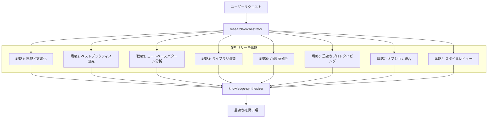

# シニアエンジニア思考パターン

MoAI-ADKは「AIをシニアエンジニアのように思考させるための8つのリサーチ戦略」を統合し、Alfredを単なるコーディングアシスタントから、シニアエンジニアのように研究・分析・学習する真のエンジニアリングパートナーへと進化させます。

## 概要

従来のAIコーディングアシスタントは、すぐに実装に飛びつくことが多く、以下のような問題を引き起こしていました：
- 要件の不完全な理解
- エッジケースと制約の見落とし
- 既存ソリューションの再発明
- 不適切なアーキテクチャ決定

**シニアエンジニアAlfred**は、実装前に体系的なリサーチアプローチに従い、包括的な理解と最適なソリューションを保証します。

## 8つのリサーチ戦略

### 1. 再現と文書化
**目的**: 体系的な問題の再現と文書化

**実行内容**:
- ステップバイステップの再現ガイド作成
- ログ、エラーメッセージ、環境コンテキストのキャプチャ
- 問題を再現するための正確な条件の文書化

**Alfred実装**:
- `research-reproducer`エージェントが体系的な再現を専門とする
- バグ分析のための包括的なコンテキストキャプチャ
- 再利用可能な再現手順の作成

**例**: ユーザーが「ログインが動作しない」と報告した場合、Alfredは修正案を提案する前に、正確なシーケンス、ブラウザ条件、ネットワーク状態、エラーパターンを再現します。

### 2. ベストプラクティスに基づくリサーチ
**目的**: 業界標準と実証済みソリューションの研究

**実行内容**:
- 他の人が類似問題を解決した方法の検索
- 業界標準、ドキュメント、パターンの分析
- 実証済みアプローチと一般的な落とし穴の特定

**Alfred実装**:
- `best-practices-researcher`エージェントが業界パターンを研究
- 確立された標準に対するアプローチの検証
- 実証済みソリューションの知識ベース維持

**例**: 認証を実装する前に、OAuth 2.0標準、JWTベストプラクティス、セッション管理パターン、セキュリティガイドラインを研究します。

### 3. コードベースに基づくリサーチ
**目的**: 既存の実装パターンの発見

**実行内容**:
- 類似機能のために既存コードを検索
- 確立されたパターンと慣習の特定
- 再利用可能なコンポーネントとアプローチの発見

**Alfred実装**:
- 強化された`codebase-analyst`エージェントが実装パターンを発見
- 確立されたコーディング慣習の認識
- 重複機能の防止

**例**: 新しい分析追跡を追加する前に、既存のイベント追跡システムを発見し、確立されたパターンと統合します。

### 4. ライブラリに基づくリサーチ
**目的**: ツール機能の深い理解

**実行内容**:
- インストール済みライブラリのソースコード分析
- 文書化されていない機能と能力の特定
- ライブラリの進化と互換性の理解

**Alfred実装**:
- `library-researcher`エージェントがライブラリ機能を分析
- ソースコードとテストケースの読み取り
- 隠された機能と最適な使用パターンの発見

**例**: React Hook Formソースコードを研究し、文書化されていない検証パターンとパフォーマンス最適化を発見します。

### 5. Git履歴の研究
**目的**: 過去の決定と進化からの学習

**実行内容**:
- 決定のコンテキストを理解するためのコミット履歴の分析
- 特定のアプローチが選択された理由の特定
- 過去の成功と失敗からの学習

**Alfred実装**:
- 強化された`git-historian`エージェントが過去のパターンを分析
- 設計決定の進化の理解
- 過去の間違いの繰り返し防止

**例**: ライブラリをアップグレードする前に、過去のアップグレード試行、特定のバージョンが選択された理由、遭遇した問題を分析します。

### 6. 明確化のためのプロトタイピング
**目的**: 要件探索のための迅速なプロトタイピング

**実行内容**:
- オプション探索のための迅速な使い捨てバージョンの作成
- インタラクションを通じて曖昧な要件の明確化
- 設計コンセプトの迅速な反復を可能にする

**Alfred実装**:
- `prototype-creator`エージェントが迅速なプロトタイプを作成
- 例を通じた要件明確化の促進
- 迅速な設計探索を可能にする

**例**: ステークホルダーが要件を視覚化し明確化できるように、新機能のための3つの異なるUIレイアウトを作成します。

### 7. オプションによる統合
**目的**: 複数のアプローチの生成と比較

**実行内容**:
- すべての戦略の研究を一貫したオプションに統合
- 異なるアプローチ間のトレードオフの評価
- 長所と短所が明確な選択肢の提示

**Alfred実装**:
- `synthesis-agent`エージェントが研究結果を統合
- 複数のソリューションアプローチを生成
- 明確なトレードオフと意思決定フレームワークの提供

**例**: データ同期のための3つのアプローチ（リアルタイム、バッチ、ハイブリッド）を、複雑性、パフォーマンス、保守への影響に関する詳細な分析とともに提示します。

### 8. スタイルエージェントによるレビュー
**目的**: 多角的な品質検証

**実行内容**:
- 複数の視点から専門知識の適用
- 異なる品質基準に対する決定の検証
- 包括的なレビュー範囲の保証

**Alfred実装**:
- 複数の`style-reviewer`エージェントが専門レビューを提供
- セキュリティ、パフォーマンス、保守性の視点
- 包括的な品質検証

**例**: 提案された認証システムをセキュリティ専門家、パフォーマンス専門家、保守性専門家の視点からレビューします。

## 並列リサーチ操作

重要な革新は、8つの戦略を順次ではなく**並列**で実行することです：



## 学習と蓄積システム

### 知識の蓄積
- すべてのリサーチセッションがプロジェクト知識ベースに貢献
- 発見されたパターンが自動的にキャプチャされ再利用される
- 蓄積された経験を通じて時間とともに決定品質が向上

### 適応型知能
- Alfredがプロジェクトの固有のパターンと好みを学習
- 各セッションでリサーチがより迅速かつ正確になる
- 特定のコードベース履歴からカスタマイズされたベストプラクティスが出現

### 記憶とコンテキスト
- 成功したパターンとアプローチの長期記憶
- プロジェクト履歴に基づくコンテキスト認識推奨事項
- 類似問題間の自動知識転移

## 実際の影響

### 事例研究1: 大量メールアーカイブ（53,000通）

**従来のAIアプローチ**:
- ユーザー: 「これらのメールをすべてアーカイブしてください」
- AI: 「単純な一括削除操作」
- 結果: Gmailレート制限、タイムアウト、不満なユーザー

**シニアエンジニアAlfredアプローチ**:
1. **研究**: Gmail API制限、バッチ処理パターン、ユーザーエクスペリエンス
2. **分析**: コードベースの既存の一括操作
3. **プロトタイピング**: 3つの異なる処理アプローチ
4. **統合**: 進行状況追跡+リトライロジックのあるバッチ処理
5. **レビュー**: パフォーマンス、UX、セキュリティの視点
6. **結果**: 進行状況追跡、エラー回復がある堅牢なソリューション、満足なユーザー

### 事例研究2: 認証システム設計

**従来のAIアプローチ**:
- ユーザー: 「アプリに認証を追加してください」
- AI: 基本的なJWT実装
- 結果: セキュリティ脆弱性、スケーラビリティ問題

**シニアエンジニアAlfredアプローチ**:
1. **研究**: OAuth 2.0標準、JWTベストプラクティス、セッション管理
2. **分析**: コードベースの既存認証パターン
3. **基盤**: ライブラリ機能（Auth0、Firebase Auth、カスタム）
4. **履歴**: 以前の認証試行とその進化
5. **プロトタイピング**: 複数の認証フロー
6. **統合**: 複数プロバイダーサポートのある包括的ソリューション
7. **レビュー**: セキュリティ、パフォーマンス、保守性の検証
8. **結果**: エンタープライズ級認証システム

## 実装統合

### 計画フェーズ（`/alfred:1-plan`）
- 8つの戦略による並列リサーチ
- 包括的な要件分析
- リスク特定と緩和計画
- トレードオフのある複数のソリューションアプローチ

### 実装フェーズ（`/alfred:2-run`）
- 開発中の継続的リサーチ
- 各ステップでのベストプラクティス検証
- 多角的コードレビュー
- パターン認識と再利用

### 同期フェーズ（`/alfred:3-sync`）
- パターン抽出と知識キャプチャ
- 学習されたインサイトの文書化
- チーム知識共有
- 推奨事項の継続的改善

## ベネフィット

### 個人開発者向け
- **コンテキストスイッチングの削減**: Alfredがプロジェクト全体のコンテキストを記憶
- **より良い決定**: 推測ではなくリサーチベースの決定
- **より迅速な開発**: 学習されたパターンとアプローチの再利用
- **継続的学習**: 各セッションでAlfredがより賢くなる

### チーム向け
- **一貫した品質**: チームメンバー全体にわたるリサーチベースの決定
- **知識共有**: 集団的学習とパターン認識
- **リスク緩和**: 実装前の包括的分析
- **より迅速なオンボーディング**: 新しいメンバーが蓄積された知識から利益を得る

### 組織向け
- **技術的負債の削減**: よく研究されたアーキテクチャ決定
- **向上したセキュリティ**: すべての決定に対するセキュリティ専門家レビュー
- **より良いROI**: 包括的分析に基づく最適化されたソリューション
- **イノベーション文化**: 問題解決に対するリサーチ優先アプローチ

## 始め方

シニアエンジニア思考パターンはMoAI-ADK v0.22.0+に自動統合されています。追加設定は必要ありません。

### 基本的な使用法
いつものようにAlfredコマンドを使用するだけです - リサーチ戦略が自動的に適用されます：

```bash
# リサーチとともに計画
/alfred:1-plan "ユーザー認証システムの追加"

# 継続的リサーチとともに実装
/alfred:2-run AUTH-001

# 文書化と学習
/alfred:3-sync
```

### 高度な使用法
リサーチ戦略のより多くの制御：

```bash
# 特定のトピックに関する詳細なリサーチ
/alfred:research "認証ベストプラクティス"

# プロジェクトパターンからの学習
/alfred:learn

# 現在の実装レビュー
/alfred:review-security
/alfred:review-performance
```

## さらに学ぶ

- [リサーチ戦略詳細](./research-strategies)
- [事例研究](./case-studies)
- [実装ガイド](./implementation-guide)
- [ベストプラクティス](./best-practices)